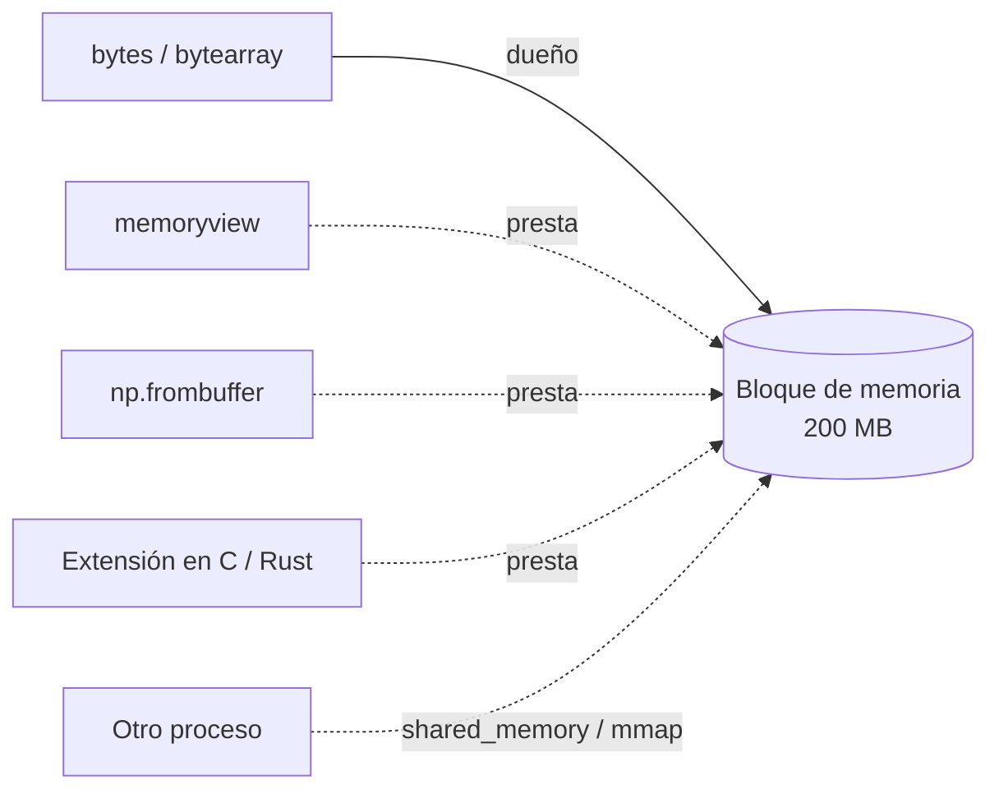

# 🔗 ff06 — El buffer compartido y la copia cero

> Python para desarrolladores Java senior · **Carta** · Track `ff` — La frontera nativa ·
> sección 6 de 8
> Se lee suelta: no hace falta ninguna otra sección de la carta.
> Versiones verificadas contra PyPI el 05/10/2026 · Código probado el 05/10/2026 con Python 3.14.7,
> en contenedor: las salidas son las de esa corrida.

---

## 🎯 1. Qué problema resuelve

Las secciones anteriores cruzaron la frontera con arreglos sin copiarlos: `ctypes` con `from_buffer`, Cython con *memoryviews*, Rust con `as_slice`. Todo eso
descansa en una pieza de CPython que casi nadie nombra: el **protocolo de *buffers***, la forma en que un objeto le presta su memoria a otro sin copiarla. Es lo que
hace que NumPy, Arrow, `bytes`, `mmap` y las extensiones nativas se pasen arreglos de cientos de megas en microsegundos.

Cuando no se usa, el costo aparece en dos lugares: en memoria, porque cada rebanada es una copia, y entre procesos, porque `multiprocessing` serializa con `pickle`
todo lo que envía. Esta sección mide las dos cosas y sus alternativas: `memoryview`, `np.frombuffer`, `shared_memory` y Arrow mapeado desde disco.

---

## 🧠 2. El modelo



| Herramienta | Qué comparte | Con quién |
|---|---|---|
| `memoryview` | Una vista (o rebanada) de un objeto con *buffer* | El mismo proceso |
| `np.frombuffer`, `np.ndarray(buffer=…)` | La memoria de otro objeto, como arreglo | El mismo proceso |
| `multiprocessing.shared_memory` | Un bloque de memoria con nombre | Otros procesos de la máquina |
| `mmap`, `pa.memory_map` | Un archivo, como memoria | Cualquier proceso que lo abra; el sistema operativo carga las páginas al leerlas |
| Arrow (formato IPC) | Columnas con un formato fijo en memoria | Procesos y lenguajes (Java, Rust, C++) sin convertir |

### 🩻 Esto sí funciona igual

Es `ByteBuffer.slice()`, `asReadOnlyBuffer()` y `FileChannel.map()` de Java NIO: una vista sobre memoria que no se copia, y un archivo mapeado que el sistema operativo
pagina. Arrow es el mismo formato en Java y en Python; un archivo escrito por uno se mapea desde el otro.

---

## 💻 3. El ejemplo que corre

`copia_cero.py`:

```python
"""Copiar o compartir: memoryview, NumPy, memoria compartida entre procesos y Arrow mapeado de disco."""

import os
import time
from multiprocessing import Process, Queue, shared_memory

import numpy as np
import pyarrow as pa


def rss_mb():
    with open("/proc/self/statm") as f:
        return int(f.read().split()[1]) * os.sysconf("SC_PAGE_SIZE") / 2**20


def timed(fn):
    start = time.perf_counter(); result = fn(); return result, (time.perf_counter() - start) * 1000


def consume_pickled(inbox, outbox):
    outbox.put(float(inbox.get().sum()))


def consume_shared(name, n, queue):
    shm = shared_memory.SharedMemory(name=name)
    data = np.ndarray((n,), dtype=np.float64, buffer=shm.buf)
    queue.put(float(data.sum()))
    del data
    shm.close()


if __name__ == "__main__":
    N = 25_000_000                                            # 200 MB de float64
    blob = bytes(200 * 2**20)

    # 1) Rebanar: bytes copia, memoryview no
    before = rss_mb()
    part, ms = timed(lambda: blob[: 100 * 2**20])
    print(f"bytes[:100 MB]      {ms:7.2f} ms · memoria +{rss_mb() - before:5.0f} MB")
    del part
    before = rss_mb()
    view, ms = timed(lambda: memoryview(blob)[: 100 * 2**20])
    print(f"memoryview[:100 MB] {ms:7.2f} ms · memoria +{rss_mb() - before:5.0f} MB")

    # 2) NumPy sobre un buffer ajeno: la misma memoria
    raw = bytearray(8 * 4)
    shared = np.frombuffer(raw, dtype=np.float64)
    shared[0] = 42.0
    print("np.frombuffer comparte la memoria:", raw[:8] == np.float64(42.0).tobytes())

    # 3) Entre procesos: serializar contra memoria compartida
    data = np.random.default_rng(7).random(N)
    inbox, queue = Queue(), Queue()                         # dos colas: quien envía no lee su propio envío
    worker = Process(target=consume_pickled, args=(inbox, queue))
    start = time.perf_counter(); worker.start(); inbox.put(data); result = queue.get(); worker.join()
    print(f"proceso, serializado        {(time.perf_counter() - start) * 1000:7.1f} ms · suma {result:,.0f}")

    shm = shared_memory.SharedMemory(create=True, size=data.nbytes)
    np.ndarray(data.shape, dtype=data.dtype, buffer=shm.buf)[:] = data
    worker = Process(target=consume_shared, args=(shm.name, N, queue))
    start = time.perf_counter(); worker.start(); result = queue.get(); worker.join()
    print(f"proceso, memoria compartida {(time.perf_counter() - start) * 1000:7.1f} ms · suma {result:,.0f}")
    shm.close(); shm.unlink()

    # 4) Arrow: escribir una vez, mapear en vez de leer
    table = pa.table({"valor": data})
    with pa.OSFile("valores.arrow", "wb") as sink, pa.ipc.new_file(sink, table.schema) as writer:
        writer.write_table(table)
    before = rss_mb()
    mapped, ms = timed(lambda: pa.ipc.open_file(pa.memory_map("valores.arrow")).read_all())
    column = mapped.column("valor").chunk(0).to_numpy(zero_copy_only=True)   # un solo bloque: se puede sin copiar
    print(f"Arrow mapeado de disco {ms:7.2f} ms · memoria +{rss_mb() - before:5.0f} MB · {len(column):,} valores")
    before = rss_mb()
    read, ms = timed(lambda: pa.ipc.open_file(pa.OSFile("valores.arrow")).read_all())
    print(f"Arrow leído a memoria  {ms:7.2f} ms · memoria +{rss_mb() - before:5.0f} MB")
    os.remove("valores.arrow")
```

```bash
pip install numpy pyarrow
python3 copia_cero.py           # en Docker, con --shm-size=512m: shared_memory vive en /dev/shm
```

Salida (Python 3.14.7, 05/10/2026) (los milisegundos son de la máquina que corre):

```text
bytes[:100 MB]        24.87 ms · memoria +  100 MB
memoryview[:100 MB]    0.00 ms · memoria +    0 MB
np.frombuffer comparte la memoria: True
proceso, serializado          449.4 ms · suma 12,501,650
proceso, memoria compartida    26.5 ms · suma 12,501,650
Arrow mapeado de disco   14.53 ms · memoria +    1 MB · 25,000,000 valores
Arrow leído a memoria   222.47 ms · memoria +  192 MB
```

Rebanar 100 MB de un `bytes` copia los 100 MB y tarda 25 ms; la misma rebanada con `memoryview` no copia nada. Pasarle 200 MB a otro proceso por una cola
cuesta **449 ms** —serializar, enviar por una tubería y deserializar—; con `shared_memory` el otro proceso lee el mismo bloque y todo, **incluido arrancar el
proceso**, tarda **26,5 ms**. Y Arrow: abrir el archivo mapeado y tener los 25 millones de valores como arreglo de NumPy cuesta 14,5 ms y un mega; leerlo a memoria,
222 ms y 192 MB.

**Detalles con intención**

- **"memoria +1 MB" del mapeo** no significa que los datos no ocupen memoria: el sistema operativo carga cada página cuando se lee, y la cuenta como caché de archivo,
  compartida y liberable. Sumar la columna la traería entera; lo que no hay es una **copia** en la memoria del proceso.
- **`chunk(0).to_numpy(zero_copy_only=True)`**: una columna de Arrow puede estar en varios bloques; un arreglo de NumPy necesita uno contiguo. Con un bloque, se
  comparte; con varios, `zero_copy_only=True` falla en vez de copiar en silencio.
- **Dos colas en la versión serializada**: con una sola, el proceso principal puede leer su propio envío y el trabajador esperar para siempre. Pasó al probar esta
  sección.
- **`if __name__ == "__main__"`** es obligatorio: desde Python 3.14 el método de arranque por defecto en Linux es `forkserver`, que importa el módulo en cada
  proceso hijo.
- **`shm.unlink()`** borra el bloque del sistema; sin él, queda en `/dev/shm` aunque el programa termine.

---

## ⚠️ 4. Lo que se rompe

**El bloque compartido que nadie borra.** `shared_memory` crea un archivo en `/dev/shm`; un programa que muere sin `unlink()` lo deja ahí, ocupando RAM, hasta
reiniciar. Se envuelve en `try`/`finally` y, en servicios, se limpian los nombres conocidos al arrancar.

**Escribir mientras otro lee.** La memoria compartida no tiene candados: dos procesos que escriben el mismo bloque se pisan. Se comparte para leer, o se coordina con
un `Lock` de `multiprocessing`.

**El `memoryview` que retiene al dueño.** Mientras exista una vista, el objeto original no se libera ni puede cambiar de tamaño (`bytearray.extend` falla con
`BufferError`). Se libera con `view.release()` o saliendo del bloque `with`.

**`/dev/shm` chico en contenedores.** Docker da 64 MB por defecto. Crear un bloque de 200 MB funciona; escribirlo mata el proceso con `Bus error` (código 135), sin
excepción, y el `resource_tracker` avisa al salir de un bloque huérfano. Se sube con `--shm-size`.

---

## ⚖️ 5. Cuándo NO usarlo

**Para datos chicos.** Serializar un diccionario de cien entradas cuesta microsegundos; la memoria compartida agrega nombres, limpieza y coordinación.

**Si cada proceso puede leer lo suyo.** El camino base lo midió: procesos que leen su propia parte ganan a los que reciben los datos (`BENCHMARKS.md` §14: 1,86×
contra 0,88×). Sin datos que viajen, no hay nada que compartir.

**Entre máquinas.** Esto es memoria de una máquina; entre máquinas, Arrow Flight o un formato en disco compartido.

---

## 🧪 6. Ejercicios (10)

**🟢 Fácil (1–3)**

1. Corre el ejemplo. **Criterio:** las siete líneas, y de dónde salen los 449 ms.
2. Rebana un `bytearray` con `memoryview`, modifica la vista y mira el original. **Criterio:** el cambio aparece en los dos.
3. Intenta `extend` sobre un `bytearray` con una vista viva. **Criterio:** el `BufferError` y cómo se evita.

**🟡 Intermedio (4–6)**

4. Corre la parte de Arrow sumando la columna mapeada. **Criterio:** el tiempo de la suma y la memoria del proceso antes y después.
5. Comparte el arreglo entre cuatro procesos que suman cada uno su cuarta parte. **Criterio:** el tiempo contra hacerlo con cuatro colas.
6. Lee con Java (Arrow para Java) el archivo `valores.arrow`. **Criterio:** los mismos 25 millones de valores, sin conversión.

**🟠 Difícil (7–9)**

7. Mata el proceso a la mitad (`kill -9`) sin `unlink`. **Criterio:** el bloque sigue en `/dev/shm`, y un *script* que lo limpia.
8. Escribe una extensión de Cython o Rust (`ff03`, `ff05`) que reciba un `memoryview` de un `mmap`. **Criterio:** procesa un archivo de 1 GB sin cargarlo.
9. Pasa el arreglo entre procesos con `multiprocessing.Pool` y con `concurrent.futures.ProcessPoolExecutor`. **Criterio:** los dos tiempos y por qué se parecen al
   serializado.

**🔴 Muy difícil (10)**

10. Diseña cómo se reparten 2 GB de datos entre ocho procesos trabajadores. **Criterio:** una página. *Rúbrica:* (a) serializar, compartir o que cada uno lea lo suyo,
    con números medidos; (b) quién crea y quién borra la memoria; (c) qué pasa si un trabajador muere; (d) qué cambia en un contenedor.

---

## 📚 7. Referencias

**Documentación oficial**

- `memoryview` y el protocolo de *buffers*: https://docs.python.org/3/library/stdtypes.html#memoryview
- `multiprocessing.shared_memory`: https://docs.python.org/3/library/multiprocessing.shared_memory.html
- Arrow, lectura y escritura del formato IPC: https://arrow.apache.org/docs/python/ipc.html

**Orden de lectura sugerido:** la documentación de `memoryview`; después la de `shared_memory`, en especial sus ejemplos con NumPy.

---

## 🚀 8. Cierre

El protocolo de *buffers* es lo que deja que Python, NumPy, Arrow y las extensiones se presten memoria sin copiarla. Usado a propósito, una rebanada no cuesta nada,
200 MB cruzan a otro proceso en 26 ms en vez de 449, y un archivo de Arrow se abre en 14 ms en vez de leerse en 222. El precio es administrar la memoria a mano: quién
la crea, quién la borra y quién escribe.

**La señal de que quedó bien:** *"Los datos grandes no viajan por colas: se comparten o se mapean, y cada bloque compartido tiene quien lo borre."*

> 🏷️ **Cierra la sección con su tag**, cuando los ejercicios que elegiste estén hechos:
>
> ```bash
> git tag -a op-ff-fase-06 -m "op ff06 cerrada: memoryview, memoria compartida y Arrow mapeado, medidos"
> ```
>
> Los commits llevan su prefijo (`op ff06: …`) y los de ejercicio su número
> (`op ff06 ej07: …`).
