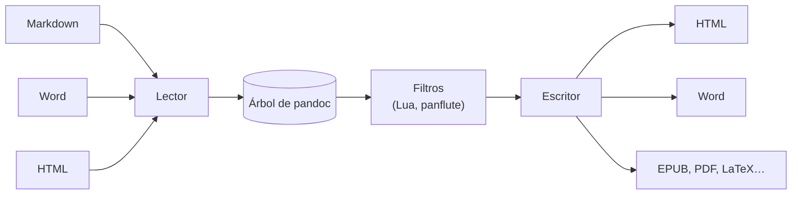

# 🔁 ar06 — Markdown, HTML y pandoc

> Python para desarrolladores Java senior · **Carta** · Track `ar` — Archivos y multimedia ·
> sección 6 de 10
> Se lee suelta: no hace falta ninguna otra sección de la carta.
> Versiones verificadas contra PyPI el 05/10/2026 · Código probado el 05/10/2026 con Python 3.14.7,
> en contenedor: las salidas son las de esa corrida.

---

## 🎯 1. Qué problema resuelve

El informe se escribe en Markdown, pero lo piden en Word; la página se publica en HTML, pero alguien quiere un PDF o un EPUB. **pandoc** es el convertidor universal
de documentos: lee unos cuarenta formatos y escribe más de sesenta, y lo hace mejor que cualquier combinación de bibliotecas de Python. No es de Python —está escrito
en Haskell—, y esa es la pregunta de esta sección y de todo el track: **¿envolver el binario, o llamarlo?**

`pypandoc` es el envoltorio, y resulta ser muy delgado: arma la línea de comandos y llama al mismo binario. La sección mide lo que cuesta cada llamada a pandoc contra
una biblioteca que corre en el proceso, muestra la conversión de ida y vuelta por Word, y la opción por defecto que deja pasar `<script>` de un Markdown a un HTML.

---

## 🧠 2. El modelo

| Tarea | La herramienta | Por qué |
|---|---|---|
| Markdown → HTML, muchas veces por segundo | `markdown-it-py` (en el proceso) | Sin arrancar un programa por documento |
| Markdown ⇄ Word, ODT, EPUB, LaTeX | **pandoc** | Nadie más lo hace con esa calidad |
| Llamar a pandoc desde Python | `subprocess` o `pypandoc` | `pypandoc` arma la línea de comandos; el trabajo es del binario |
| Ajustar la conversión | Filtros de pandoc (Lua, o Python con `panflute`) | Transforman el árbol del documento entre lectura y escritura |



### 🩻 Esto sí funciona igual

Es el modelo de un compilador: un lector por formato, una representación intermedia común y un escritor por formato. En Java, Flexmark o Apache Tika siguen la
misma idea en un solo sentido; pandoc la hace en todas las direcciones.

---

## 💻 3. El ejemplo que corre

`conversion.py`:

```python
"""pandoc orquestado desde Python: costo por llamada, lo que se pierde en el viaje y el HTML que deja pasar."""

import shutil
import subprocess
import time

import pypandoc
from markdown_it import MarkdownIt

SOURCE = """# Informe de la sede Suba

La franquicia **cumplió** la meta de octubre.

| Sede | Estado |
|---|---|
| Suba | Cumplió |
| Zipaquirá | Pendiente |

Nota al pie de la tabla[^1].

[^1]: Cifras de muestra.

<script>alert("hola")</script>
"""

print("pandoc:", subprocess.run(["pandoc", "--version"], capture_output=True, text=True).stdout.splitlines()[0])


def pandoc(text, *args):
    return subprocess.run(["pandoc", *args], input=text, capture_output=True, text=True, check=True).stdout


# 1) Costo por llamada: el binario contra una biblioteca en el proceso
md = MarkdownIt("commonmark").enable("table")
start = time.perf_counter()
for _ in range(50):
    pandoc(SOURCE, "-f", "markdown", "-t", "html")
per_pandoc = (time.perf_counter() - start) / 50 * 1000
start = time.perf_counter()
for _ in range(50):
    md.render(SOURCE)
per_lib = (time.perf_counter() - start) / 50 * 1000
print(f"Markdown a HTML · pandoc {per_pandoc:5.1f} ms por documento · markdown-it-py {per_lib:5.2f} ms")

# 2) El HTML crudo: pandoc lo deja pasar salvo que se le quite la extensión
html = pandoc(SOURCE, "-f", "markdown", "-t", "html")
safe = pandoc(SOURCE, "-f", "markdown-raw_html", "-t", "html")
print(f"<script> en la salida · por defecto: {'<script>' in html} · con markdown-raw_html: {'<script>' in safe}")

# 3) El viaje de ida y vuelta: Markdown → Word → Markdown
pypandoc.convert_text(SOURCE, "docx", format="markdown", outputfile="informe.docx")
back = pypandoc.convert_file("informe.docx", "gfm")
print("después de pasar por Word:")
print("\n".join("  " + line for line in back.strip().splitlines()))
print(f"pypandoc llama al binario del sistema: {pypandoc.get_pandoc_path()!r} → {shutil.which('pandoc')}, versión {pypandoc.get_pandoc_version()}")
```

```bash
apt-get install pandoc          # el de Debian: 3.1.11.1; la última publicada es la 3.12
pip install pypandoc markdown-it-py
python3 conversion.py
```

Salida (Python 3.14.7, 05/10/2026) (los milisegundos son de la máquina que corre):

```text
pandoc: pandoc 3.1.11.1
Markdown a HTML · pandoc  17.1 ms por documento · markdown-it-py  0.17 ms
<script> en la salida · por defecto: True · con markdown-raw_html: False
después de pasar por Word:
  # Informe de la sede Suba
  
  La franquicia **cumplió** la meta de octubre.
  
  | Sede      | Estado    |
  |-----------|-----------|
  | Suba      | Cumplió   |
  | Zipaquirá | Pendiente |
  
  Nota al pie de la tabla[^1].
  
  [^1]: Cifras de muestra.
pypandoc llama al binario del sistema: 'pandoc' → /usr/bin/pandoc, versión 3.1.11.1
```

Cada llamada a pandoc cuesta **17 ms**; `markdown-it-py`, en el proceso, **0,17**: cien veces menos, porque no arranca un programa. Para convertir un documento, 17 ms
no importan; para renderizar cada comentario de una página, sí. Por defecto pandoc **deja pasar el `<script>`** del Markdown al HTML; quitándole la extensión
`raw_html` al lector, lo descarta. Y el viaje de ida y vuelta por Word conserva el título, la negrita, la tabla y la nota al pie: lo único que se perdió fue el
`<script>`, que Word no puede guardar. `pypandoc`, al final, llama a `pandoc` del `PATH`: el mismo binario, la misma versión.

**Detalles con intención**

- **`-f markdown-raw_html`**: el signo menos le quita una extensión al lector. pandoc tiene decenas (`+smart`, `-raw_html`, `+emoji`), y la conversión segura de texto de
  usuarios empieza por saber cuáles están activas (`pandoc --list-extensions=markdown`).
- **`gfm`** como formato de salida escribe el Markdown de GitHub, con tablas de tubería; `markdown` a secas escribe el dialecto de pandoc.
- **`subprocess.run(..., check=True)`**: si pandoc falla, la excepción trae el código de salida; `stderr` dice por qué (el manejo de errores del camino base, Fase 05).
- **La versión de Debian va atrás** de la publicada (3.1.11.1 contra 3.12). El paquete `pypandoc_binary` trae pandoc adentro, de la versión que fija; en un contenedor,
  conviene decidir cuál y escribirlo.

---

## ⚠️ 4. Lo que se rompe

**El `<script>` que pasa.** Convertir con pandoc el Markdown que escriben los usuarios a HTML sin `-raw_html` ni un sanitizador (`nh3`, del track `tx`) es una
inyección de JavaScript esperando ocurrir.

**pandoc por documento en un bucle caliente.** 17 ms por llamada son 17 segundos por cada mil documentos. Se usa una biblioteca en el proceso, o se juntan los
documentos en una sola llamada.

**La versión que cambia la salida.** Un contenedor que instala "el pandoc de la distribución" cambia de versión al cambiar la imagen base, y la salida HTML o Word
cambia con ella. Se fija la versión.

**El documento de Word con estilos propios.** pandoc escribe con sus estilos por defecto; para usar los de la casa se le pasa `--reference-doc=plantilla.docx`.

---

## ⚖️ 5. Cuándo NO usarlo

**Para Markdown a HTML en una aplicación web.** Una biblioteca en el proceso (`markdown-it-py`, `mistune`) y un sanitizador; pandoc es para documentos.

**Si solo se necesita Word con datos.** `docxtpl` (`ar05`) llena una plantilla con el formato exacto de la casa; pandoc convierte, no maqueta.

**Para PDF con diseño.** pandoc genera PDF pasando por LaTeX o Typst (`ar07`); para controlar el diseño, se escribe directamente en esos.

---

## 🧪 6. Ejercicios (10)

**🟢 Fácil (1–3)**

1. Corre el ejemplo. **Criterio:** las líneas, y por qué pandoc tarda cien veces más que `markdown-it-py`.
2. Convierte `informe.docx` a HTML con pandoc. **Criterio:** la tabla y la nota al pie en el HTML.
3. Lista las extensiones activas del lector `markdown` (`pandoc --list-extensions=markdown`). **Criterio:** las que tienen que ver con HTML crudo.

**🟡 Intermedio (4–6)**

4. Convierte el Markdown a Word con `--reference-doc` y una plantilla con otra fuente y otro color de títulos. **Criterio:** el Word sale con los estilos de la plantilla.
5. Escribe un filtro de pandoc en Lua que ponga en mayúsculas los títulos. **Criterio:** el HTML sale con títulos en mayúsculas.
6. Convierte cincuenta documentos con una sola llamada a pandoc (varias entradas, un separador). **Criterio:** el tiempo total contra cincuenta llamadas.

**🟠 Difícil (7–9)**

7. Escribe el mismo filtro con `panflute` en Python. **Criterio:** funciona igual, y el tiempo contra el de Lua.
8. Sanea la salida HTML de pandoc con `nh3` dejando pasar tablas y notas al pie. **Criterio:** el `<script>` no está y la tabla sí.
9. Fija pandoc 3.12 en un `Dockerfile` (binario oficial o `pypandoc_binary`). **Criterio:** la imagen dice la versión exacta.

**🔴 Muy difícil (10)**

10. Genera un EPUB con tres informes como capítulos (`pandoc -t epub3`), con portada y metadatos, y valídalo con EPUBCheck. **Criterio:** EPUBCheck sin errores.
    *Rúbrica:* (a) la estructura del EPUB por dentro (es un *zip* con XHTML y un OPF); (b) los metadatos (título, autor, idioma); (c) qué se ve distinto en dos lectores;
    (d) qué tuviste que corregir para pasar la validación.

---

## 📚 7. Referencias

**Documentación oficial**

- El manual de pandoc: https://pandoc.org/MANUAL.html
- Filtros de pandoc en Lua: https://pandoc.org/lua-filters.html
- pypandoc: https://github.com/JessicaTegner/pypandoc

**Orden de lectura sugerido:** la sección "Extensions" del manual (qué hace cada `+` y `-`); después la de filtros en Lua.

---

## 🚀 8. Cierre

pandoc es el binario que convierte documentos entre casi todos los formatos, y `pypandoc` es una capa delgada que lo llama. Cuesta 17 ms por llamada contra 0,17 de una
biblioteca en el proceso, deja pasar el HTML crudo salvo que se le diga, y su versión cambia con la imagen base. Para documentos, el binario; para renderizar en caliente,
la biblioteca.

**La señal de que quedó bien:** *"pandoc está fijado en su versión, convierte documentos y no comentarios, y el Markdown de usuarios no llega a HTML sin `-raw_html`."*

> 🏷️ **Cierra la sección con su tag**, cuando los ejercicios que elegiste estén hechos:
>
> ```bash
> git tag -a op-ar-fase-06 -m "op ar06 cerrada: pandoc orquestado, su costo por llamada y el HTML crudo"
> ```
>
> Los commits llevan su prefijo (`op ar06: …`) y los de ejercicio su número
> (`op ar06 ej07: …`).
