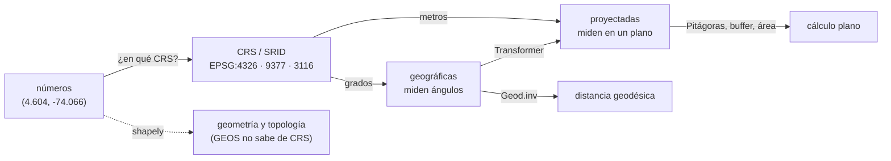

# 🌐 gi01 — El modelo: geometría, proyección, topología

> Python para desarrolladores Java senior · **Carta** · Track `gi` — Geoespacial ·
> sección 1 de 7
> Se lee suelta: no hace falta ninguna otra sección de la carta.
> Versiones verificadas contra PyPI el 07/10/2026 · Código probado el 07/10/2026 con Python 3.14.7,
> en contenedor: las salidas son las de esa corrida.

---

## 🎯 1. Qué problema resuelve

El modelo de ausentismo de Áurea tiene, en la lista de variables que la historia de la empresa le promete, una que suena trivial: **la distancia del paciente a la
sede**. La primera versión la calcula en la hoja de cálculo, con Pitágoras sobre latitud y longitud y un `* 111` al final. Funciona, y ese es el problema: funciona
en Bogotá por una casualidad geográfica que no viaja, y el día que llega un archivo de coordenadas de otra fuente —el catastro, un proveedor, una exportación de un
SIG— los números pueden quedar desplazados **miles de kilómetros** sin que nada falle.

El dato con coordenadas tiene tres capas que el código de negocio suele aplanar en dos columnas: la **geometría** (puntos, líneas, polígonos), el **sistema de
referencia** que dice qué significan esos números (el CRS, identificado por su código EPSG o SRID), y la **topología** (qué geometrías son válidas, qué toca a qué).
Python no inventó ninguna de las tres: es el pegamento sobre **PROJ** (proyecciones) y **GEOS** (geometría), dos bibliotecas en C que usa también PostGIS, QGIS y
el resto de la industria. `pyproj` envuelve a PROJ y `shapely` a GEOS.

Esta sección hace el modelo con las diez sedes de Áurea —el centro aproximado de cada barrio, no direcciones— y mide tres maneras de calcular una distancia y dos
maneras de equivocarse por kilómetros.

---

## 🧠 2. El modelo



Las tres ideas que ordenan el track:

- **Un par de números no es una posición.** `(4.604, -74.066)` solo significa "el centro de Bogotá" si se sabe que está en EPSG:4326 (WGS84, grados) y en qué
  orden van los ejes. Los mismos números en otro CRS caen en otro lado.
- **Las geográficas miden ángulos; las proyectadas, metros.** Distancias, áreas y radios se calculan sobre el elipsoide (`pyproj.Geod`) o después de proyectar a un
  plano local. Colombia tiene el suyo oficial desde 2020: **EPSG:9377**, *MAGNA-SIRGAS / Origen-Nacional* (CTM12), que reemplazó a las cinco zonas de origen
  anteriores (la de Bogotá es EPSG:3116).
- **`shapely` no sabe de CRS.** Opera sobre números en un plano cartesiano. Si le das grados, calcula áreas en "grados cuadrados" sin protestar.

### 🪞 Tu instinto de Java dice… y esta vez se equivoca

*"Un `Point` tiene `x` e `y`, y `x` es la longitud."* En JTS (la biblioteca de geometría de Java que GEOS clonó) sí, y en `shapely` también. Pero el **CRS** define
su propio orden de ejes, y EPSG:4326 lo define como **(latitud, longitud)**. `pyproj` lo respeta salvo que le pidas `always_xy=True`. En Java, GeoTools tiene el
mismo problema y la misma bandera (`org.geotools.referencing.forceXY`); quien vino de ahí ya se quemó una vez.

### 📖 Diccionario

```text
Java (JTS / GeoTools)                  Python
Geometry, Point, Polygon        ⇄      shapely.Point, shapely.Polygon (GEOS)
CRS.decode("EPSG:4326")         ⇄      pyproj.CRS(4326)
CRS.findMathTransform(a, b)     ⇄      pyproj.Transformer.from_crs(a, b, always_xy=True)
JTS.transform(geom, transform)  ⇄      shapely.ops.transform(transformer.transform, geom)
GeodeticCalculator              ⇄      pyproj.Geod(ellps="WGS84").inv(...)
IsValidOp                       ⇄      shapely.is_valid / explain_validity / make_valid
```

---

## 💻 3. El ejemplo que corre

```bash
uv add shapely==2.1.2 pyproj==3.8.0
```

`modelo.py`:

```python
"""Geometría, proyección y topología con las diez sedes de Áurea: tres maneras de medir y dos de equivocarse."""

import math

from pyproj import CRS, Geod, Transformer
from shapely import Point, Polygon, make_valid
from shapely.ops import transform
from shapely.validation import explain_validity

# Centro aproximado del barrio de cada sede (lat, lon): no son direcciones, son puntos de referencia
SEDES = {
    "Centro": (4.6040, -74.0660), "Chapinero": (4.6486, -74.0628), "Suba": (4.7410, -74.0840),
    "Kennedy": (4.6280, -74.1530), "Usaquén": (4.6950, -74.0310), "Engativá": (4.7070, -74.1100),
    "Fontibón": (4.6780, -74.1410), "Restrepo": (4.5880, -74.1030), "Soacha": (4.5790, -74.2170),
    "Zipaquirá": (5.0220, -73.9950),
}
WGS84, CTM12, BOGOTA_ZONE = 4326, 9377, 3116   # geográficas · Origen Nacional (2020) · zona Bogotá (la vieja)
geod = Geod(ellps="WGS84")
to_ctm12 = Transformer.from_crs(WGS84, CTM12, always_xy=True)  # always_xy: (lon, lat) entra, (x, y) sale


def naive_km(a, b):
    """Pitágoras sobre grados, multiplicado por 111,32: el cálculo que aparece en la hoja de cálculo."""
    return math.hypot(a[0] - b[0], a[1] - b[1]) * 111.32


def geodesic_km(a, b):
    """La distancia sobre el elipsoide: la de referencia."""
    _, _, metres = geod.inv(a[1], a[0], b[1], b[0])   # Geod pide (lon, lat)
    return metres / 1000


def projected_km(a, b):
    """Pitágoras en metros, después de proyectar al plano de Colombia."""
    (xa, ya), (xb, yb) = to_ctm12.transform(a[1], a[0]), to_ctm12.transform(b[1], b[0])
    return math.hypot(xa - xb, ya - yb) / 1000


print("Centro → sede        ingenua   geodésica   proyectada")
for name in ("Chapinero", "Soacha", "Zipaquirá"):
    a, b = SEDES["Centro"], SEDES[name]
    print(f"Centro → {name:<10} {naive_km(a, b):8.3f} km {geodesic_km(a, b):8.3f} km {projected_km(a, b):8.3f} km")

# El atajo funciona en Bogotá porque está cerca del ecuador: el mismo medio grado de longitud en otras latitudes
for where, lat0 in (("Bogotá", 4.6), ("Madrid", 40.4), ("Oslo", 59.9)):
    a, b = (lat0, 0.0), (lat0, 0.5)
    print(f"0,5° de longitud en {where:<7} ingenua {naive_km(a, b):6.2f} km · geodésica {geodesic_km(a, b):6.2f} km")

# Trampa 1: el orden de los ejes. EPSG:4326 se define como (lat, lon); sin always_xy, pyproj lo respeta
strict = Transformer.from_crs(WGS84, CTM12)
lat, lon = SEDES["Centro"]
print("\n(lat, lon) sin always_xy:", [round(v) for v in strict.transform(lat, lon)])
print("(lon, lat) sin always_xy:", [round(v) for v in strict.transform(lon, lat)])
print("(lon, lat) con always_xy:", [round(v) for v in to_ctm12.transform(lon, lat)])

# Trampa 2: el SRID que no coincide. Un archivo llega en la zona Bogotá (3116) y se lee como CTM12 (9377)
x_old, y_old = Transformer.from_crs(WGS84, BOGOTA_ZONE, always_xy=True).transform(lon, lat)
lon_bad, lat_bad = Transformer.from_crs(CTM12, WGS84, always_xy=True).transform(x_old, y_old)
print(f"\nCentro en 3116: ({x_old:.0f}, {y_old:.0f})")
print(f"leído como 9377 cae en ({lat_bad:.4f}, {lon_bad:.4f}), a {geodesic_km((lat, lon), (lat_bad, lon_bad)):.1f} km")
print("unidades de 3116:", CRS(BOGOTA_ZONE).axis_info[0].unit_name, "· de 4326:", CRS(WGS84).axis_info[0].unit_name)

# Topología: un polígono que se cruza a sí mismo es inválido, y su área miente
bowtie = Polygon([(0, 0), (2, 2), (2, 0), (0, 2)])
print(f"\nmoño: válido={bowtie.is_valid} · {explain_validity(bowtie)} · área={bowtie.area}")
fixed = make_valid(bowtie)
print(f"make_valid: {fixed.geom_type} · área={fixed.area}")

# El radio de 5 km dibujado en grados: buffer(0.045) en geográficas, proyectado para medirlo
centro = Point(lon, lat)
in_degrees = transform(to_ctm12.transform, centro.buffer(5 / 111.32))
in_metres = transform(to_ctm12.transform, centro).buffer(5000)
print(f"buffer de '5 km' en grados: {in_degrees.area / 1e6:.2f} km² · en metros: {in_metres.area / 1e6:.2f} km²")
```

```bash
uv run modelo.py
```

Salida (Python 3.14.7, 07/10/2026):

```text
Centro → sede        ingenua   geodésica   proyectada
Centro → Chapinero     4.978 km    4.945 km    4.942 km
Centro → Soacha       17.038 km   16.982 km   16.972 km
Centro → Zipaquirá    47.198 km   46.890 km   46.860 km
0,5° de longitud en Bogotá  ingenua  55.66 km · geodésica  55.48 km
0,5° de longitud en Madrid  ingenua  55.66 km · geodésica  42.45 km
0,5° de longitud en Oslo    ingenua  55.66 km · geodésica  27.98 km

(lat, lon) sin always_xy: [2066825, 4881802]
(lon, lat) sin always_xy: [-8044611, 6757046]
(lon, lat) con always_xy: [4881802, 2066825]

Centro en 3116: (1001277, 1000862)
leído como 9377 cae en (-4.1834, -106.8874), a 3777.2 km
unidades de 3116: metre · de 4326: degree

moño: válido=False · Self-intersection[1 1] · área=0.0
make_valid: MultiPolygon · área=2.0
buffer de '5 km' en grados: 77.55 km² · en metros: 78.41 km²
```

Lo que dicen los números, en orden:

- **El atajo de la hoja de cálculo se equivoca menos de 1 % en Bogotá** (47,198 contra 46,890 km a Zipaquirá: 0,66 %). La proyección CTM12 queda a 30 metros de la
  geodésica en 47 km. Para el modelo de ausentismo, cualquiera de las tres sirve; esa es la verdad incómoda que gi07 retoma.
- **El mismo atajo, en Madrid, se equivoca 31 %, y en Oslo casi el doble.** Un grado de longitud mide 111 km en el ecuador y `111 · cos(lat)` en cualquier otra
  parte. El código que "funciona" en Bogotá no se puede llevar a la sucursal de Buenos Aires.
- **Sin `always_xy`, ni la entrada ni la salida están en el orden que esperas.** Con `(lat, lon)` el resultado es correcto pero sale como `(norte, este)`, porque
  EPSG:9377 también declara sus ejes en ese orden. Con `(lon, lat)` —el orden de `shapely`, de GeoJSON y de cualquiera que piense en x/y— el punto cae a 8 millones
  de metros al oeste. Ningún error; un número.
- **El SRID equivocado manda el Centro de Bogotá al Pacífico, a 3.777 km.** Las dos proyecciones miden en metros y sus coordenadas tienen la misma pinta (siete
  dígitos), así que un archivo exportado en la zona Bogotá de antes de 2020 y leído como CTM12 no levanta ninguna sospecha hasta que alguien lo pinta.
- **El moño tiene área 0**: GEOS suma los dos triángulos con signos opuestos. `make_valid` lo parte en dos polígonos y el área vuelve a 2.
- **El radio de "5 km" en grados** queda 1 % chico en Bogotá; a 40° de latitud sería una elipse, no un círculo.

**Detalles con intención**

- **`always_xy=True` en todo `Transformer`**, siempre: fija el orden (lon, lat) a la entrada y (este, norte) a la salida, que es el que usa `shapely`.
- **`Geod.inv` también pide (lon, lat)** y devuelve azimut de ida, azimut de vuelta y metros.
- **`shapely.ops.transform`** recibe una función y la aplica a cada vértice: así se reproyecta una geometría entera. `geopandas` lo hace por columna con `to_crs` (gi02).
- **`CRS(…).axis_info`** dice orden y unidad de cada eje: es la pregunta que se le hace a un archivo antes de confiar en él.

---

## ⚠️ 4. Lo que se rompe

**Guardar coordenadas sin su CRS.** Una tabla con columnas `lat` y `lon` que nadie documentó es un acertijo para el próximo que la lea. Si son WGS84 se dice, en el
nombre de la columna o en el esquema; si son otra cosa, más todavía. En PostGIS (gi03) el SRID va **dentro** de la columna (`geometry(Point, 4326)`).

**Mezclar dos CRS en una operación.** `shapely` intersecta un polígono en 9377 con un punto en 4326 sin error: los compara como números en el mismo plano y dice que
no se tocan. `geopandas` sí avisa (`CRS mismatch`), pero solo si los dos `GeoDataFrame` declaran su CRS.

**Calcular áreas en grados.** `polygon.area` sobre coordenadas geográficas devuelve "grados cuadrados", un número sin unidad física que varía con la latitud. Se
proyecta a un CRS de igual área o local (en Colombia, 9377) o se usa `Geod.geometry_area_perimeter`.

**El polígono inválido que llega de otro sistema.** Los SIG de escritorio dibujan cosas que GEOS rechaza: anillos que se cruzan, huecos fuera del contorno. Las
operaciones sobre geometrías inválidas fallan con `TopologyException` o, peor, devuelven algo. `is_valid` al cargar, `make_valid` con criterio, y el registro de
cuántas se repararon.

---

## ⚖️ 5. Cuándo NO usarla

**Cuando todos los puntos están en una ciudad cerca del ecuador y la precisión que necesitas es de cientos de metros.** La medición de arriba lo dice: el atajo se
equivoca 0,66 % a 47 km. Para una variable de un modelo, la fórmula del haversine en diez líneas de Python sin dependencias alcanza. `pyproj` y `shapely` pagan cuando
hay **más de un CRS**, **polígonos**, o **latitudes altas**.

**Cuando la base de datos ya lo hace.** Si los datos viven en PostGIS (gi03) o en DuckDB con su extensión espacial, la distancia se calcula donde están, con índice,
y no se trae un millón de filas a Python para hacer `geod.inv` en un bucle.

**Para proyecciones de un país que no conoces.** El CRS correcto de un dato no se deduce: se pregunta a quien lo produjo. Ninguna biblioteca adivina que el archivo
del catastro está en la zona Bogotá.

---

## 🧪 6. Ejercicios (10)

**🟢 Fácil (1–3)**

1. Corre el ejemplo. **Criterio:** las dieciséis líneas, y la explicación de por qué la columna ingenua acierta en Bogotá y falla en Oslo.
2. Calcula la matriz de distancias geodésicas entre las diez sedes. **Criterio:** una tabla 10×10 simétrica, con ceros en la diagonal, y el par más lejano nombrado.
3. Escribe el haversine en Python puro y compáralo con `Geod.inv` para las diez sedes contra el Centro. **Criterio:** la diferencia máxima, en metros.

**🟡 Intermedio (4–6)**

4. Busca en epsg.io tres CRS que se usen en Colombia y anota su unidad, su orden de ejes y su área de uso. **Criterio:** una tabla con 4326, 3116 y 9377, y cuál
   recomendarías para un dato nuevo.
5. Reproyecta la sede Centro a EPSG:3857 (Web Mercator) y calcula Centro→Zipaquirá en ese plano. **Criterio:** el error contra la geodésica, y por qué Web Mercator
   sirve para pintar teselas y no para medir.
6. Construye un polígono de la localidad de Chapinero (cinco o seis vértices aproximados) y calcula su área en 4326 y en 9377. **Criterio:** las dos cifras, y
   cuál tiene unidad física.

**🟠 Difícil (7–9)**

7. Escribe una función que reciba un archivo CSV con `x, y` y un SRID declarado, y **sospeche** si el SRID es incorrecto (los puntos caen fuera del área de uso del
   CRS). **Criterio:** detecta el caso 3116-leído-como-9377 del ejemplo y no da falsos positivos con las diez sedes bien declaradas.
8. Genera mil polígonos aleatorios, invalida el 5 % y repáralos con `make_valid`. **Criterio:** cuántos cambiaron de tipo (Polygon → MultiPolygon o
   GeometryCollection) y la diferencia de área total antes y después.
9. Mide el costo: un millón de distancias con `Geod.inv` vectorizado (arreglos de NumPy) contra un bucle de Python y contra el haversine en NumPy. **Criterio:** los
   tres tiempos en la misma máquina y la diferencia máxima entre resultados.

**🔴 Muy difícil (10)**

10. Escribe la política de coordenadas de un sistema que recibe datos de cinco fuentes externas. **Criterio:** una página. *Rúbrica:* (a) el CRS de almacenamiento
    y por qué; (b) cómo se declara y se valida el CRS de cada fuente al entrar; (c) qué cálculos se hacen en geográficas y cuáles en proyectadas; (d) la prueba
    automática que habría atrapado el caso 3116/9377.

---

## 📚 7. Referencias

**Documentación oficial**

- pyproj, la página de trampas (orden de ejes, `always_xy`): https://pyproj4.github.io/pyproj/stable/gotchas.html
- pyproj, `Geod`: https://pyproj4.github.io/pyproj/stable/api/geod.html
- Shapely, el manual: https://shapely.readthedocs.io/en/stable/manual.html
- EPSG:9377, MAGNA-SIRGAS / Origen-Nacional: https://epsg.io/9377
- EPSG:3116, MAGNA-SIRGAS / Colombia Bogota zone: https://epsg.io/3116

**Libro**

- Rey, Arribas-Bel y Wolf, *Geographic Data Science with Python* (libre en línea), capítulo 2: https://geographicdata.science/book/notebooks/02_geospatial_computational_environment.html

**Orden de lectura sugerido:** la página de trampas de pyproj (diez minutos que ahorran una semana); después el capítulo 2 del libro; el manual de Shapely como
consulta.

---

## 🚀 8. Cierre

Un par de números no es una posición hasta que tiene CRS y orden de ejes. En Bogotá, el atajo de la hoja de cálculo se equivoca menos de 1 %, y eso lo vuelve
peligroso: nadie lo revisa hasta que el código viaja o llega un archivo de otra fuente. `always_xy=True` en cada `Transformer`, el SRID guardado junto al dato, y
`is_valid` al cargar cualquier polígono ajeno.

**La señal de que quedó bien:** *"Cada columna de coordenadas de mi sistema dice en qué CRS está, y tengo una prueba que falla si un archivo cae a 3.000 km de
donde debería."*

> 🏷️ **Cierra la sección con su tag**, cuando los ejercicios que elegiste estén hechos:
>
> ```bash
> git tag -a op-gi-fase-01 -m "op gi01 cerrada: CRS, orden de ejes y topología medidos con las sedes"
> ```
>
> Los commits llevan su prefijo (`op gi01: …`) y los de ejercicio su número
> (`op gi01 ej07: …`).
