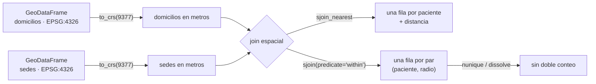

# 🗺️ gi02 — Vectorial: shapely, geopandas, pyproj

> Python para desarrolladores Java senior · **Carta** · Track `gi` — Geoespacial ·
> sección 2 de 7
> Se lee suelta: no hace falta ninguna otra sección de la carta. Conviene haber leído
> [`gi01`](op157-gi01-el-modelo.md) (CRS y orden de ejes).
> Versiones verificadas contra PyPI el 07/10/2026 · Código probado el 07/10/2026 con Python 3.14.7,
> en contenedor: las salidas son las de esa corrida.

---

## 🎯 1. Qué problema resuelve

Con una sede y un paciente, la distancia es una función. Con diez sedes y dos mil pacientes, las preguntas se vuelven de **tabla**: a qué sede le queda más cerca
cada paciente, cuántos viven a menos de 5 km de alguna, qué zona de la ciudad no cubre nadie. Son preguntas de `JOIN`, solo que la condición no es `a.id = b.id`
sino *"está dentro de"*, *"está más cerca de"*, *"se cruza con"*.

**geopandas** es pandas con una columna de geometría que sabe su CRS. Cada fila tiene una geometría de `shapely`; las operaciones vectorizadas pasan por GEOS, los
*joins* espaciales usan un índice R-tree (STRtree) por debajo, y la lectura y escritura de formatos (GeoPackage, Shapefile, GeoJSON, FlatGeobuf, Parquet) va por
**pyogrio**, el enlace a GDAL que reemplazó a `fiona` como motor por defecto en geopandas 1.0.

La sección asigna dos mil domicilios **sintéticos** —una nube aleatoria alrededor de Bogotá, sin ninguna relación con pacientes reales— a las diez sedes de Áurea, y
muestra tres operaciones que parecen simples y no lo son: el join más cercano, el conteo dentro de un radio y el archivo que pierde su CRS.

---

## 🧠 2. El modelo



| Operación | SQL que se le parece | Lo que devuelve |
|---|---|---|
| `gpd.sjoin(a, b, predicate="within")` | `JOIN … ON ST_Within(a.geom, b.geom)` | Una fila por **par** que cumple: un punto en dos polígonos sale dos veces |
| `gpd.sjoin_nearest(a, b, distance_col=…)` | `JOIN LATERAL … ORDER BY a.geom <-> b.geom LIMIT 1` | Una fila por elemento de `a` (más si hay empate exacto) |
| `gdf.dissolve(by=…)` | `GROUP BY … ST_Union(geom)` | Las geometrías unidas por grupo |
| `gpd.overlay(a, b, how="intersection")` | `ST_Intersection` sobre todos los pares | Polígonos nuevos, recortados |
| `gdf.to_crs(epsg)` | `ST_Transform(geom, srid)` | La misma tabla, reproyectada |

### 🩻 Esto sí funciona igual

Un *join* espacial es un *join*: hay tabla izquierda y derecha, `how="left"` conserva las filas sin pareja, y la cardinalidad se razona igual que en SQL. Si sabes
por qué un `JOIN` contra una tabla con duplicados multiplica filas, ya sabes por qué el conteo del radio de 5 km sale inflado.

---

## 💻 3. El ejemplo que corre

```bash
uv add geopandas==1.2.0 pyogrio==0.13.0 shapely==2.1.2 pyproj==3.8.0
```

`vectorial.py`:

```python
"""Pacientes sintéticos contra las diez sedes con geopandas: la sede más cercana, el radio de 5 km y el CRS que viaja o no."""

import warnings

import geopandas as gpd
import numpy as np
import pandas as pd

SEDES = {
    "Centro": (4.6040, -74.0660), "Chapinero": (4.6486, -74.0628), "Suba": (4.7410, -74.0840),
    "Kennedy": (4.6280, -74.1530), "Usaquén": (4.6950, -74.0310), "Engativá": (4.7070, -74.1100),
    "Fontibón": (4.6780, -74.1410), "Restrepo": (4.5880, -74.1030), "Soacha": (4.5790, -74.2170),
    "Zipaquirá": (5.0220, -73.9950),
}
sedes = gpd.GeoDataFrame(
    {"sede": list(SEDES)},
    geometry=gpd.points_from_xy([lon for _, lon in SEDES.values()], [lat for lat, _ in SEDES.values()]),
    crs=4326,
)

# 2.000 domicilios sintéticos: nube alrededor de Bogotá, sin relación con ningún paciente real
rng = np.random.default_rng(7)
homes = gpd.GeoDataFrame(
    {"patient": [f"p{i:04d}" for i in range(2000)]},
    geometry=gpd.points_from_xy(rng.normal(-74.09, 0.05, 2000), rng.normal(4.66, 0.07, 2000)),
    crs=4326,
)

# 1. La sede más cercana, en metros: se proyecta primero
sedes_m, homes_m = sedes.to_crs(9377), homes.to_crs(9377)
nearest = gpd.sjoin_nearest(homes_m, sedes_m, distance_col="metres")
summary = nearest.groupby("sede")["metres"].agg(pacientes="size", mediana_km=lambda m: round(m.median() / 1000, 2))
print(summary.sort_values("pacientes", ascending=False).head(5).to_string())
print("pacientes asignados:", len(nearest), "· de", len(homes))

# 2. La misma operación en grados: geopandas avisa, y la "distancia" queda en grados
with warnings.catch_warnings(record=True) as caught:
    warnings.simplefilter("always")
    nearest_deg = gpd.sjoin_nearest(homes, sedes, distance_col="degrees")
print("\naviso:", caught[0].message.args[0].split(".")[0])
changed = (nearest_deg.set_index("patient")["sede"] != nearest.set_index("patient")["sede"]).sum()
print(f"asignaciones distintas entre grados y metros: {changed} · distancia máxima en 'grados': {nearest_deg['degrees'].max():.4f}")

# 3. Dos CRS distintos en un mismo join
with warnings.catch_warnings(record=True) as caught:
    warnings.simplefilter("always")
    mixed = gpd.sjoin(homes, sedes_m.set_geometry(sedes_m.buffer(5000)), predicate="within")
print("\nmezcla 4326 con 9377:", len(mixed), "coincidencias ·", caught[0].message.args[0].split(".")[0])

# 4. "Pacientes a menos de 5 km de una sede": los radios se solapan y el conteo ingenuo suma de más
rings = sedes_m.set_geometry(sedes_m.buffer(5000))
inside = gpd.sjoin(homes_m, rings, predicate="within")
print(f"\nfilas del join: {len(inside)} · pacientes distintos: {inside['patient'].nunique()}")
union = rings.dissolve()
print(f"área de los diez radios: {rings.area.sum() / 1e6:.1f} km² · de su unión: {union.area.iloc[0] / 1e6:.1f} km²")

# 5. El CRS viaja en GeoPackage y se pierde en CSV
nearest[["patient", "sede", "metres", "geometry"]].to_file("asignacion.gpkg", layer="asignacion")
back = gpd.read_file("asignacion.gpkg")
print("\nGeoPackage leído:", back.crs.to_epsg(), "·", len(back), "filas")
pd.DataFrame(nearest.drop(columns="geometry").assign(wkt=nearest.geometry.to_wkt())).to_csv("asignacion.csv", index=False)
print("CSV leído con pandas: tipo de la geometría:", type(pd.read_csv("asignacion.csv")["wkt"].iloc[0]).__name__, "· CRS: ninguno")
```

```bash
uv run vectorial.py
```

Salida (Python 3.14.7, 07/10/2026):

```text
           pacientes  mediana_km
sede                            
Suba             294        3.80
Chapinero        287        3.01
Restrepo         273        3.49
Centro           251        3.10
Engativá         237        2.67
pacientes asignados: 2000 · de 2000

aviso: Geometry is in a geographic CRS
asignaciones distintas entre grados y metros: 0 · distancia máxima en 'grados': 0.1928

mezcla 4326 con 9377: 0 coincidencias · CRS mismatch between the CRS of left geometries and the CRS of right geometries

filas del join: 2600 · pacientes distintos: 1578
área de los diez radios: 784.1 km² · de su unión: 571.4 km²

GeoPackage leído: 9377 · 2000 filas
CSV leído con pandas: tipo de la geometría: str · CRS: ninguno
```

Lo que dicen los números:

- **`sjoin_nearest` en metros** reparte a los dos mil y da la mediana de distancia por sede (de 2,67 km en Engativá a 3,80 en Suba, con esta nube sintética).
- **En grados, geopandas avisa** (`Geometry is in a geographic CRS. Results from 'sjoin_nearest' are likely incorrect`) y la distancia queda en una unidad sin
  sentido físico (0,19 "grados"). Pero **ninguna asignación cambió**: en Bogotá, a 4,6° del ecuador, el orden de cercanía en grados y en metros coincide. Es la misma
  casualidad de gi01, ahora en un join, y la razón por la que el error sobrevive en producción.
- **Mezclar 4326 con 9377 devuelve cero coincidencias** y un aviso de `CRS mismatch`, no una excepción. Los puntos en grados (valores cerca de −74 y 4) y los
  círculos en metros (valores de siete dígitos) no se tocan en ningún plano. Si el código convierte los avisos en registro y nadie lo lee, el reporte dice "0
  pacientes cerca de las sedes".
- **El radio de 5 km cuenta 2.600 filas para 1.578 pacientes**: los radios se solapan en quince pares (todas las sedes menos Zipaquirá tocan a alguna
  otra), y un paciente dentro de dos radios sale dos veces. La suma de áreas (784 km²) contra la de la unión (571 km²) mide el mismo solapamiento en superficie: 27 %.
- **El GeoPackage guarda el CRS** (vuelve como 9377); el CSV lo pierde, y la geometría vuelve como texto WKT que alguien tendrá que interpretar, sin saber en qué
  CRS está.

**Detalles con intención**

- **`gpd.points_from_xy(x, y)`**: primero longitud, después latitud. Es el orden x/y de `shapely`, el que gi01 fijó con `always_xy`.
- **`crs=4326`** al construir: un `GeoDataFrame` sin CRS acepta cualquier operación y no puede avisar de nada.
- **`set_geometry(sedes_m.buffer(5000))`** cambia la columna activa sin perder `sede`: el join devuelve el nombre de la sede de cada radio.
- **`to_file`** usa pyogrio; `engine="fiona"` sigue existiendo, pero `fiona` 1.10.1 no publica desde septiembre de 2024 (💤) y ya no es el motor por defecto.

---

## ⚠️ 4. Lo que se rompe

**El `GeoDataFrame` sin CRS.** `gpd.read_file` de un Shapefile sin su `.prj`, o un `GeoDataFrame(…)` construido sin `crs=`, deja `gdf.crs` en `None`. A partir de ahí
`to_crs` falla y los joins no pueden avisar. Al cargar: `assert gdf.crs is not None`, y `set_crs` solo con la palabra de quien produjo el archivo.

**El doble conteo del join `within`.** Contar filas del resultado de un `sjoin` contra polígonos que se solapan cuenta pares, no elementos. `nunique()` sobre la llave
de la izquierda, o `dissolve` de los polígonos antes del join si la pregunta es "dentro de alguno".

**Los empates de `sjoin_nearest`.** Si un punto está exactamente a la misma distancia de dos sedes, salen dos filas. Con coordenadas reales casi nunca pasa; con datos
redondeados a tres decimales (un ejemplo clásico de datos anonimizados por truncamiento) pasa todo el tiempo. Se verifica con `len(result) == len(left)`.

**Shapefile en 2026.** Nombres de columna de diez caracteres, 2 GB por archivo, sin tipos fecha-hora, cuatro archivos que viajan juntos o se rompen. Se recibe porque
alguien lo manda; se entrega en GeoPackage (un solo archivo SQLite) o GeoParquet.

---

## ⚖️ 5. Cuándo NO usarla

**Cuando los datos ya están en una base espacial.** Dos mil puntos caben en memoria; dos millones también, pero el join se hace donde está el índice, en PostGIS
(gi03) o en DuckDB con su extensión espacial. Traerlos a geopandas para unirlos es el antipatrón del ORM que trae la tabla para filtrar en memoria.

**Cuando la pregunta es una sola distancia por fila.** Si cada paciente ya tiene su sede asignada y solo hace falta la distancia, `Geod.inv` vectorizado con NumPy
(gi01) no carga GDAL ni pandas. geopandas paga cuando hay **joins**, **polígonos** o **archivos SIG**.

**Para dibujar.** `gdf.plot()` existe y sirve para mirar; el mapa como entregable es gi06, y la gráfica de datos es el track `vz`.

---

## 🧪 6. Ejercicios (10)

**🟢 Fácil (1–3)**

1. Corre el ejemplo. **Criterio:** la salida completa, y la explicación de por qué las asignaciones en grados y en metros coinciden en Bogotá.
2. Cambia la nube a una con el centro en Zipaquirá. **Criterio:** la sede con más pacientes cambia y la mediana de distancia de Zipaquirá se reporta.
3. Guarda la asignación en GeoJSON y en GeoParquet. **Criterio:** los dos archivos se leen de vuelta con su CRS, y el tamaño de cada uno contra el GeoPackage.

**🟡 Intermedio (4–6)**

4. Cuenta los pacientes a menos de 5 km de **alguna** sede sin `nunique`, usando `dissolve` antes del join. **Criterio:** el mismo 1.578 del ejemplo.
5. Calcula la zona de influencia de cada sede con un diagrama de Voronoi (`shapely.voronoi_polygons`) recortado a un rectángulo de Bogotá. **Criterio:** diez
   polígonos, el área de cada uno en km², y que cada paciente cae en el Voronoi de la sede que le asignó `sjoin_nearest`.
6. Convierte el aviso de CRS mezclado en error (`warnings.simplefilter("error")`) dentro de una prueba de pytest. **Criterio:** la prueba falla si alguien mezcla
   4326 con 9377.

**🟠 Difícil (7–9)**

7. Lleva la nube a 200.000 puntos y mide `sjoin_nearest` contra un bucle de Python que calcula la distancia a las diez sedes. **Criterio:** los dos tiempos y que
   las asignaciones coinciden.
8. Genera la nube con coordenadas truncadas a tres decimales y cuenta los empates de `sjoin_nearest`. **Criterio:** filas de más contra 2.000, y una forma de
   desempatar que sea determinista.
9. Exporta la asignación a Shapefile y vuelve a leerla. **Criterio:** la lista de lo que cambió (nombres de columna, tipos, archivos generados).

**🔴 Muy difícil (10)**

10. Diseña el cálculo de "distancia a la sede" para la tabla de entrenamiento del modelo de ausentismo, con pacientes reales que **no** salen de la base.
    **Criterio:** una página y el código del cálculo. *Rúbrica:* (a) dónde se geocodifica y dónde se guarda la coordenada; (b) qué se calcula en la base y qué en
    Python; (c) cómo se evita que la coordenada exacta llegue al conjunto anonimizado (se guarda la distancia, no el punto); (d) la prueba que detecta el CRS
    mezclado.

---

## 📚 7. Referencias

**Documentación oficial**

- geopandas, la guía de usuario: https://geopandas.org/en/stable/docs/user_guide.html
- geopandas, joins espaciales: https://geopandas.org/en/stable/docs/user_guide/mergingdata.html
- geopandas, proyecciones: https://geopandas.org/en/stable/docs/user_guide/projections.html
- pyogrio: https://pyogrio.readthedocs.io/en/latest/
- GeoPackage, la especificación de la OGC: https://www.geopackage.org/

**Libro**

- Rey, Arribas-Bel y Wolf, *Geographic Data Science with Python*, capítulo 3 (datos espaciales): https://geographicdata.science/book/notebooks/03_spatial_data.html

**Orden de lectura sugerido:** la página de proyecciones de geopandas, después la de joins; el capítulo 3 del libro para la teoría.

---

## 🚀 8. Cierre

geopandas convierte las preguntas espaciales en joins, y los joins espaciales tienen las mismas trampas que los de SQL —cardinalidad, llaves duplicadas— más una:
el CRS. En Bogotá, el join en grados da la misma respuesta que en metros, así que el error no se ve; el CRS mezclado da cero filas y un aviso. Se proyecta antes de
medir, se cuenta con `nunique`, y se entrega en GeoPackage.

**La señal de que quedó bien:** *"Cada join espacial de mi código corre en metros, falla si los CRS no coinciden, y su conteo no cambia si los radios se solapan."*

> 🏷️ **Cierra la sección con su tag**, cuando los ejercicios que elegiste estén hechos:
>
> ```bash
> git tag -a op-gi-fase-02 -m "op gi02 cerrada: joins espaciales en metros, sin doble conteo y con el CRS a bordo"
> ```
>
> Los commits llevan su prefijo (`op gi02: …`) y los de ejercicio su número
> (`op gi02 ej07: …`).
