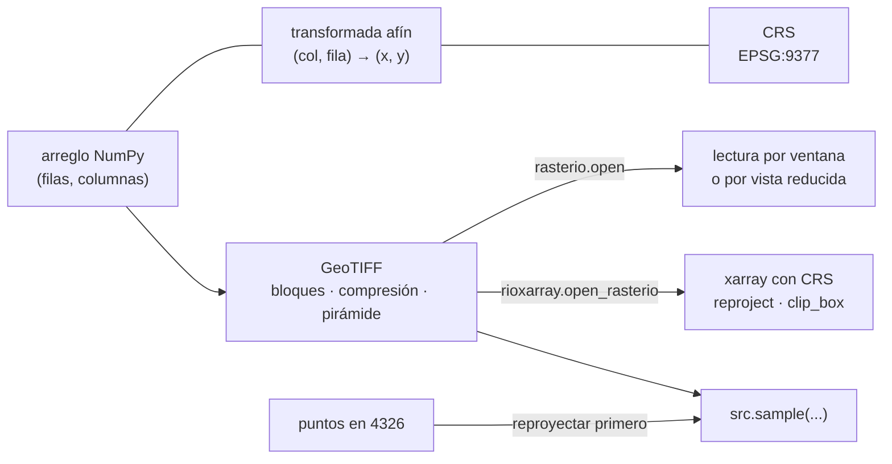

# 🛰️ gi04 — Ráster y teledetección

> Python para desarrolladores Java senior · **Carta** · Track `gi` — Geoespacial ·
> sección 4 de 7
> Se lee suelta: no hace falta ninguna otra sección de la carta. Conviene haber leído
> [`gi01`](op157-gi01-el-modelo.md) (CRS) y la [Fase ds01](ds01-numpy-y-el-modelo-vectorizado.md) si NumPy no es de uso diario.
> Versiones verificadas contra PyPI el 07/10/2026 · Código probado el 07/10/2026 con Python 3.14.7,
> en contenedor: las salidas son las de esa corrida.

---

## 🎯 1. Qué problema resuelve

Hasta aquí el track trabajó con **vectores**: puntos, líneas y polígonos con coordenadas exactas. La otra mitad del mundo geoespacial es el **ráster**: una
grilla de valores sobre el terreno —elevación, temperatura, lluvia, la reflectancia de una banda de un satélite—, donde cada píxel cubre un cuadrado de 10, 30 o
1.000 metros. Un modelo de elevación de la sabana de Bogotá a 30 metros son unos cinco millones de píxeles; una escena de Sentinel-2 son trece bandas de cien
millones cada una.

Un ráster es un arreglo de NumPy **más** dos datos que lo atan al suelo: el **CRS** y la **transformada afín**, que convierte (columna, fila) en (x, y). **rasterio**
es el enlace a GDAL que lee y escribe esos archivos (GeoTIFF sobre todo) y entrega el arreglo con su georreferencia; **xarray** pone nombres a las dimensiones
(`band`, `y`, `x`) y **rioxarray** le agrega a xarray el CRS y las operaciones geográficas (reproyectar, recortar).

La sección fabrica un modelo de elevación sintético —la sabana a unos 2.550 m que sube suave hacia el norte, y los cerros orientales al este de Bogotá—, lo guarda
bien guardado, saca la altura de seis sedes, calcula un NDVI con la trampa de los enteros sin signo, arma un mosaico y lo reproyecta.

---

## 🧠 2. El modelo



| Concepto | Qué es | El error típico |
|---|---|---|
| Transformada afín | Seis números: origen, tamaño de píxel, rotación | Píxel negativo en `y` (el norte está arriba) que alguien "corrige" |
| Bloques (*tiles*) | El archivo se guarda en cuadrados de 256 o 512 | Un GeoTIFF por franjas obliga a leer filas enteras para una ventana |
| Pirámide (*overviews*) | Copias reducidas 1:2, 1:4… dentro del archivo | Sin ella, el zoom alejado lee el ráster entero |
| `nodata` | El valor que significa "sin dato" | Promediar con el `-9999` adentro |
| Remuestreo | Cómo se calcula un píxel nuevo al cambiar de grilla | `nearest` en datos continuos deja escalones; `bilinear` en categorías inventa clases |

### 🩻 Esto sí funciona igual

Un ráster es una matriz y una función de coordenadas, y quien hizo procesamiento de imágenes en Java con `BufferedImage` y `Raster` ya conoce el problema: el
arreglo no sabe dónde está; hay un objeto aparte que sí. En GeoTools es `GridCoverage2D`; aquí es el par (arreglo, `transform`).

---

## 💻 3. El ejemplo que corre

```bash
uv add rasterio==1.5.2 rioxarray==0.23.0 xarray==2026.9.0 pyproj==3.8.0 numpy==2.5.3
```

`raster.py`:

```python
"""Ráster con rasterio y rioxarray: un modelo de elevación sintético, la altura de cada sede, el NDVI y la reproyección."""

import os
import time

import numpy as np
import rasterio
import rioxarray
from pyproj import Transformer
from rasterio.enums import Resampling
from rasterio.merge import merge
from rasterio.transform import from_origin
from rasterio.windows import Window

SEDES = {
    "Centro": (4.6040, -74.0660), "Chapinero": (4.6486, -74.0628), "Suba": (4.7410, -74.0840),
    "Usaquén": (4.6950, -74.0310), "Soacha": (4.5790, -74.2170), "Zipaquirá": (5.0220, -73.9950),
}
CRS, PIXEL = "EPSG:9377", 30.0                       # metros por píxel, como un modelo de elevación global
to_ctm12 = Transformer.from_crs(4326, 9377, always_xy=True)
x0, y1 = to_ctm12.transform(-74.30, 5.10)            # esquina noroeste del área
width, height = 2400, 2000                           # 72 × 60 km
transform = from_origin(x0, y1, PIXEL, PIXEL)

# Elevación sintética: la sabana sube suave hacia el norte y los cerros orientales se levantan al este de Bogotá
rows, cols = np.mgrid[0:height, 0:width]
east = np.clip((cols - 1010) / 60, 0, None)
rng = np.random.default_rng(3)
dem = (2540 + 0.06 * (height - rows) + 900 * np.tanh(east) * (rows > 600) + rng.normal(0, 3, (height, width))).astype("float32")

profile = dict(driver="GTiff", width=width, height=height, count=1, dtype="float32", crs=CRS, transform=transform)
with rasterio.open("dem_plano.tif", "w", **profile) as dst:
    dst.write(dem, 1)
with rasterio.open("dem.tif", "w", **profile, compress="deflate", predictor=3, tiled=True, blockxsize=512, blockysize=512) as dst:
    dst.write(dem, 1)
    dst.build_overviews([2, 4, 8, 16], Resampling.average)   # pirámide: lo que hace rápido el zoom alejado
for name in ("dem_plano.tif", "dem.tif"):
    print(f"{name:<14} {os.path.getsize(name) / 1e6:6.1f} MB")

with rasterio.open("dem.tif") as src:
    print(f"\nCRS {src.crs} · píxel {src.res} · límites {[round(v) for v in src.bounds]}")
    # 1. La altura de cada sede: los puntos van al CRS del ráster antes de muestrear
    points = [to_ctm12.transform(lon, lat) for lat, lon in SEDES.values()]
    for name, value in zip(SEDES, src.sample(points)):
        print(f"  {name:<10} {value[0]:7.0f} m")
    wrong = next(src.sample([(SEDES['Centro'][1], SEDES['Centro'][0])]))[0]
    print(f"  (lon, lat) sin reproyectar: {wrong} — fuera del ráster, sin error")

    # 2. Leer una ventana de 512×512 contra el ráster entero
    start = time.perf_counter(); full = src.read(1); t_full = time.perf_counter() - start
    start = time.perf_counter(); part = src.read(1, window=Window(1000, 800, 512, 512)); t_part = time.perf_counter() - start
    print(f"\nentero {full.nbytes / 1e6:.1f} MB en {t_full * 1000:.0f} ms · ventana {part.nbytes / 1e6:.1f} MB en {t_part * 1000:.1f} ms")
    small = src.read(1, out_shape=(height // 16, width // 16))   # usa la pirámide: lee la vista 1:16
    print(f"vista 1:16 {small.shape} · media {small.mean():.0f} m contra {full.mean():.0f} m del ráster entero")

# 3. NDVI con bandas uint16: la resta sin convertir da la vuelta
red = rng.integers(500, 3000, (500, 500), dtype="uint16")
nir = rng.integers(400, 5000, (500, 500), dtype="uint16")
naive = (nir - red) / (nir + red)
safe = (nir.astype("float32") - red) / (nir.astype("float32") + red)
print(f"\nNDVI ingenuo: rango [{naive.min():.2f}, {naive.max():.2f}] · correcto: [{safe.min():.2f}, {safe.max():.2f}]")
print(f"píxeles con NDVI imposible (> 1): {(naive > 1).sum()} de {naive.size}")

# 4. Mosaico de dos teselas y reproyección a geográficas con rioxarray
with rasterio.open("dem.tif") as src:
    for i, col in enumerate((0, 1200)):
        win = Window(col, 0, 1200, 2000)
        tile_profile = profile | dict(width=1200, transform=src.window_transform(win))
        with rasterio.open(f"tesela_{i}.tif", "w", **tile_profile) as dst:
            dst.write(src.read(1, window=win), 1)
mosaic, _ = merge(["tesela_0.tif", "tesela_1.tif"])
print(f"\nmosaico {mosaic.shape[1:]} · igual al original: {np.array_equal(mosaic[0], dem)}")

with rioxarray.open_rasterio("dem.tif") as opened:   # sin with, Python 3.14 escupe un error vacío al salir
    da = opened.squeeze()
    for method in (Resampling.nearest, Resampling.bilinear):
        geo = da.rio.reproject("EPSG:4326", resampling=method)
        print(f"a 4326 con {method.name:<8} {geo.shape} · píxel {abs(geo.rio.resolution()[0]):.6f}° · máx {float(geo.max()):.1f} m")
    clip = da.rio.clip_box(*to_ctm12.transform(-74.12, 4.55), *to_ctm12.transform(-74.00, 4.75))
    print(f"recorte de Bogotá: {clip.shape} · media {float(clip.mean()):.0f} m")
```

```bash
uv run raster.py
```

Salida (Python 3.14.7, 07/10/2026) (por la salida de error sale además un `PendingDeprecationWarning` de rioxarray, que todavía usa `*` para componer transformadas
afines y `affine` 3.0.1 pide `@`):

```text
dem_plano.tif    19.2 MB
dem.tif          13.8 MB

CRS EPSG:9377 · píxel (30.0, 30.0) · límites [4855957, 2061687, 4927957, 2121687]
  Centro        2549 m
  Chapinero     2561 m
  Suba          2584 m
  Usaquén       2573 m
  Soacha        2547 m
  Zipaquirá     2642 m
  (lon, lat) sin reproyectar: 0.0 — fuera del ráster, sin error

entero 19.2 MB en 60 ms · ventana 1.0 MB en 0.4 ms
vista 1:16 (125, 150) · media 2954 m contra 2954 m del ráster entero

NDVI ingenuo: rango [0.00, 71.83] · correcto: [-0.76, 0.82]
píxeles con NDVI imposible (> 1): 72977 de 250000

mosaico (2000, 2400) · igual al original: True
a 4326 con nearest  (2007, 2400) · píxel 0.000271° · máx 3535.2 m
a 4326 con bilinear (2007, 2400) · píxel 0.000271° · máx 3531.9 m
recorte de Bogotá: (709, 446) · media 2677 m
```

Lo que dicen los números:

- **Bloques, compresión y pirámide: 13,8 MB contra 19,2 MB**, y eso que el ruido aleatorio comprime mal; `predictor=3` es el predictor de punto flotante, el que
  sirve para elevaciones. La pirámide agrega peso y paga en lectura.
- **La altura de cada sede** sale de `src.sample` con los puntos **ya reproyectados** a 9377. Los mismos puntos en (lon, lat) caen fuera del ráster y devuelven
  `0.0`, que es un número de elevación posible: ningún error, ninguna advertencia.
- **Una ventana de 512×512 se lee en 0,4 ms contra 60 ms del ráster entero**: el archivo está en bloques de 512, y GDAL lee solo los que tocan la ventana. Con
  `out_shape` de un dieciseisavo, GDAL usa la pirámide; la media coincide con la del ráster entero.
- **El NDVI ingenuo da valores hasta 71,83**, en un índice que por definición va de −1 a 1. Las bandas de satélite llegan como `uint16`, y `nir - red` con `red`
  mayor da la vuelta a 65.535 en vez de dar negativo: **72.977 píxeles de 250.000 (29 %) quedan imposibles**, y otros quedan mal sin salirse del rango. Se convierte
  a `float32` antes de restar.
- **El mosaico de dos teselas es idéntico al original** (`array_equal`): `merge` lee la transformada de cada una y las pone en su lugar.
- **Reproyectar a 4326 cambia la grilla**: 2.007 filas en vez de 2.000 y píxeles de 0,000271°. Con `bilinear` el máximo baja 3,3 m contra `nearest`: el remuestreo
  promedia los picos. Para elevación se usa `bilinear` o `cubic`; para una capa de categorías (uso del suelo), `nearest`.

**Detalles con intención**

- **`from_origin(x0, y1, 30, 30)`**: la esquina **superior** izquierda y el tamaño del píxel; la fila 0 es el norte.
- **`(rows > 600)`** en la elevación: sin esa máscara, los cerros pasaban también por Zipaquirá (que está más al este que el Centro) y la sede quedaba a 3.506 m.
  Es un ejemplo sintético; el detalle muestra cuánto depende la cifra de la geometría del dato.
- **`src.read(1, window=…)`** y **`out_shape=`**: las dos formas de no leer lo que no se necesita.
- **`with rioxarray.open_rasterio(…)`**: sin `with`, el archivo queda abierto hasta que el intérprete se apaga y Python 3.14 escribe `Error in sys.excepthook:` en
  la salida de error, con el código de salida en 0. Se encontró en la prueba de esta sección.

---

## ⚠️ 4. Lo que se rompe

**Muestrear en el CRS equivocado.** `sample`, `index` y las ventanas por coordenadas esperan el CRS **del ráster**. El síntoma no es una excepción: es `0`, `nodata`
o un valor de otro lugar. Se reproyecta el punto, nunca el ráster entero para muestrear diez puntos.

**El GeoTIFF por franjas.** Muchos programas escriben por defecto en franjas de una fila. Para leer ventanas o servirlo por HTTP, se reescribe en bloques con
pirámide: es un **Cloud Optimized GeoTIFF** (COG), que un cliente lee por rangos de bytes sin bajarlo entero (`rio cogeo create` o `driver="COG"` en GDAL).

**`nodata` que entra al promedio.** Un borde de `-9999` baja la media de cualquier recorte. Se abre con `masked=True` (rasterio) o se usa `da.where(da != nodata)`
(xarray), y se escribe el `nodata` en el perfil al guardar.

**La memoria.** Una escena de 10.000×10.000 en `float32` son 400 MB por banda. Se procesa por ventanas (`src.block_windows()`) o con xarray y `chunks=` (que necesita
Dask), no con `src.read()` de todo.

---

## ⚖️ 5. Cuándo NO usarla

**Cuando lo que hace falta es un valor por punto y alguien ya lo publica.** La altura de diez sedes cabe en una consulta a un servicio de elevación o en una tabla;
bajar y procesar un modelo de elevación entero es para cuando la pregunta es de superficie (pendiente, cuencas, cobertura).

**Cuando el análisis es sobre muchas escenas en el tiempo.** Para series de imágenes satelitales a escala, Google Earth Engine o un catálogo STAC con `odc-stac` y
Dask hacen el trabajo en la nube; rasterio local se queda corto en datos y en tiempo.

**Cuando el dato es categórico y pequeño.** Un mapa de zonas de diez polígonos es un vector; convertirlo a ráster para "cruzarlo" agrega error de borde sin ganar
nada.

---

## 🧪 6. Ejercicios (10)

**🟢 Fácil (1–3)**

1. Corre el ejemplo. **Criterio:** la salida completa, y la explicación del NDVI ingenuo con el valor de un píxel concreto.
2. Lee `dem.tif` con `rasterio` y escribe su perfil (`src.profile`) y su transformada. **Criterio:** reconoces el origen, el tamaño de píxel y el signo negativo en `y`.
3. Guarda el NDVI correcto como GeoTIFF `float32` con `nodata=-9999`. **Criterio:** `gdalinfo` (o `rasterio`) reporta el `nodata` y el rango correcto.

**🟡 Intermedio (4–6)**

4. Calcula la pendiente en grados del modelo de elevación con NumPy (`np.gradient` sobre metros). **Criterio:** la pendiente máxima está en los cerros y la de la
   sabana queda bajo 1°.
5. Escribe el ráster como COG (`driver="COG"`) y lee una ventana con `rasterio` desde un servidor HTTP local (`python -m http.server`). **Criterio:** el registro
   del servidor muestra peticiones `Range`, no la descarga entera.
6. Recorre el ráster por bloques (`block_windows`) y calcula la media sin leerlo entero. **Criterio:** la misma media del ejemplo y memoria máxima por debajo de 5 MB
   (medida con `tracemalloc`).

**🟠 Difícil (7–9)**

7. Reproyecta con `nearest`, `bilinear` y `cubic` y compara cada uno contra el original, ida y vuelta. **Criterio:** el error cuadrático medio de cada método.
8. Abre el ráster con `rioxarray` y `chunks={"x": 512, "y": 512}` (con Dask) y calcula la media. **Criterio:** el número de tareas del grafo y el tiempo contra la
   lectura directa.
9. Baja una escena real de Sentinel-2 de un catálogo STAC público (bandas B04 y B08 de un recorte de la sabana) y calcula el NDVI. **Criterio:** el rango del
   NDVI dentro de [−1, 1] y un mapa de la escena con la escala.

**🔴 Muy difícil (10)**

10. Diseña el procesamiento de un ráster que no cabe en memoria (una escena de 20 GB). **Criterio:** una página y el código del esqueleto. *Rúbrica:* (a) el
    formato de entrada y de salida (COG, Zarr) y por qué; (b) por ventanas o por Dask, con la memoria máxima medida; (c) cómo se trata el `nodata` y el borde de
    cada bloque; (d) cómo se verifica que el resultado coincide con el procesamiento en memoria sobre un recorte.

---

## 📚 7. Referencias

**Documentación oficial**

- rasterio: https://rasterio.readthedocs.io/en/stable/
- rasterio, lectura por ventanas: https://rasterio.readthedocs.io/en/stable/topics/windowed-rw.html
- rioxarray: https://corteva.github.io/rioxarray/stable/
- GDAL, el formato COG: https://gdal.org/en/stable/drivers/raster/cog.html
- xarray: https://docs.xarray.dev/en/stable/

**Orden de lectura sugerido:** la guía de rasterio (lectura, georreferencia, ventanas); después la página de COG de GDAL; rioxarray cuando aparezca xarray.

---

## 🚀 8. Cierre

Un ráster es un arreglo con una transformada y un CRS, y casi todos sus errores son silenciosos: el punto en el CRS equivocado devuelve `0`, la resta en `uint16`
da la vuelta, el `nodata` entra al promedio. Bloques y pirámide hacen que leer una ventana cueste milisegundos, el remuestreo se elige según el dato, y el archivo
se abre con `with`.

**La señal de que quedó bien:** *"Ningún cálculo sobre bandas resta enteros sin signo, cada muestreo reproyecta el punto primero, y mis GeoTIFF son COG."*

> 🏷️ **Cierra la sección con su tag**, cuando los ejercicios que elegiste estén hechos:
>
> ```bash
> git tag -a op-gi-fase-04 -m "op gi04 cerrada: ráster en bloques, muestreo en el CRS correcto y NDVI sin desborde"
> ```
>
> Los commits llevan su prefijo (`op gi04: …`) y los de ejercicio su número
> (`op gi04 ej07: …`).
