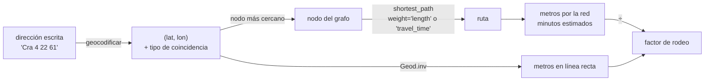

# 🧭 gi05 — Rutas y direcciones

> Python para desarrolladores Java senior · **Carta** · Track `gi` — Geoespacial ·
> sección 5 de 7
> Se lee suelta: no hace falta ninguna otra sección de la carta. Conviene haber leído
> [`gi01`](op157-gi01-el-modelo.md) (CRS) y [`so04`](op099-so04-rutas-y-grafos.md) si los grafos no son de uso diario.
> Versiones verificadas contra PyPI el 07/10/2026 · Código probado el 07/10/2026 con Python 3.14.7,
> en contenedor: las salidas son las de esa corrida.

---

## 🎯 1. Qué problema resuelve

La variable "distancia a la sede" del modelo de ausentismo tiene dos preguntas escondidas. La primera es **de dónde sale la coordenada del paciente**: lo que hay
en el formulario es una dirección escrita a mano, en la nomenclatura bogotana de calles y carreras, y alguien tiene que convertirla en latitud y longitud
(geocodificar). La segunda es **qué distancia importa**: un paciente de Suba a 600 metros en línea recta de la sede, pero con el humedal o la autopista de por medio,
vive a veinte minutos. La línea recta mide geometría; la ausencia a la cita la explica el trayecto.

Para lo primero, **geopy** envuelve a los geocodificadores (Nominatim de OpenStreetMap, y los comerciales). Para lo segundo, **osmnx** baja la red de calles de
OpenStreetMap como un grafo de **networkx**, con longitudes, sentidos y velocidades, y calcula rutas sobre él. Para millones de rutas, se usa un motor de ruteo
dedicado —**OSRM** o **Valhalla**— en un contenedor propio.

La sección construye un barrio sintético de seis por seis cuadras, con un río que solo se cruza por un puente y dos calles de un solo sentido, y mide cuánto se
aleja la distancia por la red de la recta. Después geocodifica cuatro veces la misma dirección pública —la de la Universidad Jorge Tadeo Lozano, a dos cuadras del
primer consultorio de Áurea— para ver dónde falla.

---

## 🧠 2. El modelo



- **La red es un grafo dirigido.** Una calle de doble sentido son dos aristas; una de un solo sentido, una. `osmnx` devuelve un `MultiDiGraph`: dirigido y con
  aristas paralelas posibles.
- **El peso decide la ruta.** `length` da la más corta; `travel_time` (que `osmnx` calcula con `maxspeed` o con velocidades imputadas por tipo de vía) da la más
  rápida. No suelen coincidir en una ciudad real.
- **El geocodificador siempre quiere contestar.** Si no encuentra la dirección, devuelve lo más parecido que tiene: la calle, el barrio, la ciudad. El tipo de
  coincidencia (`addresstype`, o su equivalente en cada servicio) es lo único que dice cuánto confiar.

---

## 💻 3. El ejemplo que corre

```bash
uv add osmnx==2.1.1 networkx==3.7 pyproj==3.8.0 scipy==1.18.1 geopy==2.5.0
```

`rutas.py` escribe el barrio como un archivo OSM y lo carga con `osmnx`, sin internet:

```python
"""Distancia recta contra distancia por la red: un barrio sintético con un río, un solo puente y dos calles de un sentido."""

import networkx as nx
import osmnx as ox
from pyproj import Geod, Transformer

# Un barrio de 6×6 cuadras al lado de Suba, escrito como un archivo OSM: así osmnx lo carga sin internet
LAT0, LON0, STEP = 4.7300, -74.0900, 0.002           # unos 220 m por cuadra
RIVER_BETWEEN = (2, 3)                                # el río corre entre las columnas 2 y 3
nodes = {(r, c): 1000 + r * 10 + c for r in range(6) for c in range(6)}
ways, way_id = [], 1


def way(refs, highway, **tags):
    global way_id
    ways.append((way_id, refs, {"highway": highway, **tags}))
    way_id += 1


for r in range(6):                                    # calles este-oeste: solo la fila 0 cruza el río (el puente)
    if r == 0:
        way([nodes[(0, c)] for c in range(6)], "primary", maxspeed="50", name="Avenida del Puente")
    else:
        way([nodes[(r, c)] for c in range(3)], "residential", maxspeed="30")
        way([nodes[(r, c)] for c in range(3, 6)], "residential", maxspeed="30")
for c in range(6):                                    # carreras norte-sur; la 3 y la 4 van solo hacia el norte
    tags = {"oneway": "yes"} if c in (3, 4) else {}
    way([nodes[(r, c)] for r in range(6)], "residential", maxspeed="30", **tags)

xml = ['<?xml version="1.0" encoding="UTF-8"?>', '<osm version="0.6" generator="curso">']
xml += [f'  <node id="{nid}" lat="{LAT0 + r * STEP:.6f}" lon="{LON0 + c * STEP:.6f}"/>' for (r, c), nid in nodes.items()]
for wid, refs, tags in ways:
    xml.append(f'  <way id="{wid}">' + "".join(f'<nd ref="{n}"/>' for n in refs)
               + "".join(f'<tag k="{k}" v="{v}"/>' for k, v in tags.items()) + "</way>")
xml.append("</osm>")
with open("barrio.osm", "w", encoding="utf-8") as f:
    f.write("\n".join(xml))

G = ox.graph_from_xml("barrio.osm", simplify=False)
G = ox.add_edge_speeds(G)                             # usa maxspeed; si falta, imputa por tipo de vía
G = ox.add_edge_travel_times(G)
print(f"red: {G.number_of_nodes()} nodos · {G.number_of_edges()} aristas dirigidas")

# Dos domicilios a cada lado del río, en coordenadas que no caen justo en una esquina
home_a = (LAT0 + 5 * STEP + 0.0003, LON0 + 1 * STEP + 0.0002)   # (lat, lon)
home_b = (LAT0 + 5 * STEP - 0.0002, LON0 + 4 * STEP - 0.0003)
Gp = ox.project_graph(G, to_crs="EPSG:9377")          # proyectada: nearest_nodes usa metros y no pide scikit-learn
to_m = Transformer.from_crs(4326, 9377, always_xy=True)
(xa, ya), (xb, yb) = to_m.transform(home_a[1], home_a[0]), to_m.transform(home_b[1], home_b[0])
na, nb = ox.distance.nearest_nodes(Gp, [xa, xb], [ya, yb])

straight = Geod(ellps="WGS84").inv(home_a[1], home_a[0], home_b[1], home_b[0])[2]
for label, src, dst in (("A → B", na, nb), ("B → A", nb, na)):
    path = nx.shortest_path(G, src, dst, weight="length")
    metres = nx.path_weight(G, path, weight="length")
    fastest = nx.shortest_path(G, src, dst, weight="travel_time")
    seconds = nx.path_weight(G, fastest, weight="travel_time")
    print(f"{label}: recta {straight:5.0f} m · por la red {metres:5.0f} m (×{metres / straight:.1f}) · "
          f"{len(path) - 1} tramos · más rápida {seconds / 60:4.1f} min por {nx.path_weight(G, fastest, weight='length'):5.0f} m")

# Un segundo puente en la fila 3 cambia la respuesta: la red manda, no la geometría
G2 = G.copy()
for u, v in ((nodes[(3, 2)], nodes[(3, 3)]), (nodes[(3, 3)], nodes[(3, 2)])):
    G2.add_edge(u, v, length=STEP * 111_000, travel_time=STEP * 111_000 / (30 / 3.6))
metres2 = nx.shortest_path_length(G2, na, nb, weight="length")
print(f"con un puente en la fila 3: {metres2:5.0f} m (×{metres2 / straight:.1f})")

# El grafo sin dirección pierde el sentido único: la ruta B → A sale más corta de lo que es
undirected = nx.shortest_path_length(G.to_undirected(), nb, na, weight="length")
print(f"B → A sobre el grafo sin dirección: {undirected:5.0f} m")
```

```bash
uv run rutas.py
```

Salida (Python 3.14.7, 07/10/2026):

```text
red: 36 nodos · 100 aristas dirigidas
A → B: recta   613 m · por la red  2889 m (×4.7) · 13 tramos · más rápida  5.2 min por  2889 m
B → A: recta   613 m · por la red  3332 m (×5.4) · 15 tramos · más rápida  6.0 min por  3332 m
con un puente en la fila 3:  1555 m (×2.5)
B → A sobre el grafo sin dirección:  2889 m
```

`geocodificar.py` sí sale a internet: hace cuatro consultas al Nominatim público de OpenStreetMap, con la política de uso que este exige (agente propio, una
petición por segundo como máximo):

```python
"""Geocodificar con Nominatim respetando su política: un agente propio, una petición por segundo y caché."""

import functools

from geopy.distance import geodesic
from geopy.extra.rate_limiter import RateLimiter
from geopy.geocoders import Nominatim

geolocator = Nominatim(user_agent="curso-python-java-devs-gi05", timeout=10)
geocode = functools.cache(RateLimiter(geolocator.geocode, min_delay_seconds=1))   # nunca dos veces la misma dirección

reference = None
QUERIES = (
    "Universidad Jorge Tadeo Lozano, Bogotá",
    "Carrera 4 # 22-61, Bogotá",                     # la dirección publicada de la universidad
    "Cra 4 22 61 Bogota",                            # la misma, como la escribe un formulario
    "Calle 4 # 22-61, Bogotá",                       # la misma, con calle y carrera trocadas
)
for query in QUERIES:
    place = geocode(query, country_codes="co")
    if place is None:
        print(f"{query:<40} → sin resultado")
    else:
        point = (place.latitude, place.longitude)
        reference = reference or point                # la primera respuesta: la universidad
        print(f"{query:<40} → ({point[0]:.4f}, {point[1]:.4f}) · {place.raw['addresstype']:<7} · "
              f"a {geodesic(reference, point).km:5.2f} km de la universidad")
```

```bash
uv run geocodificar.py
```

Salida (Python 3.14.7, 07/10/2026) (los datos de OpenStreetMap cambian: otra corrida puede dar otro tipo de coincidencia o unos metros de diferencia):

```text
Universidad Jorge Tadeo Lozano, Bogotá   → (4.6069, -74.0679) · amenity · a  0.00 km de la universidad
Carrera 4 # 22-61, Bogotá                → (4.6071, -74.0675) · tourism · a  0.04 km de la universidad
Cra 4 22 61 Bogota                       → (4.6063, -74.0676) · amenity · a  0.08 km de la universidad
Calle 4 # 22-61, Bogotá                  → (4.6217, -74.1203) · road    · a  6.03 km de la universidad
```

Lo que dicen los números:

- **613 metros en línea recta son 2.889 por la red** (factor 4,7): hay que bajar al puente de la fila 0 y volver a subir. Ninguna fórmula de distancia lo ve.
- **La vuelta es más larga que la ida** (3.332 contra 2.889 m, y 6,0 contra 5,2 minutos): las carreras 3 y 4 solo van hacia el norte, así que B tiene que salir por
  la 5. En un grafo dirigido, la distancia no es simétrica.
- **Un segundo puente baja el factor de 4,7 a 2,5.** La geometría no cambió; cambió la red. Por eso la distancia por la red se recalcula cuando la red cambia (una
  obra, un cierre), y la recta no.
- **Sobre el grafo sin dirección**, la vuelta mide 2.889 m, igual que la ida: `to_undirected()` borra los sentidos únicos y el resultado sale optimista.
- **Las tres primeras consultas caen a menos de 80 metros** de la universidad: por nombre, por su dirección publicada y por la dirección mal escrita.
- **La cuarta, con calle y carrera trocadas, devuelve una calle a 6 km**, con `addresstype` igual a `road`: no encontró la dirección y contestó con la vía. No hay
  excepción ni `None`. En la nomenclatura bogotana, trocar calle y carrera es el error más común de un formulario.

**Detalles con intención**

- **`ox.project_graph(G, to_crs="EPSG:9377")`** antes de `nearest_nodes`: en un grafo proyectado, `osmnx` busca con un árbol k-d de `scipy` en metros; en uno sin
  proyectar necesita `scikit-learn` y distancias angulares.
- **`nx.path_weight`** suma el peso de una ruta ya calculada: así se reportan los metros de la ruta más rápida, que no es necesariamente la más corta.
- **`functools.cache` sobre el `RateLimiter`**: la misma dirección no se pide dos veces. La política de Nominatim prohíbe repetir consultas y el uso masivo.
- **`country_codes="co"`** acota el resultado al país: sin él, "Calle 4" tiene candidatas en medio mundo.

---

## ⚠️ 4. Lo que se rompe

**Geocodificar sin mirar el tipo de coincidencia.** El resultado de la cuarta consulta tiene coordenadas tan precisas como las de la primera; lo que cambia es que
es una **calle**, no una dirección. Se guarda el tipo junto al punto y se manda a revisión lo que cayó en una vía, un barrio o una ciudad
(`road`, `suburb`, `city`): la segunda consulta volvió como `tourism` y es correcta, así que una lista de tipos aceptados se queda corta.

**Mandar datos personales a un geocodificador externo.** Una dirección de domicilio es un dato personal; mandarla a un servicio público o comercial es una
transferencia de datos que la Ley 1581 regula. Para un sistema con datos de pacientes, el geocodificador corre **adentro**: Nominatim tiene imagen de Docker con el
extracto de Colombia, y Pelias es la alternativa.

**El Nominatim público para lotes.** Su política permite una petición por segundo y prohíbe el uso masivo: dos mil direcciones son media hora y una violación de los
términos. Para lotes, Nominatim propio o un servicio comercial con contrato.

**Rutas con osmnx a escala.** `shortest_path` de networkx es Dijkstra en Python puro: suficiente para cientos de rutas en un barrio, lento para la matriz de dos mil
pacientes por diez sedes sobre la red de Bogotá entera. Para eso existe OSRM (`/table/v1/driving/…` devuelve la matriz en una llamada) o Valhalla, en su contenedor,
con el extracto de Colombia procesado una vez.

---

## ⚖️ 5. Cuándo NO usarla

**Cuando la variable es un proxy y la recta ya ordena bien.** Si el modelo solo necesita saber quién vive lejos, la recta y la distancia por la red suelen estar muy
correlacionadas en una ciudad sin barreras grandes. Medir esa correlación con una muestra antes de montar OSRM es la decisión responsable; el ejercicio 9 lo pide.

**Cuando el tiempo de viaje real depende del tráfico.** OSM no sabe del trancón de la Autopista Norte a las 7 a. m. Las velocidades de `osmnx` son límites legales o
imputadas por tipo de vía; para tiempos con tráfico se paga un servicio que lo mide.

**Cuando el negocio necesita la dirección validada, no la coordenada.** Para despachos, facturación o notificaciones, la dirección se normaliza y se valida contra el
catastro; geocodificar es otra cosa.

---

## 🧪 6. Ejercicios (10)

**🟢 Fácil (1–3)**

1. Corre `rutas.py`. **Criterio:** la salida completa, y la explicación de por qué la vuelta es 443 m más larga que la ida.
2. Cambia la Avenida del Puente a `maxspeed="80"`. **Criterio:** la ruta más rápida cambia de minutos y la más corta no.
3. Imprime la secuencia de nodos de la ruta A → B como (fila, columna). **Criterio:** baja por la carrera 1, cruza por la fila 0 y sube por la 4.

**🟡 Intermedio (4–6)**

4. Baja con `ox.graph_from_point` la red real a 1,5 km de un punto de Suba y calcula el factor de rodeo de veinte pares aleatorios. **Criterio:** la mediana del
   factor y el par con el factor más alto.
5. Calcula la ruta más corta y la más rápida en la red del ejercicio 4 para cinco pares. **Criterio:** cuántas difieren, y por cuántos metros y segundos.
6. Agrega al geocodificador una regla que rechace las coincidencias de tipo `road`, `suburb` o `city`. **Criterio:** la cuarta consulta queda rechazada y las
   otras tres no.

**🟠 Difícil (7–9)**

7. Levanta OSRM en contenedor con el extracto de Colombia de Geofabrik y pide la matriz de tiempos de cien puntos sintéticos a las diez sedes con `/table`.
   **Criterio:** la matriz de 100×10 en una sola llamada y el tiempo de la llamada.
8. Levanta Nominatim propio con un extracto pequeño (un departamento) y geocodifica las cuatro consultas. **Criterio:** los mismos resultados que el público, sin
   que ninguna petición salga de tu red.
9. Con los cien puntos del ejercicio 7, mide la correlación de Spearman entre la distancia en línea recta y el tiempo por la red a la sede más cercana.
   **Criterio:** el coeficiente, y una frase que diga si la recta alcanza como variable del modelo.

**🔴 Muy difícil (10)**

10. Diseña el cálculo de "distancia a la sede" para el modelo de ausentismo, con direcciones reales que no pueden salir de la empresa. **Criterio:** una página.
    *Rúbrica:* (a) dónde corre el geocodificador y cómo se trata la coincidencia dudosa; (b) recta, distancia por la red o tiempo, con la medición que justifica
    la elección; (c) cuándo se recalcula; (d) qué se guarda en el conjunto anonimizado (la distancia o una banda, nunca la coordenada).

---

## 📚 7. Referencias

**Documentación oficial**

- OSMnx, la guía de usuario: https://osmnx.readthedocs.io/en/stable/user-reference.html
- networkx, algoritmos de camino más corto: https://networkx.org/documentation/stable/reference/algorithms/shortest_paths.html
- geopy: https://geopy.readthedocs.io/en/stable/
- La política de uso de Nominatim: https://operations.osmfoundation.org/policies/nominatim/
- OSRM, la API HTTP (`route`, `table`): https://project-osrm.org/docs/v5.24.0/api/
- Valhalla: https://valhalla.github.io/valhalla/

**Artículo**

- Geoff Boeing, *OSMnx: New Methods for Acquiring, Constructing, Analyzing, and Visualizing Complex Street Networks* (2017): https://arxiv.org/abs/1611.01890

**Orden de lectura sugerido:** la política de Nominatim (antes de la primera consulta); la guía de OSMnx; la API de OSRM cuando las rutas pasen de cientos.

---

## 🚀 8. Cierre

La distancia que explica una ausencia es la del trayecto, y el trayecto vive en un grafo dirigido: un río y dos sentidos únicos convierten 613 metros en 3.332. La
coordenada que alimenta el cálculo sale de un geocodificador que siempre contesta algo, así que el tipo de coincidencia se guarda y se filtra, y con datos de
pacientes el geocodificador corre adentro.

**La señal de que quedó bien:** *"Sé cuánto se parecen la recta y la ruta en mis datos, mido el factor de rodeo, y ninguna dirección de un paciente sale de la
red de la empresa para volverse coordenada."*

> 🏷️ **Cierra la sección con su tag**, cuando los ejercicios que elegiste estén hechos:
>
> ```bash
> git tag -a op-gi-fase-05 -m "op gi05 cerrada: factor de rodeo medido en grafo dirigido y geocodificación filtrada por tipo"
> ```
>
> Los commits llevan su prefijo (`op gi05: …`) y los de ejercicio su número
> (`op gi05 ej07: …`).
