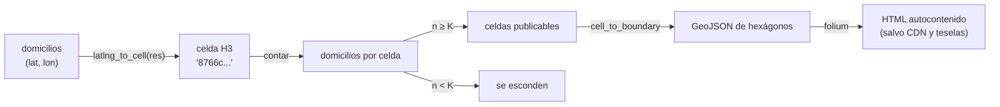

# 🗾 gi06 — Mapas como entregable

> Python para desarrolladores Java senior · **Carta** · Track `gi` — Geoespacial ·
> sección 6 de 7
> Se lee suelta: no hace falta ninguna otra sección de la carta. Conviene haber leído
> [`gi02`](op158-gi02-vectorial.md) (joins espaciales).
> Versiones verificadas contra PyPI el 07/10/2026 · Código probado el 07/10/2026 con Python 3.14.7,
> en contenedor: las salidas son las de esa corrida.

---

## 🎯 1. Qué problema resuelve

Julián quiere ver en el comité de franquicia **de dónde vienen los pacientes** de cada sede, para decidir dónde abrir la undécima. La respuesta obvia es un mapa con
un punto por paciente, y es la respuesta equivocada por dos razones: dos mil puntos se tapan entre sí y no dicen nada, y **cada punto es el domicilio de una
persona**, metido en un HTML que se reenvía por correo. Un mapa de puntos de pacientes es una base de datos de direcciones con otra extensión.

El mapa que se entrega es un **cálculo antes que un dibujo**: agregar los domicilios en celdas, esconder las celdas con muy pocos, y pintar el resultado. Para lo
primero, **H3** (el índice jerárquico de hexágonos que Uber publicó) asigna a cada coordenada una celda de tamaño fijo según la resolución; para lo segundo,
**folium** escribe un HTML con Leaflet que se abre en cualquier navegador sin servidor. `keplergl` y `pydeck` hacen lo mismo con WebGL para millones de puntos.

La frontera con el track `vz` es la que la propuesta pide: aquí no se elige color ni tipografía. Se decide **qué resolución**, **qué umbral** y **qué sale del
servidor**, y se mide cuánto cuesta cada decisión. Los dos mil domicilios son la misma nube **sintética** de gi02.

---

## 🧠 2. El modelo



| Índice | Forma | Lo que gana | Lo que pierde |
|---|---|---|---|
| **H3** | Hexágonos en 16 resoluciones | Las seis vecinas están a la misma distancia; anillos (`grid_disk`) triviales | Un hexágono no se divide exacto en siete hijos: la jerarquía es aproximada |
| **S2** (Google) | Cuadriláteros sobre un cubo proyectado a la esfera | Jerarquía exacta (cuatro hijos), cubrimientos de polígonos | Vecinas a distancias distintas; `s2sphere` no publica desde noviembre de 2017 (💤) |
| **Geohash** | Rectángulos por prefijo de texto | Un `LIKE 'd2g6%'` en cualquier base | Celdas que se deforman con la latitud y bordes con saltos de prefijo |
| **Polígonos administrativos** | Localidades, UPZ, barrios | Los entiende el comité | Tamaños muy distintos: comparar conteos entre ellos engaña |

---

## 💻 3. El ejemplo que corre

```bash
uv add folium==0.20.0 h3==4.5.0 numpy==2.5.3
```

`mapa.py`:

```python
"""El mapa como entregable: agregar en hexágonos H3, suprimir las celdas chicas y entregar un HTML con folium."""

import os

import folium
import h3
import numpy as np

SEDES = {
    "Centro": (4.6040, -74.0660), "Chapinero": (4.6486, -74.0628), "Suba": (4.7410, -74.0840),
    "Kennedy": (4.6280, -74.1530), "Usaquén": (4.6950, -74.0310), "Engativá": (4.7070, -74.1100),
    "Fontibón": (4.6780, -74.1410), "Restrepo": (4.5880, -74.1030), "Soacha": (4.5790, -74.2170),
}
rng = np.random.default_rng(7)                       # 2.000 domicilios sintéticos, la misma nube de gi02
lats, lons = rng.normal(4.66, 0.07, 2000), rng.normal(-74.09, 0.05, 2000)

# 1. La resolución decide el tamaño de la celda, y con él cuánto se ve y cuánto se esconde
K = 10                                               # una celda con menos de K domicilios no se publica
print("res   área media   celdas   máx/celda   celdas < K   domicilios escondidos")
for res in (6, 7, 8, 9):
    cells = [h3.latlng_to_cell(lat, lon, res) for lat, lon in zip(lats, lons)]
    ids, counts = np.unique(cells, return_counts=True)
    small = counts < K
    print(f"{res:>3} {h3.average_hexagon_area(res, unit='km^2'):9.3f} km² {len(ids):>8} {counts.max():>11} "
          f"{small.sum():>12} {counts[small].sum():>22}")

# 2. Resolución 7: celdas de unos 5 km² y la supresión aplicada
RES = 7
cells = [h3.latlng_to_cell(lat, lon, RES) for lat, lon in zip(lats, lons)]
ids, counts = np.unique(cells, return_counts=True)
published = {cell: int(n) for cell, n in zip(ids, counts) if n >= K}

# 3. Cobertura: celdas a uno o dos anillos de la celda de cada sede
covered = set()
for lat, lon in SEDES.values():
    covered |= set(h3.grid_disk(h3.latlng_to_cell(lat, lon, RES), 1))
in_reach = sum(n for cell, n in published.items() if cell in covered)
print(f"\nresolución {RES}: {len(published)} celdas publicadas · {in_reach} domicilios en celdas a un anillo de una sede")
print("vecinas de una celda:", len(h3.grid_disk(ids[0], 1)) - 1, "· siempre a la misma distancia del centro")


def hexagons(data):
    features = []
    for cell, n in data.items():
        ring = [(lon, lat) for lat, lon in h3.cell_to_boundary(cell)]   # GeoJSON quiere (lon, lat)
        features.append({"type": "Feature", "properties": {"pacientes": n},
                         "geometry": {"type": "Polygon", "coordinates": [ring + ring[:1]]}})
    return {"type": "FeatureCollection", "features": features}


top = max(published.values())
hex_map = folium.Map(location=(4.66, -74.09), zoom_start=11)   # teselas de OSM, sin clave
folium.GeoJson(
    hexagons(published),
    style_function=lambda f: {"fillColor": "#2b6cb0", "color": "#2b6cb0", "weight": 0.5,
                              "fillOpacity": 0.1 + 0.7 * f["properties"]["pacientes"] / top},
    tooltip=folium.GeoJsonTooltip(["pacientes"]),
).add_to(hex_map)
for name, (lat, lon) in SEDES.items():
    folium.Marker((lat, lon), tooltip=name).add_to(hex_map)
hex_map.save("cobertura_h3.html")

# 4. El mismo mapa con un punto por domicilio: lo que NO se entrega
dot_map = folium.Map(location=(4.66, -74.09), zoom_start=11)   # teselas de OSM, sin clave
for lat, lon in zip(lats, lons):
    folium.CircleMarker((lat, lon), radius=2).add_to(dot_map)
dot_map.save("puntos.html")

for name in ("cobertura_h3.html", "puntos.html"):
    html = open(name, encoding="utf-8").read()
    print(f"{name:<18} {os.path.getsize(name) / 1024:7.1f} KB · coordenadas de domicilio adentro: "
          f"{f'{lats[0]:.6f}'[:7] in html}")
```

```bash
uv run mapa.py
```

Salida (Python 3.14.7, 07/10/2026):

```text
res   área media   celdas   máx/celda   celdas < K   domicilios escondidos
  6    36.129 km²       46         273           20                     63
  7     5.161 km²      217          49          148                    473
  8     0.737 km²      807          12          803                   1957
  9     0.105 km²     1684           4         1684                   2000

resolución 7: 69 celdas publicadas · 1093 domicilios en celdas a un anillo de una sede
vecinas de una celda: 6 · siempre a la misma distancia del centro
cobertura_h3.html     40.7 KB · coordenadas de domicilio adentro: False
puntos.html          973.7 KB · coordenadas de domicilio adentro: True
```

Lo que dicen los números:

- **La resolución es un control de privacidad, no de estética.** Con K = 10, la resolución 6 (36 km² por celda) esconde 63 domicilios y no dice casi nada de la
  ciudad; la 7 (5 km²) esconde 473, el 24 %; la 8 esconde 1.957 de 2.000, y la 9 los esconde todos porque ninguna celda pasa de cuatro. Con dos mil pacientes, la
  resolución 7 es el punto donde el mapa todavía dice algo y casi nadie queda solo en su celda.
- **69 celdas publicadas** en resolución 7, y 1.093 domicilios en celdas a un anillo de alguna sede: la cuenta de cobertura que el comité necesita, sin que nadie vea
  un punto.
- **Seis vecinas, a la misma distancia del centro**: por eso `grid_disk(celda, 1)` es una buena aproximación de "alrededor de la sede", y un cuadrado de geohash no.
- **El HTML de hexágonos pesa 41 KB y no contiene ninguna coordenada de domicilio**; el de puntos pesa 974 KB y las contiene todas, en texto, para cualquiera que
  abra el código fuente de la página.

**Detalles con intención**

- **`cell_to_boundary` devuelve (lat, lon)** y GeoJSON pide (lon, lat): el `ring` los invierte. Es la trampa de orden de ejes de gi01, otra vez.
- **El anillo se cierra** repitiendo el primer vértice (`ring + ring[:1]`): GeoJSON lo exige y Leaflet perdona que falte; otros lectores no.
- **Las teselas son las de OpenStreetMap.** La primera versión usaba `tiles="CartoDB positron"` y folium 0.20.0 avisó en la corrida: *CartoDB tiles now require an
  API key*. Un mapa entregado que depende de una clave se apaga cuando la clave vence.
- **El HTML no es autocontenido**: carga Leaflet, Bootstrap, jQuery y Font Awesome de cuatro CDN (diez archivos, contados en la corrida) y las teselas de
  `tile.openstreetmap.org`. Sin internet, se ve un fondo gris.

---

## ⚠️ 4. Lo que se rompe

**El mapa de puntos "solo para uso interno".** Un HTML se reenvía, se adjunta y se sube a un drive. Las coordenadas exactas van en texto plano en el archivo, y con
dirección aproximada y sede, el paciente se reidentifica (es el problema de los tres campos que la historia de Áurea plantea para la ciencia de datos). Se agrega
en el servidor; el navegador recibe celdas.

**El umbral sin la resta.** Esconder las celdas con menos de K no basta si el mapa también publica el total por sede: total menos lo publicado revela lo escondido.
El umbral se aplica a **todas** las cifras del entregable, no solo a la capa del mapa.

**El coroplético de polígonos desiguales.** Pintar conteos por localidad hace que Suba (100 km²) parezca más importante que La Candelaria (2 km²) por tamaño. Con
celdas de igual área, el color compara lo mismo; con polígonos administrativos, se pinta la **tasa** (por habitante o por km²), no el conteo.

**folium para cien mil puntos.** Cada punto es un objeto de JavaScript en el HTML: a la escala del ejemplo ya pesa un mega; con cien mil, el navegador se cuelga.
Para eso, `pydeck` o `keplergl` (WebGL), o teselas vectoriales servidas aparte.

---

## ⚖️ 5. Cuándo NO usarla

**Cuando la pregunta tiene diez respuestas.** "¿Cuántos pacientes vienen de cada localidad?" es una tabla de diez filas; el mapa agrega una capa de lectura que no
agrega información. La tabla ordenada se entiende más rápido en el comité.

**Cuando el entregable vive en un tablero que ya existe.** Si la empresa tiene Metabase, Superset o Power BI, sus mapas leen la tabla agregada directamente; un HTML
suelto es un archivo más que versionar y reenviar.

**Cuando hace falta un SIG.** Edición de polígonos, capas de catastro, análisis interactivo: eso es QGIS, y Python le prepara las capas (gi02) en GeoPackage.

---

## 🧪 6. Ejercicios (10)

**🟢 Fácil (1–3)**

1. Corre el ejemplo y abre los dos HTML. **Criterio:** la salida completa, y en el código fuente de `puntos.html` encuentras una coordenada de domicilio.
2. Cambia K a 5 y a 20. **Criterio:** la tabla de domicilios escondidos para las cuatro resoluciones con cada K.
3. Agrega una capa con los anillos de cobertura de cada sede (`grid_disk` de 1) en otro color. **Criterio:** la capa se puede prender y apagar con
   `folium.LayerControl`.

**🟡 Intermedio (4–6)**

4. Escribe una prueba que falle si un HTML entregable contiene alguna coordenada de domicilio con cuatro o más decimales. **Criterio:** la prueba falla con
   `puntos.html` y pasa con `cobertura_h3.html`.
5. Repite la agregación con geohash de 6 caracteres (con una función propia o `pygeohash`). **Criterio:** número de celdas, área de una celda en Bogotá, y cuántos
   domicilios esconde con K = 10.
6. Haz que el total por sede respete el mismo umbral (ninguna cifra publicada por debajo de K). **Criterio:** no se puede reconstruir lo escondido restando cifras
   del entregable.

**🟠 Difícil (7–9)**

7. Dibuja los mismos hexágonos con `pydeck` (`H3HexagonLayer`) y compara el peso del HTML contra folium. **Criterio:** los dos pesos y la diferencia al pasar a
   50.000 domicilios.
8. Mide la supresión con nubes de 2.000, 20.000 y 200.000 domicilios. **Criterio:** para cada tamaño, la resolución más fina que esconde menos del 10 %.
9. Genera el HTML sin dependencias de internet (Leaflet y los estilos embebidos, sin teselas o con teselas locales). **Criterio:** se abre bien con la red apagada.

**🔴 Muy difícil (10)**

10. Diseña el mapa de procedencia de pacientes para el comité de franquicia. **Criterio:** una página y el HTML. *Rúbrica:* (a) la resolución y el umbral, con la
    tabla de supresión que los justifica; (b) qué cifras acompañan al mapa y cómo respetan el umbral; (c) dónde se agrega (nunca en el navegador); (d) cómo se
    prueba que el entregable no contiene coordenadas.

---

## 📚 7. Referencias

**Documentación oficial**

- H3, la documentación: https://h3geo.org/docs/
- H3, tablas de resolución (área y lado de cada nivel): https://h3geo.org/docs/core-library/restable/
- folium: https://python-visualization.github.io/folium/latest/
- pydeck: https://deckgl.readthedocs.io/en/latest/
- La política de uso de las teselas de OpenStreetMap: https://operations.osmfoundation.org/policies/tiles/

**Por qué hexágonos**

- H3, *Indexing* (la comparación con cuadrados y triángulos que motivó el diseño): https://h3geo.org/docs/highlights/indexing/

**Orden de lectura sugerido:** la página *Indexing* de H3 (por qué hexágonos); la tabla de resoluciones de H3; folium cuando haya que dibujar.

---

## 🚀 8. Cierre

El mapa que se entrega es una agregación con un umbral, y la resolución es la perilla entre lo que se ve y lo que se esconde: con dos mil domicilios, la 7
publica 69 celdas y esconde un cuarto; la 9 lo esconde todo. El HTML de celdas pesa 41 KB y no tiene un solo domicilio adentro; el de puntos pesa un mega y los
tiene todos.

**La señal de que quedó bien:** *"Ningún mapa que sale de mi código contiene una coordenada de paciente, y puedo mostrar la tabla que justifica la resolución y el
umbral."*

> 🏷️ **Cierra la sección con su tag**, cuando los ejercicios que elegiste estén hechos:
>
> ```bash
> git tag -a op-gi-fase-06 -m "op gi06 cerrada: mapa de procedencia en hexágonos H3 con umbral y sin coordenadas"
> ```
>
> Los commits llevan su prefijo (`op gi06: …`) y los de ejercicio su número
> (`op gi06 ej07: …`).
