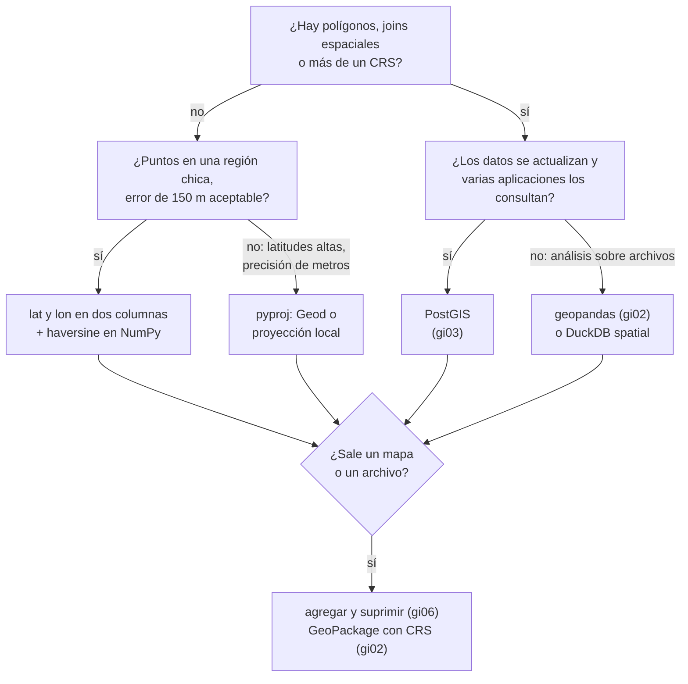

# ⚖️ gi07 — Veredicto: cuándo basta con lat y lon

> Python para desarrolladores Java senior · **Carta** · Track `gi` — Geoespacial ·
> sección 7 de 7
> Se lee suelta: no hace falta ninguna otra sección de la carta. Recoge lo medido en
> [`gi01`](op157-gi01-el-modelo.md)–[`gi06`](op162-gi06-mapas-como-entregable.md).
> Versiones verificadas contra PyPI el 07/10/2026 · Código probado el 07/10/2026 con Python 3.14.7,
> en contenedor: las salidas son las de esa corrida.

---

## 🎯 1. Qué problema resuelve

El track abrió con una variable del modelo de ausentismo —la distancia del paciente a la sede— y una sospecha: que la hoja de cálculo con `* 111` no alcanzaba. Seis
secciones después, la respuesta honesta es incómoda para el entusiasmo: **en Bogotá, para esa variable, casi alcanza.** gi01 midió el atajo con 0,66 % de error a 47
km; gi02 vio que el join en grados asigna las mismas sedes que en metros. Lo que sí rompió cosas en el track fue otra cosa: el orden de los ejes, el SRID que no
coincide, el índice que no se usa, la resta en `uint16`, la dirección mal geocodificada y el mapa con domicilios adentro.

Este veredicto pone números a la decisión: la misma pregunta —la sede más cercana y su distancia, para 200.000 domicilios sintéticos— resuelta con cuatro pilas, desde
Python sin dependencias hasta DuckDB con su extensión espacial. Se mide el tiempo, cuánto se aleja cada una de la geodésica sobre el elipsoide, cuánto pesa
instalarla, y dónde se equivoca sin avisar.

---

## 🧠 2. El modelo



### 📖 Diccionario de cierre

```text
Lo que el track enseñó                         Dónde
CRS y orden de ejes · always_xy=True        ⇄  gi01
joins espaciales · doble conteo · GeoPackage ⇄  gi02
ST_DWithin · índice sobre la expresión      ⇄  gi03
ráster · ventanas · NDVI sin desborde       ⇄  gi04
factor de rodeo · geocodificar con filtro   ⇄  gi05
H3 · umbral · mapa sin domicilios           ⇄  gi06
```

---

## 💻 3. El ejemplo que corre

```bash
uv add numpy==2.5.3 geopandas==1.2.0 pyogrio==0.13.0 shapely==2.1.2 pyproj==3.8.0 duckdb==1.5.6 pandas==3.0.6
```

`veredicto.py`:

```python
"""La misma pregunta en cuatro pilas: la sede más cercana y su distancia para 200.000 domicilios sintéticos."""

import math
import time

import duckdb
import geopandas as gpd
import numpy as np
import pandas as pd
from pyproj import Geod

SEDES = {
    "Centro": (4.6040, -74.0660), "Chapinero": (4.6486, -74.0628), "Suba": (4.7410, -74.0840),
    "Kennedy": (4.6280, -74.1530), "Usaquén": (4.6950, -74.0310), "Engativá": (4.7070, -74.1100),
    "Fontibón": (4.6780, -74.1410), "Restrepo": (4.5880, -74.1030), "Soacha": (4.5790, -74.2170),
    "Zipaquirá": (5.0220, -73.9950),
}
N = 200_000
rng = np.random.default_rng(7)
lats, lons = rng.normal(4.66, 0.07, N), rng.normal(-74.09, 0.05, N)
s_lat = np.array([lat for lat, _ in SEDES.values()])
s_lon = np.array([lon for _, lon in SEDES.values()])
R = 6_371_008.8                                       # radio medio de la Tierra, en metros
results = {}


def timed(name):
    def wrap(fn):
        start = time.perf_counter()
        idx, metres = fn()
        results[name] = (np.asarray(idx), np.asarray(metres, dtype=float), time.perf_counter() - start)
    return wrap


@timed("1 Python puro (haversine)")
def pure():
    idx, out = [], []
    sedes = list(zip(s_lat.tolist(), s_lon.tolist()))
    for lat, lon in zip(lats.tolist(), lons.tolist()):
        best, best_i = math.inf, -1
        for i, (la, lo) in enumerate(sedes):
            p1, p2 = math.radians(lat), math.radians(la)
            h = math.sin((p2 - p1) / 2) ** 2 + math.cos(p1) * math.cos(p2) * math.sin(math.radians(lo - lon) / 2) ** 2
            d = 2 * R * math.asin(math.sqrt(h))
            if d < best:
                best, best_i = d, i
        idx.append(best_i); out.append(best)
    return idx, out


@timed("2 NumPy (haversine)")
def vectorised():
    p1, p2 = np.radians(lats)[:, None], np.radians(s_lat)[None, :]
    h = np.sin((p2 - p1) / 2) ** 2 + np.cos(p1) * np.cos(p2) * np.sin(np.radians(s_lon[None, :] - lons[:, None]) / 2) ** 2
    d = 2 * R * np.arcsin(np.sqrt(h))
    return d.argmin(axis=1), d.min(axis=1)


@timed("3 geopandas en EPSG:9377")
def with_geopandas():
    homes = gpd.GeoDataFrame(geometry=gpd.points_from_xy(lons, lats), crs=4326).to_crs(9377)
    sedes = gpd.GeoDataFrame({"i": range(10)}, geometry=gpd.points_from_xy(s_lon, s_lat), crs=4326).to_crs(9377)
    joined = gpd.sjoin_nearest(homes, sedes, distance_col="d")
    joined = joined[~joined.index.duplicated()].sort_index()
    return joined["i"].to_numpy(), joined["d"].to_numpy()


con = duckdb.connect()
con.execute("INSTALL spatial; LOAD spatial")          # la primera vez baja la extensión: fuera de la medición
con.register("homes", pd.DataFrame({"id": range(N), "lat": lats, "lon": lons}))
con.register("sedes", pd.DataFrame({"i": range(10), "lat": s_lat, "lon": s_lon}))


def duckdb_sphere(lat_first):
    a, b = ("lat", "lon") if lat_first else ("lon", "lat")
    rows = con.execute(f"""
        SELECT id, arg_min(s.i, d), min(d) FROM (
            SELECT h.id, s.i, ST_Distance_Sphere(ST_Point(h.{a}, h.{b}), ST_Point(s.{a}, s.{b})) AS d
            FROM homes h CROSS JOIN sedes s) s
        GROUP BY id ORDER BY id""").fetchnumpy()
    return list(rows.values())[1], list(rows.values())[2]


timed("4 DuckDB spatial, ST_Point(lon, lat)")(lambda: duckdb_sphere(lat_first=False))
timed("5 DuckDB spatial, ST_Point(lat, lon)")(lambda: duckdb_sphere(lat_first=True))

# La referencia: la geodésica sobre el elipsoide, para la sede que eligió NumPy
ref_idx = results["2 NumPy (haversine)"][0]
_, _, ref = Geod(ellps="WGS84").inv(lons, lats, s_lon[ref_idx], s_lat[ref_idx])

print(f"{'pila':<38} {'tiempo':>8} {'misma sede':>11} {'error máx':>10} {'error mediano':>14}")
for name, (idx, metres, seconds) in results.items():
    same = (idx == ref_idx).mean() * 100
    err = np.abs(metres - ref)
    print(f"{name:<38} {seconds:7.2f}s {same:10.2f}% {err.max():9.1f}m {np.median(err):13.1f}m")
```

```bash
uv run veredicto.py
```

Salida (Python 3.14.7, 07/10/2026) (una corrida en contenedor; los segundos comparan pilas entre sí):

```text
pila                                     tiempo  misma sede  error máx  error mediano
1 Python puro (haversine)                 0.78s     100.00%     148.0m           5.6m
2 NumPy (haversine)                       0.08s     100.00%     148.0m           5.6m
3 geopandas en EPSG:9377                  0.25s      99.75%      94.1m           2.0m
4 DuckDB spatial, ST_Point(lon, lat)      0.21s      57.28%   19050.3m        1444.4m
5 DuckDB spatial, ST_Point(lat, lon)      0.22s     100.00%     147.9m           5.6m
```

Y cuánto pesa instalar cada pila, con sus dependencias, en un directorio vacío (`pesos.sh`):

```bash
# Cuánto pesa instalar cada pila, en un directorio vacío por pila
for stack in "numpy==2.5.3" "pyproj==3.8.0 shapely==2.1.2" "geopandas==1.2.0 pyogrio==0.13.0" "duckdb==1.5.6"; do
  dir=$(mktemp -d)
  pip install -q --root-user-action=ignore --target "$dir" $stack >/dev/null 2>&1
  printf "%-36s %5s MB\n" "$stack" "$(du -sm "$dir" | cut -f1)"
done
```

Salida (Python 3.14.7, 07/10/2026):

```text
numpy==2.5.3                            68 MB
pyproj==3.8.0 shapely==2.1.2           117 MB
geopandas==1.2.0 pyogrio==0.13.0       296 MB
duckdb==1.5.6                           54 MB
```

Lo que dicen los números:

- **El haversine acierta la sede en el 100 % de los casos** y se aleja de la geodésica a lo sumo 148 metros (mediana 5,6 m): es el costo de suponer la Tierra
  esférica. En NumPy tarda 0,08 s para dos millones de distancias; en Python puro, diez veces más (0,78 s), y sigue siendo menos de un segundo.
- **geopandas en 9377 se acerca más a la geodésica** (máximo 94 m, mediana 2 m) y **cambia la sede en el 0,25 %** de los domicilios: los que están casi a la misma
  distancia de dos sedes, donde la diferencia entre plano y elipsoide decide el empate. Ninguna de las dos respuestas está mal; son dos modelos de la Tierra.
- **DuckDB con `ST_Point(lon, lat)` asigna mal el 43 % y se equivoca hasta 19 km**, sin error ni aviso. `ST_Distance_Sphere` de la extensión `spatial` espera
  **(lat, lon)**, al revés del orden x/y que la misma extensión usa para todo lo demás. Con `ST_Point(lat, lon)` da exactamente lo del haversine. Es la trampa de gi01,
  en otra biblioteca y en otro idioma.
- **Instalar pesa de 54 MB (DuckDB) a 296 MB (geopandas con pyogrio, pyproj, shapely, pandas y NumPy)**. NumPy solo, 68 MB; el haversine en Python puro, cero.

**Detalles con intención**

- **La referencia es `Geod.inv` sobre el elipsoide WGS84** para la sede que eligió NumPy; así el error mide la distancia, y "misma sede" mide la asignación.
- **`INSTALL spatial` queda fuera de la medición**: la primera vez baja la extensión de internet (en esta corrida, la versión `04270fe`). En un servidor sin salida a
  internet, la extensión se instala en la imagen, no en tiempo de ejecución.
- **`joined.index.duplicated()`**: `sjoin_nearest` devuelve dos filas en los empates exactos (gi02); aquí se queda la primera para comparar fila a fila.

---

## ⚠️ 4. Lo que se rompe

Lo que el track encontró, en una lista que sirve de revisión de código:

- **El orden de los ejes**, cuatro veces: `pyproj` sin `always_xy` (gi01), GeoJSON contra `cell_to_boundary` (gi06), `sample` con (lon, lat) sobre un ráster
  proyectado (gi04), y `ST_Distance_Sphere` de DuckDB (aquí). Ninguna lanza excepción.
- **El SRID que no coincide**: el Centro de Bogotá a 3.777 km, en el Pacífico (gi01); el join con cero filas y un aviso (gi02); EPSG:9377 ausente del catálogo de
  PostGIS 3.6.4 (gi03).
- **El índice que no se usa**: `ST_Distance(…) < x` contra `ST_DWithin`, nueve veces más lento (gi03).
- **El dato que se escapa**: la dirección que viaja a un geocodificador externo (gi05) y el HTML con dos mil domicilios en texto plano (gi06).

---

## ⚖️ 5. Cuándo NO usar lo que este track enseñó

**Cuando todos los puntos están en una ciudad cerca del ecuador y la pregunta es una distancia por fila.** Dos columnas `lat` y `lon` en WGS84, documentadas como tales,
y el haversine en NumPy: cero dependencias geoespaciales, 0,08 s para doscientos mil domicilios, 148 m de error máximo. Para el modelo de ausentismo de Áurea, esa es
la respuesta, y montar geopandas o PostGIS para eso es pagar 296 MB y un servidor por 54 metros de precisión que el modelo no usa.

**Cuando la distancia que importa es la del trayecto.** Ninguna de las cinco pilas de la tabla la calcula: miden recta. Si la variable tiene que reflejar el río y el
puente, la respuesta es un motor de ruteo (gi05), no una biblioteca de geometría más precisa.

**Cuando el equipo no va a mantener la pila.** Un sistema con un solo ingeniero (la tesis del curso) paga cada dependencia nativa en cada actualización de Python: GDAL,
PROJ y GEOS vienen dentro de las ruedas, pero un PostGIS es un motor más que respaldar, migrar y vigilar.

**Y el track entero se vuelve imprescindible** el día que aparecen polígonos (zonas de cobertura, localidades, catastro), más de una fuente con su CRS, consultas de
vecindad sobre millones de filas, o un mapa que sale de la empresa.

---

## 🧪 6. Ejercicios (10)

**🟢 Fácil (1–3)**

1. Corre `veredicto.py`. **Criterio:** la tabla de cinco filas, y la explicación de la fila 4 en una frase.
2. Corre `pesos.sh`. **Criterio:** los cuatro pesos en tu máquina, y cuál de las pilas ya tenías instalada por otro motivo.
3. Repite la tabla con los domicilios centrados en Oslo (lat 59,9) y las sedes desplazadas igual. **Criterio:** el error máximo del haversine y si la asignación
   sigue en 100 %.

**🟡 Intermedio (4–6)**

4. Agrega a la tabla la fórmula de Vincenty (o `Geod.inv` vectorizado como pila completa). **Criterio:** su tiempo y su error, que debe ser cero contra la referencia.
5. Agrega PostGIS (gi03) como sexta pila, con `ST_Distance` sobre `geography`. **Criterio:** tiempo de la consulta, misma sede y error contra la referencia.
6. Escribe una prueba que atrape la fila 4: dos puntos conocidos (Centro y Zipaquirá) cuya distancia debe dar 46,9 km ± 0,5. **Criterio:** la prueba falla con
   `ST_Point(lon, lat)` y pasa con `ST_Point(lat, lon)`.

**🟠 Difícil (7–9)**

7. Lleva la tabla a dos millones de domicilios. **Criterio:** tiempo y memoria máxima de cada pila, y cuál deja de ser viable.
8. Mide cuántas asignaciones cambian entre haversine y geopandas en 9377 en función de la distancia entre las dos sedes más cercanas. **Criterio:** una tabla que
   muestre que los cambios se concentran en los casi-empates.
9. Repite la medición con la distancia por la red (gi05) en un barrio real de Bogotá. **Criterio:** cuántas asignaciones cambian contra la recta, y si la
   conclusión del veredicto se sostiene.

**🔴 Muy difícil (10)**

10. Escribe el ADR de la pila geoespacial de un sistema real. **Criterio:** una página con la decisión y su medición. *Rúbrica:* (a) la pregunta concreta y su
    precisión necesaria; (b) la tabla de pilas con tiempo, error y peso en tus datos; (c) las trampas de esta sección que la elección te obliga a probar; (d) qué
    hecho futuro te haría cambiar de pila.

---

## 📚 7. Referencias

- DuckDB, la extensión `spatial` y `ST_Distance_Sphere`: https://duckdb.org/docs/stable/core_extensions/spatial/functions
- Chris Veness, *Calculate distance, bearing and more between Latitude/Longitude points* (haversine, Vincenty y sus errores): https://www.movable-type.co.uk/scripts/latlong.html
- Charles Karney, *Algorithms for geodesics* (2013), la base de `Geod`: https://arxiv.org/abs/1109.4448
- pyproj, la página de trampas: https://pyproj4.github.io/pyproj/stable/gotchas.html

**Orden de lectura sugerido:** la página de Veness (media hora, y se entiende de dónde salen los 148 m); la de funciones de DuckDB antes de usar
`ST_Distance_Sphere`; Karney solo si la precisión de metros importa.

---

## 🚀 8. Cierre

Para la variable del modelo de ausentismo, dos columnas y el haversine en NumPy alcanzan: 100 % de asignaciones correctas, 148 m de error máximo y cero dependencias
geoespaciales. El track no se gana su lugar con precisión en Bogotá; se lo gana con todo lo que rompe en silencio cuando llegan polígonos, otros CRS, millones de
filas o un mapa que sale de la empresa, y con la lista de trampas que ahora se revisan en cada pila, incluida la que se usa para no usar ninguna.

**La señal de que quedó bien:** *"Puedo decir con una tabla medida por qué mi sistema usa (o no usa) una biblioteca geoespacial, y tengo una prueba con dos puntos
conocidos que atrapa el orden de ejes en cualquier pila."*

> 🏷️ **Cierra la sección con su tag**, cuando los ejercicios que elegiste estén hechos:
>
> ```bash
> git tag -a op-gi-fase-07 -m "op gi07 cerrada: la misma distancia en cinco pilas, medida, y el veredicto de dos columnas"
> ```
>
> Los commits llevan su prefijo (`op gi07: …`) y los de ejercicio su número
> (`op gi07 ej07: …`).
