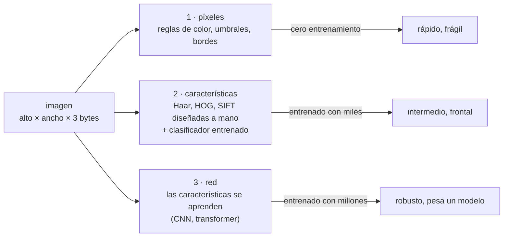

# 👁️ cv01 — El modelo: píxeles, características, red

> Python para desarrolladores Java senior · **Carta** · Track `cv` — Visión por computador ·
> sección 1 de 8
> Se lee suelta: no hace falta ninguna otra sección de la carta.
> Versiones verificadas contra PyPI el 07/10/2026 · Código probado el 07/10/2026 con Python 3.14.7,
> en contenedor: las salidas son las de esa corrida.

---

## 🎯 1. Qué problema resuelve

Áurea vive de fotografías de rostros. La fase 0 de Arquitectura de Sonrisa empieza con fotografía clínica estandarizada; las publicaciones de Marcela son antes y
después; la simulación que el paciente aprueba es una imagen de su propia cara. Cualquiera que haya visto lo que hoy hace un modelo de visión piensa en lo mismo:
encuadrar sola cada foto, alinear el antes con el después, simular la sonrisa. Y la historia de la empresa pone la frontera en el mismo lugar: esas fotos son
**historia clínica** y **datos biométricos**, reservados y sensibles.

Este track enseña la técnica y la frontera juntas, con una regla dura (guía del curso §14.3): **ninguna imagen de paciente aparece ni se sugiere**. Los ejemplos
usan la foto de prueba que trae scikit-image —`skimage.data.astronaut()`, un retrato de dominio público de la NASA que la comunidad usa desde hace décadas para
probar algoritmos—, rostros dibujados con código, y en los ejercicios el rostro del propio lector. Ningún ejemplo sube nada a un servicio externo.

La primera sección pone el modelo que ordena el resto: hay **tres niveles** para resolver un problema de visión —una regla sobre píxeles, un clasificador sobre
características diseñadas a mano, una red entrenada— y el mismo problema (encontrar rostros en una escena) se resuelve con los tres, midiendo cuánto acierta y
cuánto cuesta cada uno.

---

## 🧠 2. El modelo



| Nivel | Qué decide | Lo que hace bien | Dónde se rompe |
|---|---|---|---|
| Píxeles | Una regla escrita por ti (rango de color, umbral, borde) | Problemas con condiciones controladas: un fondo verde, un código QR, una pieza en una banda | Cualquier variación que la regla no previó: luz, tono de piel, un café del mismo color |
| Características | Un clasificador sobre rasgos diseñados (Haar: diferencias de brillo entre rectángulos) | Barato, sin GPU, explicable | Pose y escala fuera de lo que vio al entrenar |
| Red | Rasgos aprendidos de millones de ejemplos | Robustez a pose, escala, luz | Lo que el conjunto de entrenamiento no tenía; costo, licencia, sesgo |

**OpenCV** tiene los tres: las operaciones de píxeles de siempre, los clasificadores clásicos, y un módulo `dnn` que corre redes ya entrenadas (ONNX) sin PyTorch.
Por eso es el punto de partida del track; MediaPipe, InsightFace o `ultralytics` aparecen cuando el problema pide su red.

### 🪞 Tu instinto de Java dice… y esta vez se equivoca

*"Es un problema de reglas: si escribo bien las condiciones, funciona."* Es el instinto correcto para validar un formulario y el equivocado para una imagen. La
regla de color de abajo encuentra los cinco rostros… y veintitrés cosas más. Un sistema de visión no se especifica con condiciones; se **mide** con un conjunto de
prueba y se acepta con una tasa de error.

---

## 💻 3. El ejemplo que corre

```bash
uv add opencv-contrib-python-headless==5.0.0.93 scikit-image==0.26.0 numpy==2.5.3
```

`tres_niveles.py` arma una escena con la foto de prueba en cinco variantes (tres escalas, girada 30°, en espejo y oscura) y dos imágenes sin rostro (un café y un
gato, también de scikit-image), y corre los tres detectores:

```python
"""El mismo problema en tres niveles: encontrar rostros con una regla de píxeles, con características (Haar) y con una red (YuNet)."""

import pathlib
import time
import urllib.request

import cv2
import numpy as np
from skimage import data

MODELS = pathlib.Path("modelos")
YUNET = "https://github.com/opencv/opencv_zoo/raw/main/models/face_detection_yunet/face_detection_yunet_2023mar.onnx"
# OpenCV 5 ya no trae las cascadas dentro del paquete: viven en opencv_contrib, módulo xobjdetect
HAAR = ("https://raw.githubusercontent.com/opencv/opencv_contrib/5.x/modules/xobjdetect/data/haarcascades/"
        "haarcascade_frontalface_default.xml")


def fetch(url):
    """Baja el modelo una vez y lo deja en modelos/."""
    MODELS.mkdir(exist_ok=True)
    path = MODELS / url.rsplit("/", 1)[1]
    if not path.exists():
        urllib.request.urlretrieve(url, path)
    return str(path)


# La escena: la foto de prueba de scikit-image (dominio público, NASA) en cinco variantes, y dos imágenes sin rostro
face = cv2.cvtColor(data.astronaut(), cv2.COLOR_RGB2BGR)
rotated = cv2.warpAffine(face, cv2.getRotationMatrix2D((256, 256), 30, 1.0), (512, 512), borderValue=(90, 90, 90))
tiles = [
    ("rostro 1:1,6", cv2.resize(face, (320, 320)), True),
    ("rostro 1:3,3", cv2.resize(face, (154, 154)), True),
    ("rostro 1:6,6", cv2.resize(face, (77, 77)), True),
    ("girado 30°", cv2.resize(rotated, (240, 240)), True),
    ("espejo y oscuro", cv2.resize(cv2.flip(face, 1) // 3, (240, 240)), True),
    ("café", cv2.resize(cv2.cvtColor(data.coffee(), cv2.COLOR_RGB2BGR), (300, 200)), False),
    ("gato", cv2.resize(cv2.cvtColor(data.chelsea(), cv2.COLOR_RGB2BGR), (300, 200)), False),
]
rng = np.random.default_rng(1)
scene = rng.integers(70, 110, (720, 1400, 3), dtype=np.uint8)
boxes, x, y = [], 20, 20
for name, img, has_face in tiles:
    h, w = img.shape[:2]
    if x + w > 1380:
        x, y = 20, y + 340
    scene[y:y + h, x:x + w] = img
    boxes.append((name, x, y, w, h, has_face))
    x += w + 30


def score(name, rects, seconds):
    """Cada imagen con rostro cuenta una vez; todo lo demás (una segunda caja, o algo en el café) sobra."""
    hit = set()
    for rx, ry, rw, rh in rects:
        cx, cy = rx + rw / 2, ry + rh / 2
        inside = [b for b in boxes if b[1] <= cx < b[1] + b[3] and b[2] <= cy < b[2] + b[4]]
        if inside and inside[0][5]:
            hit.add(inside[0][0])
    missed = [b[0] for b in boxes if b[5] and b[0] not in hit]
    print(f"{name:<18} {len(rects):>4} detecciones · {len(hit)}/5 rostros · {len(rects) - len(hit):>3} sobrantes · "
          f"{seconds * 1000:5.1f} ms · no encontró: {', '.join(missed) or '—'}")


# 1. Píxeles: una regla de color de piel en YCrCb, y manchas grandes
start = time.perf_counter()
ycrcb = cv2.cvtColor(scene, cv2.COLOR_BGR2YCrCb)
mask = cv2.inRange(ycrcb, (0, 133, 77), (255, 173, 127))
mask = cv2.morphologyEx(mask, cv2.MORPH_OPEN, np.ones((5, 5), np.uint8))
n, _, stats, _ = cv2.connectedComponentsWithStats(mask)
blobs = [tuple(s[:4]) for s in stats[1:] if s[4] > 300]
score("1 regla de color", blobs, time.perf_counter() - start)

# 2. Características: la cascada de Haar de Viola y Jones (2001); en OpenCV 5, solo con opencv-contrib
gray = cv2.cvtColor(scene, cv2.COLOR_BGR2GRAY)
haar = cv2.CascadeClassifier(fetch(HAAR))
start = time.perf_counter()
found = haar.detectMultiScale(gray, scaleFactor=1.1, minNeighbors=5)
score("2 Haar", [tuple(r) for r in found], time.perf_counter() - start)

# 3. Red: YuNet, una red convolucional de 230 KB entrenada para rostros
yunet = cv2.FaceDetectorYN.create(fetch(YUNET), "", (scene.shape[1], scene.shape[0]), score_threshold=0.7)
start = time.perf_counter()
_, faces = yunet.detect(scene)
score("3 YuNet (red)", [tuple(f[:4]) for f in (faces if faces is not None else [])], time.perf_counter() - start)

print(f"\nescena {scene.shape[1]}×{scene.shape[0]} · píxeles con 'color de piel': {mask.mean() / 255:.1%}")
print(f"tamaños: modelo YuNet {pathlib.Path(fetch(YUNET)).stat().st_size / 1024:.0f} KB · "
      f"cascada Haar {pathlib.Path(fetch(HAAR)).stat().st_size / 1024:.0f} KB")
cv2.imwrite("escena.jpg", scene)
```

```bash
uv run tres_niveles.py
```

Salida (Python 3.14.7, 07/10/2026) (OpenCV escribe además por la salida de error `setPreferableTarget Targets are not supported by the new graph engine for now`, un
aviso del motor nuevo de `dnn` en OpenCV 5):

```text
1 regla de color     28 detecciones · 5/5 rostros ·  23 sobrantes ·   4.3 ms · no encontró: —
2 Haar                4 detecciones · 3/5 rostros ·   1 sobrantes ·  89.9 ms · no encontró: rostro 1:6,6, girado 30°
3 YuNet (red)         5 detecciones · 5/5 rostros ·   0 sobrantes ·  92.6 ms · no encontró: —

escena 1400×720 · píxeles con 'color de piel': 15.1%
tamaños: modelo YuNet 227 KB · cascada Haar 908 KB
```

Lo que dicen los números:

- **La regla de color "encuentra" los cinco rostros y veintitrés cosas que no lo son.** El 15 % de la escena tiene "color de piel": la cara, pero también el traje,
  la bandera, el café y el gato. La regla no falla en encontrar; falla en **distinguir**, y es más rápida que las otras dos (4 ms) porque no decide nada.
- **Haar encuentra tres de cinco**: pierde el rostro de 77 píxeles (por debajo de su ventana útil con estos parámetros) y el girado 30° (lo entrenaron con rostros
  frontales y derechos). Deja una caja de más.
- **YuNet encuentra los cinco sin ninguna de más**, incluido el girado y el oscuro, y tarda lo mismo que Haar en esta escena. Pesa 227 KB: menos que el XML de la
  cascada (908 KB). La red no es más cara por ser red.

**Detalles con intención**

- **`opencv-contrib-python-headless`**, no `opencv-python`: en OpenCV 5 **`CascadeClassifier` se mudó a contrib** (módulo `xobjdetect`), y con el paquete principal
  la línea de Haar falla con `AttributeError: module 'cv2' has no attribute 'CascadeClassifier'`. *Headless* porque el ejemplo no abre ventanas y así no necesita
  `libGL`.
- **Las cascadas ya no vienen dentro del paquete**: `cv2.data.haarcascades` apunta a un directorio vacío. `fetch` baja el XML del repositorio de `opencv_contrib`.
  Los dos cambios rompen casi todos los tutoriales escritos para OpenCV 4.
- **`fetch` guarda los modelos en `modelos/`** y no los vuelve a bajar. Un modelo es un artefacto con versión, como un JAR: se fija su URL (con la fecha en el
  nombre, `2023mar`) y se guarda junto al código o en un registro propio.
- **La escena se arma con código** para que la corrida sea reproducible; los recuadros de cada variante son la verdad contra la que se mide.

---

## ⚠️ 4. Lo que se rompe

**Medir con la foto con la que se desarrolló.** Un detector ajustado hasta que funciona con tres fotos funciona con esas tres. Se separa desde el principio un
conjunto de prueba que no se mira mientras se ajusta, y se reportan aciertos, sobrantes y faltantes, no "funciona".

**El sesgo del conjunto de entrenamiento.** Una red entrenada mayoritariamente con un tipo de rostro, de luz o de cámara falla más con los demás, y la regla de color
falla distinto según el tono de piel. Con pacientes de toda una ciudad, eso no es un detalle técnico: es un servicio que funciona peor para algunos. Se mide por
grupo, con consentimiento, antes de desplegar.

**La licencia del modelo.** El código puede ser MIT y los pesos no: hay modelos de rostro publicados "solo para investigación no comercial" (InsightFace, cv05) y
detectores con licencia AGPL (`ultralytics`, cv02). La licencia del modelo se lee antes de la primera línea.

**La versión de OpenCV.** OpenCV 5 movió y quitó cosas (las cascadas, partes del motor `dnn`); un `pip install opencv-python` sin versión fija rompe un sistema que
funcionaba con la 4. La versión va fija, como cualquier otra dependencia.

---

## ⚖️ 5. Cuándo NO usarla

**Cuando el problema lo resuelve el proceso, no el modelo.** Si las fotos clínicas se toman con un protocolo (misma distancia, mismo fondo, misma luz, un marco en
el visor), el encuadre automático sobra. Estandarizar la toma cuesta una capacitación; un modelo cuesta un sistema que mantener.

**Cuando la condición es controlada y la regla alcanza.** Un fondo de un solo color, un código impreso, una pieza en una posición fija: el nivel de píxeles es
suficiente, explicable y no necesita modelo ni licencia.

**Cuando las imágenes son datos sensibles y el beneficio es cosmético.** Detectar el rostro en una foto clínica es tratamiento de un dato biométrico. Si lo único que
se gana es un recorte automático, el balance legal y ético no da (cv08).

---

## 🧪 6. Ejercicios (10)

**🟢 Fácil (1–3)**

1. Corre el ejemplo y abre `escena.jpg`. **Criterio:** las tres líneas de detección, y para Haar, dónde quedó su caja sobrante.
2. Cambia `minNeighbors` de Haar a 3 y a 8. **Criterio:** la tabla de rostros encontrados y sobrantes con cada valor.
3. Cambia `score_threshold` de YuNet a 0,5 y a 0,9. **Criterio:** con qué valor aparece el primer sobrante y con cuál se pierde el primer rostro.

**🟡 Intermedio (4–6)**

4. Agrega a la escena tu propio rostro (una foto tuya, que no sale de tu máquina) en tres escalas. **Criterio:** la tabla de los tres detectores con ocho rostros.
5. Barre el giro de 0° a 90° de a 10° y anota hasta qué ángulo encuentra cada detector. **Criterio:** una tabla de ángulo contra detector.
6. Barre la escala del rostro de 300 a 20 píxeles. **Criterio:** el rostro más chico que encuentra cada detector.

**🟠 Difícil (7–9)**

7. Reemplaza la regla de color por una regla en HSV ajustada a mano para reducir sobrantes. **Criterio:** los sobrantes antes y después, y cuántos rostros pierde
   el ajuste.
8. Mide el tiempo de los tres detectores sobre una escena de 4K (3840×2160). **Criterio:** los tres tiempos, y cuál escala peor con el tamaño.
9. Corre YuNet sobre una foto tuya con luz de frente, de lado y a contraluz. **Criterio:** la confianza (`faces[:, -1]`) de cada caso, y en cuál cae por debajo de 0,7.

**🔴 Muy difícil (10)**

10. Escribe la evaluación de un detector para un caso propio (no clínico). **Criterio:** una página y el script. *Rúbrica:* (a) el conjunto de prueba y cómo se
    separó del de ajuste; (b) las métricas (aciertos, sobrantes, faltantes) y el umbral aceptable; (c) la medición por grupo (luz, pose, tono de piel) con
    consentimiento; (d) la licencia del modelo y la versión de OpenCV fijadas.

---

## 📚 7. Referencias

**Documentación oficial**

- OpenCV 5, el código fuente y sus notas de versión (la documentación web de OpenCV rechaza clientes automáticos): https://github.com/opencv/opencv/tree/5.x
- `opencv-python` (los cuatro paquetes y cuál elegir): https://github.com/opencv/opencv-python
- YuNet en el zoológico de modelos de OpenCV: https://github.com/opencv/opencv_zoo/tree/main/models/face_detection_yunet
- scikit-image, las imágenes de prueba de `skimage.data`: https://scikit-image.org/docs/stable/api/skimage.data.html

**Artículos**

- Viola y Jones, *Rapid Object Detection using a Boosted Cascade of Simple Features* (2001): https://www.cs.cmu.edu/~efros/courses/LBMV07/Papers/viola-cvpr-01.pdf
- Wu, Peng y Yu, *YuNet: A Tiny Millisecond-level Face Detector* (2023): https://link.springer.com/article/10.1007/s11633-023-1423-y

**Libro**

- Richard Szeliski, *Computer Vision: Algorithms and Applications*, 2.ª edición (libre en línea): https://szeliski.org/Book/

**Orden de lectura sugerido:** el README de `opencv-python` (qué paquete instalar); el artículo de Viola y Jones, que se lee en una tarde y explica el nivel 2; los
capítulos 5 y 6 de Szeliski para el nivel 3.

---

## 🚀 8. Cierre

Un problema de visión se resuelve en tres niveles: la regla sobre píxeles encuentra todo y no distingue nada, el clasificador de características distingue rostros
frontales del tamaño que vio, y la red encuentra los cinco, girados y oscuros, con un modelo más chico que la cascada. Lo que no cambia de nivel a nivel es que se
mide contra un conjunto de prueba, se fija la versión y se lee la licencia.

**La señal de que quedó bien:** *"Cualquier detector que use viene con su tabla de aciertos, sobrantes y faltantes sobre un conjunto que no miré al ajustarlo, y
ninguna foto de paciente estuvo en ese conjunto."*

> 🏷️ **Cierra la sección con su tag**, cuando los ejercicios que elegiste estén hechos:
>
> ```bash
> git tag -a op-cv-fase-01 -m "op cv01 cerrada: el mismo detector en tres niveles, medido"
> ```
>
> Los commits llevan su prefijo (`op cv01: …`) y los de ejercicio su número
> (`op cv01 ej07: …`).
