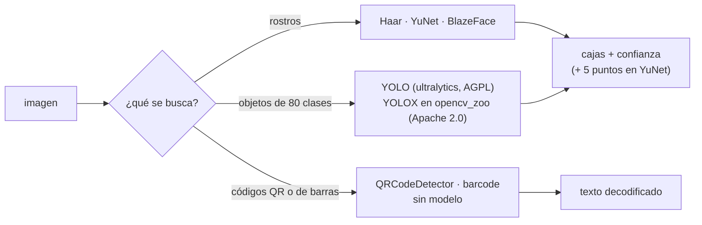

# 🎯 cv02 — Detección

> Python para desarrolladores Java senior · **Carta** · Track `cv` — Visión por computador ·
> sección 2 de 8
> Se lee suelta: no hace falta ninguna otra sección de la carta. Conviene haber leído
> [`cv01`](op164-cv01-el-modelo.md) (los tres niveles).
> Versiones verificadas contra PyPI el 07/10/2026 · Código probado el 07/10/2026 con Python 3.14.7,
> en contenedor: las salidas son las de esa corrida.

---

## 🎯 1. Qué problema resuelve

Detectar es contestar *dónde está* algo en una imagen: una caja por rostro, por objeto, por código. Es el primer paso de casi todo el track —los puntos faciales
de cv03 se calculan dentro de la caja del rostro, el reconocimiento de cv05 compara rostros ya recortados, el vídeo de cv07 detecta cuadro a cuadro— y por eso
conviene saber de antemano **qué detector encuentra qué**: qué tan chico, qué tan girado, qué tan rápido, con qué licencia.

Hay muchos, y cada tutorial elige uno sin decir por qué. La sección pone tres detectores de rostros contra la misma prueba —el retrato de prueba de scikit-image
en siete tamaños y seis giros— y mide el rostro más chico y el giro mayor que cada uno encuentra: la **cascada de Haar** (2001, características), **YuNet** (2023,
una red de 227 KB en el módulo `dnn` de OpenCV) y **BlazeFace** de MediaPipe (la red de los filtros de cámara del teléfono). Al final, un caso donde ninguna red
hace falta: el código QR, que se diseñó para que lo lea una máquina.

Para objetos en general (personas, vehículos, herramientas), el estándar de facto es **YOLO** a través de `ultralytics`; la sección dice por qué no es el ejemplo
y qué hay que leer antes de usarlo.

---

## 🧠 2. El modelo



| Detector | Qué es | Licencia | Para qué está hecho |
|---|---|---|---|
| Cascada de Haar | Características de brillo + clasificador en cascada | BSD (OpenCV) | Rostros frontales, CPU vieja |
| YuNet | CNN chica, entrada de cualquier tamaño | MIT (modelo en opencv_zoo) | Rostros en escenas, varias escalas |
| BlazeFace *short range* | CNN de MediaPipe, entrada 128×128 | Apache 2.0 | Una cara a menos de 2 m de la cámara del teléfono |
| YOLO (`ultralytics`) | Detector general, 80 clases de COCO | **AGPL-3.0** o licencia comercial | Objetos; segmentación y pose en sus variantes |

### 🩻 Esto sí funciona igual

Un detector es una función `imagen → lista de (caja, confianza)`, y elegir el umbral de confianza es elegir entre falsos positivos y falsos negativos, como el
umbral de cualquier clasificador. Quien ajustó un filtro de fraude o un antispam ya sabe la parte difícil: no hay umbral correcto, hay un costo por cada tipo de error.

---

## 💻 3. El ejemplo que corre

MediaPipe 1.1.0 trae dos sorpresas en Linux sin pantalla, las dos encontradas en la prueba de esta sección. Su paquete pide `opencv-contrib-python` —la variante
con interfaz gráfica— y pisa el `cv2` *headless*; y su biblioteca nativa carga **`libEGL.so.1`** aunque corra en CPU. Lo primero se resuelve en el
`pyproject.toml`; lo segundo, con dos paquetes del sistema (en macOS no hace falta):

`pyproject.toml`:

```toml
[project]
name = "detectores"
version = "0.1.0"
requires-python = ">=3.14"
dependencies = [
    "mediapipe==1.1.0",
    "numpy==2.5.3",
    "opencv-contrib-python-headless==5.0.0.93",
    "scikit-image==0.26.0",
]

[tool.uv]
# mediapipe pide opencv-contrib-python (con interfaz gráfica y libGL); se reemplaza por la variante headless
override-dependencies = ["opencv-contrib-python; sys_platform == 'never'"]
```

```bash
sudo apt-get install -y libegl1 libgles2        # Debian/Ubuntu; en macOS, nada
uv add opencv-contrib-python-headless==5.0.0.93 mediapipe==1.1.0 scikit-image==0.26.0 numpy==2.5.3
```

`detectores.py`:

```python
"""Tres detectores de rostros contra la escala y el giro, y un detector de códigos QR que no necesita modelo."""

import pathlib
import time
import urllib.request

import cv2
import mediapipe as mp
import numpy as np
from mediapipe.tasks.python import BaseOptions, vision
from skimage import data

MODELS = pathlib.Path("modelos")
URLS = {
    "yunet": "https://github.com/opencv/opencv_zoo/raw/main/models/face_detection_yunet/face_detection_yunet_2023mar.onnx",
    "haar": "https://raw.githubusercontent.com/opencv/opencv_contrib/5.x/modules/xobjdetect/data/haarcascades/"
            "haarcascade_frontalface_default.xml",
    "blaze": "https://storage.googleapis.com/mediapipe-models/face_detector/blaze_face_short_range/float16/1/"
             "blaze_face_short_range.tflite",
}


def fetch(key):
    MODELS.mkdir(exist_ok=True)
    path = MODELS / URLS[key].rsplit("/", 1)[1]
    if not path.exists():
        urllib.request.urlretrieve(URLS[key], path)
    return str(path)


haar = cv2.CascadeClassifier(fetch("haar"))
yunet = cv2.FaceDetectorYN.create(fetch("yunet"), "", (640, 640), score_threshold=0.7)
blaze = vision.FaceDetector.create_from_options(
    vision.FaceDetectorOptions(base_options=BaseOptions(model_asset_path=fetch("blaze")), min_detection_confidence=0.5))

DETECTORS = {
    "Haar": lambda img: len(haar.detectMultiScale(cv2.cvtColor(img, cv2.COLOR_BGR2GRAY), 1.1, 5)),
    "YuNet": lambda img: 0 if (f := yunet.detect(img)[1]) is None else len(f),
    "BlazeFace (MediaPipe)": lambda img: len(blaze.detect(
        mp.Image(image_format=mp.ImageFormat.SRGB, data=cv2.cvtColor(img, cv2.COLOR_BGR2RGB))).detections),
}

face = cv2.cvtColor(data.astronaut(), cv2.COLOR_RGB2BGR)


def canvas(size, angle=0):
    """La foto de prueba de lado `size`, girada `angle` grados, en el centro de un lienzo gris de 640×640."""
    img = cv2.resize(face, (size, size))
    if angle:
        m = cv2.getRotationMatrix2D((size / 2, size / 2), angle, 1.0)
        img = cv2.warpAffine(img, m, (size, size), borderValue=(90, 90, 90))
    out = np.full((640, 640, 3), 90, np.uint8)
    o = (640 - size) // 2
    out[o:o + size, o:o + size] = img
    return out


SIZES, ANGLES = (512, 320, 160, 96, 64, 48, 32), (0, 15, 30, 45, 60, 90)
print(f"{'detector':<22} {'lado más chico':>15} {'giro mayor':>12} {'ms por imagen':>14}")
for name, detect in DETECTORS.items():
    sizes = [s for s in SIZES if detect(canvas(s)) == 1]
    angles = [a for a in ANGLES if detect(canvas(320, a)) == 1]
    img = canvas(160)
    start = time.perf_counter()
    for _ in range(20):
        detect(img)
    ms = (time.perf_counter() - start) / 20 * 1000
    print(f"{name:<22} {min(sizes, default=0):>12} px {max(angles, default=0):>10}° {ms:>12.1f}")
    print(f"{'':<22} un rostro, exacto, en: {sizes} px · {angles}°")

# Códigos: el nivel de píxeles alcanza cuando el objeto se diseñó para ser leído por una máquina
qr = cv2.QRCodeEncoder.create().encode("AUREA-CHAPINERO-0042")
qr = cv2.resize(qr, None, fx=6, fy=6, interpolation=cv2.INTER_NEAREST)
reader = cv2.QRCodeDetector()
print("\nQR con 'AUREA-CHAPINERO-0042':")
for label, img in (
    ("derecho", qr),
    ("girado 37°", cv2.warpAffine(qr, cv2.getRotationMatrix2D((qr.shape[1] / 2, qr.shape[0] / 2), 37, 0.7), qr.shape[::-1],
                                  borderValue=255)),
    ("desenfocado 5×5", cv2.GaussianBlur(qr, (5, 5), 0)),
    ("desenfocado 9×9", cv2.GaussianBlur(qr, (9, 9), 0)),
):
    text, _, _ = reader.detectAndDecode(cv2.copyMakeBorder(img, 40, 40, 40, 40, cv2.BORDER_CONSTANT, value=255))
    print(f"  {label:<18} → {text or '(no leído)'}")
```

```bash
uv run detectores.py
```

Salida (Python 3.14.7, 07/10/2026) (MediaPipe escribe además una docena de líneas `INFO:` de LiteRT por la salida de error, y OpenCV el aviso del motor nuevo de `dnn`):

```text
detector                lado más chico   giro mayor  ms por imagen
Haar                            160 px         60°         15.5
                       un rostro, exacto, en: [512, 320, 160] px · [0, 15, 60]°
YuNet                            64 px         90°         29.1
                       un rostro, exacto, en: [512, 320, 160, 96, 64] px · [0, 15, 30, 45, 60, 90]°
BlazeFace (MediaPipe)           512 px         90°         10.3
                       un rostro, exacto, en: [512] px · [30, 45, 60, 90]°

QR con 'AUREA-CHAPINERO-0042':
  derecho            → AUREA-CHAPINERO-0042
  girado 37°         → AUREA-CHAPINERO-0042
  desenfocado 5×5    → AUREA-CHAPINERO-0042
  desenfocado 9×9    → (no leído)
```

Lo que dicen los números:

- **YuNet encuentra el rostro de 64 píxeles y todos los giros hasta 90°**, con un rostro exacto en cada caso. Es el detector de referencia del track.
- **Haar se queda en 160 píxeles** y en los giros es errático: encuentra 0°, 15° y 60°, pero no 30° ni 45° (a 60° acierta de casualidad). Es lo esperable de un
  clasificador entrenado con rostros frontales y derechos.
- **BlazeFace *short range* solo encuentra el rostro de 512 píxeles**, es decir, cuando la cara llena casi todo el lienzo; y a ese tamaño acierta los giros de 30° a
  90° pero no el derecho de 320. No es un mal detector: es un detector **de selfie**, que reduce todo a 128×128 y espera una cara cerca de la cámara. Usado para
  buscar caras en una escena, falla casi siempre. El modelo se elige por su contrato, no por su fama.
- **El tiempo**: BlazeFace 10 ms, Haar 16 ms, YuNet 29 ms por imagen de 640×640 en CPU. YuNet es el más lento y el único que encontró todo.
- **El QR se lee derecho, girado 37° y con un desenfoque de 5×5**, y deja de leerse con 9×9. Sin modelo, sin GPU, sin licencia que mirar.

**Detalles con intención**

- **`override-dependencies`** en `[tool.uv]` reemplaza la dependencia `opencv-contrib-python` de MediaPipe por nada (`sys_platform == 'never'` nunca se cumple),
  y el proyecto pone la variante *headless*. Con `pip` el equivalente es desinstalar la que llega y reinstalar la *headless* con `--force-reinstall --no-deps`.
- **"Un rostro, exacto"**: el criterio cuenta como acierto solo una detección; dos cajas sobre la misma cara cuentan como fallo, porque el paso siguiente (cv03) no
  sabe cuál usar.
- **`blaze.detect(mp.Image(...))`** recibe RGB; OpenCV trabaja en BGR. Olvidar `cvtColor` no da error con rostros (la red tolera algo), pero sí resultados peores.

---

## ⚠️ 4. Lo que se rompe

**La licencia de YOLO.** `ultralytics` es **AGPL-3.0**: si el detector corre dentro de un servicio que otros usan por red, la AGPL obliga a publicar el código del
servicio, o hay que comprar su licencia comercial. Además arrastra PyTorch (cientos de megabytes). Para objetos con licencia permisiva, YOLOX (Apache 2.0) corre en
el módulo `dnn` de OpenCV desde el mismo opencv_zoo; el ejercicio 7 lo pide.

**El modelo fuera de su contrato.** BlazeFace *short range* para cámaras de seguridad, Haar para rostros de perfil, YOLO entrenado en COCO para radiografías: el
detector devuelve algo, con una confianza, y el código de abajo lo cree. El contrato del modelo (tamaño de entrada, distancia, clases, datos de entrenamiento) va
documentado junto a su URL.

**El NMS que no se hizo.** Los detectores producen muchas cajas solapadas sobre el mismo objeto y las filtran con *non-maximum suppression*. YuNet y MediaPipe lo
hacen adentro; al correr un ONNX propio con `cv2.dnn`, lo haces tú (`cv2.dnn.NMSBoxes`). Sin él, cada rostro sale cinco veces.

**El dependiente gráfico en el servidor.** `libGL.so.1` (OpenCV no *headless*) y `libEGL.so.1` (MediaPipe) faltan en las imágenes de contenedor delgadas. El síntoma
es un `ImportError` en producción que en el portátil no pasa.

---

## ⚖️ 5. Cuándo NO usarla

**Cuando el objeto se puede marcar.** Un código QR, ArUco o de barras en la pieza, el formulario o la bandeja se lee sin modelo y con error casi cero. Si controlas
el objeto, márcalo; detectar es para lo que no controlas.

**Cuando la pregunta no es "dónde" sino "cuántos".** Contar personas que entran a una sede se resuelve con un sensor en la puerta, sin imagen de nadie. La cámara
con detector convierte una cuenta en un sistema de vigilancia, con todo lo que eso implica (cv08).

**Cuando el entorno es fijo.** Una pieza en una banda transportadora con luz controlada se encuentra con umbral y contornos (nivel de píxeles, cv01), sin entrenamiento.

---

## 🧪 6. Ejercicios (10)

**🟢 Fácil (1–3)**

1. Corre el ejemplo. **Criterio:** la tabla de tres detectores, y en una frase por qué BlazeFace *short range* falla a 320 píxeles.
2. Agrega los tamaños 24 y 16 px al barrido. **Criterio:** ningún detector encuentra el de 16, o el que lo encuentra está nombrado.
3. Lee un código de barras EAN-13 generado (con `python-barcode` o dibujado) con `cv2.barcode.BarcodeDetector`. **Criterio:** el texto decodificado coincide.

**🟡 Intermedio (4–6)**

4. Cambia BlazeFace al modelo *full range* (`blaze_face_full_range`, si tu versión de MediaPipe lo trae) o a otro de su lista. **Criterio:** el tamaño más chico
   que encuentra contra el *short range*.
5. Mide la curva de umbral de YuNet: de 0,3 a 0,9, aciertos y sobrantes sobre la escena de cv01. **Criterio:** la tabla y el umbral que elegirías.
6. Busca el desenfoque máximo que lee el QR con corrección de errores alta (`QRCodeEncoder.Params` con `correction_level`). **Criterio:** el núcleo máximo con cada
   nivel de corrección.

**🟠 Difícil (7–9)**

7. Corre YOLOX de opencv_zoo con `cv2.dnn` sobre la foto de prueba: preprocesamiento, salida y `NMSBoxes`. **Criterio:** detecta la persona con confianza mayor a
   0,5 y las cajas sin NMS se reportan aparte.
8. Corre el mismo barrido con YOLO de `ultralytics` en un entorno aparte. **Criterio:** el peso del entorno instalado, el tiempo por imagen, y un párrafo sobre qué
   implicaría la AGPL en un servicio de tu empresa.
9. Empaqueta el detector de MediaPipe en una imagen `python:3.14-slim` que arranque. **Criterio:** la lista mínima de paquetes del sistema, y el tamaño de la imagen.

**🔴 Muy difícil (10)**

10. Elige el detector para un caso propio (no clínico) y defiéndelo. **Criterio:** una página. *Rúbrica:* (a) el contrato que el caso necesita (tamaño, giro,
    luz, velocidad); (b) la tabla medida de al menos tres candidatos; (c) la licencia de cada modelo y su consecuencia; (d) las dependencias de sistema en el
    despliegue.

---

## 📚 7. Referencias

**Documentación oficial**

- MediaPipe, detección de rostros en Python: https://ai.google.dev/edge/mediapipe/solutions/vision/face_detector/python
- MediaPipe, el detector de rostros y sus modelos (con el enlace a la tarjeta de cada uno, que es su contrato): https://ai.google.dev/edge/mediapipe/solutions/vision/face_detector/index
- OpenCV, la declaración de `FaceDetectorYN` y `FaceRecognizerSF` (la documentación web de OpenCV rechaza clientes automáticos): https://github.com/opencv/opencv/blob/5.x/modules/objdetect/include/opencv2/objdetect/face.hpp
- opencv_zoo (YuNet, YOLOX y otros modelos con su licencia): https://github.com/opencv/opencv_zoo
- uv, `override-dependencies`: https://docs.astral.sh/uv/reference/settings/#override-dependencies
- La licencia de `ultralytics`: https://github.com/ultralytics/ultralytics/blob/main/LICENSE

**Orden de lectura sugerido:** la página del detector de MediaPipe y, desde ella, la tarjeta del modelo *short range* (cinco páginas que explican el resultado de esta sección); la
licencia de `ultralytics` antes de instalarlo.

---

## 🚀 8. Cierre

Cada detector tiene un contrato: Haar busca rostros frontales medianos, BlazeFace *short range* busca la cara de un selfie, YuNet busca rostros en una escena. Medido
contra la misma prueba, solo YuNet encontró todo, y fue el más lento. El QR no necesitó modelo. Y antes de instalar, la licencia del modelo y las bibliotecas del
sistema que pide el servidor.

**La señal de que quedó bien:** *"Elegí el detector con una tabla medida contra mi caso, sé cuál es su contrato y su licencia, y la imagen del servidor arranca sin
`libGL` ni sorpresas."*

> 🏷️ **Cierra la sección con su tag**, cuando los ejercicios que elegiste estén hechos:
>
> ```bash
> git tag -a op-cv-fase-02 -m "op cv02 cerrada: tres detectores medidos contra escala y giro, y el QR sin modelo"
> ```
>
> Los commits llevan su prefijo (`op cv02: …`) y los de ejercicio su número
> (`op cv02 ej07: …`).
