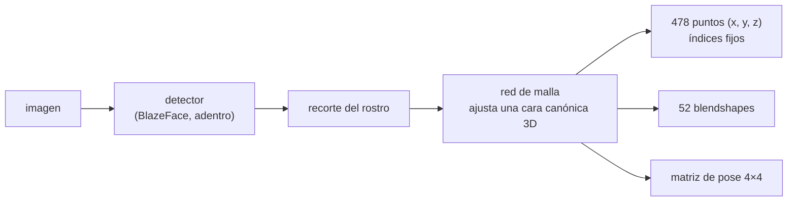

# 🫥 cv03 — Puntos de referencia faciales

> Python para desarrolladores Java senior · **Carta** · Track `cv` — Visión por computador ·
> sección 3 de 8
> Se lee suelta: no hace falta ninguna otra sección de la carta. Conviene haber leído
> [`cv02`](op165-cv02-deteccion.md) (detección y la instalación de MediaPipe).
> Versiones verificadas contra PyPI el 07/10/2026 · Código probado el 07/10/2026 con Python 3.14.7,
> en contenedor: las salidas son las de esa corrida.

---

## 🎯 1. Qué problema resuelve

Una caja dice dónde está el rostro; no dice dónde están los ojos, la nariz o las comisuras. Esos **puntos de referencia** (*landmarks*) son la entrada de todo lo
que viene después en el track: alinear dos fotos para compararlas, deformar una cara en otra (cv04), recortar una región, estimar la pose. En el mundo de Áurea,
son también la tentación más directa: medir la línea media de la sonrisa, la simetría de las comisuras, cuánta encía se ve. Parece odontología digital, y aquí está
la primera advertencia del track: **un punto que devuelve un modelo no es una medición**.

**MediaPipe Face Landmarker** devuelve 478 puntos: 468 de una malla facial y 10 de los iris, con coordenadas x e y normalizadas a la imagen y una z de profundidad
relativa. Además devuelve 52 coeficientes de expresión (*blendshapes*) y una matriz de pose. `dlib`, el clásico con 68 puntos, ya no tiene ruedas en PyPI para
Python 3.14 —en ninguna plataforma, comprobado en la preparación de esta sección— y compila desde el código fuente con CMake; MediaPipe es hoy el camino sin
compilar.

La sección corre la malla sobre el retrato de prueba de scikit-image y le hace cuatro preguntas: qué son esos puntos, cuánto se mueven con ruido, qué pasa en espejo,
y qué devuelve cuando la boca no se ve.

---

## 🧠 2. El modelo



- **Es una malla ajustada, no una lista de detecciones.** La red deforma un modelo de cara canónico hasta que encaja con la imagen; cada índice es siempre el mismo
  lugar de esa malla (el 1 es la punta de la nariz, el 33 la esquina externa del ojo derecho de la persona, el 152 el mentón). Por eso devuelve los 478 aunque
  media cara no se vea.
- **x e y van de 0 a 1** respecto del ancho y el alto de la imagen; **z** es profundidad relativa, en la escala de x, sin unidad física. No son milímetros.
- **"Derecho" es el de la persona**, no el de la foto: el ojo derecho (33) aparece a la izquierda de la imagen.

| Fuente de puntos | Cuántos | Qué entrega | Cuándo alcanza |
|---|---|---|---|
| YuNet (cv02) | 5: ojos, nariz, comisuras | Junto con la caja, gratis | Alinear rostros para reconocimiento (cv05) |
| dlib | 68 | Contornos de ojos, cejas, boca, mandíbula | Código existente; compila en 3.14 |
| MediaPipe Face Landmarker | 478 + blendshapes + pose | Malla densa 3D | Deformar (cv04), expresiones, pose |

---

## 💻 3. El ejemplo que corre

La instalación es la de cv02 (el `pyproject.toml` con `override-dependencies` y `libegl1`/`libgles2` en Linux):

```bash
uv add opencv-contrib-python-headless==5.0.0.93 mediapipe==1.1.0 scikit-image==0.26.0 numpy==2.5.3
```

`puntos.py`:

```python
"""Qué son de verdad los 478 puntos de MediaPipe: una malla ajustada, no mediciones; con su estabilidad, su espejo y lo que inventa."""

import pathlib
import urllib.request

import cv2
import mediapipe as mp
import numpy as np
from mediapipe.tasks.python import BaseOptions, vision
from skimage import data

MODELS = pathlib.Path("modelos")
LANDMARKER = "https://storage.googleapis.com/mediapipe-models/face_landmarker/face_landmarker/float16/1/face_landmarker.task"
YUNET = "https://github.com/opencv/opencv_zoo/raw/main/models/face_detection_yunet/face_detection_yunet_2023mar.onnx"


def fetch(url):
    MODELS.mkdir(exist_ok=True)
    path = MODELS / url.rsplit("/", 1)[1]
    if not path.exists():
        urllib.request.urlretrieve(url, path)
    return str(path)


landmarker = vision.FaceLandmarker.create_from_options(vision.FaceLandmarkerOptions(
    base_options=BaseOptions(model_asset_path=fetch(LANDMARKER)),
    output_face_blendshapes=True, output_facial_transformation_matrixes=True, num_faces=1))

# Índices de la malla canónica de MediaPipe (fijos: el punto 1 es siempre la punta de la nariz)
EYE_OUT_R, EYE_OUT_L, NOSE, MOUTH_R, MOUTH_L, CHIN = 33, 263, 1, 61, 291, 152
IRIS_R, IRIS_L = 468, 473                             # centros de iris: los diez últimos puntos son de los ojos


def mesh(bgr):
    """Los puntos en píxeles (x, y) y la profundidad relativa z; None si no hay rostro."""
    result = landmarker.detect(mp.Image(image_format=mp.ImageFormat.SRGB, data=cv2.cvtColor(bgr, cv2.COLOR_BGR2RGB)))
    if not result.face_landmarks:
        return None, result
    h, w = bgr.shape[:2]
    pts = np.array([(p.x * w, p.y * h, p.z * w) for p in result.face_landmarks[0]])
    return pts, result


face = cv2.cvtColor(data.astronaut(), cv2.COLOR_RGB2BGR)
pts, result = mesh(face)
print(f"puntos: {len(pts)} · coeficientes de expresión: {len(result.face_blendshapes[0])} · "
      f"matriz de pose: {np.array(result.facial_transformation_matrixes[0]).shape}")
iod = np.linalg.norm(pts[IRIS_R, :2] - pts[IRIS_L, :2])
print(f"distancia entre iris: {iod:.1f} px · nariz en ({pts[NOSE, 0]:.0f}, {pts[NOSE, 1]:.0f}) · "
      f"z de la nariz {pts[NOSE, 2]:.1f} (relativa, no milímetros)")
top = sorted(result.face_blendshapes[0], key=lambda c: c.score, reverse=True)[:3]
print("expresión más marcada:", ", ".join(f"{c.category_name} {c.score:.2f}" for c in top))

# Los cinco puntos de YuNet contra los ojos de la malla
yunet = cv2.FaceDetectorYN.create(fetch(YUNET), "", (512, 512))
f = yunet.detect(face)[1][0]
yunet_eyes = np.array([[f[4], f[5]], [f[6], f[7]]])
print(f"YuNet contra la malla: ojo derecho a {np.linalg.norm(yunet_eyes[0] - pts[IRIS_R, :2]):.1f} px, "
      f"izquierdo a {np.linalg.norm(yunet_eyes[1] - pts[IRIS_L, :2]):.1f} px")

# Estabilidad: la misma foto con ruido leve, diez veces; cuánto se mueve cada punto
rng = np.random.default_rng(0)
runs = [mesh(np.clip(face + rng.normal(0, 4, face.shape), 0, 255).astype(np.uint8))[0] for _ in range(10)]
jitter = np.linalg.norm(np.stack(runs)[:, :, :2] - pts[:, :2], axis=2)
print(f"\ncon ruido leve: desplazamiento mediano {np.median(jitter):.2f} px · máximo {jitter.max():.2f} px "
      f"({jitter.max() / iod:.1%} de la distancia entre iris)")

# Espejo: el punto 33 es el ojo derecho de la persona; en la foto espejada, el 33 cae donde estaba el 263
flipped, _ = mesh(cv2.flip(face, 1))
mirror_x = 512 - flipped[:, 0]
print(f"espejo: el 33 espejado queda a {abs(mirror_x[EYE_OUT_R] - pts[EYE_OUT_L, 0]):.1f} px del 263 original")

# Oclusión: se tapa la boca con un rectángulo gris; el modelo igual devuelve la boca
covered = face.copy()
y0, y1 = int(pts[NOSE, 1] + 0.25 * iod), int(pts[CHIN, 1] - 0.15 * iod)
x0, x1 = int(pts[MOUTH_R, 0] - 0.3 * iod), int(pts[MOUTH_L, 0] + 0.3 * iod)
covered[y0:y1, x0:x1] = 128
occluded, _ = mesh(covered)
moved = np.linalg.norm(occluded[[MOUTH_R, MOUTH_L], :2] - pts[[MOUTH_R, MOUTH_L], :2], axis=1)
print(f"boca tapada: {len(occluded)} puntos igual · comisuras inventadas a {moved[0]:.1f} y {moved[1]:.1f} px de las reales")

for i in range(len(pts)):
    cv2.circle(face, (int(pts[i, 0]), int(pts[i, 1])), 1, (0, 255, 0), -1)
cv2.imwrite("malla.jpg", face)
```

```bash
uv run puntos.py
```

Salida (Python 3.14.7, 07/10/2026):

```text
puntos: 478 · coeficientes de expresión: 52 · matriz de pose: (4, 4)
distancia entre iris: 42.6 px · nariz en (224, 131) · z de la nariz -22.9 (relativa, no milímetros)
expresión más marcada: mouthSmileRight 0.90, mouthSmileLeft 0.90, mouthUpperUpRight 0.47
YuNet contra la malla: ojo derecho a 3.4 px, izquierdo a 1.4 px

con ruido leve: desplazamiento mediano 0.20 px · máximo 0.71 px (1.7% de la distancia entre iris)
espejo: el 33 espejado queda a 0.1 px del 263 original
boca tapada: 478 puntos igual · comisuras inventadas a 2.0 y 2.2 px de las reales
```

Lo que dicen los números:

- **478 puntos, 52 coeficientes y una matriz 4×4**: la red devuelve una cara entera, no una lista de lo que vio.
- **La z de la nariz es −22,9** en una imagen de 512 de ancho: está más cerca de la cámara que el centro de la cabeza, en la escala de x. Ningún número de la salida
  está en milímetros; convertirlos exigiría una referencia de tamaño conocido en la foto, y ni así serían una medición clínica.
- **La expresión más marcada es la sonrisa** (0,90 a cada lado). Los *blendshapes* son los mismos que mueven un avatar: sirven para animar, no para diagnosticar.
- **YuNet y la malla coinciden en los ojos a 1,4–3,4 píxeles**, sobre 42,6 entre iris: dos redes distintas concuerdan en lo grueso.
- **Con ruido leve, los puntos se mueven 0,2 px de mediana y 0,7 px como máximo** (1,7 % de la distancia entre iris). Estable para alinear; una "asimetría" de ese
  orden en una medición sería ruido del modelo, no de la cara.
- **En espejo, el 33 cae a 0,1 px de donde estaba el 263**: los índices siguen a la persona, no a la imagen.
- **Con la boca tapada, devuelve las comisuras igual, a 2 px de las reales.** La red las **infiere** del resto de la cara, y bien; pero la salida es idéntica en forma
  a la de una boca visible. Nada en el resultado dice qué puntos vio y cuáles imaginó.

**Detalles con intención**

- **`num_faces=1`**: con más rostros, `face_landmarks` es una lista por rostro, en el orden que el modelo decida.
- **Los índices son constantes del modelo**: el mapa completo está en el repositorio de MediaPipe (`face_mesh_connections` y la malla canónica); el código usa nombres
  (`EYE_OUT_R`, `NOSE`) en vez de números sueltos.
- **`fetch` del `.task`**: el archivo trae los tres modelos (detector, malla y *blendshapes*) en uno, 3,6 MB.

---

## ⚠️ 4. Lo que se rompe

**Tratar los puntos como medición.** La malla está entrenada para verse bien en un filtro de cámara: plausible, estable, rápida. No está validada para medir una
línea media dental ni la simetría de una sonrisa, y la oclusión del ejemplo muestra por qué: los puntos que no se ven se rellenan con lo probable. Para cualquier
uso clínico, el instrumento validado es el del odontólogo, y el modelo, como mucho, sugiere dónde mirar.

**Confundir derecha e izquierda.** Los índices siguen a la persona; las coordenadas, a la imagen. Una foto espejada (las cámaras frontales de muchos teléfonos guardan
así) pone el ojo derecho a la derecha de la imagen y el mismo índice sigue siendo el ojo derecho. Si el código razona con "el punto de más a la izquierda", se rompe
con el espejo.

**Puntos normalizados contra píxeles.** `p.x` está entre 0 y 1. Multiplicar por el ancho de **otra** imagen (la miniatura, el recorte) pone los puntos en otro
lugar sin error. La conversión se hace una vez, con el tamaño de la imagen que entró al modelo.

**Perfil y rostros chicos.** Por debajo de unos 100 píxeles de cara o con giros grandes de la cabeza, el detector interno no encuentra el rostro y la lista vuelve
vacía; el código tiene que tratar `face_landmarks == []`.

---

## ⚖️ 5. Cuándo NO usarla

**Cuando cinco puntos alcanzan.** Para alinear un rostro antes de compararlo (cv05), los cinco puntos de YuNet ya vienen con la detección; cargar la malla es otro
modelo, otra dependencia y `libEGL` en el servidor.

**Para medir.** Cualquier decisión que dependa de milímetros o de grados (clínica, ergonomía, ajuste de un producto) necesita un instrumento calibrado, no una malla
de filtro. La sección lo mide: el modelo inventa con precisión de 2 px lo que no ve.

**Cuando la imagen es un dato sensible y el resultado es cosmético.** Calcular 478 puntos sobre una foto clínica es tratamiento de un dato biométrico (cv08). Si el
beneficio es un recorte más bonito, no compensa.

---

## 🧪 6. Ejercicios (10)

**🟢 Fácil (1–3)**

1. Corre el ejemplo y abre `malla.jpg`. **Criterio:** la salida completa, y señalas en la imagen los puntos 1, 33, 263 y 152.
2. Imprime los diez *blendshapes* más altos de una foto tuya sonriendo y otra seria. **Criterio:** `mouthSmileLeft` sube en la primera y baja en la segunda.
3. Dibuja solo los contornos de ojos y labios con las conexiones que trae MediaPipe. **Criterio:** una imagen con los contornos y sin el resto de la malla.

**🟡 Intermedio (4–6)**

4. Extrae de la matriz de pose los ángulos de giro (*yaw*, *pitch*, *roll*). **Criterio:** con la foto girada 15° en el plano, el *roll* cambia unos 15°.
5. Repite la prueba de estabilidad con ruido de 2, 8 y 16 niveles. **Criterio:** la tabla de desplazamiento mediano y máximo, y desde qué ruido pasa de 1 px.
6. Barre el tamaño del rostro de 512 a 64 px. **Criterio:** el tamaño más chico en el que todavía hay malla.

**🟠 Difícil (7–9)**

7. Tapa sucesivamente un ojo, la nariz y la boca. **Criterio:** cuánto se alejan los puntos tapados de los reales en cada caso, y si algún dato de la salida permite
   distinguirlos de los visibles.
8. Calcula un "índice de simetría" de la sonrisa con las comisuras sobre veinte fotos tuyas iguales. **Criterio:** la dispersión del índice entre fotos, y una frase
   sobre si serviría para medir algo.
9. Compila `dlib` 20.0.1 desde el código fuente en Python 3.14 y compara sus 68 puntos con los equivalentes de la malla. **Criterio:** el tiempo de compilación y la
   distancia mediana entre los puntos que se corresponden.

**🔴 Muy difícil (10)**

10. Alguien propone "medir la línea media de la sonrisa con la malla" en las fotos de diagnóstico. **Criterio:** una página de respuesta técnica. *Rúbrica:* (a) qué
    mide la malla y qué no (con los números de esta sección); (b) qué validación haría falta para un uso clínico; (c) el problema legal de procesar la foto (cv08);
    (d) la alternativa que sí resuelve la necesidad.

---

## 📚 7. Referencias

**Documentación oficial**

- MediaPipe Face Landmarker para Python: https://ai.google.dev/edge/mediapipe/solutions/vision/face_landmarker/python
- MediaPipe Face Landmarker, la guía con modelos y salidas: https://ai.google.dev/edge/mediapipe/solutions/vision/face_landmarker
- La malla canónica y sus índices, en el repositorio de MediaPipe: https://github.com/google-ai-edge/mediapipe/tree/master/mediapipe/modules/face_geometry/data
- `dlib` en PyPI (solo código fuente para 3.14): https://pypi.org/project/dlib/

**Artículo**

- Kartynnik y otros, *Real-time Facial Surface Geometry from Monocular Video on Mobile GPUs* (2019), la malla de MediaPipe: https://arxiv.org/abs/1907.06724

**Orden de lectura sugerido:** la guía de Face Landmarker (salidas y modelos); el artículo, que explica por qué la malla rellena lo que no ve; la malla canónica cuando
haya que elegir índices.

---

## 🚀 8. Cierre

MediaPipe devuelve 478 puntos estables, coherentes en espejo y concordantes con otro modelo a pocos píxeles, y los devuelve también cuando no los ve: con la boca
tapada, las comisuras salen a 2 px de las reales y sin marca de inventadas. Son una malla de filtro de cámara: sirven para alinear, animar y deformar, y no para medir
una cara.

**La señal de que quedó bien:** *"Uso los puntos para alinear y deformar, sé cuánto se mueven por ruido, y no hay ninguna medición derivada de la malla en ningún
lugar de mi sistema."*

> 🏷️ **Cierra la sección con su tag**, cuando los ejercicios que elegiste estén hechos:
>
> ```bash
> git tag -a op-cv-fase-03 -m "op cv03 cerrada: la malla de 478 puntos, su estabilidad y lo que inventa"
> ```
>
> Los commits llevan su prefijo (`op cv03: …`) y los de ejercicio su número
> (`op cv03 ej07: …`).
