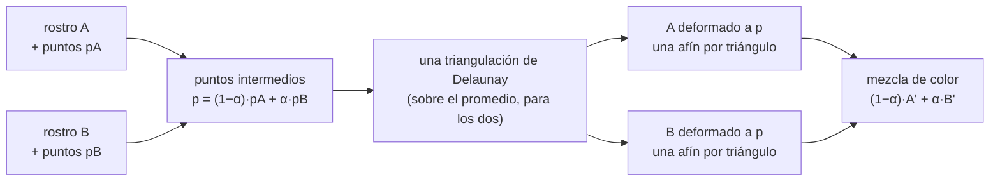

# 🔀 cv04 — Morphing desde cero

> Python para desarrolladores Java senior · **Carta** · Track `cv` — Visión por computador ·
> sección 4 de 8
> Se lee suelta: no hace falta ninguna otra sección de la carta. Conviene haber leído
> [`cv03`](op166-cv03-puntos-faciales.md) (de dónde salen los puntos en una foto real).
> Versiones verificadas contra PyPI el 07/10/2026 · Código probado el 07/10/2026 con Python 3.14.7,
> en contenedor: las salidas son las de esa corrida.

---

## 🎯 1. Qué problema resuelve

Pasar de una cara a otra de forma continua —el *morphing* de los videoclips de los noventa, el "antes y después" animado, la simulación que transforma una sonrisa
en otra— se puede hacer en veinte líneas llamando a una biblioteca, y así no se aprende nada. O se puede **construir**: poner puntos en las dos caras, triangular,
deformar cada triángulo con una transformación afín, interpolar. Esta sección hace lo segundo, porque es la que enseña qué es una **transformación afín por
piezas**, la operación que está debajo de la alineación de rostros, la corrección de perspectiva de un documento y la textura de un modelo 3D.

Los dos rostros del ejemplo están **dibujados con código**: un óvalo, dos ojos, una nariz y una boca, con sus puntos de referencia conocidos exactamente porque los
pone el programa. Así el ejemplo corre sin ninguna foto de nadie, y el algoritmo se ve sin el ruido de un detector. Al final, la sección dice qué cambia con
caras reales: los puntos salen de la malla de cv03, y todo lo demás es igual.

---

## 🧠 2. El modelo



- **Fundido cruzado (*cross-dissolve*)** es mezclar los colores sin mover nada: `(1−α)·A + α·B`. Como los ojos de A y los de B están en lugares distintos, en α = 0,5
  hay cuatro ojos a media tinta. Es el "fantasma" que delata un morphing malo.
- **Morphing** es mover primero y mezclar después: se interpola la **geometría** (los puntos), se deforma cada imagen hasta esa geometría intermedia, y recién
  entonces se mezcla el color. Los ojos de A y los de B llegan al mismo lugar antes de mezclarse.
- **Una afín por triángulo**: tres pares de puntos definen exactamente una transformación afín (rotación, escala, cizalla y traslación). Con la imagen partida en
  triángulos, cada uno se deforma con la suya, y los bordes coinciden porque los triángulos vecinos comparten vértices.
- **Delaunay** elige los triángulos que evitan los muy delgados (maximiza el menor ángulo). Se triangula **una vez**, sobre el promedio, y la misma lista de índices
  se usa en las dos caras: el triángulo 17 de A tiene que ser el triángulo 17 de B.

---

## 💻 3. El ejemplo que corre

```bash
uv add opencv-python-headless==5.0.0.93 scipy==1.18.1 numpy==2.5.3
```

`morph.py`:

```python
"""Morphing desde cero: puntos, triangulación de Delaunay, una transformación afín por triángulo e interpolación."""

import time

import cv2
import numpy as np
from scipy.spatial import Delaunay

SIZE = 400


def draw_face(width, height, eye_y, eye_r, smile, skin):
    """Un rostro dibujado y sus puntos de referencia, que se conocen exactos porque los pone el código."""
    img = np.full((SIZE, SIZE, 3), 235, np.uint8)
    c = (SIZE // 2, SIZE // 2)
    cv2.ellipse(img, c, (width, height), 0, 0, 360, skin, -1)
    pts = [(c[0] + width * np.cos(t), c[1] + height * np.sin(t)) for t in np.linspace(0, 2 * np.pi, 12, endpoint=False)]
    for side in (-1, 1):                              # ojos: blanco, pupila negra, cuatro puntos y el centro
        ex, ey = c[0] + side * width * 0.42, c[1] - eye_y
        cv2.ellipse(img, (int(ex), int(ey)), (eye_r * 2, eye_r), 0, 0, 360, (255, 255, 255), -1)
        cv2.circle(img, (int(ex), int(ey)), eye_r - 2, (20, 20, 20), -1)
        pts += [(ex - eye_r * 2, ey), (ex + eye_r * 2, ey), (ex, ey - eye_r), (ex, ey + eye_r), (ex, ey)]
    nose = [(c[0], c[1] - 10), (c[0] - 12, c[1] + 25), (c[0] + 12, c[1] + 25)]
    cv2.fillPoly(img, [np.int32(nose)], (int(skin[0] * 0.8), int(skin[1] * 0.8), int(skin[2] * 0.8)))
    pts += nose
    mouth_y = c[1] + height * 0.5
    mouth = [(c[0] - 45, mouth_y), (c[0] - 20, mouth_y + smile), (c[0], mouth_y + smile * 1.2),
             (c[0] + 20, mouth_y + smile), (c[0] + 45, mouth_y)]
    cv2.polylines(img, [np.int32(mouth)], False, (40, 40, 160), 5)
    pts += mouth
    edge = SIZE - 1                                   # bordes y esquinas: la triangulación cubre toda la imagen
    pts += [(0, 0), (edge / 2, 0), (edge, 0), (edge, edge / 2), (edge, edge), (edge / 2, edge), (0, edge), (0, edge / 2)]
    return img, np.float32(pts)


img_a, pts_a = draw_face(120, 140, eye_y=30, eye_r=10, smile=0, skin=(150, 190, 230))
img_b, pts_b = draw_face(105, 165, eye_y=55, eye_r=14, smile=25, skin=(110, 150, 200))
triangles = Delaunay((pts_a + pts_b) / 2).simplices   # una sola triangulación, sobre el promedio, para los dos
print(f"puntos: {len(pts_a)} · triángulos: {len(triangles)}")


def warp_triangle(src, dst, tri_src, tri_dst):
    """Deforma un triángulo de src sobre el lugar de tri_dst en dst, con una afín calculada en su caja."""
    xs, ys, ws, hs = cv2.boundingRect(tri_src)
    xd, yd, wd, hd = cv2.boundingRect(tri_dst)
    local_src = np.float32(tri_src - (xs, ys))
    local_dst = np.float32(tri_dst - (xd, yd))
    affine = cv2.getAffineTransform(local_src, local_dst)
    patch = cv2.warpAffine(src[ys:ys + hs, xs:xs + ws], affine, (wd, hd), flags=cv2.INTER_LINEAR,
                           borderMode=cv2.BORDER_REFLECT_101)
    mask = np.zeros((hd, wd, 3), np.float32)
    cv2.fillConvexPoly(mask, np.int32(local_dst), (1, 1, 1), cv2.LINE_AA)
    region = dst[yd:yd + hd, xd:xd + wd]
    region[:] = region * (1 - mask) + patch * mask


def morph(alpha):
    target = np.float32((1 - alpha) * pts_a + alpha * pts_b)   # 1. interpolar la geometría (float32: lo pide OpenCV)
    warped_a, warped_b = np.zeros((SIZE, SIZE, 3), np.float32), np.zeros((SIZE, SIZE, 3), np.float32)
    for t in triangles:                               # 2. llevar cada imagen a esa geometría, triángulo por triángulo
        warp_triangle(img_a.astype(np.float32), warped_a, pts_a[t], target[t])
        warp_triangle(img_b.astype(np.float32), warped_b, pts_b[t], target[t])
    return np.uint8(np.clip((1 - alpha) * warped_a + alpha * warped_b, 0, 255))   # 3. y recién ahí mezclar color


def dissolve(alpha):
    return np.uint8((1 - alpha) * img_a + alpha * img_b)


def pupils(img):
    """Cuántas pupilas hay: manchas oscuras y sin rojo (la boca es roja). Un rostro bien formado tiene dos."""
    b, g, r = cv2.split(img.astype(np.int16))
    dark = (cv2.cvtColor(img, cv2.COLOR_BGR2GRAY) < 120) & (r - g < 60)
    n, _, stats, _ = cv2.connectedComponentsWithStats(np.uint8(dark))
    return sum(1 for s in stats[1:] if s[4] > 30)


start = time.perf_counter()
frames = [morph(a) for a in np.linspace(0, 1, 11)]
per_frame = (time.perf_counter() - start) / 11 * 1000
print(f"11 cuadros en {per_frame:.0f} ms por cuadro")
print(f"extremos: α=0 difiere de A en {np.abs(frames[0].astype(int) - img_a).mean():.2f} · "
      f"α=1 difiere de B en {np.abs(frames[-1].astype(int) - img_b).mean():.2f} (niveles de gris, de 255)")
print(f"pupilas en A y en B: {pupils(img_a)} y {pupils(img_b)} · a α=0,5: fundido cruzado {pupils(dissolve(0.5))} · morphing {pupils(frames[5])}")

# Con triangulaciones distintas para A y B, los triángulos ya no se corresponden
wrong = Delaunay(pts_b).simplices
same = {tuple(sorted(t)) for t in triangles} & {tuple(sorted(t)) for t in Delaunay(pts_a).simplices} & {tuple(sorted(t)) for t in wrong}
print(f"triángulos que A, B y el promedio comparten si cada uno triangula por su cuenta: {len(same)} de {len(triangles)}")

strip = np.hstack([img_a, dissolve(0.5), frames[5], img_b])
cv2.imwrite("comparacion.png", strip)
cv2.imwrite("secuencia.png", np.hstack(frames[::2]))
```

```bash
uv run morph.py
```

Salida (Python 3.14.7, 07/10/2026):

```text
puntos: 38 · triángulos: 66
11 cuadros en 27 ms por cuadro
extremos: α=0 difiere de A en 0.00 · α=1 difiere de B en 0.00 (niveles de gris, de 255)
pupilas en A y en B: 2 y 2 · a α=0,5: fundido cruzado 4 · morphing 2
triángulos que A, B y el promedio comparten si cada uno triangula por su cuenta: 57 de 66
```

`comparacion.png` pone lado a lado A, el fundido cruzado a α = 0,5, el morphing a α = 0,5 y B; `secuencia.png`, seis cuadros del morphing.

Lo que dicen los números:

- **38 puntos y 66 triángulos** alcanzan para dos caras simples. Una cara real con la malla de cv03 tiene 478 puntos y unos 900 triángulos; el algoritmo no cambia.
- **27 ms por cuadro** de 400×400 en Python con un bucle por triángulo: suficiente para generar una animación; no para tiempo real a 1080p.
- **Los extremos reproducen las imágenes exactas** (diferencia 0,00 en α = 0 y α = 1): la prueba de que la deformación y la mezcla están bien armadas. Es la primera
  prueba que se escribe.
- **A y B tienen dos pupilas cada uno; a mitad de camino, el fundido cruzado tiene cuatro y el morphing dos.** Es el fantasma de arriba, contado.
- **Si cada cara se triangula por su cuenta, solo 57 de 66 triángulos coinciden.** Los otros nueve unen vértices distintos en A y en B: deformar "el triángulo i" de
  una en el de la otra rompe la imagen en esas zonas.

**Detalles con intención**

- **La afín se calcula en coordenadas locales** de la caja de cada triángulo (`boundingRect`), y se deforma solo esa caja: deformar la imagen entera por cada triángulo
  sería 66 veces más trabajo.
- **`fillConvexPoly` con `LINE_AA`** hace una máscara con borde suave; sin el suavizado, entre triángulos quedan líneas de un píxel sin pintar.
- **`BORDER_REFLECT_101`** rellena lo que la afín trae de fuera de la caja con un reflejo, en vez de negro; evita bordes oscuros en los triángulos del contorno.
- **`np.float32(...)`** en los puntos intermedios: la primera versión los dejaba en `float64` (lo que devuelve la multiplicación por `alpha`) y OpenCV 5 falló con
  `Assertion failed (depth == CV_32F || depth == CV_32S)` en `boundingRect`.
- **Ocho puntos en el borde** de la imagen: sin ellos, la triangulación cubre solo el casco convexo de la cara y el fondo no se deforma.

### 🩻 Esto sí funciona igual

Una transformación afín es `AffineTransform` de `java.awt.geom`: la misma matriz de 2×3, la misma composición. Lo que Java no trae es la deformación por piezas, y
ese bucle de veinte líneas es todo lo que falta.

### Lo que hace la biblioteca que ibas a usar

Con caras reales, los puntos salen de un detector (la malla de cv03, o `face-alignment` 1.5.0, que da 68 puntos con PyTorch), y el resto es este mismo algoritmo:
triangular, deformar, mezclar. Las bibliotecas de morphing agregan la detección y el armado del vídeo; ninguna hace otra cosa en el medio.

---

## ⚠️ 4. Lo que se rompe

**Puntos que no se corresponden.** El algoritmo supone que el punto i de A y el punto i de B son el mismo lugar de la cara. Si un detector devuelve los puntos en
otro orden, o pierde uno, el morphing cruza triángulos y la cara se dobla. Con la malla de MediaPipe los índices son fijos; con puntos marcados a mano, se valida
el orden.

**Triángulos que se invierten.** Si la geometría intermedia pone un vértice del otro lado de una arista (caras con poses muy distintas), un triángulo cambia de
orientación y la afín lo espeja. Se alinean primero las dos caras (misma escala, mismos ojos a la misma altura, con la afín de los ojos) y después se morfa.

**El fondo.** Los puntos del borde mueven el fondo junto con la cara; si los fondos son distintos, el fundido del fondo se nota. Se recorta la cara con una máscara
de la malla o se usa el mismo fondo.

**El uso.** Con caras reales, el morphing es una técnica de **edición de rostros**: lo que produce es una imagen de una persona que no existió, o la de una que sí
con otra cara. Con fotos de pacientes, eso es tratamiento de datos biométricos y, según el uso, publicidad engañosa (cv08).

---

## ⚖️ 5. Cuándo NO usarla

**Cuando la transición no tiene que verse.** Para un antes y después en un informe, dos fotos alineadas una al lado de la otra comunican mejor y no fabrican
cuadros intermedios que nunca existieron.

**Cuando la simulación tiene consecuencias.** Una sonrisa simulada que el paciente aprueba antes de firmar es un documento del tratamiento; generarla con un morphing
es mostrarle una interpolación de píxeles, no un resultado clínico posible. Esa simulación la hace el software de planificación con el modelo de su boca.

**Para tiempo real.** El bucle por triángulo en Python da 27 ms por cuadro a 400×400. En vídeo en vivo, la deformación se hace en GPU (una malla texturizada en
OpenGL o WebGL), no con `warpAffine` por triángulo.

---

## 🧪 6. Ejercicios (10)

**🟢 Fácil (1–3)**

1. Corre el ejemplo y abre las dos imágenes. **Criterio:** la salida completa, y en `comparacion.png` señalas las cuatro pupilas del fundido cruzado.
2. Agrega una prueba con `pytest` que verifique los extremos (α = 0 es A y α = 1 es B, con diferencia menor que 0,5). **Criterio:** pasa con el código del ejemplo y
   falla si se intercambian `alpha` y `1 − alpha` en la mezcla.
3. Genera los 30 cuadros de la secuencia y arma un GIF con Pillow. **Criterio:** el GIF va de A a B sin saltos.

**🟡 Intermedio (4–6)**

4. Quita los ocho puntos del borde y vuelve a correr. **Criterio:** qué parte de la imagen queda sin deformar, y por qué.
5. Usa triangulaciones distintas para A y para B y guarda el cuadro de α = 0,5. **Criterio:** señalas en la imagen dónde se rompe, y coincide con los nueve
   triángulos no compartidos.
6. Separa la interpolación de forma de la de color: forma con α y color con β. **Criterio:** un cuadro con la forma de B y el color de A.

**🟠 Difícil (7–9)**

7. Haz el morphing entre **dos fotos tuyas** (serio y sonriendo) con los puntos de la malla de MediaPipe (cv03) y su triangulación. **Criterio:** la secuencia sin
   fantasmas, y las fotos nunca salen de tu máquina.
8. Vectoriza la deformación: en vez de un bucle por triángulo, calcula para cada píxel su triángulo y sus coordenadas baricéntricas con NumPy, y usa `cv2.remap`.
   **Criterio:** el mismo resultado (diferencia media menor que 1) y el tiempo por cuadro contra el ejemplo.
9. Alinea primero las dos caras con la afín de los dos ojos y la nariz, y después morfa. **Criterio:** con dos fotos en poses distintas, ningún triángulo invertido
   (compruébalo con el signo del área de cada triángulo intermedio).

**🔴 Muy difícil (10)**

10. Implementa el morphing por campo de líneas de Beier y Neely (1992) y compáralo con el de triángulos. **Criterio:** el código y una página. *Rúbrica:* (a) las dos
    secuencias con los mismos rostros dibujados; (b) el tiempo de cada uno; (c) dónde se ve mejor cada método; (d) cuál usarías y por qué.

---

## 📚 7. Referencias

**Documentación oficial**

- SciPy, `Delaunay`: https://docs.scipy.org/doc/scipy/reference/generated/scipy.spatial.Delaunay.html
- `face-alignment` (68 puntos con PyTorch): https://github.com/1adrianb/face-alignment

**Artículos y tutoriales**

- Satya Mallick, *Face Morph Using OpenCV* (LearnOpenCV), el tutorial clásico del mismo algoritmo: https://learnopencv.com/face-morph-using-opencv-cpp-python/
- Beier y Neely, *Feature-Based Image Metamorphosis* (SIGGRAPH 1992), copia del curso de gráficos de Princeton: https://www.cs.princeton.edu/courses/archive/fall00/cs426/papers/beier92.pdf

**Libro**

- Richard Szeliski, *Computer Vision: Algorithms and Applications*, 2.ª edición, sección 3.6 (transformaciones geométricas): https://szeliski.org/Book/

**Orden de lectura sugerido:** el tutorial de LearnOpenCV después de correr el ejemplo (es el mismo algoritmo, con caras reales); Szeliski 3.6 para la teoría; Beier y
Neely si haces el ejercicio 10.

---

## 🚀 8. Cierre

Un morphing es interpolar puntos, deformar cada imagen a esa geometría con una afín por triángulo y recién entonces mezclar el color. Con dos caras dibujadas se
mide todo: los extremos exactos, dos pupilas donde el fundido cruzado deja cuatro, y nueve triángulos rotos si cada cara se triangula por su cuenta. Con caras
reales cambia la fuente de los puntos, y aparece la pregunta de qué se está fabricando y con la cara de quién.

**La señal de que quedó bien:** *"Puedo explicar con el código delante por qué el fundido cruzado deja fantasmas y el morphing no, y mi prueba de extremos falla
si alguien rompe la mezcla."*

> 🏷️ **Cierra la sección con su tag**, cuando los ejercicios que elegiste estén hechos:
>
> ```bash
> git tag -a op-cv-fase-04 -m "op cv04 cerrada: morphing por triángulos construido y medido con rostros dibujados"
> ```
>
> Los commits llevan su prefijo (`op cv04: …`) y los de ejercicio su número
> (`op cv04 ej07: …`).
