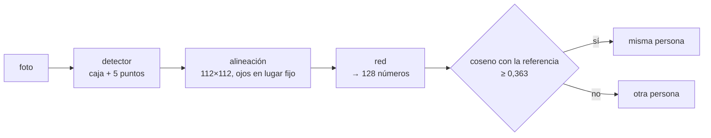

# 🪪 cv05 — Reconocimiento e identidad

> Python para desarrolladores Java senior · **Carta** · Track `cv` — Visión por computador ·
> sección 5 de 8
> Se lee suelta: no hace falta ninguna otra sección de la carta. Conviene haber leído
> [`cv02`](op165-cv02-deteccion.md) (YuNet y sus cinco puntos).
> Versiones verificadas contra PyPI el 07/10/2026 · Código probado el 07/10/2026 con Python 3.14.7,
> en contenedor: las salidas son las de esa corrida.

---

## 🎯 1. Qué problema resuelve

Detectar dice *hay un rostro*; reconocer dice *es el de esta persona*. Técnicamente es el paso más simple del track —una red convierte el rostro en un vector de
números y se compara la distancia entre vectores— y es **la sección donde el curso dice que no**: Áurea no puede desplegar reconocimiento facial sobre sus
pacientes, y esta sección explica por qué con la técnica delante, no con un párrafo de advertencia al final.

La propuesta es tentadora y aparece sola en cualquier reunión: *"que la recepción reconozca al paciente cuando llega, sin pedir la cédula"*, *"que el sistema
encuentre todas las fotos de un paciente en el archivo de las diez sedes"*. Las dos son identificación biométrica. En Colombia, los datos biométricos son **datos
sensibles** (Ley 1581 de 2012, artículo 5): su tratamiento está prohibido salvo autorización explícita del titular, que además no puede ser condición para
atenderlo. El problema no es si funciona. Funciona, y la sección mide cuánto.

El ejemplo usa **SFace**, una red de reconocimiento de 37 MB que corre en el módulo `dnn` de OpenCV (licencia Apache 2.0 en opencv_zoo), sobre el retrato de prueba
de scikit-image y nueve variantes suyas. No compara a ninguna otra persona: medir falsos positivos exige rostros de otras personas con su consentimiento, y es el
ejercicio 7.

---

## 🧠 2. El modelo



- **La incrustación (*embedding*)** es un vector de 128 `float32`: 512 bytes. La red está entrenada para que dos fotos de la misma persona den vectores cercanos y
  dos de personas distintas den vectores lejanos, aunque cambien luz, pose o expresión.
- **Verificar** es comparar contra **un** vector ("¿es quien dice ser?", 1:1). **Identificar** es comparar contra **todos** ("¿quién es?", 1:N). La identificación
  multiplica los falsos positivos por el tamaño de la base: un error de uno en diez mil por comparación, contra 2.800 pacientes, es una confusión cada cuatro
  búsquedas.
- **El umbral** (0,363 de coseno para SFace, el que publica OpenCV) reparte errores entre falsos positivos y falsos negativos. No hay umbral sin costo.

| Biblioteca | Qué trae | Licencia de los **modelos** |
|---|---|---|
| OpenCV `FaceRecognizerSF` + SFace | Detección, alineación y vector, sin PyTorch | Apache 2.0 (opencv_zoo) |
| InsightFace 2.1 | Modelos de la familia ArcFace, los más precisos | **Solo investigación no comercial**, descargados a mano o automáticamente |
| `deepface` 0.0.101 | Envoltorio sobre varios modelos (VGG-Face, Facenet, ArcFace…) | La de cada modelo que baje |
| `face_recognition` 1.3.0 | Envoltorio sobre `dlib` | Sin publicar desde febrero de 2020 (💤), y `dlib` sin ruedas para 3.14 |

La columna de la derecha es la que se lee primero: la biblioteca de InsightFace es MIT, y sus modelos preentrenados no se pueden usar en un producto sin una licencia
comercial aparte. El código y los pesos tienen licencias distintas.

---

## 💻 3. El ejemplo que corre

```bash
uv add opencv-python-headless==5.0.0.93 scikit-image==0.26.0 numpy==2.5.3
```

`identidad.py`:

```python
"""Reconocimiento con SFace: la incrustación de 128 números, cuánto aguanta, y por qué un hash no la seudonimiza."""

import hashlib
import pathlib
import urllib.request

import cv2
import numpy as np
from skimage import data

MODELS = pathlib.Path("modelos")
YUNET = "https://github.com/opencv/opencv_zoo/raw/main/models/face_detection_yunet/face_detection_yunet_2023mar.onnx"
SFACE = "https://github.com/opencv/opencv_zoo/raw/main/models/face_recognition_sface/face_recognition_sface_2021dec.onnx"
COSINE_SAME = 0.363                                   # el umbral que publica OpenCV para SFace con distancia coseno


def fetch(url):
    MODELS.mkdir(exist_ok=True)
    path = MODELS / url.rsplit("/", 1)[1]
    if not path.exists():
        urllib.request.urlretrieve(url, path)
    return str(path)


detector = cv2.FaceDetectorYN.create(fetch(YUNET), "", (0, 0), score_threshold=0.6)
recognizer = cv2.FaceRecognizerSF.create(fetch(SFACE), "")


def embed(bgr):
    """Detecta, alinea con los cinco puntos y devuelve la incrustación; None si no hay rostro."""
    detector.setInputSize((bgr.shape[1], bgr.shape[0]))
    faces = detector.detect(bgr)[1]
    if faces is None:
        return None
    aligned = recognizer.alignCrop(bgr, faces[0])     # recorte de 112×112 con los ojos en lugar fijo
    return recognizer.feature(aligned)


face = cv2.cvtColor(data.astronaut(), cv2.COLOR_RGB2BGR)
reference = embed(face)
print(f"incrustación: {reference.shape[1]} números {reference.dtype} · {reference.nbytes} bytes")

rng = np.random.default_rng(0)
h, w = face.shape[:2]
detector.setInputSize((w, h))
f = detector.detect(face)[1][0]                       # caja y cinco puntos: ojos, nariz, comisuras
(rx, ry), (lx, ly), (nx, ny), (mx1, my1), (mx2, my2) = f[4:14].reshape(5, 2).astype(int)
glasses, mask = face.copy(), face.copy()
glasses[min(ry, ly) - 18:max(ry, ly) + 18, rx - 30:lx + 30] = 15        # una franja oscura sobre los dos ojos
mask[ny + 5:int(f[1] + f[3]), int(f[0]):int(f[0] + f[2])] = 200          # un tapabocas claro, de la nariz al mentón
cv2.imwrite("oclusiones.jpg", np.hstack([glasses, mask]))
_, jpeg = cv2.imencode(".jpg", face, [cv2.IMWRITE_JPEG_QUALITY, 8])
VARIANTS = {
    "la misma foto": face,
    "más oscura (×0,4)": (face * 0.4).astype(np.uint8),
    "ruido fuerte": np.clip(face + rng.normal(0, 25, face.shape), 0, 255).astype(np.uint8),
    "JPEG calidad 8": cv2.imdecode(jpeg, cv2.IMREAD_COLOR),
    "girada 25°": cv2.warpAffine(face, cv2.getRotationMatrix2D((w / 2, h / 2), 25, 1), (w, h)),
    "en espejo": cv2.flip(face, 1),
    "rostro de 48 px": cv2.resize(cv2.resize(face, (110, 110)), (w, h)),
    "gafas oscuras": glasses,
    "tapabocas": mask,
}
print(f"\n{'variante':<20} {'coseno':>7}  ¿misma persona? (umbral {COSINE_SAME})")
for name, img in VARIANTS.items():
    vector = embed(img)
    if vector is None:
        print(f"{name:<20} {'—':>7}  no detectó rostro")
        continue
    score = recognizer.match(reference, vector, cv2.FaceRecognizerSF_FR_COSINE)
    print(f"{name:<20} {score:7.3f}  {'sí' if score >= COSINE_SAME else 'NO'}")

# Seudonimizar con un hash no sirve: dos incrustaciones de la misma persona nunca son iguales byte a byte
dark = embed(VARIANTS["más oscura (×0,4)"])
print(f"\nhash de la referencia: {hashlib.sha256(reference.tobytes()).hexdigest()[:16]}…")
print(f"hash de la oscura:     {hashlib.sha256(dark.tobytes()).hexdigest()[:16]}… (distinto)")
print(f"pero su coseno es {recognizer.match(reference, dark, cv2.FaceRecognizerSF_FR_COSINE):.3f}: el vector identifica, el hash no protege")
```

```bash
uv run identidad.py
```

Salida (Python 3.14.7, 07/10/2026):

```text
incrustación: 128 números float32 · 512 bytes

variante              coseno  ¿misma persona? (umbral 0.363)
la misma foto          1.000  sí
más oscura (×0,4)      0.950  sí
ruido fuerte           0.826  sí
JPEG calidad 8         0.820  sí
girada 25°             0.745  sí
en espejo              0.944  sí
rostro de 48 px        0.576  sí
gafas oscuras          0.429  sí
tapabocas              0.756  sí

hash de la referencia: c8a2665276b0e9a9…
hash de la oscura:     6481c9b73d469198… (distinto)
pero su coseno es 0.950: el vector identifica, el hash no protege
```

Lo que dicen los números:

- **Nueve de nueve variantes se reconocen como la misma persona**: la foto oscura (0,950), con ruido fuerte (0,826), en JPEG de calidad 8 (0,820), girada 25° (0,745),
  con el rostro reducido a 48 píxeles (0,576). La red hace lo que promete.
- **La franja negra sobre los ojos no basta: 0,429, todavía por encima del umbral.** Es la "anonimización" de los noticieros, y una red de 37 MB la atraviesa. El
  tapabocas, menos todavía (0,756).
- **La incrustación pesa 512 bytes y es un dato biométrico**: identifica a la persona igual que la foto, sin ser una foto. Guardar "solo el vector, no la imagen"
  no cambia la naturaleza del dato.
- **Un hash no la seudonimiza.** Dos vectores de la misma persona nunca son iguales byte a byte (los hashes difieren por completo), pero su coseno es 0,950. El
  hash rompe la comparación sin proteger nada, porque quien tenga los vectores los compara entre sí; y si se compara sin hash, el vector es la identidad.

**Detalles con intención**

- **`alignCrop`** usa los cinco puntos de YuNet para llevar el rostro a 112×112 con los ojos en una posición fija: sin alineación, la red compara poses, no personas.
- **`setInputSize`** antes de cada detección: YuNet necesita el tamaño de la imagen, y el detector se reutiliza con imágenes de tamaños distintos.
- **Las oclusiones se ubican con los puntos detectados**, no con coordenadas fijas: la primera versión las ponía a ojo y el "tapabocas" quedaba sobre el mentón
  (daba 0,944, un resultado falso). `oclusiones.jpg` muestra las dos.
- **SFace reporta 99,40 % de exactitud** en la evaluación de opencv_zoo (LFW, pares de verificación). Es una cifra de verificación 1:1 en un conjunto público; no dice
  nada de la tasa de error 1:N sobre una base de pacientes.

---

## ⚠️ 4. Lo que se rompe

**El consentimiento que no es libre.** Pedir "autorizo el reconocimiento facial" en el formulario de admisión, como condición para ser atendido, no es una
autorización válida para un dato sensible: la Ley 1581 exige que sea facultativa. Un sistema que no funciona sin el rostro del paciente ya violó la ley en el diseño.

**La identificación 1:N con la cifra de 1:1.** El 99,4 % de exactitud es por par. Contra una base de miles, los falsos positivos se acumulan, y cada uno es un
paciente confundido con otro: la historia clínica equivocada en la pantalla de la recepción.

**El sesgo que no se midió.** Las redes de rostros fallan distinto según edad, tono de piel y género, en proporciones que dependen del conjunto de entrenamiento.
Un sistema que reconoce peor a un grupo de pacientes los atiende peor. Medirlo exige rostros de muchas personas, con su consentimiento, y es un proyecto en sí mismo.

**La base de vectores que se filtra.** Una contraseña filtrada se cambia; una cara no. Una tabla de incrustaciones de pacientes es la base de datos más peligrosa que
la empresa podría tener, porque sirve para reconocer a esas personas en cualquier foto, de por vida.

---

## ⚖️ 5. Cuándo NO usarla

**En Áurea, para pacientes: nunca.** La identificación en recepción se resuelve con la cédula y una pregunta; buscar fotos de un paciente se resuelve con el
identificador del paciente en el nombre o los metadatos del archivo, que el sistema ya tiene. Ninguno de los dos problemas necesita biometría, y la biometría
convierte un problema de proceso en un riesgo legal permanente.

**Cuando existe un factor que no es biométrico.** Una tarjeta, un código, una contraseña de un solo uso. El reconocimiento facial gana en comodidad y pierde en todo
lo demás: no se revoca, no se cambia, y falla en silencio.

**Cuando sí tiene lugar**, es con consentimiento libre, verificación 1:1 (no búsqueda), el vector guardado en el dispositivo del titular y no en un servidor, y una
alternativa sin rostro siempre disponible. Desbloquear el propio teléfono cumple las cuatro; reconocer pacientes en una sede no cumple ninguna.

---

## 🧪 6. Ejercicios (10)

**🟢 Fácil (1–3)**

1. Corre el ejemplo y abre `oclusiones.jpg`. **Criterio:** la tabla completa, y la explicación de por qué la franja negra no anonimiza.
2. Compara dos fotos tuyas de días distintos. **Criterio:** el coseno, y si supera el umbral.
3. Cambia la métrica a distancia L2 (`FR_NORM_L2`, umbral 1,128). **Criterio:** la tabla con L2 y si alguna variante cambia de veredicto.

**🟡 Intermedio (4–6)**

4. Haz la franja de los ojos más alta en pasos de 5 píxeles hasta que el coseno caiga bajo el umbral. **Criterio:** la altura a la que deja de reconocer, en
   proporción a la distancia entre los ojos.
5. Prueba el desenfoque gaussiano como "anonimización": núcleos de 5 a 51. **Criterio:** desde qué núcleo deja de detectar o de reconocer.
6. Reduce el rostro de 48 a 16 píxeles. **Criterio:** el tamaño en el que el coseno cae bajo el umbral o el detector ya no encuentra la cara.

**🟠 Difícil (7–9)**

7. Con cinco voluntarios que consientan por escrito (y cuyas fotos no salen de tu máquina), mide la matriz de cosenos entre todos. **Criterio:** la distribución de
   pares de la misma persona contra la de personas distintas, y la tasa de falsos positivos al umbral 0,363.
8. Simula la identificación 1:N: con la distribución de impostores del ejercicio 7 (o una normal ajustada a ella), estima cuántas confusiones habría contra una base
   de 2.800. **Criterio:** el número estimado y el umbral que lo bajaría a una al año, con su costo en falsos negativos.
9. Repite la tabla con InsightFace 2.1 en un entorno aparte, **sin** usarlo para nada más que medir. **Criterio:** las dos tablas, y un párrafo sobre qué significa
   que sus modelos sean solo para investigación no comercial.

**🔴 Muy difícil (10)**

10. Responde por escrito a la propuesta de "reconocer al paciente cuando llega a recepción". **Criterio:** una página para la gerencia. *Rúbrica:* (a) qué hace la
    técnica, con los números de esta sección; (b) qué dice la Ley 1581 sobre datos sensibles y consentimiento; (c) los riesgos que la tabla de vectores crea; (d) la
    alternativa sin biometría que resuelve el problema real.

---

## 📚 7. Referencias

**Documentación y modelos**

- SFace en opencv_zoo (modelo, exactitud y licencia): https://github.com/opencv/opencv_zoo/tree/main/models/face_recognition_sface
- La declaración de `FaceRecognizerSF` en OpenCV 5: https://github.com/opencv/opencv/blob/5.x/modules/objdetect/include/opencv2/objdetect/face.hpp
- InsightFace, la licencia de sus modelos: https://github.com/deepinsight/insightface#license

**Ley y guía**

- Ley 1581 de 2012 (datos sensibles, artículos 5 y 6): https://www.funcionpublica.gov.co/eva/gestornormativo/norma.php?i=49981
- NIST, *Face Recognition Technology Evaluation (FRTE)*, las evaluaciones independientes de algoritmos, con diferencias demográficas: https://pages.nist.gov/frvt/html/frvt11.html

**Artículo**

- Zhong y otros, *SFace: Sigmoid-Constrained Hypersphere Loss for Robust Face Recognition* (2021): https://arxiv.org/abs/2205.12010

**Orden de lectura sugerido:** los artículos 5 y 6 de la Ley 1581, antes que cualquier línea de código; después la página de NIST, para ver cómo se mide de verdad un
reconocedor; el artículo de SFace si interesa la red.

---

## 🚀 8. Cierre

Reconocer es convertir un rostro en 128 números y comparar distancias, y funciona: la foto oscura, con ruido, girada, reducida a 48 píxeles, con tapabocas y con la
franja negra sobre los ojos, siguen siendo la misma persona para una red de 37 MB. Por eso el vector es un dato biométrico, un hash no lo protege, y una base de
vectores de pacientes es el riesgo más grande que la empresa podría construir. La técnica se aprende aquí; en Áurea no se despliega.

**La señal de que quedó bien:** *"Sé reconocer un rostro con veinte líneas, puedo explicar con números por qué la franja negra no anonimiza, y ningún sistema que
yo construya guarda una incrustación de un paciente."*

> 🏷️ **Cierra la sección con su tag**, cuando los ejercicios que elegiste estén hechos:
>
> ```bash
> git tag -a op-cv-fase-05 -m "op cv05 cerrada: reconocimiento con SFace medido, y por qué Áurea no lo despliega"
> ```
>
> Los commits llevan su prefijo (`op cv05: …`) y los de ejercicio su número
> (`op cv05 ej07: …`).
