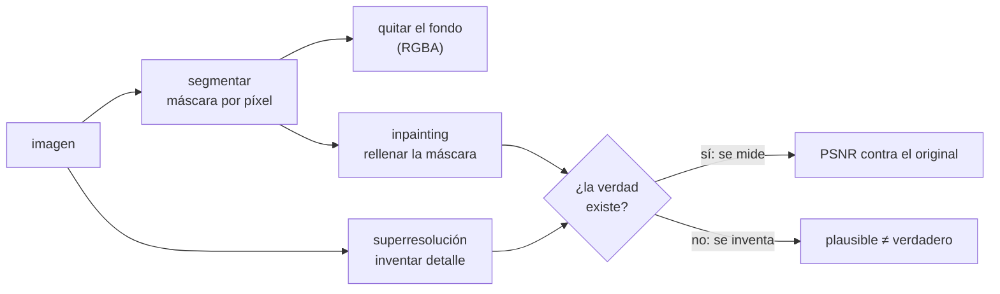

# ✂️ cv06 — Segmentación y edición

> Python para desarrolladores Java senior · **Carta** · Track `cv` — Visión por computador ·
> sección 6 de 8
> Se lee suelta: no hace falta ninguna otra sección de la carta. Conviene haber leído
> [`cv02`](op165-cv02-deteccion.md) (la instalación de MediaPipe en Linux).
> Versiones verificadas contra PyPI el 07/10/2026 · Código probado el 07/10/2026 con Python 3.14.7,
> en contenedor: las salidas son las de esa corrida.

---

## 🎯 1. Qué problema resuelve

Detectar dice dónde; **segmentar** dice exactamente qué píxeles: la máscara de la persona, del objeto, del fondo. Y con la máscara llega la **edición**: quitar el
fondo, borrar algo y rellenar el hueco (*inpainting*), agrandar una imagen inventando el detalle que no tenía (superresolución). Son las operaciones que más se
piden en una empresa que publica fotos —fondo blanco uniforme para un catálogo, quitar una marca, agrandar una foto vieja— y las que más rápido cruzan una línea:
en un antes y después, borrar una mancha o "mejorar" la resolución del después **es fabricar el resultado**.

La sección mide tres operaciones contra una verdad conocida, sobre el retrato de prueba de scikit-image: dos recortadores de fondo (el segmentador de selfie de
**MediaPipe** y **rembg** con su modelo chico), dos rellenos de OpenCV contra rayas sintéticas, y una red de superresolución (**FSRCNN**, en el módulo
`dnn_superres` de `opencv-contrib`) contra la interpolación bicúbica. **SAM** (*Segment Anything*, de Meta) es el segmentador general de referencia; pesa cientos de
megabytes y pide PyTorch, y aparece en los ejercicios.

---

## 🧠 2. El modelo



| Operación | Herramienta | Qué hace | Qué no hace |
|---|---|---|---|
| Quitar el fondo de una persona | MediaPipe *selfie segmenter* | Una red de 250 KB, en tiempo real | Objetos que no son personas |
| Quitar el fondo de cualquier cosa | `rembg` 2.0.85 (U²-Net y otros) | Fondo de productos, personas, animales | Ser rápido en CPU |
| Segmentar lo que se señale | SAM | Una máscara por clic o caja, de cualquier objeto | Correr sin GPU con soltura |
| Rellenar un hueco chico | `cv2.inpaint` (Telea, Navier-Stokes) | Propaga los bordes hacia adentro | Inventar estructura (un ojo, un texto) |
| Agrandar | `cv2.dnn_superres` (FSRCNN, EDSR) | Bordes más nítidos que la bicúbica | Recuperar información que no estaba |

---

## 💻 3. El ejemplo que corre

La instalación es la de cv02 (el `pyproject.toml` con `override-dependencies` y `libegl1`/`libgles2` en Linux), con `rembg` y `onnxruntime`:

```bash
uv add opencv-contrib-python-headless==5.0.0.93 mediapipe==1.1.0 rembg==2.0.85 onnxruntime==1.30.0 scikit-image==0.26.0 numpy==2.5.3
```

`edicion.py`:

```python
"""Segmentar, borrar y agrandar: dos recortadores de fondo, dos rellenos y una superresolución, medidos contra la verdad."""

import pathlib
import time
import urllib.request

import cv2
import mediapipe as mp
import numpy as np
from mediapipe.tasks.python import BaseOptions, vision
from rembg import new_session, remove
from skimage import data
from skimage.metrics import peak_signal_noise_ratio as psnr

MODELS = pathlib.Path("modelos")
SELFIE = "https://storage.googleapis.com/mediapipe-models/image_segmenter/selfie_segmenter/float16/latest/selfie_segmenter.tflite"
FSRCNN = "https://github.com/Saafke/FSRCNN_Tensorflow/raw/master/models/FSRCNN_x2.pb"


def fetch(url):
    MODELS.mkdir(exist_ok=True)
    path = MODELS / url.rsplit("/", 1)[1]
    if not path.exists():
        urllib.request.urlretrieve(url, path)
    return str(path)


rgb = data.astronaut()
bgr = cv2.cvtColor(rgb, cv2.COLOR_RGB2BGR)

# 1. Quitar el fondo: el segmentador de selfie de MediaPipe contra rembg con su modelo chico (u2netp)
segmenter = vision.ImageSegmenter.create_from_options(vision.ImageSegmenterOptions(
    base_options=BaseOptions(model_asset_path=fetch(SELFIE)), output_confidence_masks=True))
start = time.perf_counter()
confidence = segmenter.segment(mp.Image(image_format=mp.ImageFormat.SRGB, data=rgb)).confidence_masks[0].numpy_view()
mask_mp = confidence.squeeze() > 0.5
t_mp = time.perf_counter() - start

session = new_session("u2netp")                       # baja el modelo la primera vez, a ~/.rembg/models
remove(rgb, session=session, only_mask=True)          # la primera llamada carga la red: fuera de la medición
start = time.perf_counter()
mask_rembg = np.array(remove(rgb, session=session, only_mask=True)) > 127
t_rembg = time.perf_counter() - start
iou = (mask_mp & mask_rembg).sum() / (mask_mp | mask_rembg).sum()
print(f"fondo con MediaPipe: {mask_mp.mean():.1%} de la imagen es persona · {t_mp * 1000:.0f} ms")
print(f"fondo con rembg:     {mask_rembg.mean():.1%} de la imagen es persona · {t_rembg * 1000:.0f} ms")
print(f"coincidencia entre las dos máscaras (IoU): {iou:.2f}")
cv2.imwrite("sin_fondo.png", np.dstack([bgr, np.uint8(mask_rembg) * 255]))

# 2. Borrar: rayas sintéticas sobre la foto, y cuánto se acerca cada relleno a la foto original
damaged, scratch = bgr.copy(), np.zeros(bgr.shape[:2], np.uint8)
rng = np.random.default_rng(4)
for _ in range(25):
    p1, p2 = rng.integers(0, 512, 2), rng.integers(0, 512, 2)
    cv2.line(scratch, tuple(int(v) for v in p1), tuple(int(v) for v in p2), 255, 3)
damaged[scratch > 0] = 255
blurred = cv2.medianBlur(damaged, 9)
naive = np.where(scratch[..., None] > 0, blurred, damaged)
print(f"\nrayas: {(scratch > 0).mean():.1%} de los píxeles")
for name, img in (("sin reparar", damaged), ("mediana de 9×9", naive),
                  ("inpaint Telea", cv2.inpaint(damaged, scratch, 5, cv2.INPAINT_TELEA)),
                  ("inpaint Navier-Stokes", cv2.inpaint(damaged, scratch, 5, cv2.INPAINT_NS))):
    print(f"  {name:<22} PSNR {psnr(bgr, img):5.2f} dB")

# 3. Agrandar: reducir a la mitad y volver, con interpolación bicúbica o con una red (FSRCNN ×2)
small = cv2.resize(bgr, (256, 256), interpolation=cv2.INTER_AREA)
sr = cv2.dnn_superres.DnnSuperResImpl.create()
sr.readModel(fetch(FSRCNN))
sr.setModel("fsrcnn", 2)
start = time.perf_counter()
up_net = sr.upsample(small)
t_net = time.perf_counter() - start
up_cubic = cv2.resize(small, (512, 512), interpolation=cv2.INTER_CUBIC)
print(f"\nde 256 a 512: bicúbica PSNR {psnr(bgr, up_cubic):.2f} dB · FSRCNN PSNR {psnr(bgr, up_net):.2f} dB ({t_net * 1000:.0f} ms)")
```

```bash
uv run edicion.py
```

Salida (Python 3.14.7, 07/10/2026) (en la primera corrida, `rembg` escribe además su barra de descarga del modelo):

```text
fondo con MediaPipe: 54.5% de la imagen es persona · 25 ms
fondo con rembg:     54.8% de la imagen es persona · 626 ms
coincidencia entre las dos máscaras (IoU): 0.98

rayas: 12.0% de los píxeles
  sin reparar            PSNR 12.97 dB
  mediana de 9×9         PSNR 13.26 dB
  inpaint Telea          PSNR 29.84 dB
  inpaint Navier-Stokes  PSNR 29.92 dB

de 256 a 512: bicúbica PSNR 30.63 dB · FSRCNN PSNR 31.64 dB (38 ms)
```

Lo que dicen los números:

- **Los dos recortadores coinciden en un 98 %** (IoU 0,98) y marcan la misma proporción de persona (54,5 % y 54,8 %), pero **MediaPipe tarda 25 ms y `rembg` 626**,
  ya con el modelo cargado (en otras corridas, 26 y 593–719 ms). Para personas, el segmentador de selfie gana por más de veinte veces; `rembg` se justifica cuando lo que hay que recortar no es una persona.
- **Las rayas cubren el 12 % de la imagen** y la dejan en 13 dB de PSNR. Una mediana de 9×9 apenas mejora (13,26 dB): donde las rayas se cruzan, la mediana elige
  blanco. **Los dos rellenos de OpenCV la llevan a casi 30 dB**, sin diferencia práctica entre Telea y Navier-Stokes. Rellenan bien porque las rayas son finas: el
  hueco tiene vecinos a menos de tres píxeles.
- **FSRCNN gana 1 dB a la bicúbica** (31,64 contra 30,63) en 38 ms (78 en otra corrida). Un decibel se nota en bordes y texto; no recupera nada que la imagen de 256 no tuviera.

**Detalles con intención**

- **La verdad existe** en los tres experimentos porque el daño es sintético: se reduce o se raya la foto original, y el resultado se compara con ella. En la vida
  real no hay original contra el cual medir, y la red rellena con lo **plausible**.
- **`only_mask=True`** en `rembg` devuelve la máscara en vez de la imagen recortada; así se comparan las dos herramientas en lo mismo.
- **La primera llamada a `remove` queda fuera de la medición**: carga la red. Sin ese calentamiento, la cifra de `rembg` incluye segundos de inicialización.
- **`rembg` baja sus modelos a `~/.rembg/models`** desde las *releases* de su repositorio, en la primera llamada. En un servidor sin salida a internet, se bajan al
  construir la imagen.

---

## ⚠️ 4. Lo que se rompe

**Editar la foto que es evidencia.** Un antes y después es la promesa de un resultado. Borrar una mancha, uniformar el fondo con tonos distintos en cada foto o
"mejorar" la resolución del después altera la evidencia, y en publicidad es información engañosa ante el Estatuto del Consumidor (Ley 1480 de 2011). La regla de una
clínica seria es la misma que la de Marcela con Instagram: buena luz y **sin filtros**, y la edición se limita a recortar y rotar, igual en las dos fotos.

**El inpainting con huecos grandes.** Telea y Navier-Stokes propagan bordes; con un hueco del tamaño de un ojo, lo rellenan con una mancha. Las redes generativas
(SAM más un modelo de difusión) rellenan con algo convincente, y por eso más peligroso: un diente que no existe se ve real.

**La superresolución como prueba.** Agrandar la foto de una cámara de seguridad para "leer una placa" o "ver una cara" produce detalle inventado por la red. Sirve
para ver mejor; no sirve como evidencia de lo que no estaba en los píxeles.

**La máscara en el borde.** El pelo, la transparencia y los bordes borrosos son donde los recortadores difieren; el 2 % que no coincide entre las dos máscaras está
ahí. Para un catálogo, se revisan los bordes; para un fondo de videollamada, da igual.

---

## ⚖️ 5. Cuándo NO usarla

**En fotografía clínica, salvo recortar y rotar.** Ni fondo, ni relleno, ni superresolución. La foto clínica es un registro de la historia clínica, y la que se
publica es una promesa; ninguna de las dos admite píxeles inventados.

**Cuando el fondo se puede controlar al tomar la foto.** Una pared blanca y una luz uniforme dan mejor resultado que cualquier segmentador, a costo cero y sin
borde que revisar.

**Cuando la imagen va a servir para decidir.** Si una persona va a tomar una decisión mirando la imagen (diagnóstico, peritaje, control de calidad), la imagen que
mira es la original. La editada, si existe, va rotulada como editada.

---

## 🧪 6. Ejercicios (10)

**🟢 Fácil (1–3)**

1. Corre el ejemplo y abre `sin_fondo.png`. **Criterio:** la salida completa, y señalas dónde está el 2 % en que las dos máscaras no coinciden.
2. Cambia el grosor de las rayas a 9 píxeles. **Criterio:** el PSNR de Telea y de Navier-Stokes, y la diferencia contra las rayas de 3.
3. Repite la superresolución con `INTER_LINEAR` y `INTER_LANCZOS4`. **Criterio:** la tabla de PSNR de las cuatro opciones.

**🟡 Intermedio (4–6)**

4. Quita el fondo de una foto tuya con los dos recortadores y compón sobre fondo blanco. **Criterio:** las dos composiciones, y cuál deja mejor el pelo.
5. Prueba `rembg` con `u2net` (el modelo grande, 176 MB) en vez de `u2netp`. **Criterio:** el tiempo, el tamaño del modelo y la IoU contra MediaPipe.
6. Borra un rectángulo de 60×60 sobre un ojo e infórmalo con Telea. **Criterio:** el PSNR del rectángulo, y una frase sobre lo que se ve.

**🟠 Difícil (7–9)**

7. Corre SAM (o su versión liviana) con una caja alrededor del casco. **Criterio:** la máscara del casco, el tiempo en CPU y el tamaño del modelo.
8. Superresolución ×4: compara bicúbica, FSRCNN ×4 y EDSR ×4. **Criterio:** PSNR y tiempo de cada una, y si la mejora de EDSR justifica su tiempo.
9. Escribe un verificador que detecte si un "después" tiene una región rellenada con inpainting (pista: el ruido del sensor desaparece en la zona rellenada).
   **Criterio:** detecta el rectángulo del ejercicio 6 y no marca la foto original.

**🔴 Muy difícil (10)**

10. Escribe la política de edición de imágenes publicadas de una empresa de servicios de salud o estética. **Criterio:** una página. *Rúbrica:* (a) qué operaciones se
    permiten y cuáles no, con ejemplos; (b) cómo se conserva el original y se registra cada edición; (c) qué dice la Ley 1480 sobre publicidad engañosa; (d) cómo se
    verifica, antes de publicar, que la regla se cumplió.

---

## 📚 7. Referencias

**Documentación oficial**

- MediaPipe, segmentación de imágenes en Python: https://ai.google.dev/edge/mediapipe/solutions/vision/image_segmenter/python
- `rembg`: https://github.com/danielgatis/rembg
- Los modelos de FSRCNN para `dnn_superres`: https://github.com/Saafke/FSRCNN_Tensorflow
- Segment Anything (SAM 2): https://github.com/facebookresearch/sam2

**Ley**

- Ley 1480 de 2011, Estatuto del Consumidor (información y publicidad engañosa): https://www.funcionpublica.gov.co/eva/gestornormativo/norma.php?i=44306

**Artículos**

- Telea, *An Image Inpainting Technique Based on the Fast Marching Method* (2004): https://www.olivier-augereau.com/docs/2004JGraphToolsTelea.pdf
- Dong, Loy y Tang, *Accelerating the Super-Resolution Convolutional Neural Network* (FSRCNN, 2016): https://arxiv.org/abs/1608.00367

**Orden de lectura sugerido:** la página de MediaPipe; el README de `rembg` (sus modelos y cuándo usar cada uno); el artículo de Telea, corto, para entender por qué el
relleno falla con huecos grandes.

---

## 🚀 8. Cierre

Segmentar personas cuesta 25 ms con MediaPipe y más de 600 con `rembg`, para la misma máscara al 98 %. Los rellenos de OpenCV recuperan rayas finas de 13 a 30 dB, y la
superresolución gana un decibel inventando bordes. Las tres operaciones funcionan, y por eso la regla importa más que la técnica: la foto que es evidencia o promesa
no se rellena ni se agranda.

**La señal de que quedó bien:** *"Sé elegir recortador por lo que recorta y medirlo, y ninguna foto clínica o de antes y después pasa por un relleno o una
superresolución en mi código."*

> 🏷️ **Cierra la sección con su tag**, cuando los ejercicios que elegiste estén hechos:
>
> ```bash
> git tag -a op-cv-fase-06 -m "op cv06 cerrada: recortar, rellenar y agrandar, medidos contra la verdad"
> ```
>
> Los commits llevan su prefijo (`op cv06: …`) y los de ejercicio su número
> (`op cv06 ej07: …`).
