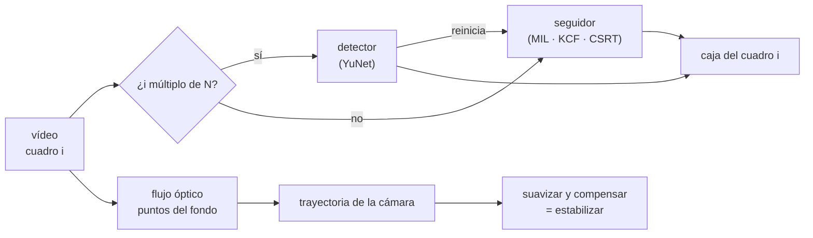

# 🎞️ cv07 — Vídeo con modelos

> Python para desarrolladores Java senior · **Carta** · Track `cv` — Visión por computador ·
> sección 7 de 8
> Se lee suelta: no hace falta ninguna otra sección de la carta. Conviene haber leído
> [`cv02`](op165-cv02-deteccion.md) (YuNet) y, para el vídeo como archivo, [`ar08`](op154-ar08-video.md).
> Versiones verificadas contra PyPI el 07/10/2026 · Código probado el 07/10/2026 con Python 3.14.7,
> en contenedor: las salidas son las de esa corrida.

---

## 🎯 1. Qué problema resuelve

Un vídeo es una secuencia de imágenes, y todo lo del track se le puede aplicar cuadro por cuadro. La pregunta nueva es **el costo**: treinta cuadros por segundo
son treinta detecciones por segundo, un minuto son 1.800, y un modelo que tarda 20 ms por imagen se come dos tercios del presupuesto de tiempo real. Las dos
respuestas clásicas son **detectar menos y seguir más** (un seguidor, *tracker*, mueve la caja entre detecciones, en teoría más barato) y **estabilizar** (estimar
el temblor de la cámara y compensarlo, para que lo de abajo trabaje sobre imágenes quietas).

Las dos se miden mal casi siempre, porque en un vídeo real nadie sabe dónde estaba de verdad la cara en el cuadro 87. Esta sección fabrica un vídeo donde sí se sabe:
la cabeza del retrato de prueba cruza un fondo texturizado siguiendo una trayectoria conocida, y la cámara tiembla con un ruido conocido. Con la verdad en la mano,
cada estrategia se mide en cuadros por segundo y en cuánto se aleja de la caja real.

---

## 🧠 2. El modelo



| Pieza | Qué hace | Costo típico | Lo que pierde |
|---|---|---|---|
| Detector en cada cuadro | Busca el objeto desde cero | El del modelo, cada cuadro | Nada de continuidad: la caja tiembla |
| Seguidor | Busca el mismo parche cerca de donde estaba | Depende del algoritmo (medido abajo) | Deriva: se va despegando hasta la próxima detección |
| Flujo óptico (Lucas-Kanade) | Mueve puntos de un cuadro al siguiente | Barato | Confunde el movimiento del sujeto con el de la cámara |

---

## 💻 3. El ejemplo que corre

```bash
uv add opencv-contrib-python-headless==5.0.0.93 scikit-image==0.26.0 numpy==2.5.3
```

`video.py`:

```python
"""Vídeo con modelos: detectar en cada cuadro, detectar cada N y seguir, y estabilizar; todo contra una verdad conocida."""

import pathlib
import time
import urllib.request

import cv2
import numpy as np
from skimage import data

MODELS = pathlib.Path("modelos")
YUNET = "https://github.com/opencv/opencv_zoo/raw/main/models/face_detection_yunet/face_detection_yunet_2023mar.onnx"
W, H, FRAMES, FPS = 640, 360, 150, 30


def fetch(url):
    MODELS.mkdir(exist_ok=True)
    path = MODELS / url.rsplit("/", 1)[1]
    if not path.exists():
        urllib.request.urlretrieve(url, path)
    return str(path)


detector = cv2.FaceDetectorYN.create(fetch(YUNET), "", (W, H), score_threshold=0.6)

# El vídeo sintético: la cabeza de la foto de prueba cruza un fondo texturizado, y la cámara tiembla
sprite = cv2.resize(cv2.cvtColor(data.astronaut(), cv2.COLOR_RGB2BGR)[20:260, 110:350], (150, 150))
detector.setInputSize((150, 150))
fx, fy, fw, fh = detector.detect(sprite)[1][0][:4]     # la caja del rostro dentro del sprite, una sola vez
rng = np.random.default_rng(5)
background = cv2.GaussianBlur(rng.integers(40, 200, (H, W, 3), dtype=np.uint8), (0, 0), 3)
shake = np.cumsum(rng.normal(0, 2.0, (FRAMES, 2)), axis=0) * 0.6 + rng.normal(0, 3.0, (FRAMES, 2))
writer = cv2.VideoWriter("sintetico.mp4", cv2.VideoWriter_fourcc(*"mp4v"), FPS, (W, H))
truth = []
for i in range(FRAMES):
    x, y = int(40 + i * 3.0), int(100 + 40 * np.sin(i / 20))           # la trayectoria de la cabeza
    frame = background.copy()
    frame[y:y + 150, x:x + 150] = sprite
    dx, dy = shake[i]
    frame = cv2.warpAffine(frame, np.float32([[1, 0, dx], [0, 1, dy]]), (W, H), borderMode=cv2.BORDER_REFLECT)
    truth.append((x + fx + dx, y + fy + dy, fw, fh))
    writer.write(frame)
writer.release()


def iou(a, b):
    ax, ay, aw, ah = a; bx, by, bw, bh = b
    ix, iy = max(0, min(ax + aw, bx + bw) - max(ax, bx)), max(0, min(ay + ah, by + bh) - max(ay, by))
    return ix * iy / (aw * ah + bw * bh - ix * iy)


def frames():
    cap = cv2.VideoCapture("sintetico.mp4")
    while (ok := cap.read())[0]:
        yield ok[1]
    cap.release()


def run(name, every, tracker_factory=None):
    detector.setInputSize((W, H))
    boxes, tracker, start = [], None, time.perf_counter()
    for i, frame in enumerate(frames()):
        if i % every == 0 or tracker is None:
            faces = detector.detect(frame)[1]
            box = tuple(faces[0][:4]) if faces is not None else None
            if tracker_factory and box is not None:
                tracker = tracker_factory()
                tracker.init(frame, tuple(int(v) for v in box))
        else:
            ok, found = tracker.update(frame)
            box = tuple(found) if ok else None
        boxes.append(box)
    seconds = time.perf_counter() - start
    scores = [iou(b, t) if b is not None else 0.0 for b, t in zip(boxes, truth)]
    print(f"{name:<30} {len(boxes) / seconds:6.0f} cuadros/s · IoU media {np.mean(scores):.2f} · "
          f"mínima {np.min(scores):.2f} · perdidos {sum(b is None for b in boxes)}")


print(f"vídeo: {FRAMES} cuadros de {W}×{H} a {FPS} cuadros/s ({FRAMES / FPS:.0f} s)\n")
run("detectar en cada cuadro", every=1)
for name, factory in (("MIL", cv2.TrackerMIL.create), ("KCF", cv2.TrackerKCF.create), ("CSRT", cv2.TrackerCSRT.create)):
    run(f"detectar cada 10 + {name}", every=10, tracker_factory=factory)
run("detectar cada 30 + KCF", every=30, tracker_factory=cv2.TrackerKCF.create)

# Estabilizar: estimar el movimiento de la cámara con flujo óptico, suavizarlo y compensarlo
def camera_path(exclude_faces):
    prev, motion = None, []
    detector.setInputSize((W, H))
    for frame in frames():
        gray = cv2.cvtColor(frame, cv2.COLOR_BGR2GRAY)
        mask = np.full((H, W), 255, np.uint8)
        if exclude_faces and (faces := detector.detect(frame)[1]) is not None:
            x, y, w, h = faces[0][:4].astype(int)
            mask[max(0, y - h):y + 2 * h, max(0, x - w):x + 2 * w] = 0      # sin puntos sobre el sujeto que se mueve
        if prev is not None:
            pts = cv2.goodFeaturesToTrack(prev, 300, 0.01, 10, mask=prev_mask)
            nxt, status, _ = cv2.calcOpticalFlowPyrLK(prev, gray, pts, None)
            m, _ = cv2.estimateAffinePartial2D(pts[status == 1], nxt[status == 1], method=cv2.RANSAC)
            motion.append((m[0, 2], m[1, 2]))
        prev, prev_mask = gray, mask
    return np.vstack([[0, 0], np.cumsum(motion, axis=0)])


real = shake - shake[0]
kernel = np.ones(15) / 15
jump = lambda p: np.abs(np.diff(p, axis=0)).mean()
print(f"\nsalto medio de la cámara entre cuadros, sin estabilizar: {jump(real):.2f} px")
for label, exclude in (("puntos en toda la imagen", False), ("puntos fuera del rostro", True)):
    path = camera_path(exclude)
    smooth = np.column_stack([np.convolve(np.pad(path[:, k], 7, mode="edge"), kernel, "valid") for k in range(2)])
    left = real - (path - smooth)                     # el temblor que queda después de compensar lo estimado
    print(f"{label:<26} error de la trayectoria {np.abs(path - real).mean():6.2f} px · "
          f"salto que queda {jump(left):.2f} px")
```

```bash
uv run video.py
```

Salida (Python 3.14.7, 07/10/2026) (cuadros por segundo de una corrida en contenedor, sobre CPU):

```text
vídeo: 150 cuadros de 640×360 a 30 cuadros/s (5 s)

detectar en cada cuadro            54 cuadros/s · IoU media 0.90 · mínima 0.84 · perdidos 0
detectar cada 10 + MIL             13 cuadros/s · IoU media 0.86 · mínima 0.79 · perdidos 0
detectar cada 10 + KCF             67 cuadros/s · IoU media 0.75 · mínima 0.60 · perdidos 0
detectar cada 10 + CSRT            65 cuadros/s · IoU media 0.87 · mínima 0.71 · perdidos 0
detectar cada 30 + KCF             95 cuadros/s · IoU media 0.75 · mínima 0.58 · perdidos 0

salto medio de la cámara entre cuadros, sin estabilizar: 3.72 px
puntos en toda la imagen   error de la trayectoria 123.76 px · salto que queda 0.41 px
puntos fuera del rostro    error de la trayectoria   0.55 px · salto que queda 0.33 px
```

Lo que dicen los números:

- **Detectar en cada cuadro va a 54 cuadros/s y da la mejor caja** (IoU media 0,90). En este vídeo de 640×360, YuNet ya es más rápido que el tiempo real: no hace
  falta ningún truco.
- **MIL es más lento que detectar** (13 cuadros/s): seguir no es automáticamente más barato. Es el seguidor que OpenCV 5 trae en el paquete principal, y el primero
  que aparece en los tutoriales.
- **KCF es rápido (67 a 95 cuadros/s) y pierde precisión**: IoU 0,75 y mínimos de 0,58, porque su caja no cambia de tamaño y se despega del rostro entre detecciones.
- **CSRT da casi la precisión del detector (0,87) a 65 cuadros/s**: es la opción equilibrada cuando el detector sí es caro.
- **El estabilizador ingenuo estima mal la trayectoria de la cámara por 124 píxeles**: la cara tiene más textura que el fondo desenfocado, los puntos de flujo óptico
  caen sobre ella, y el estimador sigue al sujeto, que se mueve 3 px por cuadro. Aun así reduce el salto entre cuadros de 3,72 a 0,41 px, porque la trayectoria del
  sujeto es suave y el suavizado la conserva: el error se esconde mientras el sujeto no haga un movimiento brusco.
- **Con los puntos fuera del rostro detectado, el error de la trayectoria baja a 0,55 px** y el salto que queda a 0,33. El detector le dice al estabilizador dónde no
  mirar.

**Detalles con intención**

- **`opencv-contrib-python-headless`**: KCF y CSRT viven en contrib en OpenCV 5; el paquete principal solo trae MIL (y los seguidores con red, Nano y Vit, que piden
  sus modelos).
- **El vídeo se escribe con `VideoWriter` en `mp4v` y se vuelve a leer con `VideoCapture`**: las ruedas *headless* traen FFmpeg adentro, y la compresión agrega el
  ruido de un vídeo real.
- **La verdad se calcula una vez**: la caja del rostro dentro del *sprite*, medida con YuNet sobre el *sprite* quieto, más el desplazamiento y el temblor conocidos de
  cada cuadro.
- **`estimateAffinePartial2D` con RANSAC** descarta los puntos que no se mueven con la mayoría; falla cuando la mayoría está sobre el sujeto, que es exactamente lo
  que pasó en la primera versión.

---

## ⚠️ 4. Lo que se rompe

**Medir sin verdad.** "El seguidor funciona" mirando el vídeo es la anécdota que la guía del curso prohíbe. Un vídeo sintético con trayectoria conocida, o un vídeo
anotado a mano, es lo mínimo para comparar estrategias.

**El seguidor que deriva.** Entre detecciones, el error se acumula; con N grande, la caja termina sobre el fondo. La IoU mínima, no la media, es la que dice si
sirve: KCF baja a 0,58.

**El tiempo real que no se midió en el equipo real.** Los cuadros por segundo de esta corrida son de un contenedor en un portátil; en una cámara IP con un
procesador de bajo consumo, divide por cinco. Se mide en el hardware de destino.

**El vídeo de una sede.** Detectar y seguir personas en el vídeo de una cámara de la recepción es vigilancia, aunque el código sea el mismo que el de este ejemplo:
cada persona que entra es un titular de datos, y la grabación con análisis automático necesita aviso, finalidad y conservación definidas (cv08).

---

## ⚖️ 5. Cuándo NO usarla

**Cuando el detector ya va a tiempo real.** La primera fila de la tabla: si detectar cuadro a cuadro alcanza, un seguidor solo agrega deriva y código. El seguidor es
para cuando el detector es caro (una red grande, un vídeo 4K, un procesador chico).

**Cuando basta con procesar un cuadro por segundo.** Contar, resumir o buscar un evento en una grabación rara vez necesita los treinta cuadros; muestrear a 1 cuadro/s
divide el costo por treinta sin seguidor.

**Para estabilizar un vídeo terminado.** FFmpeg trae `vidstab` y lo hace mejor y más rápido que un estabilizador escrito a mano; esta sección construye el suyo para
entender por qué falla, no para reemplazar la herramienta.

---

## 🧪 6. Ejercicios (10)

**🟢 Fácil (1–3)**

1. Corre el ejemplo y abre `sintetico.mp4`. **Criterio:** la tabla completa, y señalas en el vídeo el temblor de la cámara.
2. Cambia N de 10 a 5 y a 60 para CSRT. **Criterio:** la tabla de cuadros por segundo e IoU mínima para cada N.
3. Escribe el vídeo estabilizado (compensando `path - smooth` con `warpAffine`) y míralo junto al original. **Criterio:** el estabilizado se ve quieto y el
   sujeto sigue moviéndose.

**🟡 Intermedio (4–6)**

4. Haz que la cabeza dé un salto brusco a mitad del vídeo y repite la estabilización. **Criterio:** el estabilizador ingenuo deja un tirón visible y el que excluye
   el rostro no.
5. Agrega el seguidor `TrackerNano` (baja su modelo de opencv_zoo). **Criterio:** su fila en la tabla y el tamaño del modelo.
6. Procesa solo un cuadro por segundo y reporta en qué cuadros apareció un rostro. **Criterio:** el tiempo total contra el de detectar en cada cuadro.

**🟠 Difícil (7–9)**

7. Escala el vídeo a 1920×1080 y repite la tabla. **Criterio:** desde qué resolución el seguidor gana en cuadros por segundo al detector en cada cuadro.
8. Implementa el criterio de reinicio: detectar cuando la confianza del seguidor baja, no cada N cuadros. **Criterio:** IoU mínima mayor que la de KCF con N fijo,
   con igual o más velocidad.
9. Estabiliza con FFmpeg `vidstab` y compara contra tu estabilizador. **Criterio:** el salto medio que queda en cada uno, medido con tu flujo óptico.

**🔴 Muy difícil (10)**

10. Diseña el procesamiento de vídeo de un caso propio (no de personas en una sede). **Criterio:** una página. *Rúbrica:* (a) el presupuesto de tiempo por cuadro en
    el hardware real; (b) la estrategia (cada cuadro, cada N con seguidor, muestreo) con su tabla medida; (c) cómo se construye la verdad para medirla; (d) qué pasa
    cuando el detector o el seguidor pierden el objeto.

---

## 📚 7. Referencias

**Documentación y código**

- Los seguidores de OpenCV 5, declarados en el código fuente (MIL en el módulo `video`; KCF y CSRT en contrib): https://github.com/opencv/opencv/blob/5.x/modules/video/include/opencv2/video/tracking.hpp
- Los seguidores de `opencv_contrib` (KCF, CSRT): https://github.com/opencv/opencv_contrib/tree/5.x/modules/tracking
- FFmpeg, el filtro `vidstabdetect`: https://ffmpeg.org/ffmpeg-filters.html#vidstabdetect

**Artículos**

- Lukežič y otros, *Discriminative Correlation Filter with Channel and Spatial Reliability* (CSRT, 2017): https://arxiv.org/abs/1611.08461
- Henriques y otros, *High-Speed Tracking with Kernelized Correlation Filters* (KCF, 2014): https://arxiv.org/abs/1404.7584

**Orden de lectura sugerido:** el artículo de KCF (la idea de filtro de correlación, que explica su velocidad y su caja fija); después el de CSRT; el filtro de FFmpeg
cuando haya que estabilizar en serio.

---

## 🚀 8. Cierre

En vídeo, cada decisión se mide en cuadros por segundo y en distancia a la verdad, y la verdad hay que fabricarla para poder medir. Con un detector rápido, detectar
en cada cuadro gana: MIL es más lento que YuNet, KCF corre y se despega, CSRT equilibra. Y el estabilizador ingenuo sigue a la cara en vez de a la cámara hasta que
el detector le dice dónde no mirar.

**La señal de que quedó bien:** *"Elegí la estrategia de vídeo con una tabla de cuadros por segundo e IoU mínima medida contra una verdad, en el hardware donde va a
correr."*

> 🏷️ **Cierra la sección con su tag**, cuando los ejercicios que elegiste estén hechos:
>
> ```bash
> git tag -a op-cv-fase-07 -m "op cv07 cerrada: detector, seguidores y estabilización medidos contra un vídeo con verdad conocida"
> ```
>
> Los commits llevan su prefijo (`op cv07: …`) y los de ejercicio su número
> (`op cv07 ej07: …`).
