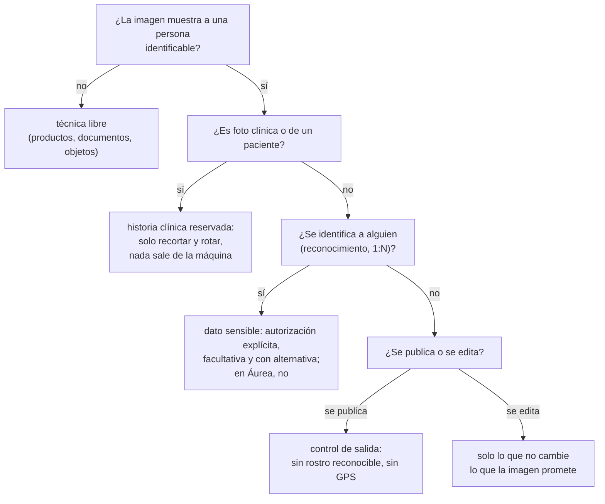

# ⚖️ cv08 — Veredicto ético y legal

> Python para desarrolladores Java senior · **Carta** · Track `cv` — Visión por computador ·
> sección 8 de 8
> Se lee suelta: no hace falta ninguna otra sección de la carta. Recoge lo medido en
> [`cv01`](op164-cv01-el-modelo.md)–[`cv07`](op170-cv07-video-con-modelos.md).
> Versiones verificadas contra PyPI el 07/10/2026 · Código probado el 07/10/2026 con Python 3.14.7,
> en contenedor: las salidas son las de esa corrida.

---

## 🎯 1. Qué problema resuelve

El track enseñó a detectar, poner 478 puntos, deformar, reconocer, recortar, rellenar y seguir caras, y cada sección midió que funciona. Este veredicto contesta la
pregunta que la propuesta del track dejó planteada desde el principio: **¿qué de todo esto puede hacer Áurea con las fotos de sus pacientes?** La respuesta corta es
que casi nada, y la larga tiene nombre propio: la historia clínica es reservada (Resolución 1995 de 1999 del Ministerio de Salud), los datos biométricos son
**datos sensibles** (Ley 1581 de 2012, artículo 5), su tratamiento está prohibido salvo autorización explícita y facultativa (artículo 6, reglamentado por el
Decreto 1377 de 2013), y la publicidad que muestra un resultado que no es el real es información engañosa (Ley 1480 de 2011).

Pero un veredicto que solo dice que no es incompleto. Hay un uso de la visión por computador que **protege** en vez de exponer: un **control de salida** que revisa
cada imagen antes de que deje la empresa y bloquea la que tenga un rostro reconocible o coordenadas GPS. Es el ejemplo de esta sección, y mide de paso la pregunta
que todo el mundo hace: desde qué pixelado un rostro deja de reconocerse.

> 📝 **Esto no es asesoría legal.** La sección cita las normas para que el lector sepa qué leer y a quién preguntar; la decisión sobre un tratamiento concreto la
> toma la empresa con su abogado y su oficial de protección de datos.

---

## 🧠 2. El modelo



| Sección | Lo que enseñó | Con fotos de pacientes, en Áurea |
|---|---|---|
| cv01–cv02 · detectar | Encontrar rostros, medir detectores | **Sí, para proteger**: el control de salida de esta sección. No para recortar fotos clínicas en un servidor |
| cv03 · puntos | Una malla que inventa lo que no ve | **No para medir** nada clínico: no está validada (2 px inventados con la boca tapada) |
| cv04 · morphing | Fabricar caras intermedias | **No**: con fotos de pacientes fabrica un resultado; en publicidad, engaño |
| cv05 · reconocer | 128 números que identifican de por vida | **No**: dato sensible, base imposible de revocar; la cédula resuelve el problema |
| cv06 · editar | Recortar fondo, rellenar, agrandar | **Solo recortar y rotar**, igual en el antes y en el después |
| cv07 · vídeo | Detectar y seguir cuadro a cuadro | **No** sobre las cámaras de las sedes: vigilancia de pacientes y empleados |

---

## 💻 3. El ejemplo que corre

```bash
uv add opencv-python-headless==5.0.0.93 scikit-image==0.26.0 numpy==2.5.3 Pillow==12.3.0
```

`salida_segura.py` arma una carpeta `para_publicar/` con siete casos —el retrato de prueba, un café, un gato, el café con GPS en su EXIF, el rostro pixelado con
bloques de 4 y de 16, y un rostro de 40 píxeles en una imagen de 1080p—, la revisa, y después barre el pixelado:

```python
"""Un control de salida: nada se publica con un rostro reconocible ni con coordenadas GPS. Y desde qué pixelado deja de reconocerse."""

import pathlib
import sys
import urllib.request

import cv2
import numpy as np
from PIL import ExifTags, Image
from skimage import data

MODELS = pathlib.Path("modelos")
YUNET = "https://github.com/opencv/opencv_zoo/raw/main/models/face_detection_yunet/face_detection_yunet_2023mar.onnx"
SFACE = "https://github.com/opencv/opencv_zoo/raw/main/models/face_recognition_sface/face_recognition_sface_2021dec.onnx"


def fetch(url):
    MODELS.mkdir(exist_ok=True)
    path = MODELS / url.rsplit("/", 1)[1]
    if not path.exists():
        urllib.request.urlretrieve(url, path)
    return str(path)


detector = cv2.FaceDetectorYN.create(fetch(YUNET), "", (0, 0), score_threshold=0.5)
recognizer = cv2.FaceRecognizerSF.create(fetch(SFACE), "")


def faces_in(bgr):
    detector.setInputSize((bgr.shape[1], bgr.shape[0]))
    found = detector.detect(bgr)[1]
    return [] if found is None else list(found)


def pixelate(bgr, block):
    h, w = bgr.shape[:2]
    return cv2.resize(cv2.resize(bgr, (w // block, h // block), interpolation=cv2.INTER_AREA), (w, h),
                      interpolation=cv2.INTER_NEAREST)


# La carpeta "para publicar", armada con casos sintéticos y la foto de prueba de scikit-image
out = pathlib.Path("para_publicar")
out.mkdir(exist_ok=True)
face = cv2.cvtColor(data.astronaut(), cv2.COLOR_RGB2BGR)
coffee = cv2.cvtColor(data.coffee(), cv2.COLOR_RGB2BGR)
x, y, w, h = faces_in(face)[0][:4].astype(int)
face_pix16 = face.copy(); face_pix16[y:y + h, x:x + w] = pixelate(face[y:y + h, x:x + w], 16)
face_pix4 = face.copy(); face_pix4[y:y + h, x:x + w] = pixelate(face[y:y + h, x:x + w], 4)
small = np.full((1080, 1920, 3), 120, np.uint8); small[500:540, 900:940] = cv2.resize(face[40:240, 130:330], (40, 40))
cv2.imwrite(str(out / "retrato.jpg"), face)
cv2.imwrite(str(out / "cafe.jpg"), coffee)
cv2.imwrite(str(out / "gato.jpg"), cv2.cvtColor(data.chelsea(), cv2.COLOR_RGB2BGR))
cv2.imwrite(str(out / "rostro_pixelado_16.jpg"), face_pix16)
cv2.imwrite(str(out / "rostro_pixelado_4.jpg"), face_pix4)
cv2.imwrite(str(out / "rostro_de_40px_en_1080p.jpg"), small)
exif = Image.Exif()
exif.get_ifd(ExifTags.IFD.GPSInfo).update({ExifTags.GPS.GPSLatitudeRef: "N", ExifTags.GPS.GPSLatitude: (4.0, 36.0, 14.0)})
Image.fromarray(data.coffee()).save(out / "cafe_con_gps.jpg", exif=exif)


def check(path):
    """Las razones para no publicar una imagen; una lista vacía significa que puede salir."""
    reasons = []
    with Image.open(path) as img:
        if img.getexif().get_ifd(ExifTags.IFD.GPSInfo):
            reasons.append("coordenadas GPS en el EXIF")
    found = faces_in(cv2.imread(str(path)))
    if found:
        reasons.append(f"{len(found)} rostro(s), confianza {max(f[-1] for f in found):.2f}")
    return reasons


blocked = 0
print(f"{'archivo':<28} veredicto")
for path in sorted(out.glob("*.jpg")):
    reasons = check(path)
    blocked += bool(reasons)
    print(f"{path.name:<28} {'BLOQUEADA: ' + '; '.join(reasons) if reasons else 'puede salir'}")

# ¿Desde qué pixelado deja de reconocerse? La referencia es el rostro sin tocar
reference = recognizer.feature(recognizer.alignCrop(face, faces_in(face)[0]))
print(f"\nrostro de {w} px de ancho · pixelado   ¿lo detecta?   coseno con el original")
for block in (2, 4, 8, 12, 16):
    img = face.copy(); img[y:y + h, x:x + w] = pixelate(face[y:y + h, x:x + w], block)
    found = faces_in(img)
    if not found:
        print(f"bloques de {block:>2} px ({w // block:>2} por lado)    no             —")
        continue
    score = recognizer.match(reference, recognizer.feature(recognizer.alignCrop(img, found[0])), cv2.FaceRecognizerSF_FR_COSINE)
    print(f"bloques de {block:>2} px ({w // block:>2} por lado)    sí          {score:6.3f} {'(misma persona)' if score >= 0.363 else ''}")

sys.exit(1 if blocked else 0)                         # en CI o en un pre-commit, el código de salida detiene la publicación
```

```bash
uv run salida_segura.py; echo "código de salida: $?"
```

Salida (Python 3.14.7, 07/10/2026):

```text
archivo                      veredicto
cafe.jpg                     puede salir
cafe_con_gps.jpg             BLOQUEADA: coordenadas GPS en el EXIF
gato.jpg                     puede salir
retrato.jpg                  BLOQUEADA: 1 rostro(s), confianza 0.93
rostro_de_40px_en_1080p.jpg  BLOQUEADA: 1 rostro(s), confianza 0.69
rostro_pixelado_16.jpg       puede salir
rostro_pixelado_4.jpg        BLOQUEADA: 1 rostro(s), confianza 0.91

rostro de 89 px de ancho · pixelado   ¿lo detecta?   coseno con el original
bloques de  2 px (44 por lado)    sí           0.950 (misma persona)
bloques de  4 px (22 por lado)    sí           0.667 (misma persona)
bloques de  8 px (11 por lado)    sí           0.165 
bloques de 12 px ( 7 por lado)    sí           0.130 
bloques de 16 px ( 5 por lado)    no             —
código de salida: 1
```

Lo que dicen los números:

- **El control bloquea lo que tiene que bloquear**: el retrato, el café con GPS y el rostro de 40 píxeles perdido en una imagen de 1080p (confianza 0,69: el detector
  de cv02 lo encuentra igual). Deja pasar el café y el gato.
- **El pixelado con bloques de 4 no anonimiza**: el detector lo encuentra con 0,91 de confianza y el reconocedor de cv05 lo da como la misma persona (0,667). Es el
  pixelado "suave" que se ve en redes sociales.
- **Con bloques de 8 (11 bloques a lo ancho del rostro) el reconocedor ya no lo da como la misma persona** (0,165), aunque el detector todavía encuentra una cara;
  **con bloques de 16 (5 a lo ancho), ni siquiera hay cara**. La regla práctica que sale de la tabla: menos de diez bloques a lo ancho del rostro.
- **El código de salida es 1** porque hubo imágenes bloqueadas: en un *pre-commit* o en el CI que publica el sitio, eso detiene la publicación.

**Detalles con intención**

- **"No lo reconoce SFace" no es "anónimo".** El barrido mide contra **una** red de 37 MB. Una red más grande, una persona que conoce al paciente o el contexto de la
  foto (la sede, la fecha, el tatuaje del brazo) pueden reidentificar lo que el modelo no. Por eso la regla de Áurea no es "pixelar bien": es que la foto del paciente
  no sale.
- **El control se equivoca en las dos direcciones**: bloquearía un afiche con una cara dibujada realista y dejaría pasar un rostro de perfil o de 15 píxeles. Es una
  red de seguridad que se suma a la revisión humana, no la reemplaza.
- **El GPS se revisa aparte del rostro**: una foto de un consultorio sin nadie adentro, con coordenadas, dice dónde está; una foto de la casa de un paciente, dice dónde
  vive.
- **Todo corre en la máquina**: los modelos se bajan una vez y ninguna imagen se manda a un servicio externo para revisarla. Un control de privacidad que sube las fotos
  a una API para analizarlas es el problema que quería evitar.

---

## ⚠️ 4. Lo que se rompe

**La autorización que se pide como condición.** El formulario de admisión con una casilla "autorizo el uso de mi imagen para fines publicitarios y de reconocimiento"
no vale para un dato sensible si atender al paciente depende de ella. La autorización para el antes y después se pide aparte, para esa publicación, revocable, y el
tratamiento sigue igual si el paciente dice que no.

**El "solo es un prototipo".** El prototipo de reconocimiento que corre "solo con las fotos de prueba de la sede" ya es un tratamiento de datos biométricos si las fotos
son de pacientes, y la base de vectores que dejó sigue existiendo cuando el prototipo se abandona.

**La norma de otro país.** El reglamento europeo de inteligencia artificial (artículo 5) prohíbe, entre otras cosas, armar bases de reconocimiento facial con imágenes
recogidas de internet o de cámaras sin selección. No aplica en Colombia, pero dice hacia dónde va la regulación, y cualquier proveedor europeo de Áurea lo va a exigir.

**El modelo con licencia de investigación.** InsightFace y otros publican sus modelos solo para uso no comercial (cv05). Usarlos en un producto es incumplir la licencia
además de la ley de datos.

---

## ⚖️ 5. Cuándo NO usar lo que este track enseñó

**Con fotos de pacientes, para cualquier cosa que no sea protegerlas.** Es la conclusión de las siete secciones anteriores, y tiene una excepción: el control de salida
de esta sección, que usa la detección para impedir que una cara salga.

**Cuando el proceso resuelve el problema.** Encuadre, fondo y luz se estandarizan con un protocolo de toma; la identidad se verifica con un documento; la búsqueda de
fotos de un paciente se hace con su identificador. Ninguno necesita un modelo, y todos evitan tratar datos sensibles.

**Y donde sí vale la pena**: imágenes de objetos, productos, documentos, piezas, cultivos, vías; caras de personas que consienten de verdad, con la imagen y el vector
en su dispositivo; y el propio rostro del lector, que es con lo que este track pidió practicar.

---

## 🧪 6. Ejercicios (10)

**🟢 Fácil (1–3)**

1. Corre el ejemplo y abre `para_publicar/`. **Criterio:** la salida completa, y en cuál de las imágenes que pasaron reconocerías tú a la persona.
2. Agrega a la carpeta una foto tuya con GPS (la de tu teléfono). **Criterio:** queda bloqueada por las dos razones.
3. Instala el control como *hook* de `pre-commit` en un repositorio de prueba. **Criterio:** un commit con `retrato.jpg` se rechaza y uno con `cafe.jpg` pasa.

**🟡 Intermedio (4–6)**

4. Repite el barrido de pixelado con desenfoque gaussiano (núcleos de 5 a 51). **Criterio:** la tabla, y el núcleo desde el que SFace deja de reconocer, en proporción
   al ancho del rostro.
5. Haz que el control, en vez de bloquear, genere la versión publicable (rostro pixelado con menos de diez bloques a lo ancho y EXIF borrado). **Criterio:** la versión
   generada pasa el control.
6. Busca los falsos negativos del control: rostros de perfil, de 15 píxeles, con casco. **Criterio:** una tabla de cuáles pasan, y qué cambiarías (umbral, escala,
   segundo detector).

**🟠 Difícil (7–9)**

7. Lee los artículos 5 y 6 de la Ley 1581 y el capítulo de datos sensibles del Decreto 1377 de 2013. **Criterio:** un resumen de una página de qué exige una
   autorización válida para datos biométricos, con el artículo de cada exigencia.
8. Escribe el registro de lo que el control bloqueó (qué archivo, por qué, cuándo, quién intentó publicarlo) sin guardar la imagen ni el vector. **Criterio:** el registro
   sirve para una auditoría y no contiene ningún dato biométrico.
9. Mide el control contra cien imágenes propias sin personas y cien con personas (tuyas o de voluntarios). **Criterio:** falsos positivos y falsos negativos, y el
   umbral de confianza que elegirías.

**🔴 Muy difícil (10)**

10. Escribe la política de imágenes de una empresa de salud o estética. **Criterio:** dos páginas para la gerencia. *Rúbrica:* (a) qué imágenes son historia clínica y
    quién las ve; (b) cómo se pide, se registra y se revoca la autorización de publicación; (c) qué técnicas de este track se prohíben y cuáles se usan para proteger,
    con los números que las justifican; (d) qué control automático corre antes de cada publicación y quién revisa lo que el control deja pasar.

---

## 📚 7. Referencias

**Normas colombianas**

- Ley 1581 de 2012, protección de datos personales (datos sensibles, artículos 5 y 6): https://www.funcionpublica.gov.co/eva/gestornormativo/norma.php?i=49981
- Decreto 1377 de 2013, reglamentario de la Ley 1581 (autorización y datos sensibles): https://www.funcionpublica.gov.co/eva/gestornormativo/norma.php?i=53646
- Resolución 1995 de 1999 del Ministerio de Salud, historia clínica: https://www.minsalud.gov.co/Normatividad_Nuevo/RESOLUCI%C3%93N%201995%20DE%201999.pdf
- Ley 1480 de 2011, Estatuto del Consumidor (publicidad engañosa): https://www.funcionpublica.gov.co/eva/gestornormativo/norma.php?i=44306

**Referencias de afuera**

- Reglamento europeo de inteligencia artificial, artículo 5 (prácticas prohibidas): https://artificialintelligenceact.eu/article/5/
- NIST, evaluaciones de reconocimiento facial y sus diferencias demográficas: https://pages.nist.gov/frvt/html/frvt11.html

**Orden de lectura sugerido:** los artículos 5 y 6 de la Ley 1581 (diez minutos); el Decreto 1377 en lo de autorización; la Resolución 1995 si el sistema toca historia
clínica; el artículo 5 del reglamento europeo para ver hacia dónde va la regulación.

---

## 🚀 8. Cierre

El track enseñó la técnica entera con caras que no son de pacientes, y midió que funciona: por eso Áurea no puede desplegar la mitad. Con fotos de pacientes, la
visión por computador sirve para una cosa: impedir que una cara salga. El control de salida bloquea el retrato, el GPS y el rostro de 40 píxeles; el pixelado con
bloques de 4 todavía se reconoce, y con menos de diez bloques a lo ancho deja de reconocerse para una red, que no es lo mismo que ser anónimo.

**La señal de que quedó bien:** *"Puedo explicar con los números del track y los artículos de la ley por qué cada técnica se usa o no con fotos de pacientes, y nada
sale de la empresa sin pasar por un control de salida que corre en mi máquina."*

> 🏷️ **Cierra la sección con su tag**, cuando los ejercicios que elegiste estén hechos:
>
> ```bash
> git tag -a op-cv-fase-08 -m "op cv08 cerrada: el veredicto con nombre propio y el control de salida medido"
> ```
>
> Los commits llevan su prefijo (`op cv08: …`) y los de ejercicio su número
> (`op cv08 ej07: …`).
