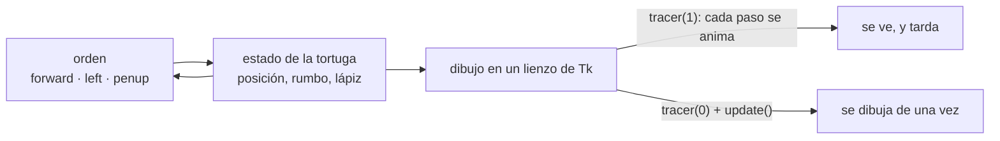

# 🐢 ed01 — turtle

> Python para desarrolladores Java senior · **Carta** · Track `ed` — Didáctica, divulgación y juguetes ·
> sección 1 de 5
> Se lee suelta: no hace falta ninguna otra sección de la carta.
> Versiones verificadas contra PyPI el 07/10/2026 · Código probado el 07/10/2026 con Python 3.14.7,
> en contenedor: las salidas son las de esa corrida.

---

## 🎯 1. Qué problema resuelve

Este track no es para el trabajo del lector. Es para el día en que le toque **enseñar**: a un hijo, a un practicante, a un equipo que llega de otro lenguaje, a un
auditorio en una charla. La propuesta de la carta lo dice sin rodeos —es el track más débil contra el criterio del curso, y se salvó porque en una carta no hay
plazas que repartir—, así que va con su propio ejemplo y sin pasar por Áurea: una espiral y un árbol, dibujados por una tortuga. Enseñarle a alguien que no programa
dentro de la empresa ya tiene su sección, junto a las demás formas de entregar ([`ui01`](op064-ui01-el-modelo-y-su-costo.md)).

**`turtle`** viene en la biblioteca estándar desde siempre, desciende del Logo de Seymour Papert (1967) y es, probablemente, el módulo que ningún desarrollador senior
de Java ha abierto. Una tortuga con un lápiz recibe órdenes —avanza, gira, levanta el lápiz— y deja un dibujo. Lo que la hace la mejor introducción que existe no es
el dibujo: es que **cada instrucción tiene una consecuencia visible e inmediata**, y que la recursión, el concepto que más cuesta enseñar, se ve crecer rama por rama.

La sección dibuja dos cosas y mide dos: cuánto cuesta la animación (y cómo apagarla), y qué pasa cuando el árbol recursivo intenta volver exactamente al punto de
partida.

---

## 🧠 2. El modelo



- **Estado relativo, no coordenadas.** La tortuga no dibuja "una línea de A a B"; avanza desde donde está, hacia donde mira. Pensar en primera persona ("avanzo 100,
  giro 90") es lo que hace que un niño de ocho años lo entienda y lo que obliga a un adulto a pensar en invariantes: si una función mueve la tortuga, tiene que
  dejarla como la encontró.
- **La recursión se ve.** Un árbol de profundidad n dibuja una rama y dos árboles de profundidad n − 1. En la pantalla, cada llamada es una rama que aparece, y el
  retroceso de la pila es la tortuga volviendo por donde vino.
- **Corre sobre Tk.** `turtle` usa `tkinter`, que viene con Python en macOS y en la mayoría de las distribuciones (en Debian y Ubuntu, el paquete `python3-tk`). Sin
  pantalla, no arranca: para probarlo en un servidor hace falta una pantalla virtual (Xvfb).

### 🪞 Tu instinto de Java dice… y esta vez se equivoca

*"Esto es un juguete; para enseñar de verdad, un IDE y un `main`."* El `main` con su clase, su firma y su compilación es una ceremonia de cinco conceptos antes del
primer resultado. Con `turtle`, la primera línea ya dibuja. Para alguien que empieza, la distancia entre escribir y ver es lo que decide si sigue.

---

## 💻 3. El ejemplo que corre

Nada que instalar: `turtle` y `tkinter` son de la biblioteca estándar.

`tortuga.py`:

```python
"""turtle: una espiral, un árbol recursivo y lo que cuesta animar. La biblioteca estándar, sin instalar nada."""

import sys
import time
import turtle


def spiral(t, steps):
    for i in range(steps):
        t.forward(i * 2)
        t.left(91)                                    # 91 y no 90: el grado de más es lo que hace la espiral


def tree(t, length, depth):
    """Cada rama dibuja dos ramas más chicas: la recursión se ve crecer en la pantalla."""
    if depth == 0:
        return 0
    t.forward(length)
    t.left(30)
    drawn = tree(t, length * 0.7, depth - 1)
    t.right(60)
    drawn += tree(t, length * 0.7, depth - 1)
    t.left(30)
    t.backward(length)                                # volver al punto de partida es parte del contrato
    return drawn + 1


screen = turtle.Screen()
screen.setup(800, 800)
t = turtle.Turtle()
t.hideturtle()

# 1. La misma espiral con la animación por defecto y con la pantalla en pausa (tracer(0))
for label, tracer, speed in (("animada, velocidad normal", 1, 6), ("animada, velocidad 0", 1, 0), ("tracer(0) + update()", 0, 0)):
    t.clear(); t.penup(); t.home(); t.pendown()
    screen.tracer(tracer)
    t.speed(speed)
    start = time.perf_counter()
    spiral(t, 120)
    screen.update()
    print(f"espiral de 120 tramos, {label:<26} {time.perf_counter() - start:6.2f} s")

# 2. El árbol: cuántas ramas por profundidad, y el contrato de volver al inicio
screen.tracer(0)
for depth in (4, 8, 10):
    t.clear(); t.penup(); t.goto(0, -300); t.setheading(90); t.pendown()
    start = time.perf_counter()
    branches = tree(t, 160, depth)
    screen.update()
    exact = t.position() == (0, -300)
    print(f"árbol de profundidad {depth:>2}: {branches:>5} ramas (2^{depth} − 1 = {2 ** depth - 1:>5}) · "
          f"{time.perf_counter() - start:5.2f} s · ¿volvió? con == {exact}, a {t.distance(0, -300):.1e} del inicio")

screen.getcanvas().postscript(file="arbol.eps")       # lo que se dibujó, sin captura de pantalla
print("recursión máxima de Python:", sys.getrecursionlimit(), "· el árbol de profundidad 10 usa 10 niveles")
screen.bye()
```

```bash
python3 tortuga.py
```

Salida (Python 3.14.7, 07/10/2026) (en el contenedor de la prueba, con Xvfb como pantalla: `xvfb-run -a python tortuga.py`):

```text
espiral de 120 tramos, animada, velocidad normal   20.44 s
espiral de 120 tramos, animada, velocidad 0         3.59 s
espiral de 120 tramos, tracer(0) + update()         0.00 s
árbol de profundidad  4:    15 ramas (2^4 − 1 =    15) ·  0.00 s · ¿volvió? con == False, a 1.0e-13 del inicio
árbol de profundidad  8:   255 ramas (2^8 − 1 =   255) ·  0.01 s · ¿volvió? con == False, a 3.3e-12 del inicio
árbol de profundidad 10:  1023 ramas (2^10 − 1 =  1023) ·  0.02 s · ¿volvió? con == False, a 7.7e-12 del inicio
recursión máxima de Python: 1000 · el árbol de profundidad 10 usa 10 niveles
```

Lo que dicen los números:

- **La animación es casi todo el costo**: la espiral tarda 20 segundos a velocidad normal, 3,6 con `speed(0)` (que no apaga la animación, solo la acelera) y cero con
  `tracer(0)` y un `update()` al final. Para enseñar, la animación lenta es el punto; para dibujar algo grande, se apaga.
- **El árbol dibuja exactamente 2ⁿ − 1 ramas**: 15, 255 y 1.023. La cuenta que devuelve la función recursiva es la de la fórmula, y se puede pedir como ejercicio antes
  de correrlo.
- **La tortuga no vuelve exactamente al inicio**: con `==`, `False`; la distancia, entre 10⁻¹³ y 10⁻¹¹. Cada giro y cada avance acumulan error de punto flotante, y
  la posición final queda a billonésimas de la inicial. Es la lección de aritmética de punto flotante más amable que existe, y aparece sola: "¿por qué dice `False`
  si se ve que volvió?".
- **Profundidad 10 son 10 niveles de recursión** contra un límite de 1.000: el árbol se ve enorme y la pila apenas se usa. La recursión que revienta la pila es otra
  (ejercicio 8).

**Detalles con intención**

- **`left(91)` en la espiral**: con 90 sale un cuadrado que crece; el grado de más hace que cada vuelta rote un poco. Cambiar ese número es el primer ejercicio que
  cualquiera quiere hacer.
- **`t.backward(length)` al final de `tree`**: la función deja la tortuga como la encontró (posición y rumbo). Sin esa línea, el segundo subárbol arranca desde la punta
  del primero y el dibujo se deshace: es el invariante hecho visible.
- **`postscript(file=...)`** guarda el lienzo como EPS sin captura de pantalla; así se prueba en un servidor y se entrega el dibujo.
- **`screen.bye()`** cierra la ventana; en una clase se usa `turtle.done()`, que deja la ventana abierta hasta que alguien la cierra.

---

## ⚠️ 4. Lo que se rompe

**Comparar posiciones con `==`.** El ejemplo lo muestra: después de girar, ninguna coordenada es exacta. Se compara con `t.distance(x, y) < 1e-6`, y el porqué es la
lección.

**La ventana que no responde.** Un bucle largo sin `update()` con `tracer(0)` congela la ventana; en macOS el sistema la marca como "no responde". En clase, se
dibuja por partes o con la animación encendida.

**El módulo en un entorno sin Tk.** Las imágenes `python:*-slim`, algunos Python instalados con `pyenv` sin las cabeceras de Tk y los servidores sin pantalla dan
`ModuleNotFoundError: No module named '_tkinter'` o `TclError: no display name`. Antes de una clase, se prueba en las máquinas del aula.

**Llamarse `turtle.py`.** Un archivo propio con ese nombre tapa el módulo y el `import turtle` se importa a sí mismo. Es el error más común del primer día.

---

## ⚖️ 5. Cuándo NO usarla

**Para enseñarle algo a un desarrollador senior.** No le enseña ningún modelo que no tenga. `turtle` es para quien empieza, o para enseñar recursión o geometría a
alguien que todavía no las tiene.

**Para gráficos de verdad.** No exporta a PNG sin herramientas externas, no sabe de resolución y depende de Tk. Para un dibujo que se entrega, Matplotlib o una
biblioteca de SVG (el track `vz`).

**Cuando la clase es en el navegador.** Si los alumnos no pueden instalar Python, una versión web (JupyterLite, o los entornos de tortuga en línea) evita la tarde de
instalaciones; el modelo es el mismo.

---

## 🧪 6. Ejercicios (10)

**🟢 Fácil (1–3)**

1. Corre el ejemplo con la animación encendida y mira crecer el árbol. **Criterio:** las siete líneas de salida y el orden en que aparecen las ramas (primero la
   izquierda hasta el fondo).
2. Cambia el 91 de la espiral por 89, 120 y 144. **Criterio:** tres dibujos guardados en EPS, y qué número da cada figura.
3. Dibuja un polígono regular de n lados con una función `polygon(t, n, side)`. **Criterio:** con n = 3, 4, 6 y 50, y la tortuga termina donde empezó (con
   `distance`, no con `==`).

**🟡 Intermedio (4–6)**

4. Haz que el árbol cambie de color y de grosor con la profundidad. **Criterio:** el tronco grueso y marrón, las hojas finas y verdes.
5. Dibuja la curva de Koch de nivel 0 a 4. **Criterio:** cuatro dibujos y el número de tramos de cada uno (4ⁿ).
6. Agrega al árbol un ángulo y un factor de reducción aleatorios (con semilla). **Criterio:** dos árboles distintos con semillas distintas e iguales con la misma.

**🟠 Difícil (7–9)**

7. Dibuja el triángulo de Sierpinski con recursión y mide el tiempo hasta profundidad 7 con y sin `tracer(0)`. **Criterio:** la tabla de tiempos.
8. Escribe una espiral recursiva que reviente la pila (`RecursionError`) y conviértela en iterativa. **Criterio:** la profundidad a la que falla y la versión
   iterativa que dibuja lo mismo.
9. Prepara una clase de 45 minutos de recursión con `turtle` para alguien que no programa. **Criterio:** el guion con tres ejercicios, la pregunta del `False` de
   punto flotante, y la prueba en la máquina donde se va a dar.

**🔴 Muy difícil (10)**

10. Implementa un intérprete de un mini-Logo (`FD 100`, `RT 90`, `REPEAT 4 [ … ]`) que mueva una tortuga de `turtle`. **Criterio:** dibuja un cuadrado y una espiral
    escritos en Logo. *Rúbrica:* (a) el analizador de las órdenes y de `REPEAT` anidado; (b) mensajes de error en español para una orden mal escrita; (c) pruebas
    sin pantalla (un objeto tortuga falso que registra los movimientos); (d) tres programas de ejemplo para alumnos.

---

## 📚 7. Referencias

**Documentación oficial**

- `turtle`, en la documentación de Python: https://docs.python.org/3/library/turtle.html
- `tkinter`, y cómo comprobar que está instalado: https://docs.python.org/3/library/tkinter.html

**Libro y artículo**

- Seymour Papert, *Mindstorms: Children, Computers, and Powerful Ideas* (1980), el libro de donde viene la tortuga: https://mindstorms.media.mit.edu/
- Allen B. Downey, *Think Python*, 3.ª edición, capítulo 4 (la tortuga como primera interfaz): https://allendowney.github.io/ThinkPython/chap04.html

**Orden de lectura sugerido:** la documentación de `turtle` (corta, con ejemplos); el capítulo 4 de *Think Python* si vas a enseñar; *Mindstorms*, para entender por
qué se enseña así.

---

## 🚀 8. Cierre

`turtle` es la biblioteca estándar dibujando: cada orden se ve, la recursión crece rama por rama y la cuenta de ramas sale exacta (2ⁿ − 1). La animación es casi todo
el costo (20 s contra cero con `tracer(0)`), y la tortuga que "vuelve al inicio" queda a billonésimas de él, que es la mejor excusa para hablar de punto flotante.

**La señal de que quedó bien:** *"Puedo dar una clase de recursión con una tortuga, sé apagar la animación cuando estorba, y tengo la respuesta lista para el
`False` de la posición."*

> 🏷️ **Cierra la sección con su tag**, cuando los ejercicios que elegiste estén hechos:
>
> ```bash
> git tag -a op-ed-fase-01 -m "op ed01 cerrada: espiral, árbol recursivo y el costo de animar, medidos"
> ```
>
> Los commits llevan su prefijo (`op ed01: …`) y los de ejercicio su número
> (`op ed01 ej07: …`).
