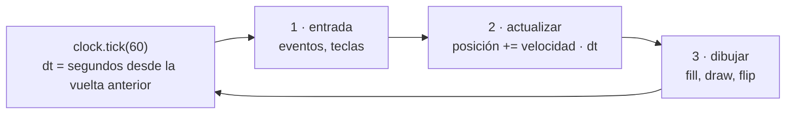

# 🎮 ed02 — Juegos como vehículo

> Python para desarrolladores Java senior · **Carta** · Track `ed` — Didáctica, divulgación y juguetes ·
> sección 2 de 5
> Se lee suelta: no hace falta ninguna otra sección de la carta.
> Versiones verificadas contra PyPI el 07/10/2026 · Código probado el 07/10/2026 con Python 3.14.7,
> en contenedor: las salidas son las de esa corrida.

---

## 🎯 1. Qué problema resuelve

Un juego es el programa más motivador que se le puede proponer a alguien que aprende, y además enseña un modelo que el desarrollador de servicios casi nunca ve: el
**bucle de juego**. No hay petición ni respuesta; hay un ciclo que se repite sesenta veces por segundo —leer la entrada, actualizar el mundo, dibujarlo— y un
tiempo que pasa entre una vuelta y la otra. Casi todos los errores de los juegos de principiante salen de ignorar ese tiempo, y el mismo error aparece después en
simulaciones, animaciones y cualquier sistema que avance "por pasos".

En Python, la biblioteca de siempre es **pygame**… que ya no instala en Python 3.14: `pygame` 2.6.1 es de septiembre de 2024 (💤), no tiene rueda para 3.14 y su
compilación desde el código fuente falla (comprobado en la preparación de esta sección). El proyecto activo es **`pygame-ce`** (*community edition*), la bifurcación
que mantiene la comunidad desde 2023, con la misma API y el mismo `import pygame`. **`arcade`** 3.3.3 es la alternativa moderna, sobre OpenGL con `pyglet`.

La sección escribe un juego de cuarenta líneas —atrapar la pelota— que se puede jugar o dejar que juegue solo, y mide lo que enseña el bucle: qué pasa con el mismo
movimiento a 30, 60 y 144 cuadros por segundo.

---

## 🧠 2. El modelo



| Forma de avanzar | Código | Lo que pasa a 144 cuadros/s |
|---|---|---|
| Por cuadro | `x += 5` | El juego va casi cinco veces más rápido que a 30 |
| Por segundo | `x += 300 * dt` | Igual a cualquier tasa, si la física es lineal |
| Paso fijo | La física avanza de a 1/120 s, con un acumulador | Igual a cualquier tasa, y reproducible |

### 🩻 Esto sí funciona igual

El bucle de juego es un bucle de eventos con un temporizador, como el de Swing (`javax.swing.Timer` disparando `repaint()`) o el `AnimationTimer` de JavaFX, que
también entrega el tiempo transcurrido en cada cuadro. Quien hizo animaciones en Java ya se encontró con el `dt`.

---

## 💻 3. El ejemplo que corre

```bash
uv add pygame-ce==2.5.8
```

`bucle.py` simula dos segundos de movimiento sin abrir ninguna ventana:

```python
"""El bucle de juego como modelo: mover por cuadro, por segundo, o con paso fijo; la misma partida a 30, 60 y 144 cuadros/s."""

SECONDS = 2.0


def per_frame(fps):
    """5 píxeles por cuadro: el error clásico. Más cuadros, más rápido."""
    x = 0.0
    for _ in range(int(SECONDS * fps)):
        x += 5
    return x


def per_second(fps):
    """300 px/s por dt: la misma distancia a cualquier tasa, mientras la física sea lineal."""
    x, dt = 0.0, 1 / fps
    for _ in range(int(SECONDS * fps)):
        x += 300 * dt
    return x


def falling(fps, fixed=None):
    """Una caída con gravedad (no lineal): con dt variable, el resultado depende de la tasa; con paso fijo, no."""
    y = v = 0.0
    if fixed is None:
        dt = 1 / fps
        for _ in range(int(SECONDS * fps)):
            y += v * dt                               # Euler explícito: primero la posición, después la velocidad
            v += 980 * dt
        return y
    accumulator, steps = 0.0, 0
    for _ in range(int(SECONDS * fps)):               # el bucle de "Fix Your Timestep": la física corre a su propio ritmo
        accumulator += 1 / fps
        while accumulator >= fixed - 1e-12:
            y += v * fixed
            v += 980 * fixed
            accumulator -= fixed
            steps += 1
    return y


print(f"{'cuadros/s':>10} {'por cuadro':>11} {'por segundo':>12} {'caída, dt variable':>19} {'caída, paso fijo 1/120':>23}")
for fps in (30, 60, 144):
    print(f"{fps:>10} {per_frame(fps):>9.0f} px {per_second(fps):>10.1f} px {falling(fps):>17.1f} px {falling(fps, 1 / 120):>21.1f} px")
print(f"caída exacta en {SECONDS:.0f} s: {0.5 * 980 * SECONDS ** 2:.1f} px")
```

```bash
uv run bucle.py
```

Salida (Python 3.14.7, 07/10/2026):

```text
 cuadros/s  por cuadro  por segundo  caída, dt variable  caída, paso fijo 1/120
        30       300 px      600.0 px            1927.3 px                1951.8 px
        60       600 px      600.0 px            1943.7 px                1951.8 px
       144      1440 px      600.0 px            1953.2 px                1951.8 px
caída exacta en 2 s: 1960.0 px
```

`juego.py` es el juego; se juega con las flechas, o con `--auto` juega solo:

```python
"""Un juego de cuarenta líneas: atrapar la pelota. Con --auto juega solo, sin teclado ni pantalla, para probarlo."""

import random
import sys

import pygame

AUTO = "--auto" in sys.argv
pygame.init()
screen = pygame.display.set_mode((480, 640))
clock = pygame.time.Clock()
paddle = pygame.Rect(200, 600, 80, 12)
ball, speed, score, missed = pygame.Vector2(240, 0), 220.0, 0, 0
random.seed(3)

frames = 0
while missed < 3 and frames < 1800:                   # tres pelotas perdidas, o 30 s a 60 cuadros/s
    dt = clock.tick(60) / 1000                        # segundos desde el cuadro anterior
    for event in pygame.event.get():                  # 1. entrada
        if event.type == pygame.QUIT:
            missed = 3
    keys = pygame.key.get_pressed()
    direction = (keys[pygame.K_RIGHT] - keys[pygame.K_LEFT]) if not AUTO else (ball.x > paddle.centerx) - (ball.x < paddle.centerx)
    paddle.x = max(0, min(400, paddle.x + direction * 360 * dt))
    ball.y += speed * dt                              # 2. actualizar: todo se mueve por segundo, no por cuadro
    if paddle.collidepoint(ball):
        score, speed, ball = score + 1, speed * 1.08, pygame.Vector2(random.randint(20, 460), 0)
    elif ball.y > 640:
        missed, ball = missed + 1, pygame.Vector2(random.randint(20, 460), 0)
    screen.fill("black")                              # 3. dibujar
    pygame.draw.rect(screen, "white", paddle)
    pygame.draw.circle(screen, "orange", ball, 8)
    pygame.display.flip()
    frames += 1

print(f"puntos {score} · perdidas {missed} · {frames} cuadros · {clock.get_fps():.0f} cuadros/s · velocidad final {speed:.0f} px/s")
pygame.quit()
```

```bash
uv run juego.py            # con teclado
uv run juego.py --auto     # solo; sin pantalla: SDL_VIDEODRIVER=dummy uv run juego.py --auto
```

Salida (Python 3.14.7, 07/10/2026) (una corrida en contenedor, con el controlador de vídeo `dummy` de SDL):

```text
pygame-ce 2.5.8 (SDL 2.32.10, Python 3.14.7)
puntos 15 · perdidas 3 · 1353 cuadros · 49 cuadros/s · velocidad final 698 px/s
```

Lo que dicen los números:

- **Por cuadro, la misma partida recorre 300, 600 o 1.440 píxeles** según la tasa: en el monitor de 144 Hz del alumno, el juego va casi cinco veces más rápido que en
  el portátil del profesor. Es el error número uno de los juegos de principiante.
- **Por segundo, los 600 píxeles se mantienen** a cualquier tasa, porque el movimiento es lineal.
- **Con gravedad, `dt` variable ya no alcanza**: la caída en dos segundos da 1.927, 1.944 o 1.953 píxeles según la tasa (la exacta es 1.960). El método de Euler
  acumula un error que depende del tamaño del paso. **Con paso fijo de 1/120, da 1.951,8 a cualquier tasa**: el error sigue ahí, pero es siempre el mismo.
- **El juego, con la misma semilla, no da siempre el mismo puntaje**: en esta corrida 15 puntos; en otra corrida del mismo código, 21. El `dt` sale del reloj real y
  cambia de una vuelta a otra, así que dos partidas con las mismas entradas no son iguales. Es la razón práctica del paso fijo: hace que una partida se pueda repetir
  (y probar).
- **49 cuadros/s** pidiendo 60: con el controlador `dummy` y en un contenedor, el reloj de SDL no llega. `clock.get_fps()` es la medición; `tick(60)` es solo el techo.

**Detalles con intención**

- **`pygame-ce`, no `pygame`**: el paquete se llama distinto y se importa igual. Instalar los dos a la vez rompe el `import`; en un proyecto viejo, se desinstala
  `pygame` antes.
- **La línea `pygame-ce 2.5.8 (SDL …)`** la imprime el propio `pygame` al importarse; `PYGAME_HIDE_SUPPORT_PROMPT=1` la apaga.
- **`--auto`** mueve la paleta hacia la pelota: así el juego se prueba sin teclado, y el alumno ve que "la inteligencia artificial" de un juego simple es un `if`.
- **`speed * 1.08`** por cada atrapada: la dificultad sube sola, que es lo que hace que un juego de cuarenta líneas tenga un final.

---

## ⚠️ 4. Lo que se rompe

**Mover por cuadro.** El ejemplo lo mide. Todo lo que se mueve se multiplica por `dt`, desde la primera clase.

**La física con `dt` variable.** Para movimiento lineal alcanza; con aceleración, rebotes o colisiones, el resultado depende de la tasa y, si un cuadro tarda mucho
(el antivirus, una carga), el objeto atraviesa la pared en un solo paso. El paso fijo con acumulador resuelve las dos cosas.

**El bucle sin `tick`.** Sin `clock.tick`, el bucle corre tan rápido como puede: 100 % de un núcleo de CPU para dibujar el mismo cuadro miles de veces por segundo.

**`pygame` en Python 3.14.** `pip install pygame` intenta compilar y falla. El síntoma en clase es media hora de errores de compilación en la máquina de cada alumno; la
solución es `pygame-ce` desde el principio.

---

## ⚖️ 5. Cuándo NO usarla

**Para un juego que se va a publicar.** Godot, Unity o un motor web dan editor, física, exportación a móviles y tiendas. `pygame-ce` es para aprender y para
prototipos; `arcade` llega un poco más lejos, pero ninguno es un motor comercial.

**Para enseñar a alguien que no tiene tiempo para el bucle.** Un juego obliga a entender estado, tiempo y eventos a la vez. Para una primera hora, `turtle` (ed01) o un
notebook (ed03) tienen menos piezas.

**Para el trabajo del lector.** Ningún proyecto de servicios necesita `pygame`. El modelo del bucle sí sirve —simulaciones, animaciones, robots—, y por eso la sección
mide el `dt` y no los sprites.

---

## 🧪 6. Ejercicios (10)

**🟢 Fácil (1–3)**

1. Corre `bucle.py` y juega `juego.py` con el teclado. **Criterio:** la tabla, y tu puntaje en tres partidas.
2. Cambia `x += 300 * dt` por `x += 5` en la paleta del juego y juega con `tick(30)` y `tick(144)`. **Criterio:** la paleta va a velocidades distintas, y lo explicas
   con la tabla.
3. Agrega un marcador en pantalla con `pygame.font`. **Criterio:** el puntaje y las vidas se ven mientras se juega.

**🟡 Intermedio (4–6)**

4. Cambia el integrador de la caída a Euler semiimplícito (primero la velocidad, después la posición). **Criterio:** la tabla nueva, y cuál se acerca más a 1.960.
5. Pasa el juego a paso fijo de 1/120 s con acumulador. **Criterio:** con `--auto` y la misma semilla, tres corridas dan el mismo puntaje.
6. Escribe el mismo juego en `arcade` 3.3.3. **Criterio:** los dos juegos se comportan igual, y la lista de lo que cambió en el código.

**🟠 Difícil (7–9)**

7. Haz que la pelota rebote en las paredes y busca la velocidad a la que atraviesa la paleta con `dt` variable. **Criterio:** la velocidad en la que falla, y que con
   paso fijo (o detección continua) no falla.
8. Graba las entradas de una partida y reprodúcela. **Criterio:** con paso fijo, la reproducción termina con el mismo puntaje que la partida original.
9. Escribe pruebas con `pytest` para la lógica del juego sin abrir ventana (separando la actualización del dibujo). **Criterio:** una prueba que atrapa la pelota y otra
   que la pierde, sin `pygame.display`.

**🔴 Muy difícil (10)**

10. Prepara un taller de tres horas de "tu primer juego" para adolescentes. **Criterio:** el material y la prueba en las máquinas del aula. *Rúbrica:* (a) la
    instalación probada (`pygame-ce`, sin compilar); (b) la progresión de un rectángulo que se mueve hasta un juego con puntaje; (c) el momento en que se enseña `dt`
    y cómo se muestra el error; (d) qué hace el alumno que termina antes.

---

## 📚 7. Referencias

**Documentación oficial**

- `pygame-ce`: https://pyga.me/docs/
- `pygame-ce` en GitHub (por qué existe la bifurcación): https://github.com/pygame-community/pygame-ce
- `arcade` (su documentación en api.arcade.academy rechazó al verificador con 429): https://github.com/pythonarcade/arcade

**Artículos**

- Glenn Fiedler, *Fix Your Timestep!* (2004), el artículo del paso fijo con acumulador: https://gafferongames.com/post/fix_your_timestep/
- Robert Nystrom, *Game Programming Patterns*, el capítulo del bucle de juego (libre en línea): https://gameprogrammingpatterns.com/game-loop.html

**Orden de lectura sugerido:** el capítulo de Nystrom (el modelo); el artículo de Fiedler (el paso fijo); la documentación de `pygame-ce` como consulta.

---

## 🚀 8. Cierre

Un juego enseña el bucle: entrada, actualización, dibujo, y un `dt` entre vuelta y vuelta. Mover por cuadro hace que el juego vaya casi cinco veces más rápido a 144
cuadros/s; mover por segundo lo arregla para el movimiento lineal; con gravedad, solo el paso fijo da el mismo resultado a cualquier tasa y hace que una partida se
pueda repetir. Y en Python 3.14, el paquete es `pygame-ce`.

**La señal de que quedó bien:** *"Mi juego va igual en cualquier monitor, la misma partida da el mismo resultado, y la instalación de la clase no compila nada."*

> 🏷️ **Cierra la sección con su tag**, cuando los ejercicios que elegiste estén hechos:
>
> ```bash
> git tag -a op-ed-fase-02 -m "op ed02 cerrada: el bucle de juego medido a tres tasas, y el paso fijo"
> ```
>
> Los commits llevan su prefijo (`op ed02: …`) y los de ejercicio su número
> (`op ed02 ej07: …`).
