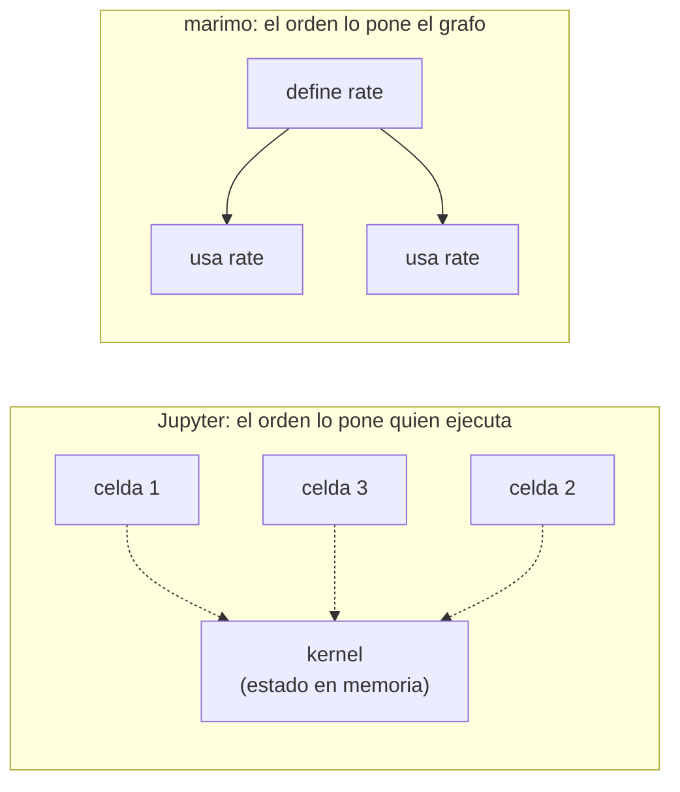

# 📓 ed03 — Notebooks para explicar

> Python para desarrolladores Java senior · **Carta** · Track `ed` — Didáctica, divulgación y juguetes ·
> sección 3 de 5
> Se lee suelta: no hace falta ninguna otra sección de la carta. El track de datos usa notebooks para
> explorar ([Fase ds06](ds06-notebooks-y-reproducibilidad.md)); esta sección los usa para explicar.
> Versiones verificadas contra PyPI el 07/10/2026 · Código probado el 07/10/2026 con Python 3.14.7,
> en contenedor: las salidas son las de esa corrida.

---

## 🎯 1. Qué problema resuelve

Un notebook es el mejor formato que existe para explicar algo con código: el texto, el código y su resultado van juntos, en el orden en que se cuenta la historia, y
el lector puede cambiar un número y volver a correr. Por eso es el formato de los tutoriales, las clases y las charlas técnicas. Y tiene un defecto que lo vuelve
peligroso justamente para explicar: **lo que se ve guardado no es necesariamente lo que el código, leído de arriba abajo, produce**. Las celdas se corren en
cualquier orden, el estado vive en la memoria del *kernel*, y una celda borrada puede haber dejado una variable que las demás siguen usando.

Para quien explica, eso significa publicar un resultado que el lector no va a poder reproducir. La sección fabrica ese notebook —un cálculo de IVA corrido en el
orden equivocado y con una variable huérfana—, lo detecta sin correrlo, lo reejecuta como lo haría el lector con **nbclient**, lo convierte a texto con **jupytext**,
y lo reescribe en **marimo**, el notebook reactivo que no permite ese estado.

**ipywidgets** completa la caja de herramientas de quien explica: un control deslizante en vez de un número que el lector tiene que editar. Aparece en los ejercicios.

---

## 🧠 2. El modelo



| | Jupyter (`.ipynb`) | marimo (`.py`) |
|---|---|---|
| Qué decide el orden | Quien hace clic | Las dependencias entre celdas (quién define y quién usa cada nombre) |
| Una variable definida en dos celdas | Gana la última que se corrió | Error: `multiple-definitions` |
| Borrar una celda | La variable sigue viva hasta reiniciar | Desaparece, y lo que la usaba se marca |
| El archivo | JSON con salidas adentro | Python puro, sin salidas |
| Ver un cambio en un diff | Ilegible (JSON, salidas, imágenes en base64) | Un diff de Python |

---

## 💻 3. El ejemplo que corre

```bash
uv add nbformat==5.11.1 nbclient==0.11.0 ipykernel==7.4.0 jupytext==1.19.6 marimo==0.25.1
```

`estado_oculto.py`:

```python
"""El estado oculto de un notebook: se fabrica, se detecta, se reejecuta de arriba abajo, y se compara con marimo."""

import re
import subprocess

import jupytext
import nbformat
from nbclient import NotebookClient
from nbclient.exceptions import CellExecutionError

# 1. Un notebook "explicativo" tal como quedó guardado: el autor corrió la celda 3 y después volvió a correr la 2
nb = nbformat.v4.new_notebook()
cells = [
    ("price = 100_000\nrate = 0.19", 1, None),
    ("total = price * (1 + rate)\ntotal", 4, "116000.0"),
    ("rate = 0.16   # la tarifa nueva, que el autor probó y después borró del texto", 3, None),
    ("print(f'El total con IVA es {total:,.0f}')", 5, "El total con IVA es 116,000\n"),
    ("discount", 2, "5000"),                          # su definición estaba en una celda que ya no existe
]
for source, count, output in cells:
    cell = nbformat.v4.new_code_cell(source, execution_count=count)
    if output and output.endswith("\n"):
        cell.outputs = [nbformat.v4.new_output("stream", name="stdout", text=output)]
    elif output:
        cell.outputs = [nbformat.v4.new_output("execute_result", data={"text/plain": output}, execution_count=count)]
    nb.cells.append(cell)
nbformat.write(nb, "explicacion.ipynb")

# 2. Detectarlo sin correr nada: el orden de ejecución guardado no es el orden de lectura
counts = [c.execution_count for c in nb.cells]
print("orden de ejecución guardado:", counts, "→", "en orden" if counts == sorted(counts) else "FUERA DE ORDEN")

# 3. Reiniciar y correr todo de arriba abajo, como lo haría el lector
fresh = nbformat.read("explicacion.ipynb", as_version=4)
try:
    NotebookClient(fresh, timeout=60, kernel_name="python3").execute()
except CellExecutionError as error:
    last_line = str(error).strip().splitlines()[-1]
    print("de arriba abajo:", re.sub(r"\x1b\[[0-9;]*m", "", last_line))   # sin los colores ANSI de IPython
for i in (1, 3):
    stored = "".join(o.get("text", "") or o.get("data", {}).get("text/plain", "") for o in nb.cells[i].outputs).strip()
    rerun = "".join(o.get("text", "") or o.get("data", {}).get("text/plain", "") for o in fresh.cells[i].outputs).strip()
    print(f"celda {i + 1}: guardada {stored!r} · reejecutada {rerun!r}")

# 4. El mismo notebook como texto: jupytext lo convierte en un .py que se lee en un diff
jupytext.write(nb, "explicacion.py", fmt="py:percent")
text = open("explicacion.py", encoding="utf-8").read()
print(f"\njupytext: {len(text.splitlines())} líneas de texto · celdas marcadas con '# %%': {text.count('# %%')}")

# 5. La misma lógica en marimo: un nombre solo puede definirse en una celda
with open("explicacion_marimo.py", "w", encoding="utf-8") as f:
    f.write('''import marimo

app = marimo.App()


@app.cell
def _():
    price = 100_000
    rate = 0.19
    return price, rate


@app.cell
def _(price, rate):
    total = price * (1 + rate)
    return (total,)


@app.cell
def _():
    rate = 0.16
    return (rate,)


if __name__ == "__main__":
    app.run()
''')
result = subprocess.run(["python", "explicacion_marimo.py"], capture_output=True, text=True)
last = (result.stderr or result.stdout).strip().splitlines()
print("marimo:", next((line for line in last if "rate" in line), last[-1] if last else "(sin salida)"))
```

```bash
uv run estado_oculto.py
```

Salida (Python 3.14.7, 07/10/2026) (por la salida de error, `ipykernel` 7.4.0 avisa además `Kernel is running over TCP without encryption`, que es lo normal para un kernel
local que lanza `nbclient`):

```text
orden de ejecución guardado: [1, 4, 3, 5, 2] → FUERA DE ORDEN
de arriba abajo: NameError: name 'discount' is not defined
celda 2: guardada '116000.0' · reejecutada '119000.0'
celda 4: guardada 'El total con IVA es 116,000' · reejecutada 'El total con IVA es 119,000'

jupytext: 26 líneas de texto · celdas marcadas con '# %%': 5
marimo: critical[multiple-definitions]: Variable 'rate' is defined in multiple cells
```

Lo que dicen los números:

- **El orden guardado es `[1, 4, 3, 5, 2]`**: el autor corrió la celda 5 antes que todas, y la 2 después de la 3. Eso se ve en el archivo sin ejecutar nada; es la
  primera revisión que se le hace a un notebook antes de publicarlo.
- **De arriba abajo, el notebook falla**: `discount` no está definido. La celda que lo definía se borró, y la variable seguía en la memoria del kernel del autor.
- **Las celdas que sí corren dan otro resultado**: el notebook guardado dice 116.000 (con la tarifa de 0,16 que el autor probó en la celda 3) y el de arriba abajo
  dice 119.000 (con la de 0,19 de la celda 1). El texto alrededor, que habla del 19 %, contradice el número que se ve.
- **jupytext lo deja en 26 líneas de Python** con cinco marcas `# %%`: el mismo contenido, sin salidas, legible en un diff y en una revisión de código.
- **marimo rechaza la misma lógica**: `Variable 'rate' is defined in multiple cells`. No deja guardar la ambigüedad que en Jupyter quedó escondida.

**Detalles con intención**

- **El notebook se arma con `nbformat`** con los `execution_count` y las salidas tal como quedarían después de la sesión desordenada; así el ejemplo es reproducible
  sin simular clics.
- **`NotebookClient(...).execute()`** es exactamente "reiniciar el kernel y correr todo": un kernel nuevo, las celdas en orden. Es la prueba que se pone en el CI de
  cualquier repositorio de notebooks.
- **El error se limpia de colores ANSI**: IPython colorea el *traceback*, y los códigos de escape ensucian cualquier registro.
- **El archivo de marimo es Python puro**: cada celda es una función que declara lo que usa (parámetros) y lo que define (lo que devuelve). El grafo sale de ahí.

---

## ⚠️ 4. Lo que se rompe

**Publicar sin reiniciar.** "Restart & Run All" antes de compartir es la regla, y casi nadie la sigue a mano. Se automatiza: `nbclient` (o `jupyter nbconvert
--execute`) en el CI, y el notebook que no corre de arriba abajo no se publica.

**Las salidas en el control de versiones.** Un `.ipynb` con salidas convierte cada ejecución en un diff de cientos de líneas, y puede llevar datos que no deberían
viajar (una tabla con datos reales impresa en una celda). Se guarda sin salidas (`nbstripout`) o se versiona el `.py` de jupytext.

**El widget que no se ve.** `ipywidgets` necesita la extensión del frontend: en JupyterLab moderno viene incluida, pero en un visor estático (GitHub, nbviewer) el
control deslizante aparece como texto. Si el lector va a mirar en GitHub, el widget no existe.

**marimo con código que muta.** marimo sigue nombres, no mutaciones: `lista.append(x)` en otra celda no dispara la reejecución de quien usa `lista`. Para explicar, se
escribe sin mutar estado entre celdas, que de paso es mejor código.

---

## ⚖️ 5. Cuándo NO usarla

**Para el código que va a producción.** Un notebook explica; un módulo con pruebas se mantiene. El cálculo que nació en un notebook se mueve a un `.py` con sus
pruebas, y el notebook lo importa.

**Para una explicación que no necesita ejecutarse.** Si el lector no va a cambiar nada, un documento con bloques de código y sus salidas reales (como las secciones de
esta carta) es más simple de publicar y de mantener.

**Para alguien que no programa.** Un notebook muestra el código; si la audiencia no lo va a leer, una aplicación (marimo en modo `run`, o las herramientas de
[`ui01`](op064-ui01-el-modelo-y-su-costo.md)) muestra solo el resultado y los controles.

---

## 🧪 6. Ejercicios (10)

**🟢 Fácil (1–3)**

1. Corre el ejemplo y abre `explicacion.ipynb` en JupyterLab. **Criterio:** la salida completa, y en JupyterLab ves los números de ejecución desordenados.
2. Arregla el notebook (borra la celda 3, define `discount`) y vuelve a correr la verificación. **Criterio:** el orden queda `[1, 2, 3, 4]` y `nbclient` termina sin
   error.
3. Abre `explicacion_marimo.py` con `marimo edit`. **Criterio:** el editor marca las dos celdas que definen `rate`.

**🟡 Intermedio (4–6)**

4. Escribe un script que revise todos los notebooks de una carpeta y falle si alguno está fuera de orden o no corre de arriba abajo. **Criterio:** detecta
   `explicacion.ipynb` y deja pasar el arreglado.
5. Agrega un `IntSlider` de `ipywidgets` para la tarifa y muestra el total actualizado. **Criterio:** al mover el control, el total cambia sin reejecutar celdas.
6. Haz lo mismo en marimo con `mo.ui.slider`. **Criterio:** el total se actualiza solo, y explicas la diferencia con el ejercicio 5.

**🟠 Difícil (7–9)**

7. Configura `jupytext` para emparejar `.ipynb` y `.py` y un `pre-commit` con `nbstripout`. **Criterio:** un commit solo muestra cambios de código en el diff.
8. Convierte un notebook de Jupyter tuyo a marimo con `marimo convert`. **Criterio:** la lista de lo que marimo marcó (definiciones múltiples, mutaciones) y cómo lo
   resolviste.
9. Publica el notebook arreglado como página estática que se ejecuta en el navegador (JupyterLite o `marimo export html-wasm`). **Criterio:** se abre sin servidor y
   el control funciona.

**🔴 Muy difícil (10)**

10. Prepara una charla de 30 minutos con un notebook como material. **Criterio:** el notebook y su CI. *Rúbrica:* (a) corre de arriba abajo en un kernel nuevo, en
    el CI; (b) no tiene salidas en el repositorio o las regenera el CI; (c) tiene al menos un control para que el público cambie un parámetro; (d) tiene una versión
    estática para quien lo lea después.

---

## 📚 7. Referencias

**Documentación oficial**

- `nbclient`: https://nbclient.readthedocs.io/en/latest/
- jupytext: https://jupytext.readthedocs.io/en/latest/
- marimo, por qué un notebook reactivo: https://docs.marimo.io/faq/
- ipywidgets: https://ipywidgets.readthedocs.io/en/stable/

**Artículo y charla**

- Pimentel y otros, *A Large-Scale Study About Quality and Reproducibility of Jupyter Notebooks* (2019), copia de los autores: estudiaron 1,4 millones de
  notebooks de GitHub, y de los de Python que intentaron reproducir solo el 24,11 % corrió sin errores y el 4,03 % dio los mismos resultados:
  https://leomurta.github.io/papers/pimentel2019a.pdf
- Joel Grus, *I don't like notebooks* (JupyterCon 2018), las diapositivas: https://docs.google.com/presentation/d/1n2RlMdmv1p25Xy5thJUhkKGvjtV-dkAIsUXP-AL4ffI/

**Orden de lectura sugerido:** las diapositivas de Grus (la crítica, con humor); el estudio de Pimentel (los números); la página de preguntas de marimo (la respuesta de
diseño).

---

## 🚀 8. Cierre

Un notebook explica bien porque junta texto, código y resultado, y engaña porque el resultado guardado puede no salir del código leído en orden: el del ejemplo dice
116.000 y, de arriba abajo, da 119.000 y falla con una variable que ya no existe. El orden de ejecución se revisa sin correr nada, `nbclient` reinicia y corre todo, 
jupytext lo vuelve texto, y marimo no deja guardar la ambigüedad.

**La señal de que quedó bien:** *"Ningún notebook que publico tiene un resultado que no salga de correrlo de arriba abajo en un kernel nuevo, y eso lo comprueba el
CI, no yo."*

> 🏷️ **Cierra la sección con su tag**, cuando los ejercicios que elegiste estén hechos:
>
> ```bash
> git tag -a op-ed-fase-03 -m "op ed03 cerrada: el estado oculto fabricado, detectado y prohibido por marimo"
> ```
>
> Los commits llevan su prefijo (`op ed03: …`) y los de ejercicio su número
> (`op ed03 ej07: …`).
