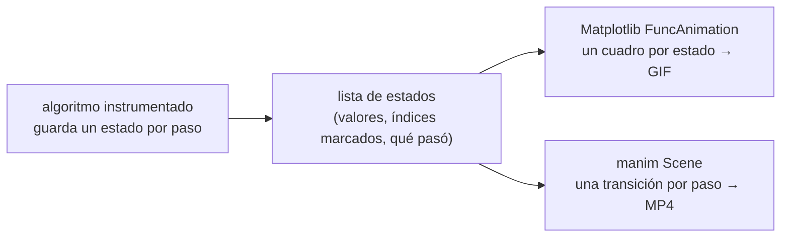

# 🎬 ed04 — Visualizar algoritmos

> Python para desarrolladores Java senior · **Carta** · Track `ed` — Didáctica, divulgación y juguetes ·
> sección 4 de 5
> Se lee suelta: no hace falta ninguna otra sección de la carta. Para Matplotlib como entregable,
> [`vz01`](op111-vz01-el-modelo-y-matplotlib.md).
> Versiones verificadas contra PyPI el 07/10/2026 · Código probado el 07/10/2026 con Python 3.14.7,
> en contenedor: las salidas son las de esa corrida.

---

## 🎯 1. Qué problema resuelve

Un algoritmo explicado en una pizarra es una lista de pasos; animado, es algo que se ve pasar. Las barras que se ordenan, el grafo que se recorre, la pila que crece
y se vacía: para quien aprende, la animación convierte un concepto abstracto en un movimiento que se puede seguir con los ojos. Por eso las mejores explicaciones de
algoritmos en internet son animaciones, desde los ordenamientos con sonido hasta los vídeos de 3Blue1Brown.

Hay dos caminos en Python. **Matplotlib** con `FuncAnimation` dibuja cuadro a cuadro un gráfico que ya sabes hacer y lo guarda como GIF o vídeo: es rápido de
escribir y sirve para cualquier algoritmo que se pueda pintar como barras o puntos. **manim**, la biblioteca de animación matemática que nació para los vídeos de
3Blue1Brown (y que mantiene su comunidad como `manim` 0.21.0), compone escenas con objetos que se mueven y se transforman con transiciones suaves: más trabajo, y el
resultado de una charla.

La sección anima burbuja y merge sort con Matplotlib, renderiza una escena corta con manim, y mide algo que toda animación de algoritmos esconde: **cuánto dura cada
historia depende de qué se decidió mostrar como un cuadro**.

---

## 🧠 2. El modelo



- **Separar el algoritmo del dibujo.** El algoritmo no sabe que lo están mirando: devuelve una lista de estados (los valores, los índices que tocó, qué hizo). El
  dibujo recorre esa lista. Así el mismo registro sirve para Matplotlib, para manim y para una prueba que verifica que el último estado está ordenado.
- **Qué es un cuadro es una decisión editorial.** Un cuadro por comparación, por intercambio o por escritura cuenta historias distintas del mismo algoritmo, y la
  duración del vídeo es lo primero que el público compara.

| | Matplotlib `FuncAnimation` | manim |
|---|---|---|
| Se instala con | `uv add matplotlib Pillow` | `uv add manim` **y** Cairo, Pango y FFmpeg del sistema |
| Modelo | Redibujar el gráfico en cada cuadro | Objetos y transiciones (`animate.move_to`, `Transform`) |
| Salida | GIF, MP4 (con FFmpeg) | MP4, GIF, imágenes |
| Para | Clases, documentación, depurar un algoritmo | Charlas y vídeos con calidad de producción |

---

## 💻 3. El ejemplo que corre

```bash
uv add matplotlib==3.11.2 Pillow==12.3.0
```

`animacion.py`:

```python
"""Visualizar algoritmos con matplotlib: grabar los estados de dos ordenamientos y animarlos; cuánto dura cada historia."""

import os
import random
import time

import matplotlib

matplotlib.use("Agg")                                 # sin ventana: la animación se escribe a un archivo
import matplotlib.pyplot as plt
from matplotlib.animation import FuncAnimation, PillowWriter


def bubble(values):
    """Devuelve los estados: uno por comparación, marcando los dos índices comparados."""
    a, states = list(values), []
    for end in range(len(a) - 1, 0, -1):
        for i in range(end):
            states.append((list(a), (i, i + 1), "compara"))
            if a[i] > a[i + 1]:
                a[i], a[i + 1] = a[i + 1], a[i]
                states.append((list(a), (i, i + 1), "intercambia"))
    return states


def merge_sort(values):
    """Merge sort de abajo arriba, guardando un estado por cada escritura en la lista."""
    a, states, width = list(values), [], 1
    while width < len(a):
        for lo in range(0, len(a), 2 * width):
            mid, hi = min(lo + width, len(a)), min(lo + 2 * width, len(a))
            merged, i, j = [], lo, mid
            while i < mid or j < hi:
                states.append((list(a), (i, j), "compara"))
                if j >= hi or (i < mid and a[i] <= a[j]):
                    merged.append(a[i]); i += 1
                else:
                    merged.append(a[j]); j += 1
            for k, v in enumerate(merged):
                a[lo + k] = v
                states.append((list(a), (lo + k, lo + k), "escribe"))
        width *= 2
    return states


def animate(states, filename, fps=30):
    fig, ax = plt.subplots(figsize=(4, 2.5), dpi=80)
    bars = ax.bar(range(len(states[0][0])), states[0][0], color="#9aa5b1")
    ax.set_xticks([]); ax.set_yticks([])

    def draw(frame):
        values, marked, _ = states[frame]
        for k, (bar, v) in enumerate(zip(bars, values)):
            bar.set_height(v)
            bar.set_color("#d64545" if k in marked else "#9aa5b1")
        return bars

    start = time.perf_counter()
    FuncAnimation(fig, draw, frames=len(states), blit=True).save(filename, writer=PillowWriter(fps=fps))
    plt.close(fig)
    return time.perf_counter() - start


random.seed(11)
data = random.sample(range(1, 31), 30)
print(f"{'algoritmo':<11} {'cuadros':>8} {'compara':>8} {'mueve':>6} {'duración a 30 c/s':>18} {'GIF':>8} {'render':>7}")
for name, states in (("burbuja", bubble(data)), ("merge sort", merge_sort(data))):
    assert states[-1][0] == sorted(data)
    filename = name.replace(" ", "_") + ".gif"
    seconds = animate(states, filename)
    compares = sum(1 for s in states if s[2] == "compara")
    print(f"{name:<11} {len(states):>8} {compares:>8} {len(states) - compares:>6} {len(states) / 30:>16.1f} s "
          f"{os.path.getsize(filename) / 1024:>5.0f} KB {seconds:>6.1f} s")
```

```bash
uv run animacion.py
```

Salida (Python 3.14.7, 07/10/2026):

```text
algoritmo    cuadros  compara  mueve  duración a 30 c/s      GIF  render
burbuja          690      435    255             23.0 s   248 KB    4.7 s
merge sort       300      150    150             10.0 s   125 KB    2.0 s
```

La escena de manim necesita las bibliotecas de Cairo y Pango y FFmpeg en el sistema: `pycairo` no publica ruedas para Linux, así que `uv add manim` lo compila.

```bash
sudo apt-get install -y libcairo2-dev libpango1.0-dev pkg-config ffmpeg     # en macOS: brew install cairo pango ffmpeg
uv add manim==0.21.0
```

`escena.py`:

```python
"""Una escena de manim: una lista de cinco números se ordena por burbuja, intercambio por intercambio."""

from manim import DOWN, LEFT, RIGHT, Scene, Square, Text, VGroup


class BubbleSort(Scene):
    def construct(self):
        values = [5, 2, 4, 1, 3]
        boxes = VGroup(*[VGroup(Square(side_length=1), Text(str(v))) for v in values]).arrange(RIGHT, buff=0.2)
        self.add(boxes)
        self.add(Text("burbuja", font_size=36).next_to(boxes, DOWN))
        items = list(boxes)
        for end in range(len(values) - 1, 0, -1):
            for i in range(end):
                if values[i] > values[i + 1]:
                    values[i], values[i + 1] = values[i + 1], values[i]
                    a, b = items[i], items[i + 1]
                    self.play(a.animate.move_to(b.get_center()), b.animate.move_to(a.get_center()), run_time=0.4)
                    items[i], items[i + 1] = b, a
        self.wait(0.5)
```

`render.sh`:

```bash
# Renderiza la escena en calidad baja y resume el resultado
manim -ql --disable_caching --progress_bar none escena.py BubbleSort > manim.log 2>&1
video=media/videos/escena/480p15/BubbleSort.mp4
echo "animaciones: $(grep -o 'Played [0-9]* animations' manim.log)"
echo "vídeo: $(du -k "$video" | cut -f1) KB · $(ffprobe -v error -show_entries format=duration -of csv=p=0 "$video") s · 854×480 a 15 c/s"
```

```bash
bash render.sh
```

Salida (Python 3.14.7, 07/10/2026) (en el contenedor de la prueba la instalación de manim, compilando `pycairo`, tardó 38 s):

```text
animaciones: Played 8 animations
vídeo: 44 KB · 3.266667 s · 854×480 a 15 c/s
render: 1 s
```

Lo que dicen los números:

- **Con treinta números, burbuja necesita 690 cuadros y merge sort 300**: 23 segundos contra 10 a 30 cuadros por segundo. El público ve que burbuja "tarda más", y es
  cierto, pero por una razón que la animación no dice: 435 comparaciones contra 150.
- **La columna "mueve" esconde una elección**: en burbuja se cuenta un intercambio (dos posiciones) y en merge sort una escritura (una posición). Son operaciones
  distintas dibujadas como el mismo cuadro; con otra elección, la proporción cambia (ed05 lo mide).
- **El GIF de burbuja pesa 248 KB y tarda 4,7 s en generarse**; el render es casi todo el costo, no el algoritmo.
- **La escena de manim tiene 8 animaciones** (7 intercambios, que son las 7 inversiones de `[5, 2, 4, 1, 3]`, y la espera final) y produce un vídeo de 3,3 segundos y
  44 KB en calidad baja (`-ql`: 854×480 a 15 cuadros/s) en un segundo de render.

**Detalles con intención**

- **`matplotlib.use("Agg")`** antes de importar `pyplot`: sin ventana, la animación se escribe a un archivo. En un notebook (ed03), `HTML(anim.to_jshtml())` la
  muestra en la celda.
- **`blit=True`** redibuja solo las barras que cambian: el render es más rápido, y la función tiene que devolver los artistas que tocó.
- **`assert states[-1][0] == sorted(data)`**: la visualización es también una prueba. Un algoritmo mal instrumentado se ve bien y termina desordenado.
- **`--disable_caching`** en manim: sin él, la segunda corrida reutiliza los fragmentos de la primera y el tiempo de render miente.

---

## ⚠️ 4. Lo que se rompe

**La animación que es más lenta que el algoritmo, y se presenta como si no.** Burbuja con 30 números corre en microsegundos; su animación dura 23 segundos. Si la
explicación no lo dice, el público sale creyendo que ordenar treinta números tarda.

**El cuadro como unidad de costo.** Comparar algoritmos por la duración de su animación es comparar decisiones de quien animó, no costos. La comparación de costo va con
números al lado (comparaciones, escrituras, y tiempo real medido).

**manim en la máquina del alumno.** Cairo, Pango, FFmpeg y un compilador: en una clase, la mitad de las máquinas falla en la instalación. Para enseñar, Matplotlib; manim
para quien prepara el vídeo.

**Animaciones largas en GIF.** Un GIF de mil cuadros pesa megas y no se puede pausar. Para más de unos segundos, MP4 (`FFMpegWriter` en Matplotlib) o una página con
controles (`to_jshtml`).

---

## ⚖️ 5. Cuándo NO usarla

**Para algoritmos que no tienen una forma natural.** Una tabla hash, un árbol B o un algoritmo de consenso se animan con mucho trabajo y poca claridad; un diagrama
estático con tres estados clave suele explicar más.

**Cuando el público ya conoce el algoritmo.** Para un equipo senior, la animación de un ordenamiento es entretenimiento; lo que se discute son costos y casos borde, y
eso va con números.

**Cuando el objetivo es depurar.** Para encontrar un error en un algoritmo, los estados guardados y una prueba que los recorra son más rápidos que mirar un GIF. La
animación es para explicar, no para buscar.

---

## 🧪 6. Ejercicios (10)

**🟢 Fácil (1–3)**

1. Corre `animacion.py` y abre los dos GIF. **Criterio:** la tabla, y señalas en el de burbuja el momento en que el número más grande llega al final.
2. Cambia la semilla y el tamaño a 50 números. **Criterio:** la tabla nueva, y la razón de cuadros entre burbuja y merge sort contra la de 30.
3. Guarda la animación de merge sort como MP4 con `FFMpegWriter`. **Criterio:** el MP4 pesa menos que el GIF.

**🟡 Intermedio (4–6)**

4. Instrumenta inserción y anímala. **Criterio:** con una lista casi ordenada, inserción tiene menos cuadros que merge sort; con una al revés, muchos más.
5. Anima un recorrido en anchura (BFS) sobre una grilla de 10×10 con `networkx`, coloreando los nodos por distancia. **Criterio:** el GIF muestra el frente que avanza
   y el último cuadro tiene todas las distancias.
6. Agrega a la escena de manim un contador de intercambios que se actualiza. **Criterio:** el vídeo termina mostrando 7.

**🟠 Difícil (7–9)**

7. Haz que la animación de Matplotlib dure lo mismo para los dos algoritmos (10 s), saltando cuadros. **Criterio:** los dos GIF duran 10 s, y una frase sobre qué se
   pierde.
8. Escribe una escena de manim que explique merge sort mostrando las mitades. **Criterio:** se ven las divisiones y las mezclas, con menos de 40 animaciones para ocho
   números.
9. Muestra la animación en un notebook de marimo con un control para elegir algoritmo y tamaño. **Criterio:** al cambiar el control, se regenera la animación.

**🔴 Muy difícil (10)**

10. Prepara un vídeo de cinco minutos que explique por qué merge sort es O(n log n). **Criterio:** el vídeo y su código. *Rúbrica:* (a) la animación muestra el árbol
    de divisiones; (b) las cifras de comparaciones van en pantalla y coinciden con las medidas; (c) se dice explícitamente qué es un cuadro; (d) se renderiza desde
    cero con un solo comando.

---

## 📚 7. Referencias

**Documentación oficial**

- Matplotlib, animaciones: https://matplotlib.org/stable/users/explain/animations/animations.html
- manim (la edición de la comunidad), instalación y tutorial: https://docs.manim.community/en/stable/
- manim, las dependencias del sistema en Linux: https://docs.manim.community/en/stable/installation/uv.html

**Inspiración**

- 3Blue1Brown, el canal para el que nació manim: https://www.3blue1brown.com/
- VisuAlgo, visualizaciones de algoritmos y estructuras de datos de la Universidad Nacional de Singapur: https://visualgo.net/en

**Orden de lectura sugerido:** la página de animaciones de Matplotlib; VisuAlgo, para ver qué decisiones toma una buena visualización; manim cuando haya una charla
que preparar.

---

## 🚀 8. Cierre

Visualizar un algoritmo es instrumentarlo para que devuelva sus estados y dibujar esos estados: Matplotlib lo hace en un GIF con lo que ya sabes, manim lo hace con
calidad de vídeo a cambio de Cairo, Pango y FFmpeg en el sistema. Y la duración de la animación mide decisiones de quien animó: 690 cuadros contra 300 dicen menos
que 435 comparaciones contra 150.

**La señal de que quedó bien:** *"Mis animaciones vienen de una lista de estados que una prueba verifica, y siempre muestran al lado los números que la animación no
puede mostrar."*

> 🏷️ **Cierra la sección con su tag**, cuando los ejercicios que elegiste estén hechos:
>
> ```bash
> git tag -a op-ed-fase-04 -m "op ed04 cerrada: dos ordenamientos animados, una escena de manim y lo que cuenta cada cuadro"
> ```
>
> Los commits llevan su prefijo (`op ed04: …`) y los de ejercicio su número
> (`op ed04 ej07: …`).
