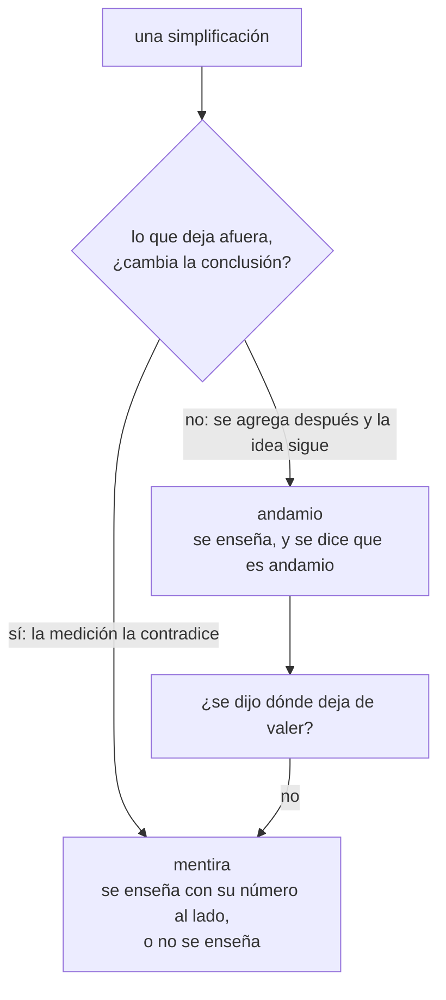

# ⚖️ ed05 — Veredicto: cuándo simplificar ayuda y cuándo miente

> Python para desarrolladores Java senior · **Carta** · Track `ed` — Didáctica, divulgación y juguetes ·
> sección 5 de 5
> Se lee suelta: no hace falta ninguna otra sección de la carta. Recoge lo medido en
> [`ed01`](op172-ed01-turtle.md)–[`ed04`](op175-ed04-visualizar-algoritmos.md).
> Versiones verificadas contra PyPI el 07/10/2026 · Código probado el 07/10/2026 con Python 3.14.7,
> en contenedor: las salidas son las de esa corrida.

---

## 🎯 1. Qué problema resuelve

Enseñar es simplificar, y toda simplificación deja algo afuera. La tortuga de ed01 dibuja sin hablar de píxeles, el juego de ed02 se mueve sin hablar de
integradores, el notebook de ed03 muestra un resultado sin decir en qué orden se corrió, la animación de ed04 cuenta pasos sin decir cuánto tarda cada uno. La
pregunta del veredicto no es si simplificar —sin simplificar no se enseña nada— sino **cuál simplificación es un andamio que después se quita y cuál es una mentira
que después hay que desaprender**.

El criterio que propone la sección es operativo: **una simplificación ayuda si lo que deja afuera se puede agregar después sin contradecir lo enseñado; miente si lo
que deja afuera da vuelta la conclusión.** "La tortuga vuelve al inicio" es andamio: después se agrega el punto flotante y la idea sigue en pie. "El algoritmo con
menos pasos es el más rápido" es mentira: la medición la da vuelta.

El ejemplo mide esa segunda frase. Cuatro ordenamientos —burbuja, inserción, merge sort escrito en Python y `sorted()`— sobre listas al azar y casi ordenadas, de 30 y
de 2.000 elementos, contando los pasos que una clase contaría y midiendo el tiempo que de verdad tardan.

---

## 🧠 2. El modelo



| Lo que el track simplificó | Lo que deja afuera | Veredicto |
|---|---|---|
| ed01 · "la tortuga vuelve al inicio" | Punto flotante: queda a 10⁻¹² | **Andamio**, y la excusa perfecta para enseñar el punto flotante |
| ed02 · "mover 5 píxeles por cuadro" | El tiempo: a 144 cuadros/s va casi cinco veces más rápido | **Mentira** si no se corrige en la misma clase; se enseña `dt` desde el principio |
| ed02 · "mover por segundo, con `dt`" | La física no lineal y la reproducibilidad | **Andamio**: el paso fijo se agrega sin contradecirlo |
| ed03 · el notebook como explicación | El orden real de ejecución | **Mentira** si no corre de arriba abajo; andamio si el CI lo garantiza |
| ed04 · "el algoritmo con más cuadros es más lento" | El costo de cada paso, y quién decidió qué es un cuadro | **Mentira** sin los números al lado (abajo) |

---

## 💻 3. El ejemplo que corre

Nada que instalar: biblioteca estándar.

`simplificar.py`:

```python
"""Lo que una explicación simplificada cuenta y lo que pasa de verdad: pasos contados contra tiempo medido."""

import random
import timeit


def bubble(a):
    a, steps = list(a), 0
    for end in range(len(a) - 1, 0, -1):
        swapped = False
        for i in range(end):
            steps += 1
            if a[i] > a[i + 1]:
                a[i], a[i + 1], swapped = a[i + 1], a[i], True
        if not swapped:                               # la versión "buena" de burbuja: para si ya está ordenada
            break
    return a, steps


def insertion(a):
    a, steps = list(a), 0
    for k in range(1, len(a)):
        v, i = a[k], k - 1
        while i >= 0:
            steps += 1
            if a[i] <= v:
                break
            a[i + 1] = a[i]
            i -= 1
        a[i + 1] = v
    return a, steps


def merge(a):
    steps = 0

    def sort(xs):
        nonlocal steps
        if len(xs) <= 1:
            return xs
        left, right = sort(xs[: len(xs) // 2]), sort(xs[len(xs) // 2:])
        out, i, j = [], 0, 0
        while i < len(left) and j < len(right):
            steps += 1
            if left[i] <= right[j]:
                out.append(left[i]); i += 1
            else:
                out.append(right[j]); j += 1
        return out + left[i:] + right[j:]

    return sort(list(a)), steps


def builtin(a):
    return sorted(a), None                            # Timsort, en C: nadie cuenta sus pasos en la clase


random.seed(2)
cases = {}
for n in (30, 2000):
    shuffled = random.sample(range(n), n)
    nearly = sorted(shuffled)
    for _ in range(n // 50 + 1):                      # casi ordenada: unos pocos pares fuera de lugar
        i = random.randrange(n - 1)
        nearly[i], nearly[i + 1] = nearly[i + 1], nearly[i]
    cases[(n, "al azar")], cases[(n, "casi ordenada")] = shuffled, nearly

print(f"{'n':>5} {'lista':<14} {'algoritmo':<10} {'pasos':>9} {'tiempo':>12}")
for (n, kind), data in cases.items():
    for name, fn in (("burbuja", bubble), ("inserción", insertion), ("merge", merge), ("sorted()", builtin)):
        result, steps = fn(data)
        assert result == sorted(data)
        runs = 2000 if n == 30 else 3
        us = timeit.timeit(lambda: fn(data), number=runs) / runs * 1e6
        print(f"{n:>5} {kind:<14} {name:<10} {steps if steps is not None else '—':>9} {us:>10.1f} µs")
```

```bash
python3 simplificar.py
```

Salida (Python 3.14.7, 07/10/2026) (microsegundos de una corrida en contenedor; la columna de pasos es exacta):

```text
    n lista          algoritmo      pasos       tiempo
   30 al azar        burbuja          432       23.7 µs
   30 al azar        inserción        259       10.5 µs
   30 al azar        merge            111       21.4 µs
   30 al azar        sorted()           —        0.6 µs
   30 casi ordenada  burbuja           57        1.7 µs
   30 casi ordenada  inserción         30        1.5 µs
   30 casi ordenada  merge             72       16.8 µs
   30 casi ordenada  sorted()           —        0.3 µs
 2000 al azar        burbuja      1997515   119800.2 µs
 2000 al azar        inserción    1031898    49734.5 µs
 2000 al azar        merge          19403     2377.9 µs
 2000 al azar        sorted()           —      150.4 µs
 2000 casi ordenada  burbuja         5994      234.5 µs
 2000 casi ordenada  inserción       2038      122.5 µs
 2000 casi ordenada  merge          10889     1570.7 µs
 2000 casi ordenada  sorted()           —       11.9 µs
```

Lo que dicen los números:

- **Con 30 elementos, todo tarda menos de 25 microsegundos.** La animación de ed04 dura 23 segundos; el algoritmo, una millonésima parte de eso. Con listas de clase,
  ningún algoritmo es lento, y decir que burbuja "tarda" es hablar de la animación.
- **Menos pasos no es menos tiempo.** Con 30 elementos al azar, merge sort hace 111 pasos e inserción 259, y aun así **inserción es dos veces más rápida** (10,5 contra
  21,4 µs): cada paso de merge sort crea listas y llama funciones. Es la razón por la que Timsort, el algoritmo de `sorted()`, ordena los tramos cortos por inserción.
- **El mismo O(n log n) no es el mismo tiempo**: con 2.000 al azar, merge sort en Python tarda 2.378 µs y `sorted()` 150, dieciséis veces menos. La complejidad dice
  cómo crece; la constante —Python contra C— decide cuánto tarda.
- **Con la lista casi ordenada, la conclusión se da vuelta**: burbuja (con su corte temprano) e inserción hacen 5.994 y 2.038 pasos contra 10.889 de merge sort, y son
  siete y trece veces más rápidas. "Burbuja es el peor algoritmo" es otra simplificación que miente en el caso que más aparece en la vida real: datos casi en orden.
- **`sorted()` gana en las cuatro filas por un orden de magnitud o más**, y no tiene pasos contados porque nadie lo anima. Lo que la clase de algoritmos no muestra es
  lo que el lector va a usar.

**Detalles con intención**

- **"Pasos" son comparaciones**, la unidad que una clase cuenta en la pizarra. Con escrituras o intercambios la tabla sería otra: la elección es parte de la
  simplificación, y se dice.
- **Burbuja con `swapped`**: la versión de la pizarra no para nunca; esta para cuando una pasada no intercambia nada, y por eso le va bien con la lista casi ordenada.
  Comparar contra la versión mala de un algoritmo es otra forma de mentir.
- **`assert result == sorted(data)`** antes de medir: un ordenamiento rápido y equivocado no es un resultado.
- **`timeit` con 2.000 repeticiones para n = 30 y 3 para n = 2.000**: medir una vez algo que dura microsegundos es medir el ruido.

---

## ⚠️ 4. Lo que se rompe

**La simplificación que nadie marca como tal.** "Por ahora, pensemos que…" es la frase que convierte una mentira en andamio. Sin ella, el alumno se lleva la versión
simple como verdad y la defiende años después.

**La metáfora que se vuelve el modelo.** La tortuga es un estado con posición y rumbo; el notebook es un documento; el cuadro es un paso. Cuando la metáfora sigue
después de que el alumno ya puede con el modelo real, estorba: hay que retirarla explícitamente.

**El ejemplo elegido para que funcione.** Una lista al azar hace que merge sort gane; una casi ordenada, que pierda. Enseñar con un solo caso es enseñar la conclusión
de ese caso. Dos casos, y la tabla de los dos.

**Contar sin medir.** La notación O enseña cómo crece un algoritmo, y es un andamio excelente; usarla para decidir cuál es más rápido con 30 elementos o contra una
función en C es la mentira de la tabla de arriba. La guía del curso lo dice para todo: "X es mejor que Y" requiere una medición.

---

## ⚖️ 5. Cuándo NO usar lo que este track enseñó

**Para el trabajo diario del lector.** El track lo advirtió desde su propuesta: no enseña un modelo que un desarrollador senior no tenga, y no alimenta ningún proyecto
de Áurea. Es para el día en que toque enseñar, y ese día vale cada sección.

**Para enseñarle a alguien que no programa a usar lo que construiste.** Ese es otro problema —qué se le puede pedir de verdad a Patricia— y está en
[`ui01`](op064-ui01-el-modelo-y-su-costo.md), con las formas de entregar.

**Para decidir entre algoritmos o herramientas.** Para eso no se simplifica: se mide, con los dos casos y con la versión buena de cada competidor, como en la tabla
de esta sección.

---

## 🧪 6. Ejercicios (10)

**🟢 Fácil (1–3)**

1. Corre el ejemplo. **Criterio:** las dieciséis filas, y la fila donde "menos pasos" y "menos tiempo" no coinciden.
2. Quita el corte temprano (`swapped`) de burbuja y repite. **Criterio:** los pasos de burbuja con la lista casi ordenada de 2.000, antes y después.
3. Cuenta escrituras en vez de comparaciones. **Criterio:** la tabla nueva, y en qué fila cambia el orden de los algoritmos.

**🟡 Intermedio (4–6)**

4. Agrega una lista ordenada al revés. **Criterio:** la fila donde inserción es peor, y por cuánto.
5. Busca el tamaño a partir del cual merge sort en Python le gana a inserción con listas al azar. **Criterio:** el tamaño, y compáralo con el umbral de tramos de
   Timsort (alrededor de 64).
6. Escribe para cada simplificación de la tabla de §2 la frase con la que la presentarías ("por ahora…") y la clase en la que la retirarías. **Criterio:** cinco pares de
   frase y momento.

**🟠 Difícil (7–9)**

7. Escribe merge sort sin crear listas nuevas (con un búfer auxiliar reutilizado). **Criterio:** el tiempo con 2.000 al azar baja, y cuánto de la diferencia con
   `sorted()` queda.
8. Mide las mismas cuatro funciones con 2.000 elementos en PyPy o en GraalPy (si los tienes) contra CPython. **Criterio:** la tabla, y si la conclusión "menos pasos no es
   menos tiempo" se mantiene.
9. Revisa un tutorial o curso de algoritmos que hayas usado y señala tres simplificaciones. **Criterio:** para cada una, si es andamio o mentira según el criterio de
   esta sección, con la medición que lo decide.

**🔴 Muy difícil (10)**

10. Diseña una clase de 90 minutos sobre ordenamiento para desarrolladores que empiezan. **Criterio:** el guion y el material. *Rúbrica:* (a) cada simplificación
    marcada como tal y retirada antes del final; (b) al menos dos casos de datos (al azar y casi ordenados); (c) una animación (ed04) con sus números al lado; (d)
    el cierre con `sorted()` medido contra lo que se escribió en la clase.

---

## 📚 7. Referencias

- Python, la descripción de Timsort por su autor (por qué inserción en los tramos cortos): https://github.com/python/cpython/blob/main/Objects/listsort.txt
- Python, `timeit`: https://docs.python.org/3/library/timeit.html
- Seymour Papert, *Mindstorms* (1980), sobre aprender con micromundos que se amplían en vez de reemplazarse: https://mindstorms.media.mit.edu/
- Felienne Hermans, *The Programmer's Brain* (Manning, 2021), sobre cómo se forman y se corrigen los modelos mentales de quien aprende a programar: https://www.manning.com/books/the-programmers-brain

**Orden de lectura sugerido:** `listsort.txt` (la respuesta de ingeniería a la tabla de esta sección); *The Programmer's Brain* si vas a enseñar seguido; *Mindstorms*
para el porqué de todo el track.

---

## 🚀 8. Cierre

Simplificar ayuda cuando lo que se deja afuera se agrega después sin contradecir lo enseñado, y miente cuando la medición da vuelta la conclusión. La tortuga que
vuelve al inicio es andamio; el algoritmo con menos pasos como el más rápido es mentira: con 30 elementos inserción le gana a merge sort con el doble de pasos, con
listas casi ordenadas burbuja le gana a merge sort, y `sorted()` gana a todos por un orden de magnitud. Se enseña igual, con el número al lado.

**La señal de que quedó bien:** *"Cada simplificación que enseño la presento como tal, sé en qué clase la retiro, y ninguna conclusión de mis clases sobrevive solo
porque no la medí."*

> 🏷️ **Cierra la sección con su tag**, cuando los ejercicios que elegiste estén hechos:
>
> ```bash
> git tag -a op-ed-fase-05 -m "op ed05 cerrada: andamio o mentira, decidido con pasos contados y tiempo medido"
> ```
>
> Los commits llevan su prefijo (`op ed05: …`) y los de ejercicio su número
> (`op ed05 ej07: …`).
