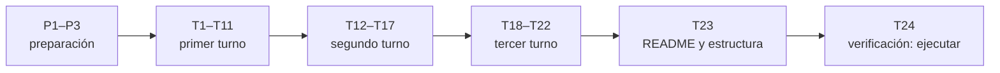

# 🗓️ Plan de producción de la carta

> Curso *Python para desarrolladores Java senior* · **material a la carta** (`opNNN-<tt>NN-<slug>.md`).
> Nace el 05/10/2026, cuando el autor pidió escribir la carta entera, encadenada. Es operativo:
> **cualquier sesión que retome la carta empieza leyendo §3 (estado), §6 (deuda), §7 (bitácora) y
> §8 (checklist).** No se cita desde ningún documento publicado.
>
> - El qué y el orden de los tracks: [`propuestas-temas-opcionales.md`](propuestas-temas-opcionales.md) §3–§19.
> - La forma y las excepciones: [`guia-de-estilo-y-convenciones.md`](guia-de-estilo-y-convenciones.md) §14.
> - El esqueleto: [`plantillas-de-capitulo.md`](plantillas-de-capitulo.md), *Plantilla de sección de la carta*.
> - Las versiones: [`inventario-verificado.md`](inventario-verificado.md), que genera `check-inventario.py`.
> - **El orden y la numeración los manda este documento.**
>
> **Vigencia:** 2026-10-05.

**Salto rápido:** [1](#1--las-reglas-de-orden) · [2](#2--qué-es-una-tanda) · [3](#3--estado) · [4](#4--las-verificaciones) · [5](#5--la-numeración-completa) · [6](#6--deuda-de-enlaces-abierta) · [7](#7--bitácora) · [8](#8--checklist-final) · [9](#9--directorios-de-zz-code)

---

## 1. 🧭 Las reglas de orden

Son **176 secciones en 22 tracks**, después de aplicar las fusiones y mudanzas de la propuesta
(guía §14.3). Se escriben **un track por tanda**, en el orden de la propuesta §19: primero los
once con encargo en Áurea, después los seis del segundo turno y al final los cinco del tercero.

1. **El número `opNNN` es el orden de escritura** (propuesta §2), y está asignado de antemano en §5
   porque la escritura es secuencial y el orden de las tandas está fijo. Si una tanda se salta o se
   reordena, se renumera **antes** de escribir el primer archivo afectado, nunca después.
2. **Ningún enlace apunta a una sección que todavía no existe.** Una sección enlaza fases del
   camino base y secciones anteriores de la carta; lo que querría enlazar hacia adelante va en
   prosa y a §6.
3. **El `README.md` y el `0-ESTRUCTURA-CURSO.md` del curso solo se tocan en T23**, que agrega la
   carta a los dos.
4. **Nada se nombra sin comprobarlo**: versiones desde `inventario-verificado.md`; URL por código
   de estado al cerrar cada tanda.
5. **El código se escribe por inspección** (decisión del autor, guía §14.1), y se corre una
   **prueba de humo** en contenedor cuando es barata. En §5, *corrida* ✅ = prueba de humo completa,
   🟡 = en parte, ⬜ = sin correr (lo que necesita servicios o credenciales). T24 paga la deuda
   restante y crea `src/opNNN-…/`.
6. **Encadenado** (pedido del autor): al cerrar una tanda se abre la siguiente sin esperar, pero
   cada una se cierra completa —verificador, URL, §3, §7 y §8— antes de abrir la otra.
7. **Secuencial y sin agentes. Git lo hace el autor**: los tags de cada sección quedan escritos en
   la propia sección y en la bitácora.
8. **El código intermedio va a `zz-code/`**, registrado en §9; nada en el scratchpad.



---

## 2. 📦 Qué es una tanda

**Una tanda de escritura es un track entero.** La rutina, igual en todas:

1. Releer la ficha del track en la propuesta y su fila en §19; lo que dice es el piso.
2. Comprobar en `inventario-verificado.md` cada paquete que se va a nombrar; si falta uno, se
   agrega a `check-inventario.py` y se regenera el track (`python3 prompts/check-inventario.py <tt>`).
3. Escribir las secciones en orden, con el checklist de la guía §14.4 al cerrar cada una.
4. Correr §4.
5. Actualizar §3, §5 (casilla *escrita*), §6, §7 y §8.

---

## 3. 📊 Estado

Leyenda: ⬜ pendiente · 🟡 en curso · ✅ terminada y verificada.

| Tanda | Entrega | Secciones | Números | Estado |
|---|---|---|---|---|
| **P1** | Decisiones del autor y por defecto, guía §14, plantilla de sección | — | — | ✅ |
| **P2** | `check-inventario.py` e `inventario-verificado.md` (373 paquetes) | — | — | ✅ |
| **P3** | Verificador del curso: `verificador_base.py` + `verificar-corpus.py` | — | — | ✅ |
| **T1** | `lg` — Legado e intercambio sectorial | 7 | op001–op007 | ✅ |
| **T2** | `au` — Automatización externa | 7 | op008–op014 | ✅ |
| **T3** | `co` — Comunicaciones y transferencia | 7 | op015–op021 | ✅ |
| **T4** | `wf` — Orquestación de trabajos y flujos | 8 | op022–op029 | ✅ |
| **T5** | `qa` — Calidad, pruebas y mantenimiento | 10 | op030–op039 | ✅ |
| **T6** | `ob` — Observar el sistema propio | 7 | op040–op046 | ✅ |
| **T7** | `se` — Seguridad aplicada y criptografía | 8 | op047–op054 | ✅ |
| **T8** | `tx` — Texto, plantillas y documentación | 9 | op055–op063 | ✅ |
| **T9** | `ui` — Interfaces y entregables sin frontend | 13 | op064–op076 | ✅ |
| **T10** | `db` — Hablarle a cada sistema de datos | 15 | op077–op091 | ✅ |
| **T11** | `jv` — Convivir con tu stack Java | 4 | op092–op095 | ✅ |
| **T12** | `so` — Optimización, simulación y decisiones | 7 | op096–op102 | ✅ |
| **T13** | `or` — ORMs y acceso a datos | 8 | op103–op110 | ✅ |
| **T14** | `vz` — Visualización y gráficos | 4 | op111–op114 | ✅ |
| **T15** | `sy` — El sistema operativo y los procesos | 8 | op115–op122 | ✅ |
| **T16** | `pr` — Protocolos y contratos más allá de REST | 8 | op123–op130 | ✅ |
| **T17** | `pk` — El panorama de gestores y empaquetado | 8 | op131–op138 | ✅ |
| **T18** | `ff` — La frontera nativa | 8 | op139–op146 | ✅ |
| **T19** | `ar` — Archivos y multimedia | 10 | op147–op156 | ✅ |
| **T20** | `gi` — Geoespacial | 7 | op157–op163 | ⬜ |
| **T21** | `cv` — Visión por computador | 8 | op164–op171 | ⬜ |
| **T22** | `ed` — Didáctica, divulgación y juguetes | 5 | op172–op176 | ⬜ |
| **T23** | La carta en el `README.md` y en `0-ESTRUCTURA-CURSO.md` | — | — | ⬜ |
| **T24** | Verificación: ejecutar el código de la carta, crear `src/opNNN-…/` y quitar los rótulos | — | — | ⬜ |

> 🚦 **Dónde está la producción (05/10/2026):** T1–T19 cerradas (156 de 176). Sigue T20 gi (op157).

---

## 4. 🔍 Las verificaciones

Desde la raíz del curso, al cerrar cada tanda:

```bash
python3 prompts/verificar-corpus.py                 # enlaces, anclas, restos, callouts, carta
python3 prompts/check-inventario.py <tt>             # si la tanda agregó paquetes
grep -rl "Ã\|â€" --include='*.md' .                 # codificación sana: vacío
```

Y las URL de las secciones nuevas, por código de estado (el conductor vive en el directorio de
`zz-code/` de la sesión, §9): 200 vale; 3xx se sigue y se mira el destino; 4xx, 5xx o la portada
de la documentación cuentan como rotas y se corrigen antes de cerrar.

---

## 5. 🔢 La numeración completa

El nombre de archivo es exacto; el título puede ajustarse al escribir sin cambiar el archivo.

| Número | Archivo | Título | Escrita | Corrida |
|---|---|---|---|---|
| op001 | `op001-lg01-ancho-fijo-y-mainframe.md` | Ancho fijo y mainframe | ✅ | ✅ |
| op002 | `op002-lg02-xml-en-serio.md` | XML en serio | ✅ | 🟡 |
| op003 | `op003-lg03-documentos-firmados.md` | Documentos firmados | ✅ | ✅ |
| op004 | `op004-lg04-edi.md` | EDI: X12 y EDIFACT | ✅ | ✅ |
| op005 | `op005-lg05-hl7-y-fhir.md` | Salud: HL7 v2 y FHIR | ✅ | ✅ |
| op006 | `op006-lg06-archivos-planos-hostiles.md` | Archivos planos hostiles | ✅ | ✅ |
| op007 | `op007-lg07-veredicto.md` | Veredicto: escribir el parser o comprarlo | ✅ | ✅ |
| op008 | `op008-au01-http-contra-sistemas-ajenos.md` | HTTP contra sistemas ajenos | ✅ | ✅ |
| op009 | `op009-au02-scraping.md` | Scraping y su fragilidad | ✅ | ✅ |
| op010 | `op010-au03-playwright.md` | Playwright y los portales sin API | ✅ | ✅ |
| op011 | `op011-au04-ssh-y-sistemas-remotos.md` | SSH y sistemas remotos | ✅ | ✅ |
| op012 | `op012-au05-apis-de-saas.md` | APIs de SaaS y su OAuth | ✅ | ✅ |
| op013 | `op013-au06-desplegar-automatizaciones.md` | Desplegar automatizaciones | ✅ | 🟡 |
| op014 | `op014-au07-veredicto.md` | Veredicto: la automatización que se rompe sola | ✅ | ✅ |
| op015 | `op015-co01-correo-saliente.md` | Correo saliente | ✅ | ✅ |
| op016 | `op016-co02-que-el-correo-llegue.md` | Que el correo llegue | ✅ | ✅ |
| op017 | `op017-co03-correo-entrante.md` | Correo entrante | ✅ | ✅ |
| op018 | `op018-co04-probar-correo.md` | Probar correo sin mandarlo | ✅ | ✅ |
| op019 | `op019-co05-transferencia-de-archivos.md` | Transferencia de archivos | ✅ | 🟡 |
| op020 | `op020-co06-mensajeria.md` | Mensajería y notificaciones | ✅ | ✅ |
| op021 | `op021-co07-veredicto.md` | Veredicto: qué protocolo para qué | ✅ | ✅ |
| op022 | `op022-wf01-el-eje.md` | El eje: de cron al flujo durable | ✅ | ✅ |
| op023 | `op023-wf02-colas-de-tareas.md` | Colas de tareas | ✅ | ✅ |
| op024 | `op024-wf03-programacion-en-proceso.md` | Programación en proceso | ✅ | ✅ |
| op025 | `op025-wf04-airflow.md` | Airflow: el grafo declarativo | ✅ | ✅ |
| op026 | `op026-wf05-prefect-y-dagster.md` | Prefect, Dagster y el asset | ✅ | ✅ |
| op027 | `op027-wf06-temporal.md` | Temporal: flujos durables | ✅ | ✅ |
| op028 | `op028-wf07-lo-transversal.md` | Idempotencia, reanudación y backfill | ✅ | ✅ |
| op029 | `op029-wf08-veredicto.md` | Veredicto: el cierre nocturno en cuatro orquestadores | ✅ | 🟡 |
| op030 | `op030-qa01-la-piramide-para-uno.md` | La pirámide para un equipo de uno | ✅ | ✅ |
| op031 | `op031-qa02-pytest-a-fondo.md` | pytest a fondo | ✅ | ✅ |
| op032 | `op032-qa03-dobles-y-datos.md` | Dobles y datos de prueba | ✅ | ✅ |
| op033 | `op033-qa04-integracion-de-verdad.md` | Integración de verdad con testcontainers | ✅ | ✅ |
| op034 | `op034-qa05-propiedades-y-modelos.md` | Propiedades y modelos con Hypothesis | ✅ | ✅ |
| op035 | `op035-qa06-medir-la-suite.md` | Medir la suite: cobertura y mutación | ✅ | ✅ |
| op036 | `op036-qa07-carga-y-rendimiento.md` | Carga y rendimiento | ✅ | 🟡 |
| op037 | `op037-qa08-la-cadena-de-calidad.md` | La cadena de calidad | ✅ | ✅ |
| op038 | `op038-qa09-e2e-con-playwright.md` | Pruebas e2e con Playwright | ✅ | ✅ |
| op039 | `op039-qa10-veredicto.md` | Veredicto: qué vale la pena cuando eres uno | ✅ | ✅ |
| op040 | `op040-ob01-las-senales.md` | Las señales y los eventos anchos | ✅ | ✅ |
| op041 | `op041-ob02-bitacoras.md` | Bitácoras | ✅ | ✅ |
| op042 | `op042-ob03-metricas.md` | Métricas | ✅ | ✅ |
| op043 | `op043-ob04-trazas.md` | Trazas con OpenTelemetry | ✅ | ✅ |
| op044 | `op044-ob05-perfilado-en-produccion.md` | Perfilado en producción | ✅ | ✅ |
| op045 | `op045-ob06-errores-como-producto.md` | Errores como producto | ✅ | ✅ |
| op046 | `op046-ob07-veredicto.md` | Veredicto: el presupuesto de observabilidad | ✅ | ✅ |
| op047 | `op047-se01-el-modelo.md` | El modelo: qué pregunta contesta cada primitiva | ✅ | ✅ |
| op048 | `op048-se02-cryptography-y-pynacl.md` | cryptography y PyNaCl | ✅ | ✅ |
| op049 | `op049-se03-contrasenas-y-tokens.md` | Contraseñas y tokens | ✅ | ✅ |
| op050 | `op050-se04-oauth2-y-oidc.md` | Identidad delegada: OAuth2 y OIDC | ✅ | ✅ |
| op051 | `op051-se05-secretos.md` | Secretos en reposo y en tránsito | ✅ | ✅ |
| op052 | `op052-se06-tls-y-certificados.md` | TLS de verdad | ✅ | ✅ |
| op053 | `op053-se07-defensa-de-la-aplicacion.md` | Defensa de la aplicación | ✅ | ✅ |
| op054 | `op054-se08-veredicto.md` | Veredicto: qué implementar y qué dejar de implementar | ✅ | ✅ |
| op055 | `op055-tx01-el-eje.md` | El eje: concatenar, formatear, plantilla, árbol | ✅ | ✅ |
| op056 | `op056-tx02-jinja2-a-fondo.md` | Jinja2 a fondo | ✅ | ✅ |
| op057 | `op057-tx03-las-otras-plantillas.md` | Las otras plantillas | ✅ | ✅ |
| op058 | `op058-tx04-codigo-como-dato.md` | Colorear y entender código | ✅ | ✅ |
| op059 | `op059-tx05-markdown.md` | Markdown y su ecosistema | ✅ | ✅ |
| op060 | `op060-tx06-documentacion.md` | Documentación como producto | ✅ | ✅ |
| op061 | `op061-tx07-generacion-de-codigo.md` | Generación de código y andamiaje | ✅ | ✅ |
| op062 | `op062-tx08-texto-dificil.md` | Texto difícil: Unicode e internacionalización | ✅ | ✅ |
| op063 | `op063-tx09-veredicto.md` | Veredicto: plantilla o lenguaje mal hecho | ✅ | ✅ |
| op064 | `op064-ui01-el-modelo-y-su-costo.md` | El modelo y su costo | ✅ | ✅ |
| op065 | `op065-ui02-gradio.md` | Gradio | ✅ | ✅ |
| op066 | `op066-ui03-streamlit.md` | Streamlit y su re-ejecución | ✅ | ✅ |
| op067 | `op067-ui04-dash.md` | Dash y los callbacks | ✅ | ✅ |
| op068 | `op068-ui05-nicegui-y-compania.md` | NiceGUI y compañía | ✅ | ✅ |
| op069 | `op069-ui06-marimo.md` | marimo: el notebook que es una app | ✅ | ✅ |
| op070 | `op070-ui07-presentaciones.md` | Presentaciones programáticas | ✅ | ✅ |
| op071 | `op071-ui08-reportes.md` | Reportes: HTML, PDF y Excel | ✅ | ✅ |
| op072 | `op072-ui09-escritorio.md` | Escritorio | ✅ | ✅ |
| op073 | `op073-ui10-cli-mas-alla-de-argparse.md` | CLI más allá de argparse | ✅ | ✅ |
| op074 | `op074-ui11-rich-e-interaccion.md` | rich e interacción en terminal | ✅ | ✅ |
| op075 | `op075-ui12-textual.md` | TUI completas con Textual | ✅ | ✅ |
| op076 | `op076-ui13-veredicto.md` | Veredicto: prototipo o frontend | ✅ | ✅ |
| op077 | `op077-db01-el-db-api.md` | El panorama y el DB-API 2.0 | ✅ | ✅ |
| op078 | `op078-db02-mysql-y-mariadb.md` | MySQL y MariaDB | ✅ | ✅ |
| op079 | `op079-db03-sql-server-y-oracle.md` | SQL Server y Oracle | ✅ | ✅ |
| op080 | `op080-db04-sqlite-a-fondo.md` | SQLite a fondo | ✅ | ✅ |
| op081 | `op081-db05-duckdb.md` | DuckDB | ✅ | ✅ |
| op082 | `op082-db06-valkey.md` | Clave-valor: Valkey | ✅ | ✅ |
| op083 | `op083-db07-mongodb.md` | Documental: MongoDB | ✅ | ✅ |
| op084 | `op084-db08-cassandra.md` | Columnar ancho: Cassandra y ScyllaDB | ✅ | ✅ |
| op085 | `op085-db09-neo4j.md` | Grafo: Neo4j | ✅ | ✅ |
| op086 | `op086-db10-series-de-tiempo.md` | Series de tiempo: TimescaleDB e InfluxDB | ✅ | ✅ |
| op087 | `op087-db11-vectorial.md` | Vectorial: pgvector y Qdrant | ✅ | ✅ |
| op088 | `op088-db12-busqueda.md` | Búsqueda: OpenSearch y Meilisearch | ✅ | ✅ |
| op089 | `op089-db13-objetos-s3.md` | Objetos: S3 y MinIO | ✅ | ✅ |
| op090 | `op090-db14-bitacora-de-eventos.md` | Bitácora de eventos: Kafka y NATS | ✅ | ✅ |
| op091 | `op091-db15-veredicto.md` | Veredicto: el árbol de decisión | ✅ | ✅ |
| op092 | `op092-jv01-los-formatos-de-la-jvm.md` | Los formatos que la JVM ya produce | ✅ | ✅ |
| op093 | `op093-jv02-jpype-y-py4j.md` | JPype y Py4J | ✅ | ✅ |
| op094 | `op094-jv03-graalpy-y-jython.md` | GraalPy y Jython | ✅ | ✅ |
| op095 | `op095-jv04-la-arquitectura-mixta.md` | La arquitectura mixta: dónde poner la frontera | ✅ | ✅ |
| op096 | `op096-so01-describir-en-vez-de-programar.md` | Describir el problema en vez de programarlo | ✅ | ✅ |
| op097 | `op097-so02-programacion-lineal.md` | Programación lineal y entera | ✅ | ✅ |
| op098 | `op098-so03-or-tools.md` | OR-Tools y CP-SAT | ✅ | ✅ |
| op099 | `op099-so04-rutas-y-grafos.md` | Rutas y grafos | ✅ | ✅ |
| op100 | `op100-so05-simulacion-con-simpy.md` | Simulación de eventos discretos | ✅ | ✅ |
| op101 | `op101-so06-cuando-no-hay-modelo.md` | Cuando no hay modelo | ✅ | ✅ |
| op102 | `op102-so07-veredicto.md` | Veredicto: cuándo paga y cuándo bastaba la hoja | ✅ | ✅ |
| op103 | `op103-or01-el-eje.md` | El eje: mapeo, constructor, SQL | ✅ | ✅ |
| op104 | `op104-or02-sqlalchemy-a-fondo.md` | SQLAlchemy a fondo | ✅ | ✅ |
| op105 | `op105-or03-active-record.md` | Active Record: Django ORM, Peewee, Piccolo | ✅ | ✅ |
| op106 | `op106-or04-pony.md` | Pony ORM: generadores a SQL | ✅ | ✅ |
| op107 | `op107-or05-los-asincronos.md` | Los ORM asíncronos | ✅ | ✅ |
| op108 | `op108-or06-sin-orm.md` | Sin ORM | ✅ | ✅ |
| op109 | `op109-or07-migraciones.md` | Migraciones fuera de Alembic | ✅ | ✅ |
| op110 | `op110-or08-veredicto.md` | Veredicto: la misma consulta en seis bibliotecas | ✅ | ✅ |
| op111 | `op111-vz01-el-modelo-y-matplotlib.md` | El modelo y Matplotlib | ✅ | ✅ |
| op112 | `op112-vz02-la-gramatica.md` | La gramática: Altair, plotnine, Great Tables | ✅ | ✅ |
| op113 | `op113-vz03-graficos-que-no-son-datos.md` | Gráficos que no son datos | ✅ | ✅ |
| op114 | `op114-vz04-el-grafico-que-miente.md` | Veredicto: el gráfico que miente | ✅ | ✅ |
| op115 | `op115-sy01-subprocess-a-fondo.md` | subprocess a fondo | ✅ | ✅ |
| op116 | `op116-sy02-las-envolturas.md` | Las envolturas: plumbum, sh, invoke | ✅ | ✅ |
| op117 | `op117-sy03-inspeccion-del-sistema.md` | Inspección del sistema | ✅ | ✅ |
| op118 | `op118-sy04-el-sistema-de-archivos.md` | El sistema de archivos en serio | ✅ | ✅ |
| op119 | `op119-sy05-reaccionar-a-cambios.md` | Reaccionar a cambios | ✅ | ✅ |
| op120 | `op120-sy06-convivir-con-el-sistema.md` | Convivir con systemd | ✅ | 🟡 |
| op121 | `op121-sy07-sincronizacion-y-respaldo.md` | Sincronización y respaldo | ✅ | ✅ |
| op122 | `op122-sy08-veredicto.md` | Veredicto: dónde deja de servir el script de shell | ✅ | ✅ |
| op123 | `op123-pr01-el-eje.md` | El eje: contrato implícito, esquema, IDL | ✅ | ✅ |
| op124 | `op124-pr02-grpc-y-protobuf.md` | gRPC y Protobuf | ✅ | ✅ |
| op125 | `op125-pr03-formatos-binarios.md` | Los formatos binarios | ✅ | ✅ |
| op126 | `op126-pr04-graphql.md` | GraphQL desde Python | ✅ | ✅ |
| op127 | `op127-pr05-tiempo-real.md` | Tiempo real: WebSocket y SSE | ✅ | ✅ |
| op128 | `op128-pr06-mensajeria-como-contrato.md` | Mensajería como contrato | ✅ | ✅ |
| op129 | `op129-pr07-versionado-de-contratos.md` | Versionado y pruebas de contratos | ✅ | ✅ |
| op130 | `op130-pr08-veredicto.md` | Veredicto: REST y las tres excepciones | ✅ | ✅ |
| op131 | `op131-pk01-el-modelo-real.md` | El modelo real de un entorno | ✅ | ✅ |
| op132 | `op132-pk02-pip-venv-y-pip-tools.md` | pip, venv y pip-tools | ✅ | ✅ |
| op133 | `op133-pk03-uv.md` | uv | ✅ | ✅ |
| op134 | `op134-pk04-conda-y-compania.md` | conda, mamba y Miniforge | ✅ | ✅ |
| op135 | `op135-pk05-poetry-y-pdm.md` | Poetry y PDM | ✅ | ✅ |
| op136 | `op136-pk06-empaquetar-y-publicar.md` | Empaquetar y publicar | ✅ | ✅ |
| op137 | `op137-pk07-entregar-a-quien-no-es-ingeniero.md` | Entregar a quien no es ingeniero | ✅ | ✅ |
| op138 | `op138-pk08-veredicto.md` | Veredicto: uno, quince o una plataforma | ✅ | ✅ |
| op139 | `op139-ff01-el-modelo.md` | El modelo: GIL y módulos de extensión | ✅ | ✅ |
| op140 | `op140-ff02-ctypes-y-cffi.md` | ctypes y cffi | ✅ | ✅ |
| op141 | `op141-ff03-cython.md` | Cython | ✅ | ✅ |
| op142 | `op142-ff04-numba.md` | numba | ✅ | ✅ |
| op143 | `op143-ff05-rust-y-cpp.md` | PyO3, pybind11 y nanobind | ✅ | ✅ |
| op144 | `op144-ff06-el-buffer-compartido.md` | El buffer compartido y la copia cero | ✅ | ✅ |
| op145 | `op145-ff07-paralelismo-real.md` | Paralelismo real: subintérpretes y sin GIL | ✅ | ✅ |
| op146 | `op146-ff08-veredicto.md` | Veredicto: la misma función en cuatro fronteras | ✅ | ✅ |
| op147 | `op147-ar01-binario-de-verdad.md` | Binario de verdad | ✅ | ✅ |
| op148 | `op148-ar02-pillow.md` | Pillow | ✅ | ✅ |
| op149 | `op149-ar03-opencv-y-svg.md` | OpenCV, scikit-image y SVG | ✅ | ✅ |
| op150 | `op150-ar04-pdf.md` | PDF | ✅ | ✅ |
| op151 | `op151-ar05-office.md` | Office: Word, Excel y PowerPoint | ✅ | ✅ |
| op152 | `op152-ar06-markdown-html-y-pandoc.md` | Markdown, HTML y pandoc | ✅ | ✅ |
| op153 | `op153-ar07-latex-y-typst.md` | LaTeX y Typst | ✅ | ✅ |
| op154 | `op154-ar08-video.md` | Vídeo | ✅ | ✅ |
| op155 | `op155-ar09-audio.md` | Audio | ✅ | ✅ |
| op156 | `op156-ar10-veredicto.md` | Veredicto: el pegamento contra el binario | ✅ | ✅ |
| op157 | `op157-gi01-el-modelo.md` | El modelo: geometría, proyección, topología | ⬜ | ⬜ |
| op158 | `op158-gi02-vectorial.md` | Vectorial: shapely, geopandas, pyproj | ⬜ | ⬜ |
| op159 | `op159-gi03-postgis.md` | PostGIS desde Python | ⬜ | ⬜ |
| op160 | `op160-gi04-raster.md` | Ráster y teledetección | ⬜ | ⬜ |
| op161 | `op161-gi05-rutas-y-direcciones.md` | Rutas y direcciones | ⬜ | ⬜ |
| op162 | `op162-gi06-mapas-como-entregable.md` | Mapas como entregable | ⬜ | ⬜ |
| op163 | `op163-gi07-veredicto.md` | Veredicto: cuándo basta con lat y lon | ⬜ | ⬜ |
| op164 | `op164-cv01-el-modelo.md` | El modelo: píxeles, características, red | ⬜ | ⬜ |
| op165 | `op165-cv02-deteccion.md` | Detección | ⬜ | ⬜ |
| op166 | `op166-cv03-puntos-faciales.md` | Puntos de referencia faciales | ⬜ | ⬜ |
| op167 | `op167-cv04-morphing.md` | Morphing desde cero | ⬜ | ⬜ |
| op168 | `op168-cv05-reconocimiento.md` | Reconocimiento e identidad | ⬜ | ⬜ |
| op169 | `op169-cv06-segmentacion-y-edicion.md` | Segmentación y edición | ⬜ | ⬜ |
| op170 | `op170-cv07-video-con-modelos.md` | Vídeo con modelos | ⬜ | ⬜ |
| op171 | `op171-cv08-veredicto.md` | Veredicto ético y legal | ⬜ | ⬜ |
| op172 | `op172-ed01-turtle.md` | turtle | ⬜ | ⬜ |
| op173 | `op173-ed02-juegos.md` | Juegos como vehículo | ⬜ | ⬜ |
| op174 | `op174-ed03-notebooks-para-explicar.md` | Notebooks para explicar | ⬜ | ⬜ |
| op175 | `op175-ed04-visualizar-algoritmos.md` | Visualizar algoritmos | ⬜ | ⬜ |
| op176 | `op176-ed05-veredicto.md` | Veredicto: cuándo simplificar ayuda y cuándo miente | ⬜ | ⬜ |

---

## 6. 🧾 Deuda de enlaces abierta

| Origen | Destino pendiente | La cierra |
|---|---|---|
| — | — | — |

---

## 7. 📓 Bitácora

**2026-10-05 · Corte después de T19: pruebas de conjunto y revisión de `prompts/` contra `zz-instrucciones/`.** **Pruebas (op001–op156):** plan contra archivos, encabezados y marcas; enlaces internos (0 rotos); 522 URL externas (las 4 que fallan con Python responden 200 a `curl`: se quedan); verificador del curso en 0 errores; ningún contenedor, red ni volumen del curso quedó en Docker. Se corrigió el plan: los nombres de archivo de op050 y op052 (los archivos y los enlaces de `se08` ya usaban `oauth2-y-oidc` y `tls-y-certificados`), y op036 pasa a ✅🟡 porque sus cifras de carga van en `⏳`. Quedan 6 secciones probadas en parte (op002, op013, op019, op029, op036, op120) para T24. **Defecto propio corregido:** cinco comentarios en inglés en el código C, Rust, C++ y Typst de ff02, ff05 y ar07, contra la guía §5. **Revisión de `prompts/`:** la copia de `verificador_base.py` es idéntica a la de los lineamientos; con `--perfil=courses-ia`, 0 errores; con `--perfil=publicacion`, los emoji en `###` (permitidos en el repositorio) y dos enlaces de `ia01` a `prompts/` (para la etapa de publicación). Se agregó la guía §15 (excepciones del curso a los lineamientos y documentos que no tiene, con qué hace su papel), se actualizaron §14.1 y §14.4 a la práctica real (probado en contenedor), D-12 en el alcance §13, y el `README.md` de `prompts/` ahora describe la carta, su plan, el inventario y los scripts.

**2026-10-05 · T19 (`ar`) cerrada.** Escritas op147–op156 (10 secciones, 98 ejercicios), **las diez probadas en contenedor**, con archivos de muestra generados en cada ejemplo (nada de fotografía real). **Hallazgos y defectos propios:** `struct` corta sin avisar (`CHAPINERO` en `8s`); zip con **zstd** (nuevo en 3.14): 1,91 MB en 69 ms contra 4,15 MB y 476 ms de `deflate`, pero `unzip` de Debian lo salta; `tarfile` ya filtra `../` por defecto (ar01); `draft` parte el tiempo de la miniatura a la mitad, y conservar el EXIF arrastra el GPS (ar02); `opencv-python` falla sin `libGL` en el contenedor, pycairo no tiene ruedas para Linux, OpenCV 33 veces más rápido que scikit-image en Canny (ar03); **pyHanko da `valid=True` con el documento alterado**: el veredicto es `bottom_line` (ar04); openpyxl 102 MB contra 1 MB de XlsxWriter, la fórmula sin calcular se lee como `None`, y el marcador partido en *runs* (docxtpl lo repara, comprobado) (ar05); pandoc 17 ms por llamada contra 0,17 de `markdown-it-py`, y deja pasar `<script>` salvo `-raw_html` (ar06); LaTeX se rompe con el `&` de los datos, Typst los recibe como JSON y compila 36 veces más rápido (ar07); **el corte con `-c copy` guarda 25 cuadros escondidos antes de t=0** (ar08); **pydub no importa en 3.14** sin `audioop-lts`, librosa remuestrea a 22.050 Hz por defecto y su primer `pyin` tarda 4,5 s (ar09). **Defectos propios corregidos:** la medición de openpyxl con `tracemalloc` activo inflaba el tiempo seis veces (9,46 s contra 1,50); se separaron tiempo y memoria. **URL:** docs.opencv.org bloquea toda petición automática; se reemplazó por el README de `opencv-python`. **Inventario:** `opencv-python-headless`, `docxtpl`, `audioop-lts` y `markdown-it-py` agregados al track.

**2026-10-05 · T18 (`ff`) cerrada.** Escritas op139–op146 (8 secciones, 78 ejercicios), **las ocho probadas en contenedor**, con un ejemplo propio (el suavizado exponencial de dos millones de valores) en lugar de Áurea, como permite la propuesta. **Hallazgos y defectos propios:** con el GIL activo, cuatro hilos ganan 1,09× en Python puro y 3,76× con `sha256` en C (ff01); `ctypes` cuesta 0,5 µs por llamada, nueve veces más que Python (ff02); **gcc fusiona multiplicación y suma (FMA) en ARM** y el C difiere de Python en 5,7e-13, con `-ffp-contract=off` es exacto pero un 35% más lento; Rust y numba dan el mismo resultado que Python bit a bit (ff02–ff05); `cythonize -i` necesita `setuptools` desde que no hay `distutils`, y los decoradores `boundscheck`/`wraparound` no dieron nada medible (ff03); numba: 151 ms de `import`, 186 ms la primera llamada, 88 con caché; no compila generadores ni `Decimal` (ff04); `maturin` falla si el nombre del proyecto tiene guion y no se declara `module-name`; un directorio con el nombre del módulo lo tapa (ff05); `shared_memory` de 200 MB en un `/dev/shm` de 64 MB muere con `Bus error` (ff06); en `3.14t` una extensión sin declarar soporte **reactiva el GIL para todo el proceso** y **NumPy no carga en subintérpretes**, con un mensaje que culpa a la instalación (ff07); `pydantic-core` publica 136 ruedas y `orjson` ninguna para `3.14t` (ff08). **Defecto propio corregido:** la versión con una sola cola de `ff06` se colgaba (el proceso principal leía su propio envío). **URL:** `verificar_urls.py` da 200 a videos de YouTube inexistentes; desde ff04 los videos se comprueban con oEmbed: uno corregido en ff04, y los tres videos de toda la carta responden.

**2026-10-05 · T17 (`pk`) cerrada.** Escritas op131–op138 (8 secciones, 78 ejercicios), **las ocho probadas en contenedor** (pk04 contra Miniforge 26.7.2-0, bajada y anotada). **Hallazgos y defectos propios:** crear un entorno sin `pip` tarda 0,14 s contra 1,93 s con él (pk01); un `requirements.txt` compilado con `--generate-hashes` lleva dos *hashes* por paquete (rueda y fuente), se escribe con `--strip-extras` y el paquete alterado se rechaza (pk02); `uv` publicó 31 versiones en 90 días contra 2 de `pip`, y su *lock* trae las ruedas de seis familias de plataformas (pk03); `pip install gdal` falla sin `gdal-config`, conda lo resuelve en 23 s con 81 paquetes y 517 MB (pk04); medidos juntos, `uv` 1,0/0,1 s, Poetry 5,2/1,0 s y PDM 12,1/2,9 s en frío/caliente: **Poetry le gana a PDM**, contra su fama (pk05); pypiserver y PyPI rechazan la versión duplicada con **400, no 409** (pk06); el `.pyz` de `zipapp` no lleva dependencias, `shiv` arranca en 90 ms y **`pex` en 801**, y la rueda dentro del `.pex` queda atada a `cp314-aarch64` (pk07). **Ambiente:** las instalaciones con `pip` dentro del contenedor se colgaron dos veces; se pararon solo los contenedores del curso y se repitió con `uv pip install --system` y `timeout`. **Inventario:** `pypiserver`, `hatchling` y `check-wheel-contents` agregados al track.

**2026-10-05 · T16 (`pr`) cerrada.** Escritas op123–op130 (8 secciones, 78 ejercicios), **las ocho probadas en contenedor** (pr06 contra RabbitMQ 4.3.6, bajada y anotada). **Hallazgos y defectos propios:** Protobuf comparte un *pool* global de descriptores y dos `cita.proto` en un proceso chocan; se resolvió con paquetes versionados (pr01); gRPC a 0,53 ms por llamada y `DEADLINE_EXCEEDED` con plazo (pr02); medidos siete formatos: `orjson` divide por 2,7 el costo de `json`, `msgspec` por 4,4, y **Protobuf en Python es más lento que `orjson`** (8,7 contra 4,8 ms) aunque ocupa un tercio (pr03); 33 consultas contra 4 con `DataLoader` (pr04, revalidado con Strawberry 0.331.5, publicada el mismo día); SSE reanuda con `Last-Event-ID` (pr05); **RabbitMQ 4.3 rechaza las colas no durables** (`transient_nonexcl_queues`), el código de casi todos los tutoriales (pr06); `schemathesis` encontró `cuota=0` en 24 peticiones (pr07). **URL:** la documentación de `msgspec` se mudó a msgspec.dev. **Inventario:** `jsonschema` y `PyYAML` agregados al track; Strawberry pasó a 0.331.5 durante la tanda.

**2026-10-05 · T15 (`sy`) cerrada.** Escritas op115–op122 (8 secciones, 78 ejercicios); siete probadas en contenedor y **sy06 en parte** (🟡: `sd_notify`, señales y supervisord, sí; la unidad de systemd necesita systemd como PID 1 y queda para T24). **Hallazgos y defectos propios:** `run(timeout=)` deja huérfanos **los dos** `sleep` de `sh`, no uno (sy01); sh cuesta 2,47 ms por llamada contra 0,26 de `subprocess` (sy02); 61 archivos antes de `EMFILE` con límite 64 (sy03); **Python 3.14 usa `forkserver` por defecto y un *script* con `multiprocessing` sin guarda `__main__` falla con `ConnectionResetError`**; la escritura ingenua rompió 20 de 20 archivos y la atómica 0; sin bloqueo, el contador terminó en 4–6 de 1 000 porque las lecturas encuentran el archivo recién truncado (sy04); `watchdog` entrega `created` dos veces y con una fila, y el renombrado hace que hasta `created` llegue completo (sy05); supervisord relanza en cada salida con error (sy06); **`rsync -a` no copió dos cambios de mismo tamaño y misma fecha**, y el manifiesto calculado de la instantánea lo certificaba: se pasó a manifiesto del origen y `--checksum`; `rsync` no crea directorios intermedios (código 11) (sy07); el bash cuidadoso también falló, en el `sort` con un nombre con salto de línea (sy08). **URL:** psutil se mudó a psutil.io; freedesktop.org responde 418 (reemplazado por man7.org, como en T1). **Inventario:** ninguna versión probada cambió.

**2026-10-05 · T14 (`vz`) cerrada.** Escritas op111–op114 (4 secciones, 38 ejercicios; el track recortado a cuatro, como decidió la guía), **las cuatro probadas en contenedor**, con la frontera de la propuesta: aquí la imagen es un entregable del sistema, no exploración. **Hallazgos:** tres noches con `pyplot` sin cerrar dejan 30 figuras y 27,9 MB contra 9,1 MB de cachés con `Figure`, y Matplotlib avisa una sola vez (vz01); entre barras y líneas la especificación de Altair difiere solo en `mark`, y Altair rechaza 6 000 filas con `MaxRowsError` (vz02); `graphviz` sin el binario falla con `ExecutableNotFound` y el diagrama del cierre sale de la misma definición en DOT y Mermaid (vz03); factor de mentira 16 con el eje desde 45 M, `jet` con cinco cambios de dirección de luminosidad, y el semáforo pasa de ΔE 100,8 a 15,8 con deuteranopía (vz04). **Inventario:** `vl-convert-python`, `pandas`, `polars` y `colorspacious` agregados al track; ninguna versión probada cambió.

**2026-10-05 · T13 (`or`) cerrada.** Escritas op103–op110 (8 secciones, 78 ejercicios), **las ocho probadas en contenedor**, todas sobre la misma consulta (los tres planes de Suba con más saldo pendiente) y los mismos datos. **Hallazgos y defectos propios:** el ORM navegando manda 21 sentencias contra 1 (or01); SQLAlchemy 2.1 propaga el tipo `Pesos` a través de `sum` y `coalesce` (or02); Peewee y Django pierden la actualización con dos objetos de la misma fila y SQLAlchemy no (or03); **Pony descompila también las funciones propias simples** (`endswith` → `LIKE '%3'`): el borrador decía lo contrario y se corrigió; falla con bucles y `re` (or04); en `AsyncSession` el `MissingGreenlet` llega dentro de un `StatementError` y deja un `RuntimeWarning` de corrutina sin esperar (or05); `aiosql` 15 exige la lista de parámetros en el nombre y devuelve generadores, y `sqlglot` agrega `NULLS LAST` al traducir a Postgres (or06); `yoyo` no detecta una migración editada (Flyway sí, por la suma de verificación) y `to_rollback` no acepta listas (or07); en un *script* Django sin aplicación no hay relaciones inversas (or08); la medición final: navegando 21 sentencias y 18–46 veces el tiempo del SQL, agregando 1 sentencia y 2–4 veces. **Inventario:** `aiosqlite`, `asyncpg` y `greenlet` agregados; ninguna versión probada cambió.

**2026-10-05 · T12 (`so`) cerrada.** Escritas op096–op102 (7 secciones, 68 ejercicios), **las siete probadas en contenedor**. Dominio adaptado: la propuesta hablaba de terapeutas y visitas domiciliarias (de una versión anterior de la empresa); se usaron especialistas, sillas, recepción y el mensajero del laboratorio dental. **Coherencia con la historia:** so01 mandaba especialistas a las franquicias y so02 ponía carillas en Suba, que según la historia no tiene rehabilitador: los dos se corrigieron (sedes propias; Chapinero). Las recepcionistas sin nombre en la historia van con código (`rec-02`…). **Hallazgos y defectos propios:** **PuLP 4.0.0 (25/09/2026) reescribió su núcleo en Rust y rompió la API**: sin `LpVariable.dicts` (ahora `prob.add_variable_dicts`), sin `pulp.LpStatus` (`solve()` devuelve `LpSolveStats`), `constraints` es un método; HiGHS da precios sombra negativos en maximización (so01, so02); con ocho recepcionistas el problema era inviable por construcción, 47 turnos posibles para 48 (so03, defecto propio); con 20 semillas el voraz empata con el óptimo en 6 y pierde hasta 61 % (so01); Christofides quedó peor que el voraz y el recocido no mejoró (so04); la simulación mostró el cuello de botella en el mostrador, 36 → 12 min con una recepcionista contra 29 con una silla (so05); Optuna con 60 evaluaciones llegó a 11,1 % y no al 9,3 % de la rejilla, y se corrigió el texto que decía que se acercaba (so06); el veredicto con costos al primer año dejó solo un caso que paga solo (so07). **Inventario:** ninguna versión probada cambió.

**2026-10-05 · T11 (`jv`) cerrada — primer turno completo.** Escritas op092–op095 (4 secciones, 36 ejercicios), **las cuatro probadas en contenedor con Java de verdad**: OpenJDK 21 (Temurin 21.0.12.1 bajada para jv01, y el paquete de Debian dentro de `python:3.14.7` para jv02–jv04). **Hallazgos y defectos propios:** Java escribe Avro con `decimal` y `timestamp-millis` y `fastavro` los lee como `Decimal` y `datetime` UTC (jv01); un directorio `co/` y luego uno `java/` junto al script taparon los paquetes Java en JPype (PEP 420) hasta usar `src/main/java/` (jv02, dos defectos propios); la referencia en Python estaba plegada por constantes y daba 0,02 µs (jv02, defecto propio, el mismo de ob05); JPype 0,57 µs contra Py4J 141 µs por llamada; GraalPy 25.4.4 (Python 3.13) baja de 0,18 s a 0,003 s en cinco rondas contra 0,27 s constantes de CPython, arranca en 0,16 s (no en segundos, como decía el borrador: corregido) y se declara `GraalVM` en `python_implementation()`; Jython 2.7.4 rompe la tilde y la f-string (jv03); el servidor HTTP del JDK dio **46 458 µs por llamada** por Nagle y ACK diferido, 432 µs con `sun.net.httpserver.nodelay`, y 0,7 µs por elemento en lote, con cero diferencias en 100 000 montos (jv04). **URL:** la guía de incrustación de GraalPy cambió de ruta. **Inventario:** `graalpy` sigue sin estar en PyPI (se distribuye por GitHub y Maven); ninguna versión probada cambió.

**2026-10-05 · T10 (`db`) cerrada.** Escritas op077–op091 (15 secciones, 148 ejercicios), **las quince probadas en contenedor contra el servicio real**, con un ayudante nuevo en `zz-code` (`humo_servicio.py`: red propia etiquetada, servicios sin puertos publicados, limpieza garantizada; nunca quedó un contenedor ni una red). Imágenes de otros cursos usadas sin tocarlas (postgres 18.6, mysql 9.7.2, mariadb 12.3.3, valkey 9.1, mongo 8.0.20, cassandra 5.0, neo4j 2026.09.0, timescaledb 2.30.1, pgvector 0.8.6, qdrant 1.19.1, opensearch 3.8.0, kafka 4.3.1); bajadas para la carta y anotadas en `salidas/imagenes-bajadas.txt`: oracle-free 23-slim y mssql 2022 (ya borradas), influxdb 3.12.0-core, meilisearch 1.54.3, rustfs 1.0.1, nats 2.15.0. **Hallazgos y defectos propios:** en SQLite el DDL es transaccional y el `rollback` se llevó las tablas (db04, defecto propio); `fetch_decimals` de `oracledb` solo vale para cursores nuevos y `pymssql` devuelve `sql_variant` como `bytes` (db03); con `KEYS` el `PING` de otro cliente esperó 316 ms contra 0,8 ms con `SCAN` (db06); 200 000 documentos examinados sin índice contra 18 722 con índice en MongoDB, y 40 004 contra 5 accesos en Neo4j (db07, db09); el *driver* de Neo4j devuelve zonas de `pytz`; InfluxDB 3 rechaza un *token* vacío aun sin autenticación, y los 11 s de carga son del cliente, no del motor —se dijo así— (db10); Qdrant no construye HNSW bajo `indexing_threshold` y en segmentos chicos busca exhaustivo, dos corridas con *recall* 1,00 engañoso hasta configurar los segmentos (db11); el analizador `spanish` no reduce verbos (db12); **MinIO dejó de mantener su edición abierta y `minio/minio` ya no está en Docker Hub** —db13 usa RustFS y lo dice—, y `boto3` 1.43.108 no instala junto a `s3fs` 2026.9.0 (db13); Kafka en otro contenedor necesita `KAFKA_ADVERTISED_LISTENERS` (db14). **URL:** docs de TimescaleDB movidas a tigerdata.com; dev.mysql.com, tigerdata.com y docs.nats.io rechazan al cliente de Python y responden 200 a curl: se conservan. **Inventario:** ninguna versión probada cambió.

**2026-10-05 · T9 (`ui`) cerrada.** Escritas op064–op076 (13 secciones, 128 ejercicios), **las trece probadas en contenedor**; ui01 absorbe `ed05` (Patricia) y ui10–ui12 son el antiguo `cl`. **Hallazgos y defectos propios:** el *endpoint* de Gradio 6 se llama como la función (`/mora`), no `/predict`, y publica el *docstring* (ui02); `AppTest` de Streamlit confirmó 5 cargas sin caché contra 1 con caché (ui03); la medición de ocho bibliotecas da de 23 MB (Flet) a 418 MB (Streamlit) e importaciones de 0,04 s a 1,19 s (Gradio), con Reflex en 0,00 s por carga perezosa (ui05); el HTML inicial de Shiny no trae las salidas (ui05); el error de marimo por definición múltiple sugiere `_tasa` (ui06); `Template()` compila al crearse y el filtro tiene que estar antes en el `Environment` (ui08, defecto propio); WeasyPrint en `python:3.14.7-slim` falla con `libgobject-2.0-0`, no con Pango, y la imagen completa ya lo trae (ui08; la imagen slim se bajó y se borró); argparse arranca en 29 ms contra 102–114 ms de Typer y `cyclopts` (ui10); `rich` escribe 0 escapes sin terminal y 101 con `FORCE_COLOR` (ui11); en Textual, `update_cell` necesita columnas con `key=` (ui12, defecto propio atrapado antes de correr). **Inventario:** `openpyxl`, `pyinstaller`, `briefcase` y `pytest-textual-snapshot` agregados al track `ui`; ninguna versión probada cambió.

**2026-10-05 · T8 (`tx`) cerrada.** Escritas op055–op063 (9 secciones, 88 ejercicios), **las nueve probadas en contenedor**. **Hallazgos y defectos propios:** `htpy` escapa el apóstrofo como `&#39;` (MarkupSafe), no `&#x27;` (tx01); `trim_blocks` pega `<table>` al párrafo anterior (tx02); en la medición de seis motores Mako empata con Jinja2 y Chameleon es el más rápido —se corrigió la afirmación de que Mako era el más rápido— y los siete renderizan 10 000 correos en 9–55 ms (tx03); `mistune.html` deja pasar `<script>`, se agregó la variante `escape=True` (tx05); el resumen de `doctest -v` cuenta 6 pruebas, no 5 (tx06); el compilador reporta primero la comilla sin cerrar de la línea 9 y no el `class` de la línea 8 (tx07); `sorted` ordena `Á` < `Ñ` < `á` por punto de código y Babel escribe `$1.234.567,50` sin espacio (tx08); `env.lex` devuelve *tokens* crudos (`whitespace`, `operator`) y la primera versión del medidor no contaba nada (tx09). tx04 salió exacta a la primera. **Inventario:** `Django`, `nh3`, `mdit-py-plugins` y `mkdocstrings` agregados al track `tx`; ninguna versión probada cambió.

**2026-10-05 · T7 (`se`) cerrada.** Escritas op047–op054 (8 secciones, 78 ejercicios), **las ocho probadas en contenedor**. **Hallazgos y defectos propios:** el archivo de secretos de `pydantic-settings` lleva el `env_prefix` (se05, falló con *Field required*); Python 3.13+ activa `VERIFY_X509_STRICT` y rechaza la CA sin `AuthorityKeyIdentifier` (se06); la carga SSTI clásica con `cycler` ya no funciona en Jinja2 3.1.6 y se cambió por `lipsum.__globals__`, y `bandit` no marca `Template()` (se07: se quitó un B701 inventado); la carga con paréntesis rompió el `sh` de `os.popen`; `bcrypt` 5 lanza `ValueError` con más de 72 bytes (confirmado). **URL:** dos rutas de docs de `authlib`/`joserfc` cambiadas; owasp.org reemplazado por GitHub (bucle de redirección); funcionpublica.gov.co sirve cadena incompleta —válida en navegador y curl, falla en Python—, se conserva. **Inventario:** `PyYAML`, `Jinja2`, `pydantic-settings` y `httpx` agregados al track `se`.

**2026-10-05 · T6 (`ob`) cerrada.** Escritas op040–op046 (7 secciones, 68 ejercicios), **las siete probadas en contenedor**. **Hallazgos y defectos propios:** `HTTPXClientInstrumentor().instrument()` global no cubre `MockTransport` (sin tramo ni `traceparent`); se usa `instrument_client` y se explica; la instrumentación de `httpx` 0.66b0 emite los nombres **viejos** de atributos (`http.method`) por defecto, al revés de lo que había escrito; `py-spy` 0.4.2 sí soporta Python 3.14 (con `--cap-add SYS_PTRACE`); **la fuga de `ob05` no existía**: `b"x" * 2048` se pliega en una sola constante (verificado con `dis`), ahora `bytes(2048)` y la sección lo cuenta; `prometheus-client` agrega series `_created`; `sentry-sdk` sin `before_send` manda la cédula en el mensaje y en la variable local aunque `send_default_pii=False` (comprobado y publicado). Las salidas reales reemplazaron a las previstas en cinco secciones (orden de campos, tiempos, líneas). **Tags:** `op-ob-fase-01` … `op-ob-fase-07`. **Siguiente:** T7 (`se`).

**2026-10-05 · T5 (`qa`) cerrada.** Escritas op030–op039 (10 secciones, 94 ejercicios). **Las diez probadas en contenedor**: `pytest` 9.1.1 con marcas y *plugin* propio; `respx`, `time-machine`, `polyfactory`, `Faker`; **`testcontainers` 4.15.0** levantando `postgres:18.6` hermano por el *socket* de Docker (sin Ryuk; la cuenta de contenedores igual antes y después); Hypothesis con `RuleBasedStateMachine` encontrando el error sembrado en dos pasos; **`mutmut` 3.8.0** (14 mutantes: 7 vivos con la suite débil, 5 con la precisa, los cinco equivalentes); Locust 2.46.7 (29,3 req/s, confirma la estimación; cifras no publicadas como medición); `ruff`, `mypy` 2.4.0, `bandit`, `deptry`, `vulture`; `pytest-playwright` con Chromium. **Defectos propios y hallazgos:** `testcontainers.postgres` deprecado → `testcontainers.community.postgres`; `mutmut` 3.8 renombró `paths_to_mutate`/`tests_dir`; el caso de redondeo `25 → 2` no distinguía HALF_EVEN de HALF_UP (ahora `75 → 4`); los cinco sobrevivientes son equivalentes porque el redondeo explícito coincide con el contexto por defecto; `pytest` escapa no ASCII en los ids (`Zipaquir\\xe1`); `pytest` sin `pythonpath` no encontraba el módulo; FastAPI necesita `python-multipart` para formularios; la salida de la cadena de calidad tenía más hallazgos que los sembrados (DEP003, B404, falsos positivos de `vulture`), publicados tal cual; el enlace de buenas prácticas de Playwright no existe para Python. Inventario: +`holidays`, `pytest-timeout`, `python-multipart`, `fastapi`, `uvicorn`. **Tags:** `op-qa-fase-01` … `op-qa-fase-10`. **Siguiente:** T6 (`ob`).

**2026-10-05 · T4 (`wf`) cerrada.** Escritas op022–op029 (2.366 líneas, 78 ejercicios). Pruebas de humo: siete completas y `wf08` en parte (su medición queda en `⏳` con especificación completa, como el resto del curso). Corrieron de verdad, en contenedor: RQ contra **Valkey 9.0.6** y Huey sobre SQLite (`wf02`), APScheduler y `schedule` (`wf03`), **Airflow 3.3.2** con `airflow dags test` sobre Python 3.14 (`wf04`), Prefect 3.8.7 y Dagster 1.13.25 (`wf05`), y Temporal con el entorno que salta el tiempo (`wf06`). **Defectos propios encontrados:** el *worker* de RQ con `--burst` y sin `--with-scheduler` dejaba el reintento programado para siempre y el productor colgado (`wf02`, ahora es su trampa principal); `get_status()` devuelve el enum; la zona horaria de `schedule` necesita `pytz` y no lo declara (`wf03`, agregado al inventario); la semántica del intervalo de datos que describí era la de Airflow 2 —en Airflow 3 un `cron` usa *timetable* de disparo e intervalo puntual— (`wf04`); `os._exit` perdía la salida de la copia que se cae (`wf07`). **Narrativa:** `wf07` llamaba franquicias a cuatro sedes que la historia no identifica como tales; ahora van sin nombre. **Imágenes descargadas y borradas:** `valkey/valkey:9.0.6-alpine`. **Tags:** `op-wf-fase-01` … `op-wf-fase-08`. **Siguiente:** T5 (`qa`).

**2026-10-05 · T3 (`co`) cerrada.** Escritas op015–op021 (2.058 líneas, 68 ejercicios). Pruebas de humo: seis completas y `co05` en parte (el fragmento FTPS sin correr). Servicios reales en contenedor, en redes privadas y borrados al terminar: **GreenMail 2.1.14** (IMAP de `co03`), **Mailpit v1.31.4** (`co04`) y un **SFTP de OpenSSH** (`co05`, con retoma desde `.part` y archivo reemplazado). **Defectos propios encontrados:** `prefetch` de Paramiko recibe el tamaño total, no lo que falta (`co05`: al retomar no habría pedido el final); comparación de sede con tilde contra nombre de archivo sin tilde (`co01`); porcentaje 0,5 → 0,4 (`co07`). **Correcciones de narrativa:** `co01` usaba una sede «Chía» y una franquiciada inventadas (la historia no las tiene): ahora Zipaquirá, sin persona; y `au05` (T2) usaba la clave `zipaquira` para la franquicia de Google Calendar, que según la historia es otra sede: ahora `sede-calendar`. **Hallazgos:** `aiosmtpd` necesita `python -u` para escribir su registro redirigido (va en `co04`); la cifra de la propuesta «el correo gana en el 60% de los casos» no tenía medición: `co07` la reemplaza por la cuenta por tipo y por volumen (50% y 2%). URL: SUIN carga la ley por JavaScript y no se pudo verificar; se enlaza la Ley 1581 en Función Pública (verificada con `curl`; `urllib` rechaza su cadena de certificados). **Imágenes descargadas y borradas:** `greenmail/standalone:2.1.14`, `axllent/mailpit:v1.31.4`, `pfjd-sftp:humo`. **Tags:** `op-co-fase-01` … `op-co-fase-07`. **Siguiente:** T4 (`wf`).

**2026-10-05 · T2 (`au`) cerrada.** Escritas op008–op014 (2.311 líneas, 68 ejercicios). Pruebas de humo: seis completas y `au06` en parte (script con `uv` y `systemd-analyze verify` de las unidades; el timer no corrió con `systemd` activo). `au03` corrió con Chromium real (Playwright 1.63.0) contra un portal falso servido en el contenedor; `au04` contra dos sedes SSH en una red privada de Docker, sin puertos publicados, borradas al terminar (contenedores, red e imagen `pfjd-sede:humo`). **Defectos propios encontrados:** `httpx.Request` no acepta `auth=` (`au01`); `mkdir /run/sshd` rompe la imagen en Debian trixie (`au04`); el recorte a 40 caracteres de `au02`; y una afirmación falsa de `au07` sobre el umbral de rotura, recalculada (cinco fallas de ocho dan neto negativo). **Hallazgo de ecosistema, pendiente para el autor (📌):** Pydantic continúa `httpx` como **`httpx2`** 2.13.1 (2026-09-23) y `authlib` 1.8 ya trata a `httpx` como deprecado; el camino base usa `httpx` 0.28.1 (2024-12) en Fase 13 y otras —no se tocó, por bloqueo de contenido—; la carta lo dice en notas de ecosistema de `au01` y `au05`. URL: `docs.ansible.com` (429) y `freedesktop.org` (418) rechazan clientes automáticos; reemplazadas por GitHub y `man7.org`. `verificar_urls.py` ya ignora las URL dentro de bloques de código. **Recursos:** se descargó `debian:trixie-slim` (no estaba): borrar al cerrar la carta. Mojibake intencional en `lg06` y `au02`. **Tags:** `op-au-fase-01` … `op-au-fase-07`. **Siguiente:** T3 (`co`).

**2026-10-05 · T1 (`lg`) cerrada.** Escritas op001–op007 (2.442 líneas, 68 ejercicios). **Pruebas de humo** en `python:3.14.7` (contenedor, `--label curso=python-for-java-devs`, `--rm`): seis completas y `lg02` en parte (su XSD importado es el ejercicio 4). **Encontraron cuatro defectos propios**, corregidos antes de cerrar: el dígito de verificación del NIT del ejemplo de `lg02` (7 → 8); el tokenizador de `lg04` consumía el escape de EDIFACT en el nivel de segmento; la fecha sin zona de `lg05`, que FHIR rechaza; y la salida prevista de `lg06` y `lg07`, distinta de la real (el detector dijo `hp_roman8`; el fallo dorado es de fecha, no de largo). **Decisión por defecto, a revisar:** prueba de humo cuando es barata, con rótulo propio (guía §14.1). **Comprobado:** URL de las siete secciones por código de estado (la de la UNECE responde 403 a clientes automáticos y se reemplazó). Inventario: +4 paquetes (`xsdata`, `python-pkcs11`, `pydifact`, `bots`); `check-inventario.py` ahora actualiza por track. **Trampa:** `verificar_urls.py` y los extractores de humo viven en `zz-code/`; las secciones no los citan. **Tags para el autor:** `op-lg-fase-01` … `op-lg-fase-07` (el mensaje está en cada sección). **Siguiente:** T2 (`au`).

**2026-10-05 · P1 y P2 cerradas.** Pedido del autor: *"termina el material a la carta"*, con
**toda la carta encadenada**, **forma ligera (~400 líneas)** y **código por inspección**.
Decisiones por defecto, a revisar (guía §14.2–§14.3): criterio verificable en vez de solución
publicada; código en la sección y `src/` en T24; Mermaid; reparto `qa`/`ob`; camino (a) en `cv`.
`check-inventario.py` verificó 373 paquetes contra PyPI: 41 quietos (💤) y uno que no existe con
ese nombre (`graalpy`, que no se distribuye por PyPI). **Trampa para la próxima sesión:** el
inventario ya avanzó respecto del camino base —SQLAlchemy está en 2.1.3 y el camino base fija
2.0.x—; la carta cita la versión del inventario y dice cuándo difiere de la del camino base.
**`zz-code/`:** `python-for-java-devs-20261005-f516` creado. **Siguiente:** P3.

---

## 8. ✅ Checklist final

- [x] Guía §14 y plantilla de sección escritas
- [x] `inventario-verificado.md` generado
- [x] Verificador del curso copiado y ajustado a la carta
- [ ] Las 176 secciones escritas (§5, casilla *escrita*)
- [ ] URL de todas las secciones verificadas
- [ ] La carta en el `README.md` y en `0-ESTRUCTURA-CURSO.md` (T23)
- [ ] El código ejecutado y `src/opNNN-…/` creado (T24, casilla *corrida*)
- [ ] `zz-code/` sin directorios *vigentes* y `limpiar.py` en vista previa

---

## 9. 🧪 Directorios de `zz-code/`

| Directorio | Tanda | Propósito | Estado |
|---|---|---|---|
| `python-for-java-devs-20261005-f516` | P1– | La lista de la carta (`carta.py`), el conductor de URL y las salidas de los verificadores | vigente |
