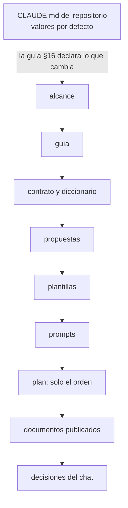

# 🧰 `prompts/` — la maquinaria del curso
## El motor de motores — La teoría que todos los gestores SQL implementan

Este directorio no es material del curso: es **lo que se usa para escribirlo**. El lector nunca lo
abre, y no viaja cuando el curso se publica en su propio repositorio (D-13). Quien escribe una fase
lo lee entero antes de teclear la primera línea.

> **Estado:** en preparación cerrada, listo para escribir: P1–P11 terminadas el 05/10/2026, y la
> primera tanda de escritura es T0. El estado al día está en el plan de producción §3.

---

## 📖 Qué hay aquí, y cuándo se lee

| Documento | Qué es | Cuándo se lee |
|---|---|---|
| [`alcance-del-proyecto.md`](alcance-del-proyecto.md) | qué enseña el curso, a quién y con qué límites; todas las decisiones (§13) | antes de escribir cualquier cosa |
| [`guia-de-estilo-y-convenciones.md`](guia-de-estilo-y-convenciones.md) | cómo se escribe; diagramas en §3.2, checklist en §15, excepciones en §16, correspondencia con los lineamientos en §18 | en cada sesión, siempre |
| [`contrato-de-nombres.md`](contrato-de-nombres.md) | los identificadores congelados: archivos, bases, herramientas, contenedores, tags | antes de cada fase, y cada vez que haga falta un nombre |
| [`diccionario-de-terminos.md`](diccionario-de-terminos.md) | qué palabra para cada concepto, y el código de las bases de ejemplo | cada vez que dudes de un término |
| [`propuesta-fases-y-alcance.md`](propuesta-fases-y-alcance.md) | las 48 fases, su ficha, horas y ejercicios (§13); el registro de decisiones (§16) | en cada sesión de fase |
| [`propuesta-apendices-y-alcance.md`](propuesta-apendices-y-alcance.md) | los 12 apéndices y su ficha; `a10` en §15 | en cada sesión de apéndice |
| [`plantillas-de-capitulo.md`](plantillas-de-capitulo.md) | los seis esqueletos: fase, panorama, fase A.C., caso de estudio, solucionario y apéndice | al empezar y al cerrar cada documento |
| [`prompts-de-fase.md`](prompts-de-fase.md) | el marco común, el protocolo de tres pasos y un bloque por fase del camino base | al abrir cada sesión de fase |
| [`prompts-ac-fase.md`](prompts-ac-fase.md) | los prompts del track A.C., en archivo propio | solo en las sesiones del bloque A.C. |
| [`prompts-de-apendice.md`](prompts-de-apendice.md) | el marco de los apéndices y un bloque por apéndice | al abrir cada sesión de apéndice |
| [`verificacion-de-laboratorio/hallazgos.md`](verificacion-de-laboratorio/hallazgos.md) | lo verificado al ejecutar (H1–H13), con el laboratorio de producción `mdm-lab` | antes de escribir algo que se ejecuta o se dibuja |
| [`inventario-de-fuentes.md`](inventario-de-fuentes.md) | libros, capítulos, cursos y papers verificados (P9) | antes de citar un recurso; `a08` sale de aquí |
| `_desechable-plan-de-produccion.md` | tandas, estado, verificaciones, bitácora, checklist y directorios de `zz-code/` | al empezar y al cerrar cada sesión |
| `verificar-corpus.py`, `verificador_base.py` y `verificar-diagramas.py` | las validaciones base, las propias del curso y el dibujo de los diagramas | al cerrar cada tanda |

Los otros dos desechables, `_desechable-propuesta-temas.md` y `_desechable-modelos-legacy.md`, son
registro de la discusión del temario: no se leen para escribir ni se citan.

**Orden de autoridad**, cuando dos se contradicen: (1) el alcance, (2) la guía, (3) el contrato y el
diccionario, (4) las propuestas, (5) las plantillas, (6) los prompts, (7) el plan, solo sobre el
orden, (8) los documentos ya publicados, (9) las decisiones del chat actual. Por encima de todos, el
`CLAUDE.md` del repositorio, en lo que la guía §16 no declaró como excepción.



> 🧭 **Si una contradicción aparece al escribir, se arregla en el documento de arriba primero.**
> Parchear la fase y dejar la propuesta desactualizada es como empiezan las divergencias que nadie
> detecta hasta la fase veinte.

---

## 🚀 Cómo abrir una sesión de escritura

1. Lee el plan de producción: §3 (estado), §6 (deuda), §7 (la última entrada de la bitácora, con sus
   trampas), §8 (checklist) y §9 (directorios de `zz-code/`).
2. Pega el marco común y el bloque del documento, de `prompts-de-fase.md`, `prompts-ac-fase.md` o
   `prompts-de-apendice.md`.
3. Sigue el protocolo de tres pasos: preguntas → redacción → autoverificación.
4. Si vas a ejecutar algo, crea tu directorio de pruebas con
   `python3 zz-code/nuevo.py gestores-sql-01-bases` desde la raíz del repositorio, y levanta
   `mdm-lab` como dice el hallazgo H1.
5. Al cerrar, desde la raíz del curso:

   ```bash
   python3 prompts/verificar-corpus.py
   python3 prompts/verificar-diagramas.py --salida <tu directorio de zz-code>/salidas/diagramas
   ```

   - El primero tiene que salir sin errores; los avisos se revisan a mano (`DIAGRAMA` puede ser la
     salida literal de un verificador, que va en `text`).
   - El segundo dibuja cada bloque `mermaid` con `mmdc` y sale con error si alguno no dibuja.
   - Después, el plan al día: §3, §6, §7, §8 y §9.

**Una sesión, un archivo** (más su solucionario y lo que alimenta en la misma tanda: diccionario,
`a07`, `a08`, `INSTINTOS.md`, contrato). Si una sesión no produce entregable, sobra o se salió de
alcance.

---

## 🪦 Lo que cambió al preparar

- **05/10/2026 (P11).** Revisión contra los lineamientos de producción del repositorio. Los
  diagramas pasaron de ASCII a Mermaid (D-12, a pedido de Oskar), con bocetos con óvalos hasta F02 y
  pata de gallo desde F03 (D20), y nació el apéndice `a10` de notaciones (D19). Se escribieron el
  diccionario, el contrato de nombres, este manual y los tres verificadores, y la guía ganó §18 sin
  renumerar. Las pruebas de Docker pasaron a puertos aleatorios, al cierre se borran los
  contenedores con sus volúmenes y el código de prueba va a `zz-code/`. D-03 quedó en autocontención
  editorial sin enlaces.

---

## ⚠️ Las tres cosas que más se rompen al escribir

Valores de partida; se reemplazan con lo que de verdad se cuele en las primeras tandas.

- **Una salida o un paso de solución sin ejecutar ni contrastar.** La regla de la casa es la guía
  §12; el verificador no la ve, así que la ve quien escribe.
- **Un diagrama en la notación equivocada**: pata de gallo antes de F03, un boceto con óvalos después,
  o un dibujo en `text` que debía ir en Mermaid.
- **Inventar un nombre o un término** que debía salir del contrato o del diccionario.
