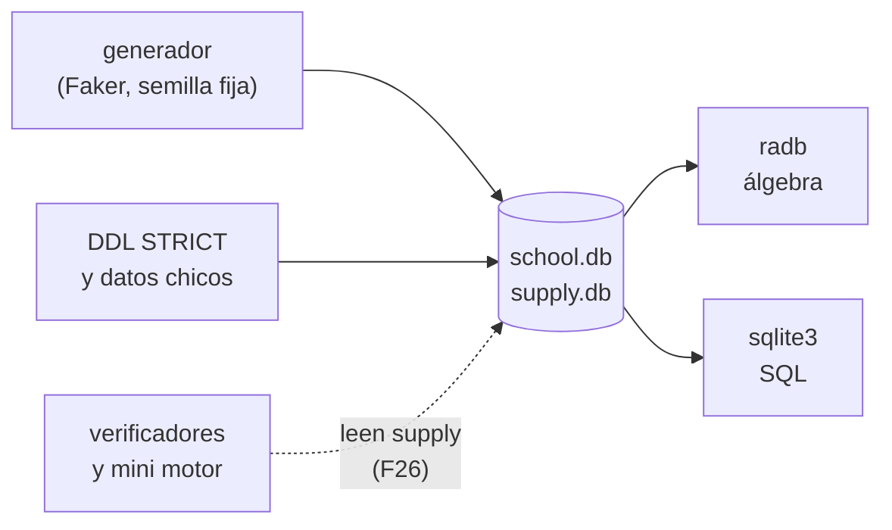

# 🧊 Contrato de nombres
## El motor de motores — La teoría que todos los gestores SQL implementan

Este documento cierra, **antes de escribir la primera fase**, los nombres que muchas fases arrastran y
que no se pueden cambiar después sin tocarlas todas: los archivos del curso, las bases de ejemplo,
las herramientas, los contenedores de producción y los de git.

> 🧭 **Manda sobre los entregables, no sobre el marco.** Va por debajo del
> [alcance](alcance-del-proyecto.md) y de la [guía](guia-de-estilo-y-convenciones.md), al lado del
> [diccionario](diccionario-de-terminos.md) (que fija las palabras; este fija los identificadores), y
> por encima de las propuestas, las plantillas, los prompts y cualquier fase ya escrita. **Si una fase
> necesita un nombre que aquí no está, se agrega aquí primero.**
> **Origen:** reúne lo que estaba repartido entre la guía §5 y §13, el alcance §8, las propuestas, el
> plan de producción §2.4 y los hallazgos de P8. Esos documentos siguen diciendo lo suyo; si alguno
> diverge de este, gana este y el otro se corrige.
> **Vigencia:** 2026-10-05.

---

## 1. 🧭 Las reglas del contrato

1. **No se inventan valores nuevos** en una fase. Todo nombre de relación, atributo, archivo,
   verificador, contenedor o tag sale de aquí.
2. **No se renombra** lo ya publicado. Si un nombre resultó malo, se documenta la excepción; no se
   arrastra el cambio por cuarenta documentos.
3. **Lo que todavía no se puede fijar se marca ⏳** con la tanda que lo fija, y esa tanda lo escribe
   en §8 antes de cerrar.
4. **Nunca `latest`, `*` ni rangos de versión** donde el curso fija un valor exacto. Las versiones
   no viven aquí: viven en `a01`–`a03` (D-07).

---

## 2. 🌍 Valores globales

| Qué | Valor | Nota |
|---|---|---|
| Prefijo de recursos de Docker | `mdm-` (*motor de motores*) | contenedores, imágenes, redes y volúmenes de la producción y de los apéndices de contenedores |
| Etiqueta de recursos | `curso=01-bases` | solo se borra lo que la lleva |
| Proyecto de Compose de producción | `mdm` | `name:` de `prompts/verificacion-de-laboratorio/compose.yaml` |
| Red de producción | `mdm-net` | con la etiqueta |
| Montaje del repositorio | `/curso` | la raíz del repositorio; el directorio de trabajo es `/curso/cursos-bd/gestores-sql/01-bases` |
| Puertos de las pruebas de la sesión | ninguno; si hace falta, aleatorio (`-p 127.0.0.1::PUERTO`), leído con `docker port` | nunca uno fijo ni el de por defecto del producto |
| Puertos del contenedor del lector (`a09`, `aca-02`) | ⏳ los fija `a09` en T12 | el curso puede publicar los de por defecto (5432), que son los que el lector reconoce; la decisión se registra en §8 |
| Directorio de `zz-code/` | `zz-code/gestores-sql-01-bases-<AAAAMMDD>-<hash>/` | lo crea `python3 zz-code/nuevo.py gestores-sql-01-bases` |
| Lenguaje de los verificadores y del mini motor | Python 3.10 o superior, solo biblioteca estándar | D9, A |
| Lenguaje de AC09 | ANSI C (C89), sin dependencias | GCC con `-std=c89 -pedantic -Wall -Wextra -Werror` (H12) |

---

## 3. 🗂️ La estructura de archivos

```text
01-bases/
├── README.md                          se escribe al final (T16)
├── 0-ESTRUCTURA-CURSO.md              se escribe al final (T16)
├── INSTINTOS.md                       documento vivo, nace en T0
├── .gitignore                         único del curso, nace en T0 (guía §18.4)
├── 00-el-sistema-de-bases-de-datos.md … 37-mas-alla-del-nucleo.md
├── ac00-navegar-contra-declarar.md … ac09-pedidos-en-c.md
├── a01-sqlite-nativo.md … a10-notaciones-de-diagramas.md
├── aca-01-herramientas-nativas.md, aca-02-contenedores.md
├── soluciones/                        un solucionario por fase, mismo nombre
├── src/
│   ├── requirements.txt               el de a02, modelo: el de P8
│   ├── a04-las-bases-de-ejemplo/      DDL, datos chicos, generador
│   ├── a05-verificadores-y-mini-motor/
│   ├── a09-el-curso-en-un-contenedor/
│   ├── aca-02-contenedores/
│   ├── ac01-archivos-registros-y-punteros/   L1 y L5
│   ├── ac02-modelo-jerarquico/        L3
│   ├── ac03-modelo-de-red/            L2
│   ├── ac04-el-gran-debate/           L4
│   ├── ac05-los-herederos/            ZODB
│   └── ac09-pedidos-en-c/
└── prompts/                           maquinaria; el lector no la abre ni viaja al publicar
```

Los nombres exactos de las cuarenta y ocho fases y los doce apéndices del camino base y del bloque
están en la guía §5.2, que manda sobre ellos; este árbol solo fija las carpetas. Una fase que deje
código propio fuera de `a04` y `a05` crea `src/NN-slug/` con el nombre exacto de la fase, y lo agrega
a §8.

---

## 4. 🧱 Las herramientas y el laboratorio

### 4.1 Lo que usa el lector

| Nombre | Qué es | Dónde vive | Lo fija |
|---|---|---|---|
| `sqlite3` | el CLI de SQLite, nativo | `a01` | P8 |
| `.venv` | el entorno virtual del curso, en la raíz del curso | `a02` | ⏳ `a02` (T1) confirma la ruta |
| `radb` | el intérprete de álgebra | `a03` | P8 |
| el generador | el script de Faker de `a04` | `src/a04-las-bases-de-ejemplo/` | ⏳ `a04` (T1) |
| los verificadores | `closure`, `min_cover`, `keys` (F15); `normal_form` (F16); `njb`, `chase`, `preserves` (F17); `synth_3nf`, `bcnf_decompose` (F18); `bplus` (F24); `conflict_serializable` (F29); candidato `ext_hash` / `linear_hash` (F22) | `src/a05-verificadores-y-mini-motor/` | los nombres, aquí; el formato de entrada, F15 (§8) |
| el mini motor | operadores como iteradores (`open`, `next`, `close`) con contador de bloques | `src/a05-verificadores-y-mini-motor/` | ⏳ F26 (T10): módulo y nombres de clase |
| L1–L5 | los laboratorios del bloque A.C. | `src/acNN-…/` (§3) | ⏳ cada fase A.C. |

### 4.2 Los contenedores de producción

Ninguno es material del curso: verifican lo que se escribe. Se registran en el plan de producción
§2.4 en la misma sesión que los crea.

| Contenedor | Imagen | Para qué | Tanda |
|---|---|---|---|
| `mdm-lab` | `mdm-lab:p8` | SQLite, Python, `radb`, Faker; verificadores y mini motor | P8 (existe) |
| `mdm-pg` | ⏳ | el PostgreSQL de `a09` y F34 | T12 |
| `mdm-ac` | ⏳ | GnuCOBOL, Harbour, GCC, LMDB y ZODB | T14 |
| `mdm-yottadb` | ⏳ (sobre `yottadb/yottadb:r2.06`) | AC08 | T15 |
| `mdm-linux-<distro>` | la de cada distribución | recetas Linux de `a01` y `a02`; efímeros (`--rm`) | T1 |

Cómo se relacionan las piezas del lector:



---

## 5. 🗄️ Datos

| Base | Archivo | Relaciones | La define |
|---|---|---|---|
| `school` | `school.db` | `school_year`, `term`, `grade_level`, `section`, `subject`, `teacher`, `student`, `guardian`, `enrollment`, `teaching_assignment`, `assessment`, `score`, `classroom` | alcance §8 |
| `supply` con pedidos | `supply.db` | `supplier`, `part`, `project`, `shipment`, `customer`, `sales_order`, `order_line` | alcance §8 |
| Volúmenes generados | ⏳ `a04` (T1) fija el nombre de archivo de cada volumen | las mismas relaciones | `a04` |

- **Los nombres de las relaciones son definitivos.** Los atributos (`student_id`, `unit_price`…) los
  fija `a04` en T1, con las convenciones del diccionario §5.5, y se copian a §8 al cerrar T1.
- **Atributos que ya están fijados** porque los citan las fichas: `order_line.unit_price` frente a
  `part.price` (F15, F20), y `score` como la nota con su escala por país (F04).
- **Tipos:** solo los de `STRICT` que `radb` tipa bien: `INTEGER`, `REAL`, `TEXT`; fechas en `TEXT`
  ISO 8601; nunca `ANY` ni `BLOB` (H3).
- **Relaciones abstractas** `R(A, B, C, …)` y **planes** sobre ítems `X`, `Y` (diccionario §5.6).

---

## 6. 🧩 Los diagramas

| Qué | Nombre en el diagrama | Ejemplo |
|---|---|---|
| Entidad (boceto o pata de gallo) | el nombre de la relación de §5 | `student`, `sales_order` |
| Relación del ER | el verbo del diccionario §5.4 | `enrolls`, `places` |
| Atributo | el atributo de §5 | `final_score` |
| Clase en UML | la entidad en PascalCase | `StaffMember`, `Teacher` |
| Nodo de un árbol de consulta | el operador en Unicode con su condición | `σ city = 'Lima'` |
| Transacción en un grafo | `T1`, `T2`… | |

La sintaxis de cada tipo está en la guía §3.2.

---

## 7. 🏷️ Git

Git lo maneja Oskar: las sesiones no commitean ni crean tags; los dejan escritos en la bitácora del
plan.

- **Tags de fase:** `fase-NN-<slug>` en el camino base y `ac-fase-<slug>` en el bloque A.C., para que
  `git tag -l 'fase-*'` siga siendo el índice limpio del camino base.
- **Tags de apéndice**, solo los que dejan código en `src/`: `apendice-aNN-<slug>` y
  `apendice-aca-NN-<slug>`.
- **Commits:** prefijo `01-bases fNN:` (ejercicios `01-bases fNN ejM:`) y `01-bases acNN:`.

---

## 8. 🔒 Fijado por fase

Cada tanda que fija nombres nuevos agrega aquí su subsección **al cerrarse**, con fecha y tanda. No se
reescriben las anteriores. Lo que espera tanda: el `.venv` y los requisitos (T1, `a02`), los
atributos y los archivos de volumen (T1, `a04`), el formato de entrada de relaciones y DF (T7, F15),
el módulo y las clases del mini motor (T10, F26), los puertos y las imágenes de `a09` y `mdm-pg`
(T12), los de `mdm-ac` (T14) y `mdm-yottadb` (T15).

*(Vacío al 2026-10-05.)*

---

## 9. ❓ Qué hacer si falta un nombre

1. Se busca aquí, en el diccionario §5 y en las fases ya escritas.
2. Si no existe, se propone siguiendo las convenciones del diccionario §5.6 y se agrega aquí, con la
   fase que lo estrena.
3. Si choca con uno existente, gana el existente.
