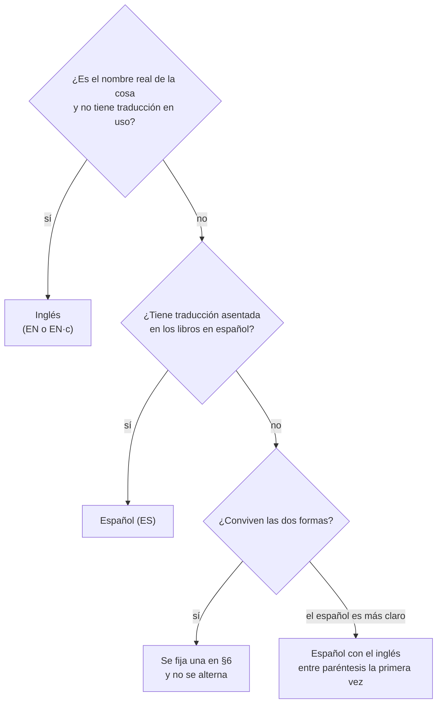

# 📖 Diccionario de términos
## El motor de motores — La teoría que todos los gestores SQL implementan

> **Qué es este documento:** qué palabra se escribe para cada concepto del curso —si se queda en
> inglés, si tiene traducción asentada o si se fija una— y cómo se nombra en el código cada cosa de
> las bases de ejemplo. La [guía](guia-de-estilo-y-convenciones.md) §3 lo cita y no lo copia;
> `a07-notacion-y-glosario.md` lo publica para el lector, con los símbolos y las notaciones de los
> libros, y crece en la misma sesión que este.
> **Regla de una línea:** el código y los identificadores en inglés, también en el álgebra (D17); la
> narrativa en español; los términos de la teoría, como los dicen los libros base y la documentación
> que el lector va a leer después.
> **Precedencia:** debajo del [alcance](alcance-del-proyecto.md) y de la guía, al lado del
> [contrato de nombres](contrato-de-nombres.md) (este fija las palabras; el contrato, los
> identificadores) y por encima de las propuestas, las plantillas, los prompts y las fases.
> **Vigencia:** 2026-10-05. Escrito en la tanda P11 a partir de la plantilla de diccionario de los
> lineamientos de producción: se recortaron las áreas que el curso no toca (APIs, nube, Kubernetes,
> frontend, IA) y se agregaron los términos de la teoría de bases de datos.

**Salto rápido:** [1](#1--cómo-se-decide) · [2](#2-️-cómo-se-escribe-cada-tratamiento) · [3](#3--los-términos-por-bloque) · [4](#4--calcos-y-falsos-amigos) · [5](#5--el-código-de-las-bases-de-ejemplo) · [6](#6-️-decisiones-del-curso) · [7](#7--cómo-se-agrega-un-término)

---

## 1. 🧭 Cómo se decide

Tres preguntas, en este orden:

1. **¿Es el nombre real de la cosa** —el que aparece en la documentación del motor, en el mensaje de
   error, en el paper que la definió— **y no tiene una traducción que el oficio use?** Se queda en
   inglés: *join*, *buffer pool*, *chase*, *write skew*. Traducirlo obligaría al lector a
   retraducir cada vez que abre una documentación.
2. **¿Tiene una traducción asentada** en los libros y en los cursos universitarios en español? Se
   escribe en español: dependencia funcional, clausura, clave candidata, forma normal, índice,
   bitácora.
3. **¿Conviven las dos formas?** Se **fija una** en §6 y no se alterna dentro de un documento. Si el
   español es más claro pero el inglés es el que se busca, español con el inglés entre paréntesis
   **la primera vez** en cada documento: join sin pérdida (*lossless join*).

Lo que **nunca** se hace: inventar una traducción, alternar dos formas en un mismo documento, o
afirmar cómo traduce un término una edición en español de un libro: P9 no pudo verificarlo
(`inventario-de-fuentes.md` §4), y la columna correspondiente de `a07` va con "sin verificar".

---

## 2. ✍️ Cómo se escribe cada tratamiento

| Clave | Significa | Cómo se escribe | Ejemplo |
|---|---|---|---|
| **EN** | inglés asimilado | sin cursiva, plural español | el join, los triggers |
| **EN·c** | inglés técnico no asimilado | en cursiva cada vez que no es código | el *chase*, el *write skew* |
| **ES** | traducción asentada | español, sin glosa | la clausura, la bitácora |
| **ES (EN)** | español con glosa | español; el inglés entre paréntesis la primera vez por documento | recubrimiento mínimo (*minimal cover*) |
| **cód.** | nombre propio de SQL, SQLite, `radb` o Python | en `código`, nunca traducido | `EXCEPT`, `PRAGMA foreign_keys`, `\project` |

- **Género:** el que usa el oficio: *el* join, *el* trigger, *el* *chase*, *la* FNBC, *el* B+.
- **Plural:** el inglés asimilado se pluraliza en español (los joins, los triggers).
- **Siglas:** se desarrollan la primera vez que aparecen en un documento: forma normal de
  Boyce-Codd (FNBC), dependencia multivaluada (DMV), bloqueo en dos fases (2PL). Las universales
  (SQL, DBMS, ACID) no.
- **Las formas normales** se escriben 1FN, 2FN, 3FN, FNBC, 4FN, 5FN y FNDC (*DKNF*), sin punto ni
  espacio.
- **Los símbolos** del álgebra y de las dependencias son los de la guía §3.1; este documento fija las
  palabras, no los símbolos.

---

## 3. 📚 Los términos, por bloque

Columnas fijas. "Nota" dice por qué, o con qué no confundirlo. Los marcados ⚖️ tienen decisión en
§6.

### 3.1 El terreno y el modelado conceptual (bloques 0 y I)

| Inglés | Se escribe | Trato | Nota |
|---|---|---|---|
| database / database system | base de datos / sistema de bases de datos | ES | "la base" en prosa corrida |
| DBMS | DBMS | EN | sistema gestor de bases de datos, desarrollado la primera vez |
| catalog / data dictionary | catálogo / diccionario de datos | ES | |
| schema / state (instance) | esquema / estado | ES | intensión y extensión, como sinónimos formales |
| three-schema architecture | arquitectura de tres esquemas (ANSI/SPARC) | ES | |
| logical / physical data independence | independencia lógica / física | ES | |
| mapping | correspondencia (*mapping*) | ES (EN) | en F13, "mapeo": ⚖️ |
| entity / entity type | entidad / tipo de entidad | ES | |
| relationship / relationship type | relación / tipo de relación ⚖️ | ES | choca con la relación del modelo relacional |
| attribute (simple, composite, multivalued, derived) | atributo (simple, compuesto, multivaluado, derivado) | ES | |
| weak entity / partial key / identifying relationship | entidad débil / clave parcial / relación identificadora | ES | |
| cardinality ratio / participation | razón de cardinalidad / participación (total, parcial) | ES | no confundir con la cardinalidad de una relación |
| min-max notation | notación min-max | ES | |
| specialization / generalization | especialización / generalización | ES | |
| disjoint / overlapping | disjunta / solapada | ES | |
| total / partial (completeness) | total / parcial | ES | |
| category (union type) | categoría (tipo unión) | ES | |
| lattice | retículo | ES | |
| crow's foot notation | pata de gallo (*crow's foot*) | ES (EN) | la notación del curso desde F03 (D20) |
| class diagram | diagrama de clases | ES | UML, en F03 y `a10` |
| sketch | boceto | ES | el diagrama con óvalos de F00–F02 |

### 3.2 El modelo relacional y sus lenguajes (bloque II)

| Inglés | Se escribe | Trato | Nota |
|---|---|---|---|
| relation / tuple / attribute / domain | relación / tupla / atributo / dominio | ES | "tabla", "fila" y "columna" solo para SQL |
| degree / cardinality | grado / cardinalidad | ES | |
| superkey / key / candidate key | superclave / clave / clave candidata | ES | "clave", nunca "llave" ⚖️ |
| primary / alternate / foreign key | clave primaria / alternativa / foránea | ES | |
| entity / referential integrity | integridad de entidad / referencial | ES | |
| relational algebra | álgebra relacional | ES | |
| selection / projection / rename | selección / proyección / renombramiento | ES | |
| Cartesian product | producto cartesiano | ES | |
| union compatibility | compatibilidad de unión | ES | |
| set difference | diferencia | ES | |
| join (theta, equi, natural) | join (θ-join, equijoin, join natural) | EN | nunca "reunión" ni "combinación" |
| division | división | ES | |
| semijoin / antijoin | semijoin / antijoin | EN | |
| outer join (left, right, full) | *outer join* (izquierdo, derecho, completo) | EN·c | |
| aggregate function / grouping | función de agregación / agrupamiento | ES | |
| tuple / domain relational calculus | cálculo relacional de tuplas / de dominios | ES | |
| safe expression | expresión segura | ES | |
| relational completeness | completitud relacional | ES | |
| multiset (bag) | multiconjunto ⚖️ | ES | *bag* como glosa la primera vez |
| three-valued logic | lógica de tres valores | ES | `UNKNOWN` en código |
| view / materialized view / updatable view | vista / vista materializada / vista actualizable | ES | |
| recursive query | consulta recursiva | ES | `WITH RECURSIVE` en código |

### 3.3 Diseño y normalización (bloque III)

| Inglés | Se escribe | Trato | Nota |
|---|---|---|---|
| update / insertion / deletion anomaly | anomalía de modificación / inserción / borrado | ES | |
| spurious tuple | tupla espuria | ES | |
| functional dependency | dependencia funcional (DF) | ES | |
| Armstrong's axioms / inference rules | axiomas de Armstrong / reglas de inferencia | ES | |
| soundness / completeness | solidez / completitud | ES | |
| attribute closure / closure of F | clausura de atributos / clausura de F | ES | nunca "cierre" |
| minimal cover / extraneous attribute | recubrimiento mínimo (*minimal cover*) / atributo extraño | ES (EN) | |
| prime / nonprime attribute | atributo primo / no primo | ES | |
| normal form | forma normal | ES | 1FN … 5FN, FNBC (§2) |
| decomposition | descomposición | ES | |
| lossless (nonadditive) join | join sin pérdida (*lossless join*) | ES (EN) | |
| dependency preservation | preservación de dependencias | ES | |
| chase (tableau) | *chase* (el algoritmo de la tabla) | EN·c | |
| synthesis | síntesis | ES | |
| multivalued / join / inclusion dependency | dependencia multivaluada (DMV) / de join / de inclusión | ES | |
| denormalization | desnormalización | ES | |
| partitioning (vertical, horizontal) | particionado (vertical, horizontal) | ES | |

### 3.4 Almacenamiento, índices y operadores (bloques IV y V)

| Inglés | Se escribe | Trato | Nota |
|---|---|---|---|
| block / page | bloque / página | ES | bloque en el modelo; página en SQLite |
| blocking factor | factor de bloqueo | ES | |
| spanned / unspanned | *spanned* / *unspanned* | EN·c | |
| heap file / sorted file | archivo *heap* / archivo ordenado | ES (EN) | |
| buffer pool / replacement policy | *buffer pool* / política de reemplazo | EN·c / ES | LRU, *clock*, MRU |
| static / extendible / linear hashing | hashing estático / extensible / lineal | EN | |
| bucket / overflow | cubeta (*bucket*) / desborde | ES (EN) | |
| global / local depth | profundidad global / local | ES | |
| primary / clustering / secondary index | índice primario / de agrupamiento / secundario | ES | nunca "clusterizado" |
| dense / sparse index | índice denso / disperso | ES | |
| multilevel index / fan-out | índice multinivel / *fan-out* | ES / EN·c | |
| B-tree / B+-tree / leaf / internal node | árbol B / árbol B+ / hoja / nodo interno | ES | |
| split / merge / redistribution | división / fusión / redistribución | ES | |
| bulk loading | carga masiva (*bulk loading*) | ES (EN) | |
| grid file / bitmap index / inverted list | índice de cuadrícula / índice bitmap / lista invertida | ES | |
| R-tree / LSM tree / memtable / compaction | árbol R / árbol LSM / *memtable* / compactación | ES / EN·c | |
| write / read amplification | amplificación de escritura / de lectura | ES | |
| external sorting / merge sort | ordenamiento externo / *merge sort* | ES / EN·c | |
| nested loop / sort-merge / hash join | *nested loop* / *sort-merge* / *hash join* | EN·c | "join por bloques", "join por índice" en español |
| pipelining / materialization | *pipelining* / materialización | EN·c / ES | |
| iterator (open, next, close) | iterador | ES | `open`, `next`, `close` en código |
| query tree / query graph | árbol de consulta / grafo de consulta | ES | |
| selectivity / cardinality estimation | selectividad / estimación de cardinalidad | ES | |
| histogram / statistics | histograma / estadísticas | ES | |
| left-deep / bushy plan | plan izquierdo / arbustivo | ES | "plan" de ejecución; ver *schedule* en §3.5 ⚖️ |
| dynamic programming | programación dinámica | ES | |

### 3.5 Transacciones, recuperación y administración (bloques VI y VII)

| Inglés | Se escribe | Trato | Nota |
|---|---|---|---|
| transaction | transacción | ES | |
| schedule | plan (*schedule*) ⚖️ | ES (EN) | "plan de transacciones" si convive con un plan de ejecución |
| conflicting operations | operaciones en conflicto | ES | |
| conflict / view serializability | serializabilidad por conflicto / por vistas | ES | |
| precedence graph | grafo de precedencia | ES | |
| blind write | escritura ciega | ES | |
| recoverable / cascadeless / strict schedule | plan recuperable / sin abortos en cascada / estricto | ES | |
| shared / exclusive lock | bloqueo compartido / exclusivo | ES | |
| two-phase locking | bloqueo en dos fases (2PL) | ES | básico, conservador, estricto, riguroso |
| deadlock / starvation | *deadlock* / *starvation* | EN·c | |
| wait-die / wound-wait | *wait-die* / *wound-wait* | EN·c | |
| wait-for graph | grafo de espera | ES | |
| timestamp ordering / Thomas write rule | ordenamiento por marcas de tiempo / regla de escritura de Thomas | ES | |
| MVCC / optimistic validation | MVCC / validación optimista | EN / ES | |
| intention lock / multiple granularity | bloqueo de intención / granularidad múltiple | ES | |
| phantom | fantasma | ES | |
| dirty / nonrepeatable read | lectura sucia / no repetible | ES | |
| isolation level / snapshot isolation | nivel de aislamiento / *snapshot isolation* | ES / EN·c | |
| write skew | *write skew* | EN·c | |
| log / log record / LSN | bitácora / registro de bitácora / LSN ⚖️ | ES | "log" solo en nombres propios (`-wal`) |
| write-ahead logging | la regla WAL (*write-ahead logging*) | ES (EN) | |
| steal / force | *steal* / *force* | EN·c | |
| deferred / immediate update | actualización diferida / inmediata | ES | |
| checkpoint / fuzzy checkpoint | *checkpoint* / *fuzzy checkpoint* | EN·c | |
| shadow paging | *shadow paging* | EN·c | |
| dirty page table / transaction table | tabla de páginas sucias / tabla de transacciones | ES | ARIES |
| backup (full, incremental, differential) | respaldo (completo, incremental, diferencial) | ES | |
| point-in-time recovery | recuperación a un punto en el tiempo | ES | |
| RPO / RTO | RPO / RTO | EN | desarrollados la primera vez |
| discretionary / mandatory access control | control discrecional / obligatorio | ES | |
| grant option / authorization graph | *grant option* / grafo de autorización | EN·c / ES | `GRANT`, `REVOKE` en código |
| SQL injection / parameterized query | inyección SQL / consulta parametrizada | ES | |
| trigger / active database | trigger ⚖️ / base de datos activa | EN / ES | |
| event-condition-action | evento-condición-acción (ECA) | ES | |
| termination / confluence / triggering graph | terminación / confluencia / grafo de activación | ES | |
| two-phase commit | commit en dos fases (2PC) | ES | |

### 3.6 El bloque A.C.

| Inglés | Se escribe | Trato | Nota |
|---|---|---|---|
| navigational / declarative | navegacional / declarativo | ES | |
| hierarchical / network model | modelo jerárquico / de red | ES | |
| segment / twin / PCB / DBD | segmento / gemelo / PCB / DBD | ES / EN | |
| record type / set / owner / member | tipo de registro / *set* / dueño / miembro | ES / EN·c | |
| link record | registro de enlace | ES | |
| database key | *database key* | EN·c | |
| currency indicators | indicadores de *currency* | ES (EN·c) | |
| global (MUMPS) | *global* | EN·c | `^school(...)` en código |
| copy-on-write | copia en escritura | ES | |
| N+1 problem | problema N+1 | ES | |

---

## 4. 🚫 Calcos y falsos amigos

Lo que no se escribe, y qué va en su lugar.

| No se escribe | Se escribe | Por qué |
|---|---|---|
| llave (primaria, foránea) | clave | §6 |
| cierre (de atributos) | clausura | término asentado en los cursos de teoría |
| reunión, combinación (por *join*) | join | §3.2 |
| índice clusterizado | índice de agrupamiento | calco de *clustered* |
| registro, campo (por tupla, atributo) | tupla, atributo | "registro" y "campo" solo para archivos (bloque IV y A.C.) |
| tabla (por relación, en un contexto formal) | relación | la diferencia es el 🪞 de F04 |
| query, queries | consulta | |
| performance | rendimiento, costo | el curso calcula costos, no mide rendimiento |
| eventualmente (= *eventually*) | finalmente, con el tiempo | "eventualmente" significa "quizás" |
| asumir (= *assume*) | suponer, dar por hecho | §6 |
| soportar (= *support*) | admitir, implementar | |
| setear, chequear, testear | asignar, comprobar, probar | |
| encriptar | cifrar | |
| en base a | con base en, a partir de | |
| a nivel de | en | "a nivel de esquema" → "en el esquema" |
| normalizar (por "dividir tablas") | normalizar, con su forma normal destino | el error que desarma la guía §4.5 |

---

## 5. 💻 El código de las bases de ejemplo

Lo que aquí se fija lo usa el [contrato de nombres](contrato-de-nombres.md) §5. **Los nombres de las
relaciones son los del alcance §8 y no cambian**; los atributos los fija `a04` en T1, y desde ese
momento pasan al contrato §8.

### 5.1 Qué se traduce al inglés y qué no

| Cosa | ¿Inglés? | Ejemplo |
|---|---|---|
| Relación, atributo, tabla, columna | ✅ | `supplier.city` |
| Relación y atributo dentro del álgebra y del cálculo | ✅ | `π name (σ city = 'Lima' (supplier))` |
| Entidad, relación y atributo dentro de un diagrama | ✅ | `student`, `enrolls`, `final_score` |
| Función, módulo y argumento de los verificadores | ✅ | `closure(attrs, fds)` |
| Nombre de archivo de código, de base, de `.ra` | ✅ | `school.db`, `division-red-parts.ra` |
| Comentario en el código | ❌ | `-- la escala depende del país` |
| Nombre del dominio en la prosa | ❌ | se sigue diciendo "alumno", "pedido", "proveedor" |
| Etiqueta de comentario dentro de un diagrama | ❌ | `"discriminador"` |
| Nombre de archivo `.md`, títulos | ❌ | `15-dependencias-funcionales.md` |

### 5.2 Entidades

**`school`**:

| Español | Código | Nota |
|---|---|---|
| año escolar | `school_year` | |
| período (trimestre, semestre) | `term` | |
| nivel o grado escolar | `grade_level` | nunca `grade` solo |
| sección (curso con su letra) | `section` | "7.º A" |
| asignatura | `subject` | con sus prerrequisitos (recursión) |
| docente | `teacher` | |
| alumno | `student` | |
| apoderado | `guardian` | la categoría de F03 |
| matrícula | `enrollment` | |
| asignación docente | `teaching_assignment` | |
| evaluación | `assessment` | |
| nota (calificación) | `score` | nunca `grade` solo |
| sala | `classroom` | |

**`supply` con pedidos**:

| Español | Código | Nota |
|---|---|---|
| proveedor | `supplier` | el clásico de Date |
| parte | `part` | |
| proyecto | `project` | |
| envío | `shipment` | la relación ternaria de 5FN |
| cliente | `customer` | |
| pedido | `sales_order` | nunca `order`, que es palabra reservada en SQL |
| línea de pedido | `order_line` | |

### 5.3 Estados

Las bases de ejemplo no tienen máquina de estados de dominio. Los estados de una transacción (activa,
parcialmente confirmada, confirmada, fallida, terminada) son vocabulario de teoría: entran en `a07`
cuando F29 los introduzca, en español; en código, `active`, `partially_committed`,
`committed`, `failed`, `terminated`.

### 5.4 Verbos de las relaciones en los diagramas

Los nombres de relación de un diagrama ER o de pata de gallo van en inglés, en tercera persona, desde
el punto de vista de la primera entidad.

| Español | Código |
|---|---|
| (el alumno) se matricula en | `enrolls` |
| (el docente) dicta | `teaches` |
| (el apoderado) representa a | `represents` |
| (el cliente) hace | `places` |
| (el pedido) contiene | `contains` |
| (la parte) aparece en | `appears in` |
| (el proveedor) suministra | `supplies` |
| (la asignatura) requiere | `requires` |
| (el subtipo) es un | `is a` |

### 5.5 Campos frecuentes

| Español | Código |
|---|---|
| identificador | `<relación>_id` (`student_id`, `part_id`) |
| nombre | `name` |
| ciudad | `city` |
| fecha | `<qué>_date` (`order_date`), en `TEXT` ISO 8601 (H3) |
| cantidad | `quantity` |
| precio de la parte / precio de la línea | `price` / `unit_price` |
| número de línea | `line_no` |

### 5.6 Convenciones por tipo de artefacto

| Artefacto | Convención | Ejemplo |
|---|---|---|
| Relación / tabla | snake_case, **singular** | `order_line` |
| Atributo / columna | snake_case | `unit_price` |
| Relación abstracta y sus atributos | una mayúscula por atributo, sin comas | `R(A, B, C)`, `AB → C` |
| Ítem de un plan de transacciones | mayúscula | `r1(X); w2(X); c1` |
| Función o verificador de Python | snake_case, verbo o sustantivo | `closure`, `min_cover`, `bcnf_decompose` |
| Módulo de Python | snake_case | `mini_engine.py` |
| Clase del mini motor | PascalCase | `TableScan`, `NestedLoopJoin` |
| Archivo de base | `<base>.db` | `supply.db` |
| Archivo de consulta de `radb` | kebab-case, `.ra` | `division-red-parts.ra` |
| Contenedor, imagen, red, volumen | kebab-case con prefijo `mdm-` | `mdm-lab`, `mdm-net` |

---

## 6. ⚖️ Decisiones del curso

Las dos formas conviven en el oficio; el curso fija una, aquí, y no la alterna. ✅ fijada por la guía
o el alcance · 🟡 por defecto, a revisar por Oskar.

| Término | Opciones | Valor de este curso | Estado |
|---|---|---|---|
| *key* | llave · clave | **clave**, como en los libros base y en la guía | ✅ |
| *library* | librería · biblioteca | **biblioteca** ("la biblioteca estándar de Python") | ✅ |
| *log* (recuperación) | log · bitácora | **bitácora**; *log* solo en nombres propios (WAL, `-wal`) | ✅ |
| *schedule* | plan · planificación · *schedule* | **plan** (*schedule*); "plan de transacciones" si en la misma página hay un plan de ejecución | ✅ |
| *multiset* / *bag* | multiconjunto · bolsa | **multiconjunto**; "bolsa" solo como glosa de *bag* | 🟡 |
| *relationship* (ER) | relación · interrelación · vínculo | **relación**; donde convive con la relación del modelo relacional (F04, F13) se dice "relación del ER" | 🟡 |
| *mapping* (ER → relacional) | mapeo · correspondencia · traducción | **mapeo**, que es el que usa la propuesta (F13); "correspondencia" para los *mappings* de ANSI/SPARC | 🟡 |
| *trigger* | trigger · disparador | **trigger** (EN), como en el título de F36 | ✅ |
| *assume* | asumir · suponer | **suponer** | ✅ |
| *cache* | caché · cache | **caché** en prosa, `cache` en código | ✅ |
| *environment* (Python) | entorno · ambiente | **entorno** ("entorno virtual", `venv`) | ✅ |
| *build* (AC09) | compilación · build | **compilación** | ✅ |

---

## 7. ➕ Cómo se agrega un término

1. **Se busca primero** aquí, en `a07` y en las fases ya escritas: si ya se usa una forma, se adopta
   esa.
2. **Se aplican las tres preguntas de §1** y se elige el tratamiento de §2.
3. **Se agrega la fila** en su bloque, con la nota de por qué si no es evidente. Si admite dos formas,
   a §6 con propuesta 🟡, y la cierra Oskar.
4. **Se agrega a `a07`** en la misma sesión, con la fase y el número de definición donde se define.
5. **Si se cambia un término ya usado**, se reemplaza en todo el curso en la misma edición (con
   `perl -CSD -Mutf8 -pi`, revisando los falsos positivos a mano).
