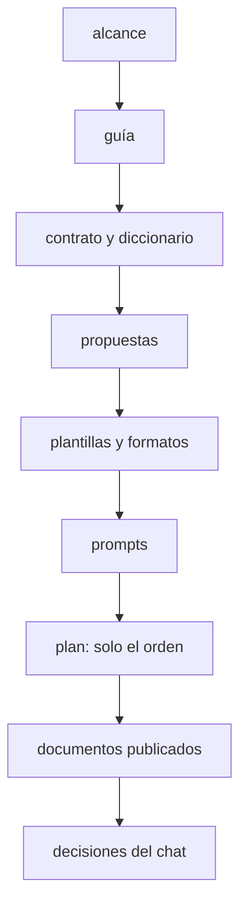

# 🧰 `prompts/` — la maquinaria del curso
## Ruta NoSQL Lite

Este directorio no es material del curso: es **lo que se usa para escribirlo**. El lector nunca lo
abre, y no viaja al repositorio público del curso. Quien escribe una fase lo lee antes de teclear la
primera línea.

> **Estado:** en escritura. Tandas 0, 1 y 2 cerradas (F00–F06 y F15–F16; el boss del Bloque III
> espera a la Tanda 4); sigue la Tanda 3 cuando Oskar lo indique. El detalle, en el plan de
> producción.

---

## 📖 Qué hay aquí, y cuándo se lee

| Documento | Qué es | Cuándo se lee |
|---|---|---|
| [`alcance-del-proyecto.md`](alcance-del-proyecto.md) | qué enseña el curso, a quién y con qué límites; las decisiones 1–20 y D-01–D-13 (§12) | antes de escribir cualquier cosa |
| [`guia-de-estilo-y-convenciones.md`](guia-de-estilo-y-convenciones.md) | cómo se escribe; checklist en §15, excepciones en §16, lineamientos en §18 | en cada sesión, siempre |
| [`diccionario-de-terminos.md`](diccionario-de-terminos.md) | qué palabra para cada concepto; el código del dominio | cada vez que dudes de un término |
| [`contrato-de-nombres.md`](contrato-de-nombres.md) | perfiles, puertos, datasets, estructura y tags | antes de cada fase, y cada vez que haga falta un nombre |
| [`propuesta-fases-y-alcance.md`](propuesta-fases-y-alcance.md) | la ficha de cada fase; el resumen en §9 y los nombres en §10 | en cada sesión de fase |
| [`propuesta-apendices-y-alcance.md`](propuesta-apendices-y-alcance.md) | la ficha de cada apéndice | en cada sesión de apéndice |
| [`plantillas-de-capitulo.md`](plantillas-de-capitulo.md) | los esqueletos de fase A, fase B, Bloque 0 y apéndice | al empezar y al cerrar cada documento |
| [`formato-bitacora-de-medicion.md`](formato-bitacora-de-medicion.md) | la ficha de medición, la apuesta, la rotura, el catálogo y los instintos | en cada fase B, y al alimentar los documentos vivos |
| [`formato-de-miniproyectos.md`](formato-de-miniproyectos.md) | la plantilla de un `h-mini` y las decisiones sobre ellos | al revisar el `h-mini` de una familia |
| [`prompts-de-fase.md`](prompts-de-fase.md) y [`prompts-de-apendice.md`](prompts-de-apendice.md) | el marco común y un bloque por documento | al abrir cada sesión |
| `_desechable-plan-de-produccion.md` | tandas, estado, deuda de enlaces, bitácora, checklist y `zz-code/` | al empezar y al cerrar cada sesión |
| [`verificacion-de-laboratorio/hallazgos.md`](verificacion-de-laboratorio/hallazgos.md) | la verificación de T10 (H1–H13), con sus scripts | cuando una fase toca algo que T10 midió |
| [`analisis-modelos-no-sql.md`](analisis-modelos-no-sql.md) y [`propuestas-historias.md`](propuestas-historias.md) | el porqué de las diez familias y las empresas candidatas | como registro; no se cambian |
| `verificar-corpus.py` y `verificador_base.py` | las validaciones base y las propias del curso | al cerrar cada tanda |

**Orden de autoridad**, cuando dos se contradicen: (1) el alcance, (2) la guía, (3) el contrato y el
diccionario, (4) las propuestas, (5) las plantillas y los formatos, (6) los prompts, (7) el plan,
solo sobre el orden, (8) los documentos ya publicados, (9) las decisiones del chat actual. Por encima
de todos, el `CLAUDE.md` del repositorio en lo que el curso no declaró como excepción (guía §16).

> 🧭 **Si una contradicción aparece al escribir, se arregla en el documento de arriba primero.**
> Parchear la fase y dejar la propuesta desactualizada es como empiezan las divergencias que nadie
> detecta hasta la fase doce.

---

## 🚀 Cómo abrir una sesión de escritura

1. Lee el plan de producción: el estado, la deuda de enlaces, la última entrada de la bitácora (con
   sus trampas) y el checklist.
2. Pega el marco común y el bloque de la fase de `prompts-de-fase.md`.
3. Sigue el protocolo de tres pasos: preguntas → redacción → autoverificación contra la guía §15.
4. Las pruebas van a un directorio nuevo de `zz-code/` (`python3 zz-code/nuevo.py ruta-no-sql-lite`),
   con contenedores etiquetados `curso=ruta-no-sql-lite` y puertos aleatorios.
5. Al cerrar: `python3 prompts/verificar-corpus.py` en cero, los documentos vivos al día y el plan
   al día. **El README del curso y `0-ESTRUCTURA-CURSO.md` no se tocan hasta la Tanda 7.**

---

## 🪦 Lo que cambió al escribir

- **06/10/2026 — Revisión contra los lineamientos de producción.** Se agregaron el diccionario, el
  contrato de nombres, este README, el verificador y la guía §18; el temario pasó a llamarse
  `0-ESTRUCTURA-CURSO.md`; `propuestas-mini-proyectos.md` se partió en `miniproyectos.md` (para el
  lector) y `formato-de-miniproyectos.md` (aquí); el plan pasó a `_desechable-plan-de-produccion.md`;
  se borró `_desechable-checklist-pendientes.md`; y lo publicado dejó de citar `prompts/` y otros
  cursos (D-03).
- **30/09/2026 — Los README, al final.** Las tandas 2 a 6 no tocan el README ni el temario.

---

## ⚠️ Las tres cosas que más se rompen al escribir

- **Citar `prompts/` desde lo publicado**: "alcance §9", "la guía §6", "el formato de la bitácora".
  El lector no tiene esa carpeta; la regla se dice en el texto o se remite al apéndice que la publica.
- **Afirmar sin medir**: "más rápido", "más liviano", "escala mejor" se escriben solos; cada uno
  necesita su número en la bitácora o desaparece el comparativo.
- **Enlazar una fase que todavía no existe**: la mención va en prosa y a la deuda del plan.
