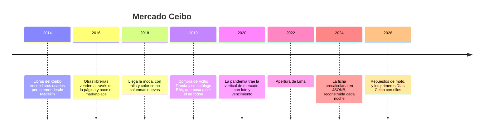

# 🌳 Mercado Ceibo: la historia

> **Qué es este documento:** la fuente de verdad de todo lo narrativo de Proteo —la empresa, su gente,
> sus sistemas, sus cifras y sus reglas de negocio—. **Ninguna fase inventa un dato**: si lo necesita y
> no está aquí, se agrega aquí primero.
> **Vigencia:** 2026-10-06 · **primera versión, en discusión con el autor.** Los dolores de §4 van por
> tema; cuando exista la propuesta de fases, cada uno se ata a su fase. Las cifras de §5 son ficticias y
> los volúmenes del laboratorio se fijan en la propuesta de fases.

---

## 1. 📅 Cómo llegó hasta aquí

Mercado Ceibo es un marketplace: no vende casi nada propio, cobra comisión por lo que venden otros. Hoy
tiene cuatro verticales, unos dos mil trescientos vendedores, operación en Medellín, Bogotá y Lima, y un
catálogo que nadie del equipo actual diseñó entero. Cada capa tuvo su razón, y casi todas eran buenas el
día en que se tomaron.

**2014 · Libros del Ceibo.** Valentina Ocampo tenía una librería de segunda mano a tres cuadras del
parque del barrio, con un ceibo en la esquina, y se cansó de responder por WhatsApp si tenía tal título.
Un amigo de la universidad le armó una tienda en PHP con MySQL. El producto era un libro y un libro tiene
ISBN, título, autor y estado: una tabla, ocho columnas. Funcionó mejor de lo que nadie esperaba.

**2016 · El marketplace.** Otras librerías de Medellín y de Bogotá pidieron vender por ahí. Valentina
dijo que sí con una condición: comisión fija y pago cada quince días. Nace la idea de **vendedor**, y la
tabla de libros gana una columna `seller_id`. El nombre cambia a Mercado Ceibo porque ya no eran solo
libros, aunque todavía lo eran.

**2018 · La moda, a columnazos.** Un grupo de confeccionistas de la ciudad quiso vender camisetas y
jeans. La tabla de productos recibió `talla`, `color` y `material`, todas opcionales, y un campo `notas`
donde los vendedores escribían lo que no cabía. Al año la tabla tenía sesenta y dos columnas, cuarenta
de ellas vacías para cualquier producto dado. Nadie lo llamó un problema: lo llamaron "la tabla grande".

**2019 · La compra de Voltio.** Voltio Tienda vendía electrónica desde Bogotá y estaba quebrando con buen
software. Mercado Ceibo la compró por su base de clientes y se quedó, de paso, con su plataforma: un
e-commerce de código abierto sobre PostgreSQL cuyo catálogo guardaba los atributos en filas —**una por
atributo y por producto**—, el modelo que se conoce como **EAV**. Hernán Bustos, el arquitecto de Voltio,
vino con la compra y propuso migrar todo el catálogo a ese esquema: *"ya soporta atributos flexibles, ya
está en producción con nueve mil productos, y nos quita la tabla grande de encima"*. Era cierto en las
tres cosas. La migración tomó cuatro meses, y la tabla grande se jubiló.

**2020 · El mercado.** En la pandemia, los vendedores de alimentos llegaron en masa: café de origen,
panela, conservas, granos. Cada producto con peso neto, lote, fecha de vencimiento, tabla nutricional y
alérgenos. El EAV los recibió sin una sola migración, que era exactamente su promesa. La tabla de valores
de atributos pasó de cuatro millones de filas a veintidós en un año.

**2022 · Lima.** Rosa Quispe, que había llevado la operación de un marketplace peruano, abrió la oficina
de Lima. Llegaron los soles, los impuestos de otro país y un detalle que nadie había previsto: el mismo
producto pide atributos distintos según el país donde se vende (el registro sanitario de cada autoridad,
la talla en otra norma, la garantía legal con otros plazos). En el EAV eso se resolvió con un atributo
más, `country`, y la consulta de la ficha ganó otro `JOIN`.

**2024 · La ficha precalculada.** La página de producto tardaba. El equipo de Camilo Arango hizo lo
razonable: una tabla `product_card` con la ficha completa en una columna **JSONB**, reconstruida por un
proceso nocturno a partir del EAV. La página volvió a ser rápida. A cambio, la ficha que ve el cliente
tiene hasta veinticuatro horas de retraso respecto de lo que el vendedor cargó, y el proceso nocturno
tarda más cada mes.

**2026 · Los repuestos de moto.** La quinta vertical es la que más dinero promete: en Colombia y en Perú
hay millones de motos de trabajo, y sus repuestos se venden por compatibilidad —*"esta pastilla de freno
sirve para estos cuarenta modelos, de estos años"*—. El primer vendedor grande subió doce mil repuestos en
un Excel con trescientas columnas de compatibilidad. Lo que pasó esa noche abre el curso (§4).

| Año | Qué pasó | Quién lo decidió | Lo que dejó |
|---|---|---|---|
| 2014 | Tienda de libros en PHP y MySQL | Valentina y un amigo | una tabla de productos con forma de libro |
| 2016 | Marketplace con comisión y pago quincenal | Valentina | vendedores, liquidación quincenal |
| 2018 | Moda con columnas opcionales | el equipo de entonces | "la tabla grande", 62 columnas |
| 2019 | Catálogo de todos en el EAV de Voltio | Hernán, con aval de Valentina | el villano, con su mejor argumento |
| 2020 | Vertical de mercado en el EAV | — (entró sola) | 22 M de filas de atributos |
| 2022 | Lima, atributos por país | Rosa y Hernán | un `JOIN` más en cada ficha |
| 2024 | `product_card` en JSONB, nocturna | Camilo | fichas con un día de retraso |
| 2026 | Repuestos de moto | Valentina | el incidente que abre el curso |

## 2. 👥 La gente

| Personaje | Rol | Cómo habla | Qué quiere | Aparece en |
|---|---|---|---|---|
| **Valentina Ocampo** | Cofundadora y gerente general | Directa, de librera: cuenta en ejemplares, no en registros | que una vertical nueva entre en semanas, no en un trimestre | la apertura, el veredicto |
| **Hernán Bustos** | Arquitecto, llegó con Voltio | Pausado, defiende el EAV con argumentos y sin orgullo: *"lo elegí yo, y lo volvería a elegir con lo que sabía"* | que se mida antes de cambiar nada | casi todas; es el interlocutor del lector |
| **Camilo Arango** | Líder del equipo de catálogo | Práctico, paisa: un *"pues"* por escena, no más | dejar de despertarse por el proceso nocturno | la ficha, los derivados, la autopsia |
| **Rosa Quispe** | Jefa de operación en Lima | Ordenada, de planilla; dice *"chamba"* cuando se cansa | que los vendedores peruanos no tengan que pedir permiso para cargar un producto | la carga de vendedores, el sharding |
| **Daniela Ríos** | Tesorería | Exacta; todo en pesos y en soles, con dos decimales | que la liquidación quincenal cuadre al centavo, siempre | la frontera transaccional, el veredicto |
| **Jhon Freddy Mesa** | Atención al cliente | Coloquial y cansado | poder demostrarle a un cliente qué compró exactamente | el pedido como fotografía |
| **Tú** | Ingeniero senior recién contratado | — | — | todas: Hernán te contrató para medir, no para opinar |

El lector entra como el ingeniero que Hernán contrató después de la noche de §4, con un encargo
explícito: *"No quiero que me digas que Mongo es mejor. Quiero que me digas dónde, cuánto y qué nos
cuesta. Y si el EAV gana en algo, quiero saberlo también."*

## 3. 🏚️ Lo que hay (el patrimonio)

| Sistema | Stack y edad | Quién lo mantiene | Sus mañas |
|---|---|---|---|
| **Ceibo Core** | Monolito PHP sobre PostgreSQL, desde 2019 (el de Voltio, extendido) | el equipo de plataforma | el checkout y la liquidación viven aquí; nadie quiere tocarlo |
| **El catálogo EAV** | Tablas `product`, `attribute`, `attribute_value`, `attribute_set` en el mismo PostgreSQL | Hernán y Camilo | una ficha pide entre 9 y 14 `JOIN`; los valores se guardan en columnas por tipo y a veces en la equivocada |
| **`product_card`** | Tabla con la ficha en JSONB, reconstruida cada noche | el equipo de catálogo | el proceso de las 2:00 a. m. terminaba a las 4:10 en enero y a las 5:40 en septiembre |
| **La búsqueda** | Búsqueda de texto de PostgreSQL sobre `product_card`, y conteos de filtros con consultas aparte | nadie en particular | los conteos por filtro dejan de responder en los Días Ceibo |
| **El carrito** | En la sesión del monolito | plataforma | se pierde al cambiar de servidor; obliga a sesiones pegajosas en el balanceador |
| **La carga de vendedores** | Un Excel por vendedor, por correo o carpeta compartida; un script de Rosa lo convierte | Rosa | cada vendedor tiene sus columnas; el script tiene 1.400 líneas y un `if` por vendedor grande |
| **La liquidación** | Tablas `settlement` y `settlement_line` en Ceibo Core, más una hoja de cálculo de revisión | Daniela | cuadra; nadie la quiere migrar, y con razón |

**El laboratorio del curso levanta** el catálogo y sus derivados: el EAV y la ficha JSONB en PostgreSQL,
el catálogo documental en MongoDB y en Couchbase, la búsqueda y la caché. Ceibo Core no se levanta: se
menciona, y de él solo se reconstruye la liquidación mínima que el veredicto necesita.

## 4. 🔥 El incidente que lo empezó todo

Jueves de octubre, víspera de los segundos Días Ceibo del año, la temporada de descuentos que vende en
cuatro días lo de un mes. A las 7:40 p. m., Repuestos Paredes, el vendedor de repuestos más grande de
Lima, subió su catálogo: doce mil repuestos, cada uno con su lista de modelos compatibles. El script de
Rosa los convirtió en filas del EAV: **tres millones seiscientas mil** filas nuevas en `attribute_value`,
casi todas de compatibilidad, en una sola noche.

El proceso nocturno de `product_card` arrancó a las 2:00 y a las 9:00 seguía corriendo. Los Días Ceibo
abrieron a las 8:00 con fichas del día anterior: precios viejos en ciento ochenta mil productos, y los
repuestos nuevos sin página. La búsqueda de "pastillas de freno para mi moto" no devolvía nada, porque el
filtro por compatibilidad era una consulta de cuatro autouniones sobre `attribute_value` que el equipo
canceló a mano a las 8:20 para que no tumbara el resto.

Jhon Freddy recibió ese día trescientos doce reclamos de clientes que compraron a un precio y les cobraron
otro, o a los que la ficha les cambió después de la compra y no había forma de mostrarles qué habían
comprado. Daniela tuvo que rehacer a mano la liquidación de cuarenta vendedores.

Al día siguiente, en la reunión, Valentina hizo una sola pregunta: *"¿Esto se arregla con más máquina o
con otra forma de guardar las cosas?"*. Hernán dijo que no lo sabía, y que no quería adivinarlo. Esa
tarde abrió la vacante que vas a ocupar.

### Los dolores, por tema

Cada uno abre una o más fases cuando la propuesta exista. Ninguno se inventa en la fase: sale de aquí.

1. **La vertical nueva.** Repuestos de moto entró sin migración en el EAV, y aun así casi tumba el
   sistema: la flexibilidad no era el problema, la forma de leerla sí.
2. **La ficha completa.** La página de producto necesita la ficha entera; hoy la reconstruye un proceso
   nocturno desde catorce `JOIN`. La pregunta honesta es si la JSONB de `product_card`, bien mantenida,
   no alcanza.
3. **Las compatibilidades.** "Sirve para estos cuarenta modelos" es un arreglo dentro del producto, y
   filtrar por él es lo que el EAV no aguanta.
4. **Las reseñas.** El libro más vendido de la casa tiene cuarenta y un mil reseñas; el repuesto
   promedio, tres.
5. **El inventario por bodega.** Medellín, Bogotá y Lima, más los vendedores que despachan desde la suya.
   En los Días Ceibo se vendieron diecisiete unidades de un producto con nueve en existencia.
6. **El pedido como fotografía.** Los trescientos doce reclamos: lo comprado tiene que poder mostrarse
   tal como era al comprarlo.
7. **La búsqueda y los filtros.** Los conteos por filtro que dejan de responder justo cuando más se usan.
8. **"Quienes compraron esto también compraron".** Valentina lo quiere para los libros; Hernán sospecha
   que alguien va a proponer un motor de grafos.
9. **El carrito.** Se pierde al cambiar de servidor y no tiene por qué vivir en la base principal.
10. **Los derivados al día.** La búsqueda y la caché tienen que enterarse de un cambio en segundos, no a
    la mañana siguiente.
11. **La memoria del motor.** Cuando el catálogo crezca, ¿cuánto de él tiene que caber en memoria, y qué
    pasa el día que no cabe?
12. **La réplica y su ventana.** Una carga masiva como la de Repuestos Paredes, ¿cuánto historial de
    replicación se come?, ¿y qué pasa con un nodo que se quedó atrás?
13. **Dos países, una base.** Lima crece más rápido que Medellín. ¿Se parte el catálogo por país, por
    vendedor o por producto? Hay una respuesta que parece obvia y está mal.
14. **La liquidación.** Daniela no va a mover la liquidación a ninguna parte sin un número que la
    convenza, y probablemente tenga razón.
15. **El EAV en la mesa.** Medirlo entero, con su mejor versión, y convertirlo con números antes y
    después.

## 5. 💰 Las cifras

Todas ficticias, coherentes entre sí, y con los volúmenes del laboratorio por fijar en la propuesta de
fases.

| Cifra | Valor | Fuente o supuesto |
|---|---|---|
| Vendedores activos | ≈ 2.300 (1.600 en Colombia, 700 en Perú) | ficticia |
| Productos publicados | ≈ 410.000, con ≈ 1,1 M variantes | ficticia |
| Verticales | 5: libros, electrónica, moda, mercado y, desde 2026, repuestos de moto | ficticia |
| Filas en `attribute_value` | ≈ 41 M antes del incidente, ≈ 44,6 M después | ficticia |
| `JOIN` para armar una ficha | de 9 a 14, según la vertical | ficticia; se reproduce en el laboratorio |
| Duración del proceso de `product_card` | 2 h 10 min en enero de 2026, 3 h 40 min en septiembre | ficticia |
| Pedidos en un día normal | ≈ 9.000 | ficticia |
| Pedidos en un día de Días Ceibo | ≈ 61.000 | ficticia |
| Reclamos del día del incidente | 312 | ficticia |
| Reseñas del libro más vendido | 41.000 | ficticia |
| Compatibilidades por repuesto | de 1 a 300, mediana 38 | ficticia |
| Bodegas propias | 3: Medellín, Bogotá, Lima | ficticia |
| Comisión | entre 8 % y 15 % según vertical | ficticia |

## 6. 📏 Las reglas de negocio

- **Comisión y liquidación.** Cada venta deja una comisión según la vertical. A cada vendedor se le paga
  dos veces al mes, los días 1 y 16, lo vendido y despachado en la quincena anterior menos comisiones y
  devoluciones. **La liquidación cuadra al centavo o no sale.**
- **El pedido congela la ficha.** Un pedido guarda el producto tal como estaba al comprarlo: título,
  precio, atributos, vendedor e imagen principal. Lo que cambie después en el catálogo no lo toca.
- **Precio por vendedor.** El mismo producto (mismo ISBN, mismo modelo de repuesto) puede tenerlo más de
  un vendedor, cada uno con su precio y su existencia.
- **Existencias por bodega.** Un producto tiene existencias por bodega propia y por bodega del vendedor;
  no se vende lo que no hay.
- **Vencimiento.** Un producto de mercado no se vende si le faltan menos de treinta días para vencer.
- **Compatibilidad.** Un repuesto declara marca, modelo y rango de años de las motos para las que sirve;
  el cliente filtra por su moto.
- **Atributos por país.** Algunos atributos son obligatorios en un país y no en el otro (el registro
  sanitario, la garantía legal).
- **Reseñas.** Solo reseña quien compró, una por pedido y producto.
- **Devoluciones.** Treinta días desde la entrega; descuentan de la liquidación siguiente.

## 7. 🗣️ Cómo hablan

La narración y las instrucciones al lector van en tuteo neutro. Las voces se reservan para los diálogos,
una expresión por escena:

- **Camilo** (Medellín): *"pues"*, *"eso está en la buena"*, *"qué pereza ese proceso"*.
- **Rosa** (Lima): *"chamba"*, *"al toque"*.
- **Jhon Freddy** (Bogotá): *"sumercé"* con los clientes, nunca con el equipo.
- **Valentina** habla de **ejemplares** y **vitrina**; **Hernán**, de **atributos** y **conjuntos de
  atributos**, el vocabulario del EAV que trajo de Voltio.

En la casa se dice **ficha** (la página del producto), **vitrina** (la portada), **Días Ceibo** (la
temporada de descuentos), **la tabla grande** (la de 2018, ya jubilada) y **el nocturno** (el proceso de
`product_card`).
