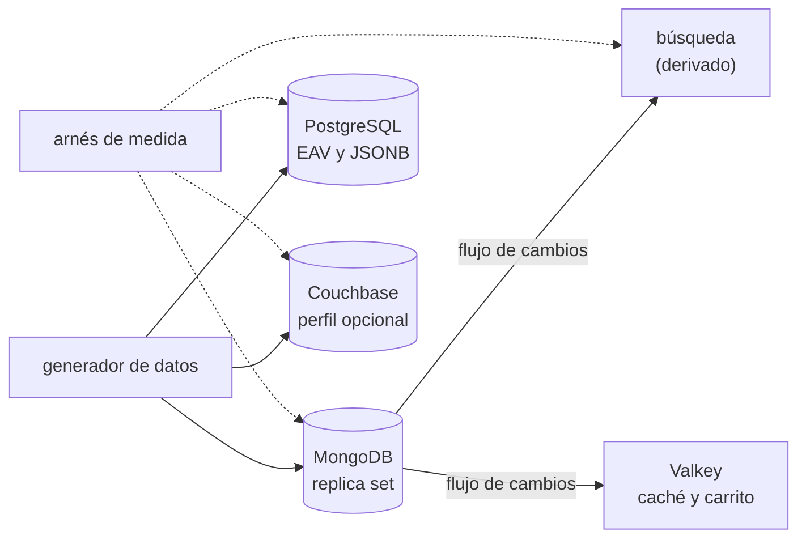

# 🎯 Alcance del proyecto
## Proteo — el modelo documental a fondo

> **Qué es este documento:** la fuente de verdad de **qué** enseña el curso, a quién y con qué
> límites. Lo que no esté aquí no está en el curso.
> **Fecha de esta versión:** 6 de octubre de 2026. Consolida la semilla de agosto (`_desechable-semilla.md`),
> el alcance de agosto (`_desechable-alcance-v1.md`), la ficha de arranque y las respuestas del autor de
> ese día, que cerraron todas las decisiones. **Lo único preliminar es §9**: la cantidad de fases y su
> orden salen de la propuesta de fases.
> **Precedencia:** manda este documento. Después viene
> [`guia-de-estilo-y-convenciones.md`](guia-de-estilo-y-convenciones.md), que decide **cómo** se
> escribe; después el contrato de nombres y el diccionario de términos (por escribir), y las propuestas.
> Las plantillas y los prompts se actualizan siempre al final. Por encima de todos está el `CLAUDE.md`
> del repositorio, en lo que este curso no haya declarado como excepción (§12).
> **Estado de las decisiones:** 25 cerradas, ninguna abierta (§12). Solo faltan la propuesta de fases y la
> versión final de la historia.

---

## 1. 🧭 En una frase

**Un curso que enseña el modelo de acceso documental a fondo reconstruyendo y midiendo el catálogo de
un marketplace con cinco verticales, para que el lector pueda decidir —y defender con números propios—
qué parte de un sistema vota documento, qué parte no, y qué le pasa al motor cuando crece.**

No forma administradores de MongoDB ni prepara una certificación. No enseña MongoDB desde cero: el lector
ya hizo el minicurso documental de Ruta NoSQL Lite. Forma la capacidad de decir, delante de un equipo,
*"el catálogo va en documentos, la liquidación se queda en PostgreSQL, la búsqueda es un derivado, y
estos son los números; y si crecemos en Lima, la clave de partición es esta y no la que todos están
pensando"*.

---

## 2. 🔥 El problema que resuelve

El lector salió de lite sabiendo **cuándo** una familia vota y cómo se ve su primera rotura. Le falta lo
que viene después de elegir bien: modelar un dominio real con varias decisiones que se tensionan entre
sí, sostener esa decisión cuando el volumen y la operación aprietan, y saber qué hace el motor por
dentro cuando la respuesta deja de ser "agrega un índice". Hoy eso se aprende en producción, en la
noche de un evento de descuentos, o en cursos de producto que enseñan MongoDB como si no hubiera otra
opción y nunca lo comparan con un PostgreSQL bien jugado.

El villano es uno solo, **la flexibilidad mal entendida**, y tiene tres caras:

- **"El EAV ya es flexible: no necesitamos otro motor."** Es flexible para escribir. El costo está en la
  lectura, y crece con cada vertical. El curso lo construye en su mejor versión, lo mide de punta a punta
  y lo convierte, con números antes y después.
- **"Con JSONB en PostgreSQL ya tienes documentos."** A veces es verdad, y el curso lo dice con el número
  delante: en la lectura de la ficha por identificador, JSONB empata. La diferencia aparece en otras
  partes (la escritura parcial, los arreglos que respiran, la operación del derivado), y ahí también se
  mide.
- **"Si Mongo escala, partimos por vendedor y listo."** La clave de partición obvia es la que crea el
  punto caliente. El curso la elige mal a propósito, la mide y sale de ahí.

> ⚠️ **El antagonista no es ninguna herramienta.** El EAV tuvo una buena razón en 2019, PostgreSQL gana la
> liquidación sin discusión, y el curso cierra con el veredicto de cuándo el documental no hacía falta.

---

## 3. 🎓 Objetivo pedagógico

Al terminar, el lector puede hacer seis cosas que antes no podía:

1. **Modelar un catálogo heterogéneo en documentos con reglas**: un esquema polimórfico validado por el
   motor y por la aplicación, y el costo de una vertical nueva medido en EAV, JSONB, tabla por vertical y
   documento.
2. **Elegir entre embeber, referenciar y los patrones de documento** (bucket, computed, subset, snapshot)
   para un caso concreto, con la medición que lo sostiene y el punto donde la elección deja de servir.
3. **Garantizar invariantes sin transacción donde no hace falta, y con transacción donde sí**:
   existencias sin sobreventa con la precondición en el filtro, el pedido inmutable, y la frontera donde
   el relacional gana.
4. **Mantener derivados al día** (búsqueda, caché) desde el flujo de cambios del motor, con reanudación
   tras una caída y la latencia de propagación medida.
5. **Diagnosticar el motor por dentro**: leer la caché de WiredTiger y su presión, la ventana del oplog,
   el atraso de una réplica y la distribución de un clúster particionado, y decir qué cambiar.
6. **Elegir una clave de partición** para un catálogo de dos países, demostrando con números por qué la
   obvia crea un punto caliente y cuál no.

Lo que **no** es objetivo: administrar MongoDB en producción (copias de seguridad, seguridad, monitoreo
corporativo), la certificación de MongoDB, escribir un motor de búsqueda o de recomendación, ni migrar un
sistema real sin detenerlo.

---

## 4. 👥 Perfil del lector

Ingeniero senior que **ya hizo Ruta NoSQL Lite**, o que sabe lo equivalente: SQL y modelado relacional de
oficio, TypeScript con soltura, contenedores sin ayuda, y el minicurso documental de lite. Se le explica
el modelo documental en profundidad y el motor por dentro; no se le explica a programar, a usar Docker
ni lo que lite ya enseñó.

**Lo que se da por sabido y no se explica jamás:** SQL, normalización, índices y planes relacionales;
TypeScript y Node; Docker Compose; las cinco preguntas, el arnés de medida y la apuesta antes de medir;
de lite, la levantada de MongoDB, embeber o referenciar en su forma básica, `explain("executionStats")`,
`$lookup`, índices multikey, el límite de 16 MB, el esquema que se muda al código y las transacciones
multidocumento en su uso básico.

**Lo que se explica con cero ambigüedad**, aunque el lector sea senior: qué hace WiredTiger con la
memoria y el disco, qué es y cuánto dura la ventana del oplog, qué garantiza cada nivel de
`writeConcern` y `readConcern`, cómo reparte un clúster particionado los datos y las consultas, y por qué
una escritura que no cruza documentos no necesita transacción.

> 🧭 **Ninguna caja negra prematura, no menos profundidad.** Si una frase obliga al lector a suponer
> algo, está mal escrita.

**Requisitos de entrada:** un equipo con 16 GB de memoria (D-21), Docker Desktop o Podman, y Node 24.
**No hace falta** tener nada instalado fuera de contenedores, ni una cuenta en ninguna nube: Amazon
DocumentDB se estudia desde su documentación (D-16).

---

## 5. 🧭 La pregunta que ordena el curso

> *¿Qué parte de este sistema se lee como un documento, y qué le cuesta al motor sostenerla cuando
> crece?*

Se presenta en la primera fase, con el incidente de Mercado Ceibo, y reaparece en el veredicto de cada
fase. Ordena el arco:

- **La primera mitad** responde *qué se lee como documento*: el catálogo, la ficha, las compatibilidades,
  las reseñas, las existencias, el pedido.
- **La segunda mitad** responde *qué le cuesta al motor*: los derivados, la memoria, la réplica, la
  partición.
- **El cierre** responde la pregunta entera: la autopsia del EAV y el veredicto con las dos manos
  (documento para el catálogo, relacional para la liquidación).

---

## 6. 📏 Cómo se mide

**Todo "mejor que" lleva un número**, medido con el arnés del curso. Lo que se mide primero es **la
forma**: viajes, documentos y filas examinados contra devueltos, bytes leídos y escritos, amplificación
de escritura y de espacio, presión de caché, ventana de oplog, distribución entre particiones. **Los
tiempos sí aparecen** —el curso es full geek y algunas preguntas son de latencia—, pero siempre con su
dispersión (mediana y percentil 95 como mínimo), la máquina declarada y nunca como único sostén de un
veredicto (D-20).

Las reglas de honestidad no se negocian: se publica lo que salió y no lo que se esperaba · el empate se
llama empate · nada de números redondos sin dispersión · el competidor se configura bien (EAV en su
mejor versión, JSONB con sus índices GIN, Couchbase con su arquitectura de memoria primero) · se declara
lo que no se midió · y nunca se extrapola de un portátil a producción.

Dos anclas por fase, cuando la fase las admite: 🪞 **una apuesta** escrita antes de ejecutar y nunca
editada después, y 💥 **una rotura provocada**, con el síntoma literal y lo que costó salir.

**Amazon DocumentDB no se mide.** Se describe desde su documentación oficial, en las preguntas donde su
diferencia con MongoDB importa (compatibilidad de la API, arquitectura de almacenamiento, transacciones,
flujos de cambios), y todo lo que se dice de él va marcado como no verificado.

---

## 7. 🧪 El sistema del curso

### 7.1 El dominio

El backend del catálogo de **Mercado Ceibo**, un marketplace de Medellín con operación en Lima: cinco
verticales (libros, electrónica, moda, mercado y repuestos de moto), vendedores con precio y
existencias propios, bodegas en tres ciudades, reseñas, pedidos que congelan la ficha, búsqueda con
filtros, carrito y la liquidación quincenal a vendedores. La historia, la gente, las cifras y las reglas
de negocio están en [`../00-historia-de-mercado-ceibo.md`](../00-historia-de-mercado-ceibo.md).

**Queda fuera a propósito:** pagos con pasarela, autenticación y roles, logística de despacho, impuestos
reales de cada país, y el monolito Ceibo Core, que se menciona y no se levanta.

### 7.2 El stack, y qué compra cada pieza

Política de versiones en §8; los números se fijan en la verificación previa.

| Pieza | Elección | Qué compra | Qué cuesta |
|---|---|---|---|
| Motor principal | MongoDB, en replica set desde el primer día (D-25) | el modelo documental, los flujos de cambios, la partición | memoria; la operación de un replica set |
| Línea base relacional | PostgreSQL, con el EAV de Voltio y la ficha en JSONB | el rival serio, en sus dos mejores formas | — es lo que ya existe en la empresa |
| Rival documental | Couchbase, en un perfil de Compose (D-22) | el "documento contra documento": memoria primero y SQL++ | es el motor que más memoria pide del laboratorio |
| Rival en la nube | Amazon DocumentDB, solo documentación (D-16) | la pregunta de "¿y si es compatible con Mongo?" | no se ejecuta; todo va marcado no verificado |
| Búsqueda | Meilisearch (D-18) | el derivado reconstruible para texto y filtros | un motor más que mantener al día |
| Carrito y caché | Valkey con `iovalkey` (D-19) | la expiración nativa | lo efímero, fuera de la base principal |
| Arnés y generador | TypeScript nativo en Node 24, el criterio de lite | mediciones reproducibles, el mismo dato en todas las formas | — |
| API del catálogo | Express 5, mínima (D-17) | la ficha servida por HTTP, y las preguntas de extremo a extremo | una capa que el arnés evita cuando mide el motor |

### 7.3 Cómo se construye el código

A mano, en un solo proyecto que crece fase a fase (D-09), con el generador de datos produciendo el mismo
catálogo semántico en cada forma (documento MongoDB, documento Couchbase, EAV y JSONB en PostgreSQL) para
que cada comparación sea entre los mismos datos.

### 7.4 El tamaño mínimo

El laboratorio completo cabe en **16 GB** con perfiles de Compose: MongoDB, PostgreSQL y el arnés siempre;
Couchbase, la búsqueda y Valkey solo en las fases que los usan. El clúster particionado de la fase de
partición es el pico de memoria y se dimensiona en la verificación previa (D-21).

---

## 8. 🧰 Herramientas y plataformas

**Versiones:** última LTS y, donde no haya LTS, última estable a la fecha de la verificación previa;
fijadas por digest en el apéndice del laboratorio, nunca escritas de memoria (D-07). **Plataformas:**
macOS en Apple Silicon, Linux y Windows con WSL2, en ese orden; el autor verifica en macOS arm64 y lo
demás se marca no verificado (D-06). Docker Compose es el camino principal y cada receta trae su
equivalente en Podman.

---

## 9. 🪜 La forma del curso

**Tipo:** curso completo. **Unas 100 horas en 10 a 12 fases** de unas 10 h cada una, agrupadas en bloques
que siguen la pregunta de §5. **Preliminar:** el arco, los nombres y las fichas salen de la propuesta de
fases, que se discute en otra sesión. El borrador de partida son las trece fases de la semilla, menos lo
que lite ya dio (el laboratorio desde cero y las cinco preguntas) y más lo que pide la profundidad (el
motor por dentro y la partición).

| Bloque (tentativo) | Qué hace | Temas de la historia (§4 de ella) |
|---|---|---|
| **I · El catálogo como documento** | modelar la forma y medirla contra EAV y JSONB | 1, 2, 3 |
| **II · Las decisiones que se tensionan** | reseñas, existencias, pedido, carrito | 4, 5, 6, 9 |
| **III · Los derivados** | búsqueda, co-ocurrencia, flujo de cambios | 7, 8, 10 |
| **IV · El motor por dentro** | WiredTiger, réplica y partición | 11, 12, 13 |
| **V · El veredicto** | la autopsia del EAV y la liquidación | 14, 15 |

Reglas de método que atraviesan el arco: cada fase abre con un dolor de Mercado Ceibo, apuesta antes de
medir y cierra con su veredicto; nada de lo que lite ya enseñó se repite, se usa.

---

## 10. ✅ Lo que está dentro del alcance

- Esquemas polimórficos validados en el motor (`$jsonSchema`) y en la aplicación.
- Los patrones de modelado documental medidos: bucket, computed, subset, snapshot, extended reference.
- Existencias por bodega sin sobreventa, con la precondición en el filtro.
- El pedido inmutable frente a una dimensión de cambio lento en SQL.
- Búsqueda y filtros con el derivado fuera del motor principal.
- Co-ocurrencia con agregaciones, y el punto donde sería un grafo.
- Flujos de cambios con reanudación y su latencia de propagación.
- WiredTiger: caché, compresión, checkpoints y la presión de memoria medida.
- Replica set: elección, `writeConcern`, `readConcern`, ventana del oplog, atraso de réplica.
- Partición: clave, puntos calientes, distribución, consultas dirigidas y difundidas.
- La autopsia del EAV con su conversión medida, y la liquidación como frontera relacional.
- Couchbase como rival documental, y Amazon DocumentDB desde su documentación.

## 11. 🚫 Lo que está fuera del alcance

Se declara y el texto se detiene: **no se dice dónde estaría ese material.**

- Lo que Ruta NoSQL Lite ya enseñó del modelo documental: se usa, no se explica.
- Administración en producción: copias de seguridad, cifrado, usuarios y roles, monitoreo corporativo.
- Atlas y cualquier servicio pago; Amazon DocumentDB no se ejecuta.
- ODM (Mongoose y similares).
- Frontend.
- Recomendación con aprendizaje automático.
- Migración sin detener el sistema, más allá de mencionarla.
- CouchDB, que no es Couchbase.

---

## 12. ⚖️ Decisiones

Si una sesión futura quiere cambiar una, primero la cambia aquí y después en todo lo demás, nunca al
revés. ✅ cerrada · ⏳ abierta · 🔄 reabierta.

| ID | Decisión | Valor | Estado |
|---|---|---|---|
| D-01 | Idioma | Español latinoamericano neutro con tuteo; código, comandos, identificadores y salida de terminal en inglés; comentarios de código en español | ✅ |
| D-02 | Tipo de curso | Curso completo | ✅ |
| D-03 | Autocontención | Lo publicado nombra Ruta NoSQL Lite **solo como requisito de entrada** (README y primera fase): no usa su contenido, no remite a sus fases ni reutiliza sus ejemplos, datos o mediciones. `prompts/` puede citarla. Regla de toda la ruta (R-07) | ✅ |
| D-04 | Promesa de esfuerzo | ~100 h en 10–12 fases de ~10 h | ✅ |
| D-05 | Aparato de evaluación | 20–30 ejercicios por fase, 🟢🟡🟠🔴 + 🔥, un tercio de diagnóstico o medición, cada uno con su criterio (`Objetivo` o `Pregunta`); **sin solución publicada**. Taller global: el backend de Mercado Ceibo en `src/`. Un 💀 boss por bloque cuando el bloque lo admita (criterio de la guía §8), y el proyecto final de §13; dónde cae cada uno lo dice la propuesta de fases | ✅ |
| D-06 | Plataformas | macOS arm64, Linux, Windows con WSL2; el autor verifica en macOS arm64 | ✅ |
| D-07 | Política de versiones | Última LTS, y donde no haya LTS, última estable, a la fecha de la verificación previa; por digest, en el apéndice del laboratorio | ✅ |
| D-08 | Ejecución | Nada se publica sin haberse ejecutado; Amazon DocumentDB, desde documentación y marcado no verificado | ✅ |
| D-09 | Código | Un solo proyecto en `src/` que crece por fases, con tags `fase-NN-<slug>` | ✅ |
| D-10 | README y temario | Se escriben al final, en una tanda propia | ✅ |
| D-11 | Historia | Mercado Ceibo, en `00-historia-de-mercado-ceibo.md` | ✅ |
| D-12 | Diagramas | Mermaid | ✅ |
| D-13 | Publicación | Repositorio público propio del curso, sin `prompts/`; enlaces a otros cursos convertidos al publicar | ✅ |
| D-14 | Prerrequisito | Ruta NoSQL Lite, o lo equivalente de §4 | ✅ |
| D-15 | Profundidad | Full geek: WiredTiger, replica set y oplog, flujos de cambios con reanudación, partición medida | ✅ |
| D-16 | Rivales | PostgreSQL (EAV y JSONB) como línea base; Couchbase como rival documental; Amazon DocumentDB solo desde documentación | ✅ |
| D-17 | API del catálogo | Una API HTTP mínima con Express 5 (la de la semilla) sirve la ficha y las operaciones; el arnés mide contra los motores directamente, no a través de la API, salvo en las preguntas de extremo a extremo | ✅ |
| D-18 | Motor de búsqueda | Meilisearch, como derivado reconstruible, nunca fuente de verdad | ✅ |
| D-19 | Carrito y caché | Valkey con `iovalkey`, en lugar de Redis | ✅ |
| D-20 | Mediciones | Forma primero; tiempos con mediana y p95 y la máquina declarada. El documento vivo es **`BENCHMARKS.md`**, como pide el repositorio | ✅ |
| D-21 | Memoria del laboratorio | Todo dentro de 16 GB con perfiles de Compose; el clúster particionado se dimensiona en E6 | ✅ |
| D-22 | Couchbase en el laboratorio | Desde el principio, en un perfil opcional; su primer duelo en la lectura de la ficha | ✅ |
| D-23 | La liquidación | Mini-servicio real en PostgreSQL (`settlement` y `settlement_line`, una transacción) para que el veredicto tenga números | ✅ |
| D-24 | Datos | Sintéticos con semilla fija y volumen parametrizable; más un lote de Excel "de vendedor" para la carga sucia | ✅ |
| D-25 | Replica set | Desde la primera fase, aunque sea de un nodo, para no reconfigurar a mitad del curso | ✅ |

**Excepciones declaradas al `CLAUDE.md` del repositorio**, con su porqué (el detalle en la guía §13):

- **Ruta NoSQL Lite como prerrequisito** (D-14) → no se explican los fundamentos del modelo documental →
  los da lite, y repetirlos sería el curso que el lector ya hizo.
- **El "vs" contra Amazon DocumentDB no se mide** (D-16) → se describe desde la documentación y se marca →
  medirlo cuesta dinero, y la regla de no publicar sin ejecutar se cumple declarándolo.
- **Los ejercicios no traen solución publicada** (D-05) → el lector apuesta
  y mide antes de mirar → es el método del curso.

---

## 13. 🏁 El proyecto final

Valentina pide una recomendación escrita para la junta: qué se migra del EAV, a qué, en qué orden, qué
se queda en PostgreSQL y cómo se parte el catálogo si Lima sigue creciendo. Se entrega como un informe
con las mediciones del curso, la autopsia del EAV con números antes y después, y el árbol de decisión de
cuándo **no** usar documental, aplicado a cada pieza del sistema.

---

## 14. 🎯 Criterios de éxito

El curso está bien si:

- Cada fase abre con un dolor de Mercado Ceibo y cierra con algo que se apostó, se midió y, cuando tocaba,
  se rompió a propósito.
- Ninguna fase repite lo que lite ya enseñó del modelo documental.
- PostgreSQL gana o empata en al menos dos preguntas, y el curso lo dice con el número delante.
- Un lector que solo hace los bloques I y II sale sabiendo modelar el catálogo y defenderlo; uno que hace
  el IV sabe leer el motor por dentro.
- El veredicto final no es "MongoDB para todo".

---

## 15. 📌 Extensión futura, fuera de este curso

El diseño deja preparado, sin prometerlo, un segundo país con reglas de catálogo propias y la consulta
de compatibilidad a varios saltos (el repuesto que sirve para la moto que comparte motor con otra), que
es donde la co-ocurrencia deja de ser una agregación.
