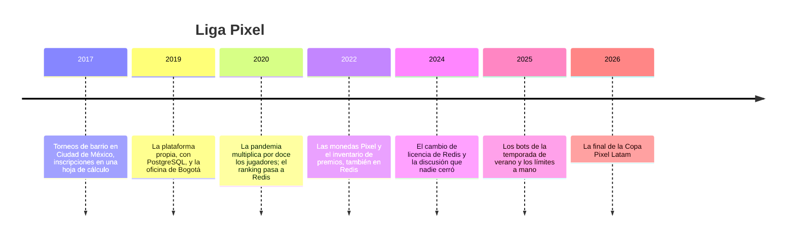

# 🎮 Liga Pixel: la historia

> **Qué es este documento:** la fuente de verdad de todo lo narrativo de Portalón —la empresa, su gente,
> sus sistemas, sus cifras y sus reglas de negocio—. **Ninguna fase inventa un dato**: si lo necesita y
> no está aquí, se agrega aquí primero.
> **Vigencia:** 2026-10-06 · **primera versión, en discusión con el autor.** Los dolores de §4 van por
> tema; cuando exista la propuesta de fases, cada uno se ata a su fase. Las cifras de §5 son ficticias y
> los volúmenes del laboratorio se fijan en la propuesta de fases. Los juegos son inventados: ningún
> título ni editor real.

---

## 1. 📅 Cómo llegó hasta aquí

Liga Pixel organiza torneos de videojuegos: los jugadores se inscriben gratis o pagan una entrada, juegan
partidas clasificatorias que los editores de los juegos reportan, suben en un ranking y, al final de
cada temporada, cobran premios en efectivo, en equipos o en monedas Pixel, la moneda de la casa. Hoy
tiene unos dos millones cuatrocientos mil jugadores registrados, operación en Ciudad de México y Bogotá,
y un sistema donde todo lo que se mueve rápido vive en memoria. Eso funcionó durante años. Una parte de
lo que vive ahí no debería.

**2017 · Torneos de barrio.** Mariana Tapia narraba partidas en un canal de streaming y empezó a organizar
torneos de fin de semana en un local de la colonia Narvarte. Las inscripciones eran un formulario y una
hoja de cálculo; los resultados, capturas de pantalla por mensaje. Llegaron a cuatrocientos jugadores por
torneo, y la hoja de cálculo se rindió antes que ellos.

**2019 · La plataforma.** Con una ronda de inversión ángel, Mariana contrató a Iván Cárdenas como CTO.
Iván armó lo sensato: una API en Node con Express y PostgreSQL para jugadores, torneos, partidas y
premios. Los editores de los dos juegos aliados (*Fuerza Arena*, un shooter por equipos, y *Reino de
Cobre*, de estrategia) empezaron a reportar resultados por webhook. Ese año abrieron Bogotá, con Sofía
Bermúdez al frente de la plataforma.

**2020 · El ranking en memoria.** En la pandemia los jugadores pasaron de treinta mil a trescientos
setenta mil en ocho meses. El ranking en vivo —un `ORDER BY score DESC` con `LIMIT` y la posición de cada
jugador— empezó a tardar segundos en las finales. Iván lo movió a Redis, a un sorted set por torneo, y el
problema desapareció en una tarde. **Fue una decisión excelente**, y todavía lo es: el ranking es
exactamente lo que esa estructura sabe hacer.

**2022 · Las monedas, también.** Liga Pixel lanzó las monedas Pixel: se ganan jugando, se compran y se
canjean por premios del inventario (audífonos, controles, sillas, tarjetas de regalo). Iván propuso
guardar el saldo y el inventario en Redis, junto al perfil del jugador que ya estaba ahí como hash:
*"el saldo se consulta en cada partida, el canje tiene que ser atómico y Redis tiene `HINCRBY`; ya
tenemos el perfil ahí, no voy a hacer dos viajes"*. Tenía razón en los tres puntos. Lo que no estaba en
la discusión era qué pasa con un saldo cuando el nodo que lo tiene se cae.

**2024 · La licencia.** Redis cambió de licencia y apareció Valkey. Sofía propuso migrar; Iván dijo que
no se cambia el motor de un sistema que funciona por un tema legal que todavía no les aplicaba. La
discusión quedó en un documento con veinte comentarios y ninguna decisión.

**2025 · Los bots.** En la temporada de verano, cuentas automatizadas inscribieron miles de jugadores
falsos para inflar la bolsa de premios por participación. Ernesto Valdés, de antitrampas, escribió
límites por IP y por dispositivo con contadores y `EXPIRE`: funcionaron hasta que los bots aprendieron a
partir sus ráfagas justo en el borde de la ventana.

**2026 · La final.** Lo que pasó en la final de la Copa Pixel Latam abre el curso (§4).

| Año | Qué pasó | Quién lo decidió | Lo que dejó |
|---|---|---|---|
| 2017 | Torneos con hoja de cálculo | Mariana | la comunidad |
| 2019 | API en Node y PostgreSQL | Iván | la base de verdad, que sigue sana |
| 2020 | Ranking en sorted sets de Redis | Iván | la mejor decisión técnica de la casa |
| 2022 | Saldo de monedas e inventario en Redis | Iván, con aval de Mariana | el villano, con su mejor argumento |
| 2024 | Discusión de licencia sin cerrar | Iván y Sofía | un documento con veinte comentarios |
| 2025 | Límites contra bots a mano | Ernesto | ventanas fijas que se burlan por el borde |
| 2026 | La final de la Copa Pixel Latam | — | el incidente que abre el curso |

## 2. 👥 La gente

| Personaje | Rol | Cómo habla | Qué quiere | Aparece en |
|---|---|---|---|---|
| **Mariana Tapia** | Cofundadora y directora general | Rápida, de narradora: todo es "en vivo" | que una final no se vuelva a caer frente a la audiencia | la apertura, el veredicto |
| **Iván Cárdenas** | CTO desde 2019 | Seguro y franco: *"lo de las monedas lo puse yo ahí, y con lo que sabía lo volvería a hacer"* | que se mida antes de mover nada | casi todas; es el interlocutor del lector |
| **Sofía Bermúdez** | Líder de plataforma en Bogotá | Metódica, de guardia; un *"de una"* por escena | dormir en las finales | memoria, réplica, clúster, producción |
| **Ernesto Valdés** | Antitrampas | Desconfiado por oficio | límites que los bots no puedan burlar por el borde | los límites, la atomicidad |
| **Paula Rengifo** | Finanzas | Contable: las monedas son un pasivo | que el saldo de monedas cuadre con lo vendido y lo canjeado, al centavo | el villano, el veredicto |
| **Jorge Lizárraga** | Producción de transmisiones | Coloquial, siempre con prisa | un top 10 en pantalla que no mienta | el ranking, el caché del cliente |
| **Tú** | Ingeniero senior recién contratado | — | — | todas: Iván te contrató para medir, no para opinar |

El encargo de Iván, el día que entras: *"No quiero que me digas que Redis es malo; nos salvó en 2020.
Quiero saber qué tiene que vivir en memoria, qué no, qué motor y qué nos cuesta. Y si lo de las monedas
está bien donde está, también quiero saberlo."*

## 3. 🏚️ Lo que hay (el patrimonio)

| Sistema | Stack y edad | Quién lo mantiene | Sus mañas |
|---|---|---|---|
| **API Pixel** | Node con Express, desde 2019 | el equipo de Iván | habla con PostgreSQL y con Redis en el mismo request, sin capa entre medias |
| **PostgreSQL** | jugadores, torneos, partidas, premios pagados, pagos | Iván | sano; es la base de verdad de todo lo que tiene dinero real |
| **Redis** | un clúster de tres primarios con una réplica cada uno, desde 2021 | Sofía | rankings, sesiones de partida, cola de emparejamiento, límites, perfiles, **saldos de monedas e inventario de premios** |
| **Webhooks de los editores** | *Fuerza Arena* y *Reino de Cobre* reportan cada partida | — (son de los editores) | llegan repetidos, a veces desordenados, y en las finales en ráfagas |
| **El overlay de transmisión** | página que muestra el top 10 en vivo en el stream | Jorge | consulta el ranking dos veces por segundo por cada transmisión abierta |
| **Los límites antitrampas** | contadores con `EXPIRE` en el mismo Redis | Ernesto | ventana fija: el bot que reparte su ráfaga en el borde pasa el doble |

**El laboratorio del curso levanta** el gateway y su estado caliente sobre Valkey (y sobre Redis,
Dragonfly y Garnet para comparar), con PostgreSQL como base de verdad. Los editores se simulan con un
generador de webhooks; el overlay, con un cliente que consulta el ranking.

## 4. 🔥 El incidente que lo empezó todo

Domingo de agosto, final de la Copa Pixel Latam de *Fuerza Arena*: ochenta mil espectadores en el stream
principal, novecientos mil jugadores en el torneo de ese fin de semana y una bolsa de premios de dos
millones de pesos mexicanos.

A las 19:12, en el tercer mapa de la final, el primario del clúster de Redis que tenía las monedas y los
perfiles hizo un snapshot. La máquina estaba con la memoria justa; el fork tardó, la latencia del nodo
saltó a segundos y el clúster lo dio por caído. La réplica tomó su lugar en once segundos. La replicación
es asíncrona: lo que el primario había aceptado en los últimos instantes y no había enviado se perdió.

Esos instantes eran justo el momento del canje masivo que Jorge había anunciado en el stream: *"los
primeros quinientos que canjeen monedas se llevan el control edición Copa"*. Cuando la réplica tomó el
mando, mil trescientos canjes habían descontado saldo en un nodo que ya no existía. Algunos jugadores
quedaron con el control y con las monedas; a otros se les descontó dos veces al reintentar. El inventario
dijo que quedaban noventa controles cuando no quedaba ninguno. Y en pantalla, el top 10 de Jorge mostró
durante cuarenta segundos a un jugador eliminado en el puesto tres.

Paula pasó la semana conciliando saldos contra la base de pagos. Encontró una diferencia de ciento doce
mil monedas que nadie pudo explicar del todo. El lunes, Mariana preguntó: *"¿Esto pasa porque Redis es
malo o porque le pedimos algo que no le tocaba?"*. Iván dijo que creía saber la respuesta, y que no
quería creer: quería medirla. Esa semana abrió la vacante que vas a ocupar.

### Los dolores, por tema

Cada uno abre una o más fases cuando la propuesta exista. Ninguno se inventa en la fase: sale de aquí.

1. **Los bots en el borde.** La ventana fija de Ernesto deja pasar el doble a quien parte su ráfaga en el
   borde. Hay otros algoritmos de límite, y cada uno cuesta distinto en memoria y en viajes.
2. **El ranking de millones.** Un sorted set por torneo, con novecientos mil jugadores. ¿Cuánta memoria,
   cuánto cuesta una posición, y qué pasa al pasar de cierto tamaño?
3. **Rankings que se combinan.** Por torneo, por país, por temporada: unir sorted sets en caliente o
   mantenerlos precalculados.
4. **La cola de emparejamiento.** Jugadores esperando rival de nivel parecido: la cola que no es FIFO.
5. **El canje atómico.** Descontar saldo y apartar el premio sin que dos canjes se crucen: transacción
   del motor, script o función, y lo que cada una garantiza.
6. **Las monedas en memoria.** El villano: un saldo con valor de dinero en un motor cuya réplica es
   asíncrona.
7. **El snapshot que paró la final.** El fork y la copia al escribir, medidos: cuánto pesa, cuánto tarda y
   qué le hace a la latencia.
8. **La memoria que no alcanza.** Cuánto ocupa de verdad cada estructura, las codificaciones compactas, la
   fragmentación, y qué hace el motor al llegar al límite.
9. **El failover y su ventana.** Qué se pierde al cambiar de primario, el backlog de replicación y `WAIT`.
10. **El clúster y la clave caliente.** El top 10 del torneo de la final es una sola clave, consultada por
    ochenta mil espectadores a través del overlay.
11. **El overlay que pregunta de más.** Dos consultas por segundo por transmisión: el caché del lado del
    cliente y su invalidación.
12. **Un hilo o muchos.** Dragonfly y Garnet prometen usar todos los núcleos; Valkey tiene hilos de E/S. La
    promesa, medida en el laboratorio.
13. **Los webhooks repetidos.** Los editores reportan la misma partida dos veces: la idempotencia del lado
    del gateway.
14. **La licencia.** El documento de veinte comentarios: elegir motor también es elegir gobernanza.
15. **La producción.** Qué mirar a las 19:12 de un domingo: latencias por comando, `SLOWLOG`, memoria,
    réplicas.
16. **El villano en la mesa.** Las monedas y el inventario medidos donde están y donde deberían estar, con
    números antes y después.

## 5. 💰 Las cifras

Todas ficticias, coherentes entre sí, y con los volúmenes del laboratorio por fijar en la propuesta de
fases.

| Cifra | Valor | Fuente o supuesto |
|---|---|---|
| Jugadores registrados | ≈ 2,4 M (1,5 M en México, 0,9 M en Colombia) | ficticia |
| Jugadores activos en un fin de semana de final | ≈ 900.000 | ficticia |
| Torneos activos a la vez | ≈ 1.800 | ficticia |
| Partidas reportadas por los editores | ≈ 3 M por semana; picos de 4.000 por segundo en finales | ficticia |
| Webhooks repetidos | ≈ 2 % de las partidas | ficticia |
| Espectadores del stream de la final | 80.000 | ficticia |
| Consultas del overlay | 2 por segundo por transmisión abierta | ficticia |
| Clúster de Redis | 3 primarios, 1 réplica cada uno, 32 GB por nodo | ficticia |
| Failover del incidente | 11 s; 1.300 canjes afectados; 112.000 monedas sin explicar | ficticia |
| Monedas en circulación | ≈ 640 M | ficticia |
| Bolsa de premios de la Copa Pixel Latam | 2.000.000 MXN | ficticia |

## 6. 📏 Las reglas de negocio

- **El ranking.** Cada partida ranked suma o resta puntos según el resultado y el nivel del rival. El
  ranking de un torneo ordena por puntos; a igualdad de puntos, gana quien llegó primero.
- **Las monedas Pixel.** Se ganan jugando y se compran con dinero. Se canjean por premios del inventario.
  **No se convierten de vuelta en dinero**, pero para finanzas son un pasivo: lo vendido menos lo canjeado
  tiene que cuadrar con el saldo total, siempre.
- **El canje.** Descuenta el saldo y aparta una unidad del inventario en la misma operación; si no hay
  saldo o no hay unidades, no se hace nada.
- **Los premios en efectivo** se pagan desde PostgreSQL y nunca han vivido en memoria.
- **Los límites.** Una inscripción por jugador y torneo; como máximo tres cuentas por dispositivo; un
  número de peticiones por IP y por cuenta en ventanas que define antitrampas.
- **El emparejamiento.** Dos jugadores se emparejan si su nivel difiere en menos de un margen, que se
  ensancha cuanto más esperan.
- **Las sesiones de partida.** Una sesión dura lo que la partida más quince minutos; si el jugador se
  desconecta, puede volver dentro de ese plazo.
- **Los webhooks.** Una partida se cuenta una sola vez, por su identificador del editor, aunque llegue
  repetida.

## 7. 🗣️ Cómo hablan

La narración y las instrucciones al lector van en tuteo neutro. Las voces se reservan para los diálogos,
una expresión por escena:

- **Mariana** (Ciudad de México): *"órale"*, *"está cañón"*.
- **Sofía** (Bogotá): *"de una"*, *"listo"*.
- **Jorge** (Ciudad de México): *"ahorita"*, que nunca significa ahora.
- **Iván** habla de **latencia** y **viajes**; **Paula**, de **pasivo** y **conciliación**.

En la casa se dice **la final** (la de la Copa Pixel Latam), **el overlay** (el top 10 del stream),
**canjear**, **las monedas** y **el borde** (el truco de los bots con las ventanas fijas).
