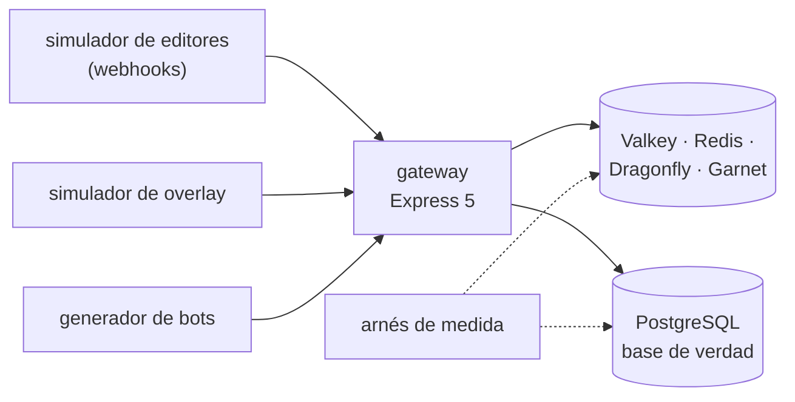

# 🎯 Alcance del proyecto
## Portalón — el modelo clave-valor a fondo

> **Qué es este documento:** la fuente de verdad de **qué** enseña el curso, a quién y con qué
> límites. Lo que no esté aquí no está en el curso.
> **Fecha de esta versión:** 6 de octubre de 2026. Consolida la semilla de agosto
> (`_desechable-semilla.md`), el alcance de agosto (`_desechable-alcance-v1.md`), la ficha de arranque,
> las reglas de la ruta y los precedentes de Proteo. **Lo único preliminar es §9**: la cantidad de fases
> y su orden salen de la propuesta de fases.
> **Precedencia:** manda este documento. Después viene
> [`guia-de-estilo-y-convenciones.md`](guia-de-estilo-y-convenciones.md), que decide **cómo** se
> escribe; después el contrato de nombres y el diccionario de términos (por escribir), y las propuestas.
> Las plantillas y los prompts se actualizan siempre al final. Por encima de todos está el `CLAUDE.md`
> del repositorio, en lo que este curso no haya declarado como excepción (§12).
> **Estado de las decisiones:** 28 cerradas, ninguna abierta (§12). Solo faltan la propuesta de fases y
> la versión final de la historia.

---

## 1. 🧭 En una frase

**Un curso que enseña el modelo clave-valor a fondo reconstruyendo y midiendo el gateway de una
plataforma de torneos, para que el lector pueda decidir —y defender con números propios— qué estado vive
en memoria, en qué motor, qué le cuesta a ese motor sostenerlo, y qué nunca debió estar ahí.**

No forma administradores de Valkey ni de Redis, ni prepara una certificación. No enseña clave-valor desde
cero: el lector ya hizo el minicurso de Ruta NoSQL Lite. Forma la capacidad de decir *"el ranking, los
límites, las sesiones y la cola van en memoria; el saldo de monedas no, por esta razón y con este
número; y el motor es este, también por un número"*.

---

## 2. 🔥 El problema que resuelve

El lector salió de lite sabiendo modelar con la clave, usar cada estructura nativa y qué se pierde al
reiniciar. Le falta lo que viene después: elegir entre algoritmos y estructuras cuando el volumen
aprieta, entender qué hace el motor con la memoria, el disco y la red cuando alguien se lo pide en una
final, distribuir sin perder lo que no se puede perder, y elegir motor entre cuatro que hablan el mismo
protocolo y prometen cosas distintas. Hoy eso se aprende la noche en que el snapshot coincide con el
pico, o en tutoriales que tratan a Redis como si fuera la única opción y la memoria como si fuera
infinita.

El villano es uno solo, **la memoria tratada como si fuera una base de datos**, y tiene tres caras:

- **"Ya está en Redis, guardemos ahí también el saldo."** El argumento de la latencia y la atomicidad es
  real. Lo que se paga es la durabilidad y la réplica asíncrona. El curso lo mide de punta a punta y lo
  compara con PostgreSQL bien jugado.
- **"Si necesitamos más, ponemos el motor multihilo."** Puede ser cierto, puede no serlo: la promesa de
  los núcleos se mide en el laboratorio, con la carga de Liga Pixel, y se publica lo que salga.
- **"La memoria alcanza."** Hasta el snapshot, la fragmentación o el sorted set que cambia de
  codificación. El curso mide cuánto ocupa de verdad cada cosa.

> ⚠️ **El antagonista no es ninguna herramienta.** El ranking en memoria fue la mejor decisión de la casa,
> PostgreSQL gana el saldo sin discusión, y el curso cierra con el veredicto de cuándo el clave-valor no
> hacía falta.

---

## 3. 🎓 Objetivo pedagógico

Al terminar, el lector puede hacer seis cosas que antes no podía:

1. **Elegir y medir un algoritmo de límite** (ventana fija, deslizante, token bucket, GCRA) por su precisión
   en el borde, su memoria y sus viajes.
2. **Dimensionar la memoria de un dataset en memoria**: lo que ocupa cada estructura según su codificación,
   la fragmentación y el costo del snapshot, con el número de `INFO` y `MEMORY USAGE` delante.
3. **Garantizar atomicidad con la herramienta justa**: transacción del motor, script, función o diseño de
   clave, y decir qué garantiza cada una y qué no.
4. **Razonar la durabilidad y la réplica**: qué se pierde en un failover, cuánto backlog hace falta, qué
   compra `WAIT` y qué no compra.
5. **Diseñar para un clúster**: hash slots, etiquetas de clave, la clave caliente y el caché del lado del
   cliente, medidos.
6. **Elegir motor entre cuatro compatibles con el protocolo** (Valkey, Redis, Dragonfly, Garnet) por
   arquitectura, gobernanza y una medición propia.

Lo que **no** es objetivo: administrar estos motores en producción corporativa (seguridad, copias,
monitoreo de una empresa), la certificación de Redis, ni construir un gateway comercial.

---

## 4. 👥 Perfil del lector

Ingeniero senior que **ya hizo Ruta NoSQL Lite**, o que sabe lo equivalente: SQL y modelado relacional de
oficio, TypeScript con soltura, contenedores sin ayuda, y el minicurso clave-valor de lite. Se le explica
el modelo clave-valor en profundidad y el motor por dentro; no se le explica a programar, Docker ni lo que
lite ya enseñó.

**Lo que se da por sabido y no se explica jamás:** SQL, índices, transacciones relacionales; TypeScript y
Node; Docker Compose; las cinco preguntas, el arnés y la apuesta antes de medir; de lite, que el nombre de
la clave es el esquema, hashes con TTL, `SET NX`, el candado con dueño, sorted sets como cola, streams con
grupos de consumidores, pipeline, que todo vive en RAM, RDB y AOF en su uso básico, y la tabla `UNLOGGED`
como línea base.

**Lo que se explica con cero ambigüedad**, aunque el lector sea senior: qué hace el bucle de eventos con
un comando lento, qué cambia una codificación compacta, qué hace el fork con la memoria, qué garantiza y
qué no una réplica asíncrona, cómo se reparten los hash slots y por qué un script no es una transacción
de base de datos.

> 🧭 **Ninguna caja negra prematura, no menos profundidad.**

**Requisitos de entrada:** un equipo con 16 GB de memoria (D-21), Docker Desktop o Podman, y Node 24. **No
hace falta** ninguna cuenta en la nube ni nada instalado fuera de contenedores.

---

## 5. 🧭 La pregunta que ordena el curso

> *¿Qué estado de este sistema puede vivir en memoria, y qué le cuesta al motor —y a la empresa— que viva
> ahí?*

Se presenta en la primera fase, con la final de la Copa Pixel Latam, y reaparece en el veredicto de cada
fase:

- **La primera mitad** responde *qué puede vivir en memoria*: los límites, el ranking, la cola, las
  sesiones, el canje atómico.
- **La segunda mitad** responde *qué le cuesta al motor*: la memoria, el snapshot, la réplica, el clúster,
  los núcleos.
- **El cierre** responde la pregunta entera: la autopsia de las monedas en memoria y el veredicto.

---

## 6. 📏 Cómo se mide

**Todo "mejor que" lleva un número**, medido con el arnés del curso y consolidado en `BENCHMARKS.md`. Se
mide primero **la forma**: viajes, bytes por clave, memoria por estructura y codificación, operaciones por
comando, lo perdido en un failover, la distribución entre slots. **Los tiempos sí aparecen** —en este
modelo la latencia es parte de la pregunta—, siempre con su dispersión (mediana, p95 y p99), el
calentamiento, las repeticiones y la máquina declarados, y nunca como único sostén de un veredicto (D-20).

Las reglas de honestidad no se negocian: se publica lo que salió · el empate se llama empate · nada de
números redondos sin dispersión · cada motor se configura bien y según su documentación (los hilos de
E/S de Valkey, los de Dragonfly, la configuración de Garnet) · se declara lo que no se midió · y **nunca se
extrapola de un portátil a producción**, que en una comparación de núcleos es la tentación principal: lo
que se mide en un portátil con Docker se dice así.

Dos anclas por fase, cuando la fase las admite: 🪞 **una apuesta** escrita antes de ejecutar y 💥 **una
rotura provocada**, con el síntoma literal y lo que costó salir.

---

## 7. 🧪 El sistema del curso

### 7.1 El dominio

El gateway de **Liga Pixel**, una plataforma de torneos de videojuegos de Ciudad de México con operación
en Bogotá: límites contra bots, ranking en vivo por torneo, país y temporada, cola de emparejamiento,
sesiones de partida, canje de monedas por premios, ingestión idempotente de los webhooks de los editores
y el overlay del stream. PostgreSQL es la base de verdad de jugadores, torneos, partidas, premios pagados
y, al final, de las monedas. La historia está en
[`../00-historia-de-liga-pixel.md`](../00-historia-de-liga-pixel.md).

**Queda fuera a propósito:** pagos reales, autenticación con proveedores externos, los servidores de
partida de los editores (se simulan), el overlay como producto visual.

### 7.2 El stack, y qué compra cada pieza

| Pieza | Elección | Qué compra | Qué cuesta |
|---|---|---|---|
| Motor principal | Valkey, primero en un nodo, después en réplica y en clúster (D-22) | el modelo clave-valor de fundación abierta | — |
| Rivales en memoria | Redis 8, Dragonfly y Microsoft Garnet (D-16) | el incumbente, el multihilo y la otra arquitectura, con el mismo protocolo | memoria del laboratorio: no corren los cuatro a la vez (D-21) |
| Base de verdad | PostgreSQL | el control: lo que cuesta lo mismo en la base autoritativa, y el destino del saldo | — es lo que ya existe en la empresa |
| Cliente | `iovalkey` (D-19), el mismo código contra los cuatro motores | una variable de entorno, cuatro objetivos | las diferencias de comandos entre motores se verifican, no se asumen |
| API del gateway | Express 5, mínima (D-17) | las preguntas de extremo a extremo | una capa que el arnés evita cuando mide el motor |
| Arnés, generador y simuladores | TypeScript nativo en Node 24 | la misma carga contra cada motor: jugadores, partidas, webhooks y espectadores | — |

### 7.3 Cómo se construye el código

A mano, en un solo proyecto en `src/` que crece por fases (D-09). Los generadores producen la misma carga
para cada motor: jugadores con colas largas, ráfagas de final, webhooks repetidos y espectadores del
overlay.

### 7.4 El tamaño mínimo

Todo cabe en **16 GB** con perfiles de Compose: Valkey, PostgreSQL y el arnés siempre; un rival a la vez
cuando la fase compara; el clúster de Valkey (tres primarios con réplica) solo en su bloque, dimensionado
en la verificación previa (D-21).

---

## 8. 🧰 Herramientas y plataformas

**Versiones:** última estable a la fecha de la verificación previa, por digest, en el apéndice del
laboratorio (D-07). **Plataformas:** macOS en Apple Silicon, Linux y Windows con WSL2; el autor verifica
en macOS arm64 y lo demás se marca no verificado (D-06). Si un rival no publica imagen para arm64, se
declara y se corre emulado o se marca no verificado, nunca en silencio.

---

## 9. 🪜 La forma del curso

**Tipo:** curso completo. **Unas 100 horas en 10 a 12 fases** de unas 10 h. **Preliminar:** el arco, los
nombres y las fichas salen de la propuesta de fases. El borrador de partida son las doce fases de la
semilla, menos lo que lite ya dio (sesiones, colas y persistencia básica) y sin la coda multilenguaje
(D-26), más lo que pide la profundidad.

| Bloque (tentativo) | Qué hace | Temas de la historia (§4 de ella) |
|---|---|---|
| **I · Lo que vive en memoria** | límites, ranking, combinaciones, cola de emparejamiento | 1, 2, 3, 4 |
| **II · Lo que no se puede cruzar** | el canje atómico, los webhooks idempotentes, las monedas | 5, 6, 13 |
| **III · El motor por dentro** | memoria y codificaciones, snapshot y fork, réplica y failover | 7, 8, 9 |
| **IV · Distribuir y elegir** | clúster y clave caliente, caché del cliente, núcleos, licencia | 10, 11, 12, 14 |
| **V · Producción y veredicto** | qué mirar en una final, la autopsia de las monedas | 15, 16 |

---

## 10. ✅ Lo que está dentro del alcance

- Algoritmos de límite medidos: ventana fija, deslizante, token bucket, GCRA.
- Sorted sets a gran escala: memoria, codificación, posición, combinaciones.
- Colas que no son FIFO: emparejamiento por nivel.
- Atomicidad: `MULTI`/`EXEC` con `WATCH`, scripts Lua, funciones, y sus límites en clúster.
- Idempotencia de los webhooks.
- Memoria: `MEMORY USAGE`, codificaciones compactas, fragmentación, `maxmemory` y evicción.
- Persistencia por dentro: el fork, la copia al escribir y su efecto en la latencia; AOF y su reescritura.
- Réplica: asincronía, backlog, failover, `WAIT`.
- Clúster: hash slots, etiquetas de clave, redistribución, clave caliente.
- Caché del lado del cliente con RESP3 y su invalidación.
- Arquitectura de los cuatro motores comparada y medida; la gobernanza de cada uno.
- Observabilidad: `INFO`, `SLOWLOG`, `LATENCY`, métricas.
- La autopsia de las monedas en memoria y su destino en PostgreSQL.

## 11. 🚫 Lo que está fuera del alcance

Se declara y el texto se detiene: **no se dice dónde estaría ese material.**

- Lo que Ruta NoSQL Lite ya enseñó de clave-valor: se usa, no se explica.
- La coda en Java y Go, y cualquier cliente que no sea `iovalkey` (D-26).
- Administración corporativa: ACL a fondo, TLS, copias de seguridad, monitoreo de una empresa.
- Módulos y extensiones (búsqueda, JSON, series de tiempo dentro del motor).
- Servicios administrados en la nube.
- Memcached.
- Sentinel como tema propio: el failover se estudia en el clúster.

---

## 12. ⚖️ Decisiones

Si una sesión futura quiere cambiar una, primero la cambia aquí y después en todo lo demás, nunca al
revés. ✅ cerrada · ⏳ abierta · 🔄 reabierta. Las que llevan *(ruta)* o *(Proteo)* siguen la regla de la
ruta o el precedente de Proteo.

| ID | Decisión | Valor | Estado |
|---|---|---|---|
| D-01 | Idioma | Español latinoamericano neutro con tuteo; código, comandos, identificadores y salida de terminal en inglés; comentarios de código en español | ✅ |
| D-02 | Tipo de curso | Curso completo | ✅ |
| D-03 | Autocontención | Lo publicado nombra Ruta NoSQL Lite **solo como requisito de entrada**: no usa su contenido, no remite a sus fases ni reutiliza sus ejemplos, datos o mediciones. `prompts/` puede citarla *(ruta, R-07)* | ✅ |
| D-04 | Promesa de esfuerzo | ~100 h en 10–12 fases de ~10 h | ✅ |
| D-05 | Aparato de evaluación | 20–30 ejercicios por fase, 🟢🟡🟠🔴 + 🔥, un tercio de diagnóstico o medición, cada uno con su criterio; **sin solución publicada**. Taller global: el gateway de Liga Pixel en `src/`. Un 💀 boss por bloque cuando el bloque lo admita, y el proyecto final de §13 *(Proteo)* | ✅ |
| D-06 | Plataformas | macOS arm64, Linux, Windows con WSL2; el autor verifica en macOS arm64 | ✅ |
| D-07 | Política de versiones | Última estable a la fecha de la verificación previa; por digest, en el apéndice del laboratorio | ✅ |
| D-08 | Ejecución | Nada se publica sin haberse ejecutado | ✅ |
| D-09 | Código | Un solo proyecto en `src/` que crece por fases, con tags `fase-NN-<slug>` *(Proteo)* | ✅ |
| D-10 | README y temario | Se escriben al final, en una tanda propia | ✅ |
| D-11 | Historia | Liga Pixel, en `00-historia-de-liga-pixel.md` | ✅ |
| D-12 | Diagramas | Mermaid | ✅ |
| D-13 | Publicación | Repositorio público propio del curso, sin `prompts/` | ✅ |
| D-14 | Prerrequisito | Ruta NoSQL Lite, o lo equivalente de §4 | ✅ |
| D-15 | Profundidad | Full geek: bucle de eventos e hilos de E/S, codificaciones, fragmentación, fork y copia al escribir, réplica y backlog, hash slots, caché del lado del cliente, Lua y funciones | ✅ |
| D-16 | Rivales | Valkey como principal; Redis 8, Dragonfly y Microsoft Garnet como rivales en memoria; PostgreSQL como base de verdad de control | ✅ |
| D-17 | API del gateway | Express 5 mínima; el arnés mide los motores directamente salvo en las preguntas de extremo a extremo *(Proteo)* | ✅ |
| D-18 | Licencias y gobernanza | Se tratan como criterio de elección, con las licencias vigentes verificadas en la verificación previa y citadas con fecha | ✅ |
| D-19 | Cliente | `iovalkey` contra los cuatro motores; las diferencias de comandos se verifican antes de comparar | ✅ |
| D-20 | Mediciones | Forma primero; tiempos con mediana, p95 y p99, calentamiento y máquina declarados. Documento vivo: `BENCHMARKS.md` *(Proteo)* | ✅ |
| D-21 | Memoria del laboratorio | Todo dentro de 16 GB con perfiles de Compose: un rival a la vez; el clúster solo en su bloque, dimensionado en la verificación previa | ✅ |
| D-22 | Topología | Valkey en un nodo al empezar, réplica en el bloque III, clúster de tres primarios con réplica en el bloque IV | ✅ |
| D-23 | El villano | Implementado de verdad, lo justo para medirlo: saldo e inventario en memoria contra su versión en PostgreSQL, con el failover provocado | ✅ |
| D-24 | Datos | Sintéticos con semilla fija y volumen parametrizable; distribuciones de cola larga y ráfagas de final; webhooks con un 2 % de repetidos | ✅ |
| D-25 | Comparación de núcleos | Cada motor con su configuración documentada de hilos; resultados declarados como de un portátil con Docker, nunca extrapolados | ✅ |
| D-26 | Coda multilenguaje | Fuera: el curso entero es TypeScript con `iovalkey` | ✅ |
| D-27 | Garnet en arm64 | Si su imagen no corre nativa en arm64, se declara y se mide emulado con esa advertencia, o se marca no verificado | ✅ |
| D-28 | Los editores y el overlay | Simulados por generadores del curso; ningún juego ni editor real | ✅ |

**Excepciones declaradas al `CLAUDE.md` del repositorio**, con su porqué (el detalle en la guía §13):

- **Ruta NoSQL Lite como prerrequisito** (D-14) → no se explican los fundamentos de clave-valor → los da
  lite.
- **Los ejercicios no traen solución publicada** (D-05) → el lector apuesta y mide antes de mirar.

---

## 13. 🏁 El proyecto final

Mariana pide una recomendación para la junta antes de la próxima Copa: qué estado se queda en memoria, qué
pasa a PostgreSQL (empezando por las monedas), con qué motor y qué topología, y qué se mira en la próxima
final para que no se repita el domingo de agosto. Se entrega como un informe con las mediciones del
curso, la autopsia de las monedas con números antes y después, y el árbol de decisión de cuándo **no**
usar clave-valor aplicado a cada pieza del gateway.

---

## 14. 🎯 Criterios de éxito

El curso está bien si:

- Cada fase abre con un dolor de Liga Pixel y cierra con algo que se apostó, se midió y, cuando tocaba, se
  rompió a propósito.
- Ninguna fase repite lo que lite ya enseñó de clave-valor.
- PostgreSQL gana el saldo, y el curso lo dice con el número delante; y al menos una promesa de un rival
  queda desmentida o confirmada por una medición propia, no por su página.
- Un lector que solo hace los bloques I y II sale sabiendo qué puede vivir en memoria; uno que hace el III
  y el IV sabe leer el motor por dentro y elegir entre los cuatro.
- El veredicto final no es "Redis para todo" ni "Redis para nada".

---

## 15. 📌 Extensión futura, fuera de este curso

El diseño deja preparado, sin prometerlo, el mismo gateway en otro lenguaje con un cliente unificado, y un
segundo centro de datos con réplica entre regiones.
