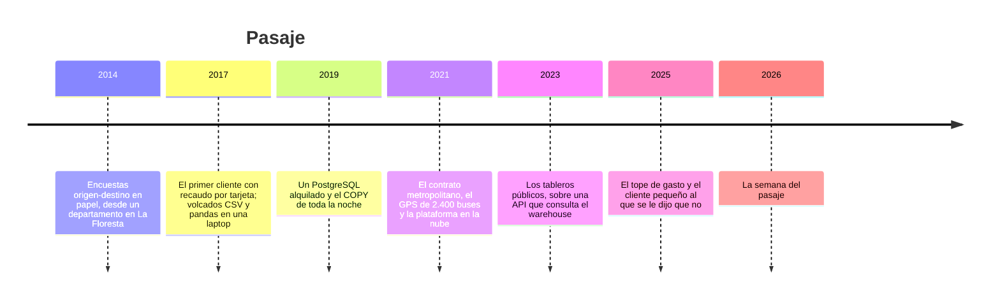

# 🚌 Pasaje: la historia

> **Qué es este documento:** la fuente de verdad de todo lo narrativo de Cristalería —la empresa, su
> gente, sus sistemas, sus cifras y sus reglas de negocio—. **Ninguna fase inventa un dato**: si lo
> necesita y no está aquí, se agrega aquí primero.
> **Vigencia:** 2026-10-06 · **primera versión, en discusión con el autor.** Los dolores de §4 van por
> tema; cuando exista la propuesta de fases, cada uno se ata a su fase. Las cifras de §5 son ficticias y
> los volúmenes del laboratorio se fijan en la propuesta de fases. El cliente metropolitano, su concejo
> y sus tarifas son inventados: ningún municipio ni proveedor real.

---

## 1. 📅 Cómo llegó hasta aquí

Pasaje es una consultora de movilidad urbana de Quito. Les vende a los municipios lo que el sistema de
transporte ya sabe y nadie mira: cuánta gente sube, dónde, a qué hora, cuántas veces transborda y
cuánto paga. Lo saca de los volcados del recaudo con tarjeta, de las posiciones GPS de los buses y de
los conteos que hacen sus inspectores a bordo, y lo devuelve como estudios, informes para el concejo y
tableros públicos. Hoy son veintiséis personas, seis municipios clientes y una plataforma de datos en
la nube que cuesta más que la mitad de la nómina. Esa plataforma los sacó de un apuro en 2021. Lo que
no está claro es si todavía la necesitan.

**2014 · Las encuestas.** Daniela Andrade dejó la secretaría de movilidad de su ciudad después de ocho
años haciendo encuestas origen-destino que tardaban dos años en procesarse y llegaban viejas. Fundó
Pasaje con una idea sencilla: el sistema de transporte ya registra cada viaje, solo hay que leerlo. El
primer año no tuvo a quién leérselo: los buses todavía cobraban en efectivo, y Pasaje sobrevivió
haciendo encuestas en papel desde un departamento en La Floresta.

**2017 · El primer volcado.** Una ciudad intermedia instaló validadores de tarjeta en sus buses y
contrató a Pasaje para entender los datos. El proveedor del recaudo mandaba un CSV mensual por
operadora: separador de punto y coma en unas, de coma en otras, decimales con coma, fechas en tres
formatos y una operadora que exportaba en Latin-1. Andrés Cevallos, el primer analista de la casa, lo
resolvió con pandas en su laptop. Funcionó, y durante dos años fue la manera de trabajar.

**2019 · El `COPY` de toda la noche.** Con tres clientes, los CSV dejaron de entrar en la memoria de la
laptop. Daniela alquiló un servidor con PostgreSQL: cada mes se cargaban los volcados con `COPY`, se
limpiaban con SQL y se consultaban desde un tablero web con su propio backend. La carga del mes
empezaba a las diez de la noche y terminaba a las cinco de la mañana, cuando terminaba. **Fue una
decisión razonable**, y ese PostgreSQL todavía guarda el catálogo de rutas y paradas, los contratos y
el histórico de tarifas.

**2021 · La plataforma.** Pasaje ganó el contrato metropolitano: cinco años, hasta diciembre de 2026,
con el recaudo de la ciudad más grande de sus clientes y, por primera vez, el GPS de sus 2.400 buses,
una posición cada diez segundos. El volumen se multiplicó por veinte en un trimestre, y el contrato
exigía tableros públicos con 99,5 % de disponibilidad. Daniela contrató a Rodrigo Paredes como director
técnico, y Rodrigo firmó la plataforma: un warehouse gestionado en la nube y un clúster de Spark
gestionado para el GPS. Su argumento: *"el PostgreSQL no da con el GPS, no tenemos a nadie que opere
un clúster propio, y esto trae escalado, copias y seguridad sin contratar a nadie"*. Tenía razón en los
tres puntos. Lo que no estaba en la discusión era cuánto de lo que Pasaje pregunta necesita un clúster.

**2023 · Los tableros públicos.** Valeria Mora, que entró como desarrolladora para el contrato, armó los
tableros que la secretaría publica en su portal: una página en TypeScript que llama a una API en Python,
que consulta el warehouse. Cada vez que alguien mueve un filtro, el warehouse cobra la consulta.

**2024 · El cuaderno paralelo.** El clúster tarda entre cuatro y seis minutos en despertar después de
suspenderse, y cobra por el tiempo que está despierto. Andrés, que explora decenas de preguntas por día,
volvió a hacer lo que hacía en 2017: exporta un pedazo a Parquet, lo baja a su laptop y lo trabaja con
pandas. Los informes salen de dos lugares, y nadie podría decir con certeza cuál de los dos produjo cada
número.

**2025 · El tope y el que se quedó afuera.** Gabriela Salazar, de administración, puso un tope de gasto
mensual a la plataforma después de un mes de veintidós mil dólares. Ese mismo año un municipio pequeño
pidió los mismos tableros que tenía el metropolitano, con un presupuesto de mil dólares mensuales para
todo. Daniela tuvo que decirle que no: solo la plataforma costaba más.

**2026 · La semana del pasaje.** Lo que pasó cuando el concejo metropolitano votó el alza de la tarifa
abre el curso (§4).

| Año | Qué pasó | Quién lo decidió | Lo que dejó |
|---|---|---|---|
| 2014 | Encuestas en papel | Daniela | la convicción de que el dato ya existe |
| 2017 | pandas en una laptop | Andrés | la manera de trabajar que nunca se fue |
| 2019 | PostgreSQL alquilado y `COPY` mensual | Daniela | el catálogo de rutas y paradas, que sigue sano |
| 2021 | Warehouse gestionado y Spark gestionado | Rodrigo, con aval de Daniela | el villano, con su mejor argumento |
| 2023 | Tableros públicos sobre una API | Valeria | un tablero que cobra cada filtro |
| 2024 | El cuaderno paralelo | Andrés, sin que nadie lo decidiera | los números de dos lugares |
| 2025 | Tope de gasto; un cliente rechazado | Gabriela y Daniela | el mercado que la plataforma deja afuera |
| 2026 | La semana del pasaje | — | el incidente que abre el curso |

## 2. 👥 La gente

| Personaje | Rol | Cómo habla | Qué quiere | Aparece en |
|---|---|---|---|---|
| **Daniela Andrade** | Fundadora y directora general, urbanista | Directa, en cifras de ciudad: *"¿y eso a cuántos pasajeros les toca?"* | que un número de Pasaje no se vuelva a corregir en la prensa | la apertura, el veredicto |
| **Rodrigo Paredes** | Director técnico desde 2021 | Seguro y franco: *"la plataforma la firmé yo, y con lo que sabía la volvería a firmar"* | que se mida antes de apagar nada | casi todas; es el interlocutor del lector |
| **Andrés Cevallos** | Analista de datos sénior, de Guayaquil | Rápido, de cuaderno: un *"ñaño"* por escena | que su laptop deje de ser el plan B | la consulta, el meta-duelo, la memoria |
| **Valeria Mora** | Desarrolladora de los tableros públicos | Precisa, de navegador: habla en kilobytes y en segundos de carga | un tablero que no dependa de un servidor encendido | el motor en el navegador, la publicación |
| **Gabriela Salazar** | Administración y finanzas | Contable: la plataforma es un costo fijo que no deja de crecer | una factura que se pueda anticipar | el villano, el veredicto |
| **Marcelo Guerrero** | Técnico de la secretaría de movilidad del cliente metropolitano | Formal y cansado de proveedores; *"ya mismo"*, que nunca significa ahora | tableros que sigan funcionando cuando el contrato termine | la publicación, el proyecto final |
| **Tú** | Ingeniero senior recién contratado | — | — | todas: Rodrigo te contrató para medir, no para opinar |

El encargo de Rodrigo, el día que entras: *"No quiero que me digas que la plataforma es mala; sin ella
no habríamos sobrevivido al GPS en 2021. Quiero saber qué pregunta cabe en un proceso y cuál no, con
qué herramienta, y qué nos cuesta cada una. Y si la plataforma está bien donde está, también quiero
saberlo."*

## 3. 🏚️ Lo que hay (el patrimonio)

| Sistema | Stack y edad | Quién lo mantiene | Sus mañas |
|---|---|---|---|
| **Volcados del recaudo** | CSV mensuales por operadora, desde 2017; del proveedor del recaudo | — (son del proveedor) | separadores, decimales, fechas y codificaciones distintas por operadora; columnas que cambian de nombre sin aviso; se **reemplazan enteros** cuando el proveedor corrige |
| **GPS de los buses** | Parquet por hora, en un bucket del proveedor de rastreo, desde 2021 | — (es del proveedor) | archivos pequeños: 24 por día y por operadora; los validadores de bus **no registran la parada**, solo la hora |
| **GTFS del sistema** | el estándar de rutas, paradas y horarios que publica la secretaría | Marcelo | cambia dos o tres veces al año, sin versionado |
| **Conteos a bordo** | un archivo SQLite por tablet de inspector, desde 2019 | el equipo de campo | cada tablet trae su archivo; se juntan a mano a fin de mes |
| **PostgreSQL** | el servidor de 2019: catálogo de rutas y paradas, contratos, histórico de tarifas | Rodrigo | sano; ya no recibe volcados |
| **La plataforma** | warehouse gestionado y Spark gestionado, desde 2021 | Rodrigo | cobra por consulta y por minuto despierto; el clúster tarda de cuatro a seis minutos en despertar |
| **Los tableros públicos** | TypeScript sobre una API en Python que consulta el warehouse, desde 2023 | Valeria | cada filtro es una consulta cobrada; si la plataforma se suspende, el tablero muestra *"Servicio no disponible"* |
| **El cuaderno de Andrés** | notebooks con pandas sobre Parquet exportados a su laptop | Andrés | no está en ningún respaldo, y produce la mitad de los informes |

**El laboratorio del curso levanta** el pipeline de Pasaje con DuckDB sobre los mismos tipos de archivo
(CSV sucios por operadora, Parquet de GPS por hora, GTFS y los SQLite de las tablets), generados con
semilla fija; pandas, Polars y SQLite para comparar; PostgreSQL de control; un almacenamiento de objetos
y un servidor estático en contenedores en lugar del bucket y del portal; y Spark de un nodo para medir
al villano.

## 4. 🔥 El incidente que lo empezó todo

Marzo, la semana en que el concejo metropolitano votaba el alza del pasaje de 35 a 45 centavos de
dólar. El lunes, la secretaría le pidió a Pasaje para el jueves tres números: cuántos viajes hace cada
tipo de tarifa por semana, cuántos de esos viajes incluyen un transbordo, y cuánto pagaría de más un
hogar de cada parroquia con la tarifa nueva.

El martes, un cuaderno que cruzaba las validaciones con el GPS sin acotar el tiempo de la unión corrió
nueve horas en el clúster. A las dos de la mañana del miércoles la plataforma tocó el tope de gasto de
Gabriela y se suspendió, y con ella la API de los tableros públicos. Rodrigo subió el tope a las siete;
el clúster tardó en despertar, y el cálculo de transbordos —agrupar las validaciones de cada tarjeta en
viajes— falló dos veces por una partición desbalanceada: las tarjetas de los inspectores, que validan
cientos de veces al día, caían todas en el mismo ejecutor.

Andrés intentó lo de siempre: bajar el trimestre a su laptop y calcularlo con pandas. A los ciento
ochenta millones de filas, `MemoryError`. Con el jueves encima, el equipo tomó una muestra del 10 % de
los días, calculó con ella y entregó a tiempo.

El jueves la sesión del concejo se transmitió en vivo. Un concejal abrió el tablero público para
mostrar el impacto por parroquia, con doscientas mil personas mirando el portal ese día, y en pantalla
apareció *"Servicio no disponible"*: la API no aguantó la carga, y cada intento de recarga era otra
consulta al warehouse. El alza se aprobó con los números del informe.

Una semana después, Andrés rehizo el cálculo con el trimestre completo. La muestra había dejado afuera
la semana de vacaciones escolares de un modo que subestimaba los viajes con tarifa estudiantil en un
11 %. Pasaje mandó la corrección; un diario la publicó con el titular *"La consultora del pasaje se
equivocó en las cuentas"*. Ese mes la factura de la plataforma fue de treinta y un mil dólares.

El lunes siguiente, Daniela preguntó: *"¿La plataforma nos la vendieron o la necesitamos?"*. Rodrigo
dijo que creía que la necesitaban para el GPS y que para lo demás no lo sabía, y que no quería creer:
quería medirlo. Marcelo, desde la secretaría, agregó lo suyo: el contrato termina en diciembre, y unos
tableros que se apagan cuando se acaba el contrato no le sirven a la ciudad. Esa semana Rodrigo abrió la
vacante que vas a ocupar.

### Los dolores, por tema

Cada uno abre una o más fases cuando la propuesta exista. Ninguno se inventa en la fase: sale de aquí.

1. **El `COPY` de toda la noche.** Los volcados del recaudo, con sus separadores, decimales, fechas y
   codificaciones distintos, consultados donde están, sin cargarlos antes.
2. **Las columnas que nadie pidió.** Cuánto de un Parquet lee de verdad una consulta: los row groups,
   sus estadísticas, lo que se salta y lo que no se puede saltar.
3. **Las cuentas del concejo.** Viajes por tipo de tarifa, semana y parroquia, con subtotales, rankings y
   percentiles: la agregación de la que depende un voto.
4. **La laptop de Andrés.** La misma transformación como SQL y como dataframe, en pandas y en Polars:
   tiempo, memoria, líneas y lo que cuesta cambiar un requisito.
5. **La parada que el validador no anota.** Cada validación de bus se ubica en una parada con la posición
   GPS más cercana en el tiempo: la unión por proximidad temporal entre cientos de millones de filas.
6. **Los transbordos.** Agrupar las validaciones de cada tarjeta en viajes, con la tarjeta del inspector
   que valida cientos de veces al día.
7. **La parroquia de cada parada.** Cruzar paradas con los límites de las parroquias para contar por
   territorio.
8. **El trimestre que no entra.** El `MemoryError` de Andrés: qué hace cada motor cuando el dato no cabe
   en la memoria, y cuánto cuesta.
9. **Lo que pasa adentro.** Por qué la misma consulta tarda lo que tarda: el plan, los operadores, los
   hilos y dónde se va el tiempo.
10. **El archivo de la base.** Cuando los derivados viven en un archivo de DuckDB: cómo comprime, cómo
    guarda los cambios, quién puede escribir y quién solo leer.
11. **Los archivos pequeños del GPS.** Veinticuatro Parquet por día y por operadora, leídos desde el
    almacenamiento de objetos sin bajarlos enteros.
12. **El derivado que se repite.** Materializar lo que se consulta siempre: orden, compresión,
    codificación, tamaño de los row groups y particiones.
13. **¿Qué volcado usó el informe?** El proveedor reemplaza volcados enteros: versionar los derivados para
    poder volver a calcular lo que se publicó.
14. **El tablero que se apaga.** El motor dentro de la pestaña del usuario, sobre Parquet servidos como
    archivos: sus límites de memoria, hilos y carga inicial.
15. **El tablero que no depende del contrato.** Publicarlo como sitio estático en el servidor de la
    secretaría, y medir lo que cuesta frente a la API y el warehouse.
16. **La factura.** El villano en la mesa: las tres preguntas del concejo respondidas en un proceso y en
    Spark, con puesta en marcha, tiempo, infraestructura y costo.
17. **Lo que sí necesita otra cosa.** Dónde el proceso único deja de servir: muchos escritores, datos en
    vivo, un volumen que de verdad no cabe en una máquina.

## 5. 💰 Las cifras

Todas ficticias, coherentes entre sí, y con los volúmenes del laboratorio por fijar en la propuesta de
fases.

| Cifra | Valor | Fuente o supuesto |
|---|---|---|
| Empleados | 26 (9 en datos y tecnología) | ficticia |
| Municipios clientes | 6; el metropolitano es el 60 % de la facturación | ficticia |
| Validaciones del cliente metropolitano | ≈ 1,1 M por día hábil; ≈ 380 M por año | ficticia |
| Volcados del recaudo, un año | ≈ 52 GB en CSV; ≈ 8 GB en Parquet | ficticia |
| Buses con GPS | 2.400, una posición cada 10 s en servicio | ficticia |
| Posiciones GPS | ≈ 17 M por día; ≈ 6.000 M por año; ≈ 95 GB por año en Parquet | ficticia |
| Archivos de GPS | 24 por día por cada una de las 11 operadoras | ficticia |
| Tablets de inspectores | 40; ≈ 300.000 conteos a bordo por año | ficticia |
| El `COPY` mensual de 2019 | de las 22:00 a las 05:00 | ficticia |
| Despertar del clúster | 4 a 6 min | ficticia |
| Factura mensual de la plataforma | ≈ USD 11.800 en 2025; USD 31.000 el mes del incidente | ficticia |
| Visitas a los tableros públicos | ≈ 35.000 por mes; 200.000 el día de la sesión | ficticia |
| Presupuesto del municipio pequeño | USD 1.000 por mes, todo incluido | ficticia |
| Error de la muestra | 11 % de subestimación de los viajes con tarifa estudiantil | ficticia |
| Tarifa general | de USD 0,35 a USD 0,45 | ficticia |

## 6. 📏 Las reglas de negocio

- **La validación.** Cada uso de una tarjeta en un validador de bus o en el torniquete de una estación.
  Lleva la tarjeta (seudonimizada), la hora, el validador, la ruta y el tipo de tarifa. **Los
  validadores de bus no registran la parada**; los de estación, sí.
- **La parada de una validación de bus** es la parada más cercana a la última posición GPS de ese bus
  anterior a la validación, si está a menos de 50 m; si no, la validación queda sin parada y se cuenta
  aparte.
- **Los tipos de tarifa.** General; y preferencial, a mitad de precio, para estudiantes, adultos mayores
  y personas con discapacidad.
- **El transbordo.** Una validación de la misma tarjeta en una ruta distinta dentro de los 45 minutos
  siguientes a la anterior no cobra pasaje: es parte del mismo viaje.
- **El viaje.** La secuencia de validaciones de una tarjeta unidas por transbordos. **Un viaje es un
  pasaje cobrado**, y es la unidad de todo lo que se informa al concejo.
- **Las tarjetas de servicio.** Inspectores y personal del sistema validan con tarjetas propias que no
  pagan; se excluyen de todo informe, pero están en los volcados.
- **Los volcados.** Son inmutables: cuando el proveedor corrige un mes, manda el mes entero otra vez.
  **Todo número publicado cita la versión del volcado de la que salió.**
- **La privacidad.** Pasaje nunca recibe nombres ni números de documento. Lo que se publica es
  agregado, y una celda con menos de 20 viajes no se muestra.
- **Los tableros públicos** son de la secretaría, no de Pasaje: lo que se publica tiene que poder
  seguir funcionando sin Pasaje.

## 7. 🗣️ Cómo hablan

La narración y las instrucciones al lector van en tuteo neutro. Las voces se reservan para los diálogos,
una expresión por escena:

- **Daniela** (Quito): *"de ley"*, *"chévere"*.
- **Andrés** (Guayaquil): *"ñaño"*, *"qué fue"*.
- **Marcelo** (Quito): *"ya mismo"*, que nunca significa ahora.
- **Rodrigo** habla de **puesta en marcha** y **costo por consulta**; **Gabriela**, de **la factura** y
  **el tope**; **Valeria**, de **kilobytes** y **segundos de carga**.

En la casa se dice **el volcado** (el archivo mensual del recaudo), **la plataforma** (el warehouse y el
clúster), **el cuaderno** (lo de Andrés), **el despertar** (los minutos del clúster) y **la semana del
pasaje**.
