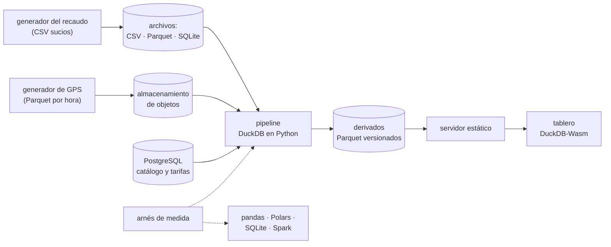

# 🎯 Alcance del proyecto
## Cristalería — el modelo analítico embebido a fondo

> **Qué es este documento:** la fuente de verdad de **qué** enseña el curso, a quién y con qué
> límites. Lo que no esté aquí no está en el curso.
> **Fecha de esta versión:** 6 de octubre de 2026. Consolida la semilla de agosto
> (`_desechable-semilla.md`), el alcance de agosto (`_desechable-alcance-v1.md`), la ficha de arranque,
> las reglas de la ruta y los precedentes de Proteo y Portalón. **Lo único preliminar es §9**: la
> cantidad de fases y su orden salen de la propuesta de fases.
> **Precedencia:** manda este documento. Después viene
> [`guia-de-estilo-y-convenciones.md`](guia-de-estilo-y-convenciones.md), que decide **cómo** se
> escribe; después el contrato de nombres y el diccionario de términos (por escribir), y las propuestas.
> Las plantillas y los prompts se actualizan siempre al final. Por encima de todos está el `CLAUDE.md`
> del repositorio, en lo que este curso no haya declarado como excepción (§12).
> **Estado de las decisiones:** 30 cerradas, ninguna abierta (§12). Solo faltan la propuesta de fases y
> la versión final de la historia.

---

## 1. 🧭 En una frase

**Un curso que enseña el modelo analítico embebido a fondo reconstruyendo y midiendo el pipeline de una
consultora de movilidad urbana, para que el lector pueda decidir —y defender con números propios— qué
pregunta cabe en un proceso, con qué herramienta se responde, qué le cuesta a ese proceso, y cuándo de
verdad hace falta el clúster.**

No forma ingenieros de datos ni administradores de plataformas, ni prepara una certificación. No enseña
analítico embebido desde cero: el lector ya hizo el minicurso de Ruta NoSQL Lite. Forma la capacidad de
decir *"las cuentas del concejo, los transbordos y el tablero caben en un proceso, por esta razón y con
este número; el año de GPS también, con este costo; y esto otro no, y por eso se queda en la
plataforma"*.

---

## 2. 🔥 El problema que resuelve

El lector salió de lite sabiendo por qué las columnas ganan a las filas en una agregación, que Parquet es
el formato de intercambio y que DuckDB agrega millones de filas sin servidor. Le falta lo que viene
después: leer archivos sucios donde están, saber cuánto de un Parquet lee de verdad una consulta, unir
por proximidad en el tiempo, sesionizar cientos de millones de validaciones, sobrevivir al dato que no
cabe en memoria, materializar y versionar lo que se repite, publicar sin servidor y elegir entre SQL y
dataframe con un número. Hoy eso se aprende la noche en que el clúster no despierta, o en tutoriales que
tratan a DuckDB como un juguete para notebooks o como el reemplazo de todo.

El villano es uno solo, **la infraestructura de analítica pesada para lo que cabe en un proceso**, y
tiene tres caras:

- **"Esto es big data: necesitamos un clúster."** El argumento del volumen es real para algo; el curso
  mide para qué. Se paga en puesta en marcha, en el despertar, en costo por consulta y en particiones
  desbalanceadas. El curso lo compara con Spark de un nodo sobre las mismas preguntas.
- **"Primero hay que cargarlo."** El `COPY` de toda la noche y la ingesta al warehouse, para archivos que
  se pueden consultar donde están.
- **"Para publicar un tablero hace falta un backend."** La API que cobra cada filtro y se apaga con el
  contrato, frente al motor dentro de la pestaña.

> ⚠️ **El antagonista no es ninguna herramienta.** La plataforma salvó a Pasaje del GPS en 2021, PostgreSQL
> sigue siendo el lugar del catálogo y los contratos, Polars gana donde gana, y el curso cierra con el
> veredicto de cuándo el proceso único no alcanza.

---

## 3. 🎓 Objetivo pedagógico

Al terminar, el lector puede hacer seis cosas que antes no podía:

1. **Leer archivos donde están**, con sus defectos, y **predecir cuánto leerá una consulta** de un Parquet:
   row groups, estadísticas, proyección y filtros empujados, confirmados con el perfil de la consulta.
2. **Resolver las preguntas difíciles del dominio en SQL analítico**: subtotales, ventanas, sesionización,
   uniones por proximidad temporal y espaciales, y decir qué algoritmo eligió el motor y por qué.
3. **Elegir entre SQL y dataframe** (DuckDB, Polars, pandas) para una transformación concreta, por tiempo,
   memoria, código y costo de cambio, en al menos dos volúmenes.
4. **Dimensionar un proceso**: memoria, hilos, spilling y almacenamiento propio del motor, con el número
   del perfil delante, y decir dónde está el techo de la máquina.
5. **Materializar, particionar y versionar derivados**, y publicarlos para que el motor corra en el
   navegador, con sus límites medidos.
6. **Poner al villano en la mesa**: la misma pregunta en un proceso y en un clúster, con puesta en marcha,
   tiempo, infraestructura y costo, y el árbol de cuándo no usar analítico embebido.

Lo que **no** es objetivo: operar una plataforma de datos corporativa, orquestar pipelines con
herramientas dedicadas, ni construir un producto de BI.

---

## 4. 👥 Perfil del lector

Ingeniero senior que **ya hizo Ruta NoSQL Lite**, o que sabe lo equivalente: SQL y modelado relacional de
oficio, Python de trabajo (funciones, entornos, un dataframe alguna vez), contenedores sin ayuda, y el
minicurso de analítico embebido de lite. Se le explica el modelo en profundidad y el motor por dentro; no
se le explica a programar, Docker, SQL ni lo que lite ya enseñó. TypeScript solo aparece en el tablero, y
basta con leerlo.

**Lo que se da por sabido y no se explica jamás:** SQL, ventanas y CTE, índices, transacciones
relacionales; Python y `uv`; Docker Compose; las cinco preguntas, el arnés y la apuesta antes de medir;
de lite, el almacenamiento por columnas contra por filas con su aritmética, Parquet como formato de
intercambio, agregar sin servidor, el pivote, el `EXPLAIN` básico, que el spilling existe y que dos
procesos no escriben el mismo archivo.

**Lo que se explica con cero ambigüedad**, aunque el lector sea senior: qué es un row group y cuándo se
salta, qué hace un vector y un morsel, qué empuja el motor hacia el archivo y qué no, cómo decide el
algoritmo de una unión, qué hace el buffer manager al llegar al límite, qué garantiza el archivo de
DuckDB a un segundo proceso, y qué cambia —y qué no— cuando el motor corre en WebAssembly.

> 🧭 **Ninguna caja negra prematura, no menos profundidad.**

**Requisitos de entrada:** un equipo con 16 GB de memoria (D-20), Docker Desktop o Podman, `uv` y un
navegador moderno. **No hace falta** ninguna cuenta en la nube ni nada instalado fuera de contenedores
salvo el navegador.

---

## 5. 🧭 La pregunta que ordena el curso

> *¿Esta pregunta cabe en un proceso, y qué le cuesta a ese proceso —y a la empresa— responderla ahí?*

Se presenta en la primera fase, con la semana del pasaje, y reaparece en el veredicto de cada fase:

- **La primera parte** responde *qué se puede preguntar sin cargar ni servir*: leer donde está, las
  cuentas del concejo, la parada, los transbordos, la parroquia, SQL o dataframe.
- **La segunda parte** responde *qué le cuesta al proceso*: el motor por dentro, la memoria, el archivo
  propio, los archivos remotos, los derivados y sus versiones.
- **La tercera parte** saca el proceso de la máquina de Pasaje: el motor en el navegador y el tablero
  publicado.
- **El cierre** responde la pregunta entera: la factura del villano y el veredicto.

---

## 6. 📏 Cómo se mide

**Todo "mejor que" lleva un número**, medido con el arnés del curso y consolidado en `BENCHMARKS.md`. Se
mide primero **la forma**: bytes leídos frente a bytes del archivo, row groups saltados, filas
escaneadas, memoria pico, bytes escritos al spilling, tamaño en disco, archivos tocados, peticiones HTTP
y bytes por la red. **Los tiempos sí aparecen** —en analítica interactiva la latencia es la pregunta—,
siempre con su dispersión (mediana, p95 y p99), caché frío y caliente por separado, hilos y límite de
memoria declarados, y nunca como único sostén de un veredicto (D-19).

Las reglas de honestidad no se negocian: se publica lo que salió · el empate se llama empate · nada de
números redondos sin dispersión · cada motor se usa bien y según su documentación (Polars en modo lazy
cuando corresponde, pandas con PyArrow, SQLite con sus índices, Spark con su configuración de un nodo
documentada) · **todo duelo se corre en al menos dos volúmenes**, porque en este modelo el ganador cambia
con el tamaño (D-27) · se declara lo que no se midió · y **nunca se extrapola de un portátil a
producción**: lo que se mide en un portátil con Docker se dice así. Los costos de la nube se citan desde
la documentación pública con fecha, marcados ☁️, y nunca se presentan como medidos.

Dos anclas por fase, cuando la fase las admite: 🪞 **una apuesta** escrita antes de ejecutar y 💥 **una
rotura provocada**, con el síntoma literal y lo que costó salir.

---

## 7. 🧪 El sistema del curso

### 7.1 El dominio

El pipeline analítico de **Pasaje**, una consultora de movilidad urbana de Quito: los volcados del
recaudo por operadora, el GPS de los buses por hora, el GTFS del sistema, los conteos a bordo en SQLite,
los límites de las parroquias; las validaciones ubicadas en su parada, agrupadas en viajes y contadas por
tarifa, semana y parroquia; los derivados materializados y versionados; y el tablero público que corre en
el navegador. PostgreSQL guarda el catálogo de rutas y paradas, los contratos y el histórico de tarifas.
La historia está en [`../00-historia-de-pasaje.md`](../00-historia-de-pasaje.md).

**Queda fuera a propósito:** el sistema de recaudo y el de rastreo (se simulan con generadores), el GPS en
vivo para el centro de control, pagos y tarjetas reales, datos personales de cualquier tipo, y el tablero
como producto de diseño.

### 7.2 El stack, y qué compra cada pieza

| Pieza | Elección | Qué compra | Qué cuesta |
|---|---|---|---|
| Motor principal | DuckDB, en el proceso de Python (D-18) | el modelo analítico embebido: consulta donde está, columnar, vectorizado | — |
| Rivales de dataframe | pandas 3 con PyArrow y Polars (D-16) | la pregunta de todos los días: SQL o código de dataframe | dos APIs más que el lector lee; los duelos se escriben tres veces |
| Rival embebido por filas | SQLite (D-16) | aislar la variable: columnas contra filas dentro de lo embebido | — es lo que ya llega de las tablets |
| Base de control | PostgreSQL | lo que cuesta lo mismo en el relacional servido, y el catálogo de la empresa | — es lo que ya existe en Pasaje |
| El villano | Spark de un nodo en contenedor (D-22); el warehouse gestionado solo desde documentación ☁️ | la misma pregunta en el modelo de clúster, medida de verdad | memoria del laboratorio: Spark corre solo en su bloque (D-20) |
| Almacenamiento remoto | un almacenamiento de objetos compatible con S3 y un servidor HTTP estático, en contenedores (D-30) | el bucket del GPS y el portal de la secretaría, sin nube | — |
| Navegador | DuckDB-Wasm con TypeScript y Vite (D-23) | el mismo motor en la pestaña del usuario | un segundo lenguaje, solo en el borde |
| Arnés, generador y simuladores | Python con `uv` (D-17) | la misma carga contra cada motor: volcados sucios, GPS, GTFS, tablets | — |

### 7.3 Cómo se construye el código

A mano, en un solo proyecto en `src/` que crece por fases (D-09): el pipeline en Python y, desde su
bloque, el tablero en TypeScript. Los generadores producen los mismos archivos para cada motor, con
semilla fija y volumen parametrizable.

### 7.4 El tamaño mínimo

Todo cabe en **16 GB** con perfiles de Compose: DuckDB y el arnés siempre, en el contenedor de Python;
PostgreSQL cuando la fase lo usa; el almacenamiento de objetos y el servidor estático en su bloque;
**Spark solo en el bloque del villano**. El dato que no cabe en memoria se provoca con el límite de
memoria del motor y del contenedor, no con un dataset de cien gigabytes (D-20).

---

## 8. 🧰 Herramientas y plataformas

**Versiones:** última estable a la fecha de la verificación previa, por digest para las imágenes y con
`uv.lock` y `package-lock.json` para las librerías, en el apéndice del laboratorio (D-07). DuckDB y
DuckDB-Wasm se fijan en la misma versión del motor cuando existan las dos; si no, se declara la
diferencia. **Plataformas:** macOS en Apple Silicon, Linux y Windows con WSL2; el autor verifica en
macOS arm64 y lo demás se marca no verificado (D-06). Los navegadores: el autor verifica en uno y lo
declara (D-23).

---

## 9. 🪜 La forma del curso

**Tipo:** curso completo. **Unas 100 horas en 10 a 12 fases** de unas 10 h. **Preliminar:** el arco, los
nombres y las fichas salen de la propuesta de fases. El borrador de partida son las doce fases de la
semilla, menos lo que lite ya dio (el columnar contra filas básico, Parquet como formato, el pivote, el
`EXPLAIN` y el spilling básicos), más lo que pide la profundidad: la unión temporal, la sesionización, lo
espacial, el archivo de DuckDB por dentro, el versionado de derivados y Spark medido.

| Bloque (tentativo) | Qué hace | Temas de la historia (§4 de ella) |
|---|---|---|
| **I · Leer donde está** | volcados sucios sin cargar, Parquet por dentro, el medidor de lectura | 1, 2 |
| **II · Las preguntas del concejo** | agregaciones, la parada, los transbordos, la parroquia, SQL o dataframe | 3, 4, 5, 6, 7 |
| **III · El proceso por dentro** | ejecución, memoria y spilling, el archivo de DuckDB | 8, 9, 10 |
| **IV · Archivos que se mueven** | remotos y pequeños, derivados, versiones | 11, 12, 13 |
| **V · Sin servidor** | el motor en el navegador, el tablero publicado | 14, 15 |
| **VI · La factura y el veredicto** | el villano medido, lo que sí necesita otra cosa | 16, 17 |

---

## 10. ✅ Lo que está dentro del alcance

- Lectura de CSV sucios donde están: detección, opciones, unión por nombre de columnas, errores y filas
  rechazadas.
- Parquet por dentro: row groups, páginas, estadísticas, codificaciones, filtros empujados, proyección; el
  medidor de lectura y el perfil de la consulta.
- SQL analítico de DuckDB a fondo: `GROUP BY ALL`, `GROUPING SETS`/`ROLLUP`/`CUBE`, ventanas,
  `QUALIFY`, cuantiles exactos y aproximados, listas y structs, macros.
- Uniones: hash, `ASOF JOIN`, uniones por rango; cuál elige el motor y cuánto cuesta.
- Sesionización (los transbordos) y el sesgo de las tarjetas de servicio.
- Lo espacial con la extensión oficial: punto en polígono para las parroquias.
- El meta-duelo SQL contra dataframe con pandas 3 y Polars (lazy y streaming), en dos volúmenes.
- El motor por dentro: ejecución vectorizada, morsels y pipelines, hilos, `EXPLAIN ANALYZE` y el perfil.
- Memoria: el límite, el buffer manager, el spilling, los operadores que no lo admiten; contra el streaming
  de Polars.
- El archivo de DuckDB: formato, compresión ligera, MVCC optimista, WAL y checkpoint, un escritor y
  lectores en solo lectura.
- Archivos remotos: S3 y HTTP con lectura por rangos, metadatos en caché, muchos archivos pequeños,
  particionado Hive y lo que cuesta.
- Materialización: orden, compresión, tamaño de row group y particiones, medidos antes y después.
- Versionado de derivados con DuckLake (D-24), frente a carpetas con fecha.
- DuckDB-Wasm: carga, memoria, hilos, lectura por rangos, límites; el tablero publicado en un servidor
  estático, medido frente a la API y el warehouse.
- Spark de un nodo sobre las mismas preguntas; el costo del warehouse gestionado desde su documentación.
- El árbol de cuándo no usar analítico embebido.

## 11. 🚫 Lo que está fuera del alcance

Se declara y el texto se detiene: **no se dice dónde estaría ese material.**

- Lo que Ruta NoSQL Lite ya enseñó de analítico embebido: se usa, no se explica.
- Orquestación de pipelines (Airflow, Dagster) y herramientas de transformación (dbt).
- Ingesta en tiempo real, CDC y el GPS en vivo.
- Machine learning y feature stores.
- Catálogos corporativos, gobierno de datos y linaje como disciplina.
- BI de arrastrar y soltar.
- Iceberg y Delta Lake más allá de nombrarlos frente a DuckLake (D-24).
- DuckDB distribuido, servicios gestionados de DuckDB y extensiones de la comunidad.
- Warehouses gestionados medidos de verdad: solo desde documentación (D-22).
- Clientes de DuckDB en otros lenguajes que Python y el navegador.

---

## 12. ⚖️ Decisiones

Si una sesión futura quiere cambiar una, primero la cambia aquí y después en todo lo demás, nunca al
revés. ✅ cerrada · ⏳ abierta · 🔄 reabierta. Las que llevan *(ruta)*, *(Proteo)* o *(Portalón)* siguen
la regla de la ruta o el precedente de ese curso; las que llevan *(por defecto)* las cerró la sesión con
el valor propuesto y se le listaron al autor.

| ID | Decisión | Valor | Estado |
|---|---|---|---|
| D-01 | Idioma | Español latinoamericano neutro con tuteo; código, comandos, identificadores y salida de terminal en inglés; comentarios de código en español | ✅ |
| D-02 | Tipo de curso | Curso completo | ✅ |
| D-03 | Autocontención | Lo publicado nombra Ruta NoSQL Lite **solo como requisito de entrada**: no usa su contenido, no remite a sus fases ni reutiliza sus ejemplos, datos o mediciones. `prompts/` puede citarla *(ruta, R-07)* | ✅ |
| D-04 | Promesa de esfuerzo | ~100 h en 10–12 fases de ~10 h *(Proteo)* | ✅ |
| D-05 | Aparato de evaluación | 20–30 ejercicios por fase, 🟢🟡🟠🔴 + 🔥, un tercio de diagnóstico o medición, cada uno con su criterio; **sin solución publicada**. Taller global: el pipeline de Pasaje en `src/`. Un 💀 boss por bloque cuando el bloque lo admita, y el proyecto final de §13 *(Proteo)* | ✅ |
| D-06 | Plataformas | macOS arm64, Linux, Windows con WSL2; el autor verifica en macOS arm64 | ✅ |
| D-07 | Política de versiones | Última estable a la fecha de la verificación previa; imágenes por digest, librerías con archivo de bloqueo, en el apéndice del laboratorio | ✅ |
| D-08 | Ejecución | Nada se publica sin haberse ejecutado | ✅ |
| D-09 | Código | Un solo proyecto en `src/` que crece por fases (`src/pipeline/` en Python, `src/dashboard/` en TypeScript desde su bloque), con tags `fase-NN-<slug>` *(Proteo)* | ✅ |
| D-10 | README y temario | Se escriben al final, en una tanda propia | ✅ |
| D-11 | Historia | Pasaje, en `00-historia-de-pasaje.md` | ✅ |
| D-12 | Diagramas | Mermaid | ✅ |
| D-13 | Publicación | Repositorio público propio del curso, sin `prompts/` | ✅ |
| D-14 | Prerrequisito | Ruta NoSQL Lite, o lo equivalente de §4 | ✅ |
| D-15 | Profundidad | Full geek: ejecución vectorizada y morsels, anatomía de Parquet, almacenamiento y compresión de DuckDB, buffer manager y spilling, MVCC optimista, WAL y checkpoint, algoritmos de unión, extensiones, DuckDB-Wasm por dentro | ✅ |
| D-16 | Rivales | DuckDB como principal; pandas 3 con PyArrow y Polars como rivales de dataframe; SQLite como embebido por filas; PostgreSQL de control | ✅ |
| D-17 | Lenguaje | **Python con `uv`** para el pipeline, el generador, el arnés y los duelos; **TypeScript con Vite** solo para el tablero. Diverge del valor de la ruta (R-06), y se declara en la guía §13 | ✅ |
| D-18 | Clientes | `duckdb` de PyPI en Python; `@duckdb/duckdb-wasm` en el navegador; ningún cliente de Node para DuckDB salvo que el build del tablero lo pida *(por defecto)* | ✅ |
| D-19 | Mediciones | Forma primero (bytes leídos, row groups saltados, memoria pico, spilling, tamaño, peticiones); tiempos con mediana, p95 y p99, caché frío y caliente por separado, hilos y límite de memoria declarados. Documento vivo: `BENCHMARKS.md` *(Proteo)* | ✅ |
| D-20 | Memoria del laboratorio | Todo dentro de 16 GB con perfiles de Compose; Spark solo en su bloque; el "no cabe en memoria" se provoca con límites, no con volumen *(Portalón)* | ✅ |
| D-21 | Datos | **Sintéticos con semilla fija**, con la forma de Pasaje: CSV sucios por operadora, GPS por hora, GTFS, SQLite de tablets y límites de parroquias inventados; volumen parametrizable; tarjetas de servicio con su sesgo. Sin datasets públicos reales: la semilla los proponía, pero la historia manda y así no hay licencias que verificar *(por defecto)* | ✅ |
| D-22 | El villano | Spark de un nodo en contenedor, implementado lo justo para responder las tres preguntas del concejo y medirlas. El warehouse gestionado, solo desde su documentación y precios públicos, citados con fecha y marcados ☁️ *(Proteo, con DocumentDB)* | ✅ |
| D-23 | El tablero | Una vista rica: dos o tres gráficos, un filtro por tarifa, semana y parroquia, y la regla de las 20 celdas. TypeScript con Vite, sin framework de interfaz; la librería de gráficos se elige en la verificación previa. Publicado en el servidor estático del laboratorio; publicarlo en un hosting gratuito, 🔥 opcional. El autor verifica en un navegador y lo declara *(por defecto)* | ✅ |
| D-24 | Versionado de derivados | DuckLake, frente a carpetas con fecha; Iceberg y Delta solo nombrados *(por defecto)* | ✅ |
| D-25 | Extensiones | Solo extensiones oficiales (`httpfs`, `spatial`, `ducklake` y las que pida la propuesta), instaladas en la imagen del laboratorio, no en tiempo de ejecución *(por defecto)* | ✅ |
| D-26 | El backend de comparación | Una API mínima en Python con DuckDB del lado del servidor, solo para medir el tablero contra la arquitectura clásica; no se enseña como producto *(Proteo, la API mínima)* | ✅ |
| D-27 | Volúmenes de los duelos | Todo duelo en al menos dos volúmenes, chico y grande, fijados en la propuesta de fases | ✅ |
| D-28 | Licencias | Se citan las licencias de DuckDB, DuckDB-Wasm, Polars, pandas, SQLite y Spark, verificadas y con fecha, en el apéndice del laboratorio; no son criterio central de elección | ✅ |
| D-29 | Imágenes en arm64 | Si una imagen (Spark incluido) no corre nativa en arm64, se declara y se mide emulada con esa advertencia, o se marca no verificado *(Portalón)* | ✅ |
| D-30 | Almacenamiento remoto | Un almacenamiento de objetos compatible con S3 y un servidor HTTP estático, en contenedores; ninguna nube | ✅ |

**Excepciones declaradas al `CLAUDE.md` del repositorio**, con su porqué (el detalle en la guía §13):

- **Ruta NoSQL Lite como prerrequisito** (D-14) → no se explican los fundamentos del analítico embebido →
  los da lite.
- **Los ejercicios no traen solución publicada** (D-05) → el lector apuesta y mide antes de mirar.

---

## 13. 🏁 El proyecto final

Antes de que termine el contrato metropolitano, Daniela tiene que presentarle a la junta y a la secretaría
una recomendación: qué preguntas se quedan en la plataforma (si alguna), cuáles pasan a un proceso, cómo
se publican los tableros para que sigan funcionando sin Pasaje, y qué costaría ofrecerle lo mismo al
municipio pequeño con mil dólares al mes. Se entrega como un informe con las mediciones del curso, la
autopsia de la plataforma con números antes y después, el tablero publicado en el servidor estático, y el
árbol de decisión de cuándo **no** usar analítico embebido aplicado a cada pregunta de Pasaje.

---

## 14. 🎯 Criterios de éxito

El curso está bien si:

- Cada fase abre con un dolor de Pasaje y cierra con algo que se apostó, se midió y, cuando tocaba, se
  rompió a propósito.
- Ninguna fase repite lo que lite ya enseñó de analítico embebido.
- Polars gana al menos una medición, y el curso lo dice con el número delante; y al menos una pregunta
  queda del lado del clúster o de la plataforma por una medición propia, no por una opinión.
- Un lector que solo hace los bloques I y II sale respondiendo las preguntas del concejo en un proceso;
  uno que sigue hasta el V sabe dimensionar el proceso, versionar lo que publica y sacarlo al navegador.
- El veredicto final no es "DuckDB para todo" ni "el clúster para todo".

---

## 15. 📌 Extensión futura, fuera de este curso

El diseño deja preparado, sin prometerlo, el GPS en vivo para el centro de control y el mismo pipeline
servido a varios municipios desde un solo catálogo compartido.
