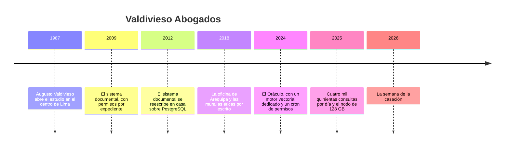

# ⚖️ Valdivieso Abogados: la historia

> **Qué es este documento:** la fuente de verdad de todo lo narrativo de Oráculo de Bolsillo —la
> empresa, su gente, sus sistemas, sus cifras y sus reglas de negocio—. **Ninguna fase inventa un
> dato**: si lo necesita y no está aquí, se agrega aquí primero.
> **Vigencia:** 2026-10-06 · **primera versión, en discusión con el autor.** Los dolores de §4 van por
> tema; cuando exista la propuesta de fases, cada uno se ata a su fase. Las cifras de §5 son ficticias y
> los volúmenes del laboratorio se fijan en la propuesta de fases. Los clientes, los expedientes, las
> resoluciones y la consultora son inventados: ningún caso, tribunal ni proveedor real.

---

## 1. 📅 Cómo llegó hasta aquí

Valdivieso Abogados es un estudio jurídico de Lima con oficina en Arequipa: ciento cuarenta abogados,
litigio civil y comercial, reestructuraciones, contratos y arbitraje. Su activo no es un sistema: son
treinta y nueve años de escritos, contratos, informes y expedientes, y la memoria de quién sabe dónde
está cada cosa. En 2024 ese activo se volvió consultable en lenguaje natural con un asistente que los
abogados bautizaron, medio en broma, **el Oráculo**, y que usan desde el celular hasta en los pasillos
del juzgado. Funcionó mejor de lo que nadie esperaba. Lo que nadie miró fue la costura entre el
Oráculo y lo que el estudio ya sabía de sus documentos.

**1987 · El estudio.** Augusto Valdivieso dejó un banco para abrir un estudio de litigio comercial con
dos socios. Durante veinte años, la memoria del estudio fue la biblioteca y la cabeza de Sandra Mamani,
que entró en 1996 como asistente y terminó dirigiendo la gestión del conocimiento.

**2009 · El sistema documental.** Con cuarenta abogados y expedientes que se perdían entre oficinas, el
estudio compró un sistema documental con permisos por expediente: cada documento pertenece a un
expediente, y solo el equipo asignado a ese expediente lo ve.

**2012 · En casa, sobre PostgreSQL.** El proveedor del sistema cerró. Renato Quispe, recién llegado como
jefe de sistemas, lo reescribió con un equipo de dos personas sobre PostgreSQL: documentos, versiones,
expedientes, equipos y permisos. **Fue una decisión excelente**, y catorce años después sigue siendo la
fuente de verdad de todo lo que el estudio guarda.

**2018 · Las murallas.** Al abrir Arequipa, el estudio empezó a atender a empresas que a veces estaban
del otro lado de un cliente de Lima. Gonzalo Ríos, socio a cargo de riesgos y ética, formalizó las
**murallas éticas**: cuando hay conflicto potencial, un grupo de abogados queda excluido de un grupo de
expedientes, aunque su equipo normalmente los vería. El sistema documental las aplica en cada consulta.

**2024 · El Oráculo.** Álvaro Benavides, el socio más joven, volvió de un congreso de tecnología legal
convencido, y el estudio contrató a una consultora para construir un asistente. La consultora propuso
un motor vectorial dedicado en un servidor propio, la ingesta en Python, embeddings y generación por
API, y un proceso nocturno que copia los permisos del sistema documental al motor, como metadatos de
cada fragmento. Renato lo aprobó. Su argumento: *"son treinta millones de fragmentos; PostgreSQL es
nuestra base de verdad y no voy a meterle encima una carga que no conozco; el motor dedicado está hecho
para esto, y la consultora lo opera el primer año"*. Tenía razón en las tres cosas. Lo que no estaba en
la discusión era qué pasa con un permiso entre las 2:00 de una noche y las 2:00 de la siguiente.

**2025 · El éxito.** El Oráculo pasó de doscientas consultas por día a cuatro mil quinientas. Los
asociados lo usan para encontrar escritos parecidos, cláusulas, resoluciones; los socios, para
preparar audiencias desde el celular. El motor creció a un nodo de 128 GB de memoria. La consultora
terminó su año, y la operación quedó en manos de Renato, que nunca había operado ese motor.

**2026 · La semana de la casación.** Lo que pasó en abril abre el curso (§4).

| Año | Qué pasó | Quién lo decidió | Lo que dejó |
|---|---|---|---|
| 1987 | El estudio | Augusto Valdivieso | la cartera y la biblioteca |
| 2009 | Sistema documental con permisos | los socios | el permiso por expediente |
| 2012 | Reescritura sobre PostgreSQL | Renato | la base de verdad, que sigue sana |
| 2018 | Murallas éticas | Gonzalo | la regla que nunca se puede romper |
| 2024 | El Oráculo con motor dedicado y cron de permisos | Renato, a propuesta de Álvaro y la consultora | el villano, con su mejor argumento |
| 2025 | 4.500 consultas por día; la consultora se va | — | un motor que nadie en casa sabe operar |
| 2026 | La semana de la casación | — | el incidente que abre el curso |

## 2. 👥 La gente

| Personaje | Rol | Cómo habla | Qué quiere | Aparece en |
|---|---|---|---|---|
| **Carmen Valdivieso** | Socia directora, hija del fundador | Formal y precisa; pregunta por la responsabilidad antes que por la técnica | que el estudio no vuelva a aparecer en la prensa jurídica por una cita | la apertura, el veredicto |
| **Renato Quispe** | Gerente de tecnología desde 2012 | Seguro y franco: *"el motor lo aprobé yo, y con lo que sabía lo volvería a aprobar"* | que se mida antes de mover nada | casi todas; es el interlocutor del lector |
| **Gonzalo Ríos** | Socio de riesgos y ética | Lento y exacto; cada palabra tiene consecuencia | que ninguna muralla tenga una ventana | permisos, filtrado, la costura |
| **Sandra Mamani** | Jefa de gestión del conocimiento, desde 1996 | Paciente, de biblioteca: sabe dónde está todo | que el Oráculo encuentre lo que ella encontraría | la evaluación, el chunking, las citas |
| **Álvaro Benavides** | Socio de innovación | Entusiasta, de congreso: *"esto lo hace todo el mundo ya"* | que el Oráculo siga y crezca | el villano, el modelo nuevo |
| **Mariela Chávez** | Asociada sénior de litigios | Rápida, siempre entre audiencias; un *"pucha"* por escena | una respuesta en el celular, en el pasillo, que pueda firmar | la latencia, la generación, las citas |
| **Tú** | Ingeniero senior recién contratado | — | — | todas: Renato te contrató para medir, no para opinar |

El encargo de Renato, el día que entras: *"No quiero que me digas que el motor es malo; sin él no
habríamos tenido el Oráculo. Quiero saber dónde tienen que vivir los vectores, cómo se filtra sin
ventanas, cómo sabemos que lo que devuelve es lo que tiene que devolver, y qué nos cuesta cada opción.
Y si el motor está bien donde está, también quiero saberlo."*

## 3. 🏚️ Lo que hay (el patrimonio)

| Sistema | Stack y edad | Quién lo mantiene | Sus mañas |
|---|---|---|---|
| **El sistema documental** | PostgreSQL, en casa, desde 2012 | Renato | sano; documentos, versiones, expedientes, equipos, permisos y murallas; **es la base de verdad** |
| **La biblioteca de jurisprudencia** | resoluciones y normas públicas, recopiladas por Sandra desde 2005 | Sandra | numeración irregular; resoluciones con varias versiones publicadas |
| **El Oráculo: ingesta** | Python, de la consultora, 2024 | Renato, desde 2025 | corta en fragmentos de tamaño fijo, sin mirar la estructura; al reprocesar un documento le asigna identificadores nuevos a sus fragmentos |
| **El Oráculo: motor** | un motor vectorial dedicado, un nodo de 128 GB, desde 2024 | Renato, desde 2025 | los permisos viven en los metadatos de cada fragmento, copiados por el cron |
| **El cron de permisos** | un proceso nocturno a las 2:00 | Renato | lo que cambia en el sistema documental durante el día llega al motor esa noche |
| **El Oráculo: generación** | embeddings y respuestas por API externa | — (es del proveedor) | los fragmentos de los clientes salen del estudio en cada consulta |
| **La app del celular** | una web móvil que llama al Oráculo | la consultora, sin mantenimiento | la respuesta tarda lo que tarda la cadena entera |

**El laboratorio del curso levanta** el Oráculo sobre PostgreSQL con pgvector (y con pgvectorscale y
Qdrant para comparar), con un corpus jurídico sintético con la forma del de Valdivieso, embeddings, un
reranker y un modelo de lenguaje locales, en contenedores. Pinecone se trata solo desde su
documentación.

## 4. 🔥 El incidente que lo empezó todo

Abril. Mariela tenía que presentar una apelación el jueves, en un arbitraje comercial convertido en
proceso civil. El martes por la noche, desde el celular, le preguntó al Oráculo por jurisprudencia
sobre resolución de contratos por incumplimiento parcial. La respuesta fue impecable: una casación de
la Sala Civil de 2019, con el considerando citado entre comillas y el enlace a la resolución. Mariela
copió el párrafo al escrito.

El párrafo no estaba en esa casación. Estaba en otra resolución, de otra sala, que decía casi lo
contrario en su siguiente considerando. Meses antes, la ingesta había reprocesado parte de la
biblioteca; los fragmentos recibieron identificadores nuevos, pero la tabla que traducía un fragmento
a su resolución de origen se había actualizado a medias. El Oráculo citó bien el texto y mal la
fuente. El relator del juzgado lo notó; el abogado de la contraparte lo comentó en un medio de prensa
jurídica, con el nombre del estudio.

Esa misma semana, el miércoles a las 10:40, Gonzalo levantó una muralla ética: el estudio iba a asesorar
a un banco en la reestructuración de una empresa que, tres años antes, había sido cliente de la oficina
de Arequipa. A las 15:10, un asociado del equipo del banco le preguntó al Oráculo por precedentes de
reestructuración, y entre los fragmentos de la respuesta apareció un párrafo de un informe interno de
aquel expediente de Arequipa. El sistema documental ya lo bloqueaba desde las 10:40. El motor no lo
sabría hasta el cron de las 2:00.

Gonzalo tuvo que avisar a los dos clientes. La empresa de Arequipa pidió una reunión con Carmen. El
lunes siguiente, en el comité de socios, Carmen preguntó: *"¿El Oráculo está mal hecho, o está mal
puesto?"*. Álvaro dijo que el motor era el estándar de la industria. Renato dijo que creía saber la
respuesta, y que no quería creer: quería medirla. Gonzalo puso una sola condición: desde ese día, ningún
documento de un cliente sale del estudio, tampoco hacia una API. Esa semana Renato abrió la vacante que
vas a ocupar.

### Los dolores, por tema

Cada uno abre una o más fases cuando la propuesta exista. Ninguno se inventa en la fase: sale de aquí.

1. **El fragmento que no respeta el documento.** La ingesta corta cada 512 tokens, a mitad de un
   considerando o de una cláusula. Cómo se corta cambia lo que se encuentra.
2. **La cita que apunta a otro lado.** Un fragmento, su texto y su procedencia tienen que ser la misma
   cosa siempre: identificadores estables y una sola fuente de verdad.
3. **La muralla que llega tarde.** Un permiso que cambia a las 10:40 y llega a las 2:00: filtrar donde
   vive el permiso, o copiarlo y vivir con la ventana.
4. **El filtro que vacía el resultado.** Un asociado ve cuarenta expedientes de nueve mil ochocientos: el
   filtro tan selectivo que el índice aproximado no encuentra nada.
5. **Los números que el vector no entiende.** Un número de expediente, de casación o de artículo: lo
   léxico, lo denso y cómo se funden.
6. **La pregunta del abogado no es el texto de la sentencia.** Recuperar cien y reordenar diez:
   cuánto compra un reranker y cuánto cuesta.
7. **¿Cómo sabemos que funciona?** El conjunto de preguntas de Sandra, con lo que ella encontraría:
   medir la recuperación antes de discutirla.
8. **La cita se comprueba.** Generar una respuesta en la que cada cita existe literalmente en su fuente,
   y lo que se hace cuando no.
9. **La plantilla repetida diez veces.** Escritos casi idénticos que llenan los diez primeros
   resultados con lo mismo.
10. **El contrato con adendas.** Qué versión de un documento responde la pregunta, y cómo se filtra por
    vigencia.
11. **El cliente que escribe en inglés.** Contratos internacionales en inglés y preguntas en español.
12. **Treinta millones de fragmentos.** Lo que pesan en memoria, y lo que se gana y se pierde al
    comprimirlos o llevarlos a disco.
13. **El grafo por dentro.** Cuánto tarda en construirse el índice, qué le pasa con las inserciones y
    los borrados diarios, y qué parámetros lo deciden.
14. **El modelo nuevo.** Cambiar el modelo de embeddings sin apagar el Oráculo: treinta millones de
    fragmentos otra vez.
15. **La respuesta en el pasillo.** Mariela tiene treinta segundos: dónde se va el tiempo entre la
    pregunta y la respuesta en el celular.
16. **El motor que nadie en casa sabe operar.** Copias, actualizaciones, monitoreo y guardia de un
    servicio más; y lo que costaría no operarlo.
17. **El villano en la mesa.** El motor dedicado con su cron frente a PostgreSQL, con números antes y
    después.
18. **Lo que sí necesita el dedicado.** Dónde PostgreSQL deja de alcanzar de verdad, si es que deja.

## 5. 💰 Las cifras

Todas ficticias, coherentes entre sí, y con los volúmenes del laboratorio por fijar en la propuesta de
fases.

| Cifra | Valor | Fuente o supuesto |
|---|---|---|
| Abogados | 140 (112 en Lima, 28 en Arequipa); 260 personas en total | ficticia |
| Documentos en el sistema documental | ≈ 2,1 M, con ≈ 3,4 M versiones | ficticia |
| Expedientes activos | ≈ 9.800 | ficticia |
| Expedientes que ve un asociado típico | ≈ 40 | ficticia |
| Resoluciones y normas en la biblioteca | ≈ 380.000 | ficticia |
| Fragmentos en el motor | ≈ 31 M (≈ 24 M de documentos propios, ≈ 7 M de la biblioteca) | ficticia |
| Documentos en inglés | ≈ 9 % de los contratos | ficticia |
| Murallas éticas activas | 37 | ficticia |
| Consultas al Oráculo | ≈ 4.500 por día; picos de 40 por minuto antes de las audiencias de la mañana | ficticia |
| El nodo del motor | 128 GB de memoria | ficticia |
| El cron de permisos | todos los días a las 2:00 | ficticia |
| La ventana del incidente | de las 10:40 a las 15:10: el fragmento salió 4 h 30 min después de levantada la muralla | ficticia |
| Implementación de la consultora | USD 85.000 | ficticia |
| Costo mensual del Oráculo | ≈ USD 6.400 (servidor, APIs de embeddings y generación) | ficticia |
| Lo que tarda la respuesta en el celular | mediana de 9 s; las peores, más de 30 s | ficticia |

## 6. 📏 Las reglas de negocio

- **El expediente.** Todo documento propio pertenece a un expediente; un abogado ve los documentos de
  los expedientes de su equipo, y nada más.
- **La muralla ética** manda sobre el equipo: un abogado excluido de un expediente no ve nada de él,
  **desde el momento en que se levanta la muralla**, aunque esté en el equipo.
- **La biblioteca** es pública para todo el estudio.
- **La cita.** Toda afirmación de una respuesta lleva su fuente: documento o resolución, versión y
  lugar exacto (considerando, cláusula, página). **El texto entre comillas tiene que existir
  literalmente en esa fuente**; si no se puede comprobar, no se muestra entre comillas.
- **Sin fuente, sin respuesta.** Si nada de lo recuperado alcanza el umbral, el Oráculo dice que no
  encontró sustento, y no responde.
- **La versión vigente.** Un contrato con adendas responde con su versión vigente, salvo que la
  pregunta pida una fecha.
- **Nada sale del estudio.** Desde abril de 2026, ningún documento de un cliente, ningún fragmento y
  ninguna pregunta sale hacia un servicio externo.
- **La base de verdad** de documentos, versiones, expedientes, equipos, permisos y murallas es el
  sistema documental. Todo lo demás es derivado y se puede reconstruir.

## 7. 🗣️ Cómo hablan

La narración y las instrucciones al lector van en tuteo neutro. Las voces se reservan para los diálogos,
una expresión por escena:

- **Mariela** (Lima): *"pucha"*, *"al toque"*.
- **Renato** (Lima): *"ya pues"*, cuando algo no tiene remedio.
- **Sandra** (Arequipa): habla de **dónde está** cada cosa, nunca de cómo se busca.
- **Carmen** habla de **responsabilidad** y **el cliente**; **Gonzalo**, de **la muralla** y **la
  ventana**; **Álvaro**, de **la industria**.

En la casa se dice **el Oráculo**, **el sistema documental**, **la biblioteca** (la de Sandra), **la
muralla**, **el cron** y **la semana de la casación**.
