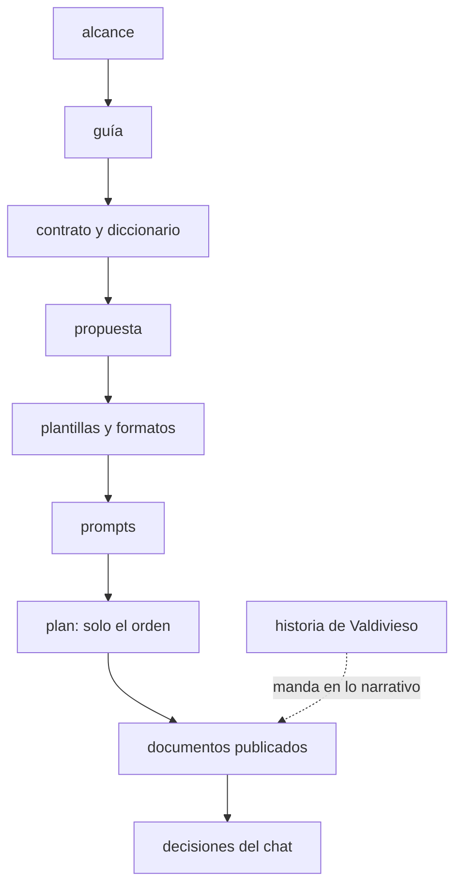

# 🧰 `prompts/` — la maquinaria del curso
## Oráculo de Bolsillo — el modelo vectorial a fondo

Este directorio no es material del curso: es **lo que se usa para escribirlo**. El lector nunca lo abre.
Quien escribe una fase lo lee entero antes de teclear la primera línea.

> **Estado:** en preparación. Ficha, alcance (32 decisiones cerradas) y guía cerrados el 06/10/2026, salvo
> lo que depende de las fases. **Solo faltan la propuesta de fases (E2) y la versión final de la
> historia**, que se trabajan cuando todos los cursos de la ruta tengan su `prompts/`.

---

## 📖 Qué hay aquí, y cuándo se lee

| Documento | Qué es | Cuándo se lee |
|---|---|---|
| [`ficha-de-arranque.md`](ficha-de-arranque.md) | las respuestas de la discusión de arranque y su traducción a decisiones | al retomar el diseño; manda el alcance |
| [`alcance-del-proyecto.md`](alcance-del-proyecto.md) | qué enseña el curso, a quién, con qué límites; las decisiones `D-xx` | antes de escribir cualquier cosa |
| [`guia-de-estilo-y-convenciones.md`](guia-de-estilo-y-convenciones.md) | cómo se escribe; checklist de §12 | en cada sesión, siempre |
| [`../00-historia-de-valdivieso-abogados.md`](../00-historia-de-valdivieso-abogados.md) | el estudio, su gente, sus cifras y sus reglas; la lee el lector | cada vez que una fase necesita un dato del estudio |

**Por escribir**, en este orden: `propuesta-fases-y-alcance.md` y `propuesta-apendices-y-alcance.md`
(E2), `plan-de-produccion.md` (E3), `diccionario-de-terminos.md`, `contrato-de-nombres.md`,
`plantillas-de-capitulo.md` y el verificador (E4), `prompts-de-fase.md` y `prompts-de-apendice.md` (E5).

**De consulta, sin autoridad** (los documentos de agosto; no se citan desde el curso):

| Documento | Para qué sirve todavía |
|---|---|
| `_desechable-semilla.md` | **el borrador del temario**: manda como fuente de temas hasta que la propuesta de fases se cierre; Weaviate y las codas en Java y C++ quedaron fuera (D-16, D-28) |
| `_desechable-alcance-v1.md` | el árbol de "cuándo NO usar un motor vectorial dedicado", a reutilizar en E2 |
| `_desechable-guia-de-estilo-v1.md` | la guía de agosto, ya absorbida por la nueva |
| `_desechable-prompts-v1.md` | los prompts de agosto, de referencia para E5 |

**Orden de autoridad**, cuando dos se contradicen: (1) el alcance, (2) la guía, (3) el contrato y el
diccionario, (4) la propuesta, (5) las plantillas y los formatos, (6) los prompts, (7) el plan, solo
sobre el orden, (8) los documentos ya publicados, (9) las decisiones del chat actual. La historia manda
sobre todo lo narrativo.

> 🧭 **Si una contradicción aparece al escribir, se arregla en el documento de arriba primero.**

---

## 🚀 Lo que sigue

1. **E2**, cuando los once cursos de la ruta tengan su `prompts/`: el arco de bloques y la lista de
   fases primero; con el arco aprobado, las fichas. Punto de partida: la semilla, el alcance §9 y los
   dieciocho dolores de la historia. El recorte contra lite se hizo sobre sus fases 15 y 16 ya
   publicadas: releerlas antes de proponer, para no repetir ni un ejemplo.
2. Con las fases, la versión final de la historia (cada dolor atado a su fase) y la plantilla de fase de
   la guía.
3. E3 en adelante, según `zz-instrucciones/00-workflow-de-un-curso.md`.

---

## ⚠️ Las tres cosas que más se van a romper al escribir

- **Volver a explicar lo que lite ya enseñó** (embeddings, prefijos, HNSW y `ef`, el primer filtro,
  pgvector contra Qdrant a un millón).
- **Llamar "recall" a cualquiera de los dos**, o comparar motores a la misma configuración en lugar de al
  mismo recall del índice.
- **Convertir el curso en un tutorial de RAG**, o inventar un dato de Valdivieso que debía salir de la
  historia.
