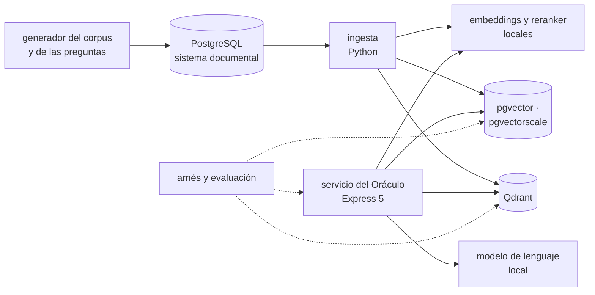

# 🎯 Alcance del proyecto
## Oráculo de Bolsillo — el modelo vectorial a fondo

> **Qué es este documento:** la fuente de verdad de **qué** enseña el curso, a quién y con qué
> límites. Lo que no esté aquí no está en el curso.
> **Fecha de esta versión:** 6 de octubre de 2026. Consolida la semilla de agosto
> (`_desechable-semilla.md`), el alcance de agosto (`_desechable-alcance-v1.md`), la ficha de arranque,
> las reglas de la ruta y los precedentes de Proteo, Portalón y Cristalería. **Lo único preliminar es
> §9**: la cantidad de fases y su orden salen de la propuesta de fases.
> **Precedencia:** manda este documento. Después viene
> [`guia-de-estilo-y-convenciones.md`](guia-de-estilo-y-convenciones.md), que decide **cómo** se
> escribe; después el contrato de nombres y el diccionario de términos (por escribir), y las propuestas.
> Las plantillas y los prompts se actualizan siempre al final. Por encima de todos está el `CLAUDE.md`
> del repositorio, en lo que este curso no haya declarado como excepción (§12).
> **Estado de las decisiones:** 32 cerradas, ninguna abierta (§12). Solo faltan la propuesta de fases y
> la versión final de la historia.

---

## 1. 🧭 En una frase

**Un curso que enseña el modelo vectorial a fondo reconstruyendo y midiendo el asistente de un estudio
jurídico, para que el lector pueda decidir —y defender con números propios— dónde viven los vectores,
cómo se filtran sin ventanas, cómo se sabe que lo recuperado es lo correcto, qué cuesta guardarlos, y
cuándo de verdad hace falta un motor dedicado.**

No forma científicos de datos ni ingenieros de modelos de lenguaje, ni es un tutorial de RAG. No enseña
vectorial desde cero: el lector ya hizo el minicurso de Ruta NoSQL Lite. Forma la capacidad de decir
*"los vectores del Oráculo viven junto a los permisos, por esta razón y con este número; la búsqueda es
híbrida porque los números de expediente lo piden, y el recall con el filtro de un asociado es este; y
el motor dedicado haría falta a partir de aquí, si es que hace falta"*.

---

## 2. 🔥 El problema que resuelve

El lector salió de lite sabiendo qué es un embedding, cómo se busca con HNSW, qué compra `ef` y que
pgvector y Qdrant se separan con el filtro. Le falta lo que viene después: cortar documentos de verdad,
medir si lo recuperado es lo que había que recuperar, filtrar por permisos que cambian durante el día,
fundir lo léxico con lo denso, reordenar, generar con citas que se comprueban, guardar treinta millones
de vectores sin comprar una máquina de 256 GB, migrar de modelo sin apagar nada, y elegir dónde ponerlos.
Hoy eso se aprende la semana en que una cita sale mal en un juzgado, o en tutoriales que empiezan
instalando un motor dedicado y terminan en el `print` de la respuesta del modelo.

El villano es uno solo, **el motor vectorial dedicado puesto antes de medir, separado de donde viven los
permisos y la verdad**, y tiene tres caras:

- **"Esto necesita un motor vectorial."** El argumento del volumen es real para algo; el curso mide para
  qué, frente a pgvector y pgvectorscale bien jugados.
- **"Los permisos los copiamos de noche."** La costura entre el índice y la base de verdad: la ventana de
  la muralla, los identificadores que cambian al reprocesar, la cita que apunta a otro lado.
- **"Si devuelve algo parecido, funciona."** Sin un conjunto de evaluación, nadie sabe si el Oráculo
  encuentra lo que Sandra encontraría; el recall del índice no es la calidad de la recuperación.

> ⚠️ **El antagonista no es ninguna herramienta.** El Oráculo cambió la forma de trabajar del estudio,
> Qdrant gana donde gana y el curso lo publica, PostgreSQL es la base de verdad desde 2012, y el curso
> cierra con el veredicto de cuándo el vector no hacía falta.

---

## 3. 🎓 Objetivo pedagógico

Al terminar, el lector puede hacer seis cosas que antes no podía:

1. **Medir la calidad de una recuperación** con un conjunto etiquetado (recall@k, MRR, nDCG), y no
   confundirla nunca con el recall del índice aproximado frente al exacto.
2. **Diseñar la ingesta**: cortar por estructura, guardar procedencia estable, deduplicar casi
   idénticos y versionar, de modo que una cita siempre apunte a su fuente.
3. **Filtrar sin ventanas y sin vaciar el resultado**: permisos y murallas donde viven, iterative scans,
   índices de payload, y saber qué estrategia elige cada motor con un filtro muy selectivo.
4. **Combinar señales**: léxico y denso fundidos, reranker, diversidad, y cuánto compra cada pieza en
   calidad y en tiempo.
5. **Dimensionar el índice**: HNSW por dentro, DiskANN, cuantización con reevaluación, memoria y disco, y
   migrar de modelo sin apagar el servicio.
6. **Elegir dónde viven los vectores** entre pgvector, pgvectorscale, Qdrant y un servicio gestionado, por
   calidad, costo, operación y consistencia, con una medición propia.

Lo que **no** es objetivo: entrenar ni ajustar modelos, la ingeniería de prompts como disciplina,
construir un producto de tecnología legal, ni operar un motor dedicado en producción corporativa.

---

## 4. 👥 Perfil del lector

Ingeniero senior que **ya hizo Ruta NoSQL Lite**, o que sabe lo equivalente: SQL y modelado relacional de
oficio, TypeScript con soltura, Python de lectura, contenedores sin ayuda, y el minicurso vectorial de
lite. Se le explica el modelo en profundidad y los índices por dentro; no se le explica a programar,
Docker, SQL ni lo que lite ya enseñó.

**Lo que se da por sabido y no se explica jamás:** SQL, índices, transacciones, row-level security en su
uso básico; TypeScript, Node y `uv`; Docker Compose; las cinco preguntas, el arnés y la apuesta antes de
medir; de lite, qué es un embedding, los prefijos del modelo, punto, vector, payload e id, coseno y
producto interno, HNSW y `ef`, el filtro de payload, el recall contra una verdad conocida, y la memoria
de pgvector y Qdrant con un millón de vectores.

**Lo que se explica con cero ambigüedad**, aunque el lector sea senior: qué hace HNSW al insertar y al
borrar, qué pierde y qué recupera una cuantización, por qué un filtro selectivo vacía un índice
aproximado, qué garantiza un iterative scan, cómo se funde una lista léxica con una densa, qué cambia un
reranker, qué es exactamente cada métrica de evaluación, y por qué un permiso copiado tiene una ventana.

> 🧭 **Ninguna caja negra prematura, no menos profundidad.**

**Requisitos de entrada:** un equipo con 16 GB de memoria (D-20), Docker Desktop o Podman, Node 24 y
`uv`. **No hace falta** ninguna cuenta en la nube, ninguna clave de API ni nada instalado fuera de
contenedores.

---

## 5. 🧭 La pregunta que ordena el curso

> *¿Dónde tienen que vivir los vectores de este sistema para que lo que se recupera sea lo correcto, lo
> permitido y lo comprobable, y qué cuesta que vivan ahí?*

Se presenta en la primera fase, con la semana de la casación, y reaparece en el veredicto de cada fase:

- **La primera parte** responde *qué es lo correcto*: la evaluación, la ingesta, lo léxico y lo denso, el
  reranker, la diversidad.
- **La segunda parte** responde *qué es lo permitido y lo comprobable*: los permisos, las murallas, la
  costura, las versiones, las citas que se verifican.
- **La tercera parte** responde *qué cuesta*: el índice por dentro, la compresión y el disco, el modelo
  nuevo, la latencia en el pasillo, la operación.
- **El cierre** responde la pregunta entera: la autopsia del motor con su cron y el veredicto.

---

## 6. 📏 Cómo se mide

**Todo "mejor que" lleva un número**, medido con el arnés del curso y consolidado en `BENCHMARKS.md`. Se
mide primero **la calidad**: recall@k, MRR y nDCG sobre el conjunto etiquetado, y el recall del índice
frente a la búsqueda exacta, **siempre nombrados por separado** (D-31). Después **la forma**: memoria y
disco del índice, tiempo de construcción, vectores visitados, filas filtradas, resultados vacíos, la
ventana de un permiso. **Los tiempos sí aparecen**, siempre con su dispersión (mediana, p95 y p99),
calentamiento, repeticiones y máquina declarados, **y toda comparación de motores se hace al mismo recall
objetivo**, nunca a la misma configuración (D-19).

Las reglas de honestidad no se negocian: se publica lo que salió · el empate se llama empate · nada de
números redondos sin dispersión · cada motor se configura bien y según su documentación (los parámetros
de HNSW y la cuantización de Qdrant, los de DiskANN en pgvectorscale, la memoria de PostgreSQL) · se
declara lo que no se midió · los benchmarks de los proveedores se citan solo para contrastarlos · los
costos de la nube llevan ☁️, fuente y fecha · y **nunca se extrapola de un portátil a producción**: el
laboratorio no reproduce los treinta y un millones, y lo que se mide en un portátil con Docker se dice
así (D-30).

Dos anclas por fase, cuando la fase las admite: 🪞 **una apuesta** escrita antes de ejecutar y 💥 **una
rotura provocada**, con el síntoma literal y lo que costó salir.

---

## 7. 🧪 El sistema del curso

### 7.1 El dominio

El **Oráculo de Valdivieso Abogados**, un estudio jurídico de Lima con oficina en Arequipa: el sistema
documental con documentos, versiones, expedientes, equipos, permisos y murallas éticas; la biblioteca de
resoluciones y normas; la ingesta que corta, deduplica y vectoriza; la recuperación filtrada, híbrida y
reordenada; la generación con citas que se comprueban; y la evaluación de Sandra. PostgreSQL es la base
de verdad de todo lo que no es un vector. La historia está en
[`../00-historia-de-valdivieso-abogados.md`](../00-historia-de-valdivieso-abogados.md).

**Queda fuera a propósito:** la app del celular como producto, la autenticación del estudio, el trabajo
jurídico en sí (ninguna fase opina sobre derecho), y cualquier documento, caso o resolución reales.

### 7.2 El stack, y qué compra cada pieza

| Pieza | Elección | Qué compra | Qué cuesta |
|---|---|---|---|
| Base de verdad y titular vectorial | PostgreSQL con pgvector (D-16) | los vectores junto a los permisos, en la misma transacción | memoria y mantenimiento del índice en la base de verdad |
| Rival en PostgreSQL | pgvectorscale, con DiskANN (D-16) | quedarse en PostgreSQL con el índice en disco y comprimido | una extensión más que verificar en cada versión |
| Rival dedicado | Qdrant (D-16) | el motor hecho para esto: cuantización, payload indexado, vectores dispersos | un servicio más, y la costura con los permisos |
| Servicio gestionado | Pinecone, solo desde documentación ☁️ (D-22) | la respuesta a "¿y si no queremos operar nada?" | cuesta dinero, y los documentos saldrían del estudio |
| Embeddings y reranker | modelos locales, multilingües, servidos en Python (D-24, D-25) | nada sale del estudio | memoria y CPU del laboratorio |
| Generación | un modelo de lenguaje local en contenedor, detrás de una interfaz (D-23) | la cadena completa, reproducible y sin costo | calidad de redacción modesta, declarada |
| Servicio del Oráculo | Express 5 mínima (D-32) | las preguntas de extremo a extremo | una capa que el arnés evita cuando mide el índice |
| Arnés, generador y evaluación | TypeScript nativo en Node 24 (D-17) | la misma carga y las mismas preguntas contra cada motor | — |
| Ingesta | Python con `uv` (D-17) | el ecosistema de modelos | un segundo lenguaje, solo en la ingesta |

### 7.3 Cómo se construye el código

A mano, en un solo proyecto en `src/` que crece por fases (D-09): el servicio y el arnés en TypeScript,
la ingesta y los modelos en Python. El generador produce el mismo corpus, las mismas preguntas y la misma
verdad etiquetada para cada motor.

### 7.4 El tamaño mínimo

Todo cabe en **16 GB** con perfiles de Compose: PostgreSQL, el servicio de embeddings y el arnés siempre;
**un rival a la vez** cuando la fase compara; el modelo de lenguaje solo en las fases que generan; los
volúmenes grandes, dimensionados en la verificación previa (D-20).

---

## 8. 🧰 Herramientas y plataformas

**Versiones:** última estable a la fecha de la verificación previa, por digest para las imágenes y con
archivo de bloqueo para las librerías y los modelos (con su hash), en el apéndice del laboratorio (D-07).
**Plataformas:** macOS en Apple Silicon, Linux y Windows con WSL2; el autor verifica en macOS arm64 y lo
demás se marca no verificado (D-06). Los modelos corren en CPU; si una fase se beneficia de una GPU, lo
dice y mide sin ella.

---

## 9. 🪜 La forma del curso

**Tipo:** curso completo. **Unas 100 horas en 10 a 12 fases** de unas 10 h. **Preliminar:** el arco, los
nombres y las fichas salen de la propuesta de fases. El borrador de partida son las doce fases de la
semilla, menos lo que lite ya dio (embeddings, distancias, búsqueda exacta, HNSW contra `ef`, el primer
filtro, pgvector contra Qdrant a un millón) y sin Weaviate ni las codas (D-28), más lo que pide la
profundidad: evaluación, ingesta, permisos, híbrido, compresión, DiskANN, migración de modelo y operación.

| Bloque (tentativo) | Qué hace | Temas de la historia (§4 de ella) |
|---|---|---|
| **I · Lo correcto** | evaluación, fragmentos, léxico y denso, reranker, diversidad | 7, 1, 5, 6, 9, 11 |
| **II · Lo permitido y lo comprobable** | procedencia, permisos y murallas, el filtro selectivo, versiones, citas | 2, 3, 4, 10, 8 |
| **III · Lo que cuesta** | el grafo por dentro, compresión y disco, el modelo nuevo, la latencia | 13, 12, 14, 15 |
| **IV · Dónde viven y el veredicto** | operación y servicio gestionado, la autopsia, lo que sí necesita el dedicado | 16, 17, 18 |

---

## 10. ✅ Lo que está dentro del alcance

- Evaluación de la recuperación: conjunto etiquetado, recall@k, MRR, nDCG; recall del índice frente al
  exacto, por separado.
- Ingesta: corte por estructura y por tamaño, solapamiento, fragmento padre e hijo; procedencia estable;
  deduplicación de casi idénticos; versionado.
- HNSW por dentro: construcción, `M` y `ef_construction`, construcción en paralelo, inserciones,
  borrados y mantenimiento; IVFFlat donde aporta.
- Filtrado: permisos y murallas con row-level security o con la consulta en PostgreSQL; iterative scans;
  payload indexado y multitenencia en Qdrant; el filtro muy selectivo.
- Consistencia: los vectores en la misma transacción que la verdad, frente a la copia por cron y frente a
  la copia por eventos; la ventana medida.
- Búsqueda híbrida: full-text de PostgreSQL y vectores dispersos de Qdrant; fusión por rangos (RRF) y por
  puntaje, medidas.
- Reranker y diversidad (MMR), con su costo en tiempo.
- Generación con citas que se comprueban literalmente contra su fuente; "sin fuente, sin respuesta".
- Recuperación entre idiomas (español e inglés).
- Compresión: `halfvec`, cuantización escalar, binaria y por producto, con reevaluación; DiskANN en
  pgvectorscale; Qdrant en disco.
- Migración de modelo de embeddings sin apagar el servicio.
- Latencia de extremo a extremo y su presupuesto por etapa.
- Operación: copias, actualización y monitoreo de Qdrant frente a PostgreSQL; Pinecone desde su
  documentación.
- La autopsia del motor con su cron y el árbol de cuándo no usar vectorial ni un motor dedicado.

## 11. 🚫 Lo que está fuera del alcance

Se declara y el texto se detiene: **no se dice dónde estaría ese material.**

- Lo que Ruta NoSQL Lite ya enseñó de vectorial: se usa, no se explica.
- Weaviate, Milvus y otros motores dedicados (D-16).
- Las codas en Java y C++ (D-28).
- Entrenar o ajustar modelos de embeddings, de reranking o de lenguaje.
- Frameworks de orquestación de RAG y agentes.
- Ingeniería de prompts como disciplina; evaluación de la redacción de la respuesta más allá de las
  citas.
- Imágenes, audio y documentos escaneados (OCR).
- Clúster distribuido de Qdrant y réplica de PostgreSQL.
- Cualquier servicio en la nube medido de verdad (D-22).

---

## 12. ⚖️ Decisiones

Si una sesión futura quiere cambiar una, primero la cambia aquí y después en todo lo demás, nunca al
revés. ✅ cerrada · ⏳ abierta · 🔄 reabierta. Las que llevan *(ruta)*, *(Proteo)*, *(Portalón)* o
*(Cristalería)* siguen la regla de la ruta o el precedente de ese curso; las que llevan *(por defecto)*
las cerró la sesión con el valor propuesto y se le listaron al autor.

| ID | Decisión | Valor | Estado |
|---|---|---|---|
| D-01 | Idioma | Español latinoamericano neutro con tuteo; código, comandos, identificadores y salida de terminal en inglés; comentarios de código en español | ✅ |
| D-02 | Tipo de curso | Curso completo | ✅ |
| D-03 | Autocontención | Lo publicado nombra Ruta NoSQL Lite **solo como requisito de entrada**: no usa su contenido, no remite a sus fases ni reutiliza sus ejemplos, datos o mediciones. `prompts/` puede citarla *(ruta, R-07)* | ✅ |
| D-04 | Promesa de esfuerzo | ~100 h en 10–12 fases de ~10 h *(Proteo)* | ✅ |
| D-05 | Aparato de evaluación | 20–30 ejercicios por fase, 🟢🟡🟠🔴 + 🔥, un tercio de diagnóstico o medición, cada uno con su criterio; **sin solución publicada**. Taller global: el Oráculo en `src/`. Un 💀 boss por bloque cuando el bloque lo admita, y el proyecto final de §13 *(Proteo)* | ✅ |
| D-06 | Plataformas | macOS arm64, Linux, Windows con WSL2; el autor verifica en macOS arm64 | ✅ |
| D-07 | Política de versiones | Última estable a la fecha de la verificación previa; imágenes por digest, librerías y modelos con archivo de bloqueo y hash, en el apéndice del laboratorio | ✅ |
| D-08 | Ejecución | Nada se publica sin haberse ejecutado | ✅ |
| D-09 | Código | Un solo proyecto en `src/` que crece por fases, con tags `fase-NN-<slug>` *(Proteo)* | ✅ |
| D-10 | README y temario | Se escriben al final, en una tanda propia | ✅ |
| D-11 | Historia | Valdivieso Abogados, en `00-historia-de-valdivieso-abogados.md` | ✅ |
| D-12 | Diagramas | Mermaid | ✅ |
| D-13 | Publicación | Repositorio público propio del curso, sin `prompts/` | ✅ |
| D-14 | Prerrequisito | Ruta NoSQL Lite, o lo equivalente de §4 | ✅ |
| D-15 | Profundidad | Full geek: HNSW por dentro, IVF y DiskANN, cuantización con reevaluación, iterative scans y payload indexado, vectores dispersos y fusión, rerankers, evaluación, consistencia con la base de verdad, migración de modelo *(por defecto)* | ✅ |
| D-16 | Rivales | pgvector como titular; pgvectorscale (DiskANN) y Qdrant como rivales; Weaviate y los demás dedicados, fuera | ✅ |
| D-17 | Lenguajes | TypeScript nativo en Node 24 para el servicio, el arnés, el generador y la evaluación; Python con `uv` solo para la ingesta, los embeddings y el reranker *(semilla y ruta)* | ✅ |
| D-18 | Clientes | `pg` con el soporte de pgvector en TypeScript; el cliente oficial de Qdrant; `psycopg` en la ingesta. Las diferencias de API se verifican antes de comparar *(por defecto)* | ✅ |
| D-19 | Mediciones | Calidad primero, después forma, después tiempos con mediana, p95 y p99; toda comparación de motores al mismo recall objetivo. Documento vivo: `BENCHMARKS.md` *(Proteo)* | ✅ |
| D-20 | Memoria del laboratorio | Todo dentro de 16 GB con perfiles de Compose: un rival a la vez; el modelo de lenguaje solo en las fases que generan; los volúmenes, dimensionados en la verificación previa *(Portalón)* | ✅ |
| D-21 | Datos | **Corpus jurídico sintético** con semilla fija y la forma de Valdivieso: documentos con versiones, expedientes, equipos, permisos, murallas, plantillas casi idénticas, un 9 % en inglés, y resoluciones con numeración irregular. Un corpus pequeño de normas públicas reales entra solo si la verificación previa confirma que su uso es libre *(por defecto)* | ✅ |
| D-22 | Pinecone | Solo desde su documentación y sus precios públicos, citados con fecha y marcados ☁️; nunca en la misma tabla que lo medido sin esa marca *(Proteo, con DocumentDB)* | ✅ |
| D-23 | Generación | Un modelo de lenguaje abierto y local, en contenedor, detrás de una interfaz; el más chico que cumpla la regla de las citas en el laboratorio, fijado en la verificación previa. La calidad de la redacción se declara modesta: el foco es la recuperación | ✅ |
| D-24 | Modelo de embeddings | Local, multilingüe (español e inglés), denso; fijado en la verificación previa; la dimensión es un parámetro, nunca una constante. El segundo modelo, el de la migración, también se fija ahí *(por defecto)* | ✅ |
| D-25 | Reranker | Un cross-encoder local y multilingüe, fijado en la verificación previa *(por defecto)* | ✅ |
| D-26 | Búsqueda híbrida | Full-text de PostgreSQL y vectores dispersos de Qdrant; fusión RRF y por puntaje medidas; sin extensiones de terceros para BM25 *(por defecto)* | ✅ |
| D-27 | El villano | Implementado de verdad, lo justo para medirlo: Qdrant con los permisos en el payload copiados por un cron, frente a pgvector con los permisos en la misma consulta, y frente a Qdrant sincronizado por eventos; la ventana de la muralla y la cita reprocesada, provocadas | ✅ |
| D-28 | Codas Java y C++ | Fuera | ✅ |
| D-29 | Imágenes en arm64 | Si una imagen no corre nativa en arm64, se declara y se mide emulada con esa advertencia, o se marca no verificado *(Portalón)* | ✅ |
| D-30 | Volumen | El laboratorio no reproduce los treinta y un millones: trabaja con escalones fijados en la propuesta de fases y nunca extrapola a producción | ✅ |
| D-31 | Las dos calidades | El recall del índice (aproximado frente a exacto) y la calidad de la recuperación (frente al conjunto etiquetado) se miden, se nombran y se publican siempre por separado. La verdad etiquetada la produce el generador, por construcción | ✅ |
| D-32 | API del Oráculo | Express 5 mínima; el arnés mide los índices directamente salvo en las preguntas de extremo a extremo *(Proteo)* | ✅ |

**Excepciones declaradas al `CLAUDE.md` del repositorio**, con su porqué (el detalle en la guía §13):

- **Ruta NoSQL Lite como prerrequisito** (D-14) → no se explican los fundamentos del modelo vectorial →
  los da lite.
- **Los ejercicios no traen solución publicada** (D-05) → el lector apuesta y mide antes de mirar.

---

## 13. 🏁 El proyecto final

Carmen tiene que presentarle al comité de socios, y a la empresa de Arequipa que pidió la reunión, cómo
queda el Oráculo: dónde viven los vectores, cómo se aplican los permisos y las murallas sin ventana, cómo
se garantiza que cada cita existe en su fuente, qué calidad tiene la recuperación medida sobre el
conjunto de Sandra, qué cuesta al mes, y si el motor dedicado se queda, se va o se reserva para algo. Se
entrega como un informe con las mediciones del curso, la autopsia del motor con su cron con números antes
y después, y el árbol de decisión de cuándo **no** usar un motor vectorial dedicado —y cuándo no
quedarse en PostgreSQL— aplicado a cada pieza del Oráculo.

---

## 14. 🎯 Criterios de éxito

El curso está bien si:

- Cada fase abre con un dolor de Valdivieso y cierra con algo que se apostó, se midió y, cuando tocaba, se
  rompió a propósito.
- Ninguna fase repite lo que lite ya enseñó de vectorial.
- Ninguna medición confunde el recall del índice con la calidad de la recuperación.
- Qdrant gana al menos una medición y el curso lo dice con el número delante; y la ventana de la muralla
  queda medida en las tres arquitecturas.
- Un lector que solo hace los bloques I y II sale construyendo una recuperación correcta, permitida y
  comprobable; uno que hace el III sabe dimensionar y migrar el índice.
- El veredicto final no es "PostgreSQL para todo" ni "un motor dedicado para todo".

---

## 15. 📌 Extensión futura, fuera de este curso

El diseño deja preparado, sin prometerlo, el Oráculo con agentes que encadenan búsquedas, y el mismo
Oráculo servido a varios estudios desde un despliegue compartido con aislamiento por inquilino.
