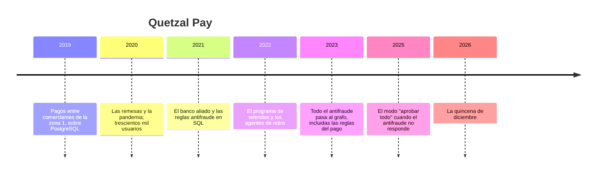

# 💸 Quetzal Pay: la historia

> **Qué es este documento:** la fuente de verdad de todo lo narrativo de Telaraña —la empresa, su gente,
> sus sistemas, sus cifras y sus reglas de negocio—. **Ninguna fase inventa un dato**: si lo necesita y
> no está aquí, se agrega aquí primero.
> **Vigencia:** 2026-10-06 · **primera versión, en discusión con el autor.** Los dolores de §4 van por
> tema; cuando exista la propuesta de fases, cada uno se ata a su fase. Las cifras de §5 son ficticias y
> los volúmenes del laboratorio se fijan en la propuesta de fases. El banco aliado, los agentes, el
> regulador y los casos son inventados: ninguna entidad ni persona real.

---

## 1. 📅 Cómo llegó hasta aquí

Quetzal Pay es una billetera digital de Ciudad de Guatemala: pagos entre personas, cobros de pequeños
comercios, remesas que llegan desde Estados Unidos y una red de tiendas de barrio —los agentes— donde
se deposita y se retira efectivo. Tiene un millón novecientos mil usuarios, un banco aliado que custodia
el dinero, y un sistema antifraude que desde 2023 vive entero en un grafo. Ese grafo detecta cosas que
antes nadie veía. También está en un lugar donde no debería estar.

**2019 · Los comerciantes.** Andrea Cifuentes vendía terminales de cobro y veía a los comerciantes de la
zona 1 pagarse entre ellos con fotos de depósitos bancarios. Con Esteban Monterroso, un desarrollador
con quien había trabajado en un banco, lanzó una app para pagarse con el número de teléfono. Esteban la
construyó en Node con PostgreSQL: cuentas, transferencias, comercios, dispositivos.

**2020 · Las remesas.** En la pandemia, un aliado en Estados Unidos empezó a pagar remesas directo a la
billetera. Los usuarios pasaron de treinta mil a trescientos mil en un año, la mitad de ellos en
municipios donde el banco más cercano estaba a una hora de bus.

**2021 · El banco y las reglas.** Para operar dinero electrónico, Quetzal Pay se alió con un banco que
custodia los fondos y le exige un programa antifraude y de cumplimiento. Lucía Ixcot, que venía del área
de riesgo de ese banco, escribió las primeras reglas en SQL: velocidad de transacciones, montos
inusuales, cuentas nuevas que mueven mucho, varias cuentas en el mismo dispositivo. Corrían dentro del
pago, contra PostgreSQL, en milisegundos.

**2022 · Referidos y agentes.** Pablo Arriaza, de crecimiento, lanzó el programa de referidos: cincuenta
quetzales para quien invita, cuando el invitado hace su primera transacción. Ese mismo año abrieron la
red de agentes, tiendas donde cualquier usuario retira efectivo. El crecimiento se disparó. El fraude de
referidos también, pero en cantidades que Lucía todavía podía revisar a mano.

**2023 · El grafo.** Lucía encontró un anillo de cuarenta cuentas que llevaba cuatro meses moviendo
dinero en círculo para cobrar referidos, y lo encontró dibujándolo en un papel. Esteban volvió de una
conferencia de fintech con la respuesta: el fraude es un grafo. Montó Neo4j, un conector que copia cada
transacción, cuenta, dispositivo y teléfono de PostgreSQL al grafo, y reescribió en Cypher **las cuarenta
reglas**, que desde entonces se evalúan contra el grafo en cada pago, con un presupuesto de 300 ms. Las
búsquedas de anillos, que son pesadas, corren de noche. Su argumento: *"el fraude es una red; quiero las
reglas y los anillos en el mismo lugar, y quiero que Lucía piense en redes, no en tablas"*. Tenía razón en
lo primero y en lo último. Lo que no estaba en la discusión era que treinta y cuatro de las cuarenta
reglas miran un solo salto.

**2025 · El modo "aprobar todo".** Con un millón y medio de usuarios, la latencia del antifraude empezó a
pasar de los 300 ms en las quincenas. Un pago que no se resuelve se reintenta y el usuario se va.
Producto decidió, con aval de Andrea, que si el antifraude no responde a tiempo, el pago se aprueba.
**Fue una decisión razonable** para un comerciante que no puede esperar; casi nadie la recordaba en
diciembre.

**2026 · La quincena de diciembre.** Lo que pasó el 15 de diciembre abre el curso (§4).

| Año | Qué pasó | Quién lo decidió | Lo que dejó |
|---|---|---|---|
| 2019 | La billetera sobre PostgreSQL | Andrea y Esteban | la base de verdad, que sigue sana |
| 2020 | Remesas | Andrea | la mitad de los usuarios |
| 2021 | Reglas antifraude en SQL | Lucía | reglas rápidas que nadie extraña todavía |
| 2022 | Referidos y agentes | Pablo | el crecimiento, y el incentivo del fraude |
| 2023 | Todo el antifraude en el grafo | Esteban, con aval de Andrea | el villano, con su mejor argumento |
| 2025 | "Aprobar todo" si el antifraude no responde | producto, con aval de Andrea | la puerta abierta |
| 2026 | La quincena de diciembre | — | el incidente que abre el curso |

## 2. 👥 La gente

| Personaje | Rol | Cómo habla | Qué quiere | Aparece en |
|---|---|---|---|---|
| **Andrea Cifuentes** | Cofundadora y directora general | Directa, de comerciante: *"va pues, ¿cuánto nos costó?"* | que el banco aliado no les quite la confianza | la apertura, el veredicto |
| **Esteban Monterroso** | Cofundador y director técnico | Seguro y franco: *"el grafo lo puse yo, y para los anillos lo volvería a poner"* | que se mida antes de mover nada | casi todas; es el interlocutor del lector |
| **Lucía Ixcot** | Jefa de antifraude | Paciente, piensa en redes; un *"a la gran"* cuando algo la sorprende | ver el anillo antes de que cobre | anillos, identidades, algoritmos |
| **Pablo Arriaza** | Crecimiento | Optimista, de métricas: el referido es el canal más barato | que el programa de referidos sobreviva | los referidos, el veredicto |
| **Rodolfo Barrios** | Oficial de cumplimiento | Formal, de expediente: todo termina en un reporte | reportar a tiempo y con sustento | caminos, el reporte, la costura |
| **Kevin Ajú** | Ingeniero de plataforma, de guardia | Coloquial: todo está *"chilero"* hasta que no | dormir en las quincenas | la ingesta, la operación, los motores por dentro |
| **Tú** | Ingeniero senior recién contratado | — | — | todas: Esteban te contrató para medir, no para opinar |

El encargo de Esteban, el día que entras: *"No quiero que me digas que el grafo es malo; sin él Lucía
todavía estaría dibujando anillos en papel. Quiero saber qué tiene que vivir en el grafo, qué no, en qué
motor, y qué nos cuesta. Y si las reglas del pago están bien donde están, también quiero saberlo."*

## 3. 🏚️ Lo que hay (el patrimonio)

| Sistema | Stack y edad | Quién lo mantiene | Sus mañas |
|---|---|---|---|
| **El núcleo de pagos** | Node con PostgreSQL, desde 2019 | Esteban | sano; cuentas, transferencias, comercios, agentes, dispositivos, teléfonos, referidos; **es la base de verdad** |
| **El conector** | copia de PostgreSQL al grafo, desde 2023 | Kevin | va con atraso en los picos; reintenta en desorden |
| **El grafo antifraude** | Neo4j en un servidor de 64 GB, desde 2023 | Kevin | las cuarenta reglas del pago y la búsqueda nocturna de anillos, en el mismo servidor |
| **Las reglas del pago** | cuarenta consultas Cypher con presupuesto de 300 ms | Lucía y Esteban | treinta y cuatro miran un solo salto; si no responden a tiempo, el pago se aprueba |
| **La búsqueda de anillos** | un proceso nocturno, de 1:00 a 5:00 | Lucía | caminos de hasta ocho saltos; a veces no termina |
| **El reporte de la mañana** | un correo a las 8:00 con las alertas de la noche | Lucía | lo que la búsqueda encuentra a las 4:00 se lee a las 8:00 |
| **La tablet del agente** | el dispositivo de cada tienda agente | — | cientos de cuentas distintas operan desde el mismo dispositivo, y es legítimo |

**El laboratorio del curso levanta** el núcleo de pagos en PostgreSQL y el antifraude sobre Neo4j (y sobre
Memgraph y Apache AGE para comparar), con un generador que siembra usuarios, transferencias, referidos,
agentes y anillos conocidos. El conector se simula; Neptune se trata solo desde su documentación.

## 4. 🔥 El incidente que lo empezó todo

El 15 de diciembre coinciden la quincena, el aguinaldo y el pico de remesas del año. Esa madrugada la
búsqueda nocturna de anillos arrancó tarde, porque el conector venía con dos horas de atraso, y a las
7:00 todavía corría sobre el mismo servidor que evalúa las reglas del pago.

A las 9:20 la latencia de las reglas pasó de los 300 ms. Durante cinco horas y diez minutos, el 38 % de
los pagos se aprobó sin antifraude. En esas cinco horas, una red de mil ciento cuarenta cuentas cobró el
bono de referidos de cada una —árboles de invitaciones de hasta seis niveles, armados durante seis
semanas— y movió el dinero en círculos de cuatro a siete cuentas antes de retirarlo en efectivo en nueve
agentes del interior. Las mil ciento cuarenta cuentas usaban veintitrés teléfonos y sesenta y un
dispositivos.

La búsqueda nocturna terminó a las 11:40. Había encontrado una parte del anillo a las 4:00; el reporte
salía a las 8:00, y Lucía lo abrió a las 10:00, en medio del incendio. Para cuando se bloquearon las
cuentas, se habían ido dos millones trescientos mil quetzales.

Lucía hizo la cuenta que nadie quería hacer: con las reglas de 2021, la consulta de "varias cuentas nuevas
en el mismo teléfono" —un solo salto, contra PostgreSQL— habría marcado la mitad de esas cuentas semanas
antes, y no dependía de que el grafo respondiera a tiempo. Rodolfo pasó la semana armando el reporte para
el regulador y para el banco aliado, que pidió una reunión. El lunes, Andrea preguntó: *"¿El grafo nos
falló, o lo pusimos donde no iba?"*. Esteban dijo que creía saber la respuesta, y que no quería creer:
quería medirla. Esa semana abrió la vacante que vas a ocupar.

### Los dolores, por tema

Cada uno abre una o más fases cuando la propuesta exista. Ninguno se inventa en la fase: sale de aquí.

1. **Las reglas de un salto en el camino del pago.** Treinta y cuatro reglas que miran un vecino, con 300
   ms de presupuesto: dónde se evalúan y cuánto cuesta cada lugar.
2. **La puerta abierta.** Qué pasa cuando el antifraude no responde, y por qué el lugar de la regla
   decide cuántas veces pasa.
3. **El árbol de referidos.** Invitaciones de seis niveles: contar descendientes, medir profundidad y
   encontrar el árbol que crece demasiado rápido.
4. **El anillo con reloj.** Un ciclo de transferencias solo es un anillo si cada paso ocurre después del
   anterior y el monto baja por las comisiones: caminos con condiciones a lo largo del camino.
5. **La misma mano.** Cuentas sin transferencias entre sí que comparten teléfono, dispositivo o dirección.
6. **La tablet del agente.** El dispositivo que comparten cientos de cuentas legítimas, y la consulta que
   explota al pasar por él.
7. **Seguir el dinero.** El camino más corto, y el más pesado, entre una mula conocida y una cuenta nueva;
   lo que Rodolfo necesita para el reporte.
8. **El anillo entero.** De un puñado de cuentas marcadas a la red completa: componentes y comunidades.
9. **Los cobradores.** Las cuentas por las que pasa el dinero antes de salir en efectivo: centralidad.
10. **La cuenta nueva que se parece a una mula.** Similitud por vecinos, antes de que transfiera nada.
11. **Neo4j por dentro.** Cómo guarda nodos y relaciones, qué hace la caché de páginas, cómo planea una
    consulta y dónde se van los accesos.
12. **El grafo en memoria.** Memgraph: qué cambia guardar todo en memoria, cómo persiste y cuánto ocupa.
13. **El conector que se atrasa.** Escribir aristas a ritmo de quincena, los nodos muy conectados que se
    bloquean, y el atraso del grafo frente a la base de verdad.
14. **Cypher dentro de PostgreSQL.** Quedarse en la base de verdad con Apache AGE, y lo que dicen los
    estándares (SQL/PGQ y GQL) sobre consultar grafos desde SQL.
15. **Cuatrocientos millones de transferencias.** Una arista por transferencia o una por par y por día: el
    modelo decide la memoria y la velocidad.
16. **El grafo que hay que operar.** Copias, versiones, lo que trae la edición comunitaria y lo que no; y lo
    que costaría no operarlo.
17. **El villano en la mesa.** Las reglas de un salto medidas en el grafo y en PostgreSQL, con la quincena
    de diciembre reproducida.
18. **Lo que sí necesita el grafo.** Los anillos, los árboles y las comunidades, medidos contra lo mejor
    que hace SQL.

## 5. 💰 Las cifras

Todas ficticias, coherentes entre sí, y con los volúmenes del laboratorio por fijar en la propuesta de
fases.

| Cifra | Valor | Fuente o supuesto |
|---|---|---|
| Usuarios | ≈ 1,9 M; ≈ 1,4 M activos en el mes | ficticia |
| Pagos | ≈ 1,2 M por día; ×3 en quincena | ficticia |
| Transferencias por año | ≈ 400 M | ficticia |
| Remesas | ≈ 280.000 por mes | ficticia |
| Agentes de retiro | ≈ 3.600 tiendas | ficticia |
| Dispositivos y teléfonos registrados | ≈ 2,6 M dispositivos; ≈ 2,1 M teléfonos | ficticia |
| Cuentas por tablet de agente | de 200 a 4.000 | ficticia |
| Reglas del pago | 40: 34 de un salto, 4 de dos saltos, 2 de profundidad variable | ficticia |
| Presupuesto del antifraude | 300 ms por pago | ficticia |
| El servidor del grafo | 64 GB de memoria | ficticia |
| Búsqueda nocturna de anillos | de 1:00 a 5:00, hasta 8 saltos; el 15 de diciembre terminó a las 11:40 | ficticia |
| El incidente | 5 h 10 min; 38 % de los pagos sin antifraude | ficticia |
| La red | 1.140 cuentas, 23 teléfonos, 61 dispositivos, 9 agentes; árboles de hasta 6 niveles; ciclos de 4 a 7 cuentas | ficticia |
| La pérdida | Q 2.300.000 | ficticia |
| Bono de referidos | Q 50 por invitado que hace su primera transacción | ficticia |

## 6. 📏 Las reglas de negocio

- **La cuenta.** Una por persona, con un teléfono y un nivel de verificación. El nivel básico mueve hasta
  Q 5.000 al mes; el completo, más, con documento verificado.
- **El dispositivo y el teléfono.** Una cuenta puede usar varios dispositivos; un teléfono pertenece a una
  sola cuenta a la vez. **Las tablets de los agentes** son dispositivos compartidos por definición.
- **El referido.** Quien invita cobra Q 50 cuando el invitado hace su primera transacción de al menos
  Q 100. Un invitado tiene un solo referidor.
- **El retiro.** Se retira efectivo en un agente, contra la tablet del agente, con un código en el
  teléfono del usuario.
- **El anillo.** Para antifraude, un anillo es un ciclo de transferencias entre cuentas en el que cada
  transferencia ocurre después de la anterior, en menos de 72 horas en total, y el monto se mantiene o
  baja.
- **El antifraude del pago.** Cada pago pasa por las reglas antes de aprobarse, con un presupuesto de 300
  ms. **Si no responde a tiempo, el pago se aprueba** (desde 2025).
- **El reporte.** Toda operación sospechosa se reporta al regulador con su sustento: las cuentas, las
  transferencias y el camino del dinero.
- **La base de verdad** de cuentas, transferencias, dispositivos, teléfonos, referidos y agentes es
  PostgreSQL. El grafo es derivado y se puede reconstruir.

## 7. 🗣️ Cómo hablan

La narración y las instrucciones al lector van en tuteo neutro. Las voces se reservan para los diálogos,
una expresión por escena:

- **Andrea** (Ciudad de Guatemala): *"va pues"*.
- **Lucía** (Quetzaltenango): *"a la gran"*, cuando algo la sorprende.
- **Kevin** (Ciudad de Guatemala): *"chilero"*, hasta que no.
- **Esteban** habla de **latencia** y **saltos**; **Rodolfo**, de **sustento** y **el reporte**;
  **Pablo**, de **conversión** y **costo por usuario**.

En la casa se dice **el grafo**, **el conector**, **las reglas** (las del pago), **la búsqueda** (la
nocturna de anillos), **las mulas**, **los agentes**, **aprobar todo** y **la quincena de diciembre**.
