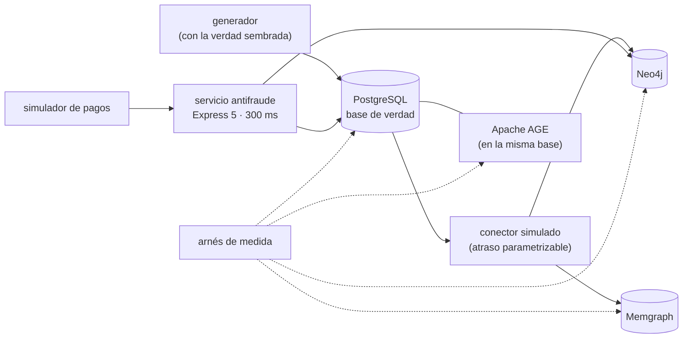

# 🎯 Alcance del proyecto
## Telaraña — el modelo de grafos a fondo

> **Qué es este documento:** la fuente de verdad de **qué** enseña el curso, a quién y con qué
> límites. Lo que no esté aquí no está en el curso.
> **Fecha de esta versión:** 6 de octubre de 2026. Consolida la semilla de agosto
> (`_desechable-semilla.md`), el alcance de agosto (`_desechable-alcance-v1.md`), la ficha de arranque,
> las reglas de la ruta y los precedentes de los cursos anteriores. **Lo único preliminar es §9**: la
> cantidad de fases y su orden salen de la propuesta de fases.
> **Precedencia:** manda este documento. Después viene
> [`guia-de-estilo-y-convenciones.md`](guia-de-estilo-y-convenciones.md), que decide **cómo** se
> escribe; después el contrato de nombres y el diccionario de términos (por escribir), y las propuestas.
> Las plantillas y los prompts se actualizan siempre al final. Por encima de todos está el `CLAUDE.md`
> del repositorio, en lo que este curso no haya declarado como excepción (§12).
> **Estado de las decisiones:** 33 cerradas, ninguna abierta (§12). Solo faltan la propuesta de fases y
> la versión final de la historia.

---

## 1. 🧭 En una frase

**Un curso que enseña el modelo de grafos a fondo reconstruyendo y midiendo el antifraude de una
billetera digital, para que el lector pueda decidir —y defender con números propios— qué pregunta es un
recorrido y cuál es una tabla, dónde se evalúa cada una, en qué motor, qué le cuesta a ese motor, y
cuándo el grafo no hacía falta.**

No forma administradores de Neo4j ni analistas de fraude, ni prepara una certificación. No enseña grafos
desde cero: el lector ya hizo el minicurso de Ruta NoSQL Lite. Forma la capacidad de decir *"las reglas
de un salto van en PostgreSQL, dentro del pago; los anillos, los árboles y las comunidades van en el
grafo, fuera del pago; por esta razón y con este número"*.

---

## 2. 🔥 El problema que resuelve

El lector salió de lite sabiendo modelar nodos y relaciones, escribir Cypher básico, que PostgreSQL
aguanta un árbol y que el argumento real del grafo es la consulta de patrón. Le falta lo que viene
después: escribir los patrones difíciles (ciclos con condiciones a lo largo del camino, caminos
ponderados, árboles que crecen raro), sobrevivir al supernodo, correr los algoritmos de red y saber qué
hacen, entender cómo guarda y planea el motor, mantener el grafo al día con la base de verdad, y elegir
entre un grafo en disco, uno en memoria y Cypher dentro de PostgreSQL. Hoy eso se aprende la quincena en
que la búsqueda nocturna se come el servidor del pago, o en tutoriales que demuestran el grafo con
consultas de un salto.

El villano es uno solo, **el grafo puesto donde bastaba una tabla**, y tiene tres caras:

- **"El fraude es un grafo: todo el antifraude al grafo."** Los anillos sí; las treinta y cuatro reglas de
  un salto no. Se pagan en latencia, en un conector y en un servidor compartido con lo pesado.
- **"Un motor de grafo se opera como cualquier base."** El supernodo, los bloqueos al escribir nodos muy
  conectados, la memoria y lo que la edición comunitaria no trae.
- **"Sin grafo no se puede."** El reverso, que el curso también mide: lo que `WITH RECURSIVE` con `CYCLE`
  y lo que Cypher dentro de PostgreSQL sí resuelven.

> ⚠️ **El antagonista no es ninguna herramienta.** El grafo le dio a Lucía lo que el papel no podía, Neo4j
> gana donde gana y el curso lo publica, PostgreSQL es la base de verdad desde 2019, y el curso cierra
> con el veredicto de cuándo el grafo no hacía falta.

---

## 3. 🎓 Objetivo pedagógico

Al terminar, el lector puede hacer seis cosas que antes no podía:

1. **Separar el recorrido de la tabla** en un sistema real: decidir por saltos, por presupuesto de
   latencia y por consistencia dónde se evalúa cada pregunta.
2. **Escribir los patrones difíciles**: ciclos y caminos con condiciones a lo largo del camino, árboles
   de profundidad variable, caminos más cortos y ponderados; en Cypher y, cuando se puede, en SQL.
3. **Domar el supernodo y la explosión**: acotar, podar, cambiar el modelo, y saber leer en el perfil por
   qué una consulta no termina.
4. **Usar los algoritmos de red con criterio**: componentes, PageRank, comunidades, similitud y
   centralidad; qué calculan, cuánto cuestan y qué falsos positivos dejan.
5. **Leer el motor por dentro**: almacenamiento, caché, planificador y escritura en Neo4j; memoria y
   persistencia en Memgraph; Cypher sobre el planificador de PostgreSQL en AGE.
6. **Elegir dónde vive el grafo** entre Neo4j, Memgraph, AGE, PostgreSQL a secas y un servicio
   gestionado, con una medición propia y el costo de operarlo.

Lo que **no** es objetivo: construir un producto antifraude, modelos de aprendizaje automático, ni
administrar un clúster de grafos en producción corporativa.

---

## 4. 👥 Perfil del lector

Ingeniero senior que **ya hizo Ruta NoSQL Lite**, o que sabe lo equivalente: SQL y modelado relacional de
oficio, `WITH RECURSIVE` sin miedo, TypeScript con soltura, contenedores sin ayuda, y el minicurso de
grafos de lite. Se le explica el modelo en profundidad y los motores por dentro; no se le explica a
programar, Docker, SQL ni lo que lite ya enseñó.

**Lo que se da por sabido y no se explica jamás:** SQL, índices, transacciones, CTE recursivos en su uso
básico; TypeScript y Node; Docker Compose; las cinco preguntas, el arnés y la apuesta antes de medir; de
lite, nodos, relaciones y propiedades, `MATCH`, `WHERE`, `RETURN` y longitudes variables básicas, la
cardinalidad de travesía, el árbol contra el grafo que no lo es, que PostgreSQL aguanta un árbol, que el
argumento del grafo es el patrón, el producto cartesiano, y que operar un motor más cuesta.

**Lo que se explica con cero ambigüedad**, aunque el lector sea senior: qué es la adyacencia sin índice y
qué no garantiza, qué cuenta un acceso en el perfil, qué hace un operador ansioso, cómo se expande un
patrón de camino cuantificado, por qué un supernodo explota una consulta y bloquea una escritura, qué
hace cada algoritmo paso a paso, qué guarda Memgraph en disco, y cómo traduce AGE un patrón a SQL.

> 🧭 **Ninguna caja negra prematura, no menos profundidad.**

**Requisitos de entrada:** un equipo con 16 GB de memoria (D-20), Docker Desktop o Podman, y Node 24.
**No hace falta** ninguna cuenta en la nube ni nada instalado fuera de contenedores. El apéndice de la
JVM pide además un JDK, en contenedor.

---

## 5. 🧭 La pregunta que ordena el curso

> *¿Esta pregunta es un recorrido o una tabla, y qué le cuesta al sistema —y a la empresa— responderla
> donde se responde?*

Se presenta en la primera fase, con la quincena de diciembre, y reaparece en el veredicto de cada fase:

- **La primera parte** responde *qué es un recorrido*: las reglas de un salto, los árboles, los anillos
  con reloj, la misma mano, el supernodo, seguir el dinero.
- **La segunda parte** responde *qué se ve en la red entera*: componentes, comunidades, centralidad,
  similitud.
- **La tercera parte** responde *qué le cuesta al motor*: Neo4j y Memgraph por dentro, el modelo de las
  aristas, el conector, Cypher dentro de PostgreSQL, la operación.
- **El cierre** responde la pregunta entera: la autopsia de las reglas en el grafo y el veredicto.

---

## 6. 📏 Cómo se mide

**Todo "mejor que" lleva un número**, medido con el arnés del curso y consolidado en `BENCHMARKS.md`. Se
mide primero **lo encontrado**: precisión y exhaustividad contra lo que el generador sembró —anillos,
árboles, redes— (D-31). Después **la forma**: accesos del perfil, relaciones expandidas, filas
intermedias, memoria del motor, tamaño en disco, atraso del grafo frente a PostgreSQL. **Los tiempos sí
aparecen**, siempre con su dispersión (mediana, p95 y p99), calentamiento, repeticiones y máquina
declarados, **y siempre con la profundidad `k` y el tamaño del vecindario** al lado, porque en este
modelo el veredicto depende de ellos (D-19).

Las reglas de honestidad no se negocian: se publica lo que salió · el empate se llama empate · nada de
números redondos sin dispersión · cada motor se configura bien y según su documentación (la caché de
páginas de Neo4j, el modo de almacenamiento de Memgraph, la memoria de PostgreSQL, los índices de cada
uno) · **PostgreSQL juega con lo mejor que tiene**: índices, `CYCLE`, `SEARCH`, CTE bien escritos · se
declara lo que no se midió · los costos de la nube llevan ☁️, fuente y fecha · y **nunca se extrapola de
un portátil a producción**: lo que se mide en un portátil con Docker se dice así.

Dos anclas por fase, cuando la fase las admite: 🪞 **una apuesta** escrita antes de ejecutar y 💥 **una
rotura provocada**, con el síntoma literal y lo que costó salir.

---

## 7. 🧪 El sistema del curso

### 7.1 El dominio

El antifraude de **Quetzal Pay**, una billetera digital de Ciudad de Guatemala: cuentas con su nivel de
verificación, transferencias, pagos a comercios, remesas, retiros en agentes, dispositivos, teléfonos,
direcciones y el árbol de referidos; las reglas del pago, la búsqueda de anillos, la resolución de
identidades, los algoritmos de red y el camino del dinero para el reporte. PostgreSQL es la base de
verdad de todo. La historia está en [`../00-historia-de-quetzal-pay.md`](../00-historia-de-quetzal-pay.md).

**Queda fuera a propósito:** dinero y bancos reales, la autenticación de la app, los modelos de
aprendizaje automático de puntaje de riesgo, y el panel de Lucía como producto visual.

### 7.2 El stack, y qué compra cada pieza

| Pieza | Elección | Qué compra | Qué cuesta |
|---|---|---|---|
| Motor principal | Neo4j, edición comunitaria (D-25), con GDS y APOC Core (D-33) | el grafo en disco de referencia, Cypher y los algoritmos | un servicio más, y lo que la edición comunitaria no trae |
| Rival en memoria | Memgraph con MAGE (D-16) | la misma Cypher en memoria, con otro perfil de latencia | memoria del laboratorio: no corre a la vez que Neo4j (D-20) |
| Rival dentro de PostgreSQL | Apache AGE (D-16) | Cypher sin salir de la base de verdad | una extensión más, con su madurez por verificar |
| Base de verdad y control | PostgreSQL con `WITH RECURSIVE`, `CYCLE` y `SEARCH` | las reglas de un salto donde ya vive el dato, y lo mejor de SQL para recorrer | — es lo que ya existe en la empresa |
| Servicio gestionado | Neptune, solo desde documentación ☁️ (D-22) | la respuesta a "¿y si no queremos operar nada?" | cuesta dinero |
| Servicio antifraude | Express 5 mínima (D-32) | las preguntas de extremo a extremo, con el presupuesto de 300 ms | una capa que el arnés evita cuando mide el motor |
| Conector | simulado, con atraso parametrizable (D-30) | la costura entre la base de verdad y el grafo, medible | — |
| Arnés, generador y simuladores | TypeScript nativo en Node 24 (D-17) | la misma carga y la misma verdad sembrada contra cada motor | — |

### 7.3 Cómo se construye el código

A mano, en un solo proyecto en `src/` que crece por fases (D-09). El generador siembra en PostgreSQL
usuarios, transferencias, referidos, agentes y redes conocidas, y el conector simulado las lleva a cada
motor de grafo.

### 7.4 El tamaño mínimo

Todo cabe en **16 GB** con perfiles de Compose: PostgreSQL con AGE, el servicio y el arnés siempre; **un
motor de grafo a la vez**; los volúmenes grandes, dimensionados en la verificación previa (D-20).

---

## 8. 🧰 Herramientas y plataformas

**Versiones:** última estable a la fecha de la verificación previa, por digest para las imágenes y con
archivo de bloqueo para las librerías y los plugins, en el apéndice del laboratorio (D-07). La versión de
Cypher y de GDS se fija junto con la de Neo4j. **Plataformas:** macOS en Apple Silicon, Linux y Windows
con WSL2; el autor verifica en macOS arm64 y lo demás se marca no verificado (D-06).

---

## 9. 🪜 La forma del curso

**Tipo:** curso completo. **Unas 100 horas en 10 a 12 fases** de unas 10 h. **Preliminar:** el arco, los
nombres y las fichas salen de la propuesta de fases. El borrador de partida son las doce fases de la
semilla, menos lo que lite ya dio (el modelado de tablas a nodos, lo que viaja igual, el primer recorrido
y la curva básica de profundidad contra `WITH RECURSIVE`), más lo que pide la profundidad: el anillo con
reloj, el supernodo, los motores por dentro, AGE, el modelo de las aristas, el conector y los estándares.

| Bloque (tentativo) | Qué hace | Temas de la historia (§4 de ella) |
|---|---|---|
| **I · Recorrido o tabla** | las reglas del pago y su lugar, el árbol de referidos | 1, 2, 3 |
| **II · Los patrones** | el anillo con reloj, la misma mano, la tablet del agente, seguir el dinero | 4, 5, 6, 7 |
| **III · La red entera** | componentes, comunidades, centralidad, similitud | 8, 9, 10 |
| **IV · Los motores por dentro** | Neo4j, Memgraph, el modelo de las aristas, el conector, AGE y los estándares | 11, 12, 15, 13, 14 |
| **V · Operación y veredicto** | operar el grafo y Neptune, la autopsia, lo que sí necesita el grafo | 16, 17, 18 |

---

## 10. ✅ Lo que está dentro del alcance

- Las reglas de un salto medidas en el grafo y en PostgreSQL, dentro del presupuesto de 300 ms, y el lugar
  del recorrido profundo fuera del pago.
- Árboles de profundidad variable: descendientes, profundidad, crecimiento anómalo.
- Patrones de camino cuantificados y condiciones a lo largo del camino (tiempo creciente, monto
  decreciente); el mismo anillo con `WITH RECURSIVE`, `CYCLE` y `SEARCH`.
- Resolución de identidades por atributos compartidos.
- El supernodo: detección, poda, cambio de modelo, y su efecto en la lectura y en la escritura.
- Caminos más cortos, ponderados y los k más cortos.
- Algoritmos: componentes conexos, PageRank, Louvain, similitud de nodos y centralidad, con GDS y con MAGE;
  proyecciones, costo y falsos positivos; su versión en SQL cuando existe.
- Neo4j por dentro: almacenamiento, adyacencia sin índice, caché de páginas, planificador, perfil y
  accesos, operadores ansiosos, índices.
- Memgraph por dentro: memoria, modos de almacenamiento, instantáneas y registro de escritura.
- El modelo de las aristas: una por transferencia o agregadas por par y periodo, medidas.
- El conector: atraso, orden, idempotencia, escritura de nodos muy conectados.
- Apache AGE: Cypher traducido a SQL, sus límites, medido.
- SQL/PGQ y GQL: qué son, qué cambian, y una medición donde exista implementación libre (D-26).
- Operación: copias, actualización, lo que trae y no trae la edición comunitaria; Neptune desde su
  documentación.
- La autopsia de las reglas en el grafo y el árbol de cuándo no usar grafos.
- El apéndice 🔥 de la JVM en Kotlin.

## 11. 🚫 Lo que está fuera del alcance

Se declara y el texto se detiene: **no se dice dónde estaría ese material.**

- Lo que Ruta NoSQL Lite ya enseñó de grafos: se usa, no se explica.
- Embeddings de nodos y aprendizaje automático sobre grafos.
- Grafos RDF, SPARQL y Gremlin.
- Clústeres de Neo4j y de Memgraph, y la edición empresarial más allá de nombrar lo que trae.
- Streaming con Kafka y conectores comerciales: el conector se simula.
- Otros motores de grafo (TigerGraph, ArangoDB, JanusGraph, Kùzu, FalkorDB).
- Neptune medido de verdad (D-22).
- Visualización de grafos como producto.

---

## 12. ⚖️ Decisiones

Si una sesión futura quiere cambiar una, primero la cambia aquí y después en todo lo demás, nunca al
revés. ✅ cerrada · ⏳ abierta · 🔄 reabierta. Las que llevan *(ruta)* o el nombre de un curso siguen la
regla de la ruta o el precedente de ese curso; las que llevan *(por defecto)* las cerró la sesión con el
valor propuesto y se le listaron al autor.

| ID | Decisión | Valor | Estado |
|---|---|---|---|
| D-01 | Idioma | Español latinoamericano neutro con tuteo; código, comandos, identificadores y salida de terminal en inglés; comentarios de código en español | ✅ |
| D-02 | Tipo de curso | Curso completo | ✅ |
| D-03 | Autocontención | Lo publicado nombra Ruta NoSQL Lite **solo como requisito de entrada**: no usa su contenido, no remite a sus fases ni reutiliza sus ejemplos, datos o mediciones. `prompts/` puede citarla *(ruta, R-07)* | ✅ |
| D-04 | Promesa de esfuerzo | ~100 h en 10–12 fases de ~10 h *(Proteo)* | ✅ |
| D-05 | Aparato de evaluación | 20–30 ejercicios por fase, 🟢🟡🟠🔴 + 🔥, un tercio de diagnóstico o medición, cada uno con su criterio; **sin solución publicada**. Taller global: el antifraude en `src/`. Un 💀 boss por bloque cuando el bloque lo admita, y el proyecto final de §13 *(Proteo)* | ✅ |
| D-06 | Plataformas | macOS arm64, Linux, Windows con WSL2; el autor verifica en macOS arm64 | ✅ |
| D-07 | Política de versiones | Última estable a la fecha de la verificación previa; imágenes por digest, librerías y plugins con archivo de bloqueo, en el apéndice del laboratorio | ✅ |
| D-08 | Ejecución | Nada se publica sin haberse ejecutado | ✅ |
| D-09 | Código | Un solo proyecto en `src/` que crece por fases, con tags `fase-NN-<slug>`; el apéndice de la JVM en `src/jvm/`, fuera del proyecto principal *(Proteo)* | ✅ |
| D-10 | README y temario | Se escriben al final, en una tanda propia | ✅ |
| D-11 | Historia | Quetzal Pay, en `00-historia-de-quetzal-pay.md` | ✅ |
| D-12 | Diagramas | Mermaid | ✅ |
| D-13 | Publicación | Repositorio público propio del curso, sin `prompts/` | ✅ |
| D-14 | Prerrequisito | Ruta NoSQL Lite, o lo equivalente de §4 | ✅ |
| D-15 | Profundidad | Full geek: almacenamiento y adyacencia sin índice, caché de páginas, planificador y accesos, operadores ansiosos, patrones cuantificados, supernodos, bloqueos de escritura, Memgraph en memoria, algoritmos por dentro, AGE sobre el planificador de PostgreSQL, `CYCLE` y `SEARCH` *(por defecto)* | ✅ |
| D-16 | Rivales | Neo4j como principal; Memgraph con MAGE como grafo en memoria; Apache AGE como Cypher dentro de PostgreSQL; PostgreSQL con `WITH RECURSIVE` como base de verdad y control | ✅ |
| D-17 | Lenguaje | TypeScript nativo en Node 24 para todo el núcleo; Kotlin solo en el apéndice de la JVM *(semilla y ruta)* | ✅ |
| D-18 | Clientes | `neo4j-driver` por Bolt contra Neo4j y Memgraph; `pg` contra PostgreSQL y AGE. Las diferencias de Cypher entre motores se verifican antes de comparar *(semilla)* | ✅ |
| D-19 | Mediciones | Lo encontrado primero (precisión y exhaustividad contra lo sembrado), después forma, después tiempos con mediana, p95 y p99; siempre con `k` y el tamaño del vecindario. Documento vivo: `BENCHMARKS.md` *(Proteo)* | ✅ |
| D-20 | Memoria del laboratorio | Todo dentro de 16 GB con perfiles de Compose: un motor de grafo a la vez; los volúmenes, dimensionados en la verificación previa *(Portalón)* | ✅ |
| D-21 | Datos | Sintéticos con semilla fija y la forma de Quetzal Pay: usuarios, transferencias con hora y monto, referidos, agentes con sus tablets, dispositivos, teléfonos; redes sembradas de tamaño, forma y profundidad conocidos, y ruido legítimo que se les parece | ✅ |
| D-22 | Neptune | Solo desde su documentación y sus precios públicos, citados con fecha y marcados ☁️; nunca en la misma tabla que lo medido sin esa marca *(Proteo, con DocumentDB)* | ✅ |
| D-23 | El villano | Implementado de verdad, lo justo para medirlo: las cuarenta reglas en Cypher dentro del pago, con la búsqueda nocturna en el mismo servidor y "aprobar todo" al vencer los 300 ms; frente a las reglas en PostgreSQL y el grafo fuera del pago. La quincena de diciembre, reproducida con el simulador | ✅ |
| D-24 | Algoritmos | El catálogo de fraude: componentes conexos, PageRank, Louvain, similitud de nodos y centralidad, en GDS y en MAGE; su versión en SQL cuando existe; los límites de la edición comunitaria de GDS, declarados | ✅ |
| D-25 | Edición de Neo4j | Comunitaria; la empresarial solo se nombra en la fase de operación, con su licencia citada con fecha *(por defecto)* | ✅ |
| D-26 | SQL/PGQ y GQL | Se explican en la fase de AGE; se miden solo si la verificación previa encuentra una implementación libre que corra en contenedor; si no, quedan nombrados y se dice | ✅ |
| D-27 | El modelo de las aristas | Una arista por transferencia y aristas agregadas por par y periodo se miden en la fase que las compara; el resto del curso usa la que gane, y lo dice *(por defecto)* | ✅ |
| D-28 | Apéndice de la JVM | Dentro, como apéndice 🔥: Kotlin con el driver oficial y GDS desde su ecosistema; fuera del núcleo, del arnés y de `BENCHMARKS.md` | ✅ |
| D-29 | Imágenes en arm64 | Si una imagen no corre nativa en arm64, se declara y se mide emulada con esa advertencia, o se marca no verificado *(Portalón)* | ✅ |
| D-30 | El conector | Simulado en TypeScript, con atraso, desorden y reintentos parametrizables; ningún CDC ni Kafka real *(por defecto)* | ✅ |
| D-31 | La verdad sembrada | El generador conoce cada red sembrada; toda detección se publica con precisión y exhaustividad contra ella, además del tiempo *(Oráculo de Bolsillo, D-31)* | ✅ |
| D-32 | API del antifraude | Express 5 mínima; el arnés mide los motores directamente salvo en las preguntas de extremo a extremo *(Proteo)* | ✅ |
| D-33 | Plugins | Solo GDS y APOC Core en Neo4j, y MAGE en Memgraph, instalados en la imagen del laboratorio; ningún otro plugin *(por defecto)* | ✅ |

**Excepciones declaradas al `CLAUDE.md` del repositorio**, con su porqué (el detalle en la guía §13):

- **Ruta NoSQL Lite como prerrequisito** (D-14) → no se explican los fundamentos de grafos → los da lite.
- **Los ejercicios no traen solución publicada** (D-05) → el lector apuesta y mide antes de mirar.

---

## 13. 🏁 El proyecto final

Andrea tiene que presentarle al banco aliado, antes de la próxima quincena de diciembre, cómo queda el
antifraude: qué reglas se evalúan dentro del pago y dónde, qué corre fuera del pago y cada cuánto, en qué
motor vive el grafo, qué pasa cuando algo no responde, y qué habría detectado la nueva arquitectura de la
red del 15 de diciembre y cuándo. Se entrega como un informe con las mediciones del curso, la autopsia de
las reglas en el grafo con números antes y después, la quincena reproducida en las dos arquitecturas, y
el árbol de decisión de cuándo **no** usar grafos aplicado a cada pieza del antifraude.

---

## 14. 🎯 Criterios de éxito

El curso está bien si:

- Cada fase abre con un dolor de Quetzal Pay y cierra con algo que se apostó, se midió y, cuando tocaba, se
  rompió a propósito.
- Ninguna fase repite lo que lite ya enseñó de grafos.
- PostgreSQL gana las reglas de un salto con el número delante, y al menos un patrón que se creía
  imposible en SQL se escribe y se mide en SQL; el grafo gana al menos uno que SQL no puede escribir bien.
- Toda detección se publica contra la verdad sembrada, no solo con su tiempo.
- Un lector que solo hace los bloques I y II sale separando recorridos de tablas y escribiendo los
  patrones difíciles; uno que sigue hasta el IV sabe leer el motor por dentro y elegir dónde vive el
  grafo.
- El veredicto final no es "grafo para todo" ni "grafo para nada".

---

## 15. 📌 Extensión futura, fuera de este curso

El diseño deja preparado, sin prometerlo, el puntaje de riesgo con aprendizaje automático sobre el grafo,
y el antifraude compartido entre varias billeteras con un grafo de dispositivos común.
