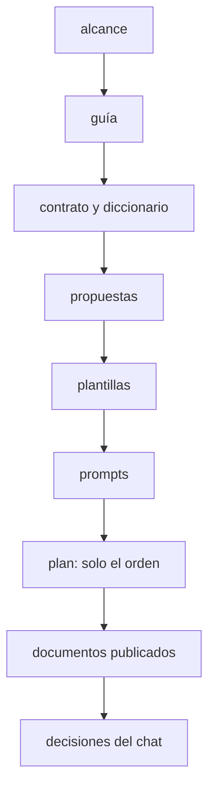

# 🧰 `prompts/` — la maquinaria del curso
## Ruta SQL

Este directorio no es material del curso: es **lo que se usa para escribirlo**. El lector nunca lo
abre, y no viaja al repositorio público del curso. Quien escribe una fase lo lee antes de teclear la
primera línea.

> **Estado:** en preparación. P1–P7 y P10 cerradas (decisiones D1–D16 del 30/09/2026, D-01–D-13 del
> 06/10/2026); faltan P8 (verificación de laboratorio), P9 (fuentes) y P11 (traslado). T0 puede
> empezar; T1 espera a P8 y P11, y T2 a P9. El detalle, en el plan de producción.

---

## 📖 Qué hay aquí, y cuándo se lee

| Documento | Qué es | Cuándo se lee |
|---|---|---|
| [`alcance-del-proyecto.md`](alcance-del-proyecto.md) | qué enseña el curso, a quién y con qué límites; decisiones en §12 y D-01–D-13 en §12.1 | antes de escribir cualquier cosa |
| [`guia-de-estilo-y-convenciones.md`](guia-de-estilo-y-convenciones.md) | cómo se escribe; checklist en §16, excepciones en §17, lineamientos en §19 | en cada sesión, siempre |
| [`diccionario-de-terminos.md`](diccionario-de-terminos.md) | qué palabra para cada concepto; el español de Alameda; el código del dominio | cada vez que dudes de un término |
| [`contrato-de-nombres.md`](contrato-de-nombres.md) | perfiles, entidades, esquemas, estructura y tags; con ⏳ lo que fija T1 | antes de cada fase, y cada vez que haga falta un nombre |
| [`propuesta-fases-y-alcance.md`](propuesta-fases-y-alcance.md) | la ficha de cada fase; el resumen en §11 y el registro de decisiones en §12 | en cada sesión de fase |
| [`propuesta-apendices-y-alcance.md`](propuesta-apendices-y-alcance.md) | la ficha de cada apéndice | en cada sesión de apéndice |
| [`plantillas-de-capitulo.md`](plantillas-de-capitulo.md) | los esqueletos de fase de tema, Bloque 0, árbitro, track, apéndice y solucionario | al empezar y al cerrar cada documento |
| [`prompts-de-fase.md`](prompts-de-fase.md), [`prompts-de-apendice.md`](prompts-de-apendice.md) y [`prompts-sqlserver-fase.md`](prompts-sqlserver-fase.md) | el marco común y un bloque por documento; el del track, aparte | al abrir cada sesión |
| `_desechable-plan-de-produccion.md` | tandas, estado, deuda de enlaces, bitácora, checklist y `zz-code/` | al empezar y al cerrar cada sesión |
| `_desechable-propuesta-ruta.md` | la propuesta de diseño original | como registro; no se cita |
| `verificar-corpus.py` y `verificador_base.py` | las validaciones base y las propias del curso | al cerrar cada tanda |

**Orden de autoridad**, cuando dos se contradicen: (1) el alcance, (2) la guía, (3) el contrato y el
diccionario, (4) las propuestas, (5) las plantillas, (6) los prompts, (7) el plan, solo sobre el
orden, (8) los documentos ya publicados, (9) las decisiones del chat actual. Por encima de todos, el
`CLAUDE.md` del repositorio en lo que el curso no declaró como excepción (guía §17).

> 🧭 **Si una contradicción aparece al escribir, se arregla en el documento de arriba primero.**
> Parchear la fase y dejar la propuesta desactualizada es como empiezan las divergencias que nadie
> detecta hasta la fase doce.

---

## 🚀 Cómo abrir una sesión de escritura

1. Lee el plan de producción: §3 (estado), §6 (deuda), §7 (la última entrada de la bitácora, con sus
   trampas) y §8 (checklist).
2. Pega el marco común y el bloque del documento de `prompts-de-fase.md` o `prompts-de-apendice.md`.
3. Sigue el protocolo de tres pasos: preguntas → redacción (el documento y su solucionario) →
   autoverificación contra la guía §16.
4. Las pruebas van a un directorio nuevo de `zz-code/` (`python3 zz-code/nuevo.py ruta-sql`), con
   contenedores etiquetados `curso=ruta-sql` y puertos aleatorios.
5. Al cerrar: las verificaciones del plan §4 (con `python3 prompts/verificar-corpus.py` en cero), los
   documentos vivos y el plan al día. **Ningún README ni `0-ESTRUCTURA-CURSO.md` antes de T15.**

---

## 🪦 Lo que cambió al preparar

- **06/10/2026 — Revisión contra los lineamientos de producción.** Se agregaron el diccionario, el
  contrato de nombres, este README, el verificador, la guía §19 y las excepciones 8 y 9, y D-01–D-13
  en el alcance §12.1 (D-03 editorial sin enlaces y D-12 Mermaid, decididas por Oskar). La prueba de
  concepto del Access pasó de `taller/accdb-museo/` a `zz-code/`. La historia de Alameda dejó de ser
  un borrador: sin citas a `prompts/` ni a otros cursos, y con su §9 reescrita con lo que el alcance
  ya decidió. La guía §9 corrigió la banda del track (8 h, no 10).
- **06/10/2026 — Solucionario (D18).** Oskar decidió que todo ejercicio lleva solución en archivo
  separado, `soluciones/<documento>.md`, escrito en la misma sesión (guía §10.3). Se retiró la
  excepción 9 de la guía, que lo había dejado por defecto sin solución.
- **30/09/2026 — Los README y la estructura, al final.** Ninguna tanda los toca antes de T15.

---

## ⚠️ Las tres cosas que más se rompen al escribir

Heredadas de la NoSQL Lite, que ya las sufrió:

- **Citar `prompts/` desde lo publicado**: "alcance §6", "la guía §9". El lector no tiene esa
  carpeta; la regla se dice en el texto o se remite al apéndice que la publica.
- **Publicar un número de Oracle o de SQL Server**: va como 🪞🔒, sin resolver, y se relee cada
  mención al cerrar la fase.
- **Enlazar una fase que todavía no existe**: la mención va en prosa y a la deuda del plan §6.
