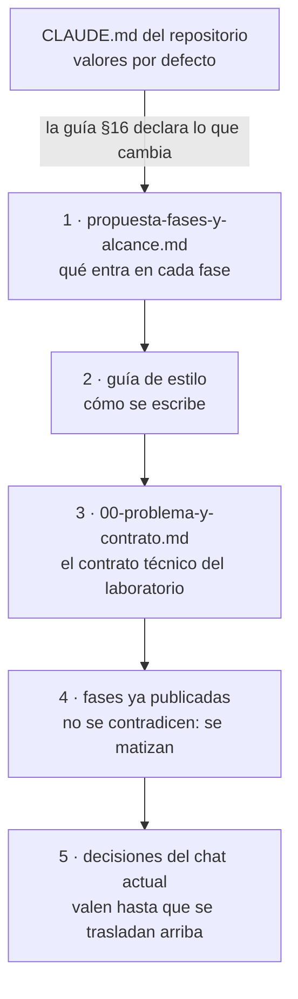

# 🧰 `prompts/` — la maquinaria del curso
## Docker Legacy Node

Este directorio no es material del curso: es **lo que se usó para escribirlo** y lo que hace falta
para tocarlo sin romperlo. El lector nunca lo abre, y no viaja cuando el curso se publica en su
propio repositorio. Quien vaya a editar una fase lo lee entero antes de teclear la primera línea.

> **Estado:** cerrado: 36 fases, 16 apéndices y 941 ejercicios (cifras del README). Revisado el
> 05/10/2026 contra los lineamientos de producción del repositorio: diagramas a Mermaid,
> excepciones declaradas en la guía §16 y verificador de los lineamientos agregado.

---

## 📖 Qué hay aquí, y cuándo se lee

| Documento | Qué es | Cuándo se lee |
|---|---|---|
| [`propuesta-fases-y-alcance.md`](propuesta-fases-y-alcance.md) | el alcance y la propuesta a la vez: qué entra en cada fase y qué no, de dónde salió cada parte | antes de tocar el contenido de una fase |
| [`guia-de-estilo-y-convenciones.md`](guia-de-estilo-y-convenciones.md) | cómo se escribe; checklist en §14 y excepciones a los lineamientos en §16 | en cada sesión, siempre |
| [`verificar-corpus.py`](verificar-corpus.py) y [`verificador_base.py`](verificador_base.py) | las validaciones base de los lineamientos y el aviso de diagramas | al cerrar cualquier edición |
| [`check-course.sh`](check-course.sh) | las trece comprobaciones de integridad propias del curso | al cerrar cualquier edición |
| [`explicacion_script_integridad.md`](explicacion_script_integridad.md) | por qué existe cada comprobación de `check-course.sh` | cuando una falla y no sabes por qué |

Lo que en otros cursos son documentos aparte —diccionario de términos, contrato de nombres,
plantillas de capítulo, plan de producción— aquí son secciones de la guía o no existen porque el
curso ya está cerrado. La guía §16.2 dice qué hace el papel de cada uno.

**Orden de autoridad**, cuando dos se contradicen (guía §12):



> 🧭 **Si una contradicción aparece al editar, se arregla primero en el documento de arriba.**
> Parchear la fase y dejar la guía desactualizada es como empiezan las divergencias que nadie ve
> hasta que un lector las encuentra.

---

## 🚀 Cómo abrir una sesión de edición

El curso está cerrado y bajo bloqueo de contenido: no se renombran fases ni se reestructuran
capítulos. Lo que sí se hace es corregir, matizar y agregar sin renumerar.

1. Lee la guía entera, con especial atención a §5 (nombres y versiones fijadas), §9 (ejercicios)
   y §16 (lo que este curso hace distinto del repositorio).
2. Si la edición toca qué entra en una fase, lee su ficha en la propuesta.
3. Edita. Si algo se ejecuta, se ejecuta de verdad y se pega la salida literal (guía §6); si no se
   puede ejecutar, se dice.
4. Al cerrar, desde la raíz del curso:

   ```bash
   python3 prompts/verificar-corpus.py
   python3 prompts/verificar-corpus.py --publicacion
   bash prompts/check-course.sh
   ```

   - El primero tiene que salir en **0 errores y 0 avisos**; un aviso `DIAGRAMA` significa que un
     bloque `text` dibuja algo que va en Mermaid (guía §16.1).
   - El segundo agrega lo que exige el repositorio público: nada que enlace `prompts/` ni que cite
     material privado.
   - El tercero tiene que pasar sus trece comprobaciones.

---

## 🪦 Lo que cambió al revisar

- **05/10/2026.** 58 diagramas ASCII pasaron a Mermaid en 36 documentos, dibujados uno por uno con
  `mmdc` antes de publicarlos; el de F16 corrigió de paso una flecha (`start` desde `Exited` va a
  `Running`). Se borraron dos desechables: `idea_tutorial.md`, la idea original del chat, truncada
  y ya absorbida en la guía; y `ajuste_estructura.md`, el plan del corte a 36 fases, ya ejecutado.
  Se corrigieron 16 anclas rotas en los apéndices, el README dejó de enlazar `prompts/` y el
  `.gitignore` del curso pasó a sostenerse solo.

---

## ⚠️ Las tres cosas que más se rompen al editar

- **Contradecir el baseline.** Una versión, un tag o una ruta que no coincide con la guía §5.1 y
  §5.2 rompe la cadena incremental de la imagen, y el lector lo descubre tres fases después.
- **Desincronizar la prosa y `src/`.** Todo bloque que el lector ejecuta tal cual existe como
  archivo en `src/NN-tema/`, y los dos cambian juntos (guía §5.1, regla de sincronía).
- **Publicar una salida que no se ejecutó.** El curso declara en cada cabecera qué está verificado
  y qué no; una salida reconstruida de memoria rompe esa promesa.
