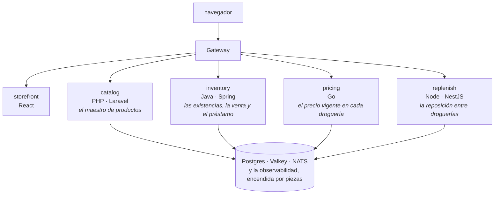

# 🛠️ Fase 00 — El ambiente: dos motores y tres plataformas, listos para La Rebotica

> **Curso:** Laboratorio de contenedores y Kubernetes local · Fase 00 de 27 · Parte 0 — Prolegómenos · **media**
> **Plataformas:** Windows 11 con WSL 2 · macOS Apple Silicon · Linux amd64
> **Motor de referencia:** Docker · 🦭 Podman, instalado y conviviendo, con su propia máquina virtual
> **Servicios que toca:** ninguno; presenta el patrimonio · **Paso de generación:** —
> **Depende de:** nada · **Habilita:** Fase 01
> **Incidentes que reserva:** 01–04 y 27
> **Apéndices de apoyo:** [a01](a01-el-laboratorio.md), [a02](a02-problemas-del-ambiente.md), [a16](a16-el-patrimonio.md)
> **Fecha de verificación ejecutada:** 03/10/2026 · macOS arm64 · Windows 11 y Linux: no verificados por el autor
> **Objetivo:** dejar Docker y Podman instalados y conviviendo, con las herramientas del laboratorio, y que `task engine:status` responda ✅ con cualquiera de los dos como motor activo.

> ⚠️ **Esta es la fase que más rápido envejece.** Los instaladores cambian de pantalla, de nombre y
> de opciones. Todo lo que dice aquí se ejecutó en la fecha de arriba; si al hacer el curso algo
> no coincide, gana lo que ves, y vale la pena anotarlo.

---

## 🧭 1. Dónde estamos

Este curso responde una pregunta, y la responde en tu portátil: **¿qué te da el contenedor, qué te
da el orquestador, y qué te sigue tocando escribir a ti?** Lo hace construyendo un sistema de cinco
servicios desde cero, con dos motores de contenedores y un Kubernetes local, midiendo lo que cuesta
cada decisión y rompiendo a propósito lo que en producción se rompe solo. Al final, la pregunta se
contesta con números, y una de las respuestas posibles es que no necesitabas nada de esto.

Le habla a quien ya programa y ya ha usado contenedores sin pensarlo mucho: un `docker run` copiado
de un README, un `compose.yaml` que funciona y nadie quiere tocar. No hace falta saber Kubernetes.
Sí hace falta paciencia con la primera fase, que es esta: instalar dos motores en una máquina que no
siempre es tuya.

### La empresa, en una página

El sistema es de **Droguerías La Vecina**, una cooperativa de droguistas de Santander que nació en
1998 para comprar mejor y descubrió, sin buscarlo, su negocio: **prestarse medicamentos entre
droguerías**. La primera vez fue un martes de 1999, a las diez y media de la noche: un niño con una
crisis de asma, un inhalador que estaba en Girón y no en Floridablanca, y un sobrino de diecinueve
años con el carro de su tío. Doña Graciela lo anotó en un cuaderno verde, con la regla que la
cooperativa repite hasta hoy: *"Lo que se presta se devuelve"*. El lema salió de ahí: **"Droguerías
La Vecina. Siempre llega."**

Veintiséis años después son 263 droguerías en Santander, Boyacá, Cundinamarca y Bogotá, y el
cuaderno es **el Siga**: un monolito Java sobre WebLogic y Oracle, multiplicado en dos
datacenters y partido por región. El **14 de octubre de 2025**, una tarde de lluvia con el triple
de domicilios, el nodo central se saturó y **las cajas de las 263 droguerías se congelaron al mismo
tiempo**, tres horas y cuarenta minutos. El sistema de respaldo no se prendió, porque su regla era
encenderse cuando el Siga no contestara, y el Siga contestaba, solo que tarde. En Girón, Yolanda
sacó el cuaderno verde del cajón y anotó ciento doce ventas a mano. El jueves siguiente, Germán, el
vicepresidente de sistemas, hizo la pregunta que da origen a este curso:

> *"¿Por qué un pico de domicilios en Bogotá le congela la caja a Yolanda en Girón, si para eso
> partimos el Siga en dos?"*

De ahí salieron **Alquimia**, una unidad de investigación de tres personas con Valentina Mantilla a
la cabeza; su primer proyecto, **Paracelso**, que saca del Siga pieza por pieza lo que ya no cabe en
él; y **La Rebotica**, el laboratorio en portátiles donde Paracelso se construye antes de gastar un
peso en servidores. El nombre se lo puso Doña Graciela: *"Allá atrás se prueba, y al mostrador sale
solo lo que funciona."*

**Este curso es Paracelso construido en La Rebotica, y tú trabajas en el equipo de Valentina.** Toda
la historia, con sus personajes y sus cifras, está en
[Droguerías La Vecina](00-historia-de-la-vecina.md); las fases la citan, no la repiten.

### El sistema que vas a construir



Cuatro servicios en cuatro lenguajes, uno por cada equipo de la cooperativa, y un frontend. No
porque cuatro lenguajes sean una buena idea en general, sino porque **cada equipo eligió lo que
sabía operar**, y eso es lo que pasa en una empresa con estructura. El código de los servicios no lo
escribes a mano: se genera con prompts publicados y se valida con una suite de contratos
([a03](a03-contratos-y-prompts-de-generacion.md)). Lo que escribes a mano es todo lo que lo rodea.

### El patrimonio

La Rebotica no arranca de cero. **Arranca de lo que La Vecina ya tiene**, en la versión que cabe en
un portátil, y de ahí se extraen los servicios nuevos:

- **Contingencia**, el Siga reducido que en 2016 se instaló en sesenta sitios para seguir vendiendo
  si el central se caía. Java sobre GlassFish y PostgreSQL, con servicios SOAP. De aquí salen
  `pricing` e `inventory`.
- **El portal**, la tienda en línea que unos aprendices del SENA y una pasante hicieron en un
  trimestre de 2019, en Laravel, y que la pandemia volvió el canal principal de Bogotá. De aquí sale
  `catalog`.
- **La Braqui**, el sistema de despacho de motos que la cooperativa compró en 2020, en Node, que hoy
  lee y escribe las tablas del Siga y recibe los traslados por un archivo de texto cada cinco
  minutos. De aquí sale `replenish`.

En esta fase solo se presenta. La [Fase 01](01-primer-contenedor-y-dockerfile.md) empaqueta la Braqui en su primer contenedor, y la [Fase 02](02-compose-el-sistema-en-un-archivo.md)
lo levanta todo junto. Cómo está hecho cada pedazo, y qué mañas trae a propósito, está en
[a16](a16-el-patrimonio.md).

### Por qué dos motores

Porque así lo decidió compras, no arquitectura. Docker Desktop exige suscripción paga en empresas
de 250 empleados o más, y La Vecina tiene cuatro mil. Compras no aprobó otra suscripción por puesto
para un POC, así que Valentina armó La Rebotica para que funcione igual con **Docker y con Podman**
(historia §5.4). El curso hace lo mismo: **Docker es el camino principal de los comandos, y Podman
aparece con 🦭 donde diverge.** Si en tu empresa solo puedes usar uno, el curso funciona con
cualquiera de los dos.

---

## 🎯 2. Objetivos de esta fase

1. Docker y Podman instalados en tu plataforma, cada uno con su máquina virtual de **4 GiB**
   (en Linux, Podman no la necesita).
2. Las herramientas del laboratorio instaladas y en la versión de [a01](a01-el-laboratorio.md):
   kind, `kubectl`, Helm con helm-diff, Task, k9s, Hurl, k6, hyperfine, dive y Python.
3. `task engine:status` responde ✅ para los dos motores, y sabes alternar el motor activo con
   `task engine:use`.
4. Sabes reconocer los cinco fallos de instalación que más gente tumban, por su síntoma, y dónde
   está su solución.

---

## 🚫 3. Qué NO entra todavía

- Usar los motores: correr, construir, inspeccionar → [Fase 01](01-primer-contenedor-y-dockerfile.md).
- Levantar el patrimonio y los servicios → [Fase 02](02-compose-el-sistema-en-un-archivo.md).
- Las diferencias de fondo entre Docker y Podman → [Fase 05](05-los-dos-motores.md).
- Crear un cluster de Kubernetes → [Fase 07](07-el-cluster-local.md). Si quieres comprobar que kind funciona, `task
  cluster:up -- minimo` y `task cluster:down -- minimo` no rompen nada; pero el cluster se explica
  allá.
- La cola larga de la instalación, plataforma por plataforma → [a02](a02-problemas-del-ambiente.md).

---

## 🛠️ 4. Los dos motores en tres plataformas

### 4.1 Antes de instalar

Tres cosas, en las tres plataformas:

- **Virtualización encendida.** En Windows y en macOS, los dos motores corren sus contenedores dentro
  de una máquina virtual Linux, y sin virtualización no hay máquina. En macOS con Apple Silicon
  siempre está; en Windows se comprueba en el Administrador de tareas (Rendimiento → CPU →
  *Virtualización*). Si dice *Deshabilitado*, es el [incidente 02](cuaderno-incidentes.md#-incidente-02--la-máquina-dice-que-no-puede-virtualizar).
- **Memoria.** Cada máquina virtual necesita **4 GiB**: es lo que pide el laboratorio con toda la
  observabilidad encendida, medido en [a01](a01-el-laboratorio.md#-la-memoria-que-ocupa-cada-perfil).
  La de Podman viene con 2 por defecto, y con 2 el cluster deja de contestar.
- **Disco.** Las imágenes de los runtimes pesan: cuenta con varias decenas de gigabytes libres. La
  [Fase 01](01-primer-contenedor-y-dockerfile.md) enseña a recuperarlos.

**Siempre en el mismo orden: Windows, macOS, Linux.** Solo macOS lo ejecutó el autor; las otras dos
salen de la documentación oficial, enlazada en cada paso.

### 4.2 Windows 11 con WSL 2

> ⚠️ **No verificado por el autor; se confirma al hacer el curso.** Los comandos son los de la
> documentación de Microsoft, Docker y Podman, en una PowerShell **de administrador**.

**WSL 2 primero.** Los dos motores usan su máquina virtual. Antes de instalar, comprueba que las dos
características de Windows de las que depende estén activas de verdad:

```powershell
Get-WindowsOptionalFeature -Online -FeatureName VirtualMachinePlatform | Select-Object FeatureName, State
Get-WindowsOptionalFeature -Online -FeatureName Microsoft-Windows-Subsystem-Linux | Select-Object FeatureName, State
```

Las dos tienen que decir `Enabled`. Si no, `wsl --install` las activa (y pide reiniciar); si algo
falla, el código del error te lleva al [incidente 01](cuaderno-incidentes.md#-incidente-01--instalé-todo-y-wsl-no-arranca)
o a [a02](a02-problemas-del-ambiente.md#la-característica-dice-disabledwithpayloadremoved).

```powershell
wsl --install
wsl --update
```

**Los dos motores y Podman Desktop**, con `winget`:

```powershell
winget install -e --id Docker.DockerDesktop
winget install -e --id RedHat.Podman
winget install -e --id RedHat.Podman-Desktop
```

Después, la máquina de Podman sobre WSL, con la memoria del laboratorio. En Windows, la memoria de
**las dos** máquinas la manda WSL, no los motores: se fija en `%UserProfile%\.wslconfig`
([a02](a02-problemas-del-ambiente.md#la-memoria-de-docker-desktop-no-se-cambia-en-docker-desktop)).

```powershell
podman machine init
podman machine start
```

**Las herramientas**, con los identificadores que están en el repositorio de `winget`:

```powershell
winget install -e --id Kubernetes.kind
winget install -e --id Kubernetes.kubectl
winget install -e --id Helm.Helm
winget install -e --id Task.Task
winget install -e --id Derailed.k9s
winget install -e --id Orange-OpenSource.Hurl
winget install -e --id GrafanaLabs.k6
winget install -e --id sharkdp.hyperfine
winget install -e --id wagoodman.dive
winget install -e --id Python.Python.3.14
```

### 4.3 macOS Apple Silicon

**Verificado el 03/10/2026.** Docker Desktop se instala con su instalador desde la página de Docker.
**Podman, con su instalador oficial y no con Homebrew**: su documentación lo dice con esas palabras,
*"It's not recommended to install via Homebrew because it is a community-maintained package
manager"*. El instalador está en las *releases* del proyecto; el archivo para Apple Silicon es
`podman-installer-macos-arm64.pkg`.

```bash
curl -LO https://github.com/podman-container-tools/podman/releases/download/v<versión de a01>/podman-installer-macos-arm64.pkg
sudo installer -pkg podman-installer-macos-arm64.pkg -target /
```

El instalador deja Podman en `/opt/podman/bin` y lo agrega al `PATH` de las terminales nuevas. Podman
Desktop y las herramientas, con Homebrew:

```bash
brew install --cask podman-desktop
brew install kind helm go-task k9s k6 hyperfine dive kubernetes-cli
brew install hurl                     # en la máquina del autor ya estaba
```

```text
==> Would install 8 formulae:
kind            0.33.0
helm            4.3.0
go-task         3.54.0
k9s             0.51.0
k6              2.3.0
hyperfine       1.20.0
dive            0.13.1
kubernetes-cli  1.37.1
…
🍺  /opt/homebrew/Cellar/kind/0.33.0: 10 files, 10.5MB
```

La primera vez que abras Podman Desktop te va a decir *"Podman needs to be set up. The Podman
extension is installed, yet requires configuration."* Es correcto: falta la máquina. Créala desde la
terminal, con la memoria del laboratorio:

```text
$ podman machine init --memory 4096
Machine init complete
To start your machine run:

	podman machine start
$ podman machine start
…
Machine "podman-machine-default" started successfully
```

La primera vez tarda alrededor de un minuto, porque baja la imagen de la máquina. Para Docker
Desktop, la memoria está en **Settings → Resources → Advanced → Memory limit**; en este Mac venía
con 7,9 GB, más de lo necesario.

**helm-diff**, el plugin de Helm que usa la [Fase 14](14-helm-en-operacion.md), se instala con su firma verificada. Con las
versiones recientes de gpg hay un tropiezo, y su salida está en
[a02](a02-problemas-del-ambiente.md#helm-no-instala-helm-diff-pubringgpg-no-such-file-or-directory):

```bash
curl -sL https://github.com/databus23.gpg | gpg --import
gpg --export EA17A2A206AFF8CD > ~/.gnupg/helm-diff-pubring.gpg
helm plugin install https://github.com/databus23/helm-diff/releases/latest/download/helm-diff-macos-arm64.tgz \
  --keyring ~/.gnupg/helm-diff-pubring.gpg
```

### 4.4 Linux amd64

> ⚠️ **No verificado por el autor; se confirma al hacer el curso.** Los pasos son los de la
> documentación oficial de cada herramienta, en Ubuntu o Debian.

**Docker Engine** (o Docker Desktop para Linux, si prefieres la misma interfaz que en las otras dos),
con el repositorio de Docker: https://docs.docker.com/engine/install/ubuntu/. Después, para correr
`docker` sin `sudo`:

```bash
sudo usermod -aG docker $USER
newgrp docker
```

> ⚠️ El grupo `docker` equivale a `root`, y la documentación lo advierte con esas palabras. Si eso no
> es aceptable en tu máquina, el modo rootless de Docker o Podman son la alternativa.

**Podman**, del repositorio de tu distribución. En Linux corre nativo, **sin máquina virtual**, y sin
root por defecto:

```bash
sudo apt-get install -y podman
```

**Las herramientas**, desde sus páginas oficiales, cada una en la versión de [a01](a01-el-laboratorio.md):
kind (https://kind.sigs.k8s.io/docs/user/quick-start/), `kubectl`
(https://kubernetes.io/docs/tasks/tools/install-kubectl-linux/), Helm
(https://helm.sh/docs/intro/install/), Task (https://taskfile.dev/docs/installation), k9s
(https://k9scli.io/topics/install/), Hurl (https://hurl.dev/docs/installation.html), k6
(https://grafana.com/docs/k6/latest/set-up/install-k6/), hyperfine y dive (sus repositorios en
GitHub). Python ya viene en casi todas las distribuciones.

### 4.5 La validación

Cada herramienta, con la versión que tiene que mostrar. Las versiones están en
[a01](a01-el-laboratorio.md#-versiones-fijadas); si alguna difiere, mira la línea de esa tabla:

```bash
docker version --format '{{.Client.Version}} / {{.Server.Version}}'
podman --version
kind version
helm version
helm plugin list
task --version
k9s version --short
hurl --version
k6 version
hyperfine --version
dive --version
which -a kubectl && kubectl version --client
python3 --version
```

```text
podman version 6.1.3
kind v0.33.0 go1.27.0 darwin/arm64
version.BuildInfo{Version:"v4.3.0", GitCommit:"bec5b06ed841fe5269972d864d5177944fd5970f", GitTreeState:"clean", GoVersion:"go1.27.1", KubeClientVersion:"v1.37"}
NAME    VERSION    TYPE      APIVERSION    PROVENANCE    SOURCE
diff    3.15.15    cli/v1    legacy        unknown       unknown
3.54.0
…
/Users/oskar/.docker/bin/kubectl
/opt/homebrew/bin/kubectl
…
Client Version: v1.36.1
```

Dos cosas que conviene notar ahí. Hay **dos `kubectl`**: el de Docker Desktop gana en el `PATH`, y
con el nodo del laboratorio en la versión de `a01` los dos sirven
([a02](a02-problemas-del-ambiente.md#kubectl-no-es-el-que-instalaste)). Y `docker version` necesita
el motor encendido para mostrar la segunda versión; sin él, es el
[incidente 04](cuaderno-incidentes.md#-incidente-04--el-cli-no-encuentra-el-motor-que-está-corriendo).

Y la primera línea de cualquier diagnóstico del ambiente, desde `src/lab/`:

```text
$ task engine:status
task: [engine:status] python3 scripts/engine/engine.py status
Motor activo del laboratorio: podman  (.engine.env)
  ✅ docker responde, versión 29.8.0 · memoria de la VM 3.8 GiB
  ✅ podman responde, versión 6.1.3 · memoria de la VM 3.8 GiB
           máquina: running
```

Debajo corre `python3 scripts/engine/engine.py status`, que le pregunta a cada motor si **responde**
(`docker info`, `podman info`), no lo que dice su interfaz. La diferencia importa: en la versión de
`a01`, `docker desktop status` dijo `stopped` con el motor contestando
([a02](a02-problemas-del-ambiente.md#docker-desktop-status-dice-stopped-y-docker-responde)).

### 4.6 La convivencia: un motor activo a la vez

Los dos motores pueden estar instalados y encendidos al mismo tiempo; lo que el laboratorio no hace
es usarlos a la vez. El motor activo vive en `src/lab/.engine.env`, una sola línea que el Taskfile
lee en cada tarea, y se cambia con una tarea:

```text
$ task engine:use -- podman
task: [engine:use] python3 scripts/engine/engine.py use podman
Motor activo: podman.
Aviso: docker también está encendido. Conviven, pero suman memoria, y un cluster de cada uno no puede publicar a la vez el puerto 8080. Si no lo usas: task engine:stop -- docker
```

`use` arranca el motor si no responde (`docker desktop start` o `podman machine start`) y espera a
que conteste; `stop` lo detiene y comprueba que de verdad se detuvo. Desde ahí, `task cluster:up` y
el resto de las tareas usan ese motor sin que cambies nada más.

**Por qué no conviene usar los dos a la vez**, con dos razones medidas. La memoria: cada máquina
virtual reserva lo suyo, y con las dos encendidas son 8 GiB fuera de tu sistema operativo. Y los
puertos: los clusters de los dos motores quieren `127.0.0.1:8080`, y el segundo no arranca. Con un
cluster `minimo` en Docker, el mismo cluster en Podman se queda en *Preparing nodes*:

```text
Command Output: Error: something went wrong with the request: "listen tcp 127.0.0.1:8080: bind: address already in use\n"
```

Al arrancar la máquina de Podman con Docker Desktop encendido, vas a ver esto:

```text
Another process was listening on the default Docker API socket address.
You can still connect Docker API clients by setting DOCKER_HOST using the
following command in your terminal session:

        export DOCKER_HOST='unix:///var/folders/yc/qgh9zjpn03x_y95vs9gj_k380000gn/T/podman/podman-machine-default-api.sock'
```

No es un error: Docker ya tiene el socket por defecto, y Podman deja el suyo en otra ruta. **No hace
falta exportar ese `DOCKER_HOST`**: el laboratorio llama a `podman` o a `docker` según el motor
activo, y una variable global olvidada es la causa más larga de diagnosticar del
[incidente 04](cuaderno-incidentes.md#-incidente-04--el-cli-no-encuentra-el-motor-que-está-corriendo).

> 🦭 **En Windows**, el material previo del curso (un script de PowerShell que alternaba los
> motores cambiando `DOCKER_HOST` y `CONTAINER_HOST` del usuario) se reemplazó por el mismo
> `engine.py` de las tres plataformas. Si te quedó un `CONTAINER_HOST` de antes, `task engine:status`
> te avisa ([a02](a02-problemas-del-ambiente.md#el-cli-de-podman-dice-not-a-supported-schema)).

### 4.7 Tu repositorio y el del curso

El último paso de la instalación no instala nada: es decidir dónde vas a trabajar. **Este curso
tiene dos repositorios**, y conviene armarlos hoy:

- **El tuyo**, donde construyes `src/lab/` fase a fase. Empieza con lo que el laboratorio ya trae
  —el Taskfile, los archivos de kind, los scripts y el patrimonio— copiado del curso, y crece con lo
  que generas y escribes. Ahí van tus commits (`f00: …`) y tus tags (`fase-00-el-ambiente`).
- **El del curso**, clonado aparte y sin tocar. Sirve para comparar tu fase con la del autor, para
  leer la corrección de un incidente como un `diff`, y para levantar el estado roto de un incidente
  sin mover tu trabajo.

Por qué dos y no uno, y los comandos de cada caso, están en la
[convención de git](00-convencion-de-git-y-tags.md). La versión corta: si trabajaras dentro de un
clon del curso, el `git tag` del cierre de cada fase chocaría con el del autor, que ya existe con el
mismo nombre.

Con los dos repositorios listos, la prueba final de esta fase es correr `task engine:status` desde
**tu** `src/lab/`, no desde el del curso: es ahí donde vas a trabajar las próximas veintisiete fases.

---

## 🩻 5. Lo que ya sabías y sigue valiendo

Si ya instalaste Docker alguna vez, casi todo lo de esta fase te suena, y está bien que te suene:

- **Los instaladores son instaladores.** Docker Desktop, Podman Desktop, `winget` y Homebrew hacen
  lo que ya sabes. Nada de esta fase exige entender cómo funcionan por dentro.
- **El CLI es el mismo para los dos motores.** `docker ps` y `podman ps` aceptan los mismos verbos y
  casi todas las mismas opciones. La [Fase 01](01-primer-contenedor-y-dockerfile.md) lo dice una vez, y la [Fase 05](05-los-dos-motores.md) cuenta dónde dejan de
  parecerse.
- **"¿Está prendido?" se responde igual que con cualquier servicio**: preguntándole, no mirando el
  ícono. `task engine:status` no hace nada más sofisticado que eso.
- **Una máquina virtual sigue siendo una máquina virtual.** En Windows y en macOS, los contenedores
  corren en una, y su memoria se configura como la de cualquier otra. Lo que cambia es lo que corre
  adentro, y eso es la Parte I.

---

## 🩺 6. Incidentes y errores comunes

Los cinco fallos de instalación que más gente tumban son incidentes del cuaderno, con su encargo,
sus pistas y su solución. Aquí, solo el síntoma:

> 🩺 **[Incidente 01](cuaderno-incidentes.md#-incidente-01--instalé-todo-y-wsl-no-arranca)** —
> Instalé todo y WSL no arranca: `HCS_E_SERVICE_NOT_AVAILABLE` / `WSL_E_DISTRO_NOT_FOUND`. *Windows.*
>
> 🩺 **[Incidente 02](cuaderno-incidentes.md#-incidente-02--la-máquina-dice-que-no-puede-virtualizar)** —
> La máquina dice que no puede virtualizar: `0x80370102 No se pudo iniciar la máquina virtual…`.
> *Windows.*
>
> 🩺 **[Incidente 03](cuaderno-incidentes.md#-incidente-03--la-máquina-de-podman-no-levanta)** —
> La máquina de Podman no levanta: `Error: rebotica: VM does not exist`, o `Cannot connect to
> Podman`.
>
> 🩺 **[Incidente 04](cuaderno-incidentes.md#-incidente-04--el-cli-no-encuentra-el-motor-que-está-corriendo)** —
> El CLI no encuentra el motor que está corriendo: `failed to connect to the docker API at
> unix:///…/docker.sock`.
>
> 🩺 **[Incidente 27](cuaderno-incidentes.md#-incidente-27--en-el-portátil-de-la-empresa-no-baja-ninguna-imagen)** —
> En el portátil de la empresa no baja ninguna imagen: `x509: certificate signed by unknown
> authority` en el primer `pull`. El que más va a reconocer quien trabaja en una empresa como La
> Vecina, con un proxy que inspecciona todo.

Y tres errores menores que no merecen incidente, con su entrada en [a02](a02-problemas-del-ambiente.md):

- **helm-diff no se instala** con `plugin verification failed: open …/pubring.gpg: no such file or
  directory`. Es gpg reciente contra Helm 4; se arregla con `--keyring`.
- **`kubectl` no es el que instalaste.** Docker Desktop pone el suyo antes en el `PATH`. Con el nodo
  del laboratorio, los dos sirven.
- **La máquina de Podman no acepta otra memoria**: `Error: unable to change settings unless vm is
  stopped`. Se detiene, se cambia, se arranca; y si `stop` dice que paró y no paró, `a02` explica
  qué hacer.

---

## 📋 7. Checklist de validación

```text
[ ] docker version muestra cliente y servidor
[ ] podman --version responde, y podman machine list muestra una máquina con 4GiB (Windows y macOS)
[ ] la máquina virtual de Docker tiene al menos 4 GiB (docker info --format '{{.MemTotal}}')
[ ] kind, helm, task, k9s, hurl, k6, hyperfine y dive responden con la versión de a01
[ ] helm plugin list muestra diff
[ ] task engine:status responde ✅ para docker
[ ] task engine:use -- podman, y task engine:status responde ✅ para podman
[ ] task engine:use -- docker deja a Docker como motor activo otra vez
```

---

## 🧪 8. Ejercicios (20)

Casi todos se resuelven en minutos, y un tercio son de diagnóstico: el ambiente es lo que más se
rompe, y reconocer cómo se rompe ahorra tardes. Los que piden Windows o Linux son para quien tenga
esa plataforma; si no la tienes, sáltalos.

## 🟢 Fácil — comprobar el ambiente (1–6)

### 🟢 Ejercicio 1 — La primera línea
Corre la primera línea de cualquier diagnóstico del ambiente.

**Criterio:** `task engine:status` termina sin error y muestra ✅ en la línea de tu motor activo.

<details><summary>Solución</summary>

Desde `src/lab/`: `task engine:status`. Si termina con error, su última línea dice qué correr.
</details>

### 🟢 Ejercicio 2 — Las versiones contra a01
Compara la versión de cinco herramientas con la tabla de `a01`.

**Criterio:** tu bitácora tiene, para kind, Helm, Task, Hurl y k6, la versión que muestran y la de
`a01`, y marcaste las que difieren.

<details><summary>Solución</summary>

Los comandos de la sección 4.5. Una diferencia de parche (la tercera cifra) casi nunca importa; una
de versión mayor, sí.
</details>

### 🟢 Ejercicio 3 — Cambia de motor
Deja a Podman como motor activo y después vuelve a Docker.

**Criterio:** después del primer cambio, `src/lab/.engine.env` dice `LAB_ENGINE=podman`; después del
segundo, `LAB_ENGINE=docker`, y `task engine:status` responde ✅ las dos veces.

<details><summary>Solución</summary>

`task engine:use -- podman`, `task engine:status`, `task engine:use -- docker`, `task engine:status`.
</details>

### 🟢 Ejercicio 4 — ¿Cuánta memoria tiene cada máquina?
Averigua la memoria de la máquina virtual de cada motor.

**Criterio:** tienes los dos valores, y los dos son de al menos 4 GiB (o el de Docker es la memoria de
tu equipo, si estás en Linux sin Docker Desktop).

<details><summary>Solución</summary>

`docker info --format '{{.MemTotal}}'` y `podman machine list` (columna `MEMORY`). `task engine:status`
muestra los dos.
</details>

### 🟢 Ejercicio 5 — Las dos máquinas de Podman Desktop
Abre Podman Desktop y encuentra la máquina que creaste desde la terminal.

**Criterio:** la máquina que muestra Podman Desktop tiene el mismo nombre y la misma memoria que
`podman machine list`.

<details><summary>Solución</summary>

Podman Desktop y el CLI miran la misma máquina: no son dos instalaciones de Podman, son dos
interfaces del mismo motor.
</details>

### 🟢 Ejercicio 6 — El patrimonio, sin levantarlo
Abre [a16](a16-el-patrimonio.md) y encuentra de qué pieza del patrimonio sale cada servicio nuevo.

**Criterio:** una tabla de cuatro filas en tu bitácora: `pricing`, `inventory`, `catalog` y
`replenish`, cada uno con su pieza de origen.

<details><summary>Solución</summary>

`pricing` e `inventory`, de Contingencia; `catalog`, del portal; `replenish`, de la Braqui.
</details>

## 🟡 Intermedio — provocar y reconocer (7–12)

### 🟡 Ejercicio 7 — Provoca el incidente 04
Detén Docker Desktop y corre `docker ps`.

**Criterio:** ves `failed to connect to the docker API at unix:///…/docker.sock … no such file or
directory`, y `task engine:status` termina con error y te dice cómo arrancarlo.

<details><summary>Solución</summary>

`docker desktop stop` (o ciérralo desde su ícono), `docker ps`, `task engine:status`. Para volver:
`task engine:use -- docker`.
</details>

### 🟡 Ejercicio 8 — Provoca el incidente 03
Pide arrancar una máquina de Podman que no existe, y después detén la tuya y corre `podman ps`.

**Criterio:** ves `VM does not exist` y `Cannot connect to Podman`, y al final tu máquina vuelve a
estar `Currently running`.

<details><summary>Solución</summary>

`podman machine start no-existe`, `podman machine stop`, `podman ps`, `podman machine start`.
</details>

### 🟡 Ejercicio 9 — ¿A qué socket le habla tu cliente?
Encuentra el socket al que apunta tu cliente de Docker.

**Criterio:** tu bitácora tiene la salida de `docker context ls`, con la línea marcada con `*` y su
dirección.

<details><summary>Solución</summary>

`docker context ls`. En macOS con Docker Desktop, el contexto `desktop-linux` apunta a
`unix:///Users/<tú>/.docker/run/docker.sock`.
</details>

### 🟡 Ejercicio 10 — El aviso del socket
Con Docker Desktop encendido, detén y vuelve a arrancar la máquina de Podman, y lee lo que dice.

**Criterio:** ves `Another process was listening on the default Docker API socket address`, y
escribiste en una línea por qué el laboratorio no necesita el `DOCKER_HOST` que te propone.

<details><summary>Solución</summary>

Porque cada tarea llama al CLI del motor activo (`docker` o `podman`) y no a la API de Docker por un
socket genérico.
</details>

### 🟡 Ejercicio 11 — Mira debajo de una tarea
Sin usar `task`, corre los comandos que `task engine:use -- podman` corre debajo.

**Criterio:** tienes la lista de comandos, sacada de `scripts/engine/engine.py`, y el resultado es el
mismo que con la tarea: `.engine.env` con `LAB_ENGINE=podman`.

<details><summary>Solución</summary>

`podman machine start` si no responde; después, escribir la línea en `.engine.env`. La tarea solo lo
envuelve.
</details>

### 🟡 Ejercicio 12 — Linux, sin `sudo` (solo si tienes Linux)
Deja `docker` corriendo sin `sudo`, y anota lo que eso implica.

**Criterio:** `docker ps` funciona sin `sudo` en una terminal nueva, y tu bitácora dice qué privilegio
le diste a tu usuario. *No verificado por el autor.*

<details><summary>Solución</summary>

`sudo usermod -aG docker $USER` y `newgrp docker`. El grupo `docker` equivale a `root`.
</details>

## 🟠 Difícil — diagnosticar entre motores (13–17)

### 🟠 Ejercicio 13 — La máquina de Podman demasiado chica
Crea una segunda máquina de Podman con 2 GiB y compárala con la tuya. **Antes**, apuesta: ¿qué
perfil del laboratorio no entraría en ella?

**Criterio:** `podman machine list` muestra las dos con su memoria, escribiste la apuesta antes, y al
final borraste la de prueba.

**Rúbrica:** la apuesta escrita; la comparación con la tabla de [a01](a01-el-laboratorio.md#-la-memoria-que-ocupa-cada-perfil)
(cualquier perfil con la observabilidad encendida pasa de 2 GiB); y el `podman machine rm` del final.

### 🟠 Ejercicio 14 — La interfaz contra el motor
Compara lo que dice la interfaz de cada motor sobre su estado con lo que dice el motor mismo, con los
dos encendidos.

**Criterio:** tienes `docker desktop status`, `docker info --format '{{.ServerVersion}}'`, `podman
machine list` y `podman info --format '{{.Version.Version}}'`, y una línea sobre cuál usarías en un
script.

**Rúbrica:** las cuatro salidas; la observación de si `docker desktop status` coincide con
`docker info` en tu versión; y la elección argumentada (la que pregunta al motor).

### 🟠 Ejercicio 15 — El certificado que ve tu navegador
Averigua quién firmó el certificado de `registry-1.docker.io` que ve tu máquina.

**Criterio:** tienes la línea `issuer=` de `openssl s_client -connect registry-1.docker.io:443`, y
sabes decir si en tu red hay un proxy que inspecciona TLS.

**Rúbrica:** la salida literal; si el emisor es una CA pública (sin proxy) o la de tu empresa (con
proxy, y entonces el [incidente 27](cuaderno-incidentes.md#-incidente-27--en-el-portátil-de-la-empresa-no-baja-ninguna-imagen)
te va a pasar).

### 🟠 Ejercicio 16 — Windows: el estado real de WSL (solo si tienes Windows)
Antes de instalar nada, documenta el estado de las dos características de WSL.

**Criterio:** tienes la salida de `Get-WindowsOptionalFeature` para las dos, y si alguna no estaba
`Enabled`, qué hiciste. *No verificado por el autor.*

**Rúbrica:** las dos salidas; el `State` de cada una; y la corrección de esta fase si el proceso fue
distinto del que describe.

### 🟠 Ejercicio 17 — Dos motores, un puerto
Con Docker como motor activo, crea el cluster `minimo`; después cambia a Podman e intenta crear el
mismo cluster. **Predice antes** qué va a pasar.

**Criterio:** la predicción escrita; el error de la segunda creación (o la razón por la que no lo
hubo); y los dos clusters borrados al final.

**Rúbrica:** la predicción; el síntoma literal (los dos quieren `127.0.0.1:8080`); y la conclusión
en una frase: un motor activo a la vez.

## 🔴 Muy difícil — el ambiente de otros (18–20)

### 🔴 Ejercicio 18 — Reproduce el proxy de la empresa
Reproduce el incidente 27 con un proxy local que inspeccione TLS dentro de la máquina de Podman, y
arréglalo instalando su CA.

**Criterio:** tienes el `x509: certificate signed by unknown authority` del primer `pull` a través
del proxy, y el mismo `pull` funcionando después de instalar la CA en la máquina.

**Rúbrica:** cómo levantaste el proxy (por ejemplo, mitmproxy en un contenedor de la máquina, con
`HTTPS_PROXY` al hacer el `pull` desde `podman machine ssh`); el síntoma literal; dónde instalaste la
CA y con qué comando; y cómo dejaste la máquina limpia al terminar.

### 🔴 Ejercicio 19 — Instala el laboratorio en una máquina ajena
Sigue esta fase en una máquina que no sea la tuya (la de un colega, una máquina virtual) y corrige
lo que no coincida.

**Criterio:** `task engine:status` responde ✅ en esa máquina, y tienes la lista de diferencias entre
lo que dice esta fase y lo que pasó.

**Rúbrica:** la plataforma y su versión; cada diferencia con su salida literal; y, si es Windows o
Linux, la sección de esta fase que cambiarías. Es la mejor contribución posible a este curso.

### 🔴 Ejercicio 20 — El diagnóstico a ciegas
Pídele a alguien que rompa tu ambiente con uno de los cinco incidentes de esta fase sin decirte cuál,
y diagnostícalo con el método del cuaderno.

**Criterio:** identificaste el incidente correcto, y tu bitácora tiene los siete pasos del método
(síntoma, evidencia, hipótesis, primer comando, causa, corrección, prevención).

**Rúbrica:** los siete pasos escritos; cuánto tardaste; y qué te hizo verlo. Si tardaste más que el
tiempo sugerido del incidente, qué pista te habría bastado.

---

## 📚 9. Referencias

**Documentación oficial** (sin versión fija: puede no coincidir con la de [a01](a01-el-laboratorio.md))

- Docker Desktop para Mac: https://docs.docker.com/desktop/setup/install/mac-install/ · para Windows:
  https://docs.docker.com/desktop/setup/install/windows-install/ · para Linux:
  https://docs.docker.com/desktop/setup/install/linux/
- Docker Engine en Ubuntu: https://docs.docker.com/engine/install/ubuntu/ · pasos posteriores en
  Linux: https://docs.docker.com/engine/install/linux-postinstall/
- Podman, *Installation*: https://podman.io/docs/installation · Podman Desktop:
  https://podman-desktop.io/docs/installation
- Microsoft, *Instalar WSL*: https://learn.microsoft.com/es-es/windows/wsl/install · *Solución de
  problemas*: https://learn.microsoft.com/es-es/windows/wsl/troubleshooting
- `winget`: https://learn.microsoft.com/es-es/windows/package-manager/winget/ · Homebrew:
  https://brew.sh/
- kind, *Quick Start*: https://kind.sigs.k8s.io/docs/user/quick-start/ · Helm, *Installing Helm*:
  https://helm.sh/docs/intro/install/ · Task, *Installation*: https://taskfile.dev/docs/installation

**Orden de lectura sugerido:** antes de empezar, la sección 4.1 y la entrada de tu plataforma;
durante, la documentación de cada instalador; después, [a01](a01-el-laboratorio.md) entero, que es
el plano del laboratorio, y la [historia](00-historia-de-la-vecina.md), con calma.

> ⚠️ Las URL y los contenidos cambian, y las de esta fase más que ninguna.

---

## 🏁 10. Resultado de la fase

```text
TU MÁQUINA AL CERRAR LA FASE 00

  Docker  ── máquina virtual (4 GiB) ── responde ✅    ◄── motor activo (src/lab/.engine.env)
  Podman  ── máquina virtual (4 GiB) ── responde ✅
  kind · kubectl · helm + diff · task · k9s · hurl · k6 · hyperfine · dive · python
  sin contenedores corriendo, sin cluster: todo eso empieza en la Fase 01
```

> **La señal de que quedó bien:** *"Corro `task engine:status`, veo dos ✅, y sé qué hacer si
> mañana uno de los dos dice ❌."*

> 🏷️ **Tag:** `fase-00-el-ambiente` · prefijo de commit `f00:` ([convención de git](00-convencion-de-git-y-tags.md))
