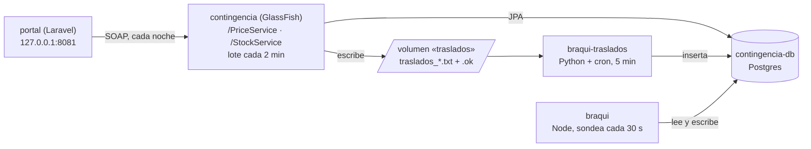

# 📎 Apéndice a16 — El patrimonio
## Laboratorio de contenedores y Kubernetes local

> **Curso:** Laboratorio de contenedores y Kubernetes local · De laboratorio
> **Usado por:** F00 (lo presenta), F01 (empaqueta la Braqui), F02 (lo levanta), F10, F11, F12, F15, F22 y F24–F26 · **Versiones cubiertas:** las de [a01](a01-el-laboratorio.md#para-el-patrimonio-a16)
> **Memoria del perfil `legacy`:** unos 800 MiB con Docker y 710 con Podman, casi todo GlassFish ([a01](a01-el-laboratorio.md#-la-memoria-que-ocupa-cada-perfil)); no usa cluster
> **Fecha de verificación ejecutada:** 03/10/2026 · macOS arm64, con Docker y con Podman · Windows 11 y Linux: no verificados por el autor; se confirman al hacer el curso

**Esto no se lee de corrido.** Se entra para saber cómo está hecha una pieza del patrimonio, cómo
se levanta, qué maña tiene a propósito o con qué prompt se generó, y se sale.

**El patrimonio es lo que Droguerías La Vecina ya tiene, en la versión que cabe en un portátil**:
Contingencia, el portal y la Braqui. Es con lo que arranca La Rebotica (historia §5.3), y es de
donde se extraen los servicios nuevos: `pricing` e `inventory` salen de Contingencia, `catalog` del
portal y `replenish` de la Braqui.

**Qué queda fuera:** WebLogic, Oracle Database y migrar datos, que el curso no cubre; y el
*strangler* que le va quitando tráfico a Contingencia, que es la [Fase 10](10-la-entrada-al-sistema.md). **Y la nota de
licencias, en una línea:** el laboratorio no usa WebLogic ni Oracle porque arranca de Contingencia,
que se construyó en GlassFish y Postgres en 2016 ([historia §1.7](00-historia-de-la-vecina.md#17--2016-el-apagón-la-copia-en-espera-y-contingencia)).

---

## Índice

- [Las tres piezas, de un vistazo](#️-las-tres-piezas-de-un-vistazo)
- [Cómo se levanta](#-cómo-se-levanta)
- [Contingencia](#-contingencia)
- [El portal](#-el-portal)
- [La Braqui](#️-la-braqui)
- [Las mañas, a propósito](#-las-mañas-a-propósito)
- [Los prompts](#-los-prompts)
- [🔥 Los dialectos](#-los-dialectos)
- [Cuándo usar qué](#-cuándo-usar-qué)
- [Advertencias](#️-advertencias)
- [Referencias](#-referencias)
- [Ejercicios](#-ejercicios-6)

---

## 🗺️ Las tres piezas, de un vistazo



| Pieza | En la historia | En el laboratorio | Carpeta |
|---|---|---|---|
| Contingencia | el Siga reducido de 2016, en sesenta sitios | GlassFish, JPA con Hibernate, Postgres, dos servicios SOAP y el lote de traslados | `src/lab/legacy/contingencia/` |
| El portal | PPVW, el piloto de 2019 que se volvió el canal de Bogotá | Laravel con SQLite y la sincronización nocturna del catálogo | `src/lab/legacy/portal/` |
| La Braqui | el despacho de motos, módulo del Siga desde 2023 | un despachador en Node que lee las tablas de Contingencia, y el aviso de traslados en Python | `src/lab/legacy/braqui/` |

---

## 🚀 Cómo se levanta

```bash
task legacy:up
```

Debajo, con el motor activo: construye las cuatro imágenes y levanta el perfil `legacy` de compose.

```text
task: [legacy:up] docker build -q -t lab/legacy-contingencia legacy/contingencia
task: [legacy:up] docker build -q -t lab/legacy-portal legacy/portal
task: [legacy:up] docker build -q -t lab/legacy-braqui legacy/braqui
task: [legacy:up] docker build -q -t lab/legacy-braqui-traslados legacy/braqui/transfers
task: [legacy:up] docker compose -f compose/compose.yaml --profile legacy up -d
…
 Container lab-contingencia-db-1 Started
 Container lab-contingencia-1 Started
 Container lab-portal-1 Started
 Container lab-braqui-traslados-1 Started
 Container lab-braqui-1 Started
```

La primera vez tarda alrededor de minuto y medio con Docker, la mayor parte construyendo
Contingencia con Maven. GlassFish tarda unos segundos más en desplegar el WAR después de que el
contenedor arranca; sabes que terminó cuando su log dice:

```text
  contingencia was successfully deployed in 8,242 milliseconds.|#]
```

`task legacy:down` lo apaga y conserva los datos; `task legacy:down -- -v` los borra, y la próxima
vez la base vuelve a sus datos iniciales.

> 🦭 **Con Podman, el Taskfile construye con `podman build` y después compose solo arranca.** `podman
> compose` delega en el compose de Docker Desktop, que le pasa las credenciales de Docker Hub
> ([a02](a02-problemas-del-ambiente.md#podman-compose-falla-con-invalid-usernamepassword)); con las
> imágenes ya construidas, no tiene nada que bajar.

**Cómo mirar cada pieza.** El portal es la única con puerto en el host:
`http://localhost:8081`. Las demás se miran desde adentro de la red de compose:

```bash
docker exec lab-portal-1 php artisan catalog:sync            # la sincronización de las 2:00, a mano
docker logs lab-braqui-1                                     # las asignaciones de motos
docker logs lab-braqui-traslados-1                           # el aviso de traslados
docker exec lab-contingencia-db-1 psql -U contingencia -d contingencia -c "select * from dispatch"
```

---

## 🧱 Contingencia

**Qué es.** El subconjunto del Siga que opera en un solo sitio: vende, descuenta y registra
préstamos, y no calcula nada (historia §1.7). Corre en **Eclipse GlassFish**, con JPA e
**Hibernate**, sobre su propio **PostgreSQL**, y le habla al mundo por **SOAP**, como el Siga desde
2008. El código es Java de 2016: identificadores en inglés, comentarios en español, ningún
`record`.

**Los datos.** El esquema, el procedimiento del préstamo y los datos iniciales están en
`legacy/contingencia/db/` y los carga la imagen de Postgres la primera vez; Hibernate no crea
tablas. Las tablas llevan los nombres de las entidades del curso (`store`, `product`, `price`,
`stock_level`, `stock_movement`, `replenishment_order`, `dispatch`), más las tres de la Braqui, que
viven en la misma base desde que es módulo del Siga.

**El préstamo vive en la base**, en PL/pgSQL: `register_loan` comprueba existencias en el origen,
descuenta, registra el movimiento y deja la reposición en `PENDING`. Es la pieza que la [Fase 24](24-la-saga-orquestada.md)
saca de la base y convierte en saga.

**Los dos servicios SOAP**, con HTTP Basic: `PriceService` (`getPrice`, `listCatalog`) y
`StockService` (`getStock`, `registerSale`, `requestLoan`). GlassFish los publica en la raíz del
servidor, no bajo el contexto del WAR:

```text
  listening at address at http://11f03735cb59:8080/StockService/StockService|#]
  listening at address at http://11f03735cb59:8080/PriceService/PriceService|#]
```

Un préstamo de dos inhaladores de Girón a Chapinero, con un `curl` en la misma red:

```text
<S:Envelope …><S:Body><ns2:requestLoanResponse …><return>1</return></ns2:requestLoanResponse></S:Body></S:Envelope>
```

Sin credenciales, el servicio responde un *fault* con HTTP 500, como cualquier otro error SOAP:

```text
<faultcode>S:Client</faultcode><faultstring>No autorizado</faultstring>
HTTP 500
```

**El lote de traslados**, cada `TRANSFER_BATCH_MINUTES` (15 en el central, 2 en el laboratorio para
no esperar): pasa los préstamos pendientes a `DISPATCHED`, **confirma la transacción, y después**
escribe `traslados_AAAAMMDD_HHMM.txt` con su `.ok` en la carpeta compartida.

```text
$ docker exec lab-contingencia-1 sh -c 'cd /var/lib/contingencia/traslados && ls -l && cat *.txt'
total 8
drwxr-xr-x 2 root      root      4096 Oct  3 03:40 procesados
-rw-r--r-- 1 glassfish glassfish    0 Oct  3 03:40 traslados_20261003_0340.ok
-rw-r--r-- 1 glassfish glassfish   49 Oct  3 03:40 traslados_20261003_0340.txt
1|SKU-0003|DRO-003|DRO-007|2|2026-10-03 03:38:33
```

**La regla de encendido**, en `GET /contingencia/status`: `ACTIVE` cuando no puede abrir una
conexión con `SIGA_CENTRAL_URL`, `STANDBY` cuando la abre, aunque el central tarde un minuto en
contestar después. En el laboratorio no hay central, y Contingencia siempre está prendida:

```text
{"mode":"ACTIVE","rule":"el central no contesta"}
```

**Dos adaptaciones para que corra hoy**, y ninguna más. Hibernate 7 ya no trae el adaptador de
transacciones para GlassFish que existía en 2016: Contingencia lleva uno de quince líneas
(`infra/GlassFishJtaPlatform.java`) que busca el gestor de transacciones por JNDI. Y dentro del WAR
desplegado, Hibernate no descubre las entidades solo: van listadas en `persistence.xml`. Las dos
están en el prompt.

---

## 🛒 El portal

**Qué es.** El PPVW de 2019, hecho en un trimestre por aprendices del SENA y una pasante (historia
§1.8): Laravel creado con `composer create-project` y `artisan`, con su catálogo propio en SQLite.
`GET /` muestra el catálogo; `php artisan catalog:sync` lo reemplaza entero con el de Contingencia,
por SOAP, y el scheduler de Laravel lo programa a las 2:00.

```text
$ docker exec lab-portal-1 php artisan catalog:sync
8 productos sincronizados desde Contingencia
```

En el laboratorio corre con `php artisan serve` en un solo contenedor. Es una simplificación del
laboratorio, no de la historia: el portal de verdad vive en un servidor alquilado del que el curso
no sabe más. El catálogo nuevo, `catalog`, sí corre con PHP-FPM y nginx desde la [Fase 04](04-empaquetar-los-cuatro-runtimes.md).

---

## 🏍️ La Braqui

**El despachador**, en Node: cada 30 segundos lee los domicilios `PENDING` de la tabla `dispatch`
de Contingencia, asigna a cada uno la moto con menos despachos y lo pasa a `ASSIGNED`. Lee y escribe
tablas que no son suyas, como quedó en 2023 (historia §1.11).

```text
Braqui despachando cada 30 s
despacho 1 (DRO-001, Calle 48 # 33-21, Cabecera) asignado a Jhon Fredy Ardila
despacho 4 (DRO-007, Calle 63 # 9-30, Chapinero) asignado a Diana Garzón
```

**El aviso de traslados**, en Python con `cron` cada cinco minutos (historia §1.9): toma un archivo de
bloqueo, recorre los `traslados_*.txt` en orden de nombre, procesa solo los que tienen su `.ok`, salta
los nombres que ya están en `transfer_file_processed`, inserta cada línea en `braqui_transfer`, anota
el nombre y mueve el archivo a `procesados/`.

```text
aviso de traslados programado: */5 * * * *
traslados_20261003_0318.txt: 1 traslados recibidos
```

El Dockerfile del despachador es de un solo *stage*, y es el que escribe la [Fase 01](01-primer-contenedor-y-dockerfile.md): es el primer
contenedor del curso.

---

## 🪤 Las mañas, a propósito

Ninguna de estas es un descuido del laboratorio: todas salen de la historia, y cada una tiene la
fase que la cobra. **No se arreglan aquí.**

| Maña | Dónde está | La cobra |
|---|---|---|
| La Braqui lee y escribe tablas de Contingencia | `braqui/dispatcher.js` | [Fase 12](12-estado-y-almacenamiento.md): una base por servicio |
| El bloqueo del aviso de traslados se queda puesto si el script muere | `transfers/process_transfers.py` | [Fase 12](12-estado-y-almacenamiento.md): `CronJob` con `concurrencyPolicy: Forbid` |
| El lote confirma y **después** escribe el archivo; si la escritura falla, el traslado se pierde sin que nadie se entere | `TransferBatch.java` | [Fase 24](24-la-saga-orquestada.md) (la saga que nadie compensa) y [Fase 26](26-idempotencia-y-outbox.md) (outbox) |
| El script reconoce un archivo por su nombre, no por los traslados que trae | `process_transfers.py` | [Fase 26](26-idempotencia-y-outbox.md): idempotencia |
| Nadie le avisa al Siga si el archivo se leyó | el lote y el script | [Fase 25](25-la-coreografia.md): el mensaje que se pierde |
| Contingencia se prende cuando el Siga no contesta, no cuando contesta tarde | `StatusServlet.java` | Fases 15 y 22 |
| Las credenciales SOAP del portal, versionadas en el `.env` y horneadas en la imagen | `portal/.env` | [Fase 11](11-configuracion-y-secretos.md) |
| El portal no tiene pruebas | `portal/` | la suite de conformidad de `catalog`, desde la [Fase 02](02-compose-el-sistema-en-un-archivo.md) |

> 🦭 **Una maña que salió sola, y vale la pena ver.** En la primera corrida con Docker, el lote no
> pudo escribir el archivo: el volumen con nombre se creó como `root` y GlassFish corre como el
> usuario 1000. El préstamo quedó `DISPATCHED` en la base y no apareció ningún archivo, que es
> exactamente la falla que cuenta la historia. Con Podman sin root no pasó. La imagen de
> Contingencia ahora crea la carpeta con dueño `glassfish`, y Docker hereda ese dueño al crear el
> volumen. El log de aquella corrida:
>
> ```text
>   No se pudo escribir traslados_20261003_0308.txt: /var/lib/contingencia/traslados/traslados_20261003_0308.txt|#]
> ```

### Lo que se le agregó para sacarlo

Las mañas no se arreglan, pero el patrimonio sí ganó piezas a lo largo del curso: las que hicieron falta para moverlo
al cluster y empezar a sacarle tráfico. Ninguna está en la historia; las puso el taller, y conviene saber cuáles son
para no confundirlas con el Siga:

- **La fachada REST de precios** ([Fase 10](10-la-entrada-al-sistema.md)): `PriceFacadeServlet` contesta
  `GET /prices/{sku}?store=` con la forma del contrato de `pricing`, bajo el contexto de Contingencia, y un nginx en el
  mismo pod, en el 8081 (`deploy/legacy/fachada-nginx.conf`), le quita el `/contingencia` a la ruta, porque la puerta
  no puede reescribirla para un solo backend. Es lo que deja repartir el tráfico de precios entre los dos.
- **Un `Secret` compartido** ([Fase 11](11-configuracion-y-secretos.md)): `portal-contingencia`, en `legacy`, con el
  usuario y la contraseña SOAP. Lo leen los dos lados, Contingencia para exigirlos y el portal para presentarlos; sale de
  `.secrets/portal-contingencia.env`, que no se versiona, en lugar del `.env` horneado en la imagen.
- **La carpeta de traslados como PVC y el aviso como `CronJob`** ([Fase 12](12-estado-y-almacenamiento.md)):
  `traslados-pvc.yaml`, compartido entre Contingencia y el aviso, y `traslados-cronjob.yaml`, con
  `concurrencyPolicy: Forbid`, que hace lo que el archivo de bloqueo intentaba. El script es el mismo, con sus mañas.

El servlet de la fachada está en el código de Contingencia, así que también corre en compose; lo demás (el nginx, el
`Secret`, el PVC y el `CronJob`) vive en `deploy/legacy/`, que es lo que aplica `task legacy:up TARGET=cluster`. En compose,
el portal sigue con su `.env` y el aviso con su `cron`, como llegaron.

---

## 📜 Los prompts

Las tres piezas se generaron con estos prompts, con Claude Code como herramienta de referencia, y se
publican **en la versión que funcionó**: cuando el código generado no corría, se corrigió el prompt,
no el código. Con otra herramienta de generación, el prompt sirve igual; lo que cambia es cuánto hay
que insistir en lo que **no** debe hacer.

### P-1 · Contingencia

```markdown
Genera **Contingencia**, la versión reducida del Siga que opera en un solo sitio, en
`src/lab/legacy/contingencia/`. Es código heredado de 2016: se escribe como lo habría escrito un
equipo Java EE de entonces, sin modernizarlo, y con identificadores en inglés y comentarios en
español.

**Stack.** Jakarta EE 11 sobre Eclipse GlassFish (imagen oficial, versión de a01), JPA con
**Hibernate** como proveedor (empaquetado en el WAR), y PostgreSQL. Maven, un solo módulo,
`packaging war`, Java 21 (el JDK de la imagen de GlassFish). La API de Jakarta EE va `provided`, y
también la de JAX-WS (`jakarta.xml.ws-api`), que Jakarta EE 11 dejó como opcional y GlassFish sigue
trayendo. Nada de construcciones posteriores a 2016 en el código: ni `record`, ni `var`.

**Hibernate dentro de GlassFish**, dos cosas que hay que hacer explícitas: las entidades se listan una
por una en `persistence.xml` (con `exclude-unlisted-classes`), porque dentro del WAR desplegado
Hibernate no las descubre; y la plataforma de transacciones es una clase propia de unas quince líneas
que extiende `AbstractJtaPlatform` y busca `java:appserver/TransactionManager` y
`java:comp/UserTransaction`, porque Hibernate 7 ya no trae la de GlassFish.

**Datos.** El esquema y los datos iniciales viven en `db/` como SQL que corre la imagen de Postgres
al crearse (`docker-entrypoint-initdb.d`); Hibernate no crea tablas (`hibernate.hbm2ddl.auto=none`).
Tablas, con los nombres del contrato del curso: `store`, `product` (con `category`), `price`
(precio vigente por producto y droguería), `stock_level` (cantidad y umbral), `stock_movement`
(`SALE`, `LOAN_OUT`, `LOAN_IN`), `replenishment_order` (el préstamo: origen y destino son
droguerías; estados `PENDING`, `DISPATCHED`), `dispatch` (domicilios esperando moto: `PENDING`,
`ASSIGNED`), y las dos de la Braqui que viven en esta misma base desde que es módulo del Siga:
`rider` y `braqui_transfer`, más `transfer_file_processed`. Datos iniciales: ocho droguerías de
Santander, Boyacá y Bogotá, ocho productos de droguería con precio en pesos, existencias para todos,
cuatro motos y tres domicilios pendientes.

**El procedimiento del préstamo, en PL/pgSQL:** `register_loan(sku, origin_store, destination_store,
quantity)` comprueba existencias en el origen, descuenta en el origen (`LOAN_OUT`), crea la
`replenishment_order` en `PENDING` y devuelve su id. No suma en el destino: eso pasa cuando llega la
moto, y nadie lo modela todavía. Es la traducción a mano del PL/SQL del central.

**Dos servicios SOAP (JAX-WS, `@WebService` sobre `@Stateless`):** GlassFish los publica en la raíz
del servidor, en `/PriceService/PriceService` y `/StockService/StockService`, no bajo el contexto
del WAR.
- `PriceService`: `getPrice(sku, storeId)` devuelve el precio vigente en COP; `listCatalog()`
  devuelve sku, nombre, categoría y precio de referencia de todos los productos.
- `StockService`: `getStock(sku, storeId)`, `registerSale(sku, storeId, quantity, deliveryAddress)`
  (descuenta, registra `SALE` y, si hay dirección, crea un `dispatch` pendiente) y
  `requestLoan(sku, originStore, destinationStore, quantity)`, que llama a `register_loan`.

Los dos exigen **HTTP Basic** contra un usuario y una contraseña que llegan por variables de entorno
(`SOAP_USER`, `SOAP_PASSWORD`), revisado en un `SOAPHandler` declarado con `@HandlerChain` (un filtro
de servlet no ve los endpoints EJB). Sin credenciales responde un fault `Client` con el texto
`No autorizado`.

**El lote de traslados**, un `@Singleton @Startup` con `TimerService` cada `TRANSFER_BATCH_MINUTES`
minutos (15 por defecto): en una transacción propia toma los préstamos `PENDING`, los pasa a
`DISPATCHED` **y confirma**; **después** escribe `traslados_AAAAMMDD_HHMM.txt` en `TRANSFER_DIR`, una
línea por préstamo con los campos `id|sku|origen|destino|cantidad|fecha` separados por barra
vertical, y al final un archivo vacío con el mismo nombre y extensión `.ok`. El orden —confirmar y
después escribir— es el de la historia, y no se corrige.

**La regla de encendido.** Un `GET /contingencia/status` (servlet, JSON) responde el modo:
Contingencia está `ACTIVE` cuando no puede **abrir una conexión** con `SIGA_CENTRAL_URL` (cinco
segundos para conectar), y `STANDBY` cuando la abre, aunque el central tarde un minuto en contestar
después. Sin `SIGA_CENTRAL_URL`, siempre `ACTIVE`.

**Configuración del servidor.** El pool JDBC `jdbc/contingencia` se crea al arrancar con
`custom/init.sh` de la imagen de GlassFish (que la imagen corre antes de levantar el dominio): un
archivo de comandos de `asadmin` con `start-domain`, `create-jdbc-connection-pool`,
`create-jdbc-resource` y `stop-domain`, armado con `DB_HOST`, `DB_NAME`, `DB_USER` y `DB_PASSWORD`, que no
hace nada si el pool ya existe. El driver de Postgres va en `glassfish/lib` de la imagen, bajado con
`ADD --checksum`. El WAR se copia a `/deploy`.

**Dockerfile** multi-stage: Maven con Temurin 21 para construir, la imagen de GlassFish para correr,
las dos por digest con el tag en un comentario.

**No hagas:** pruebas, logs estructurados, sondas de salud, métricas ni manejo de señales. Nada de lo
que el curso enseña. Es el sistema como está.
```

### P-2 · El portal

```markdown
Genera **el portal** (PPVW) en `src/lab/legacy/portal/`, como lo habrían hecho en 2019 unos
aprendices con una pasante y un trimestre de plazo: un proyecto Laravel creado con `composer
create-project` y `artisan`, sin pruebas propias, con identificadores en inglés y comentarios en
español.

**Datos:** SQLite en `database/database.sqlite`, con una tabla `products` (sku, nombre, categoría,
precio, `synced_at`) creada por migración.

**El catálogo:** `GET /` muestra el catálogo en una tabla HTML (Blade), con la hora de la última
sincronización. Es lo único que el laboratorio necesita del portal.

**La sincronización nocturna:** un comando `catalog:sync` que llama a `listCatalog` del
`PriceService` de Contingencia con `SoapClient` (extensión `soap`) y HTTP Basic, y reemplaza la tabla.
Se programa en el scheduler de Laravel todos los días a las 2:00; en el laboratorio se corre a mano o
con `schedule:work`.

**Configuración:** el `.env` **se versiona** con el `APP_KEY` y las credenciales SOAP de
Contingencia en texto plano, como lo dejaron (es una maña de la historia y no se corrige aquí).

**Ejecución:** `php artisan serve` en el puerto 8080, en un solo contenedor, con `php` (CLI, la
versión de a01) más la extensión `soap` (que en Alpine se compila con `$PHPIZE_DEPS`). Dockerfile con
`composer` por digest para instalar, y el `.env` viaja dentro de la imagen porque nadie puso un
`.dockerignore` para él. La zona horaria de la aplicación es `America/Bogota`.

**Limpieza del esqueleto:** el proyecto de hoy trae archivos que un portal de 2019 no tenía (pruebas
de ejemplo, Vite, `README.md`, archivos para asistentes de código); se borran.

**No hagas:** pruebas, colas, autenticación de usuarios, nada de lo que el curso enseña.
```

### P-3 · La Braqui

```markdown
Genera **la Braqui** en `src/lab/legacy/braqui/`, en dos piezas que viven en la misma carpeta.

**El despachador (Node, la versión de a01):** un proceso que **cada 30 segundos** consulta la tabla
`dispatch` de la base de Contingencia (`DATABASE_URL`, con el cliente `pg`) buscando los `PENDING`,
asigna a cada uno la moto libre con menos asignaciones de la tabla `rider`, y lo pasa a `ASSIGNED`
con el id de la moto. Escribe una línea de texto por asignación. Expone `GET /dispatches` (JSON con
los últimos veinte) en el puerto 8080, con `node:http`, sin framework. Lee tablas que no son suyas a
propósito: así quedó en 2023.

**El aviso de traslados (Python, la versión de a01):** `transfers/process_transfers.py`, que corre
cada cinco minutos con `cron` (busybox `crond` en un contenedor `python` alpine) y hace exactamente lo
que hace el de la historia, con sus tres parches:
1. toma un archivo de bloqueo; si ya existe, sale sin hacer nada y sin error;
2. lista `traslados_*.txt` en `TRANSFER_DIR` en orden de nombre, y procesa un `.txt` solo si ya existe
   su `.ok`;
3. salta los nombres que ya están en `transfer_file_processed`;
4. inserta cada línea en `braqui_transfer`, registra el nombre del archivo en
   `transfer_file_processed` y lo mueve a `procesados/`;
5. borra el bloqueo.
Dependencias en `transfers/requirements.txt` (`psycopg[binary]`), instaladas en un `venv` dentro de
la imagen. El `crond` de busybox no hereda el entorno del contenedor: un `start.sh` escribe el
crontab con las variables en la misma línea. La imagen lleva `tzdata`, o `TZ` no tiene efecto.

**No hagas:** reintentos, idempotencia por contenido, avisos al Siga, compensaciones ni métricas. Las
fallas que esconden los parches son el material de las Fases 12, 24, 25 y 26.
```

---

## 🔥 Los dialectos

Contexto para la [Fase 24](24-la-saga-orquestada.md), no tema del curso. El préstamo existe dos veces: en PL/SQL en el central
y en PL/pgSQL en Contingencia, portado a mano en 2016. **La versión de Oracle es texto**: el
laboratorio no tiene Oracle, y no la ejecuté.

```sql
-- El préstamo en el central (Oracle, PL/SQL). No ejecutado: no hay Oracle en el laboratorio.
CREATE OR REPLACE FUNCTION register_loan(p_sku IN VARCHAR2, p_origin IN VARCHAR2,
                                         p_destination IN VARCHAR2, p_quantity IN NUMBER)
RETURN NUMBER IS
    v_available NUMBER;
    v_order_id  NUMBER;
BEGIN
    SELECT NVL(quantity, 0) INTO v_available
      FROM stock_level
     WHERE store_id = p_origin AND sku = p_sku AND ROWNUM = 1
       FOR UPDATE;
    IF v_available < p_quantity THEN
        RAISE_APPLICATION_ERROR(-20001, 'Sin existencias suficientes en ' || p_origin);
    END IF;
    UPDATE stock_level SET quantity = quantity - p_quantity
     WHERE store_id = p_origin AND sku = p_sku;
    INSERT INTO stock_movement (id, store_id, sku, type, quantity, created_at)
    VALUES (stock_movement_seq.NEXTVAL, p_origin, p_sku, 'LOAN_OUT', p_quantity, SYSDATE);
    v_order_id := replenishment_order_seq.NEXTVAL;
    INSERT INTO replenishment_order (id, sku, origin_store_id, destination_store_id, quantity, status, created_at)
    VALUES (v_order_id, p_sku, p_origin, p_destination, p_quantity, 'PENDING', SYSDATE);
    RETURN v_order_id;
END;
```

Las cuatro diferencias que Andrés tuvo que pelear, en la versión de Contingencia que sí corre
(`db/02-register-loan.sql`):

| En Oracle | En Postgres | Lo que muerde |
|---|---|---|
| `NVL(x, 0)` | `COALESCE(x, 0)` | `NVL` no existe; `COALESCE` existe en los dos |
| `ROWNUM = 1` | `LIMIT 1`, o nada si la llave ya es única | `ROWNUM` no existe |
| `seq.NEXTVAL` en el `INSERT` | `BIGSERIAL` y `RETURNING id INTO` | las secuencias se piden distinto |
| `''` es `NULL` | `''` no es `NULL` | un `IF dirección IS NULL` que en Oracle atrapaba la cadena vacía deja de hacerlo; por eso `registerSale` revisa las dos cosas |

---

## 🧭 Cuándo usar qué

| Quieres… | Haz | Por qué |
|---|---|---|
| ver el patrimonio corriendo | `task legacy:up` y `http://localhost:8081` | es lo que hay antes de construir nada |
| saber de dónde sale un servicio nuevo | la sección de su pieza aquí | `pricing` e `inventory` de Contingencia, `catalog` del portal, `replenish` de la Braqui |
| ver un préstamo viajar por archivo | `requestLoan` y los logs de `braqui-traslados` | es el hilo de la Parte IV |
| volver a los datos iniciales | `task legacy:down -- -v` | borra los volúmenes |
| regenerar una pieza | su prompt, y después `task legacy:up` | el prompt es la fuente, no el código |

---

## ⚠️ Advertencias

- **El patrimonio no se arregla en este apéndice.** Si una maña te molesta, la fase que la cobra
  está en la tabla.
- **Las credenciales del patrimonio son de laboratorio** y están en texto plano a propósito. No
  copies el patrón.
- **El lote corre cada 2 minutos y el script cada 5:** un préstamo tarda hasta siete minutos en
  llegar a `braqui_transfer`. En la historia son hasta veinte.
- **Contingencia corre con JDK 21**, no con el Java del curso: es la versión que trae la imagen de
  GlassFish ([a01](a01-el-laboratorio.md#para-el-patrimonio-a16)).

---

## 📚 Referencias

- Eclipse GlassFish, documentación: https://glassfish.org/docs/ — y la imagen oficial:
  https://github.com/eclipse-ee4j/glassfish.docker/wiki (`/deploy` y `custom/init.sh`).
- Jakarta XML Web Services 4.0: https://jakarta.ee/specifications/xml-web-services/4.0/
- Hibernate ORM 7.4, *User Guide*: https://docs.hibernate.org/orm/7.4/userguide/html_single/
- PostgreSQL 18, *PL/pgSQL*: https://www.postgresql.org/docs/18/plpgsql.html
- Oracle Database, *PL/SQL Language Reference*:
  https://docs.oracle.com/en/database/oracle/oracle-database/26/lnpls/ — para leer la versión del
  central; apunta a la versión 26, que no es la del Siga de la historia.
- Laravel 13, *Task Scheduling*: https://laravel.com/framework/docs/13.x/scheduling
- PHP, `SoapClient`: https://www.php.net/manual/es/class.soapclient.php
- node-postgres: https://node-postgres.com/
- psycopg 3: https://www.psycopg.org/psycopg3/docs/

> ⚠️ Las URL y los contenidos cambian; las de GlassFish y la imagen no fijan versión.

---

## 🧪 Ejercicios (6)

Cortos, sobre el patrimonio corriendo (`task legacy:up`). Los tres últimos provocan las mañas de la
historia: ninguno se arregla aquí, y cada uno nombra la fase que lo cobra.

**🟢 Fácil (1–2)**

### 🟢 Ejercicio 1 — El catálogo que llega de noche
Levanta el patrimonio, abre el portal y corre a mano la sincronización de las 2:00.

**Criterio:** `http://localhost:8081` muestra ocho productos y la hora de la sincronización, y
`php artisan catalog:sync` dijo `8 productos sincronizados desde Contingencia`.

<details><summary>Solución</summary>

`task legacy:up`, esperar a que el log de Contingencia diga `successfully deployed`, y
`docker exec lab-portal-1 php artisan catalog:sync`.
</details>

### 🟢 Ejercicio 2 — Un préstamo que viaja por archivo
Pide prestadas dos unidades de `SKU-0003` de Girón (`DRO-003`) a Chapinero (`DRO-007`) por SOAP, y
síguelo hasta la Braqui.

**Criterio:** en menos de siete minutos, `select order_id, file_name from braqui_transfer` muestra tu
préstamo con el nombre del archivo que lo trajo, y ese archivo está en `procesados/`.

<details><summary>Solución</summary>

Un `curl` con `-u 'portal:Vecina2019*'` y el sobre SOAP de `requestLoan` contra
`http://contingencia:8080/StockService/StockService`, desde un contenedor en la red `lab_default`.
El lote escribe el archivo en menos de dos minutos y el script lo recoge en el siguiente múltiplo de
cinco.
</details>

**🟡 Intermedio (3–4)**

### 🟡 Ejercicio 3 — Un domicilio que espera moto
Registra una venta con dirección de entrega en Chapinero y mira a la Braqui asignarla.

**Criterio:** el log de `lab-braqui-1` muestra `despacho N (DRO-007, …) asignado a …` en menos de
treinta segundos, y la fila de `dispatch` pasa a `ASSIGNED` con su `rider_id`.

<details><summary>Solución</summary>

`registerSale` con `deliveryAddress` crea la fila en `dispatch`; la Braqui la lee en su siguiente
sondeo. La Braqui nunca se entera por un aviso: pregunta.
</details>

### 🟡 Ejercicio 4 — El bloqueo que se quedó puesto
Crea a mano el archivo de bloqueo del aviso de traslados (`/var/lib/braqui/traslados.lock`, en el
contenedor `lab-braqui-traslados-1`) y pide un préstamo.

**Criterio:** después de la siguiente corrida del script, el archivo del préstamo sigue en la carpeta,
`braqui_transfer` no tiene filas nuevas, y el log del script **no dice nada**.

<details><summary>Solución</summary>

`docker exec lab-braqui-traslados-1 touch /var/lib/braqui/traslados.lock`. Es lo que pasa en la
historia cuando el servidor se reinicia a mitad de una corrida: cada corrida sale sin hacer nada y
sin error. La [Fase 12](12-estado-y-almacenamiento.md) lo reemplaza por un `CronJob` con `concurrencyPolicy: Forbid`. Borra el
bloqueo al terminar.
</details>

**🟠 Difícil (5)**

### 🟠 Ejercicio 5 — El traslado que existe y nadie recibe
Quítale a GlassFish el permiso de escribir en la carpeta de traslados (`chmod 555`, como `root`) y
pide un préstamo. **Predice antes** en qué estado queda el préstamo y si alguien se entera.

**Criterio:** `replenishment_order` muestra tu préstamo en `DISPATCHED`, no hay ningún archivo nuevo
en la carpeta, y el único rastro es una línea `No se pudo escribir traslados_…` en el log de
Contingencia.

**Rúbrica:** la predicción escrita antes; las tres evidencias; y la explicación de por qué el orden
"confirmar y después escribir" produce esto. La cobran la [Fase 24](24-la-saga-orquestada.md) (la saga que nadie compensa) y la
[Fase 26](26-idempotencia-y-outbox.md) (el outbox). Devuelve el permiso al terminar.

**🔴 Muy difícil (6)**

### 🔴 Ejercicio 6 — El mismo préstamo, dos veces
Simula el lote que falló a la mitad y se reintentó: copia un archivo de traslados ya generado con
otro minuto en el nombre, con su `.ok`, antes de que el script lo recoja.

**Criterio:** `select order_id, file_name from braqui_transfer` muestra el mismo `order_id` dos
veces, con dos nombres de archivo distintos.

**Rúbrica:** la salida literal; por qué la tabla `transfer_file_processed` no lo detectó (marca el
archivo, no el traslado); qué llave lo habría detectado; y por qué esa llave tampoco basta si el
mismo préstamo se reintenta con otro id. Es el corazón de la [Fase 26](26-idempotencia-y-outbox.md).

---

> 🏷️ **Este apéndice deja archivos en el repositorio**: `src/lab/legacy/` y el perfil `legacy` de
> `src/lab/compose/compose.yaml`. Con `task legacy:up` corriendo, el commit se etiqueta
> `apendice-a16-patrimonio` (ver la [convención de git](00-convencion-de-git-y-tags.md)).
