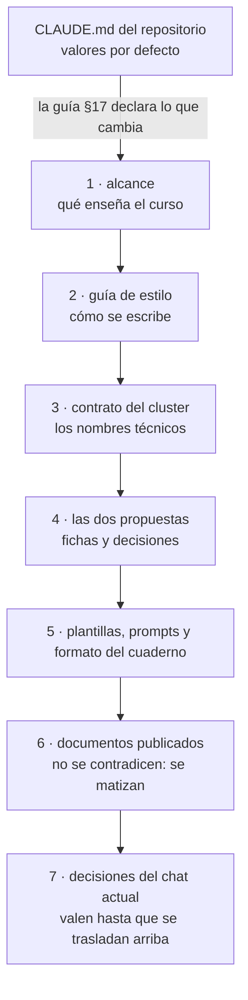

# 🧰 `prompts/` — la maquinaria del curso
## Laboratorio de contenedores y Kubernetes local

Este directorio no es material del curso: es **lo que se usó para escribirlo** y lo que hace falta
para tocarlo sin romperlo. El lector nunca lo abre, y no viaja cuando el curso se publica en su
propio repositorio. Quien vaya a editar una fase lo lee entero antes de teclear la primera línea.

> **Estado:** cerrado el 05/10/2026: veintiocho fases, dieciséis apéndices, el cuaderno de veintisiete
> incidentes y las 44 decisiones en ✅. Revisado ese mismo día contra los lineamientos de producción
> del repositorio: diagramas a Mermaid, anclas corregidas y verificador agregado (guía §19).

---

## 📖 Qué hay aquí, y cuándo se lee

| Documento | Qué es | Cuándo se lee |
|---|---|---|
| [`alcance-del-proyecto.md`](alcance-del-proyecto.md) | qué enseña el curso, a quién y con qué límites | antes de tocar el contenido de una fase |
| [`guia-de-estilo-y-convenciones.md`](guia-de-estilo-y-convenciones.md) | cómo se escribe; checklist en §16, excepciones en §17 y alineación con los lineamientos en §19 | en cada sesión, siempre |
| [`contrato-del-cluster.md`](contrato-del-cluster.md) | los nombres técnicos congelados: namespaces, servicios, puertos, tags | cada vez que haga falta un nombre |
| [`propuesta-fases-y-alcance.md`](propuesta-fases-y-alcance.md) | la ficha de cada fase y el registro de decisiones D1–D44 (§12) | antes de tocar qué entra en una fase |
| [`propuesta-apendices-y-alcance.md`](propuesta-apendices-y-alcance.md) | la ficha de cada apéndice | antes de tocar un apéndice |
| [`plantillas-de-capitulo.md`](plantillas-de-capitulo.md) | los esqueletos de fase y de apéndice | al empezar y al cerrar cada documento |
| [`prompts-de-fase.md`](prompts-de-fase.md) y [`prompts-de-apendice.md`](prompts-de-apendice.md) | el marco común y un bloque por documento, con la escena de la historia | si se reescribe una fase o un apéndice entero |
| [`formato-cuaderno-incidentes.md`](formato-cuaderno-incidentes.md) | la forma de cada incidente y sus excepciones | antes de tocar el cuaderno |
| [`verificacion-de-laboratorio/`](verificacion-de-laboratorio/hallazgos.md) | los hallazgos H1–H270 de lo que se ejecutó, con sus `logs/` y el `borrador/` | cuando una cifra o una versión del curso se pone en duda |
| [`verificar-corpus.py`](verificar-corpus.py) y [`verificador_base.py`](verificador_base.py) | las validaciones base de los lineamientos y las propias del curso | al cerrar cualquier edición |
| [`pendientes-a-futuro.md`](pendientes-a-futuro.md) | la hoja de verificación para cuando el autor tome el curso desde cero, en cada sistema | al tomar el curso, y al volver a él |

Lo que en otros cursos son documentos aparte —diccionario de términos, plan de producción— aquí son
secciones de la guía o ya no existen porque el curso está cerrado. La guía §19.2 dice qué hace el
papel de cada uno.

**Orden de autoridad**, cuando dos se contradicen (alcance, encabezado):



> 🧭 **Si una contradicción aparece al editar, se arregla primero en el documento de arriba.**
> Parchear la fase y dejar el contrato desactualizado es como empiezan las divergencias que nadie ve
> hasta que un lector las encuentra.

---

## 🚀 Cómo abrir una sesión de edición

El curso está cerrado y bajo bloqueo de contenido: no se renombran fases ni se reestructuran
capítulos. Lo que sí se hace es corregir, matizar y agregar sin renumerar.

1. Lee la guía entera, con especial atención a §5 (código y versiones), §6 (cómo se presenta una
   medición), §13 (honestidad) y §17 (lo que este curso hace distinto del repositorio).
2. Si la edición toca qué entra en una fase, lee su ficha en la propuesta y las decisiones que la
   citan en §12.
3. Edita. Si algo se ejecuta, se ejecuta de verdad y se pega la salida literal; si no se puede
   ejecutar, se dice con esas palabras. Las versiones solo se escriben en `a01`.
4. Al cerrar, desde la raíz del curso:

   ```bash
   python3 prompts/verificar-corpus.py
   python3 prompts/verificar-corpus.py --publicacion
   ```

   - El primero tiene que salir en **0 errores y 0 avisos**. Un aviso `DIAGRAMA` significa que un
     bloque `text` dibuja algo que va en Mermaid (guía §19.1).
   - El segundo agrega lo que exige el repositorio público: nada que enlace `prompts/` ni que cite
     material privado.
   - Si la edición toca código de `src/lab/`, además pasa la suite del paso (`task conformance`).

---

## 🪦 Lo que cambió al revisar

- **05/10/2026.** Siete diagramas ASCII pasaron a Mermaid en seis documentos, dibujados uno por uno
  con `mmdc` antes de publicarlos; las fichas de cierre de fase, los árboles y las capturas se
  quedaron en `text` (D44). Se corrigieron 32 enlaces a títulos con emoji que en GitHub no llevaban a
  ninguna parte: el ancla que GitHub genera conserva el U+FE0F de ⚠️, ⚖️ o 🌩️, y los enlaces se habían
  escrito sin él. Entraron el verificador, esta página y [`pendientes-a-futuro.md`](pendientes-a-futuro.md).

---

## ⚠️ Las tres cosas que más se rompen al editar

- **Una cifra sin su medición.** Todo "más rápido" o "más liviano" sale de `BENCHMARKS.md`, con su
  máquina y su fecha (guía §6). Una cifra corregida en una fase y no en `BENCHMARKS.md` deja dos
  verdades.
- **Un nombre fuera del contrato.** Un namespace, un puerto o un tag que no está en
  `contrato-del-cluster.md` rompe el Taskfile, el chart o los tags `inc/`, y el lector lo descubre
  tres fases después.
- **Desincronizar la prosa y `src/lab/`.** El curso construye un solo artefacto y la historia vive en
  los tags `fase-NN-<slug>`: un cambio en el código de una fase cambia lo que ven todas las
  siguientes.
