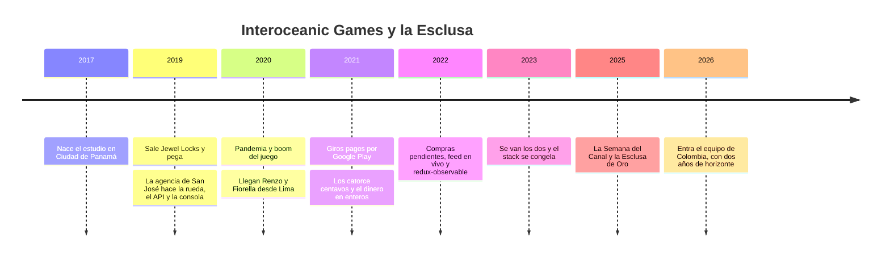

# 🏢 Historia del sistema

> Tutorial React 16 — La Esclusa, la consola de Jewel Locks · Ficha de contexto ·
> **Se lee antes de la Fase 0**
> ~20 minutos · No hay código acá: hay motivos.
> **Vigencia:** 2026-10-06.

Este documento cuenta de dónde viene la Esclusa, la consola que vas a mantener,
y el API que tiene detrás. No es decoración narrativa: es la información que en
un trabajo real **nadie te da** y que te pasarías tres semanas reconstruyendo a
partir de `git log`, de un README que escribió una agencia que ya no existe y de
dos freelancers que contestan con mucha amabilidad y poca memoria.

> 📝 **Todo lo que sigue es ficción, y a propósito.** Interoceanic Games no
> existe, Jewel Locks tampoco, y nadie de esta historia es una persona real. Los
> inventamos enteros para este curso, y esa es exactamente la razón de que
> podamos contarte la historia completa —con fechas, decisiones y errores
> incluidos— sin omitir nada. Un caso de estudio real siempre viene recortado
> por un NDA; este viene entero. Y lo más importante: **el curso construye la
> Esclusa pieza por pieza**, así que cuando el material diga "así está", vas a
> poder abrir el archivo y comprobarlo.

---

## 1. 🧭 Por qué esto va antes que el código

Hay una pregunta que separa al mantenedor que sirve del que no, y aparece la
primera vez que abres un archivo raro: **¿esto está así a propósito o por
error?**

En la Esclusa esa pregunta tiene una respuesta que conviene tener desde el
primer día: **nadie del estudio escribió este código**. Interoceanic Games es un
estudio de videojuegos que fundaron una artista y un músico; su gente sabe de
Unity y de Unreal, de arte, de música, de diseño de niveles y de cómo se siente
un buen combo. La web y el backend siempre fueron
"la parte que se contrata afuera". La consola y el API los escribieron dos
equipos externos, uno detrás del otro, cada uno con su contrato, su alcance y
su fecha de salida. Ninguno de los dos se quedó a ver lo que su código hacía un
año después.

Eso no hace al código malo; lo hace **legible de otra manera**. Cuando veas una
decisión rara, no busques un arquitecto que no hubo: busca el contrato. Cada
capa tiene la forma del alcance que alguien pagó, de la fecha que alguien
prometió y de lo que quedó fuera "para la fase dos". Casi siempre está en esta
ficha.

Léela una vez ahora y vuelve a ella cuando una decisión del código te parezca
inexplicable.

---

## 2. 🏝️ La empresa, en un párrafo (y el juego que no estaba en el plan)

**Interoceanic Games** es un estudio indie de Ciudad de Panamá, fundado en 2017
por una artista y un músico de videojuegos, con un nombre que en Panamá no
necesita explicación: un estudio chico que quería conectar dos mundos, como el
canal.
Durante dos años hizo lo que hacen casi todos los estudios indie: juegos
pequeños que no recuperaban lo que costaban, trabajos por encargo para pagar la
oficina —un juego publicitario para una marca de refrescos, una app educativa
para un colegio— y mucha fe.

En 2019 salió **Jewel Locks**, un juego de rompecabezas de gemas para el
celular: combinas tres o más piedras del mismo color para romperlas, y el agua
del tablero baja como en una esclusa del canal, línea por línea, arrastrando las
gemas hacia abajo. Nadie en el estudio pensó que fuera *el* juego. Era el
cuarto. Y fue el que pegó.

Hoy Interoceanic Games vive de Jewel Locks. Tiene una docena de personas en
planilla, una oficina en un segundo piso de El Cangrejo, y el modelo de trabajo
de muchos estudios chicos de la región: **un núcleo en Panamá y freelancers en
el resto de Latinoamérica**. El núcleo es lo que el estudio sabe hacer: arte,
música, diseño, los dos desarrolladores de **Unity** que mantienen Jewel Locks
y los de **Unreal** que hacen el juego grande del estudio (§3), que son casi
toda la planilla técnica. Lo demás —web, backend, servidores— se contrata afuera, y no
por gusto: en Panamá el estudio lleva años sin poder contratar desarrolladores
de backend. Los pocos que hay los absorben los bancos, las navieras y las
empresas de logística del canal, con salarios que un estudio indie no iguala.
Los freelancers de Lima, de Bogotá o de San José, en cambio, trabajan en la
misma hora: Panamá, Lima y Bogotá están en UTC−5 todo el año, y esa coincidencia
es la mitad de por qué el modelo funciona.

La **Esclusa** —la consola de operación que este curso reconstruye— es por donde
pasa todo lo que el estudio le hace al juego en vivo: las ruedas de premios de
cada evento, los giros que soporte regala para compensar una falla, el saldo y
el inventario de un jugador que escribe enojado, y el tablero donde se mira
cuánto se giró y cuánto se vendió. El nombre se lo puso Itzel el primer día:
*"todo lo que entra al juego pasa por aquí"*.

---

## 3. 📅 Cómo llegó hasta aquí

La Esclusa no la escribió una persona con un plan. La escribieron dos equipos
externos en cuatro años, cada uno con el alcance de su contrato, y después
quedó quieta tres años mientras el juego seguía creciendo encima. Las capas se
ven a simple vista cuando sabes qué buscar.



| Año | Qué pasó | Quién | Lo que dejó |
|---|---|---|---|
| 2017 | Nace Interoceanic Games | Itzel Batista y Abdiel Castillo | Un estudio que sabe de arte y de música, no de web |
| 2017–2018 | Tres juegos chicos y trabajos por encargo | El estudio | La costumbre de contratar afuera lo que no es juego |
| Mar 2019 | Sale Jewel Locks en Android, con anuncios entre niveles | Itzel, Abdiel y Carlos Chong | El juego que paga todo lo demás |
| Sep–dic 2019 | La rueda de premios, el API y la consola, para el evento de Navidad | Una agencia de San José, Costa Rica | Clases con `connect()`, el token en `localStorage`, un API sin transacciones |
| Ene 2020 | Termina el contrato de la agencia | — | Un README, un `.env` y nadie a quien preguntar |
| 2020 | Pandemia: los jugadores se multiplican | — | Soporte desbordado y compensaciones a mano |
| 2020–2021 | Llegan dos freelancers de Lima | Renzo Quispe y Fiorella Huamán | Redux Toolkit al lado del Redux clásico; los envíos con UI optimista |
| 2021 | Giros pagos por Google Play; la protección de duplicados | Renzo, Fiorella e Itzel | El dinero en centavos enteros; la rueda que se acomoda (§5) |
| 2021 | Con la plata de Jewel Locks arranca *Canal Simulator*, el juego 3D que los fundadores siempre quisieron hacer | Itzel y Abdiel | Una planilla de Unreal; Jewel Locks se queda con dos personas |
| 2022 | Compras en efectivo que se confirman tarde; el feed en vivo | Renzo | redux-observable y RxJS, la parte más difícil de mantener |
| 2023 | Renzo y Fiorella terminan su contrato | — | El stack congelado: Node 14, React 16.14, CRA 4 |
| 2023–2025 | "Si sirve, no lo toque" | Carlos, a ratos | Parches desde el lado del juego; nada en la consola |
| Ago 2025 | La Semana del Canal y la Esclusa de Oro | — | El incidente que lo empezó todo (§3, *Hoy*) |
| 2026 | Contratan un equipo de freelancers en Colombia | Juliana Cárdenas y tú | Este curso, y un horizonte de dos años |

### 💎 Era 0 (2017–2019) — un estudio que no hacía web

**Itzel Batista** y **Abdiel Castillo** se conocieron en una game jam en 2016:
ella ilustraba y él componía. Itzel es diseñadora y artista; es la que imagina
el juego, dibuja las gemas y decide cómo se siente un nivel. Abdiel es músico,
compositor de bandas sonoras para videojuegos y publicidad, y el que sabe que
un combo sin sonido no es combo. Fundaron el estudio en 2017, y lo primero que
hicieron con la plata de un encargo fue contratar a quien pudiera programar lo
que ellos imaginaban: **Carlos Chong**, recién graduado de Ingeniería de
Sistemas, apasionado por los juegos, que sabía C++ de la universidad y nunca
había tocado un motor. El sueldo estaba por debajo de lo que pagaban los bancos
a sus compañeros de promoción, y Carlos lo sabía; lo aceptó igual, porque era
la única oferta en Panamá para hacer juegos y no sistemas de nómina, y porque a
los veintidós años las ganas pesan más que la diferencia. Escogió **Unity** por las mismas razones que medio mundo
indie en esa época: la licencia Personal era gratis hasta los cien mil dólares
de ingresos al año, exportaba a Android sin pagar nada más, y de C++ a C# había
poco salto. Aprendió con tutoriales gratis en YouTube y con una paciencia
infinita con los celulares Android baratos que tiene medio continente. Entre
los tres sabían hacer juegos. Ninguno
sabía —ni quería saber— montar un servidor, y cuando lo intentaron, buscar a
alguien de backend en Panamá terminó siempre igual: tres entrevistas, una oferta
y un *"me salió algo en un banco"*.

Por eso los primeros juegos no tenían backend. Guardaban todo en el celular, y
cuando necesitaron algo en línea usaron lo que el motor traía resuelto. Los
trabajos por encargo pagaban la oficina, y cada tanto alguien preguntaba si no
sería mejor buscar empleo. Nadie lo hizo.

**Jewel Locks** salió en marzo de 2019, solo en Android. Se monetizaba como casi
todos los juegos gratis de la época: **un anuncio cada tantos niveles**, y la
opción de ver un anuncio voluntario a cambio de vidas. Las primeras semanas
fueron como las de los otros tres juegos. A mediados de año empezó a moverse
sin que nadie supiera bien por qué. Itzel cree que fue un grupo de WhatsApp de
mamás en Colombia que se pasaba capturas de pantalla de los niveles difíciles.
Carlos cree que fue el algoritmo de la tienda. Probablemente fueron las dos.

Para el segundo semestre ya tenían más jugadores de los que sabían atender, y
la pregunta de siempre en un juego que pega: **¿cómo hacemos que vuelvan
mañana?**

### 🎡 Era 1 (septiembre–diciembre de 2019) — "que esté para Navidad"

La respuesta fue la de medio mercado: **una rueda de premios**. Cada tantos
niveles, el jugador gana un giro; la rueda gira, y cae en vidas, en un avatar o
en un set de gemas nuevo para decorar el tablero. Itzel la diseñó entera, con
sus colores, su sonido y su animación. Carlos la hizo girar en el juego, y Abdiel le puso el *clac-clac-clac* que todos los jugadores reconocen. Pero la
rueda no podía decidir en el celular —cualquiera con paciencia le hace trampa a
un juego que decide en el teléfono—, así que necesitaba un **servidor que
sorteara**, una base que guardara lo que cada jugador había ganado y **una
consola** para que el estudio armara las ruedas de cada evento sin publicar una
versión nueva del juego.

Eso era web y backend, y eso en Interoceanic se contrata afuera, porque en Panamá no habían podido contratarlo adentro. Por recomendación de otro
estudio de la región contrataron a **una agencia de San José, Costa Rica**,
chica y seria, con un precio cerrado, un alcance cerrado y una fecha cerrada:
**el evento de Navidad de 2019**. Tres meses.

La agencia cumplió, y vale la pena decirlo primero. Entregó a tiempo un API en
**Node y Express** sobre PostgreSQL, en un servidor virtual, y una consola en
**React 16**, con Redux y Bootstrap. React 16.8 acababa de traer los hooks, pero
la agencia tenía su plantilla de proyectos y su plantilla era de clases: **todo
lo de esta era son class components**, con `componentDidMount`,
`this.setState` y `connect()` de react-redux.

Lo que quedó de esa era y sigue vivo hoy: el CRUD de las ruedas (`WheelTable`,
todavía una clase), el patrón de páginas en `src/pages/`, la costumbre de que
los listados se conecten al store en vez de recibir datos por props, el token
en `localStorage` que no expira y, del lado del API, **el endpoint del giro**:

```js
// routes/spins.js — 2019. Lee, decide y escribe, en tres viajes a la base.
router.post('/players/:id/spins', async (req, res) => {
  const player = await db.one('SELECT * FROM players WHERE id = $1', [req.params.id]);
  if (player.spin_balance < 1) return res.status(409).json({ error: 'NO_SPINS' });
  const prize = pickSegment(wheel.segments);           // Math.random() ponderado
  await db.none('UPDATE players SET spin_balance = spin_balance - 1 WHERE id = $1', [player.id]);
  await db.none('INSERT INTO grants (player_id, prize_id) VALUES ($1, $2)', [player.id, prize.id]);
  res.json({ prize });
});
```

Era razonable para lo que se contrató: un evento de Navidad, unos miles de
jugadores girando a lo largo del día, y un giro que el celular pide una vez
cuando el jugador toca el botón. Nadie le pidió a la agencia que pensara en dos
toques seguidos ni en mil jugadores girando en el mismo segundo, y nadie lo
pensó. No hubo pruebas: no estaban en el alcance.

En enero de 2020 se acabó el contrato. La agencia dejó un README, el `.env` de
producción en un correo, y una propuesta de soporte mensual que el estudio no
pudo pagar. Con ella se fue el único modelo mental completo del sistema.

> 🧠 **Lo que te llevas de esta era.** Cuando veas una clase con `connect()`, no
> estás viendo a alguien anticuado: estás viendo la plantilla de una agencia en
> 2019. Y cuando veas el giro en tres viajes sin transacción, estás viendo un
> alcance cerrado, no un descuido.

### 🧱 Era 2 (2020–2021) — los de Lima

En marzo de 2020 llegó la pandemia, y con medio mundo encerrado los juegos de
celular tuvieron el mejor año de su historia. Jewel Locks multiplicó sus
jugadores, y el estudio descubrió que tener éxito también se atiende. Los
correos de *"vi el anuncio y no me dieron el giro"* se contaban por decenas al
día, y la única forma de compensar era pedirle a Carlos que corriera un
`UPDATE` a mano.

Carlos encontró a **Renzo Quispe** y **Fiorella Huamán** en una comunidad de
desarrolladores de videojuegos de la región: dos freelancers de Lima que
trabajaban juntos, él más de backend y ella más de frontend, con un precio que
el estudio sí podía pagar por mes. Llegaron con la consola ya en producción y
un sistema que nadie les explicó, y tomaron una decisión razonable: **no
reescribir lo viejo, pero escribir lo nuevo con Redux Toolkit**. `createSlice`,
`createAsyncThunk`, `configureStore`.

De ahí sale la mezcla que define este sistema y que vas a tener delante todo el
curso: **slices modernos conviviendo con `connect()` clásico**, hooks
conviviendo con clases, en la misma pantalla y despachando al mismo store. No
es un descuido: fue la decisión correcta. Reescribir lo que funciona para
uniformar estilo es gastar riesgo sin comprar nada.

Lo primero que construyeron fue **el envío manual de giros y premios**: que
soporte compensara desde la consola, sin Carlos y sin SQL, a un jugador o a una
lista entera de afectados por una caída. Fiorella lo hizo optimista —la fila se
marca como enviada al instante y se revierte si el servidor protesta—, porque
con cientos de compensaciones al día nadie quería esperar el ida y vuelta de
cada una. Funciona casi siempre, y el "casi" es la Fase 5.

En 2021 llegaron **los giros pagos**. Los anuncios de los primeros meses de la
pandemia pagaban menos de lo que el estudio esperaba, e Itzel decidió vender
giros por Google Play: uno suelto por unos centavos, paquetes más grandes con
descuento. Con eso llegaron tres cosas que se quedaron:

- **Las probabilidades publicadas.** Google Play exige desde 2019 que un juego
  que vende artículos aleatorios muestre las probabilidades **antes de la
  compra**. La rueda pasó a tener una pantalla de *"probabilidades"* dentro del
  juego, y la consola, un campo de peso por segmento que antes era decorativo.
- **El dinero en centavos enteros.** La primera conciliación contra el reporte
  de ventas de la tienda dio **catorce centavos de diferencia** y le costó a la
  contadora del estudio una tarde entera. Renzo pasó todo el dinero a centavos,
  en enteros y sin librería, y fue de las pocas decisiones que se tomaron con la
  cabeza fría.
- **La rueda que se acomoda.** La rareza de la casa, que tiene su propia sección
  (§5).

Ese mismo año, con la plata que entraba, Itzel y Abdiel hicieron lo que hacen
muchos estudios a los que un juego chico les paga las cuentas: arrancaron **el
juego que siempre quisieron hacer**. *Canal Simulator* es un simulador de la
operación del Canal de Panamá para PC y consolas: llevar un buque de las
esclusas de Agua Clara a las de Cocolí, coordinar remolcadores y turnos de
paso, y ver subir y bajar el agua con el arte de Itzel y la música de Abdiel.
La idea salió de una conversación de oficina: si hay simuladores de vuelo, de
camiones y de trenes con millones de jugadores, ¿por qué no uno del canal,
hecho por gente que lo ve todos los días? Se hace en **Unreal**, y casi todas
las contrataciones de Panamá desde entonces fueron para *Canal Simulator*. Jewel Locks paga el sueño, y el sueño se lleva la gente: el juego que
factura quedó en manos de Carlos y de otro desarrollador de Unity, y la consola
y el API, en manos de los de Lima.

### 🌀 Era 3 (2022–2023) — "esto necesita cancelación"

El problema que rompió el modelo anterior vino del dinero en efectivo. En
Colombia y en México, buena parte de los jugadores no tiene tarjeta, y Google
Play les permite pagar en efectivo en una red de pagos (Efecty en Colombia,
OXXO en México): el juego genera un código, el jugador lo paga en la tienda de
la esquina, y la compra se confirma **minutos u horas después**, hasta dos días
en el peor caso. Mientras tanto, la compra está **pendiente**, y soporte
recibía el mismo correo veinte veces al día: *"ya pagué y no me llegaron los
giros"*.

Renzo hizo que la consola preguntara cada pocos segundos por el estado de las
compras pendientes y que mostrara un **feed en vivo** de los giros de un evento.
Con `setInterval` funcionaba… hasta que alguien cerraba sesión y el navegador
seguía preguntando. Para siempre.

Ahí entró **redux-observable con RxJS 6**, y con él la parte más difícil de
mantener de todo el sistema. Los epics resolvieron de verdad los problemas de
cancelación —`takeUntil`, `switchMap`, `debounceTime`—, pero introdujeron una
clase de bug nueva: **el que no se ve**. Un `takeUntil` olvidado no rompe nada
hoy; deja una suscripción viva que dispara acciones fantasma la semana que
viene.

En 2023 los dos se fueron, con un mes de diferencia y sin pelea. Renzo consiguió
un trabajo remoto de tiempo completo para una empresa de Estados Unidos, en
dólares y con vacaciones pagas, y no había forma de competir con eso. Fiorella
llevaba tres años de eventos de fin de semana, de *"¿puedes mirar un momentito
la rueda?"* un domingo a las diez de la noche, y aceptó un puesto en planilla en
un banco de Lima, con seguro y con horario. Dejaron una carpeta de notas, un
diagrama en una pizarra digital que nadie volvió a abrir y la promesa de
contestar el WhatsApp. La cumplen, a su ritmo.

### 🧊 2023–2025 — "si sirve, no lo toque"

Ese mismo año se acabó el soporte de Node 14, y el estudio lo sabía. Pero con
los dos freelancers recién idos, nadie en la oficina se sentía capaz de tocar la
consola ni el API, y pesó la regla que pesa en todos los estudios chicos: **si
sirve, no lo toque**. Desde entonces el stack está congelado —Node 14, React
16.14, Create React App 4, Redux Toolkit 1.8, redux-observable 1.2, PostgreSQL
13—, y las únicas manos que entraron fueron las de Carlos, a ratos, para
parches de una línea que acompañaban una versión del juego.

El juego, en cambio, no se quedó quieto: niveles nuevos cada dos semanas, un
evento por mes, más jugadores en más países. **Todo eso se apoyaba en un API
pensado para un evento de Navidad.**

### 🌊 Hoy (agosto de 2025 – 2026) — la Esclusa de Oro

El 15 de agosto es el aniversario de la apertura del Canal de Panamá, y desde
2021 el estudio lo celebra con **la Semana del Canal**: una rueda especial con
premios de temática canalera. En 2025 Itzel quiso hacerla grande y diseñó un
avatar de edición limitada, **la Esclusa de Oro**, con **mil unidades** para
todo el mundo. Lo anunciaron en el Discord, en las redes y con una notificación
en el celular: *"la rueda del Canal cierra hoy a las 8:00 p. m."*.

A las 7:00 p. m. llegó la notificación final a todos los jugadores a la vez. En
la hora siguiente el API recibió más giros que en cualquier día completo de su
historia. Esa noche pasó todo lo que el código de 2019 permitía que pasara:

- **Se entregaron 1.047 Esclusas de Oro.** El stock se descontaba después de
  sortear, en otra consulta, y cuarenta y siete jugadores ganaron una que ya no
  existía.
- **Jugadores con un solo giro ganaron dos premios.** Un doble toque, o un
  reintento del juego con la señal mala, llegaba dos veces al API, y las dos
  veces leía un saldo de 1.
- **El feed de la consola se congeló** a las 7:20 y Yariela, sola en soporte,
  pasó la noche compensando a ciegas, con envíos manuales que a veces salían dos
  veces.
- Y una semana después, cuando la comunidad comparó capturas en el Discord,
  apareció la pregunta que todavía duele: **¿por qué los que ya tienen casi
  toda la colección se ganaron la Esclusa de Oro mucho más que los nuevos?** La
  reseña más votada de la tienda lo dijo sin rodeos: *"la rueda está
  arreglada"*. La calificación del juego bajó de 4,6 a 4,2 en un mes.

Carlos apagó la rueda tres días para que dejara de sangrar, y esos tres días se
notaron en los ingresos. Itzel se sentó con él, con Abdiel y con la contadora y dijo la
frase que abre este curso: *"no podemos seguir dependiendo de que alguien de
afuera nos haga el favor; necesitamos un equipo que se quede"*.

El equipo llegó por recomendación, como llega casi todo en esta historia: una
fintech panameña con la que Itzel había hecho un trabajo por encargo trabajaba
desde hacía años con freelancers colombianos, y le pasó un contacto. Así llegó
**Juliana Cárdenas**, desarrolladora backend de Bogotá, que armó un equipo
pequeño de freelancers en Colombia —contratos por prestación de servicios,
cuenta de cobro mensual en dólares— para hacerse cargo del API de la rueda **y
de todo lo que viniera con él**.

El encargo tiene una forma que vale la pena entender, porque explica el curso
entero:

1. **Primero, que la consola no se caiga.** La Esclusa se queda como está —React
   16, sin migrar— porque hay eventos todos los meses y nadie en el estudio va a
   firmar una migración con la próxima Semana del Canal en el calendario.
   Primero se entiende, se le ponen pruebas y se arregla lo urgente.
2. **Después, el API de verdad.** El giro tiene que ser una sola operación que
   no se pueda hacer dos veces, el stock tiene que aguantar mil jugadores en el
   mismo segundo, el reloj del celular no puede mandar, y cada giro tiene que
   quedar en una bitácora que permita responder con números si la rueda está
   arreglada. Juliana propuso hacerlo en **Go** sobre el mismo PostgreSQL, sin
   que la consola cambie un archivo.
3. **Y un horizonte: dos años.** En 2028 la Esclusa se **decomisiona** —sus
   funciones pasan a herramientas dentro del editor de Unity, que es lo que el
   equipo de Jewel Locks sí sabe mantener— o se **migra** a las versiones actuales de todo.
   Esa decisión no se toma hoy: se toma con lo que el equipo aprenda en estos dos
   años.

---

## 4. 👥 La gente

| Personaje | Rol | Cómo habla | Qué quiere |
|---|---|---|---|
| **Itzel Batista** (usuario `ibatista`) | Cofundadora. Diseñadora, directora de arte y de live-ops: arma las ruedas de cada evento | Rápida, visual; *"¡qué xopá!"* al entrar a la llamada | Que la rueda vuelva a ser lo que los jugadores esperan, y que el próximo evento no sea una noche en vela |
| **Abdiel Castillo** | Cofundador. Músico y compositor; dirige el sonido y la parte de negocio | Calmado, con humor; *"tranquilo, que eso suena"* | Que el estudio siga siendo de juegos, no de servidores |
| **Carlos Chong** | Primer contratado (2017); mantiene Jewel Locks en Unity con otro desarrollador | Pocas palabras; *"eso es vaina de web"* | No volver a tocar la consola nunca |
| **Yariela Pinzón** (usuario `ypinzon`) | Soporte y comunidad desde 2020: Discord, reseñas, correos | Paciente con los jugadores, cortante con los sistemas | Una vista de jugador en la que pueda confiar, y que un envío salga una vez |
| **Licda. Marisol De Gracia** (usuario `mdegracia`) | Contadora externa, dos días por semana | Precisa; *"¿y ese centavo de dónde salió?"* | Que el reporte de la tienda y la consola den lo mismo |
| **Esteban Mora** | Líder de la agencia de San José en 2019; la agencia cerró en 2022 | — (contesta un correo de cada tres) | — |
| **Renzo Quispe** | Freelancer de Lima, 2020–2023: el API, los epics, el dinero en enteros | Didáctico; *"al toque lo vemos"* | Que no se le juzgue sin saber con qué presupuesto trabajaba |
| **Fiorella Huamán** | Freelancer de Lima, 2020–2023: los slices, los envíos optimistas | Ordenada; deja comentarios largos en el código | Que alguien use por fin sus notas |
| **Juliana Cárdenas** | Líder del equipo de freelancers de Colombia, desde 2026 | Directa, con datos | Un API que aguante el próximo evento y una decisión honesta a dos años |
| **Tú** | Freelancer del equipo de Juliana | — | Entender la Esclusa antes del próximo evento |

---

## 5. 🎡 La rareza de la casa: la rueda que se acomoda

Todo sistema heredado tiene una pieza que no existiría si lo hubiera diseñado
otra persona. La de la Esclusa es una promesa de producto.

En 2021, cuando la rueda ya tenía avatares y sets de gemas coleccionables, el
reclamo más común de los jugadores veteranos era el obvio: *"me salió otra vez
un avatar que ya tengo"*. Itzel le pidió a Renzo que la rueda **no repitiera**,
y Renzo lo resolvió de la forma más directa: al girar, el API **saca de la rueda
los premios que el jugador ya tiene y reparte su peso entre los que quedan**. La
nota de la versión lo anunció con fuegos artificiales: *"¡Ahora la rueda nunca
te repite!"*. A los jugadores les encantó, y les sigue encantando.

Hay que decir lo que la rueda que se acomoda hizo bien, porque lo hizo: los
veteranos dejaron de quejarse y siguieron girando, y las ventas de giros
subieron. Pero dejó tres decisiones que vas a reconocer en el código:

- **Las probabilidades cambian por jugador.** A un jugador nuevo, la Esclusa de
  Oro le salía con la probabilidad publicada; a uno al que solo le faltaban tres
  premios, con una probabilidad varias veces mayor. La pantalla de
  probabilidades del juego —la que exige la tienda— muestra una sola tabla, y
  esa tabla es verdad solo para quien no tiene nada.
- **El premio entregado es lo único que se guarda.** El API registra lo que el
  jugador recibió, no en qué segmento cayó la rueda ni cuáles eran elegibles en
  ese momento. Con eso no hay forma de reconstruir, después, qué probabilidad
  tenía cada giro.
- **La regla vive en el API y la consola no sabe que existe.** La consola
  muestra los pesos tal como Itzel los configuró, y nadie que la mire puede
  saber que en producción la rueda corre con otros.

La salida que el equipo de Juliana propuso, y que el curso construye, es la que
usa buena parte de la industria: **protección de duplicados con sustituto**. La
rueda no cambia sus pesos; si cae en algo que el jugador ya tiene, se le entrega
un sustituto publicado de antemano —gemas o un giro—, y la bitácora guarda las
dos cosas: dónde cayó la rueda y qué se entregó. La promesa *"nunca te repite"*
se mantiene, y la tabla de probabilidades vuelve a decir la verdad.

> 🧠 **Lo que te llevas de esta pieza.** Una regla de producto que vive en un
> solo lugar, y que nadie más puede ver, termina contradiciendo a todos los
> demás lugares. Antes de confiar en un número de la Esclusa, pregunta quién lo
> calcula, dónde, y con qué regla que no está en la pantalla.

---

## 6. 🔎 Quién dejó qué (y qué sabemos de por qué)

En un sistema real esto se reconstruye leyendo `git blame` y escribiéndole a
quien ya se fue. Acá te lo damos hecho:

- **La tabla de ruedas es una clase y el formulario de envíos es un hook.** No
  es inconsistencia: la tabla es de la agencia, 2019, y el formulario de
  Fiorella, 2020. Nadie migró la tabla porque migrar un componente que
  funciona, sin pruebas, es riesgo puro. La Fase 11 la migra, pero recién
  después de que la Fase 10 le puso la red.
- **El token vive en `localStorage` y no expira.** La plantilla de la agencia.
  Está mal por seguridad y está documentado como tal en la Fase 2.
- **El giro se hace en tres viajes a la base, sin transacción.** El alcance de
  2019 (§3, Era 1). Es la raíz de los dobles premios y del stock que se pasa.
- **El aleatorio del API es `Math.random()`.** Sirve para repartir premios en un
  evento de Navidad; no está pensado para que nadie lo audite. El API nuevo lo
  reemplaza, y en el camino aparece una trampa propia de la versión de Go que
  el curso congela.
- **El dinero se guarda en centavos, como entero, sin librería.** Renzo, 2021,
  después de los catorce centavos. Esta sí fue una buena decisión.
- **Las compras pendientes se consultan por polling, con epics.** Renzo, 2022.
  Resolvió la cancelación; dejó los bugs que no se ven.
- **La rueda se acomoda en el API y la consola no lo sabe.** §5.
- **El mock tiene un "modo caos" y un generador de tráfico que la producción no
  tiene.** Es el único componente que no es herencia: lo agregamos para el curso
  (Fase 3). En producción el caos viene gratis, la noche de un evento. Acá lo
  hacemos reproducible porque el objetivo es entrenar el ojo, no sufrir al azar.
- **No hay i18n.** La consola la usa gente que habla español, y así se escribió:
  los textos de interfaz van directo en el JSX. El código va en inglés porque
  así trabaja el estudio, que piensa en C#, y así lo dejaron la agencia y los
  de Lima.

---

## 7. 🏚️ Lo que hay (el patrimonio)

| Sistema | Stack | Edad | Quién lo mantiene | En el curso |
|---|---|---|---|---|
| **Jewel Locks** | Unity, C#, Android | 2019 | Carlos y otro desarrollador de Unity | No se ve: es el cliente del API. El mock imita su tráfico |
| **La Esclusa** (consola) | React 16.14, CRA 4, Redux clásico + Redux Toolkit 1.8, redux-observable 1.2, Bootstrap 4 | 2019–2023 | Nadie, hasta ti | **El curso la construye fase por fase** |
| **El API de la rueda** | Node 14, Express, PostgreSQL 13 | 2019–2023 | Nadie, hasta ti | El track base lo reemplaza por un **mock** con su mismo contrato y sus mismos defectos; el track BE construye el **API nuevo en Go** |
| **La bitácora de giros** | — | No existe todavía | — | La construye el track BE; la consola la consulta |

---

## 8. 💰 Las cifras

Todas son ficticias, salvo las marcadas, y están acotadas a lo que el
laboratorio del curso sostiene.

| Cifra | Valor | Fuente o supuesto |
|---|---|---|
| Jugadores activos por día | ~40.000 | Ficticia |
| Giros por día | ~60.000 normales · ~180.000 el último día de un evento | Ficticia |
| Pico de la Semana del Canal 2025 | ~3.000 giros por minuto entre las 7:00 y las 8:00 p. m. | Ficticia; el generador de tráfico del curso la reproduce a escala |
| Esclusas de Oro | 1.000 en stock · 1.047 entregadas | Ficticia |
| Precio de los giros | 10 por US$0,99 · 500 por US$20,99 | Ficticia |
| Ingresos | ~70 % anuncios · ~30 % giros pagos | Ficticia |
| Personas que usan la Esclusa | ~10 | Ficticia |
| Calificación en la tienda | 4,6 → 4,2 en un mes | Ficticia |
| Confirmación de un pago en efectivo en Google Play | Minutos, hasta 48 horas | Verificada el 2026-10-06 (Efecty en Colombia, OXXO en México) |
| Probabilidades publicadas antes de la compra | Exigidas por Google Play desde 2019 y por Apple desde diciembre de 2017 | Verificada el 2026-10-06 |

---

## 9. 📏 Las reglas de negocio

- Una rueda tiene **segmentos**, y cada uno un premio y un **peso en puntos
  básicos**. Los pesos de una rueda suman **exactamente 10.000**.
- Una rueda recorre `draft → scheduled → live → ended → reconciled`. **Una rueda
  en `live` no cambia sus pesos**: para cambiarlos se publica una versión nueva.
- Las probabilidades de cada rueda se publican en el juego **antes de cualquier
  compra**.
- Los premios son **vidas** (5, 2 o ninguna), **avatares** y **sets de gemas**.
  Ningún premio tiene valor en dinero, ni se transfiere, ni se cambia por dinero.
- Hay tres orígenes de un giro: **gratis** (uno cada 10 niveles completados, y
  uno cada 4 horas), **pago** (por compra verificada en Google Play) y **manual**
  (desde la consola, con motivo obligatorio). Los gratis y los pagos se cuentan
  por separado, porque se concilian distinto.
- El saldo de giros **nunca es negativo**, y un giro produce **un solo
  resultado**, aunque la petición llegue dos veces.
- Si la rueda cae en un premio que el jugador ya tiene, se entrega el
  **sustituto** del segmento. (La regla nueva; la vieja, la de la rueda que se
  acomoda, es §5.)
- Un premio de **edición limitada** no se entrega por encima de su stock.
- Cada giro deja una fila en la **bitácora**: jugador, rueda y versión de pesos,
  segmentos elegibles, segmento en que cayó, premio entregado, origen del giro y
  clave de idempotencia. La bitácora **solo se agrega**: no se actualiza ni se
  borra.
- El dinero se guarda en **centavos de dólar, enteros**. Los procesos corren en
  UTC; la hora de Panamá es solo de presentación.

---

## 10. 🗣️ Cómo hablan

La narración y las instrucciones van siempre en tuteo neutro. Las voces
aparecen solo en las citas, y con moderación: una frase por escena. Los
panameños con su *"¡qué xopá!"*, *"vaina"* o *"buco"* (mucho); los de Lima con
*"al toque"*, *"chamba"* o *"bacán"*; el equipo de Colombia, sin acento
marcado. Las frases de Itzel tiran a la imagen y al jugador; las de la
contadora, a la cuenta; las de Carlos, a no tocar nada.

---

## 11. 🕳️ Lo que el sistema NO tiene

Tan importante como lo que hay. Si buscas alguna de estas cosas, no las vas a
encontrar, y no es que no las hayas visto todavía:

No hay TypeScript, no hay pruebas hasta que tú las escribas (Fase 10), no hay
CI, no hay feature flags, no hay observabilidad más allá de `console.log`, no
hay roles ni permisos —cualquiera con usuario puede enviar giros—, no hay
refresh token, no hay paginación, no hay bitácora de giros y no hay forma de
saber, hoy, si la rueda está arreglada.

Esa lista es, palabra por palabra, el backlog técnico eterno de miles de
sistemas reales. Que te resulte familiar es el punto.

---

## 12. 🎭 Tu rol en esta ficción

Eres parte del equipo de freelancers que Juliana armó en Colombia. Eres senior
en backend: te contrataron para el API de la rueda, y es lo que más te
entusiasma. Pero la consola viene en el paquete, y en tu primera llamada Itzel
lo dijo sin rodeos: *"aquí nadie sabe web; si la Esclusa se cae en un evento,
eres tú"*.

Nadie te va a hacer onboarding completo, porque no hay quien. La agencia cerró,
Renzo y Fiorella contestan el WhatsApp cuando pueden, y Carlos te va a ayudar
con todo lo que pase dentro del juego y con nada de lo que pase en la consola.

El curso te hace construir la Esclusa fase por fase antes de pedirte que la
mantengas, y eso es una licencia pedagógica deliberada: construir cada capa con
sus decisiones explicadas es la forma más rápida de que después reconozcas esas
decisiones cuando te las encuentres escritas por otro. Al llegar a la Fase 5 ya
no vas a sentir que escribiste ese código: vas a sentir que lo heredaste. Esa es
la sensación que buscamos.

Y tienes un horizonte: dos años para dejar la Esclusa estable, el API nuevo
andando y la información para decidir si se apaga o se migra.

> **La señal de que esta ficha hizo su trabajo:** cuando abras un archivo raro y
> tu primera reacción no sea "qué mal está esto", sino "¿esto es de la agencia
> en 2019 o de los de Lima en 2021, y qué contrato o qué evento lo explica?".
