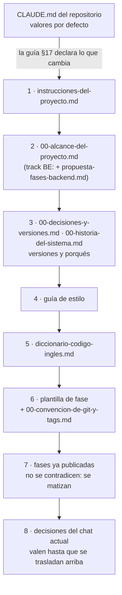

# 🧰 `prompts/` — la maquinaria del curso
## React 16 Legacy — Rifas y chances

Este directorio no es material del curso: es **lo que se usó para escribirlo** y lo que hace falta
para tocarlo sin romperlo. No viaja cuando el curso se publica en su propio repositorio. Quien vaya
a editar una fase lo lee entero antes de teclear la primera línea.

> **Estado:** contenido completo y cerrado el 05/10/2026: 12 fases, 13 apéndices, el track BE
> opcional (10 fases y 10 apéndices) y los dos cuadernos de incidentes (20 y 16). Revisado ese día
> contra los lineamientos de producción del repositorio (guía §17): el curso ya no cita esta
> carpeta y los dos verificadores salen en cero. **Queda** revalidarlo ejecutándolo, según
> [`_desechable-plan-de-validacion.md`](_desechable-plan-de-validacion.md), y elegir la licencia
> antes de publicarlo.

---

## 📖 Qué hay aquí, y cuándo se lee

| Documento | Qué es | Cuándo se lee |
|---|---|---|
| [`instrucciones-del-proyecto.md`](instrucciones-del-proyecto.md) | el marco común, condensado para pegar al abrir una sesión | al abrir cualquier sesión |
| [`guia-de-estilo-y-convenciones.md`](guia-de-estilo-y-convenciones.md) | cómo se escribe; checklist en §14, track BE en §16, excepciones y Mermaid en §17 | en cada sesión, siempre |
| [`../00-decisiones-y-versiones.md`](../00-decisiones-y-versiones.md) | **publicado**, en la raíz del curso desde el 05/10/2026: las versiones congeladas y las decisiones D1–D29 con su porqué | cada vez que aparece una versión, un puerto o una `Dnn` |
| [`diccionario-codigo-ingles.md`](diccionario-codigo-ingles.md) | el dominio en español → los identificadores en inglés | cada vez que hace falta un nombre de código |
| [`propuesta-fases-backend.md`](propuesta-fases-backend.md) | el encuadre del track BE: qué deuda cobra cada fase, horas, versiones | antes de tocar una fase `be*` o un apéndice `bea-*` |
| [`plantilla-de-fase.md`](plantilla-de-fase.md) | el esqueleto de nueve secciones | al empezar y al cerrar una fase |
| [`plantilla-de-incidente.md`](plantilla-de-incidente.md) y [`plantilla-de-incidente-be.md`](plantilla-de-incidente-be.md) | el formato de un enunciado de cada cuaderno | al tocar un incidente |
| [`preparaciones-de-incidentes.md`](preparaciones-de-incidentes.md) y [`preparaciones-de-incidentes-be.md`](preparaciones-de-incidentes-be.md) | el estado roto de cada rama `incidente/NN` | al tocar un incidente; nunca se enlaza desde los cuadernos |
| `prompts-a-*.md`, `prompts-b-*.md`, `prompts-backend-*.md` | los prompts con que se escribió cada fase y cada apéndice | solo como registro: si contradicen a una fase publicada, gana la fase |
| [`_desechable-plan-de-validacion.md`](_desechable-plan-de-validacion.md) | las tandas de ejecución para revalidar el curso | en la sesión de revalidación; se borra cuando termine |
| [`verificar-corpus.py`](verificar-corpus.py) y [`verificador_base.py`](verificador_base.py) | las validaciones base de los lineamientos y las propias del curso | al cerrar cualquier edición |

Lo que en otros cursos son documentos aparte —propuesta de fases del track base, contrato de nombres,
plan de producción— aquí son secciones de otros documentos o no existen porque el curso ya está
escrito. La guía §17.2 dice qué hace el papel de cada uno.

**Orden de autoridad**, cuando dos se contradicen (guía §12):



> 🧭 **Si una contradicción aparece al editar, se arregla primero en el documento de arriba.**
> Parchear la fase y dejar la guía desactualizada es como empiezan las divergencias que nadie ve
> hasta que un lector las encuentra.

---

## 🚀 Cómo abrir una sesión de edición

El curso está escrito y bajo bloqueo de contenido: no se renombran fases ni se reestructuran
capítulos. Lo que sí se hace es corregir, matizar y agregar sin renumerar.

1. Pega `instrucciones-del-proyecto.md` y lee la guía entera, con especial atención a §4 (idioma del
   código), §8 (plantilla y tag), §9 (ejercicios), §16 si la edición es del track BE y §17 (lo que
   este curso hace distinto del repositorio).
2. Si la edición toca una versión o una decisión, lee primero su `Dnn` en `00-decisiones-y-versiones.md`.
3. Edita. Todo diagrama nuevo va en Mermaid (guía §17.1).
4. Al cerrar, desde la raíz del curso:

   ```bash
   python3 prompts/verificar-corpus.py
   python3 prompts/verificar-corpus.py --publicacion
   ```

   - Los dos salen en **0 errores y 0 avisos**; un aviso `DIAGRAMA` es un bloque de texto que
     dibuja algo que va en Mermaid.
   - El segundo agrega lo que exige el repositorio público: nada que enlace ni nombre `prompts/`, ni
     que cite material privado. Las citas a «la guía» sin nombre de archivo no las ve: se buscan a
     mano (guía §17.3).

---

## 🪦 Lo que cambió al revisar

- **05/10/2026.** Revisión contra los lineamientos del repositorio, solo sobre esta carpeta. La guía
  ganó §17 (excepciones, D-12 Mermaid, qué hace el papel de cada plantilla, verificación y lo que
  falta para cerrar) y dos casillas en el checklist de §14; §10.2 dejó de recomendar Playwright,
  que ninguna fase usa, en favor de Cypress (D6). `instrucciones-del-proyecto.md` dejó de decir
  «tres columnas como máximo» —la guía §3 dice cuatro desde que se corrigió la regla—, cuenta los
  dos cuadernos de incidentes y suma `00-historia-del-sistema.md` a las fuentes de verdad, como la
  guía §12. Las tres plantillas ganaron la regla de diagramas. Se agregaron este README y el
  verificador.
- **05/10/2026, segunda parte: el curso.** Por decisión del autor el curso no cita `prompts/`.
  `decisiones-y-versiones.md` salió de esta carpeta y es ahora `../00-decisiones-y-versiones.md`,
  con D29 y las dos librerías que no se adoptan; los ocho puntos del post-mortem se publicaron en el
  cuaderno de incidentes; el README del curso ganó la tabla de términos del dominio; se corrigieron
  tres anclas, el diagrama de F05 pasó a Mermaid y el curso tiene `.gitignore`. El detalle, en la
  guía §17.4.

---

## ⚠️ Las cuatro cosas que más se rompen al editar

- **Citar `prompts/` desde el curso.** Pasó 81 veces, casi siempre en los 📌 Pendientes y en los
  ejercicios de post-mortem («según la guía §13»). Esta carpeta no se publica (guía §11).
- **Contradecir una versión congelada.** Una versión, un puerto o una librería que no coincide con
  `00-decisiones-y-versiones.md` rompe el `package.json` de referencia, y el lector lo descubre al
  hacer `npm ci` tres fases después.
- **Un identificador en español o un comentario en inglés.** La regla de §4 no tiene excepciones,
  ni en el código legacy más feo, y los nombres tienen que ser los mismos en todas las fases.
- **Tocar el frontend desde el track BE.** El backend se adapta al contrato existente (guía §16.2);
  la única excepción registrada es D27.
