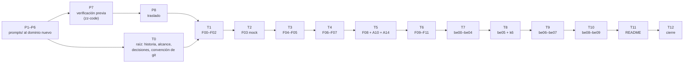

# 🗓️ Plan de edición: tandas, estado y checklist
## Tutorial React 16 — La Esclusa, la consola de Jewel Locks (reescritura de 2026)

Este documento dice **en qué orden se reescribe el curso, cuándo una tanda está terminada y dónde va
la producción**. El curso ya existe completo con el dominio de Rifas y Chances; la reescritura lo
lleva a la rueda de premios de Jewel Locks sin cambiar su estructura. Hay dos fases:

- **La preparación** (tandas `P1`–`P8`) solo toca `prompts/` y el laboratorio de verificación en
  `zz-code/`. No escribe ni una fase.
- **La escritura** (tandas `T0`–`T12`) **edita** lo que se conserva y **crea** lo que cambia de fondo,
  según el grado de cada documento.

Es operativo: **cualquier sesión que retome la reescritura empieza leyendo §3 (estado), §6 (deuda),
§7 (bitácora) y §8 (checklist).**

- **El qué** lo mandan [`../00-historia-del-sistema-v2.md`](../00-historia-del-sistema-v2.md) (hechos,
  reglas, cifras, gente) y [`propuesta-fases-y-alcance.md`](propuesta-fases-y-alcance.md): el grado de
  cada documento, el contrato de nombres (§2), los renombres (§8.1) y las horas (§8.2).
- **La forma** la manda [`guia-de-estilo-y-convenciones.md`](guia-de-estilo-y-convenciones.md).
- **La entrada de cada tanda** es su prompt, en [`prompts-de-reescritura.md`](prompts-de-reescritura.md).
- **El orden** lo manda este documento.

> **Caducidad:** desechable. Reemplaza a `_desechable-plan-de-validacion.md` (V0–V13), que validaba
> el código del dominio viejo y queda superado: la validación por ejecución ahora va dentro de cada
> tanda de escritura (regla 5). **No se cita desde ninguna fase, apéndice ni README.** Al cerrar, su
> resultado pasa a la guía §17 y se borra con permiso del autor.
>
> **Vigencia:** 2026-10-06. Renombrado el 2026-10-07 de `_desechable-plan-de-produccion.md` a
> `_desechable-plan-de-edicion.md`, como los de los otros cursos legacy: el curso ya existe y esto lo
> edita.

**Salto rápido:** [1](#1--las-reglas-de-orden) · [2](#2--qué-es-una-tanda) · [3](#3--estado) · [4](#4--las-verificaciones) · [5](#5--las-tandas-una-por-una) · [5.1](#51--las-pruebas-de-código-tanda-por-tanda) · [6](#6--deuda-de-enlaces-abierta) · [7](#7--bitácora) · [8](#8--checklist-final) · [9](#9--directorios-de-zz-code)

---

## 1. 🧭 Las reglas de orden

Son 22 fases, 25 apéndices (23 que se editan y 2 nuevos), 2 cuadernos (21 + 18 incidentes) y 5
documentos de la raíz. Las tandas van por **dependencia**: cada una deja el curso coherente hasta
donde llega, con el código corrido hasta su última fase.

1. **El contrato de nombres manda desde P2.** Ningún identificador nuevo se inventa en una fase: si
   falta, se agrega primero al diccionario (P5) y después se usa.
2. **Cada tanda reescribe sus fases junto con sus incidentes y sus apéndices.** Un incidente se
   reescribe en la tanda de la fase que lo reserva (tabla de §5), nunca después. Un apéndice, en la
   tanda de la fase que más lo usa.
3. **Ningún enlace interno apunta a un documento que no existe.** Los renombres de §8.1 de la
   propuesta se hacen en la tanda que reescribe el archivo, y en la misma sesión se corrigen todos los
   enlaces que lo nombran (en todo el curso). Lo que no se puede corregir todavía se anota en §6.
4. **Los README (el del curso y el de `prompts/`) se escriben en T11, y ninguna otra tanda los toca.**
   Lo que una tanda querría decir en uno de ellos se anota en §6.
5. **Una fase no se cierra sin haberse corrido entera en contenedor.** El repo del alumno
   (`esclusa-app`, con `server/` desde be01) se construye fase por fase en el directorio de `zz-code/`
   de la tanda, con sus tags. Las salidas que la fase publica son las de esa corrida, fechadas. Lo que
   no se puede correr lleva «no verificado por ejecución» y su casilla *corrida* ⬜. Qué cuenta como
   *corrida* lo dice §2.4; qué corre cada tanda, §5.1. **La regla alcanza a todo bloque tocado**,
   también en los 🟢 y en los apéndices: un renombre en el código es código nuevo hasta que corre.
6. **Ninguna tanda de escritura empieza con su preparación abierta.** T0 exige P1–P6; T1 en adelante
   exigen además P7 (la verificación previa) y P8 (el traslado).
7. **Todo en el hilo principal, secuencial y sin agentes**, salvo que el autor pida lo contrario. **Se
   para al cerrar cada tanda.**
8. **Git lo hace el autor.** Los renombres se hacen con `mv` y los borrados con `rm`, archivo por
   archivo; nunca `git mv`, `git rm` ni borrar directorios. Los tags del **repo de prueba** en
   `zz-code/` sí los crea la sesión; los del repo del curso, ninguno.
9. **La máquina del autor no se toca sin permiso.** Contenedores con `--label curso=react16`, puertos
   altos y aleatorios ligados a `127.0.0.1` (`-p 127.0.0.1::3000`, leído con `docker port`; el curso
   publica 3000, 3001, 3002, 3011 y 5432, la prueba no los usa en el host), inventario de Docker al
   empezar y borrado de lo creado al cerrar, **con sus volúmenes**. Nada de `prune`. Nada se instala en
   el host.
10. **Todo el código de las sesiones va a `zz-code/`**: un directorio por sesión
    (`python3 zz-code/nuevo.py react-16-legacy-for-backend-devs`), registrado en §9. Lo efímero a su
    `salidas/`; los comandos sueltos que producen algo citable, a un archivo; el `README.md` de diez
    secciones al día al cerrar. Ningún documento del curso cita `zz-code/`.
11. **La versión vieja no se edita para "dejarla igual de bien".** Los devs que la están cursando
    siguen con ella desde git. Lo que se descubra de ella al reescribir se anota en §7 y no se arregla.
12. **El repo de prueba pasa de tanda en tanda.** Cada tanda abre su directorio de `zz-code/` y clona
    ahí `esclusa-app` desde el directorio de la tanda anterior (`git clone --branch <último tag>`), con
    todos sus tags y ramas `incidente/*`. §9 dice en qué directorio está el repo vigente; ese directorio
    no se archiva ni se limpia hasta que el siguiente lo clonó.

Las dependencias, en un vistazo:



**Prioridad si el tiempo aprieta:** T0 → T6 dejan el track base completo y utilizable por sí solo,
que es lo que toman los devs nuevos primero. El track BE (T7–T10) puede esperar: mientras tanto, el
README del curso lo declara "en reescritura" (T11 lo escribe así si hace falta).

---

## 2. 📦 Qué es una tanda

### 2.0 Una tanda de preparación

Un documento de `prompts/`, o un paso que lo deja coherente con los demás. **No crea nada fuera de
`prompts/` ni de `zz-code/`.** Terminada cuando sus enlaces pasan §4 y los documentos que la citan
están al día.

### 2.1 Una tanda de escritura

Un grupo de fases que se enlazan entre sí, con sus incidentes, sus apéndices y su código corrido. La
rutina, igual en todas:

1. Pegar el prompt de la tanda (`prompts-de-reescritura.md`) y seguir su protocolo de tres pasos.
2. Releer la fila de cada documento en la propuesta: **el grado manda el procedimiento** (§2.3).
3. Partir del repo de prueba en el tag de la última fase de la tanda anterior; ejecutar lo que el
   documento manda, en orden, y anotar —el error antes de arreglarlo, literal—; después escribir.
4. Escribir en el orden en que los documentos se enlazan: fase → sus incidentes → sus apéndices.
5. Renombrar los archivos de §8.1 que toque la tanda y corregir sus enlaces en todo el curso.
6. Resolver la deuda de §6 que la tanda cierra.
7. Correr las verificaciones de §4.
8. Actualizar §3, §6, §7 y §8, con los tags del repo de prueba en la bitácora.

### 2.2 Peso de cada tanda

```text
ligera   T0 · T1 · T11 · T12            renombre y documentos de la raíz
normal   T6 · T7 · T10                  ejemplos nuevos sobre lo que ya corre
densa    T2 · T3 · T4 · T5 · T8 · T9    reescritura de fondo, código nuevo, mediciones
```

Las **densas** llevan la verificación de versiones y de recursos antes de escribir una línea, anotada
con fecha.

### 2.3 El procedimiento según el grado

| Grado | Procedimiento |
|---|---|
| 🟢 **Renombre** | Se edita en el lugar. Primero el contrato de nombres sobre el código; después la prosa **línea por línea**, mirando el género (*la rifa* → *la rueda*, pero *el número* → *el segmento / el envío / el giro* según el caso) y los ejemplos numéricos (`0347`, `$500.000`, `5000`). Nunca un buscar y reemplazar a ciegas: se usa `grep` para encontrar, no para cambiar. |
| 🟡 **Ejemplo nuevo** | Se edita sección por sección. Se conserva el encabezado, el concepto, la pieza forense y los ejercicios que no dependen del caso; se reescriben el código, el caso y los ejercicios que sí. El número de ejercicios queda en la banda de la guía §9. |
| 🔴 **Reescritura de fondo** | Se **crea** sobre el esqueleto de la plantilla de nueve secciones, con la fase vieja abierta al lado solo como fuente de concepto, de pieza forense y de errores comunes. Ningún párrafo se copia sin releerlo contra la historia v2. |
| ➕ **Nuevo** | Se crea desde la plantilla (fase, apéndice o incidente). |

### 2.4 Qué cuenta como *corrida*

Lo hereda del viejo `_desechable-plan-de-validacion.md` (V0–V13), que esta reescritura absorbe. Un
documento está **corrido** cuando pasa, en este orden, lo que le aplica:

1. **Versiones.** Lo que se instala coincide con `00-decisiones-y-versiones.md` (§4 qué instala cada
   fase, §7.2 el `go.mod`), y el `package.json` y el `go.mod` del repo de prueba al cerrar la fase
   coinciden con los de referencia en lo que ya debería estar.
2. **Comandos.** Cada bloque que el lector ejecuta se copia del documento tal cual —extraído del `.md`
   con un script, no retipeado— y corre; su salida coincide con la publicada, salvo lo que cambia
   entre corridas (rutas, tiempos, hashes, ids), que se compara en forma.
3. **El checklist de la sección 2** de la fase se cumple y el tag `fase-…` se pone con `git status`
   limpio.
4. **La prueba de fuego** y **la pieza forense** se reproducen como las cuenta la fase. Las que se
   miran en el navegador (React DevTools, Redux DevTools, la pestaña Network) no se automatizan: el
   autor las verifica a mano contra el contenedor, con la lista de pasos que deja la tanda, y quedan
   «verificado a mano» con fecha.
5. **Los errores provocados a propósito** salen con el mensaje literal que publica el documento.
6. **Ejercicios.** No se resuelven todos: se ejecutan los que el documento da por reproducibles (los
   «rompe a propósito y observa») y se comprueba que el criterio de éxito de cada 🔴 es medible con
   lo que el repo de prueba tiene.
7. **Incidentes.** La rama `incidente/NN` (o `incidente/be-NN`) se crea desde el tag que nombra su
   preparación, con los datos y el `CHAOS_LEVEL` que pide, y **reproduce el síntoma del enunciado**;
   la corrección que el cuaderno da por buena lo quita, y la suite de la fase sigue en verde. El 21 no
   termina en commit (DR-03): basta con que el síntoma se vea en el dashboard y el diagnóstico se
   pueda hacer con lo que el repo trae.
8. **Track BE.** La regla que lo ordena: `git diff pre-backend-go..HEAD -- . ':!server'` vacío, con la
   excepción de `src/api/authService.js` desde be04 (D27).

---

## 3. 📊 Estado

Leyenda: ⬜ pendiente · 🟡 en curso · ✅ terminada y verificada.

| Tanda | Entrega | Edita | Crea | Peso | Estado |
|---|---|---|---|---|---|
| **P1** | Historia v2 | — | 1 | — | ✅ |
| **P2** | Propuesta: inventario, contrato de nombres, DR-01–DR-06 | — | 1 | — | ✅ |
| **P3** | Este plan y `prompts-de-reescritura.md` | — | 2 | — | ✅ |
| **P4** | Guía de estilo al dominio nuevo; §17.5 *La reescritura de 2026* | 1 | — | — | ⬜ |
| **P5** | Diccionario del código con el contrato de nombres nuevo | 1 | — | — | ⬜ |
| **P6** | Instrucciones del proyecto, plantillas de fase e incidente, preparaciones de incidentes; los prompts viejos a `_desechable-` | 7 | — | — | ⬜ |
| **P7** | Verificación previa en `zz-code/`: imágenes, versiones, k6, el giro ingenuo medido, `oddsAudit`, la trampa de `math/rand`; CRA 4, Cypress, cgo, pipeline y lista a mano | — | hallazgos | densa | ⬜ |
| **P8** | Traslado de los hallazgos a la propuesta, la guía y el diccionario | 3 | — | — | ⬜ |
| **T0** | Raíz: historia (reemplazo), alcance, decisiones y versiones, convención de git | 3 | 1 | ligera | ⬜ |
| **T1** | F00–F02 🟢 · incidentes 01–06 · A1–A5 | 11 | — | ligera | ⬜ |
| **T2** | F03 🔴 · incidentes 07–08 · A9 | 2 | 1 | densa | ⬜ |
| **T3** | F04 🟡 · F05 🔴 · incidentes 09–12 · A6 | 2 | 1 | densa | ⬜ |
| **T4** | F06 🟡 · F07 🔴 · incidentes 13–17 · A7 · A11 | 3 | 1 | densa | ⬜ |
| **T5** | F08 🔴 · A10 🟡 · A14 ➕ · incidente 18 | 1 | 2 | densa | ⬜ |
| **T6** | F09 🟡 · F10 🟢➕ · F11 🟢➕ · incidentes 19–21 · A8 · A12 · A13 · secciones generales del cuaderno base | 7 | 1 inc. | normal | ⬜ |
| **T7** | be00 🟡 · be01 🟢 · be02 🟡 · be03 🟡 · be04 🟢 · incidentes be-01–be-08 · bea-01 · bea-03 · bea-04 · bea-07 · bea-08 | 10 | — | normal | ⬜ |
| **T8** | be05 🔴➕ · bea-05 · bea-10 · bea-11 ➕ · incidentes be-09, be-10, be-17 ➕ | 2 | 2 + 1 inc. | densa | ⬜ |
| **T9** | be06 🟡➕ · be07 🔴➕ · bea-06 · incidentes be-11–be-14, be-18 ➕ | 2 | 1 + 1 inc. | densa | ⬜ |
| **T10** | be08 🟢➕ · be09 🟢 · bea-02 · bea-09 · incidentes be-15, be-16 · secciones generales del cuaderno BE | 4 | — | normal | ⬜ |
| **T11** | README del curso y README de `prompts/` | 2 | — | ligera | ⬜ |
| **T12** | Cierre: verificación global, restos del dominio viejo, borrados con permiso, guía §17 | — | — | ligera | ⬜ |

> 🚦 **Dónde está la producción (06/10/2026).** La historia v2, la propuesta y este plan están
> cerrados. Sigue **P4**. Ninguna fase se ha tocado todavía.

**Total:** 22 fases (6 🔴, 7 🟡, 9 🟢), 25 apéndices (2 nuevos), 39 incidentes (3 nuevos), 5
documentos de la raíz y 2 README.

---

## 4. 🔍 Las verificaciones

Se corren al cerrar cada tanda, y todas en T12, desde la raíz del curso.

**El verificador del curso**, en cero:

```bash
python3 prompts/verificar-corpus.py
python3 prompts/verificar-corpus.py --publicacion
```

**Restos del dominio viejo**, en los documentos que la tanda ya cerró (el resto, todavía no):

```bash
grep -rn -i -E "rifa|raffle|loter[ií]a|lottery|vendedor|kiosco|tesorer|chance|Bogot|\bpesos\b|\bCOP\b|0347" \
  --include='*.md' . | grep -v '^./prompts/'
```

- Al cerrar T12, vacío salvo las menciones deliberadas (si las hay, se listan en la guía §17.5).

**Ningún documento publicado cita `prompts/`, un desechable ni `zz-code/`:**

```bash
grep -rln "_desechable-\|prompts/\|zz-code" --include='*.md' . | grep -v '^./prompts/'   # vacío
```

**Ningún README cambió fuera de T11** (solo lectura: git lo maneja el autor):

```bash
git status --short -- README.md prompts/README.md    # fuera de T11, vacío
```

**Cantidad de ejercicios por fase** (banda de la guía §9):

```bash
for f in [0-9][0-9]-*.md be[0-9][0-9]-*.md; do
  printf '%-50s %s\n' "$f" "$(awk '/^## 🧪/{f=1;next} /^## /{f=0} f' "$f" | grep -cE '^[0-9]+\. ')"
done
```

**Codificación sana**, después de cualquier sustitución:

```bash
grep -rl "Ã\|â€" --include='*.md' .    # vacío
```

**Los enlaces a archivos renombrados**: el verificador los cubre; además, ninguna mención en prosa del
nombre viejo:

```bash
grep -rn "04-rifas-crud\|05-venta-de-numeros\|07-cierre-polling-resultado\|08-liquidacion-calculo-premio\|be05-venta-concurrente\|be07-liquidacion-dinero\|historia-del-sistema-v2" --include='*.md' . | grep -v '^./prompts/'
```

**El repo de prueba** (en el directorio de `zz-code/` de la tanda): `git tag -l 'fase-*'` muestra los
tags de las fases cerradas con los nombres de §8.1 de la propuesta, y la suite hasta ahí pasa:

```bash
git tag -l 'fase-*'; git branch -l 'incidente/*'                 # lo cerrado, con nombres de §8.1
docker run --rm --label curso=react16 -v "$PWD":/app -w /app node:14.21.3-bullseye \
  sh -c 'npm ci && CI=true npm test -- --watchAll=false'          # suite del frontend en verde
git diff --stat pre-backend-go..HEAD -- . ':!server' ':!src/api/authService.js'   # desde T7, vacío
```

Desde T7 se suma `go test ./...` dentro de `golang:1.19.13` contra un `postgres:13` de la tanda (y
`-race` donde la fase lo pide). Las pruebas propias de cada tanda están en §5.1.

---

## 5. 📦 Las tandas, una por una

Lo que cada documento cambia está en su fila de la propuesta; lo que cada sesión vigila, en su
prompt. Aquí va **por qué la tanda va en ese lugar y cuándo está terminada.**

### P4 a P6 — `prompts/` al dominio nuevo

La guía, el diccionario, las instrucciones, las plantillas y las preparaciones de incidentes hablan
hoy de rifas. Se reescriben **antes** de cualquier fase porque son las fuentes de verdad que los
prompts citan.

- **P4 · Guía.** El dominio en §4.3 y §5.5, los ejemplos de §6–§9, §13 con los incidentes nuevos, §16
  con k6, y una **§17.5 La reescritura de 2026** que declara la excepción: versión nueva, renombres
  (DR-05), horas (DR-06) y que las fases 🔴 se crean sobre su esqueleto.
- **P5 · Diccionario.** `diccionario-codigo-ingles.md` adopta el contrato de nombres de la propuesta
  §2, completo: entidades, rutas del API, slices, epics, tablas, estados y los nombres de los
  personajes como usuarios.
- **P6 · El resto.** `instrucciones-del-proyecto.md` (fuentes de verdad con la historia v2 y la
  propuesta), las tres plantillas, las dos preparaciones de incidentes (con las ramas `incidente/NN` del
  dominio nuevo y las de 21, be-17 y be-18), y los `prompts-a-*`, `prompts-b-*` y `prompts-backend-*`
  **renombrados a `_desechable-`**: son el registro de cómo se escribió la versión vieja y ya no son la
  entrada de ninguna sesión. Y `verificar-corpus.py`: el patrón del encabezado de fase (hoy
  «Tutorial React 16 — Rifas y chances») pasa al título nuevo, y el error propio `CITA-PROMPTS` suma
  `zz-code/`. `propuesta-fases-backend.md` se conserva y se marca superada en lo que la
  propuesta nueva cambia.

**Terminadas cuando** ningún documento vigente de `prompts/` nombra el dominio viejo salvo como
historia, y los enlaces entre ellos pasan el verificador.

### P7 — Verificación previa

**Entrega:** un directorio de `zz-code/` con su README y `hallazgos.md` (`H1`, `H2`…). Es densa
porque decide lo que las fases van a medir. **Qué se verifica:**

- Que siguen corriendo las imágenes congeladas: `node:14.21.3`, `golang:1.19.13`, `postgres:13`, y
  qué variante tienen para `linux/arm64`.
- La versión de `grafana/k6` que se fija para el curso (DR-04), con su fecha.
- **El giro ingenuo de 2019**, escrito como lo describe la historia, sobre Express y PostgreSQL 13,
  atacado con k6 a la escala del laboratorio: cuántos dobles premios y cuánto stock excedido produce.
  Esas cifras son las que F03, be00 y be05 van a reproducir.
- **El giro transaccional** (idempotencia, descuento condicional, stock con actualización
  condicional), con la misma carga: cero duplicados y el costo en latencia.
- **`oddsAudit`** sobre una bitácora generada: la banda de ±3σ y el chi-cuadrado con la rueda honesta
  y con la rueda que se acomoda (que tiene que dar alarma).
- **La trampa de Go 1.19**: `math/rand` sin semilla repite la secuencia entre reinicios; con
  `golang:1.20` no. Y que `oddsAudit` no lo detecta.
- El mock de Google Play: que un pago en efectivo pendiente se puede modelar con json-server más una
  ruta Express, como F07 va a necesitar.

Y lo que el viejo plan de validación dejaba para su V0, porque bloquea tandas enteras si falla tarde:

- **CRA 4 hoy.** `npx create-react-app@4.0.3 esclusa-app --use-npm` dentro de `node:14.21.3`, con
  npm 6: que sigue bajando y que, tras fijar las versiones de F00, queda React 16.14.0. Si
  `node:14.21.3` no tiene `linux/arm64`, se corre con `--platform linux/amd64` y la emulación se anota
  (cambia tiempos y algún mensaje). F00 §5.3 (el caso nativo en macOS) se valida contra la
  documentación, no en contenedor.
- **Cypress 10.11.0** (F10): qué imagen oficial existe para esa versión y arquitectura
  (`cypress/included:10.11.0` u otra). Si no hay forma sin instalar nada en el host, el smoke de F10
  queda «no verificado por ejecución» desde ya, y T6 lo sabe.
- **`mattn/go-sqlite3` con cgo** en `golang:1.19.13` para `linux/arm64` (D19), y `golang-migrate`
  v4.15.2 (D20): que compilan y corren en contenedor.
- **El pipeline de be09** (D23): no se puede correr sin repositorio ni runner. Se fija cómo se valida:
  los mismos comandos del workflow dentro de `golang:1.19.13` y `postgres:13`, y el YAML con
  `actionlint` desde su imagen oficial con versión fijada (nada en el host).
- **La lista de verificación a mano**: qué piezas forenses de F01–F11 se miran en DevTools y cómo las
  va a revisar el autor (puerto, usuario, pasos). Cada tanda la completa con las suyas.

**Terminada cuando** todo tiene un hallazgo con fecha, y lo que no funciona tiene alternativa decidida.

### P8 — Traslado

Los hallazgos de P7 pasan a la propuesta (cifras esperadas por fase), a la guía (versiones) y al
diccionario (nombres que aparecieron al prototipar). Las decisiones nuevas que tengan forma de `Dnn`
se anotan para T0.

### T0 — La raíz

- `00-historia-del-sistema-v2.md` **reemplaza** a `00-historia-del-sistema.md` (`rm` de la vieja, `mv`
  de la nueva) y se corrigen sus enlaces.
- `00-alcance-del-proyecto.md`: §1, §2, §5 (el dominio de la rueda, con su diagrama de estados en
  Mermaid), §6–§10 con las horas de DR-06.
- `00-decisiones-y-versiones.md`: D28 → *el giro se modela como hecho*; D29 → zona de Panamá; las
  decisiones nuevas del traslado (pesos en puntos básicos, protección de duplicados, bitácora de solo
  inserción, aleatorio, k6, mock de Google Play), numeradas desde D30; el `package.json` y el `go.mod`
  de referencia con los nombres nuevos; puertos (3002 = mock de Google Play).
- `00-convencion-de-git-y-tags.md`: los tags de §8.1 de la propuesta, `esclusa-app`, los ejemplos.

**Terminada cuando** los cuatro documentos hablan el dominio nuevo, sus pruebas de §5.1 pasan, y
ninguna fase todavía lo hace (es esperado: §4 *restos* solo se mira sobre lo cerrado).

### T1 a T6 — El track base

| Tanda | Fases | Incidentes (por la fase que los reserva) | Apéndices | Por qué aquí |
|---|---|---|---|---|
| T1 | F00, F01, F02 | 01–06 | A1, A2, A3, A4, A5 | Renombre puro: calienta el contrato de nombres antes de lo difícil |
| T2 | F03 | 07, 08 | A9 | El mock es la base de todo lo que sigue: el giro ingenuo, el mock de Google Play y el generador de tráfico tienen que correr antes de F04 |
| T3 | F04, F05 | 09–12 | A6 | El CRUD de ruedas habilita los envíos; F05 es el ⭐ que más cambia |
| T4 | F06, F07 | 13–17 | A7, A11 | Las épicas de F06 se apoyan en los envíos de F05; F07 en el mock de Google Play de F03 |
| T5 | F08 | 18 | A10, A14 | La conciliación necesita compras (F07) y una bitácora con volumen (F03) |
| T6 | F09, F10, F11 | 19, 20, 21 | A8, A12, A13 | El dashboard muestra la conciliación; F10 prueba todo lo anterior; F11 cierra con el horizonte de dos años. Aquí se reescriben también las secciones generales del cuaderno base (*Entrar por el síntoma*, los ocho puntos del post-mortem, la retrospectiva) |

**Cada una terminada cuando** sus fases están escritas **y corridas** (§2.4) en el repo de prueba con
su tag, sus incidentes reescritos con su preparación al día en `preparaciones-de-incidentes.md` y su
rama reproduciendo el síntoma, sus apéndices editados con su código corrido, las pruebas de su fila
en §5.1 pasadas, y §4 limpia sobre lo cerrado.

### T7 a T10 — El track BE

| Tanda | Fases | Incidentes | Apéndices | Por qué aquí |
|---|---|---|---|---|
| T7 | be00–be04 | be-01–be-08 | bea-01, bea-03, bea-04, bea-07, bea-08 | Contrato, Go, tablas nuevas, CRUD y el reemplazo, JWT: lo que el giro necesita debajo |
| T8 | be05 | be-09, be-10, be-17 | bea-05, bea-10, **bea-11** | El corazón: el giro concurrente medido con k6. bea-11 se escribe aquí porque be05 es su primer uso |
| T9 | be06, be07 | be-11–be-14, **be-18** | bea-06 | El reloj (giro gratis cada 4 h) y las compras con la conciliación en SQL; ambas suponen el giro transaccional de be05 |
| T10 | be08, be09 | be-15, be-16 | bea-02, bea-09 | Las pruebas (con el nivel de carga y la prueba estadística) y el empaquetado cierran sobre todo lo anterior. Aquí se reescriben las secciones generales del cuaderno BE |

**Cada una terminada cuando** el backend corre en el repo de prueba con el frontend de T6 sin tocar
(salvo D27), sus incidentes y apéndices están reescritos y corridos (§2.4), las pruebas de su fila en
§5.1 pasan, y §4 limpia.

### T11 — Los README

El README del curso (tablas de fases y apéndices con los nombres nuevos, horas de DR-06, el sistema
de Jewel Locks, la tabla de términos del dominio) y el de `prompts/` (el estado real, este plan como
historia). Salda la deuda de §6 dirigida a T11.

### T12 — Cierre

§4 limpia en todo el curso; la **corrida de regresión** de §5.1; guía §17.5 con el resultado (qué se
corrió, con qué, cuándo, y qué quedó «no verificado por ejecución» o «verificado a mano»); el viejo
`_desechable-plan-de-validacion.md` y este plan, borrados con permiso del autor; memoria al día.

---

## 5.1 🧪 Las pruebas de código, tanda por tanda

Lo que §2.4 exige a todo documento corrido, más lo que cada tanda tiene de propio. Las cifras que un
documento publica salen de **estas** corridas, fechadas, con P7 como referencia de lo esperado. Todo
corre en contenedor y se apunta en el `README.md` del directorio de `zz-code/` de la tanda, con sus
comandos en orden. Lo marcado **(a mano)** lo revisa el autor en su navegador contra el contenedor,
con los pasos que la tanda le deja.

**T0 — La raíz**

- El `package.json` de referencia (con `esclusa-app`) resuelve en `node:14.21.3` con npm 6
  (`npm install --package-lock-only --ignore-scripts`), sin conflictos de dependencias pares.
- El `go.mod` de referencia descarga y verifica en `golang:1.19.13` (`go mod download && go mod verify`).
- La secuencia de tags de `00-convencion-de-git-y-tags.md` con los nombres de §8.1 corre en un repo
  vacío de prueba, `git diff pre-backend-go..` incluido.
- El `stateDiagram-v2` del alcance §5 parsea (el verificador, o `mermaid-cli` en contenedor con
  versión fijada).

**T1 — F00–F02 🟢**

- F00: el proyecto nace con CRA 4 como dice P7; las versiones fijadas; `npm start` responde en un
  puerto aleatorio; `npm run build` pasa; dart-sass compila; `WheelCard` renderiza. Los errores
  provocados, literales.
- F01: `/wheels`, `/wheels/:id`, el 404 y los dos placeholders (*Jugadores*, *Bitácora*); `withRouter`
  y la versión con hooks dan lo mismo. Pieza forense **(a mano)**.
- F02: login con `ibatista`, `ypinzon` y `mdegracia` contra el `db.json`; los interceptors ponen token
  y `requestId`; el 401 redirige; la deuda de persistencia se observa (recargar pierde la sesión) y
  cualquier usuario puede enviar giros.
- Incidentes 01–06: cada rama reproduce su síntoma y su corrección lo quita.
- A1 y A2: el SCSS (mixins de segmento, premio y estado del envío) compila con dart-sass. A3 y A4: sus
  comandos corren en el repo de prueba; lo que lo muta (como `eject`) va en una copia descartable. A5:
  los ejemplos de clase y de hooks renderizan lo mismo en una prueba con RTL.

**T2 — F03 🔴**

- El mock en contenedor: json-server con Express en el 3001 y el mock de Google Play en el 3002 (en el
  host, puertos aleatorios); el `db.json` nuevo carga; cada nivel de `CHAOS_LEVEL` produce lo que la
  fase dice; los pagos de deuda #1 y #2; la prueba de fuego.
- **El giro ingenuo bajo `scripts/traffic.js`** produce dobles premios y stock excedido en el rango que
  dio P7 a esa escala. La cifra que F03 publica es la de esta corrida.
- **El mock de Google Play**: verificación correcta, compra pendiente que se confirma tras una demora
  configurable, y notificación duplicada que llega dos veces.
- Incidentes 07–08. A9: sus comandos de entornos y contenedores.

**T3 — F04 🟡 y F05 🔴**

- F04: la validación de pesos con casos de borde (suma 9.999 y 10.001, no enteros, negativos, cero);
  una rueda `live` no deja editar pesos, ni en la consola ni en el mock; la respuesta malformada y el
  error legible. Time-travel **(a mano)**.
- F05: cada transición de `queued → sending → sent / failed → reverted`; la ventana de deshacer de
  10 s, con temporizadores falsos de Jest y **(a mano)**; dos operadores compensan el mismo caso y la
  doble compensación se reproduce (la que cobra el 11); el envío masivo que falla a medias revierte lo
  suyo y nada más; **el problema de render del tablero**, medido con miles de filas: la cifra
  publicada sale de aquí. Pieza forense de la race en el store **(a mano)**.
- Incidentes 09–12; el 11 ⭐ y el 12 con sus ramas nuevas.
- A6: los ejemplos de Redux clásico y de Toolkit corren sobre `grantSlice`.
- Los tags `fase-04-ruedas-crud` y `fase-05-envios-manuales` existen.

**T4 — F06 🟡 y F07 🔴**

- F06: una prueba de canicas (`rxjs-marbles` 6.0.1) por épica: `undoWindowEpic`; `sendGrantEpic` (el
  doble clic da un solo envío con `exhaustMap`); `searchPlayerEpic` (la respuesta vieja se descarta);
  `retryGrantEpic`; `cancelOnLogoutEpic`. **El memory leak provocado se observa**: peticiones que
  siguen tras el logout, contadas.
- F07: con el reloj fijado, un envío a una rueda `ended` se rechaza en el instante del cierre; el
  polling de compras pendientes con `timer`; la diferencia entre `switchMap` y `mergeMap`, observable;
  un tick con 500 no mata el polling (`catchError` por tick).
- Incidentes 13–17; el 14 ⭐: tras el logout no sale ni una petición más.
- A7: cada ejemplo de operador corre sobre una épica que existe. A11: sus pruebas de canicas pasan.
- El tag `fase-07-cierre-polling-compras` existe.

**T5 — F08 🔴➕, A10, A14 y el 18**

- F08: `oddsAudit` con pruebas unitarias en enteros, sobre bitácoras generadas con semilla fija en el
  repo de prueba: la rueda honesta no da alarma y la que se acomoda sí. El prorrateo de 20,99/500
  reparte exactamente 2.099 centavos entre 500 giros con `prizeShare` (ni un centavo perdido); la
  comisión de la tienda; `ended → reconciled` no tiene vuelta atrás.
- A10: cada ejemplo numérico (el prorrateo, los micros de los reportes de anuncios, la migración desde
  `float`) se recalcula en contenedor.
- A14: cada número —la σ de la binomial con los pesos de la rueda de la historia, la banda de ±3σ, el
  valor crítico de chi-cuadrado que se da hecho, la muestra para el segmento raro— se recalcula con un
  script; una simulación confirma la tasa de falsas alarmas que el apéndice promete para la banda.
- Incidente 18: el centavo de diferencia se reproduce y la corrección lo quita.
- El tag `fase-08-conciliacion` existe.

**T6 — F09–F11 y el cuaderno base**

- F09: los selectores derivados, con pruebas unitarias; el gráfico de la banda con chart.js 2.9.4
  **(a mano)**: jsdom no pinta un `canvas`; la pieza forense de `useMemo` **(a mano)**, con el Profiler.
- F10: **la suite completa del track base en verde** con `CI=true`. La sección ➕: la prueba sembrada
  corre 50 veces seguidas sin fallar ni una, y la tolerancia calculada falla con la rueda que se
  acomoda. El smoke de Cypress, como haya dicho P7.
- F11: el tag `pre-modernizacion`; `WheelTable` a hooks con la suite en verde antes y después; los
  ejemplos de RxJS 7 y React 17/18 del puente, en una copia descartable.
- Incidente 19: el dashboard lento con el volumen de la Semana del Canal, medido. Incidente 21: con la
  rueda que se acomoda activa en el mock, el dashboard muestra el 2 % contra el 0,5 % configurado, y el
  diagnóstico se puede hacer con lo que el repo trae (sin commit, DR-03). Incidente 20.
- A8: sus ejemplos, en la misma copia descartable que F11. A13: `npm run build` con source maps y la
  depuración del build de producción, paso a paso. A12 no tiene código.

**T7 — be00–be04**

- be00: `smoke.sh` pasa contra el mock de T2, y los hallazgos del contrato (el giro sin idempotencia,
  el stock que se descuenta después) se reproducen con `curl`.
- be01: compila en `golang:1.19.13`; `GET /health` da 200 con base y 503 sin ella (D26).
- be02: las migraciones de PostgreSQL y de SQLite suben y bajan con `golang-migrate`; las tablas
  nuevas existen con los nombres del diccionario; la prueba que pasa en SQLite y falla en PostgreSQL
  (D18) sigue fallando donde debe; el binario de producción no lleva el driver de SQLite (D19).
- be03: el CRUD de ruedas y jugadores y la siembra; **el momento 🪦**: la consola de T6 contra Go en el
  3011 y después en el 3001, sin tocarla; `smoke.sh` pasa contra Go.
- be04: bcrypt; el JWT con `dgrijalva/jwt-go` v3.2.0, el CVE demostrado, y la migración a
  `golang-jwt/jwt` v4.4.2 que lo cierra; `authService.js` es la única diferencia del frontend (D27).
- Incidentes be-01–be-08. bea-01, bea-03, bea-04, bea-07 y bea-08: su código corre (bea-03 en los dos
  dialectos).

**T8 — be05 🔴➕, bea-05, bea-10, bea-11**

- be05: **las tres carreras**, con `go test -race` y con k6 (`grafana/k6` fijado en P7): la misma
  clave de idempotencia da un solo giro; el saldo nunca queda negativo; el stock nunca se excede.
  Pesimista contra optimista, medido con `constant-arrival-rate`; las cifras publicadas salen de esta
  corrida. La bitácora rechaza `UPDATE` y `DELETE`. El aleatorio sembrado de forma explícita da
  secuencias distintas en dos reinicios.
- Incidente be-17: en la rama, `math/rand` sin semilla en `golang:1.19.13` repite la misma secuencia en
  dos reinicios; la conciliación no lo ve; la corrección lo quita. be-09 (las 1.047 Esclusas de Oro,
  bajo carga) y be-10 (el giro "en proceso" para siempre).
- bea-05: su SQL de concurrencia en `postgres:13` con dos sesiones a la vez. bea-10: el Faker con
  semilla da los mismos datos dos veces. bea-11: cada script de k6 corre, y los tres errores que dan
  números falsos se demuestran.
- El tag `fase-be05-giro-concurrente` existe.

**T9 — be06 🟡➕ y be07 🔴➕**

- be06: el cierre por reloj con el proceso en UTC y Panamá solo de presentación; el giro gratis cada
  4 h con el servidor como autoridad: adelantar el reloj del cliente no da un giro; los jugadores de
  Chile y Paraguay en las fechas de cambio de horario, con la versión de tzdata del contenedor anotada.
- be07: la notificación duplicada acredita una sola vez por `purchaseToken`; giros e ingreso en una
  transacción (si falla a la mitad, no queda nada); la conciliación en SQL
  (`GROUP BY wheel_version, landed_segment`) da lo mismo que `oddsAudit` de F08 sobre la misma
  bitácora; la protección de duplicados con sustituto no repite lo que el inventario ya tiene y, en
  simulación, mantiene las proporciones que promete.
- Incidentes be-11–be-14 y be-18 (el reloj del celular). bea-06: sus ejemplos de zonas y relojes.
- El tag `fase-be07-compras-y-conciliacion` existe.

**T10 — be08, be09 y el cuaderno BE**

- be08: los cinco niveles, la regla del motor y `-race`; la prueba estadística sembrada, 50 veces sin
  fallar; el nivel de carga con k6 y sus `thresholds`.
- be09: la imagen se construye y corre con `postgres:13` en un compose de la tanda; el workflow, con
  `actionlint` y con sus comandos corridos en contenedor, como haya dicho P7.
- Incidentes be-15 ⭐ y be-16. bea-02: la receta (`esclusa-pg`, el *bonus* de `America/Panama`). bea-09
  no tiene código.
- **De extremo a extremo**: la consola de T6 contra el backend completo, con `smoke.sh` y la regla del
  track BE vacía.

**T11 — Los README.** Ningún comando nuevo: los que muestren se copian de fases ya corridas.

**T12 — La corrida de regresión**

- Un clon limpio del repo vigente en un directorio nuevo de `zz-code/`.
- En el tag de cierre de cada tanda (`fase-02…`, `fase-03…`, `fase-05-envios-manuales`,
  `fase-07-cierre-polling-compras`, `fase-08-conciliacion`, `fase-11…`, `fase-be04…`,
  `fase-be05-giro-concurrente`, `fase-be07-compras-y-conciliacion`, `fase-be09…`): `npm ci` y la
  suite; desde be04, `go test ./... -race` contra `postgres:13`.
- El k6 de be05 y el de be08 otra vez, con las cifras comparadas contra las publicadas (en forma y en
  rango, no al milisegundo).
- Las ramas de los incidentes ⭐ y de los nuevos (11, 14, 21, be-09, be-15, be-17, be-18) reproducen
  su síntoma otra vez.
- La regla del track BE, vacía. El inventario de Docker, igual al inicial.

---

## 6. 🧾 Deuda de enlaces abierta

| Origen | Destino pendiente | La cierra |
|---|---|---|
| `prompts/README.md` (~30–35) | Lista `_desechable-plan-de-validacion.md` y dice que el curso no tiene plan: tiene que nombrar este plan | T11 |
| `guia-de-estilo-y-convenciones.md` §17.2 (~1078) | "Plan de producción: no hay" → este plan de edición | P4 |

---

## 7. 📓 Bitácora

**2026-10-06 · P1–P3 cerradas.** Pedido del autor: *"Arma prompt y plan de producción para dejarlo
listo para edición. Ajusta la propuesta de alcance y fases."* Escritos la historia v2 (aprobada:
*"queda lista"*), la propuesta en su variante de reescritura (DR-01–DR-06 cerradas por el autor:
A14 entra, la trampa de Go 1.19 es el incidente be-17, el 21 es del cuaderno base, k6 con bea-11,
renombrar archivos y tags, no más de 10 horas nuevas), este plan y `prompts-de-reescritura.md`.
**Comprobado** (búsquedas del 06/10/2026): Google Play exige publicar probabilidades desde 2019 y
Apple desde diciembre de 2017; pago en efectivo en Google Play con Efecty (Colombia) y OXXO (México),
hasta 48 h; Go 1.20 siembra `math/rand` solo; Unity Personal gratis hasta US$100k en 2017; GameMaker
gratis para uso no comercial recién en noviembre de 2023; "Jewel Locks" e "Interoceanic Games" sin
coincidencias. **Trampas para la próxima sesión:** `00-historia-del-sistema-v2.md` todavía convive con
la vieja (la reemplaza T0); `_desechable-plan-de-validacion.md` queda superado pero no se borra hasta
T12. **Recursos levantados:** ninguno. **`zz-code/`:** nada. **Tags para el autor:** ninguno.
**Siguiente:** P4.

**2026-10-07 · Renombre y pruebas por tanda.** Pedido del autor: *"renombra el desechable del plan de
producción a plan de edición y valida que en las tandas están todas las pruebas de código
necesarias."* Renombrado con `mv` a `_desechable-plan-de-edicion.md`; el enlace de
`prompts-de-reescritura.md` corregido; las dos menciones genéricas (README de `prompts/` y guía
§17.2) quedan en §6. **Contra el viejo plan V0–V13, faltaban:** qué cuenta como *corrida* (versiones,
bloques extraídos, checklist de la fase, prueba de fuego, errores literales, ejercicios
reproducibles, la regla del track BE) → §2.4; **que cada rama de incidente reproduzca su síntoma**
(V7 y V12) → §2.4 punto 7; el código de los apéndices (V6 y V11), que el plan solo daba por
"editados"; los riesgos de V0 (CRA 4 con `npx`, Cypress 10.11.0, cgo, el pipeline sin runner, las
piezas que se miran en DevTools) → P7; cómo pasa el repo de prueba de un directorio de `zz-code/` al
siguiente → regla 12; y una corrida de regresión en T12. Las pruebas propias de cada tanda quedan en
§5.1 y en el checklist de §8; el marco común de `prompts-de-reescritura.md` las cita. **Recursos
levantados:** ninguno. **`zz-code/`:** nada. **Siguiente:** P4.

---

## 8. ✅ Checklist final

Cada documento ejecutable lleva dos casillas: **escrita** y **corrida**.

### Preparación (`prompts/`)

- [x] P1 · `00-historia-del-sistema-v2.md`
- [x] P2 · `prompts/propuesta-fases-y-alcance.md` (variante de reescritura, DR-01–DR-06)
- [x] P3 · este plan y `prompts/prompts-de-reescritura.md`
- [ ] P4 · `prompts/guia-de-estilo-y-convenciones.md` al dominio nuevo, con §17.5
- [ ] P5 · `prompts/diccionario-codigo-ingles.md` con el contrato de nombres
- [ ] P6 · instrucciones, plantillas, preparaciones; prompts viejos a `_desechable-`
- [ ] P7 · Imágenes y variantes arm64 (H-n)
- [ ] P7 · Versión de `grafana/k6` fijada (H-n)
- [ ] P7 · Giro ingenuo medido: dobles premios y stock excedido (H-n)
- [ ] P7 · Giro transaccional medido: cero duplicados y su costo (H-n)
- [ ] P7 · `oddsAudit` con rueda honesta y rueda que se acomoda (H-n)
- [ ] P7 · `math/rand` sin semilla en 1.19 contra 1.20 (H-n)
- [ ] P7 · Mock de Google Play con compra pendiente (H-n)
- [ ] P7 · CRA 4 con `npx` en `node:14.21.3` da React 16.14.0; arm64 o emulación (H-n)
- [ ] P7 · Imagen de Cypress 10.11.0, o el smoke de F10 marcado no verificable (H-n)
- [ ] P7 · `mattn/go-sqlite3` con cgo y `golang-migrate` en `golang:1.19.13` (H-n)
- [ ] P7 · Cómo se valida el pipeline de be09: comandos en contenedor y `actionlint` fijado (H-n)
- [ ] P7 · Lista de verificación a mano (DevTools) para el autor (H-n)
- [ ] P8 · Hallazgos trasladados; §4 limpia sobre `prompts/`

### T0 — La raíz

- [ ] Historia v2 reemplaza a la vieja; enlaces corregidos
- [ ] `00-alcance-del-proyecto.md`
- [ ] `00-decisiones-y-versiones.md` (D28, D29, D30+)
- [ ] `00-convencion-de-git-y-tags.md`
- [ ] Pruebas de §5.1 T0: `package.json`, `go.mod`, tags en repo vacío, Mermaid

### T1 — F00–F02

- [ ] F00 — escrita · [ ] corrida
- [ ] F01 — escrita · [ ] corrida
- [ ] F02 — escrita · [ ] corrida
- [ ] Incidentes 01–06 · preparaciones al día
- [ ] A1, A2, A3, A4, A5
- [ ] Pruebas de §5.1 T1 · ramas 01–06 reproducen · verificación a mano entregada al autor
- [ ] §4 limpia sobre lo cerrado · README de `zz-code/` al día

### T2 — F03

- [ ] F03 — escrita · [ ] corrida (giro ingenuo, mock de Google Play, generador de tráfico)
- [ ] Incidentes 07–08 · A9
- [ ] Pruebas de §5.1 T2: giro ingenuo con sus cifras, mock de Google Play, caos por nivel
- [ ] §4 limpia · README de `zz-code/` al día

### T3 — F04–F05

- [ ] F04 → `04-ruedas-crud.md` — escrita · [ ] corrida
- [ ] F05 → `05-envios-manuales.md` — escrita · [ ] corrida
- [ ] Incidentes 09–12 · A6
- [ ] Pruebas de §5.1 T3: pesos, ventana de deshacer, doble compensación, render medido · a mano
- [ ] Enlaces a los nombres viejos corregidos en todo el curso · §4 limpia

### T4 — F06–F07

- [ ] F06 — escrita · [ ] corrida
- [ ] F07 → `07-cierre-polling-compras.md` — escrita · [ ] corrida
- [ ] Incidentes 13–17 · A7 · A11
- [ ] Pruebas de §5.1 T4: canicas por épica, leak contado, cierre con reloj fijado, polling
- [ ] §4 limpia

### T5 — F08

- [ ] F08 → `08-conciliacion.md` — escrita · [ ] corrida
- [ ] A10 · A14 ➕
- [ ] Incidente 18
- [ ] Pruebas de §5.1 T5: `oddsAudit`, prorrateo exacto, números de A10 y A14 recalculados
- [ ] §4 limpia

### T6 — F09–F11

- [ ] F09 — escrita · [ ] corrida
- [ ] F10 — escrita · [ ] corrida (la suite completa del track base en verde)
- [ ] F11 — escrita · [ ] corrida
- [ ] Incidentes 19, 20, 21 ➕ · secciones generales del cuaderno base
- [ ] A8 · A12 · A13
- [ ] Pruebas de §5.1 T6: suite base en verde, prueba sembrada ×50, Cypress, build con source maps · a mano
- [ ] §4 limpia

### T7 — be00–be04

- [ ] be00 · be01 · be02 · be03 · be04 — escritas · [ ] corridas
- [ ] Incidentes be-01–be-08
- [ ] bea-01 · bea-03 · bea-04 · bea-07 · bea-08
- [ ] Pruebas de §5.1 T7: `smoke.sh` contra mock y Go, migraciones en los dos dialectos, 🪦, CVE, D27
- [ ] §4 limpia

### T8 — be05

- [ ] be05 → `be05-giro-concurrente.md` — escrita · [ ] corrida (medición k6 publicada)
- [ ] bea-05 · bea-10 · bea-11 ➕
- [ ] Incidentes be-09, be-10, be-17 ➕
- [ ] Pruebas de §5.1 T8: tres carreras con `-race` y k6, bitácora inmutable, `math/rand` en dos reinicios
- [ ] §4 limpia

### T9 — be06–be07

- [ ] be06 — escrita · [ ] corrida
- [ ] be07 → `be07-compras-y-conciliacion.md` — escrita · [ ] corrida
- [ ] bea-06
- [ ] Incidentes be-11–be-14, be-18 ➕
- [ ] Pruebas de §5.1 T9: reloj del cliente, horario de verano, `purchaseToken`, SQL = `oddsAudit`
- [ ] §4 limpia

### T10 — be08–be09

- [ ] be08 · be09 — escritas · [ ] corridas
- [ ] bea-02 · bea-09
- [ ] Incidentes be-15, be-16 · secciones generales del cuaderno BE
- [ ] Pruebas de §5.1 T10: niveles, carga con `thresholds`, imagen, `actionlint`, extremo a extremo
- [ ] §4 limpia

### T11 — Los README

- [ ] `README.md` del curso
- [ ] `prompts/README.md`
- [ ] Deuda de §6 dirigida a T11, saldada

### T12 — Cierre

- [ ] §4 limpia en todo el curso; restos del dominio viejo en cero
- [ ] Corrida de regresión de §5.1 desde un clon limpio
- [ ] Guía §17.5 con el resultado de la reescritura y de las corridas
- [ ] Contenedores del curso borrados con sus volúmenes, contra el inventario inicial
- [ ] `zz-code/`: ningún directorio del curso *vigente* en §9; vista previa de `limpiar.py` mostrada al autor
- [ ] `_desechable-plan-de-validacion.md` y este plan borrados con permiso del autor

---

## 9. 🧪 Directorios de `zz-code/`

Estados: *vigente* · *extraído* · *archivado*.

| Directorio | Tanda | Qué se probó | Estado | README completo | Regenerable liberado |
|---|---|---|---|---|---|
| `zz-code/react-16-legacy-for-backend-devs-20261005-cbd3/` | revisión del 05/10 | Verificador y Mermaid del dominio viejo | extraído | sí | sí |
| `zz-code/react-16-legacy-for-backend-devs-20261006-d22a/` | rescate | Comandos de las sesiones de septiembre y octubre | archivado | sí | sí |
