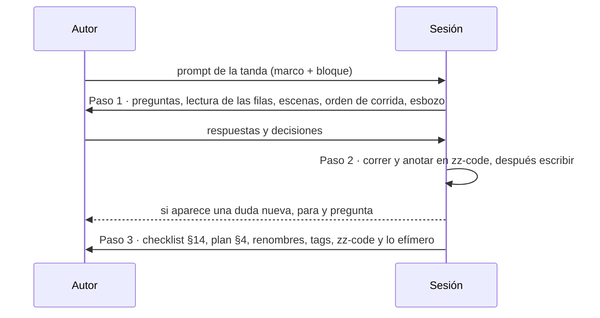

# 🗺️ Prompts de la reescritura
## Tutorial React 16 — La Esclusa, la consola de Jewel Locks — 21 sesiones (P4–P8, T0–T12)

Cada sección es el prompt completo de una tanda del
[plan de edición](_desechable-plan-de-edicion.md), listo para pegar en la sesión que la hace.
**El alcance de cada documento no se copia aquí**: vive en su fila de
[`propuesta-fases-y-alcance.md`](propuesta-fases-y-alcance.md) (§4 base, §5 BE, §6 apéndices, §7
incidentes), y el prompt la cita. Lo que el prompt agrega es lo que la fila no dice: qué vigilar, qué
riesgo tiene la tanda y qué tiene que estar hecho antes.

> ⚠️ **Antes de la primera sesión** tienen que estar a mano, en este orden: la historia v2, la
> propuesta, la guía, el diccionario del código, `00-decisiones-y-versiones.md`, la plantilla de fase
> y las de incidente. **No se usa** ningún archivo `_desechable-*` salvo el plan, que es operativo.

> ⚠️ **Antes de T1.** P4–P8 cerradas: la guía y el diccionario ya hablan el dominio nuevo, y la
> verificación previa dio las cifras que las fases densas van a reproducir.

---

## 🧱 El marco común

Va entero en el prompt de cada sesión. **No lo repitas en el documento: aplícalo.**

```markdown
## Marco (no lo repitas, aplícalo)

Estás reescribiendo el curso React 16 legacy de `cursos-legacy/react-16-legacy-for-backend-devs`: del
dominio de Rifas y Chances a la rueda de premios de Jewel Locks (Interoceanic Games, Panamá). La
estructura no cambia: mismas fases, mismas horas salvo DR-06, misma plantilla, mismos cuadernos.

Fuentes de verdad, en este orden:
1. `00-historia-del-sistema-v2.md` (o `00-historia-del-sistema.md` desde T0): hechos, reglas de
   negocio (§9), cifras (§8), gente (§4), cómo hablan (§10). Ningún dato narrativo se inventa: si
   falta, se propone agregarlo a la historia.
2. `prompts/propuesta-fases-y-alcance.md`: el grado de cada documento (§3–§7), el contrato de
   nombres (§2), las decisiones DR-01–DR-06 (§8), los renombres (§8.1) y las horas (§8.2).
3. `00-decisiones-y-versiones.md`: versiones congeladas y D1–D29 (D30+ desde T0).
4. `prompts/guia-de-estilo-y-convenciones.md`, con §4 (código en inglés, comentarios en español),
   §8 (plantilla de nueve secciones), §9 (ejercicios), §14 (checklist), §16 (track BE) y §17
   (excepciones; §17.5 la reescritura).
5. `prompts/diccionario-codigo-ingles.md`: los nombres del código.
6. Las plantillas de fase e incidente, y las preparaciones de incidentes.
7. Lo ya reescrito en tandas anteriores, y el repo de prueba en el tag de la última fase cerrada.
8. La versión vieja del documento: **solo como fuente de concepto**, de pieza forense y de errores
   comunes. Nunca como fuente de hechos.
9. Las decisiones de esta sesión.

Reglas de contenido que no se negocian:
- **El grado manda el procedimiento** (plan §2.3). 🟢 se edita línea por línea, sin buscar y
  reemplazar a ciegas; 🟡 se edita sección por sección; 🔴 se crea sobre el esqueleto de la
  plantilla, con la vieja al lado; ➕ se crea.
- **Cada fase conserva lo que enseña**: concepto, herramienta, pieza forense, horas. Si para
  conservarlo hace falta cambiar el concepto, para y pregunta.
- **Nada se publica sin haberse ejecutado.** Ningún comando, salida ni número inventado. Las cifras
  salen de la corrida en el repo de prueba, fechadas. Lo que no se pudo correr lleva «no verificado
  por ejecución» y queda ⬜ en el plan. **Las pruebas de la tanda son las de su fila en el plan
  §5.1**, y el plan §2.4 dice qué cuenta como *corrida* (incidentes incluidos: su rama reproduce el
  síntoma). Lo que se mira en DevTools lo verifico yo a mano: déjame los pasos.
- **Ninguna versión fuera de `00-decisiones-y-versiones.md`**, nunca `latest` ni rangos.
- **Los nombres, del diccionario.** Si falta uno, se propone agregarlo allí antes de usarlo.
- **El curso no cita `prompts/`, ni `zz-code/`, ni un desechable**, ni nombra la versión vieja del
  curso: para el lector, el dominio siempre fue la rueda.
- **La plantilla se sigue literal**: nueve secciones, sin extras ni reordenadas. Diagramas nuevos en
  Mermaid (guía §17.1).
- **No toques ningún `README.md`** fuera de T11. Si algo debería constar en ellos, déjalo en el plan
  §6.
- **Tono:** tuteo neutro en la narración; las voces de la historia solo en citas, una frase por
  escena (historia §10). Ningún villano: la agencia y los de Lima trabajaron con un alcance y un
  presupuesto.

Reglas de sesión que no se negocian:
- Todo secuencial y sin subagentes, salvo que yo pida lo contrario. Te paras al cerrar la tanda.
- No instales nada ni generes cargos; si hace falta algo en mi máquina, dime qué y cómo.
- Docker: inventario inicial a un log; contenedores con `--label curso=react16`; puertos altos y
  aleatorios ligados a `127.0.0.1`, nunca los del curso; al terminar, borra tus contenedores con sus
  volúmenes (`docker rm -v`, `compose down -v`) y nada que ya existía; nunca `prune`.
- Todo el código va a tu directorio de `zz-code/`
  (`python3 zz-code/nuevo.py react-16-legacy-for-backend-devs`), registrado en el plan §9; lo
  efímero, a su `salidas/`. Nada en el scratchpad ni en `/tmp`. El `README.md` del directorio queda
  al día: cómo correr y medir cada prueba, comandos en orden e intermedios.
- Git lo manejo yo. Renombra con `mv` y borra con `rm`, archivo por archivo; nunca `git mv`,
  `git rm`, `rm -rf` ni borrar directorios. En el repo de prueba sí creas commits y tags.
- Al cerrar, deja el plan al día (§3, §6, §7, §8, §9) con las trampas, los tags del repo de prueba y
  lo que queda por borrar.
```

Y el **protocolo de tres pasos**, que cierra todos los prompts:

```markdown
## Cómo quiero que trabajes

**Paso 1 — Preguntas antes de escribir.** No redactes. Devuélveme: (a) preguntas bloqueantes
numeradas, marcando cuáles puedes asumir con un valor por defecto; (b) tu lectura de la fila de cada
documento de la tanda y si el grado te parece correcto después de abrir el archivo viejo (si un 🟢
resulta 🟡, dilo); (c) la escena con que abre cada fase, contra la tabla de escenas; (d) el orden en
que vas a correr el código, con los comandos; (e) un esbozo de la sección que más cambia; (f)
cualquier contradicción entre la historia, la propuesta, la guía y lo ya reescrito: dímela, no la
resuelvas.
**Paso 2 — Corrida y redacción**, cuando yo responda. Primero se ejecuta y se anota —el error antes
de arreglarlo, literal—; después se escribe. Si aparece una duda nueva, **para y pregunta**.
**Paso 3 — Autoverificación** contra el checklist de la guía §14 y las verificaciones del plan §4,
reportada en lista corta, más: los renombres hechos y los enlaces corregidos, los incidentes y las
preparaciones al día, las decisiones que tomaste por defecto, los tags del repo de prueba y lo
efímero para borrar.
```



---

## 🎭 Las escenas de la historia, por fase

Cada fase abre con una escena en la voz de quien tiene el problema. **La escena es candidata**: la
sesión la puede ajustar en su paso 1, pero los hechos salen de la historia.

| Fase | La escena que la abre | La voz | De la historia |
|---|---|---|---|
| F00 | El primer día: Juliana te pasa el repo y el `.env` que llegó por correo; *"levántalo antes del lunes"* | Juliana | §3 Era 1, §12 |
| F01 | Itzel quiere ver las ruedas del próximo evento y el detalle de cada una, sin pedírselo a nadie | Itzel | §4 |
| F02 | Yariela e Itzel comparten usuario "para no molestar"; cualquiera con usuario puede enviar giros | Yariela | §11 |
| F03 | *"Antes de tocar nada, quiero ver qué hace el API la noche de un evento"*: el giro ingenuo bajo el generador de tráfico | Juliana | §3 Hoy, §6 |
| F04 | Itzel arma la rueda de la próxima Semana del Canal y los pesos no suman 100 % | Itzel | §9 |
| F05 | La noche de la Esclusa de Oro, compensando a ciegas: envíos que salen dos veces | Yariela | §3 Hoy |
| F06 | El doble clic que manda dos envíos, la jugadora que se busca rápido y aparece otra | Yariela | §3 Era 2 |
| F07 | *"Ya pagué en Efecty y no me llegaron los giros"*, veinte veces al día; y la rueda que cierra a las 8:00 p. m. | Yariela, Itzel | §3 Era 3, §3 Hoy |
| F08 | *"¿Y ese centavo de dónde salió?"*; y la reseña de *"la rueda está arreglada"* que nadie puede responder con números | Marisol, Itzel | §3 Era 2, §5 |
| F09 | Itzel quiere ver en un tablero, antes de responder la reseña, si la rueda da lo que publica | Itzel | §5, §8 |
| F10 | *"Nada se toca sin red"* antes de la próxima Semana del Canal | Juliana | §3 Hoy |
| F11 | *"¿Apagamos la Esclusa en 2028 o la migramos?"* | Abdiel | §3 Hoy (el horizonte) |
| be00 | El contrato antes del reemplazo: lo que el API hace, no lo que el README dice | Juliana | §6, §7 |
| be01 | Carlos: *"eso es vaina de web"*; el API nuevo tiene que ser un binario que nadie del estudio tenga que entender | Carlos | §4 |
| be02 | Las tablas que la bitácora y el inventario necesitan, y que el API heredado no tiene | Juliana | §9, §11 |
| be03 | 🪦 El momento: la consola habla con el API nuevo y no se entera | Juliana | §3 Hoy |
| be04 | Quién envió cada giro manual: la identidad sale del token, no del cuerpo | Yariela | §9 |
| be05 | La noche de la Esclusa de Oro, reproducida: 1.047 de 1.000 | Itzel | §3 Hoy, §8 |
| be06 | Jugadores que cobran el giro gratis cada hora, y la rueda que les cierra antes a los de Chile | Yariela | §9 |
| be07 | La notificación de compra que llega dos veces; la conciliación que por fin responde la reseña | Marisol, Itzel | §5, §9 |
| be08 | La suite en verde y la producción rota | Juliana | — |
| be09 | La imagen, los ambientes y el horizonte de dos años | Abdiel, Juliana | §3 Hoy |

---

## # P4 — La guía al dominio nuevo

````markdown
Esta es la sesión de la **tanda P4** de la reescritura. Su entregable es
`prompts/guia-de-estilo-y-convenciones.md` editada.

## Marco (no lo repitas, aplícalo)

{{pega aquí el marco común completo}}

## Alcance

- El dominio de §4.3 y §5.5, los ejemplos de §6–§9 y §13, y el título del curso, al de la historia v2.
- §16 con k6 (DR-04) y la regla de que el arnés corre en contenedor.
- **§17.5 La reescritura de 2026**, nueva: versión nueva para los que entran, renombres (DR-05), horas
  (DR-06), el procedimiento por grado (plan §2.3) y que el curso no nombra la versión vieja.
- §17.2: este plan y `prompts-de-reescritura.md` como lo que hace el papel de plan y de prompts.

## Qué vigilar

- **No renumerar secciones.** Varias fases y prompts citan la guía por número.
- **§4 no cambia de regla**: identificadores en inglés, comentarios en español.
- **Lo que no es del dominio no se toca**: tono, pedagogía y callouts siguen igual.

{{protocolo de tres pasos}}
````

---

## # P5 — El diccionario del código

````markdown
Esta es la sesión de la **tanda P5**. Su entregable es `prompts/diccionario-codigo-ingles.md`
reescrito con el contrato de nombres de la propuesta §2.

## Marco (no lo repitas, aplícalo)

{{marco común}}

## Alcance

El contrato completo, en las tres capas: entidades y campos (`wheel`, `segment`, `weightBp`,
`player`, `inventory`, `grant`, `spin`, `purchase`, `purchaseToken`, `spinLog`, `stock`,
`reconciliation`, `oddsAudit`), rutas del API y del mock de Google Play, slices y epics del frontend,
tablas y columnas del backend, estados (`draft → scheduled → live → ended → reconciled`; los de un
envío), usuarios de la consola (`ibatista`, `ypinzon`, `mdegracia`) y el repo `esclusa-app`.

## Qué vigilar

- **Cada nombre sale de un uso en una fase.** Recorre la propuesta §4–§5 y anota en qué fase nace.
- **Consistencia singular/plural y entre capas** (`wheel_segments` en la base, `segments` en el JSON).
- Lo que quede dudoso, como pregunta en el paso 1; no lo resuelvas solo.

{{protocolo de tres pasos}}
````

---

## # P6 — Instrucciones, plantillas y preparaciones

````markdown
Esta es la sesión de la **tanda P6**. Sus entregables: `prompts/instrucciones-del-proyecto.md`,
`prompts/plantilla-de-fase.md`, `prompts/plantilla-de-incidente.md`,
`prompts/plantilla-de-incidente-be.md`, `prompts/preparaciones-de-incidentes.md` y
`prompts/preparaciones-de-incidentes-be.md`, editados; y los `prompts-a-*`, `prompts-b-*` y
`prompts-backend-*` renombrados a `_desechable-…` con `mv`.

## Marco (no lo repitas, aplícalo)

{{marco común}}

## Alcance

- Instrucciones: fuentes de verdad con la historia v2 y la propuesta; el curso es la Esclusa.
- Plantillas: encabezado (`Tutorial React 16 — La Esclusa`), ejemplos del dominio.
- Preparaciones: el estado roto de cada incidente según la propuesta §7, incluidos 21, be-17 y
  be-18 (sus ramas `incidente/NN`, sus flags o sus archivos de datos).
- `propuesta-fases-backend.md`: una nota al comienzo que diga qué cambió la propuesta nueva.
- `verificar-corpus.py`: el encabezado de fase con el título nuevo; `CITA-PROMPTS` también para
  `zz-code/`. El verificador sigue en cero sobre el curso viejo hasta que T1 cambie los encabezados:
  acepta los dos títulos mientras dure la reescritura y el viejo se quita en T12.

## Qué vigilar

- **Las preparaciones son la parte delicada**: cada una tiene que poder construirse con lo que la
  fase reescrita va a enseñar. Si una no se puede definir antes de la fase, déjala marcada para la
  tanda de su fase y anótala en el plan §6.
- **Los prompts viejos no se editan**: se renombran y quedan como registro.

{{protocolo de tres pasos}}
````

---

## # P7 — Verificación previa

````markdown
Esta es la sesión de la **tanda P7**. Su entregable es un directorio nuevo de `zz-code/` con su
`README.md` de diez secciones y su `hallazgos.md` (`H1`, `H2`…), registrado en el plan §9.

## Marco (no lo repitas, aplícalo)

{{marco común}}

## Alcance

La lista del plan §5, P7, completa: imágenes y variantes arm64; la versión de `grafana/k6`; el giro
ingenuo y el transaccional medidos con k6; `oddsAudit` con la rueda honesta y con la que se acomoda;
`math/rand` en Go 1.19 contra 1.20; el mock de Google Play con compra pendiente. Y los riesgos que
heredó del viejo plan de validación: CRA 4 con `npx` hoy, la imagen de Cypress 10.11.0, cgo y
`golang-migrate` en `golang:1.19.13`, cómo se valida el pipeline de be09 (`actionlint`), y la lista
de verificación a mano.

## Qué vigilar

- **Esta tanda fija las cifras que el curso va a publicar.** Cada medición, con su comando, su
  versión, su máquina y su fecha. Si un número depende de la máquina, dilo y da el rango.
- **Escala del laboratorio, no de producción.** La historia dice ~3.000 giros por minuto; el
  laboratorio reproduce la *forma* del pico, no su tamaño. Decide la escala en el paso 1.
- **La rueda que se acomoda tiene que dar alarma** en `oddsAudit`, y la honesta no, con la muestra
  que el laboratorio puede generar. Si no alcanza, ese es un hallazgo que cambia F08 y F09.
- **La trampa de Go 1.19 se demuestra con dos reinicios**, no con un argumento.

{{protocolo de tres pasos}}
````

---

## # P8 — Traslado

````markdown
Esta es la sesión de la **tanda P8**. Lleva los hallazgos de P7 a la propuesta (cifras esperadas por
fase), a la guía (versiones, §16 k6) y al diccionario (nombres que aparecieron al prototipar), y deja
anotadas para T0 las decisiones con forma de `Dnn`.

## Marco (no lo repitas, aplícalo)

{{marco común}}

## Qué vigilar

- **Ningún hallazgo queda sin destino.** Lo que no cambia nada se anota como "sin efecto".
- Las cifras se trasladan **con su condición**, no solas.

{{protocolo de tres pasos}}
````

---

## # T0 — La raíz

````markdown
Esta es la sesión de la **tanda T0**. Sus entregables: la historia v2 en el lugar de la vieja (`rm`
de `00-historia-del-sistema.md`, `mv` de la v2), y `00-alcance-del-proyecto.md`,
`00-decisiones-y-versiones.md` y `00-convencion-de-git-y-tags.md` editados.

## Marco (no lo repitas, aplícalo)

{{marco común}}

## Alcance

El del plan §5, T0. En decisiones: D28 → el giro se modela como hecho; D29 → zona de Panamá; D30+
desde el traslado de P8; el `package.json` y el `go.mod` de referencia con los nombres nuevos; el
puerto 3002 es el mock de Google Play. En la convención de git: los tags de la propuesta §8.1.

## Qué vigilar

- **El reemplazo de la historia rompe enlaces** en todo el curso: corrígelos en la misma sesión.
- **El alcance §5 lleva el diagrama de estados de la rueda en Mermaid** (`stateDiagram-v2`, guía §17.1).
- **Las horas** (DR-06): 98 en el track base, 86 en el BE, apéndices aparte.

{{protocolo de tres pasos}}
````

---

## # T1 — F00, F01, F02 (🟢)

````markdown
Esta es la sesión de la **tanda T1**. Entregables: `00-setup-hola-mundo-cra.md`,
`01-estructura-base-router-5.md`, `02-autenticacion-minima.md`; los incidentes 01–06 del cuaderno
base y sus preparaciones; A1, A2, A3, A4 y A5. Todo 🟢.

## Marco (no lo repitas, aplícalo)

{{marco común}}

## Alcance

Las filas F00–F02 de la propuesta §4, las de §6 para A1–A5 y las de §7 para 01–06.

## Qué vigilar

- **Es la primera tanda que corre código**: abre el directorio de `zz-code/` con el repo de prueba
  `esclusa-app` y sus tags `fase-00…` a `fase-02…`.
- **El renombre es la trampa**: `RaffleCard` → `WheelCard`, rutas `/raffles` → `/wheels`, usuarios
  del `db.json` de F02 con los de la historia. Recorre línea por línea.
- **F01 suma dos rutas placeholder** (*Jugadores*, *Bitácora*): es el único agregado.
- **F02 declara la deuda** "cualquiera con usuario puede enviar giros", sin pagarla.

{{protocolo de tres pasos}}
````

---

## # T2 — F03, el mock (🔴)

````markdown
Esta es la sesión de la **tanda T2**. Entregables: `03-mock-api-express-caos.md` reescrita; los
incidentes 07 y 08 y sus preparaciones; A9.

## Marco (no lo repitas, aplícalo)

{{marco común}}

## Alcance

La fila F03 de la propuesta §4: el `db.json` de ruedas, segmentos, jugadores, inventarios y compras;
el **giro ingenuo de 2019** como ruta Express (el de la historia §3, Era 1); el **mock de Google Play**
en el 3002 (verificación, compra pendiente, notificación duplicada); `scripts/traffic.js`.

## Qué vigilar

- **El mock imita el API heredado con sus defectos.** El giro ingenuo tiene que producir dobles
  premios y stock excedido bajo el generador de tráfico, con las cifras de P7 a escala.
- **Se conservan** el inyector de caos, los pagos de deuda #1 y #2 y la prueba de fuego.
- **Lo que esta fase deja es lo que todas las demás usan**: los nombres de rutas y campos salen del
  diccionario y no se improvisan.

{{protocolo de tres pasos}}
````

---

## # T3 — F04 (🟡) y F05 (🔴)

````markdown
Esta es la sesión de la **tanda T3**. Entregables: `04-ruedas-crud.md` (renombrada desde
`04-rifas-crud.md`) y `05-envios-manuales.md` (renombrada desde `05-venta-de-numeros.md`); los
incidentes 09–12 y sus preparaciones; A6.

## Marco (no lo repitas, aplícalo)

{{marco común}}

## Alcance

Las filas F04 y F05 de la propuesta §4 y las de §7 para 09–12 (11 ⭐ es 🔴: la compensación doble).

## Qué vigilar

- **F05 es el ⭐ que más cambia.** Lo que se conserva es la máquina de estados, el `setTimeout`
  honesto (ahora la ventana de deshacer de 10 s), el optimistic con rollback y la race en el store.
  Lo que F06 necesita de F05 es que existan timers para jubilar: no los elimines.
- **El tablero del envío masivo conserva el problema de render** de la grilla de 10.000.
- **Los renombres de archivo** rompen enlaces en fases ya cerradas y por cerrar: corrígelos todos.
- **F04 valida pesos enteros que suman 10.000** y bloquea la edición de pesos de una rueda `live`.

{{protocolo de tres pasos}}
````

---

## # T4 — F06 (🟡) y F07 (🔴)

````markdown
Esta es la sesión de la **tanda T4**. Entregables: `06-redux-observable-a-fondo.md` y
`07-cierre-polling-compras.md` (renombrada desde `07-cierre-polling-resultado.md`); los incidentes
13–17 y sus preparaciones; A7 y A11.

## Marco (no lo repitas, aplícalo)

{{marco común}}

## Alcance

Las filas F06 y F07 de la propuesta §4, A7 y A11 de §6, y 13–17 de §7.

## Qué vigilar

- **Los operadores de F06 no cambian**, cambian sus épicas: `undoWindowEpic`, `sendGrantEpic`,
  `searchPlayerEpic`, `retryGrantEpic`, `cancelOnLogoutEpic`. El memory leak provocado se conserva.
- **F07 junta dos tiempos**: el cierre del evento (un instante) y la compra pendiente (minutos a 48 h
  en la vida real; segundos en el mock). Que el mock lo deje configurable.
- **A7 y A11 siguen a las épicas nuevas**: cada ejemplo de operador, con una épica que existe.

{{protocolo de tres pasos}}
````

---

## # T5 — F08 (🔴➕), A10 (🟡) y A14 (➕)

````markdown
Esta es la sesión de la **tanda T5**. Entregables: `08-conciliacion.md` (renombrada desde
`08-liquidacion-calculo-premio.md`, 10 horas), `A10-aritmetica-de-dinero.md` editado,
`A14-estadistica-para-auditar-una-rueda.md` nuevo, y el incidente 18 con su preparación.

## Marco (no lo repitas, aplícalo)

{{marco común}}

## Alcance

La fila F08 de la propuesta §4 (conciliación de compras y de probabilidades), A10 y A14 de §6, y el
18 de §7.

## Qué vigilar

- **La teoría va en A14, la práctica en F08** (DR-01). F08 usa la banda y el chi-cuadrado y remite.
- **`oddsAudit` es una función pura en enteros** (puntos básicos y conteos); el único cálculo con
  decimales es la desviación, y se dice dónde y por qué.
- **El segmento en que cayó la rueda no es el premio entregado**: la bitácora necesita los dos, y
  F08 lo justifica.
- **El prorrateo del paquete** (20,99/500) es el caso nuevo de `prizeShare`: ni un centavo perdido.
- **Las cifras de la conciliación salen de una bitácora generada en el repo de prueba**, no del
  ejemplo de la historia.

{{protocolo de tres pasos}}
````

---

## # T6 — F09, F10, F11 y el cuaderno base

````markdown
Esta es la sesión de la **tanda T6**. Entregables: `09-dashboard.md` (🟡), `10-testing-minimo.md`
(🟢➕), `11-cierre-puente-react-moderno.md` (🟢➕); los incidentes 19, 20 y 21 (nuevo) y sus
preparaciones; las secciones generales de `cuaderno-incidentes.md`; A8, A12 y A13.

## Marco (no lo repitas, aplícalo)

{{marco común}}

## Alcance

Las filas F09–F11 de la propuesta §4, A8, A12 y A13 de §6, y 19–21 de §7.

## Qué vigilar

- **F09: el gráfico de la banda** (observado contra configurado) con chart.js 2, sin wrapper.
- **F10: la sección nueva** sobre probar lo aleatorio sin que la prueba sea intermitente.
- **F11: el horizonte de dos años** como veredicto: decomisionar o migrar, con criterios medibles,
  sin decidir por el estudio.
- **El incidente 21** termina en diagnóstico y decisión, no en un commit (DR-03).
- **A12** marca cada deuda: se paga antes del corte, muere con el decomiso o se paga al migrar.
- **Al cerrar, la suite completa del track base en verde** en el repo de prueba.

{{protocolo de tres pasos}}
````

---

## # T7 — be00 a be04

````markdown
Esta es la sesión de la **tanda T7**. Entregables: be00, be02 y be03 (🟡), be01 y be04 (🟢); los
incidentes be-01–be-08 y sus preparaciones; bea-01, bea-03, bea-04, bea-07 y bea-08.

## Marco (no lo repitas, aplícalo)

{{marco común}}

## Qué vigilar

- **be00 audita el mock de T2**, giro ingenuo incluido: sus defectos son hallazgos del contrato.
- **be02: las tablas nuevas** (`wheels`, `wheel_versions`, `wheel_segments`, `players`,
  `player_inventory`, `purchases`, `spin_log`) salen del diccionario.
- **be03: el momento 🪦** se conserva; la consola de T6 no se toca (D27 es la única excepción).

{{protocolo de tres pasos}}
````

---

## # T8 — be05 (🔴➕), bea-05, bea-10 y bea-11 (➕)

````markdown
Esta es la sesión de la **tanda T8**. Entregables: `be05-giro-concurrente.md` (renombrada desde
`be05-venta-concurrente.md`, 12 horas), bea-05 y bea-10 editados, `bea-11-k6-101.md` nuevo, y los
incidentes be-09, be-10 y be-17 (nuevo) con sus preparaciones.

## Marco (no lo repitas, aplícalo)

{{marco común}}

## Qué vigilar

- **Las tres carreras** (idempotencia, saldo, stock) se resuelven y se miden con k6, contra el giro
  ingenuo, con las cifras que dé el repo de prueba.
- **D28 se reformula**: el giro como hecho, en la bitácora de solo inserción.
- **DR-02**: be05 usa el aleatorio bien sembrado sin explicar la trampa; be-17 la descubre.
- **bea-11 es k6 101**: lo mínimo para correr y leer el arnés de be05, no un curso de k6.

{{protocolo de tres pasos}}
````

---

## # T9 — be06 (🟡➕) y be07 (🔴➕)

````markdown
Esta es la sesión de la **tanda T9**. Entregables: be06 editada, `be07-compras-y-conciliacion.md`
(renombrada desde `be07-liquidacion-dinero-entero-y-transaccional.md`), bea-06, y los incidentes
be-11–be-14 y be-18 (nuevo) con sus preparaciones.

## Marco (no lo repitas, aplícalo)

{{marco común}}

## Qué vigilar

- **be06: el giro gratis cada 4 h** con el servidor como autoridad del reloj; Panamá sin horario de
  verano y jugadores que sí lo tienen.
- **be07: la compra idempotente por `purchaseToken`**, la conciliación de probabilidades en SQL y la
  **protección de duplicados** que reemplaza a la rueda que se acomoda.
- **El incidente 21 del cuaderno base nombra este arreglo**: que coincidan.

{{protocolo de tres pasos}}
````

---

## # T10 — be08, be09 y el cuaderno BE

````markdown
Esta es la sesión de la **tanda T10**. Entregables: be08 (🟢➕) y be09 (🟢), bea-02 y bea-09, los
incidentes be-15 y be-16, y las secciones generales de `cuaderno-incidentes-be.md`.

## Marco (no lo repitas, aplícalo)

{{marco común}}

## Qué vigilar

- **be08 suma la prueba estadística sembrada y el nivel de carga** con el arnés de be05.
- **be09: el veredicto** incorpora el horizonte de dos años.
- **Al cerrar, el backend completo corre con la consola de T6 sin tocar** (salvo D27).

{{protocolo de tres pasos}}
````

---

## # T11 — Los README

````markdown
Esta es la sesión de la **tanda T11**. Entregables: `README.md` del curso y `prompts/README.md`.

## Marco (no lo repitas, aplícalo)

{{marco común}}

## Qué vigilar

- Tablas de fases y apéndices con los nombres de §8.1; horas de DR-06; la tabla de términos del
  dominio; el sistema de Jewel Locks contado en un párrafo, con enlace a la historia.
- Saldar la deuda del plan §6 dirigida a T11.

{{protocolo de tres pasos}}
````

---

## # T12 — Cierre

````markdown
Esta es la sesión de la **tanda T12**. Verificación global del plan §4 en todo el curso, guía §17.5
con el resultado, inventario de Docker contra el inicial, `zz-code/` sin directorios vigentes y,
**con mi permiso**, borrado de `_desechable-plan-de-validacion.md` y del plan.

## Marco (no lo repitas, aplícalo)

{{marco común}}

## Qué vigilar

- **Restos del dominio viejo en cero**, salvo menciones deliberadas listadas en la guía.
- **Nada se borra sin mi permiso explícito en esta sesión.**

{{protocolo de tres pasos}}
````
