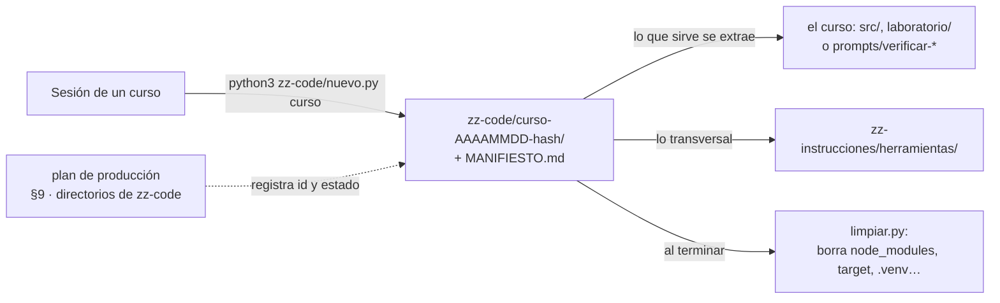

# 🧪 zz-code: el código intermedio de los cursos

> **Qué es este directorio:** donde vive el código que se escribe para **probar las ideas de un curso**
> y que no forma parte de él: prototipos, conductores de terminal, sincronizadores, contextos de
> build, proyectos de ensayo. Está en el repositorio privado (respaldado por git), y **nunca** se copia
> al repositorio público de un curso.
> **Qué no es:** el código que el curso publica. Ese vive dentro de la carpeta del curso (`src/`,
> `laboratorio/`) y se rige por su guía.
> **Vigencia:** 2026-10-04.



---

## 🧭 Las reglas

1. **Un directorio por sesión**, creado con `nuevo.py`: `zz-code/<curso>-<AAAAMMDD>-<hash>/`. El hash
   evita que dos sesiones en paralelo choquen; el resto deja ver a qué pertenece sin abrirlo.
2. **Cada directorio lleva su `MANIFIESTO.md`**: curso, tanda, fecha, propósito, estado, cómo
   regenerar lo borrado, qué hay y qué sirvió. Si el plan de producción ya no existe, el manifiesto
   explica el directorio solo.
3. **El plan de producción del curso registra cada directorio** con su estado (§9 del plan):
   - *vigente* — se sigue usando;
   - *extraído* — lo útil ya pasó al curso, a su `prompts/` o a `zz-instrucciones/herramientas/`;
   - *archivado* — se conserva como referencia de cómo se probó algo.
4. **El curso nunca cita `zz-code/`**: ni enlaces ni rutas en la prosa. El verificador lo marca como
   error (`ZZ-CODE`). Lo que el curso necesita, lo extrae.
5. **Lo efímero también viene aquí, en `<id>/salidas/`**: logs, salidas, SVG de prueba y copias para
   comparar. `salidas/` no se versiona y `limpiar.py` la libera como regenerable (se rehace corriendo
   la prueba otra vez). Desde el 2026-10-05 **todas las pruebas se hacen en `zz-code/`**; el scratchpad
   de la sesión no se usa para pruebas.
6. **Los secretos tampoco**: `.env` está ignorado; las credenciales de prueba se generan, no se
   copian de ningún sitio real.

---

## 🧹 Liberar disco

Lo regenerable (dependencias y salidas de build) no se versiona —está en el `.gitignore` de este
directorio— pero ocupa disco. `limpiar.py` lo borra **solo por nombre exacto, solo dentro de
`zz-code/`, y sin `--borrar` no toca nada**:

```bash
python3 zz-code/limpiar.py                                   # vista previa de todo, con tamaños
python3 zz-code/limpiar.py 05-event-driven-20261004-a3f9     # vista previa de un directorio
python3 zz-code/limpiar.py 05-event-driven-20261004-a3f9 --borrar
```

- Sin argumentos, lista cada directorio regenerable con su tamaño y el total.
- Con un `<id>`, se limita a ese directorio; rechaza cualquier ruta que no sea un directorio de
  `zz-code/` (incluidas las que llevan `..`).
- `--borrar` borra exactamente la lista mostrada: `node_modules`, `target`, `.venv`, `build`, `dist`,
  `__pycache__`, `bin`/`obj` de .NET, `vendor` de PHP y Go, y los demás de `REGENERABLE`. No sigue
  enlaces simbólicos.

**Cuándo:** al cerrar el curso (casilla del checklist final del plan), o antes, cuando un directorio
pasa a *extraído* o *archivado*. La sesión corre la vista previa y muestra la lista; el `--borrar` lo da
Oskar o lo autoriza de forma explícita. Es la **única excepción** a la regla de no borrar directorios, y
por eso vive en un script con lista blanca y no en un `rm -rf`.

> ⚠️ **Si un proyecto tiene código fuente en una carpeta llamada como un regenerable** (`build/` con
> scripts propios, `vendor/` con dependencias parcheadas a mano), git no la versiona y `limpiar.py` la
> borraría. Se renombra la carpeta, o se agrega una excepción `!ruta/build/` al `.gitignore` y se anota
> en el manifiesto.

---

## 🛠️ Crear el directorio de una sesión

```bash
python3 zz-code/nuevo.py 05-event-driven --tanda T9 --proposito "prototipo del outbox con sondeo"
```

- `05-event-driven` es el slug del curso (minúsculas, números y guiones).
- `--tanda` y `--proposito` llenan el manifiesto; lo demás se completa a mano.
- La salida es la ruta creada, que se pega en el plan de producción §9.
