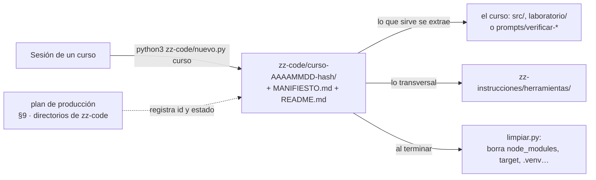

# 🧪 zz-code: el código intermedio de los cursos

> **Qué es este directorio:** donde vive el código que se escribe para **probar las ideas de un curso**
> y que no forma parte de él: prototipos, conductores de terminal, sincronizadores, contextos de
> build, proyectos de ensayo. Está en el repositorio privado (respaldado por git), y **nunca** se copia
> al repositorio público de un curso.
> **Qué no es:** el código que el curso publica. Ese vive dentro de la carpeta del curso (`src/`,
> `laboratorio/`) y se rige por su guía.
> **Vigencia:** 2026-10-06.



---

## 🧭 Las reglas

1. **Un directorio por sesión**, creado con `nuevo.py`: `zz-code/<curso>-<AAAAMMDD>-<hash>/`. El hash
   evita que dos sesiones en paralelo choquen; el resto deja ver a qué pertenece sin abrirlo.
2. **Cada directorio lleva su `MANIFIESTO.md`**: curso, tanda, fecha, propósito, estado, cómo
   regenerar lo borrado, qué hay y qué sirvió. Si el plan de producción ya no existe, el manifiesto
   explica el directorio solo. El manifiesto dice **qué es** el directorio; el `README.md` (regla 7)
   dice **cómo se corre**.
3. **El plan de producción del curso registra cada directorio** con su estado (§9 del plan):
   - *vigente* — se sigue usando;
   - *extraído* — lo útil ya pasó al curso, a su `prompts/` o a `zz-instrucciones/herramientas/`;
   - *archivado* — se conserva como referencia de cómo se probó algo.
4. **El curso nunca cita `zz-code/`**: ni enlaces ni rutas en la prosa. El verificador lo marca como
   error (`ZZ-CODE`). Lo que el curso necesita, lo extrae.
5. **Lo efímero también viene aquí, en `<id>/salidas/`**: logs, salidas, SVG de prueba y copias para
   comparar. `salidas/` no se versiona y `limpiar.py` la libera como regenerable (se rehace corriendo
   la prueba otra vez). Desde el 2026-10-05 **todas las pruebas se hacen en `zz-code/`**; el scratchpad
   de la sesión no se usa para pruebas.
6. **Los secretos tampoco**: `.env` está ignorado; las credenciales de prueba se generan, no se
   copian de ningún sitio real.
7. **Todo el código de la sesión se guarda aquí, no solo las pruebas** (decisión del 2026-10-06). Cada
   script, Dockerfile, manifiesto, archivo de compose, carga de k6, consulta, configuración de prueba y
   conductor de terminal que la sesión escriba vive en `zz-code/<id>/` desde el momento en que se escribe,
   aunque se use una sola vez. Nada se escribe en el scratchpad ni en `/tmp`: el sistema los borra, y lo
   que no se rescató a tiempo se pierde.
8. **Un comando suelto que produce algo citable se guarda en un archivo.** Si una cifra, una salida o
   una tabla que va al curso (o a `hallazgos.md`, o a `BENCHMARKS.md`) salió de un comando escrito
   directo en la terminal, ese comando se copia **tal como corrió** a un script del directorio
   (`comandos-<tema>.sh`) o al `README.md`, en orden. Un comando que solo vive en la transcripción de la
   sesión es un comando perdido.
9. **Cada directorio lleva su `README.md` con las instrucciones de corrida y de medición**, con el
   detalle que pide [la sección de abajo](#-el-readme-de-cada-directorio): con él, otra persona —o el
   autor, meses después, como lector— repite las pruebas y llega a las mismas cifras sin leer la
   transcripción. Se escribe **mientras se prueba**, no al final: cada script nuevo entra al README en la
   misma sesión en que se crea.
10. **Rutas relativas o en una variable al principio.** Un script no lleva escrita la ruta absoluta de
    su propio directorio ni la de un scratchpad; usa `$(dirname "$0")` (o `__file__`) para lo suyo y una
    variable (`LAB=…`, `CURSO=…`) para el curso, declarada arriba y nombrada en el README.

---

## 📋 El README de cada directorio

`nuevo.py` lo crea con estas secciones vacías. Ninguna se omite: si no aplica, dice "no aplica" y por qué.

1. **Qué se prueba y para qué.** Las fases, apéndices, hallazgos (`H-n`) y benchmarks (`B-n`) que alimenta
   cada prueba, para poder ir de una cifra publicada a la prueba que la produjo y de vuelta.
2. **Prerrequisitos.** Herramientas con su versión, imágenes base (por digest si el curso los fija),
   dependencias de Python/Node, y el **estado previo** que la prueba supone: qué cluster, qué datos
   sembrados, qué servicios en qué tag, qué configuración de la máquina (memoria de la VM, un
   Kubernetes apagado).
3. **Reglas antes de correr.** El inventario inicial de Docker y el comando que lo toma, la etiqueta
   `curso=<slug>`, los puertos, y cada cambio temporal en la máquina **con el comando para revertirlo**.
4. **Cómo se corre.** Los comandos bash en el orden en que se corrieron, en bloques copiables, con el
   directorio desde el que se lanza cada uno. Para cada script: qué argumentos recibe, qué hace y qué
   imprime. Una tabla `archivo → fase → qué prueba → cómo se corre` cuando son muchos.
5. **Cómo se mide.** El arnés y las condiciones: máquina, sistema, motor y su versión, memoria y CPU de
   la VM, número de corridas, calentamiento y lo que se descarta, reposo entre corridas, el estadístico
   que se publica (mediana, p90, máximo) y por qué. Si una medición se rehízo porque medía otra cosa (la
   caché, una sola lectura), se dice aquí.
6. **Los intermedios que amasan la salida.** Todo lo que hay entre la salida cruda y la cifra o la tabla
   publicada, **en orden**: los filtros (`jq`, `awk`, `sed`, `grep`, `sort | uniq -c`), los scripts que
   promedian o redondean, las consultas a Prometheus o Loki, los volcados que se cruzan entre sí, y las
   conversiones de unidades. Cada paso nombra su archivo o trae su comando literal. La regla: con el
   README y la salida cruda se reconstruye la cifra publicada sin adivinar.
7. **Qué se espera ver.** El resultado de referencia de cada prueba (la cifra, el código HTTP, la línea
   del log), con la fecha en que se obtuvo y dónde quedó registrado, para que una corrida nueva sepa si
   coincide.
8. **Salidas.** Qué escribe cada prueba en `salidas/`, cómo se regenera y qué se copió al curso.
9. **Limpieza.** Los comandos para borrar lo que la corrida creó (por etiqueta o comparando con el
   inventario) y restaurar la configuración de la máquina.
10. **Qué se dejó fuera.** Binarios, `.tar`, `.jar`, dependencias y secretos que no se guardan, con el
    comando que los regenera.

> 💡 Un ejemplo completo, rescatado después del cierre de un curso, es
> `lab-docker-kubernetes-20261006-0213/README.md`. Muestra también lo que cuesta no tener la regla 8:
> allí los comandos sueltos quedaron solo en las transcripciones de las sesiones.
>
> 🛟 **Si el código de una sesión ya se perdió** (lo escribió en el scratchpad o en `/tmp`, antes de la
> regla 7), `zz-instrucciones/herramientas/rescatar-transcripcion.py` lo reconstruye desde la
> transcripción de la sesión: archivos, scripts con su salida, comandos y bitácora de ejecución. Los
> rescates del 06/10/2026 son ejemplos (`*-20261006-*` de los cursos de lenguajes y de `cursos-legacy`),
> y se rehacen desde cero con `regenerar-rescates.py` (sección siguiente); los de angular-16 y angular-8
> traen además las sondas de backend del 09/09 reescritas con las reglas de hoy.

---

## 🛟 Regenerar los rescates desde cero

`rescates.tsv` lista cada carpeta generada de cada rescate: el directorio, la carpeta, la sesión de la que
sale y las opciones de `rescatar-transcripcion.py`, o un paso posterior (un comando con `{dir}` y
`{dest}`). `regenerar-rescates.py` la lee, **borra solo lo que la tabla declara generado** y lo rehace desde
las transcripciones. Lo escrito a mano —README, MANIFIESTO, sondas, auxiliares— no se toca. No llama a
Docker.

```bash
python3 zz-code/regenerar-rescates.py --comprobar      # regenera aparte (salidas/regenerado/) y compara; no toca nada
python3 zz-code/regenerar-rescates.py                  # borra y rehace todo
python3 zz-code/regenerar-rescates.py --dir vue2-legacy-for-backend-devs-20261006-c6c0
python3 zz-code/regenerar-rescates.py --listar         # qué carpeta sale de qué sesión
```

El `rescatar.sh` de cada directorio es el atajo de `--dir`. Un rescate nuevo se agrega como filas de
`rescates.tsv`; conviene correr `--comprobar` antes de dar por bueno cualquier cambio en la herramienta.
**Depende de las transcripciones** (`~/.claude/projects/<repo>/`): si se borran, lo generado que esté en
git es la única copia, y `--comprobar` lo diría con carpetas que faltan.

---

## 🧠 Los `CLAUDE.md` de ejemplo

`CLAUDE-sample-en.md` (el que se copia a la raíz de un repositorio de cursos como `CLAUDE.md`) y
`CLAUDE-ejemplo-es.md` (el mismo contenido en español, solo para leer) viven aquí porque traen las
reglas de este directorio. Cómo se usan: `zz-instrucciones/README.md`, sección "El `CLAUDE.md` del
repositorio".

---

## 🧹 Liberar disco

Lo regenerable (dependencias y salidas de build) no se versiona —está en el `.gitignore` de este
directorio— pero ocupa disco. `limpiar.py` lo borra **solo por nombre exacto, solo dentro de
`zz-code/`, y sin `--borrar` no toca nada**:

```bash
python3 zz-code/limpiar.py                                   # vista previa de todo, con tamaños
python3 zz-code/limpiar.py 05-event-driven-20261004-a3f9     # vista previa de un directorio
python3 zz-code/limpiar.py 05-event-driven-20261004-a3f9 --borrar
```

- Sin argumentos, lista cada directorio regenerable con su tamaño y el total.
- Con un `<id>`, se limita a ese directorio; rechaza cualquier ruta que no sea un directorio de
  `zz-code/` (incluidas las que llevan `..`).
- `--borrar` borra exactamente la lista mostrada: `node_modules`, `target`, `.venv`, `build`, `dist`,
  `__pycache__`, `bin`/`obj` de .NET, `vendor` de PHP y Go, y los demás de `REGENERABLE`. No sigue
  enlaces simbólicos.

**Cuándo:** al cerrar el curso (casilla del checklist final del plan), o antes, cuando un directorio
pasa a *extraído* o *archivado*. La sesión corre la vista previa y muestra la lista; el `--borrar` lo da
Oskar o lo autoriza de forma explícita. Es la **única excepción** a la regla de no borrar directorios, y
por eso vive en un script con lista blanca y no en un `rm -rf`.

> ⚠️ **Si un proyecto tiene código fuente en una carpeta llamada como un regenerable** (`build/` con
> scripts propios, `vendor/` con dependencias parcheadas a mano), git no la versiona y `limpiar.py` la
> borraría. Se renombra la carpeta, o se agrega una excepción `!ruta/build/` al `.gitignore` y se anota
> en el manifiesto.

---

## 🛠️ Crear el directorio de una sesión

```bash
python3 zz-code/nuevo.py 05-event-driven --tanda T9 --proposito "prototipo del outbox con sondeo"
```

- `05-event-driven` es el slug del curso (minúsculas, números y guiones).
- `--tanda` y `--proposito` llenan el manifiesto; lo demás se completa a mano.
- Crea también el `README.md` con las diez secciones de arriba, para irlo llenando mientras se prueba.
- La salida es la ruta creada, que se pega en el plan de producción §9.
