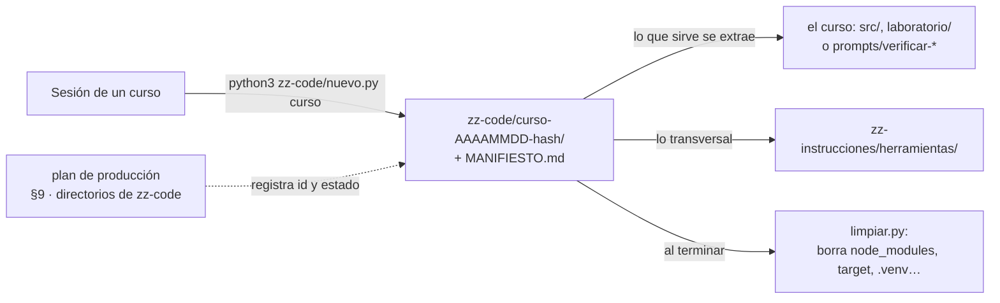

# Bitácora de ejecución · sesión 073aaed3-80c7-4a5a-b910-f2313b95f58a

Comandos que ejecutaron código, con el inicio de su salida.

### ⏱️ 2026-10-06T00:03:26Z · 

~~~~~~bash
cd /Users/oskar/Developer/Learning/courses-ia-generated; ls zz-instrucciones; wc -l zz-instrucciones/*; ls cursos-legacy/react-16-legacy-for-backend-devs; ls -la cursos-legacy/react-16-legacy-for-backend-devs/prompts; cat /Users/oskar/.claude/projects/-Users-oskar-Developer-Learning-courses-ia-generated/memory/{track-be-react16-escrito,lineamientos-zz-instrucciones-y-zz-code,revision-cursos-lenguajes-zz-instrucciones,docker-legacy-complemento-geek}.md
~~~~~~

~~~~~~text
00-workflow-de-un-curso.md
01-tipos-de-curso.md
02-prompts-de-etapa.md
03-lecciones-de-produccion.md
04-usar-en-cada-repositorio.md
herramientas
plantillas
README.md
wc: zz-instrucciones/herramientas: read: Is a directory
wc: zz-instrucciones/plantillas: read: Is a directory
     368 zz-instrucciones/00-workflow-de-un-curso.md
     253 zz-instrucciones/01-tipos-de-curso.md
     429 zz-instrucciones/02-prompts-de-etapa.md
     295 zz-instrucciones/03-lecciones-de-produccion.md
     109 zz-instrucciones/04-usar-en-cada-repositorio.md
     159 zz-instrucciones/README.md
    1613 total
00-alcance-del-proyecto.md
00-convencion-de-git-y-tags.md
00-historia-del-sistema.md
00-setup-hola-mundo-cra.md
01-estructura-base-router-5.md
02-autenticacion-minima.md
03-mock-api-express-caos.md
04-rifas-crud.md
05-venta-de-numeros.md
06-redux-observable-a-fondo.md
07-cierre-polling-resultado.md
08-liquidacion-calculo-premio.md
09-dashboard.md
10-testing-minimo.md
11-cierre-puente-react-moderno.md
A1-bootstrap-4-y-sass.md
A10-aritmetica-de-dinero.md
A11-marble-testing.md
A12-mapa-de-deuda-tecnica.md
A13-depurar-el-build-de-produccion.md
A2-mini-design-system.md
A3-node-y-npm.md
A4-cra-por-dentro.md
A5-class-components-vs-hooks.md
A6-redux-clasico-vs-toolkit.md
A7-redux-observable-epica-por-epica.md
A8-puente-a-react-moderno.md
A9-entornos-y-contenedores.md
be00-el-contrato-auditoria-del-mock.md
be01-go-y-la-forma-del-monolito.md
be02-la-costura-de-datos.md
be03-crud-y-el-reemplazo.md
be04-identi
~~~~~~

### ⏱️ 2026-10-06T00:03:33Z · 

~~~~~~bash
cd /Users/oskar/Developer/Learning/courses-ia-generated/cursos-legacy/docker-container-legacy/prompts; ls; cat README.md; grep -n "^## \|^### " guia-de-estilo-y-convenciones.md | tail -30; cat verificar-corpus.py
~~~~~~

~~~~~~text
Exit code 1
(eval):cd:1: no such file or directory: /Users/oskar/Developer/Learning/courses-ia-generated/cursos-legacy/docker-container-legacy/prompts
_oskar
CLAUDE.md
courses-ia-generated.code-workspace
cursos-algoritmos-lenguajes
cursos-bd
cursos-contenedores-cloud-infra
cursos-ia
cursos-legacy
propuestas-cursos
README.md
zz-code
zz-instrucciones
# Cursos de IA

Colección de cursos educativos sobre paradigmas modernos de software engineering. Cada curso enseña mecanismos antes que abstracciones, con énfasis en medición y decisiones justificadas.

> Los cursos se generan usando IA generativa. Proyectos Claude y ChatGPT en interfaz web.

---

## Cursos completos

### 🎨 vue2-legacy-for-backend-devs
**Vue 2 para ingenieros de backend** — Curso de Vue 2 orientado a quiénes vienen del backend. Estructura: tronco (12 lecciones fundamentales F0–F11), después rutas opcionales (Quasar, Vuetify, Nuxt). Incluye complemento de integración con MongoDB. Objetivo: backend engineers productivos en frontend.

### ⚛️ react-16-legacy
**React 16 Legacy** — Curso práctico de React 16 para ingenieros de otros paradigmas. Cubre fundamentos hasta patrones avanzados: componentes, ciclo de vida, estado, props, hooks. Proyecto integrador: aplicación real con manejo de estado y efectos sin recargar.

### ☁️ repaso-gcp-entrevistas
**GCP Core Refresh** — Repaso de Google Cloud para entrevistas de arquitectura backend, más una serie práctica que se ejecuta contra un proyecto real. Dos bloques: 13 capítulo
~~~~~~

### ⏱️ 2026-10-06T00:03:44Z · 

~~~~~~bash
cd /Users/oskar/Developer/Learning/courses-ia-generated/cursos-contenedores-cloud-infra/docker-container-legacy/prompts; ls; cat README.md; cat verificar-corpus.py; grep -n "^## " guia-de-estilo-y-convenciones.md
~~~~~~

~~~~~~text
__pycache__
check-course.sh
explicacion_script_integridad.md
guia-de-estilo-y-convenciones.md
propuesta-fases-y-alcance.md
README.md
verificador_base.py
verificar-corpus.py
# 🧰 `prompts/` — la maquinaria del curso
## Docker Legacy Node

Este directorio no es material del curso: es **lo que se usó para escribirlo** y lo que hace falta
para tocarlo sin romperlo. El lector nunca lo abre, y no viaja cuando el curso se publica en su
propio repositorio. Quien vaya a editar una fase lo lee entero antes de teclear la primera línea.

> **Estado:** cerrado: 36 fases, 16 apéndices y 941 ejercicios (cifras del README). Revisado el
> 05/10/2026 contra los lineamientos de producción del repositorio: diagramas a Mermaid,
> excepciones declaradas en la guía §16 y verificador de los lineamientos agregado.

---

## 📖 Qué hay aquí, y cuándo se lee

| Documento | Qué es | Cuándo se lee |
|---|---|---|
| [`propuesta-fases-y-alcance.md`](propuesta-fases-y-alcance.md) | el alcance y la propuesta a la vez: qué entra en cada fase y qué no, de dónde salió cada parte | antes de tocar el contenido de una fase |
| [`guia-de-estilo-y-convenciones.md`](guia-de-estilo-y-convenciones.md) | cómo se escribe; checklist en §14 y excepciones a los lineamientos en §16 | en cada sesión, siempre |
| [`verificar-corpus.py`](verificar-corpus.py) y [`verificador_base.py`](verificador_base.py) | las validaciones base de los lineamientos y el aviso de diagramas | al cerrar cualquier edición |
| [`check-course.sh`](check-
~~~~~~

### ⏱️ 2026-10-06T00:03:46Z · 

~~~~~~bash
cd /Users/oskar/Developer/Learning/courses-ia-generated/cursos-contenedores-cloud-infra/docker-container-legacy/prompts; sed -n 879,1000p guia-de-estilo-y-convenciones.md
~~~~~~

~~~~~~text
## 16. 🧾 Excepciones a los lineamientos del repositorio

> 📝 **Sección agregada el 05/10/2026**, en la revisión del curso contra los
> lineamientos de producción del repositorio. Va después del checklist para no
> renumerar: el resto del `prompts/` y `check-course.sh` citan esta guía por
> número de sección. El curso es anterior a esos lineamientos; casi todo lo que
> aquí se declara ya era su práctica, y desde ahora está escrito como decisión.

El `CLAUDE.md` del repositorio da **valores por defecto**, y esta guía los
reemplaza donde lo declara: la regla general, el valor de este curso y por qué.
Lo que esta sección no menciona se hereda tal cual.

| Regla general del repositorio | Lo que hace este curso | Por qué |
|---|---|---|
| Comentarios dentro del código en inglés | **En español** (§5); identificadores, rutas y tags en inglés | El comentario es el canal del *porqué*, y el curso piensa en español |
| Audiencia que no necesita lo básico | **Nada se da por sabido** (§4): ni Docker, ni Linux | El lector llega por un proyecto roto, no por Docker; el README pide un lenguaje y terminal, nada más |
| Forma de lección setup → conceptos → antipatrones → traducción → ejercicios → veredicto | **La plantilla de diez secciones de §8**, cerrada con «La señal de que quedó bien» | Es un taller incremental sobre una sola imagen. El veredicto honesto no es por fase: F00 §7 y §9 fijan dónde no sirve (producción, migrar el proyecto) y F23 decide entre ARM64 nativo y AMD64 emulado |
| 20–3
~~~~~~

### ⏱️ 2026-10-06T00:03:57Z · 

~~~~~~bash
cd /Users/oskar/Developer/Learning/courses-ia-generated; cat zz-code/README.md | head -60; python3 zz-code/nuevo.py react-16-legacy-for-backend-devs
~~~~~~

~~~~~~text
# 🧪 zz-code: el código intermedio de los cursos

> **Qué es este directorio:** donde vive el código que se escribe para **probar las ideas de un curso**
> y que no forma parte de él: prototipos, conductores de terminal, sincronizadores, contextos de
> build, proyectos de ensayo. Está en el repositorio privado (respaldado por git), y **nunca** se copia
> al repositorio público de un curso.
> **Qué no es:** el código que el curso publica. Ese vive dentro de la carpeta del curso (`src/`,
> `laboratorio/`) y se rige por su guía.
> **Vigencia:** 2026-10-04.



---

## 🧭 Las reglas

1. **Un directorio por sesión**, creado con `nuevo.py`: `zz-code/<curso>-<AAAAMMDD>-<hash>/`. El hash
   evita que dos sesiones en paralelo choquen; el resto deja ver a qué pertenece sin abrirlo.
2. **Cada directorio lleva su `MANIFIESTO.md`**: curso, tanda, fecha, propósito, estado, cómo
   regenerar lo borrado, qué hay y qué sirvió. Si el plan de producción ya no existe, el manifiesto
   explica el directorio solo.
3. **El
~~~~~~

### ⏱️ 2026-10-06T00:04:01Z · 

~~~~~~bash
cd /Users/oskar/Developer/Learning/courses-ia-generated; Z=zz-code/react-16-legacy-for-backend-devs-20261005-cbd3; mkdir -p $Z/salidas; C=cursos-legacy/react-16-legacy-for-backend-devs; python3 zz-instrucciones/herramientas/verificador_base.py $C --perfil=courses-ia > $Z/salidas/courses-ia.txt 2>&1; tail -5 $Z/salidas/courses-ia.txt; awk '{print $1,$2}' $Z/salidas/courses-ia.txt | sort | uniq -c | sort -rn | head -30; python3 zz-instrucciones/herramientas/verificador_base.py $C --perfil=publicacion > $Z/salidas/publicacion.txt 2>&1; tail -3 $Z/salidas/publicacion.txt; awk '{print $1,$2}' $Z/salidas/publicacion.txt | sort | uniq -c | sort -rn | head -30
~~~~~~

~~~~~~text
aviso ENCAB     08-liquidacion-calculo-premio.md: el encabezado no dice «Vigencia » o «Fecha de verificación»
aviso ENCAB     09-dashboard.md: el encabezado no dice «Vigencia » o «Fecha de verificación»
aviso ENCAB     10-testing-minimo.md: el encabezado no dice «Vigencia » o «Fecha de verificación»
aviso ENCAB     11-cierre-puente-react-moderno.md: el encabezado no dice «Vigencia » o «Fecha de verificación»
— 3 errores, 231 avisos
 211 aviso EMOJI
  15 aviso ENCAB
   5 aviso CALLOUT
   3 ERROR ANCLA-FE0F
   1 — 3
aviso ENCAB     10-testing-minimo.md: el encabezado no dice «Vigencia » o «Fecha de verificación»
aviso ENCAB     11-cierre-puente-react-moderno.md: el encabezado no dice «Vigencia » o «Fecha de verificación»
— 356 errores, 170 avisos
 211 ERROR EMOJI
 155 aviso CALLOUT
 142 ERROR RESTO
  15 aviso ENCAB
   3 ERROR ANCLA-FE0F
   1 — 356
~~~~~~

### ⏱️ 2026-10-06T00:04:10Z · 

~~~~~~bash
cd /Users/oskar/Developer/Learning/courses-ia-generated; sed -n 200,620p zz-instrucciones/herramientas/verificador_base.py | grep -n "def \|EXCLUIR\|IGNORAR\|prompts\|NO_CAPITULO\|PLANTILLAS_LECTOR\|cuaderno" | head -60; diff zz-instrucciones/herramientas/verificador_base.py cursos-contenedores-cloud-infra/docker-container-legacy/prompts/verificador_base.py && echo same
~~~~~~

~~~~~~text
11:    EXCLUIR_DIRS = {"node_modules", "vendor", ".git", "target", "__pycache__", ".venv", "build", "dist"}
12:    DIR_PROMPTS = "prompts"                 # maquinaria: se revisan sus enlaces, no su contenido
15:    NO_CAPITULO = ("respuestas", "simulacion", "readme")   # partes del nombre que no son capítulo
22:                                            # para el lector, p. ej. ("cuaderno-incidentes*.md",)
23:    # en prompts/, los documentos que SON plantillas llevan {{…}} a propósito (la nota ✏️ sí se revisa)
24:    PLANTILLAS_EN_PROMPTS = ("plantilla*.md", "formato-*.md", "prompts-*.md")
47:    def __init__(self, raiz):
54:    def error(self, codigo, mensaje):
57:    def aviso(self, codigo, mensaje):
60:    def rel(self, ruta):
64:    def archivos(self, alcance=None):
66:            dirs[:] = sorted(d for d in dirs if d not in self.EXCLUIR_DIRS and not d.startswith("."))
71:    def es_de_prompts(self, ruta):
75:    def es_capitulo(self, ruta):
77:        if self.es_de_prompts(ruta) or not self.CAPITULO_RE.match(nombre):
79:        return not any(p in nombre.lower() for p in self.NO_CAPITULO)
81:    def bloques(self):
87:    def anclas(self, ruta):
102:    def ancla_con_fe0f(self, ruta, ancla):
111:    def verificar_enlaces(self, ruta, lineas):
130:                elif self.PROHIBIR_ENLACES_A_PROMPTS and not self.es_de_prompts(ruta) and (
134:    def verificar_prohibidos(self, ruta, texto):
135:        if self.es_de_prompts(ruta):
142:    def verificar_texto(self, ruta, l
~~~~~~

### ⏱️ 2026-10-06T00:06:28Z · 

~~~~~~bash
cd /Users/oskar/Developer/Learning/courses-ia-generated/cursos-legacy/react-16-legacy-for-backend-devs; Z=../../zz-code/react-16-legacy-for-backend-devs-20261005-cbd3/salidas; python3 prompts/verificar-corpus.py > $Z/curso.txt; cat $Z/curso.txt; python3 prompts/verificar-corpus.py --publicacion > $Z/curso-pub.txt; awk '{print $1,$2}' $Z/curso-pub.txt | sort | uniq -c; tail -1 $Z/curso-pub.txt
~~~~~~

~~~~~~text
ERROR ANCLA-FE0F A4-cra-por-dentro.md:35 → #8--tabla-cuándo-hacer-qué (en GitHub es #8-️-tabla-cuándo-hacer-qué)
ERROR ANCLA-FE0F A5-class-components-vs-hooks.md:14 → #3--tabla-grande-de-equivalencias (en GitHub es #3-️-tabla-grande-de-equivalencias)
ERROR ANCLA-FE0F A5-class-components-vs-hooks.md:22 → #11--trampas-comunes (en GitHub es #11-️-trampas-comunes)
aviso DIAGRAMA  05-venta-de-numeros.md:52: bloque de texto con forma de diagrama; va en Mermaid (D-12)
— 3 errores, 1 avisos
   1 — 59
   1 aviso DIAGRAMA
   3 ERROR ANCLA-FE0F
  56 ERROR CITA-PROMPTS
— 59 errores, 1 avisos
~~~~~~

### ⏱️ 2026-10-06T00:08:31Z · 

~~~~~~bash
cd /Users/oskar/Developer/Learning/courses-ia-generated/cursos-legacy/react-16-legacy-for-backend-devs; grep -l "prompts/[a-z0-9-]*\.md" *.md | wc -l; grep -o "prompts/[a-z0-9-]*\.md" *.md | wc -l; awk 'NR<=52 && /^## /{h=$0} NR==52{print "05:52 ->",h}' 05-venta-de-numeros.md; awk 'NR<=570 && /^## /{h=$0} NR==570{print "05:570 ->",h}' 05-venta-de-numeros.md; grep -n "^## " A4-cra-por-dentro.md | sed -n 8,9p; grep -n "^## " A5-class-components-vs-hooks.md | sed -n 3p; grep -n "^## " A5-class-components-vs-hooks.md | sed -n 11p; grep -n "^## " 00-alcance-del-proyecto.md; which mmdc npx docker 2>/dev/null
~~~~~~

~~~~~~text
      33
      56
05:52 -> ## 🧠 4. Conceptos mínimos
05:570 -> ## ⚠️ 6. Errores comunes y pieza forense
331:## 7. Performance hints
386:## 8. 🗺️ Tabla: cuándo hacer qué
36:## 2. Anatomía lado a lado
378:## 10. Convertir una clase a hook, paso a paso
2:## Tutorial React 16 — Rifas y chances
10:## 1. En una frase
19:## 2. El problema que resuelve
46:## 3. Objetivo pedagógico (lo que el estudiante sabrá hacer)
65:## 4. Perfil del estudiante
79:## 5. El dominio: rifas y chances
108:## 6. Los entregables del curso
137:## 7. Lo que está dentro del alcance
156:## 8. Lo que está fuera del alcance
177:## 9. Restricciones de versiones
197:## 10. Criterios de éxito del proyecto
/Users/oskar/.nvm/versions/node/v24.21.0/bin/mmdc
/Users/oskar/.nvm/versions/node/v24.21.0/bin/npx
/Users/oskar/.docker/bin/docker
~~~~~~

### ⏱️ 2026-10-06T00:09:43Z · 

~~~~~~bash
cd /Users/oskar/Developer/Learning/courses-ia-generated/cursos-legacy/react-16-legacy-for-backend-devs; Z=../../zz-code/react-16-legacy-for-backend-devs-20261005-cbd3/salidas; awk '/^```mermaid/{f=1;next} /^```/{f=0} f' prompts/README.md > $Z/autoridad.mmd; (cd $Z && mmdc -i autoridad.mmd -o autoridad.svg 2>&1 | tail -1); python3 prompts/verificar-corpus.py | tail -3; python3 prompts/verificar-corpus.py --publicacion | tail -1; grep -rl "Ã\|â€" prompts/ ; python3 -c "import ast;ast.parse(open('prompts/verificar-corpus.py').read())" && echo ok
~~~~~~

~~~~~~text
Generating single mermaid chart
ERROR ANCLA-FE0F A5-class-components-vs-hooks.md:22 → #11--trampas-comunes (en GitHub es #11-️-trampas-comunes)
aviso DIAGRAMA  05-venta-de-numeros.md:52: bloque de texto con forma de diagrama; va en Mermaid (D-12)
— 3 errores, 1 avisos
— 59 errores, 1 avisos
prompts/verificador_base.py
ok
~~~~~~

### ⏱️ 2026-10-06T00:26:20Z · 

~~~~~~bash
python3 prompts/verificador_base.py . --perfil=courses-ia --corregir-fe0f 2>&1 | grep -v "aviso" | tail -5
~~~~~~

~~~~~~text
ERROR ANCLA-FE0F A5-class-components-vs-hooks.md:14 → #3--tabla-grande-de-equivalencias (en GitHub es #3-️-tabla-grande-de-equivalencias)
ERROR ANCLA-FE0F A5-class-components-vs-hooks.md:22 → #11--trampas-comunes (en GitHub es #11-️-trampas-comunes)
ERROR ROTO      prompts/README.md:22 → decisiones-y-versiones.md
corregidos 3 enlaces en 2 archivos
ERROR ROTO      prompts/README.md:22 → decisiones-y-versiones.md
~~~~~~

### ⏱️ 2026-10-06T00:26:40Z · 

~~~~~~bash
cd /Users/oskar/Developer/Learning/courses-ia-generated; git ls-files cursos-legacy/react-16-legacy-for-backend-devs | grep -i "ds_store\|gitignore"; cat .gitignore | head -30; ls cursos-contenedores-cloud-infra/docker-container-legacy/.gitignore && head -20 cursos-contenedores-cloud-infra/docker-container-legacy/.gitignore
~~~~~~

~~~~~~text
# ── macOS / iOS ──────────────────────────────────────────────────────────────
.DS_Store
.DS_Store?
._*
.Spotlight-V100
.Trashes
.fseventsd
.TemporaryItems
.AppleDouble
.LSOverride
.apdisk
Icon?

# ── Windows ──────────────────────────────────────────────────────────────────
Thumbs.db
Thumbs.db:encryptable
ehthumbs.db
ehthumbs_vista.db
Desktop.ini
$RECYCLE.BIN/
*.lnk

# ── Linux ────────────────────────────────────────────────────────────────────
.directory
.Trash-*
.nfs*

# ── Proyectos y workspaces de IDEs / editores ────────────────────────────────
# VS Code (el workspace del repo sí se versiona)
.vscode/
cursos-contenedores-cloud-infra/docker-container-legacy/.gitignore
# .gitignore único del curso, en su raíz porque hay código en src/ de varias fases.
# Se sostiene solo: el curso se publica como repositorio propio y el .gitignore de la
# raíz del repositorio de cursos no viaja con él.

# El .vscode/ de la Fase 10 es material del curso —las tasks y el launch.json que
# el estudiante escribe—, no configuración local del editor. Se versiona a propósito.
!src/10-vscode-y-debugging/.vscode/

# Fixtures de src/11-validar-tu-proyecto/ y cualquier proyecto que el lector monte:
# dependencias, builds, cobertura y logs que regenera npm dentro del contenedor.
node_modules/
dist/
build/
coverage/
npm-debug.log*
*.log

# Evidencia de validación (F11, F20) y reportes generados al seguir el curso.
evidencia/
validacion/
~~~~~~

### ⏱️ 2026-10-06T00:27:06Z · 

~~~~~~bash
sed -i '' 's/`00-alcance-del-proyecto.md`, con qué cubre el curso, qué deja fuera y cómo se$/`00-alcance-del-proyecto.md`, con qué cubre el curso, qué deja fuera y cuántas/; s/^reparten las horas\.$/horas lleva cada track./' README.md && sed -n 117,124p README.md && python3 prompts/verificar-corpus.py | tail -3; python3 prompts/verificar-corpus.py --publicacion | tail -4
~~~~~~

~~~~~~text
**Y dos documentos de consulta**, que no se leen de corrido:
`00-decisiones-y-versiones.md`, con cada versión congelada, el `package.json` y el
`go.mod` de referencia, los puertos y las decisiones D1–D29 con su porqué; y
`00-alcance-del-proyecto.md`, con qué cubre el curso, qué deja fuera y cuántas
horas lleva cada track.

## 🔥 Track BE opcional — el backend de verdad (be00–be09)
ERROR ROTO      prompts/README.md:22 → decisiones-y-versiones.md
aviso ENCAB     00-decisiones-y-versiones.md: el encabezado no dice «horas»
— 1 errores, 1 avisos
ERROR ROTO      prompts/README.md:22 → decisiones-y-versiones.md
aviso ENCAB     00-decisiones-y-versiones.md: el encabezado no dice «horas»
— 1 errores, 1 avisos
~~~~~~

### ⏱️ 2026-10-06T00:29:50Z · 

~~~~~~bash
cd /Users/oskar/Developer/Learning/courses-ia-generated && python3 - <<'EOF'
p="README.md"; t=open(p,encoding="utf-8").read()
a="""### ⚛️ react-16-legacy
**React 16 Legacy** — Curso práctico de React 16 para ingenieros de otros paradigmas. Cubre fundamentos hasta patrones avanzados: componentes, ciclo de vida, estado, props, hooks. Proyecto integrador: aplicación real con manejo de estado y efectos sin recargar."""
b="""### ⚛️ react-16-legacy-for-backend-devs
**React 16 Legacy para devs de backend** — Curso práctico de 96 horas para mantener una aplicación React 16 heredada (Rifas y Chances S.A.S., una empresa ficticia): clases y hooks conviviendo, Redux Toolkit con Redux clásico, redux-observable, race conditions, hora dura y dinero en enteros. 12 fases, 13 apéndices y un cuaderno de 20 incidentes. Track opcional de 84 horas que reemplaza el mock por un backend en Go 1.19 contra PostgreSQL 13 sin tocar el frontend, con su propio cuaderno de 16 incidentes. Vive en `cursos-legacy/`."""
assert t.count(a)==1; open(p,"w",encoding="utf-8").write(t.replace(a,b))
EOF
cd cursos-legacy/react-16-legacy-for-backend-devs; python3 prompts/verificar-corpus.py | tail -3; python3 prompts/verificar-corpus.py --publicacion | tail -3; grep -rn "prompts/" --include=*.md . | grep -v "^./prompts/" | head; grep -rl "Ã\|â€" *.md; python3 - <<'EOF'
import re,glob
for f in sorted(glob.glob("*.md")):
    for n,l in enumerate(open(f,encoding="utf-8"),1):
        if re.search(r"(?i)(la|esta) gu[ií]a( de estilo)?( §|\b(?! oficial| de `?sqlx| de Redux))",l) and "oficial" not in l:
            print(f,n,l.strip()[:120])
EOF
~~~~~~

~~~~~~text
— 0 errores, 0 avisos
— 0 errores, 0 avisos
(eval):9: no matches found: --include=*.md
~~~~~~

### ⏱️ 2026-10-06T00:30:08Z · 

~~~~~~bash
python3 - <<'EOF'
def ed(p,a,b):
    t=open(p,encoding="utf-8").read(); assert t.count(a)==1,(p,a); open(p,"w",encoding="utf-8").write(t.replace(a,b))
ed("03-mock-api-express-caos.md","""// y Fase 7. La decisión se tomó explícitamente en el chat de esta fase
// para que Fase 6-7 hereden un mock ya inestable y se concentren en el""","""// y Fase 7. Se decidió así a propósito, para que las Fases 6 y 7
// hereden un mock ya inestable y se concentren en el""")
ed("be05-venta-concurrente.md","""- **`be07` hereda `sales` como registro inmutable**, que es exactamente lo que su
  prompt pide para la trazabilidad, y el `WithTx` ya montado.""","""- **`be07` hereda `sales` como registro inmutable**, que es exactamente lo que
  necesita para la trazabilidad, y el `WithTx` ya montado.""")
EOF
python3 prompts/verificar-corpus.py --publicacion | tail -1
~~~~~~

~~~~~~text
— 0 errores, 0 avisos
~~~~~~

