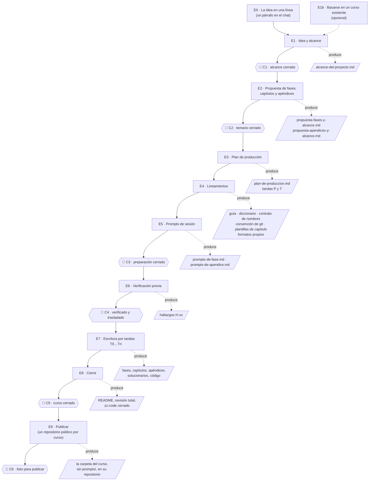
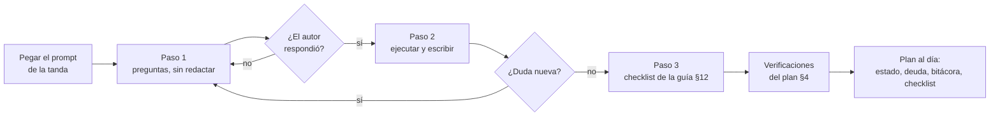
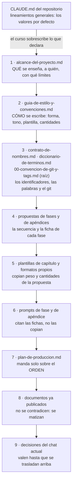

# 🧭 El workflow de un curso

> **Qué es este documento:** el orden en que se diseña, se prepara y se escribe un curso, qué
> documento sale de cada etapa y qué compuerta hay que pasar para entrar en la siguiente.
> **A quién sirve:** a quien abre un curso nuevo y a la sesión de LLM que lo acompaña. La sesión lo
> recibe pegado o como instrucción de lectura en el prompt de cada etapa.

**Salto rápido:** [1](#1-️-el-flujo-en-una-pantalla) · [2](#2--las-reglas-que-atraviesan-todas-las-etapas) · [3](#3--las-etapas-una-por-una) · [4](#4--las-compuertas) · [5](#5--cuando-algo-cambia-a-mitad-de-camino) · [6](#6-️-la-cascada-de-autoridad) · [7](#7--lo-que-se-aprendió-y-por-eso-es-regla)

---

## 1. 🗺️ El flujo en una pantalla



Y dentro de E7, cada tanda repite el mismo ciclo:



Cada flecha punteada lleva al documento que produce la etapa: un archivo de `prompts/` del curso, salvo en E7 y E8, que producen el curso. Cada
🚦 es una **decisión del autor**, no de la sesión: la sesión propone, el autor cierra.

---

## 2. 📏 Las reglas que atraviesan todas las etapas

1. **Una sesión, un entregable.** Cada etapa y cada fase del curso se redacta en su propia sesión y
   produce un archivo (más lo que ese archivo alimenta en la misma tanda: un solucionario, un documento
   vivo). Una sesión que no produce entregable sobra o se salió de alcance.
2. **Protocolo de tres pasos en toda sesión de escritura.** Paso 1: preguntas bloqueantes y lectura de
   la ficha, **sin redactar**. Paso 2: redacción, cuando el autor responde; si aparece una duda nueva,
   se para y se pregunta. Paso 3: autoverificación contra el checklist de la guía, en lista corta.
3. **Arriba primero, nunca al revés.** Si una sesión descubre una contradicción, se corrige en el
   documento de más autoridad (§6) y después en los que cuelgan de él. Parchear la fase y dejar la
   propuesta desactualizada es como empiezan las divergencias que nadie ve hasta la fase doce.
4. **Nada se nombra sin comprobarlo en la misma sesión**: versión, librería, flag, campo de API, URL
   (por código de estado; aterrizar en la portada de la documentación cuenta como roto), libro con
   edición y año. Lo que no se pudo comprobar se declara con esas palabras.
5. **Nada se publica sin haberse ejecutado**, en los cursos que tienen laboratorio. Ningún comando,
   salida o número inventado. Lo que el autor no puede ejecutar (otra plataforma, una cuenta que no
   tiene) se escribe desde la documentación oficial y se marca como no verificado.
6. **Los README y el temario publicado se escriben al final**, en una tanda propia. Hasta entonces el
   mapa del curso es la tabla de estado del plan de producción.
7. **Ningún enlace apunta a un documento que todavía no existe.** La mención va en prosa y se anota
   como deuda de enlaces en el plan; la tanda que escribe el destino la convierte en enlace.
8. **Lo provisional se marca como provisional.** El material de las conversaciones de diseño que no
   es normativo se guarda con el prefijo `_desechable-`: es registro histórico, no se cita y se borra
   al cerrar el curso.
9. **Por defecto, todo secuencial y sin agentes**, a menos que el autor pida lo contrario. Una
   sesión, un documento, en orden, en el hilo principal.
10. **Git lo hace el autor.** La sesión no hace commits ni borra con `git rm`; deja escritos los
    tags que la tanda necesita, con los nombres y la forma de la convención de git del curso.
11. **La máquina del autor no se toca sin permiso**: nada se instala, nada genera cargos, las pruebas
    corren en contenedores etiquetados con el curso y en puertos altos aleatorios (el curso puede
    publicar los de por defecto), y al terminar se borran esos contenedores **con sus volúmenes** y
    nada más.
12. **Todo el código de la sesión va a `zz-code/`**, en un directorio por sesión creado con
    `zz-code/nuevo.py`, y el plan lo registra (§9 del plan). El curso nunca lo cita. Lo efímero
    (logs, salidas, copias) también va ahí, en `salidas/`; ni el scratchpad ni `/tmp`. Los comandos
    sueltos que producen algo citable se copian a un archivo, y el `README.md` del directorio dice cómo
    correr y medir cada prueba, con los comandos y los intermedios que amasan la salida.
13. **Preparar y escribir son sesiones distintas.** Una sesión de `prompts/` no empieza el curso.

Las reglas operativas completas, con su origen, están en
[`03-lecciones-de-produccion.md`](03-lecciones-de-produccion.md).

---

## 3. 🪜 Las etapas, una por una

### E0 — La idea en una línea

**Entrada:** nada más que la intención, o mejor, la ficha llena de
[`plantillas/prompt-de-arranque.md`](plantillas/prompt-de-arranque.md), que se pega en una sesión
nueva y abre la discusión con todas las decisiones de forma de una vez. **Salida:** un párrafo en el
chat con cuatro datos (con la ficha, además, `prompts/ficha-de-arranque.md` con las respuestas
confirmadas y su traducción a `D-xx`):

```text
Tema        → de qué va, en una frase
Tipo        → curso completo | curso legacy | curso repaso | banco de entrevista | banco de examen (01-tipos-de-curso.md)
Lector      → quién es, qué sabe ya y qué no se le explica
Disparador  → por qué ahora: una entrevista, una migración, una certificación, un hueco declarado
```

Si alguno de los cuatro no se puede escribir todavía, la etapa E1 empieza por ahí.

### E1 — Idea y alcance

**Prompt:** [`02-prompts-de-etapa.md` → E1](02-prompts-de-etapa.md#e1--idea-y-alcance).
**Plantilla:** [`plantillas/alcance-del-proyecto.md`](plantillas/alcance-del-proyecto.md).

Es una **conversación**, no un dictado. La sesión propone el problema que resuelve el curso, el
objetivo pedagógico (cinco o seis capacidades verificables), el perfil del lector, la pregunta que
ordena el curso, lo que entra y lo que no, y una lista de decisiones `D-xx` con su valor propuesto.
El autor responde y la sesión reescribe. Se termina cuando el documento dice **qué** enseña el curso
sin depender de nada que todavía no exista.

**E1b — Basarse en un curso existente** (opcional). Si el curso nuevo hereda la forma de otro, antes
de escribir el alcance la sesión hace el inventario de la madre: qué documentos tiene su `prompts/`,
qué se hereda sin cambios, qué diverge y por qué, y qué **no** se puede heredar (nombres fijos del
laboratorio, el dominio, los dueños de concepto). El prompt está en
[`02-prompts-de-etapa.md` → E1b](02-prompts-de-etapa.md#e1b--basarse-en-un-curso-existente). La
herencia queda escrita en el encabezado de la guía (E4) como lista de divergencias declaradas.

### E2 — Propuesta de fases, capítulos y apéndices

**Prompt:** [E2](02-prompts-de-etapa.md#e2--propuesta-de-fases-capítulos-y-apéndices).
**Plantillas:** [`propuesta-fases-y-alcance.md`](plantillas/propuesta-fases-y-alcance.md) y
[`propuesta-apendices-y-alcance.md`](plantillas/propuesta-apendices-y-alcance.md).

Fija el arco (partes o bloques), la secuencia numerada, la **ficha** de cada fase o capítulo (qué
construye y qué trae, o qué cubre y qué desmonta), los nombres de archivo canónicos, el peso o las
horas, la cantidad de preguntas o ejercicios, y el **registro de decisiones** con dónde manda cada
una. La tabla resumen del final es la que copian las plantillas y los prompts.

Se discute en dos vueltas como mínimo: la primera propone el arco y la lista de títulos; la segunda,
con el arco aprobado, escribe las fichas. Escribir fichas sobre un arco no aprobado es trabajo que se
tira.

**Si el tema es bastante extenso**, la primera vuelta empieza un paso antes: propone si el curso cabe
en una sola secuencia (con partes) o conviene dividirlo en **bloques** con directorio propio, cada uno
con sus capítulos, o en **pistas paralelas**, con el criterio que lo justifica y el grafo entre
bloques ([`01-tipos-de-curso.md` §10](01-tipos-de-curso.md#10--cursos-extensos-bloques-y-pistas)). La
división se aprueba antes que la lista de títulos, porque cambia la numeración, los directorios y el
git.

### E3 — Plan de producción

**Prompt:** [E3](02-prompts-de-etapa.md#e3--plan-de-producción).
**Plantilla:** [`plantillas/plan-de-produccion.md`](plantillas/plan-de-produccion.md).

Nace aquí, en cuanto existe la lista de fases, por dos razones: las tandas de escritura (`T`) salen
directamente de la propuesta, y la preparación que falta (guía, diccionario, plantillas, prompts,
verificación) queda registrada como tandas `P` con su checklist en vez de vivir en la memoria del
chat. **Diferencia con los cursos existentes**, que escribieron el plan al final de la preparación: allí
las primeras tandas se reconstruyeron después; aquí se marcan al cerrarlas.

El plan es **operativo y caduca**: se actualiza al cerrar cada sesión (estado, deuda de enlaces,
bitácora y checklist) y se borra al cerrar el curso, con permiso del autor.

### E4 — Lineamientos

**Prompt:** [E4](02-prompts-de-etapa.md#e4--lineamientos), uno por documento.
**Plantillas:** [`guia-de-estilo-y-convenciones.md`](plantillas/guia-de-estilo-y-convenciones.md),
[`diccionario-de-terminos.md`](plantillas/diccionario-de-terminos.md),
[`contrato-de-nombres.md`](plantillas/contrato-de-nombres.md),
[`convencion-de-git-y-tags.md`](plantillas/convencion-de-git-y-tags.md),
[`plantillas-de-capitulo.md`](plantillas/plantillas-de-capitulo.md) y, según el tipo,
[`banco-de-preguntas.md`](plantillas/banco-de-preguntas.md).

En este orden, porque cada uno cita al anterior:

1. **La guía de estilo**, que decide **cómo** se escribe y cierra con el checklist de §12. Si deriva
   de otra, su encabezado dice de cuál y enumera las divergencias.
2. **El diccionario de términos**: qué se queda en inglés, qué se traduce y con qué palabra, y el
   diccionario español → inglés del código del dominio. La guía lo cita; no lo copia.
3. **El contrato de nombres** (si hay laboratorio, código o un sistema de ejemplo): nombres de
   recursos, servicios, archivos, tablas, tags de git. Se congela **antes** de la primera fase.
4. **La convención de git y tags** (en todo curso donde el lector escribe o versiona algo, `D-09`
   distinto de "sin código"): cuántos repositorios tiene el lector, el prefijo de los commits, el tag
   anotado por fase cerrada con el checklist como mensaje y, según el curso, los tags de ejercicio,
   los pares `-roto`/`-fix` de los incidentes y los de deuda. Toma los nombres del contrato. **No va
   en `prompts/`**: se escribe para el lector en la raíz del curso, como `00-convencion-de-git-y-tags.md`,
   se publica con él, y el bloque 🏷️ que cierra cada fase la enlaza. Parte de una regla fija: el curso
   se escribe en el repositorio de cursos, y el lector lo copia a un repositorio propio para hacerlo.
5. **Las plantillas de capítulo**: los esqueletos rígidos de fase o capítulo y el laxo de apéndice.
6. **Los formatos propios** que el curso necesite y que ninguna plantilla cubre: el cuaderno de
   incidentes, el formato de mediciones, el formato de miniproyectos y, **si el curso la lleva**, la
   historia de la empresa ficticia
   ([`plantillas/historia-de-la-empresa.md`](plantillas/historia-de-la-empresa.md)). La historia es
   opcional y la decide el alcance (`D-11`). Se crean como documentos aparte, nunca como
   apéndices de la guía.
7. **El verificador del curso**: se copian `herramientas/verificador_base.py` y
   `herramientas/verificar-corpus.py` al `prompts/` del curso, y la subclase se ajusta a lo que la guía
   acaba de fijar (callouts, bandas, secciones obligatorias, formato del solucionario, el
   `TAG_DE_FASE` de la convención de git) más las validaciones propias. Desde `T0` se corre al cerrar cada tanda.

### E5 — Prompts de sesión

**Prompt:** [E5](02-prompts-de-etapa.md#e5--prompts-de-sesión).
**Plantillas:** [`prompts-de-fase.md`](plantillas/prompts-de-fase.md) y
[`prompts-de-apendice.md`](plantillas/prompts-de-apendice.md).

Un **marco común** (fuentes de verdad en orden, reglas que no se negocian) que va entero en el primer
prompt y se cita en los demás, el **protocolo de tres pasos**, y un bloque por fase con su identidad,
la referencia a su ficha y lo que hay que **vigilar**. **El alcance de cada fase no se copia en el
prompt**: vive en la ficha de la propuesta y el prompt la cita, para que un cambio de ficha no deje
el prompt desactualizado.

### E6 — Verificación previa

**Prompt:** [E6](02-prompts-de-etapa.md#e6--verificación-previa).

Lo que se comprueba una sola vez para no repetirlo en cada tanda: versiones de todo lo que el curso
instala o nombra (con fecha), edición y año de los libros base, URL de la documentación oficial por
concepto, y —si hay laboratorio— un prototipo que demuestre que el método funciona antes de escribir
el primer capítulo. Cada hallazgo lleva un ID (`H1`, `H2`…) y una fecha, y **se traslada** al
documento que lo cita (versiones a su apéndice o a la guía, libros a la guía §10). En un curso sin
laboratorio esta etapa es corta, pero no se salta: los libros y las URL también envejecen.

### E7 — Escritura por tandas

**Prompts:** los de E5, uno por tanda o por fase. **Rutina de cada tanda**, igual en todas:

1. Pegar el prompt y seguir el protocolo de tres pasos.
2. Tener delante el checklist de la guía §12; se recorre **al cerrar cada archivo**, no al final.
3. Releer la ficha de la propuesta: lo que dice es el piso, no el índice.
4. Comprobar versiones, librerías, URL y libros **antes** de escribirlos.
5. Si hay laboratorio, ejecutar y anotar —el error antes de arreglarlo, literal— y después escribir.
6. Escribir en el orden en que los documentos se enlazan; después de cada capítulo, sus respuestas
   en el solucionario.
7. Alimentar los documentos que crecen (solucionario, apéndices de consulta, documentos vivos).
8. Resolver la deuda de enlaces que la tanda cierra.
9. Correr las verificaciones del plan §4.
10. Actualizar el plan: estado, deuda, bitácora y checklist; dejar escritos los tags para el autor.

### E8 — Cierre

**Prompt:** [E8](02-prompts-de-etapa.md#e8--revisión-total-y-cierre).

En este orden: los README (el del curso y los de bloque) y, si el tipo lo usa, `0-ESTRUCTURA-CURSO.md`
con el estado real; la verificación global (enlaces, anclas, sincronía, URL externas); la **revisión
total** —continuidad y coherencia entre documentos, referencias cruzadas con enlace, que no se haya
omitido nada de las fichas, que el curso sea autocontenido—; el **cierre de `zz-code/`**: ningún
directorio del curso queda *vigente* en el plan §9, cada uno tiene su `README.md` completo y
`zz-code/limpiar.py` libera lo regenerable; y la
**limpieza de `prompts/`**, que es mínima: `prompts/` se conserva entero como referencia (no viaja al
repositorio público), y solo se borran los `_desechable-*` y lo que el autor pida, con su permiso.

### E9 — Publicar

**Prompt:** [E9](02-prompts-de-etapa.md#e9--publicar).

Cada curso se publica en **su propio repositorio público**. El autor copia la carpeta del curso **sin
`prompts/`**; antes, la sesión deja la carpeta lista y lo demuestra con el verificador:

```bash
python3 zz-instrucciones/herramientas/verificador_base.py <curso> --perfil=publicacion
```

- `--perfil=publicacion` exige autocontención total: ningún enlace que salga del curso ni que entre
  en `prompts/` (en el repositorio público no existirían), y ninguna mención a material privado:
  `zz-code/`, `zz-instrucciones/`, `_desechable-*`, `Entrevistas/`, `REPASO-*`, `_oskar/`,
  `propuestas-cursos/`.
- Los enlaces entre cursos, que hoy son locales, se convierten en este paso con la herramienta de
  conversión que se cree para el primer curso que se publique (pendiente).

El checklist de E9: el verificador limpio con ese perfil; un README que se sostiene solo (qué es, para
quién, cómo se sigue, qué hace falta instalar); la licencia elegida; ningún secreto ni dato personal en
el código ni en los ejemplos; el `.gitignore` del curso, único y autosuficiente; y el de la raíz del
repositorio público (sistema operativo y editores).

---

## 4. 🚦 Las compuertas

| Compuerta | Se pasa cuando… | Lo comprueba |
|---|---|---|
| **C1** · alcance cerrado | toda `D-xx` de alcance tiene valor y estado ✅; el documento no dice ⏳ sobre nada decidido | el autor |
| **C2** · temario cerrado | cada fase tiene ficha, nombre de archivo canónico, peso o horas, y número de preguntas o ejercicios; la tabla resumen suma | el autor |
| **C3** · preparación cerrada | todas las `D-xx` ✅ y trasladadas a los documentos que mandan sobre ellas; el verificador sin `RESTO` sobre `prompts/` sobre `prompts/` | la sesión, y lo confirma el autor |
| **C4** · verificado | cada hallazgo `H-xx` tiene fecha y destino, y está trasladado | la sesión |
| **C5** · curso cerrado | la verificación global sale limpia, la revisión total no deja pendientes sin destino y ningún directorio de `zz-code/` queda *vigente* | el autor |
| **C6** · listo para publicar | `--perfil=publicacion` sale limpio y el checklist de E9 está completo | el autor, que copia la carpeta sin `prompts/` |

**Ninguna tanda de escritura empieza con su preparación abierta**, pero no hace falta cerrar toda la
preparación para empezar a escribir: el plan dice qué tandas `P` exige cada tanda `T`. La tanda `T0`
(esqueletos) suele poder arrancar con C3; la primera tanda con laboratorio necesita además C4.

---

## 5. 🔁 Cuando algo cambia a mitad de camino

- **Una decisión cerrada cambia:** se reabre en el registro de decisiones de la propuesta (estado
  🔄 y fecha), se cambia en el documento que manda sobre ella, y después en todos los que la citan.
  La bitácora del plan dice qué se tocó.
- **Una fase ya escrita contradice la ficha:** gana la ficha, salvo que la fase haya descubierto algo
  mejor. En ese caso se sube a la propuesta **antes** de cerrar la sesión y la fase se queda como está.
- **Un nombre técnico hace falta y no está en el contrato:** se agrega al contrato primero, nunca se
  improvisa en la fase.
- **Un documento publicado tiene un error que no se puede corregir sin romper otros** (renumerar una
  sección citada por veinte documentos, por ejemplo): se agrega en vez de renumerar, y se documenta la
  excepción en el documento que manda.
- **Hace falta un track opcional nuevo:** sus prompts van en archivos nuevos con su sufijo
  (`prompts-<track>-fase.md`), nunca añadidos a los existentes, para que una sesión del camino base no
  arrastre contexto que no necesita.

---

## 6. 🏛️ La cascada de autoridad

Cuando dos documentos se contradicen, manda el más específico. El `CLAUDE.md` del repositorio trae
los **lineamientos generales**; cada curso los puede sobrescribir en su propio `prompts/`:



**El `CLAUDE.md` da valores por defecto, no techos.** Si dice "20–30 preguntas por capítulo" y un
curso necesita 50, la guía del curso lo declara en su sección de excepciones —la regla que reemplaza,
el valor nuevo y por qué— y desde ese momento manda la guía. **La excepción tiene que ser explícita**:
el silencio significa que el valor por defecto aplica. Así una sesión futura no "arregla" de vuelta lo
que el curso decidió a propósito. Dentro del curso, del 1 al 9, manda el de arriba.

> 📝 **Variante de los repasos:** los cursos de tipo repaso suelen poner la guía por encima del alcance y llevar el
> contenido en un `prompt-base.md` con fichas de capítulo. Es la misma cascada con otros nombres: el
> `prompt-base.md` ocupa el lugar de la propuesta. Lo que importa es que el orden esté escrito en el
> encabezado de cada documento de `prompts/`.

---

## 7. 🪦 Lo que se aprendió, y por eso es regla

- **Escribir en orden de carpeta deja la mitad de los enlaces rotos durante semanas** y los
  solucionarios atrasados. Por eso hay tandas por dependencia y deuda de enlaces.
- **Los solucionarios se desincronizan si se dejan para el final.** Por eso el esqueleto del
  solucionario se crea en `T0` y cada tanda escribe sus respuestas en la misma edición.
- **Entre tandas escritas por inspección y sin ejecutar se acumulan errores reales**, y aplazar la
  ejecución no la ahorra: la acumula donde más cuesta corregirla. Por eso el checklist de tandas de un
  curso con laboratorio tiene dos casillas: *escrita* y *corrida*.
- **Reconstruir un error de memoria produce mensajes que no existen.** Por eso se anota el error
  literal antes de arreglarlo.
- **Los README escritos al principio describen un curso que ya no existe.** Por eso van al final.
- **Los planes de producción meten ruido en un curso publicado** y sus menciones envejecen. Por eso
  ningún documento del curso los cita, y `prompts/` —donde viven, como referencia— no viaja al
  repositorio público.
- **El código de prueba que vivía en el scratchpad se perdía** al cerrar cada sesión, y había que
  reescribirlo. Por eso existe `zz-code/`.
- **Una prueba sin instrucciones no se puede repetir**, y los comandos que solo corrieron en la
  terminal quedan solo en la transcripción. Por eso cada directorio de `zz-code/` lleva un `README.md`
  de corrida y medición, y lo citable se copia a un archivo (rescate de
  `lab-docker-kubernetes`).
- **Un enlace a `prompts/` desde una fase se rompe al publicar**, porque `prompts/` no viaja. Por eso
  la convención de git, que el lector necesita, va en la raíz del curso con un nombre fijo
  (`00-convencion-de-git-y-tags.md`), y se escribe en E4, antes de las plantillas de capítulo que la
  enlazan.
- **Un curso que cita a otro deja de poder copiarse a otra carpeta.** Por eso la autocontención es una
  decisión explícita del alcance (ver la `D-03` de la plantilla).
